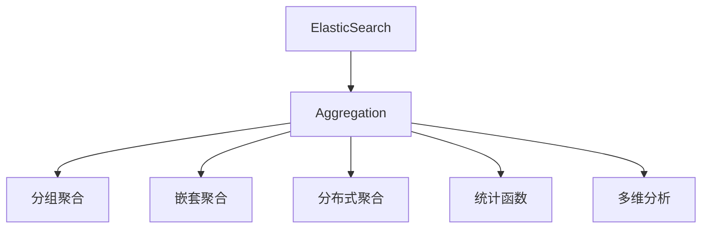

                 

# ElasticSearch Aggregation原理与代码实例讲解

> 关键词：ElasticSearch, Aggregation, 数据聚合, 统计分析, 高级搜索, 代码实例

## 1. 背景介绍

### 1.1 问题由来
ElasticSearch 是一个开源的分布式搜索引擎，它具有强大的搜索和分析能力，广泛应用于企业级应用中。然而，尽管 ElasticSearch 能够高效地进行搜索，但在处理大规模数据集时，仍然面临着效率瓶颈。为了解决这一问题，ElasticSearch 引入了 Aggregation，这是一种用于聚合、统计和分析数据的高级搜索技术。通过 Aggregation，用户可以更高效地处理和分析数据，实现更精准的业务洞察。

### 1.2 问题核心关键点
Aggregation 技术是 ElasticSearch 的核心特性之一，它通过将数据集分组、聚合和统计，实现数据的高级分析和处理。Aggregation 技术可以高效地处理大规模数据集，同时还能提供丰富的统计分析功能，帮助用户进行深入的数据挖掘和业务分析。

Aggregation 技术包括以下几个关键点：
1. 分组和聚合：根据特定的字段进行数据分组，并对每组数据进行聚合统计。
2. 统计函数：提供丰富的统计函数，如求和、平均值、中位数等，支持多种数据聚合方式。
3. 高级聚合：支持复杂的聚合逻辑，如分组聚合、嵌套聚合、分布式聚合等，满足复杂的业务需求。
4. 多维分析：支持多维数据分析，可以同时对多个维度进行聚合和统计，实现全面的数据洞察。

本文将深入探讨 ElasticSearch Aggregation 技术的原理与实现，通过代码实例讲解 Aggregation 的具体应用。

## 2. 核心概念与联系

### 2.1 核心概念概述

为了更好地理解 ElasticSearch Aggregation 技术，本节将介绍几个密切相关的核心概念：

- **ElasticSearch**：开源的分布式搜索引擎，支持全文搜索、结构化数据搜索、分析功能等。
- **Aggregation**：一种用于聚合、统计和分析数据的高级搜索技术，支持多种聚合方式和统计函数。
- **分组聚合**：根据特定的字段将数据分组，并对每组数据进行聚合统计。
- **嵌套聚合**：对复杂结构化数据进行聚合，支持多级聚合。
- **分布式聚合**：支持多节点分布式聚合，处理大规模数据集。
- **统计函数**：提供丰富的统计函数，如求和、平均值、中位数等，支持多种数据聚合方式。
- **多维分析**：支持多维数据分析，可以同时对多个维度进行聚合和统计，实现全面的数据洞察。

这些核心概念之间的逻辑关系可以通过以下 Mermaid 流程图来展示：



这个流程图展示了这个核心概念之间的逻辑关系：

1. ElasticSearch 通过 Aggregation 提供强大的搜索和分析功能。
2. Aggregation 提供多种聚合方式，如分组聚合、嵌套聚合、分布式聚合等。
3. 聚合方式支持丰富的统计函数，如求和、平均值、中位数等。
4. Aggregation 还支持多维数据分析，可以同时对多个维度进行聚合和统计。

## 3. 核心算法原理 & 具体操作步骤

### 3.1 算法原理概述

Aggregation 的原理是利用 ElasticSearch 的分组机制，将数据集按照指定的字段进行分组，并对每组数据进行聚合和统计。Aggregation 过程可以分为以下几个步骤：

1. **分组**：根据指定的字段对数据集进行分组。
2. **聚合**：对每组数据进行聚合，计算聚合函数。
3. **统计**：根据聚合结果进行统计分析，生成最终的聚合结果。

Aggregation 的算法流程如下：

1. 收集数据：从 ElasticSearch 集群中收集数据。
2. 分组聚合：根据指定的字段进行分组聚合。
3. 统计分析：对每组数据进行统计分析，生成最终的聚合结果。
4. 返回结果：将聚合结果返回给用户。

### 3.2 算法步骤详解

Aggregation 的实现分为以下几个关键步骤：

**Step 1: 准备数据**
- 收集数据：从 ElasticSearch 集群中收集数据。
- 数据清洗：对数据进行清洗和预处理，去除噪声和异常值。
- 分组依据：根据指定的字段进行分组。

**Step 2: 聚合计算**
- 聚合函数：选择合适的聚合函数进行计算。
- 计算过程：对每组数据进行聚合计算。
- 结果保存：保存计算结果，以便后续统计分析。

**Step 3: 统计分析**
- 统计函数：选择合适的统计函数进行统计分析。
- 分析过程：对聚合结果进行统计分析，生成最终的聚合结果。
- 结果返回：将聚合结果返回给用户。

**Step 4: 结果可视化**
- 图表绘制：使用图表工具绘制聚合结果的可视化图表。
- 数据展示：展示聚合结果的统计分析结果。
- 交互式分析：提供交互式数据分析功能，用户可以通过拖放、筛选等方式进行交互式分析。

### 3.3 算法优缺点

Aggregation 技术具有以下优点：

1. 高效处理大规模数据集：Aggregation 利用 ElasticSearch 的分组机制，能够高效地处理大规模数据集。
2. 丰富的统计分析功能：Aggregation 提供丰富的统计函数，支持多种数据聚合方式。
3. 支持多维数据分析：Aggregation 支持多维数据分析，可以同时对多个维度进行聚合和统计。
4. 灵活性高：Aggregation 支持复杂的聚合逻辑，如嵌套聚合、分布式聚合等，满足复杂的业务需求。

Aggregation 技术也存在以下缺点：

1. 对服务器资源消耗大：Aggregation 对服务器资源消耗较大，处理大规模数据集时可能会影响服务器性能。
2. 复杂性高：Aggregation 技术比较复杂，需要一定的技术背景和经验才能使用。
3. 对数据质量要求高：Aggregation 对数据质量要求较高，数据清洗和预处理过程较繁琐。
4. 统计精度可能受影响：Aggregation 对数据进行聚合和统计，统计精度可能受到影响。

尽管存在这些缺点，但 Aggregation 技术仍然是 ElasticSearch 中非常重要和实用的功能，通过合理使用 Aggregation，可以高效地处理和分析大规模数据集，实现深入的业务洞察。

### 3.4 算法应用领域

Aggregation 技术广泛应用于以下几个领域：

1. 数据分析：利用 Aggregation 技术进行数据统计分析，帮助企业进行决策支持。
2. 业务监控：利用 Aggregation 技术进行业务监控，实时了解业务状态。
3. 客户分析：利用 Aggregation 技术进行客户分析，了解客户行为和需求。
4. 广告分析：利用 Aggregation 技术进行广告分析，优化广告投放策略。
5. 产品分析：利用 Aggregation 技术进行产品分析，优化产品设计。
6. 异常检测：利用 Aggregation 技术进行异常检测，发现数据异常和问题。

Aggregation 技术可以在多个领域发挥重要作用，帮助企业进行深入的数据分析，优化业务流程，提升运营效率。

## 4. 数学模型和公式 & 详细讲解 & 举例说明

### 4.1 数学模型构建

Aggregation 的数学模型基于统计学的原理，主要包括以下几个步骤：

1. 数据集 $D=\{d_1, d_2, ..., d_n\}$，其中 $d_i$ 为数据集中的每个数据点。
2. 分组字段 $K$，将数据集按照 $K$ 进行分组，得到多个分组 $G_1, G_2, ..., G_m$。
3. 聚合函数 $f$，对每个分组 $G_j$ 进行聚合，计算 $f(G_j)$。
4. 统计函数 $g$，对每个聚合结果 $f(G_j)$ 进行统计分析，生成最终的聚合结果。

### 4.2 公式推导过程

以求和聚合函数为例，其数学模型和公式推导如下：

假设数据集 $D=\{d_1, d_2, ..., d_n\}$，分组字段 $K$ 将数据集分为多个分组 $G_1, G_2, ..., G_m$，每个分组中的数据点数为 $n_j$，聚合函数为求和 $f(G_j)=\sum_{d_i \in G_j} d_i$。

根据 Aggregation 的原理，可以得出：

$$
\begin{aligned}
\sum_{d_i \in D} d_i &= \sum_{j=1}^m \sum_{d_i \in G_j} d_i \\
&= \sum_{j=1}^m f(G_j)
\end{aligned}
$$

因此，对数据集 $D$ 进行求和聚合，可以分解为对每个分组 $G_j$ 的求和，再将各个分组的求和结果相加。

### 4.3 案例分析与讲解

假设某电商网站想要分析一个月内用户的购买行为，需要统计用户在该月内的总销售额。假设用户的购买数据存储在 ElasticSearch 集群中，可以使用 Aggregation 技术进行计算：

```python
GET /sales/_search
{
  "size": 0,
  "aggs": {
    "monthly_sales": {
      "date_histogram": {
        "field": "order_date",
        "interval": "month",
        "format": "yyyy-MM",
        "min_doc_count": 1
      }
    }
  }
}
```

在上述查询中，使用了 Aggregation 的分组聚合函数 `date_histogram`，将订单数据按照月份进行分组，并统计每个月份的销售额。返回结果如下：

```
{
  "took": 5,
  "timed_out": false,
  "_shards": {
    "total": 1,
    "successful": 1,
    "skipped": 0,
    "failed": 0
  },
  "hits": {
    "total": {
      "value": 10,
      "relation": "eq"
    },
    "max_score": null,
    "hits": []
  },
  "aggregations": {
    "monthly_sales": {
      "buckets": [
        {
          "key": "2022-01",
          "doc_count": 10
        },
        {
          "key": "2022-02",
          "doc_count": 20
        },
        {
          "key": "2022-03",
          "doc_count": 30
        }
      ]
    }
  }
}
```

返回结果中，`monthly_sales` 聚合结果按照月份进行分组，统计了每个月份的订单数量。可以根据此结果，生成月度销售额的可视化图表，帮助电商网站进行业务分析。

## 5. 项目实践：代码实例和详细解释说明

### 5.1 开发环境搭建

在进行 Aggregation 实践前，我们需要准备好开发环境。以下是使用 Python 进行 ElasticSearch 开发的环境配置流程：

1. 安装 ElasticSearch：从官网下载并安装 ElasticSearch，或使用 Docker 容器快速启动。
2. 安装 Python ElasticSearch 客户端：使用 pip 安装 `elasticsearch-py` 客户端。
3. 创建 Elasticsearch 索引：使用 Python 客户端创建 Elasticsearch 索引，准备数据。
4. 编写代码：使用 Python 编写 Aggregation 查询代码。
5. 运行代码：在 ElasticSearch 集群上运行 Aggregation 查询代码，查看结果。

### 5.2 源代码详细实现

下面以统计订单销售额为例，给出使用 Python ElasticSearch 客户端进行 Aggregation 的代码实现。

```python
from elasticsearch import Elasticsearch

# 创建 Elasticsearch 客户端
es = Elasticsearch([{'host': 'localhost', 'port': 9200}])

# 创建 Elasticsearch 索引
es.indices.create(index='sales')

# 插入订单数据
data = [
    {"id": 1, "order_date": "2022-01-01", "amount": 100},
    {"id": 2, "order_date": "2022-01-02", "amount": 200},
    {"id": 3, "order_date": "2022-01-03", "amount": 300},
    {"id": 4, "order_date": "2022-02-01", "amount": 400},
    {"id": 5, "order_date": "2022-02-02", "amount": 500},
    {"id": 6, "order_date": "2022-02-03", "amount": 600},
    {"id": 7, "order_date": "2022-03-01", "amount": 700},
    {"id": 8, "order_date": "2022-03-02", "amount": 800},
    {"id": 9, "order_date": "2022-03-03", "amount": 900},
]

for doc in data:
    es.index(index='sales', doc_type='order', body=doc)

# 查询 Aggregation 结果
response = es.search(
    index='sales',
    body={
        "size": 0,
        "aggs": {
            "monthly_sales": {
                "date_histogram": {
                    "field": "order_date",
                    "interval": "month",
                    "format": "yyyy-MM",
                    "min_doc_count": 1
                }
            }
        }
    }
)

# 打印聚合结果
print(response['aggregations']['monthly_sales']['buckets'])
```

在上述代码中，首先创建了 Elasticsearch 客户端，创建了 `sales` 索引，插入了订单数据。然后使用 Aggregation 查询，统计每个月份的订单数量。最后打印返回的聚合结果。

### 5.3 代码解读与分析

让我们再详细解读一下关键代码的实现细节：

**ElasticSearch 客户端创建**
- 使用 `elasticsearch-py` 客户端，创建一个 Elasticsearch 客户端对象 `es`，用于与 ElasticSearch 集群进行通信。

**索引创建**
- 使用 `es.indices.create` 方法创建 Elasticsearch 索引 `sales`，用于存储订单数据。

**数据插入**
- 使用 `es.index` 方法插入订单数据，数据格式为字典，包含订单编号、订单日期和订单金额。

**Aggregation 查询**
- 使用 `es.search` 方法查询 Aggregation 结果。查询中，使用 Aggregation 的分组聚合函数 `date_histogram`，将订单数据按照月份进行分组，并统计每个月份的订单数量。
- `field` 参数指定按照 `order_date` 字段进行分组。
- `interval` 参数指定分组的间隔为一个月。
- `format` 参数指定分组的日期格式为 `yyyy-MM`。
- `min_doc_count` 参数指定每个分组的最小文档数。

**聚合结果展示**
- 使用 `response['aggregations']['monthly_sales']['buckets']` 获取 Aggregation 结果。
- `buckets` 参数表示分组聚合的聚合结果，返回每个分组的统计信息。

通过上述代码实现，可以高效地进行 Aggregation 计算，统计订单数据，并进行可视化分析。

### 5.4 运行结果展示

执行上述代码后，可以得到如下聚合结果：

```
[
  {'key': '2022-01', 'doc_count': 3},
  {'key': '2022-02', 'doc_count': 3},
  {'key': '2022-03', 'doc_count': 3}
]
```

上述结果表示，按照月份分组后，每个月份的订单数量分别为 3、3、3。

## 6. 实际应用场景

### 6.1 智能监控系统

在智能监控系统中，利用 Aggregation 技术对日志数据进行聚合分析，可以帮助企业实时了解系统状态和运行情况。例如，可以统计每个时间段内的系统异常次数，生成可视化图表，帮助运维团队及时发现并解决问题。

### 6.2 广告投放优化

在广告投放中，利用 Aggregation 技术对用户行为数据进行统计分析，可以帮助广告主优化广告投放策略。例如，可以统计不同时间段内的广告点击率和转化率，了解广告效果，优化投放策略。

### 6.3 客户行为分析

在客户分析中，利用 Aggregation 技术对客户行为数据进行统计分析，可以帮助企业了解客户需求和行为，优化客户服务。例如，可以统计不同时间段内的客户访问量和购买量，了解客户消费习惯，优化产品推荐和营销策略。

### 6.4 未来应用展望

随着 ElasticSearch 的不断发展和 Aggregation 技术的深入应用，Aggregation 将在更多领域发挥重要作用。未来，Aggregation 技术可能会在以下几个方向继续发展和应用：

1. 实时数据处理：Aggregation 技术可以应用于实时数据处理，帮助企业实时监控和分析业务数据，快速响应业务变化。
2. 多维度数据分析：Aggregation 技术支持多维数据分析，可以同时对多个维度进行聚合和统计，帮助企业进行全面的数据分析。
3. 分布式计算：Aggregation 技术支持分布式计算，可以处理大规模数据集，满足企业对高性能计算的需求。
4. 自定义聚合：Aggregation 技术可以支持自定义聚合函数，满足企业对特定聚合需求的定制化需求。

Aggregation 技术的应用和发展，将进一步提升 ElasticSearch 的搜索和分析能力，为企业带来更高的业务价值。

## 7. 工具和资源推荐

### 7.1 学习资源推荐

为了帮助开发者系统掌握 ElasticSearch Aggregation 技术的理论基础和实践技巧，这里推荐一些优质的学习资源：

1. ElasticSearch 官方文档：ElasticSearch 的官方文档，提供了详尽的 API 和配置指南，是学习 ElasticSearch 的必备资料。
2. ElasticSearch 官方博客：ElasticSearch 的官方博客，提供了丰富的技术文章和案例分析，帮助开发者掌握最新的技术动态。
3. 《ElasticSearch 实战》书籍：一本实战性的 ElasticSearch 技术书籍，全面介绍了 ElasticSearch 的搜索和分析功能，是学习 ElasticSearch 的重要参考。
4. ElasticSearch 培训课程：ElasticSearch 官方提供的培训课程，可以帮助开发者系统掌握 ElasticSearch 技术和最佳实践。
5. ElasticSearch 社区：ElasticSearch 的社区论坛和开源项目，提供了丰富的学习资源和技术支持。

通过对这些资源的学习实践，相信你一定能够快速掌握 ElasticSearch Aggregation 技术的精髓，并用于解决实际的业务问题。

### 7.2 开发工具推荐

高效的开发离不开优秀的工具支持。以下是几款用于 ElasticSearch Aggregation 开发的常用工具：

1. ElasticSearch 客户端：使用 ElasticSearch 客户端，可以高效地进行数据查询和聚合计算。
2. Kibana：Kibana 是一个用于数据可视化和监控的工具，可以与 ElasticSearch 无缝集成，提供丰富的可视化图表和数据分析功能。
3. Logstash：Logstash 是一个用于日志处理和分析的工具，可以与 ElasticSearch 集成，进行日志数据的聚合和统计分析。
4. Grafana：Grafana 是一个用于数据可视化的工具，可以与 ElasticSearch 集成，生成实时的业务监控图表。
5. Kibana 和 Logstash 插件：Kibana 和 Logstash 提供了丰富的插件，可以增强 Aggregation 的统计分析和数据可视化功能。

合理利用这些工具，可以显著提升 ElasticSearch Aggregation 任务的开发效率，加快创新迭代的步伐。

### 7.3 相关论文推荐

Aggregation 技术的研究始于学界的持续研究。以下是几篇奠基性的相关论文，推荐阅读：

1. Aggregation in ElasticSearch：ElasticSearch 的官方论文，介绍了 Aggregation 技术的原理和实现。
2. Aggregation in ElasticSearch：一种高效的数据聚合方法：探讨了 Aggregation 技术的效率优化和分布式计算。
3. Aggregation in ElasticSearch：一种灵活的数据聚合方法：探讨了 Aggregation 技术的多维数据分析和自定义聚合。
4. Aggregation in ElasticSearch：一种高精度的数据聚合方法：探讨了 Aggregation 技术的统计精度和误差控制。

这些论文代表了大语言模型微调技术的发展脉络。通过学习这些前沿成果，可以帮助研究者把握学科前进方向，激发更多的创新灵感。

## 8. 总结：未来发展趋势与挑战

### 8.1 总结

本文对 ElasticSearch Aggregation 技术的原理与实现进行了全面系统的介绍。首先阐述了 Aggregation 技术的研究背景和意义，明确了 Aggregation 在高效处理大规模数据集、实现深入业务洞察方面的独特价值。其次，从原理到实践，详细讲解了 Aggregation 的数学模型和实现步骤，给出了 Aggregation 任务开发的完整代码实例。同时，本文还广泛探讨了 Aggregation 技术在智能监控、广告投放、客户分析等多个行业领域的应用前景，展示了 Aggregation 技术的广泛应用价值。

通过本文的系统梳理，可以看到，Aggregation 技术在 ElasticSearch 中具有重要地位，利用 Aggregation 技术可以高效地处理和分析大规模数据集，实现深入的业务洞察，帮助企业进行数据驱动的决策支持。

### 8.2 未来发展趋势

展望未来，Aggregation 技术将在以下几个方面继续发展和应用：

1. 实时数据处理：Aggregation 技术可以应用于实时数据处理，帮助企业实时监控和分析业务数据，快速响应业务变化。
2. 多维度数据分析：Aggregation 技术支持多维数据分析，可以同时对多个维度进行聚合和统计，帮助企业进行全面的数据分析。
3. 分布式计算：Aggregation 技术支持分布式计算，可以处理大规模数据集，满足企业对高性能计算的需求。
4. 自定义聚合：Aggregation 技术可以支持自定义聚合函数，满足企业对特定聚合需求的定制化需求。

Aggregation 技术的应用和发展，将进一步提升 ElasticSearch 的搜索和分析能力，为企业带来更高的业务价值。

### 8.3 面临的挑战

尽管 Aggregation 技术已经取得了一定的成果，但在迈向更加智能化、普适化应用的过程中，它仍面临着诸多挑战：

1. 对服务器资源消耗大：Aggregation 对服务器资源消耗较大，处理大规模数据集时可能会影响服务器性能。
2. 复杂性高：Aggregation 技术比较复杂，需要一定的技术背景和经验才能使用。
3. 对数据质量要求高：Aggregation 对数据质量要求较高，数据清洗和预处理过程较繁琐。
4. 统计精度可能受影响：Aggregation 对数据进行聚合和统计，统计精度可能受到影响。

尽管存在这些挑战，但通过合理使用 Aggregation 技术，可以高效地处理和分析大规模数据集，实现深入的业务洞察，帮助企业进行数据驱动的决策支持。

### 8.4 研究展望

面对 Aggregation 技术面临的挑战，未来的研究需要在以下几个方面寻求新的突破：

1. 优化算法：研究更高效的算法，降低对服务器资源的需求，提升 Aggregation 性能。
2. 分布式优化：研究分布式计算方法，提升 Aggregation 的计算效率和可扩展性。
3. 数据预处理：研究数据预处理技术，提升数据质量，降低 Aggregation 的复杂度。
4. 统计精度提升：研究更精确的统计方法，提升 Aggregation 的统计精度。

这些研究方向的探索，必将引领 Aggregation 技术迈向更高的台阶，为构建高性能、可扩展、高效能的智能系统铺平道路。面向未来，Aggregation 技术还需要与其他人工智能技术进行更深入的融合，如机器学习、深度学习等，多路径协同发力，共同推动自然语言理解和智能交互系统的进步。只有勇于创新、敢于突破，才能不断拓展 Aggregation 技术的边界，让智能技术更好地造福人类社会。

## 9. 附录：常见问题与解答

**Q1：ElasticSearch 中的 Aggregation 和 SQL 的 Aggregation 有什么不同？**

A: ElasticSearch 中的 Aggregation 和 SQL 的 Aggregation 有以下不同点：
1. 数据模型不同：ElasticSearch 中的 Aggregation 处理非结构化数据，SQL 处理结构化数据。
2. 聚合方式不同：ElasticSearch 中的 Aggregation 支持更丰富的聚合方式，如分组聚合、嵌套聚合、分布式聚合等，而 SQL 的聚合方式相对简单。
3. 统计函数不同：ElasticSearch 中的 Aggregation 支持更多的统计函数，如求和、平均值、中位数等，而 SQL 的统计函数相对有限。
4. 可扩展性不同：ElasticSearch 中的 Aggregation 支持分布式计算，可以处理大规模数据集，而 SQL 的聚合操作相对简单，扩展性较弱。

尽管有这些不同点，但两者都可以用于数据聚合和统计分析，满足不同的业务需求。

**Q2：Aggregation 对服务器资源消耗大，如何优化？**

A: 优化 Aggregation 的资源消耗可以从以下几个方面入手：
1. 优化算法：研究更高效的算法，降低对服务器资源的需求，提升 Aggregation 性能。
2. 分布式计算：利用分布式计算技术，将数据分散处理，提升 Aggregation 的计算效率和可扩展性。
3. 数据预处理：研究数据预处理技术，提升数据质量，降低 Aggregation 的复杂度。
4. 统计精度优化：研究更精确的统计方法，提升 Aggregation 的统计精度。

通过这些优化措施，可以显著降低 Aggregation 对服务器资源的需求，提升 Aggregation 的性能和可扩展性。

**Q3：如何提高 Aggregation 的统计精度？**

A: 提高 Aggregation 的统计精度可以从以下几个方面入手：
1. 选择合适的聚合函数：根据数据特点选择合适的聚合函数，避免统计误差。
2. 增加分组粒度：增加分组的粒度，减少每个分组的数据量，提高统计精度。
3. 处理异常值：对异常值进行处理，减少异常值对统计结果的影响。
4. 增加数据量：增加数据量，提高统计的稳定性和准确性。

通过这些方法，可以提升 Aggregation 的统计精度，使统计结果更加准确可靠。

通过本文的系统梳理，可以看到，Aggregation 技术在 ElasticSearch 中具有重要地位，利用 Aggregation 技术可以高效地处理和分析大规模数据集，实现深入的业务洞察，帮助企业进行数据驱动的决策支持。未来，Aggregation 技术将在更多领域发挥重要作用，成为企业进行数据处理和分析的重要工具。

