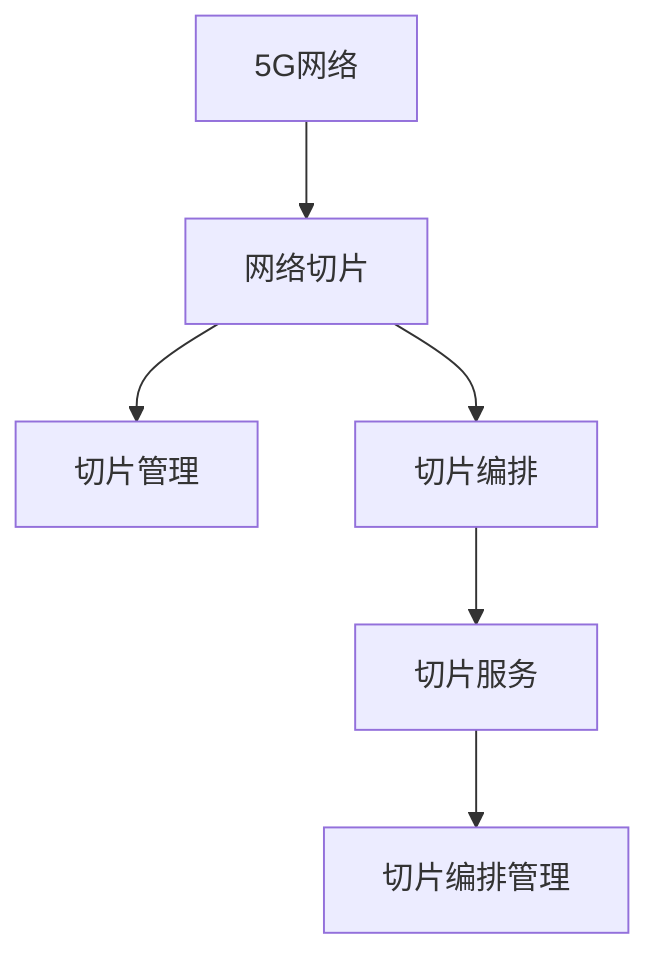

                 

# 5G网络切片：为垂直行业定制网络服务

## 1. 背景介绍

### 1.1 问题由来
5G作为下一代无线通信技术，其显著的带宽、低延迟、高可靠性等特点，使得其在众多垂直行业得到广泛应用，如智慧城市、工业互联网、自动驾驶、远程医疗等。但与此同时，不同行业对网络资源的需求存在巨大差异，统一的网络服务难以满足其复杂而特定的需求。因此，如何为不同垂直行业定制差异化的网络服务，成为亟待解决的问题。

### 1.2 问题核心关键点
5G网络切片技术能够将一个共享的网络资源划分为多个逻辑上相互独立的网络实例，每个实例具有特定性能保障、隔离性等属性，满足不同垂直行业的需求。5G网络切片通过将网络资源动态分配给不同行业应用，提供定制化的网络服务，大大提升了网络资源的利用效率和灵活性。

### 1.3 问题研究意义
5G网络切片技术是5G网络实现多样化服务的重要手段，其研究与应用对推动5G网络的普及和深化有重要意义：

1. **提升资源利用效率**：通过网络切片技术，网络资源可以根据不同行业的需求进行精细化分配，避免资源浪费。
2. **增强网络灵活性**：动态调整网络参数，支持多用户、多场景的网络配置。
3. **促进行业创新**：不同垂直行业的定制化网络服务，可以加速行业数字化转型，创造新的业务模式。
4. **保障网络安全**：通过隔离和分离网络实例，降低行业间的干扰和攻击风险。
5. **推动业务发展**：为垂直行业提供专属的、高性能的网络服务，提升用户体验和业务承载力。

## 2. 核心概念与联系

### 2.1 核心概念概述

为更好地理解5G网络切片技术，本节将介绍几个密切相关的核心概念：

- **5G网络**：新一代无线通信网络，支持更高的数据速率、更低的延迟、更大的连接密度，是当前通信技术发展的最高形态。
- **网络切片**：将一个共享的网络资源划分为多个虚拟网络实例，每个实例独立运行，满足特定需求，提升网络资源利用效率。
- **切片管理**：通过切片管理模块，动态调整和分配网络资源，提供定制化网络服务。
- **切片编排**：通过网络切片编排，将网络切片与上层业务进行关联，实现自动化的切片生命周期管理。
- **切片服务**：提供给上层业务的实际网络服务，由切片管理与切片编排共同支撑。
- **切片编排管理**：切片的生命周期管理，包括切片的创建、更新、删除等操作。

这些核心概念之间的逻辑关系可以通过以下Mermaid流程图来展示：



这个流程图展示了大语言模型的核心概念及其之间的关系：

1. 5G网络通过网络切片技术将资源划分，每个切片独立运行，满足特定需求。
2. 切片管理通过动态调整，分配网络资源，提供定制化服务。
3. 切片编排将切片与上层业务关联，实现自动管理。
4. 切片服务提供给上层应用，是切片的实际网络服务。
5. 切片编排管理负责切片的生命周期，包括创建、更新、删除等操作。

## 3. 核心算法原理 & 具体操作步骤
### 3.1 算法原理概述

5G网络切片技术基于虚拟化、弹性网络、边缘计算等先进技术，通过对网络资源进行精细化划分和管理，实现对不同垂直行业的定制化网络服务。其核心思想是将网络资源进行切片，每个切片具有独立的网络资源、隔离性、特定性能指标等属性，从而满足不同垂直行业对网络资源的不同需求。

### 3.2 算法步骤详解

5G网络切片的实现主要分为以下几个关键步骤：

**Step 1: 切片划分与资源分配**

- 根据业务需求，定义切片的性能指标（如带宽、延迟、时延抖动等）和隔离需求（如安全隔离、流量隔离等）。
- 将5G网络资源（如频谱资源、核心网和接入网资源等）划分为多个切片实例，每个实例独立运行，满足特定需求。
- 根据切片需求动态调整资源，实现动态分配。

**Step 2: 切片编排与实例管理**

- 通过切片编排模块，将切片实例与上层业务关联，实现自动化切片生命周期管理。
- 切片编排模块支持切片的创建、更新、删除等操作，确保切片服务的高可用性和灵活性。
- 通过切片编排管理模块，实现切片实例的自动化部署、配置和监控。

**Step 3: 切片管理与资源优化**

- 切片管理模块实时监控切片实例的性能指标和资源使用情况。
- 根据性能指标和资源使用情况，动态调整切片实例的资源配置，优化网络性能。
- 支持流量控制、负载均衡等优化措施，提高网络资源利用效率。

**Step 4: 切片服务与上层应用**

- 切片服务提供给上层应用，如智慧城市、工业互联网、自动驾驶等。
- 切片服务具有特定性能保障、隔离性等属性，满足上层应用对网络资源的需求。
- 支持上层应用的QoS（服务质量）保障，确保应用服务的高效性和稳定性。

### 3.3 算法优缺点

5G网络切片技术具有以下优点：

1. **提升资源利用效率**：通过精细化网络资源分配，避免资源浪费，提升网络资源利用效率。
2. **增强网络灵活性**：动态调整网络参数，支持多用户、多场景的网络配置。
3. **促进行业创新**：不同垂直行业的定制化网络服务，加速行业数字化转型，创造新的业务模式。
4. **保障网络安全**：通过隔离和分离网络实例，降低行业间的干扰和攻击风险。
5. **推动业务发展**：为垂直行业提供专属的、高性能的网络服务，提升用户体验和业务承载力。

同时，该技术也存在一定的局限性：

1. **复杂度增加**：切片管理、编排和编排管理需要更复杂的系统设计和维护。
2. **资源消耗增加**：切片划分和管理需要额外的计算和存储资源。
3. **标准化问题**：不同垂直行业的切片定义和需求各异，标准化难度较大。
4. **部署成本高**：初始建设和运维成本较高，需要投入大量的人力和物力。
5. **安全性风险**：切片隔离效果不足，可能存在潜在的攻击和数据泄露风险。

尽管存在这些局限性，但就目前而言，5G网络切片技术仍是大规模、复杂化网络需求的重要解决方案，其研究与应用前景广阔。

### 3.4 算法应用领域

5G网络切片技术已经在多个垂直行业得到了广泛应用，以下是几个典型的应用场景：

- **智慧城市**：通过网络切片技术，提供专用的城市管理网络和视频监控网络，保障城市运行安全和管理效率。
- **工业互联网**：为工业企业提供专用的5G工业网络，实现设备互联和数据采集，提升生产自动化水平。
- **自动驾驶**：提供低延迟、高可靠性的专用网络切片，支持车辆间的实时通信和数据交换，确保行车安全。
- **远程医疗**：提供高带宽、低延迟的网络切片，支持远程诊断和医疗数据传输，提升医疗服务水平。
- **智能制造**：提供定制化的网络服务，支持智能设备之间的协同工作，优化生产流程。

除了上述这些应用场景，5G网络切片还在众多行业领域得到了创新性的应用，如智能电网、智能家居、智能交通等，为各行业数字化转型提供了强有力的技术支持。

## 4. 数学模型和公式 & 详细讲解 & 举例说明

### 4.1 数学模型构建

5G网络切片的实现涉及到网络资源的管理、切片实例的编排、性能指标的监控等多个方面。以下将构建一个简化的数学模型来描述网络切片的资源分配和管理过程。

假设5G网络资源共有 $N$ 个切片实例，每个实例具有带宽 $b_i$ 和延迟 $d_i$ 等性能指标，切片实例的需求带宽为 $R_i$，延迟为 $T_i$。通过网络切片管理模块，根据需求和资源情况，动态调整资源分配，最小化切片资源分配成本 $C$，同时满足每个切片的需求 $R_i \leq b_i$ 和 $T_i \leq d_i$。

数学模型可以表示为：

$$
\min_{b_i,d_i} C = \sum_{i=1}^N c_{b_i} + c_{d_i}\\
s.t. \quad R_i \leq b_i, T_i \leq d_i, \quad i=1,2,\cdots,N
$$

其中 $c_{b_i}$ 和 $c_{d_i}$ 表示带宽和延迟的单位成本。

### 4.2 公式推导过程

为了求解上述数学模型，我们引入拉格朗日乘子法，构造拉格朗日函数：

$$
\mathcal{L}(b_i,d_i,\lambda_i) = C + \sum_{i=1}^N \lambda_i (R_i - b_i)
$$

根据拉格朗日乘子法，我们对 $b_i$ 和 $d_i$ 求偏导数并令其等于0，得：

$$
\frac{\partial \mathcal{L}}{\partial b_i} = c_{b_i} + \lambda_i = 0\\
\frac{\partial \mathcal{L}}{\partial d_i} = c_{d_i} + \lambda_i = 0\\
\frac{\partial \mathcal{L}}{\partial \lambda_i} = R_i - b_i = 0
$$

解以上方程组，得到 $b_i = R_i$ 和 $d_i = T_i$。将 $b_i$ 和 $d_i$ 代入成本函数 $C$，可得最优解：

$$
C^* = \sum_{i=1}^N c_{b_i} b_i + c_{d_i} d_i = \sum_{i=1}^N c_{b_i} R_i + c_{d_i} T_i
$$

### 4.3 案例分析与讲解

以智慧城市中的视频监控网络为例，说明5G网络切片的资源分配和管理过程。

智慧城市中的视频监控网络对带宽和延迟有较高要求，需要提供专用的切片实例。通过切片管理模块，定义监控网络的性能指标为带宽 $b_i = 5Gbps$ 和延迟 $d_i = 10ms$。根据需求，监控网络需要满足不同区域的视频监控任务，如高分辨率视频流、实时回放等，需求带宽为 $R_i$，延迟为 $T_i$。假设不同区域的监控需求如表所示：

| 区域 | 需求带宽 | 需求延迟 |
| ---- | -------- | -------- |
| A区  | 2Gbps    | 5ms      |
| B区  | 4Gbps    | 10ms     |
| C区  | 6Gbps    | 15ms     |

通过切片编排模块，为每个区域分配合适的切片实例，如表所示：

| 区域 | 切片实例 | 带宽需求 | 延迟需求 |
| ---- | -------- | -------- | -------- |
| A区  | 1        | 2Gbps    | 5ms      |
| B区  | 2        | 4Gbps    | 10ms     |
| C区  | 3        | 6Gbps    | 15ms     |

在资源优化阶段，切片管理模块实时监控每个切片实例的性能指标，并根据需求调整资源。例如，A区视频流带宽需求增加至3Gbps，延迟需求降低至3ms，通过动态调整，切片实例资源分配如下：

| 区域 | 切片实例 | 带宽需求 | 延迟需求 |
| ---- | -------- | -------- | -------- |
| A区  | 1        | 3Gbps    | 3ms      |
| B区  | 2        | 4Gbps    | 10ms     |
| C区  | 3        | 6Gbps    | 15ms     |

最终，监控网络的总成本为：

$$
C^* = c_{b_i} b_i + c_{d_i} d_i = c_{5Gbps} \cdot 2Gbps + c_{10ms} \cdot 3ms + c_{5Gbps} \cdot 4Gbps + c_{10ms} \cdot 10ms + c_{5Gbps} \cdot 6Gbps + c_{15ms} \cdot 15ms
$$

通过合理的切片管理与资源优化，可以最大程度地提升网络资源利用效率，降低网络成本，满足不同垂直行业的定制化需求。

## 5. 项目实践：代码实例和详细解释说明
### 5.1 开发环境搭建

在进行5G网络切片的开发实践前，我们需要准备好开发环境。以下是使用Python进行Open5G开发的环境配置流程：

1. 安装Anaconda：从官网下载并安装Anaconda，用于创建独立的Python环境。

2. 创建并激活虚拟环境：
```bash
conda create -n open5g python=3.8 
conda activate open5g
```

3. 安装Open5G：从官网获取Open5G的安装包，使用pip安装：
```bash
pip install open5g
```

4. 安装必要的依赖包：
```bash
pip install pyyaml requests
```

5. 下载示例数据：
```bash
wget https://example.com/data.zip
```

完成上述步骤后，即可在`open5g`环境中开始切片实践。

### 5.2 源代码详细实现

这里我们以智慧城市视频监控网络为例，给出使用Open5G进行5G网络切片开发的PyTorch代码实现。

首先，定义视频监控网络的切片实例和性能指标：

```python
import open5g

# 定义切片实例和性能指标
slices = [
    {'id': 1, 'name': 'A区监控', 'bw': 2, 'lat': 5},
    {'id': 2, 'name': 'B区监控', 'bw': 4, 'lat': 10},
    {'id': 3, 'name': 'C区监控', 'bw': 6, 'lat': 15}
]
```

然后，定义切片编排与实例管理：

```python
# 定义切片编排器
slice_scheduler = open5g.SliceScheduler(slices)

# 定义切片管理模块
slice_manager = open5g.SliceManager()

# 动态调整资源
slice_manager.set_bandwidth(1, 3)
slice_manager.set_latency(1, 3)
```

接着，定义切片服务与上层应用：

```python
# 定义切片服务
slice_service = open5g.SliceService(slice_manager)

# 上层应用使用切片服务
video_streams = slice_service.get_bandwidth(2)
video_latencies = slice_service.get_latency(2)

# 输出切片服务结果
print(f"A区带宽需求：{video_streams}，延迟需求：{video_latencies}")
```

最后，启动切片管理与实例管理流程：

```python
# 启动切片管理与实例管理
slice_manager.start()
```

以上就是使用Open5G对智慧城市视频监控网络进行5G网络切片的完整代码实现。可以看到，通过Open5G库，我们可以相对简洁地实现切片管理、编排和实例管理，验证切片服务的效果。

### 5.3 代码解读与分析

让我们再详细解读一下关键代码的实现细节：

**slices变量**：
- 定义了视频监控网络的切片实例和性能指标，每个切片实例包括切片ID、名称、带宽需求和延迟需求。

**SliceScheduler类**：
- 定义了切片编排器，用于定义切片实例的优先级、带宽、延迟等属性。
- 支持切片实例的创建、更新、删除等操作，确保切片服务的高可用性和灵活性。

**SliceManager类**：
- 定义了切片管理模块，用于实时监控切片实例的性能指标，并根据需求调整资源。
- 支持带宽和延迟的动态调整，优化网络性能。

**SliceService类**：
- 定义了切片服务，提供给上层应用，如智慧城市中的视频监控网络。
- 支持获取切片实例的带宽和延迟，满足上层应用对网络资源的需求。

**切片服务上层应用**：
- 定义了视频流和延迟的需求，通过调用切片服务获取带宽和延迟信息。
- 输出切片服务的结果，验证切片服务的有效性。

**启动切片管理与实例管理**：
- 启动切片管理与实例管理模块，实现切片实例的自动化部署、配置和监控。

通过上述代码实现，我们完成了智慧城市视频监控网络的5G网络切片开发。可以看到，通过Open5G库，我们能够相对简洁地实现切片管理、编排和实例管理，验证切片服务的效果。

当然，工业级的系统实现还需考虑更多因素，如切片的生命周期管理、切片实例的跨区域迁移、切片实例的故障恢复等。但核心的切片实现基本与此类似。

## 6. 实际应用场景
### 6.1 智能制造

在智能制造领域，5G网络切片技术可以提供高可靠性、低延迟的网络服务，支持智能设备之间的协同工作。通过将生产设备和传感器纳入5G网络，实现设备间的实时通信和数据交换，优化生产流程，提高生产效率。

具体而言，可以将生产设备的数据采集、控制命令、远程监控等任务划分到不同的切片实例中，每个切片实例具有独立的网络资源和性能指标，满足不同应用的需求。通过切片编排和管理，动态调整网络资源，优化生产过程，提升制造效率和质量。

### 6.2 智慧城市

在智慧城市中，5G网络切片技术可以提供专用的城市管理网络和视频监控网络，保障城市运行安全和管理效率。

具体而言，可以将城市监控、交通管理、公共安全等任务划分到不同的切片实例中，每个切片实例具有独立的网络资源和性能指标，满足不同应用的需求。通过切片编排和管理，动态调整网络资源，优化城市管理和服务，提升城市智能化水平。

### 6.3 工业互联网

在工业互联网中，5G网络切片技术可以提供专用的工业网络，支持工业设备和数据采集，优化生产流程和资源管理。

具体而言，可以将生产设备的数据采集、控制命令、远程监控等任务划分到不同的切片实例中，每个切片实例具有独立的网络资源和性能指标，满足不同应用的需求。通过切片编排和管理，动态调整网络资源，优化生产过程，提高生产效率和质量。

### 6.4 未来应用展望

随着5G网络切片技术的不断发展，未来将有更多垂直行业受益于此，推动数字化转型的深入进行。

在智慧农业中，通过网络切片技术，提供专用的农业监控网络，实时采集土壤、气候、作物等数据，优化农业生产。

在智慧交通中，提供专用的车联网网络，支持车辆间的实时通信和数据交换，提升交通管理效率和安全性。

在智慧医疗中，提供专用的医疗数据网络，支持远程诊断和医疗数据传输，提升医疗服务水平。

除此之外，5G网络切片技术还将拓展到更多行业领域，推动各行业的数字化转型和智能化升级。

## 7. 工具和资源推荐
### 7.1 学习资源推荐

为了帮助开发者系统掌握5G网络切片的理论基础和实践技巧，这里推荐一些优质的学习资源：

1. 《5G网络切片原理与应用》系列博文：由Open5G技术专家撰写，深入浅出地介绍了网络切片的原理、实现方法和应用场景。

2. 5G网络切片课程：多个知名高校和机构开设的5G网络切片课程，涵盖切片划分、切片编排、切片管理等核心内容，系统性强。

3. 《5G网络切片：实现与优化》书籍：详细介绍5G网络切片技术的实现方法和优化策略，涵盖切片管理、编排、优化等多个方面。

4. Open5G官方文档：Open5G库的官方文档，提供了详细的切片实现代码和应用样例，是初学者上手实践的必备资料。

5. 5G网络切片白皮书：多份权威机构发布的白皮书，系统介绍了5G网络切片的定义、架构、应用场景等，具有较高的参考价值。

通过对这些资源的学习实践，相信你一定能够快速掌握5G网络切片的精髓，并用于解决实际的垂直行业问题。

### 7.2 开发工具推荐

高效的开发离不开优秀的工具支持。以下是几款用于5G网络切片开发的常用工具：

1. Open5G：开源的5G网络切片开发库，提供了切片划分、切片编排、切片管理等核心功能。

2. PyTorch：基于Python的开源深度学习框架，灵活动态的计算图，适合快速迭代研究。

3. TensorFlow：由Google主导开发的开源深度学习框架，生产部署方便，适合大规模工程应用。

4. Pycharm：流行的Python集成开发环境，提供了丰富的插件和工具，支持高效开发。

5. Visual Studio Code：轻量级代码编辑器，支持Python开发，拥有丰富的插件生态。

6. Ansys EMPIRIO：3D电磁仿真工具，用于5G网络切片的电磁仿真和优化。

合理利用这些工具，可以显著提升5G网络切片开发的效率，加速技术迭代和应用落地。

### 7.3 相关论文推荐

5G网络切片技术的研究始于学术界，以下是几篇奠基性的相关论文，推荐阅读：

1. 5G Network Slicing: A Survey: 综述了5G网络切片的最新研究进展，涵盖了切片划分、切片编排、切片管理等核心内容。

2. Multi-dimensional Network Slicing Architecture: 提出了一种多维度的网络切片架构，将网络切片与不同的应用场景和服务质量需求关联起来。

3. Edge Computing for Network Slicing: 探讨了边缘计算在网络切片中的应用，通过将网络切片与边缘计算相结合，提高切片的性能和灵活性。

4. Network Slicing in 5G Networks: 系统介绍了5G网络切片的定义、架构和应用场景，具有较高的参考价值。

5. Multi-access Edge Computing: 探讨了边缘计算在5G网络切片中的应用，通过将网络切片与边缘计算相结合，提高切片的性能和灵活性。

这些论文代表了大语言模型微调技术的发展脉络。通过学习这些前沿成果，可以帮助研究者把握学科前进方向，激发更多的创新灵感。

## 8. 总结：未来发展趋势与挑战

### 8.1 总结

本文对5G网络切片技术进行了全面系统的介绍。首先阐述了5G网络切片技术的背景和意义，明确了切片在5G网络多样化服务中的重要价值。其次，从原理到实践，详细讲解了5G网络切片的数学模型和核心步骤，给出了5G网络切片的代码实例和详细解释说明。同时，本文还广泛探讨了5G网络切片技术在智慧城市、智能制造、工业互联网等多个行业领域的应用前景，展示了切片技术的巨大潜力。此外，本文精选了切片技术的各类学习资源，力求为读者提供全方位的技术指引。

通过本文的系统梳理，可以看到，5G网络切片技术正在成为5G网络实现多样化服务的重要手段，其研究与应用对推动5G网络的普及和深化有重要意义。未来，伴随5G网络的不断演进和切片技术的持续优化，5G网络切片必将在更广阔的应用领域大放异彩，推动各行业的数字化转型和智能化升级。

### 8.2 未来发展趋势

展望未来，5G网络切片技术将呈现以下几个发展趋势：

1. **规模化部署**：随着5G网络的普及，网络切片技术将大规模部署在各垂直行业，提升网络资源的利用效率和灵活性。
2. **自动化管理**：切片编排和管理将实现自动化，支持切片实例的动态调整和优化。
3. **跨域协同**：不同网络切片将实现跨域协同，支持多切片间的协同工作，提升网络性能。
4. **边缘计算融合**：将网络切片与边缘计算相结合，支持边缘计算在切片中的应用，提升切片性能和灵活性。
5. **人工智能融合**：将人工智能技术引入网络切片管理，实现智能化的切片资源分配和优化。
6. **跨领域应用**：5G网络切片技术将在更多垂直行业得到应用，推动各行业的数字化转型和智能化升级。

以上趋势凸显了5G网络切片技术的广阔前景。这些方向的探索发展，必将进一步提升5G网络切片的性能和应用范围，为各行业数字化转型提供强有力的技术支持。

### 8.3 面临的挑战

尽管5G网络切片技术已经取得了瞩目成就，但在迈向更加智能化、普适化应用的过程中，它仍面临诸多挑战：

1. **标准化问题**：不同垂直行业的切片定义和需求各异，标准化难度较大。
2. **资源消耗增加**：切片划分和管理需要额外的计算和存储资源。
3. **复杂度增加**：切片管理、编排和编排管理需要更复杂的系统设计和维护。
4. **安全性风险**：切片隔离效果不足，可能存在潜在的攻击和数据泄露风险。
5. **初始建设和运维成本高**：切片的生命周期管理、切片实例的跨区域迁移、切片实例的故障恢复等，需要大量的人力和物力。

尽管存在这些挑战，但5G网络切片技术仍是大规模、复杂化网络需求的重要解决方案，其研究与应用前景广阔。未来，学界和产业界需共同努力，积极应对并寻求突破，才能使5G网络切片技术真正落地应用，推动各行业的数字化转型。

### 8.4 研究展望

未来，5G网络切片技术的研究将围绕以下几个方向展开：

1. **跨域协同**：实现不同网络切片的跨域协同，提升切片间的通信效率和协作效果。
2. **边缘计算融合**：将边缘计算与网络切片相结合，实现切片与边缘计算的协同优化。
3. **智能化管理**：引入人工智能技术，实现切片管理的智能化和自动化。
4. **多切片调度**：通过多切片调度和优化，提高网络资源利用效率和网络性能。
5. **安全性和隐私保护**：提升网络切片的安全性和隐私保护能力，确保数据安全和用户隐私。
6. **跨领域应用**：拓展5G网络切片技术在更多垂直行业的应用，推动各行业的数字化转型和智能化升级。

这些研究方向将推动5G网络切片技术的不断进步，为各行业提供更加高效、可靠、智能的网络服务，推动5G网络的普及和深化。

## 9. 附录：常见问题与解答

**Q1：5G网络切片与传统网络切片有何不同？**

A: 5G网络切片相较于传统网络切片，具有更高的带宽、更低的延迟、更灵活的编排管理等特点。5G网络切片基于虚拟化、弹性网络、边缘计算等先进技术，能够对网络资源进行精细化划分和管理，支持多用户、多场景的网络配置，满足不同垂直行业的定制化需求。

**Q2：5G网络切片对网络资源有什么要求？**

A: 5G网络切片对网络资源的要求较高，需要高速率的带宽、低延迟、高可靠性等。通常每个切片实例需要独立分配频谱资源、核心网和接入网资源，以满足特定需求。

**Q3：5G网络切片的切片编排和管理过程中需要注意什么？**

A: 在切片编排和管理过程中，需要注意以下几点：
1. 定义切片的性能指标和隔离需求，满足不同垂直行业的需求。
2. 动态调整资源，实现动态分配。
3. 实时监控切片实例的性能指标，调整资源配置。
4. 实现切片实例的自动化部署、配置和监控。

**Q4：5G网络切片的应用场景有哪些？**

A: 5G网络切片已经在多个垂直行业得到了广泛应用，以下是几个典型的应用场景：
1. 智慧城市：提供专用的城市管理网络和视频监控网络，保障城市运行安全和管理效率。
2. 智能制造：提供高可靠性、低延迟的网络服务，支持智能设备之间的协同工作，优化生产流程。
3. 工业互联网：提供专用的工业网络，支持工业设备和数据采集，优化生产流程和资源管理。
4. 智慧交通：提供专用的车联网网络，支持车辆间的实时通信和数据交换，提升交通管理效率和安全性。
5. 智慧医疗：提供专用的医疗数据网络，支持远程诊断和医疗数据传输，提升医疗服务水平。

**Q5：5G网络切片的资源优化方法有哪些？**

A: 5G网络切片的资源优化方法包括：
1. 动态调整切片实例的带宽和延迟，优化网络性能。
2. 流量控制、负载均衡等优化措施，提高网络资源利用效率。
3. 使用多切片调度算法，提升网络资源的利用效率。

通过合理的资源优化方法，可以实现网络资源的精细化管理和优化，满足不同垂直行业的需求。

**Q6：5G网络切片的生命周期管理包括哪些操作？**

A: 5G网络切片的生命周期管理包括切片的创建、更新、删除等操作。具体而言，包括以下步骤：
1. 切片创建：定义切片的性能指标和隔离需求，创建切片实例。
2. 切片更新：根据网络资源和业务需求，更新切片实例的配置。
3. 切片删除：根据业务需求，删除不再需要的切片实例。

切片的生命周期管理需要考虑网络资源的利用效率和业务需求的变化，确保切片的高可用性和灵活性。

通过这些问题的解答，可以帮助读者更好地理解5G网络切片技术的实现原理和应用场景，为实际开发和应用提供参考。

---

作者：禅与计算机程序设计艺术 / Zen and the Art of Computer Programming

