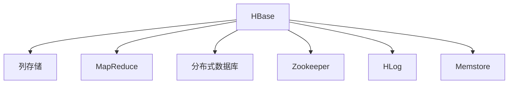

                 

# HBase原理与代码实例讲解

> 关键词：HBase,分布式数据库,列存储,MapReduce,大数据,NoSQL

## 1. 背景介绍

### 1.1 问题由来

随着互联网和移动互联网的迅猛发展，全球数据量呈现指数级增长。根据IDC的预测，到2025年，全球数据量将达到175ZB。面对海量数据的存储和处理，传统关系型数据库已难以满足需求，一种新型分布式数据库——NoSQL数据库应运而生。

HBase（Hadoop Database）作为Apache基金会的一个开源项目，是一个高性能、分布式、可扩展的NoSQL数据库，基于Google BigTable架构设计，适合海量数据的存储和处理。它具有高吞吐量、高可靠性、高可扩展性等特点，适用于互联网公司、物联网、大数据分析等场景。

### 1.2 问题核心关键点

HBase作为NoSQL数据库的代表，广泛应用于大数据处理和存储。它的核心思想是基于列存储的分布式数据库，能够高效处理海量数据，支持MapReduce等大数据处理技术。通过了解HBase的工作原理和核心组件，可以更好地理解其如何实现高性能和大规模数据存储。

## 2. 核心概念与联系

### 2.1 核心概念概述

为更好地理解HBase的工作原理，本节将介绍几个关键概念：

- HBase：一个高可靠性、高性能、可扩展的NoSQL数据库，基于列存储设计，适合海量数据存储和处理。

- 列存储(Column Storage)：与行存储不同，列存储将数据按照列来组织存储，每列有独立的存储和索引，适合存储具有稠密结构的列数据。

- 分布式数据库(Distributed Database)：通过多台服务器的协同工作，实现数据的高可靠性和高可扩展性。

- MapReduce：一种大数据处理框架，能够高效处理大规模数据集，由Map和Reduce两个核心步骤组成。

- Zookeeper：一个开源的分布式配置服务，用于管理HBase集群中的服务发现、故障转移、元数据管理等。

- HLog和Memstore：HBase的内部数据结构，用于存储数据的临时和持久化存储。

这些核心概念之间的逻辑关系可以通过以下Mermaid流程图来展示：



这个流程图展示了HBase的核心概念及其之间的关系：

1. HBase基于列存储设计，适合存储具有稠密结构的列数据。
2. 支持MapReduce等大数据处理技术，高效处理大规模数据集。
3. 采用分布式数据库设计，通过多台服务器的协同工作，实现数据的高可靠性和高可扩展性。
4. 使用Zookeeper管理集群中的服务发现、故障转移、元数据管理等。
5. 内部使用HLog和Memstore进行数据的临时和持久化存储。

这些概念共同构成了HBase的数据存储和管理框架，使其能够高效、可靠地存储和处理海量数据。

## 3. 核心算法原理 & 具体操作步骤

### 3.1 算法原理概述

HBase的核心算法包括列存储算法、MapReduce数据处理算法、分布式协调算法等。其中，列存储算法和分布式数据库算法是其核心。

列存储算法将数据按照列来组织存储，每列有独立的存储和索引，适合存储具有稠密结构的列数据。MapReduce算法则用于高效处理大规模数据集，将大数据处理任务分解成多个子任务并行处理。

分布式协调算法用于管理和调度集群中的多台服务器，确保数据的高可靠性和高可用性。主要包括以下几个方面：

- Zookeeper集群管理：使用Zookeeper管理HBase集群中的服务发现、故障转移、元数据管理等。
- HBase Master管理：HBase Master负责集群管理，包括创建、删除、修改表等操作。
- Region Server管理：Region Server负责数据的读写操作，多个Region Server协同工作，实现数据的分布式存储和处理。

### 3.2 算法步骤详解

以下是HBase的核心算法步骤：

**Step 1: 数据建模**

在进行HBase的数据存储前，首先需要对数据进行建模。将数据按照列来组织存储，每列有独立的存储和索引，适合存储具有稠密结构的列数据。

**Step 2: 数据加载**

数据加载到HBase中，分为三个步骤：

1. 创建表：使用HBase Shell或API创建表，指定表的列族、压缩方式、持久化方式等。
2. 插入数据：使用Put操作将数据插入表中。
3. 读取数据：使用Get操作读取表中的数据。

**Step 3: 数据查询**

数据查询是HBase的重要功能之一。常见的查询方式包括：

1. 扫描：使用Scan操作扫描表中的数据，返回符合条件的行。
2. 过滤：使用Filter操作对数据进行过滤，返回符合条件的行。
3. 连接：使用连接操作将多个表中的数据连接起来，返回符合条件的行。

**Step 4: 分布式协调**

在多台服务器协同工作时，需要管理和调度集群中的各个服务器，确保数据的高可靠性和高可用性。主要包括以下几个方面：

1. Zookeeper集群管理：使用Zookeeper管理HBase集群中的服务发现、故障转移、元数据管理等。
2. HBase Master管理：HBase Master负责集群管理，包括创建、删除、修改表等操作。
3. Region Server管理：Region Server负责数据的读写操作，多个Region Server协同工作，实现数据的分布式存储和处理。

**Step 5: 数据一致性**

HBase采用CP模型保证数据的一致性。在写入数据时，保证写操作的正确性和一致性；在读取数据时，保证读取操作的一致性和可靠性。

### 3.3 算法优缺点

HBase作为NoSQL数据库的代表，具有以下优点：

1. 高可靠性：通过多台服务器的协同工作，实现数据的高可靠性。
2. 高可扩展性：支持动态扩展和缩小，能够轻松应对数据量的变化。
3. 高性能：基于列存储和MapReduce等大数据处理技术，能够高效处理大规模数据集。
4. 低成本：开源项目，使用成本低。

同时，HBase也存在一些缺点：

1. 查询复杂：与传统关系型数据库相比，查询操作相对复杂，需要使用大量的HBase Shell或API。
2. 数据建模困难：需要按照列来组织存储，对于复杂的结构化数据处理能力较弱。
3. 难以保证事务一致性：采用CP模型，无法同时保证强一致性和高可用性。

尽管存在这些缺点，但HBase在大数据处理和存储方面仍具有重要的应用价值，适合处理具有稠密结构的数据集。

### 3.4 算法应用领域

HBase作为NoSQL数据库的代表，被广泛应用于互联网公司、物联网、大数据分析等场景。主要应用领域包括：

- 互联网公司：如淘宝、京东、百度等，使用HBase存储用户的浏览记录、购买记录等数据。
- 物联网：如智能家居、工业物联网等，使用HBase存储传感器数据。
- 大数据分析：如谷歌、亚马逊等公司，使用HBase存储和分析大规模数据集。

此外，HBase还被应用于金融、医疗、物流、旅游等多个领域，为各行各业的数据存储和处理提供了新的解决方案。

## 4. 数学模型和公式 & 详细讲解 & 举例说明

### 4.1 数学模型构建

HBase的数学模型主要包括以下几个方面：

- 列存储模型：将数据按照列来组织存储，每列有独立的存储和索引。
- MapReduce模型：将大数据处理任务分解成多个子任务并行处理。
- 分布式协调模型：管理和调度集群中的多台服务器，确保数据的高可靠性和高可用性。

### 4.2 公式推导过程

以HBase的列存储模型为例，其数学模型为：

$$
T=\{(\text{RowKey},\text{ColumnFamily},\text{Column},\text{Value},\text{Timestamp})\}
$$

其中，$\text{RowKey}$ 为行键，$\text{ColumnFamily}$ 为列族，$\text{Column}$ 为列，$\text{Value}$ 为值，$\text{Timestamp}$ 为时间戳。

在列存储模型中，每列有独立的存储和索引，可以高效存储具有稠密结构的列数据。在MapReduce模型中，将大数据处理任务分解成多个子任务并行处理，可以高效处理大规模数据集。在分布式协调模型中，使用Zookeeper管理和调度集群中的多台服务器，可以确保数据的高可靠性和高可用性。

### 4.3 案例分析与讲解

以下以一个简单的例子，展示如何使用HBase存储和查询数据：

假设有一个电商网站，需要存储用户的购买记录。每个购买记录包含以下几个字段：用户ID、商品ID、订单ID、下单时间、支付金额、配送状态等。

1. 创建表

首先需要创建一个名为“purchase”的表，包含以下几个列族：

- info：用于存储购买记录的基本信息，如用户ID、商品ID、订单ID等。
- transaction：用于存储购买记录的详细交易信息，如下单时间、支付金额、配送状态等。

```python
# 使用HBase Shell创建表
hbase shell
hbase create 'purchase'
hbase list
```

2. 插入数据

插入一条购买记录：

```python
# 使用Put操作将数据插入表中
hbase shell
put 'purchase', 'a', 'info:uid', '1001', 'timestamp', 1609477636000
put 'purchase', 'a', 'info:pid', '10001', 'timestamp', 1609477636000
put 'purchase', 'a', 'info:oid', '1001', 'timestamp', 1609477636000
put 'purchase', 'a', 'transaction:time', '2021-04-01 15:20:36', 'timestamp', 1609477636000
put 'purchase', 'a', 'transaction:price', '199.00', 'timestamp', 1609477636000
put 'purchase', 'a', 'transaction:status', '待发货', 'timestamp', 1609477636000
```

3. 读取数据

使用Get操作读取该条记录：

```python
# 使用Get操作读取数据
hbase shell
get 'purchase', 'a', 'info:uid'
get 'purchase', 'a', 'info:pid'
get 'purchase', 'a', 'info:oid'
get 'purchase', 'a', 'transaction:time'
get 'purchase', 'a', 'transaction:price'
get 'purchase', 'a', 'transaction:status'
```

以上就是一个简单的HBase数据存储和查询的例子。通过使用HBase的列存储和MapReduce等大数据处理技术，可以高效地存储和处理海量数据。

## 5. 项目实践：代码实例和详细解释说明

### 5.1 开发环境搭建

在进行HBase的数据存储和查询前，需要先搭建开发环境。以下是使用Python和Hadoop搭建HBase开发环境的步骤：

1. 安装Java：由于HBase依赖Java环境，需要先安装JDK。

2. 安装Hadoop：从官网下载安装Hadoop，并将其配置到环境变量中。

3. 安装HBase：从官网下载安装HBase，并将其配置到Hadoop的hdfs-site.xml、core-site.xml和hbase-site.xml中。

4. 启动HBase集群：使用Hadoop提供的启动命令，启动HBase集群。

```bash
# 启动Hadoop集群
start-dfs.sh
start-yarn.sh

# 启动HBase集群
start-hbase.sh
```

完成上述步骤后，即可在HBase集群中进行数据存储和查询。

### 5.2 源代码详细实现

以下是使用Python和PyHBase进行HBase数据存储和查询的代码实现：

```python
# 导入PyHBase模块
from pyhbase.client import Connection, Table

# 连接HBase集群
connection = Connection('hbase://localhost')
table = connection.table('purchase')

# 插入数据
row_key = 'a'
info = {'uid': '1001', 'pid': '10001', 'oid': '1001'}
transaction = {'time': '2021-04-01 15:20:36', 'price': '199.00', 'status': '待发货'}
put = table.put(row_key, 'info', info)
put = table.put(row_key, 'transaction', transaction)

# 读取数据
info = table.get('a', 'info:uid')
transaction = table.get('a', 'transaction:time')
transaction = table.get('a', 'transaction:price')
transaction = table.get('a', 'transaction:status')
```

以上代码展示了如何使用PyHBase进行HBase数据存储和查询。通过使用Python和PyHBase，可以轻松地进行HBase操作，而无需了解Java和Hadoop的底层实现。

### 5.3 代码解读与分析

以下是HBase操作的详细解读和分析：

**1. 连接HBase集群**

首先使用`Connection`类连接HBase集群。

```python
# 连接HBase集群
connection = Connection('hbase://localhost')
```

以上代码中，`hbase://localhost`表示HBase集群的主机地址。

**2. 插入数据**

使用`put`方法将数据插入表中。

```python
# 插入数据
row_key = 'a'
info = {'uid': '1001', 'pid': '10001', 'oid': '1001'}
transaction = {'time': '2021-04-01 15:20:36', 'price': '199.00', 'status': '待发货'}
put = table.put(row_key, 'info', info)
put = table.put(row_key, 'transaction', transaction)
```

以上代码中，`row_key`表示行键，`info`和`transaction`表示列族和列，`info:uid`、`info:pid`、`info:oid`和`transaction:time`、`transaction:price`、`transaction:status`表示具体的列。

**3. 读取数据**

使用`get`方法读取数据。

```python
# 读取数据
info = table.get('a', 'info:uid')
transaction = table.get('a', 'transaction:time')
transaction = table.get('a', 'transaction:price')
transaction = table.get('a', 'transaction:status')
```

以上代码中，`a`表示行键，`info:uid`、`transaction:time`、`transaction:price`和`transaction:status`表示具体的列。

## 6. 实际应用场景

### 6.1 智能推荐系统

智能推荐系统是HBase的重要应用之一。通过存储用户的浏览记录、购买记录等数据，可以对用户进行行为分析，从而进行个性化推荐。

在实际应用中，可以使用HBase存储用户的浏览记录、购买记录等数据，然后对这些数据进行分析和处理，从而进行个性化推荐。

### 6.2 实时数据处理

HBase支持实时数据处理，可以处理大规模的数据流。例如，可以使用HBase存储和处理传感器数据、日志数据等，从而进行实时监控和分析。

在实际应用中，可以使用HBase存储传感器数据、日志数据等，然后对这些数据进行实时监控和分析，从而实现实时监控和报警等功能。

### 6.3 大数据分析

HBase支持大数据分析，可以存储和处理大规模数据集。例如，可以使用HBase存储和处理互联网用户的浏览记录、购买记录等数据，然后进行数据分析和处理，从而进行大数据分析。

在实际应用中，可以使用HBase存储互联网用户的浏览记录、购买记录等数据，然后对这些数据进行大数据分析，从而进行数据分析和预测等功能。

### 6.4 未来应用展望

随着HBase技术的不断演进，未来的应用场景将会更加广泛。例如，HBase可以在以下场景中发挥重要作用：

- 大数据分析：随着数据的不断增长，HBase可以在大数据分析中发挥重要作用，存储和处理大规模数据集。
- 实时监控：随着物联网和智能设备的发展，HBase可以在实时监控中发挥重要作用，存储和处理大规模数据流。
- 智能推荐：随着智能推荐技术的发展，HBase可以在智能推荐中发挥重要作用，存储和处理用户行为数据。

## 7. 工具和资源推荐

### 7.1 学习资源推荐

为了帮助开发者系统掌握HBase的理论基础和实践技巧，这里推荐一些优质的学习资源：

1. HBase官方文档：HBase官方文档提供了详细的API文档和开发指南，是学习HBase的重要资源。

2. Hadoop官方文档：Hadoop官方文档提供了详细的Hadoop部署和配置指南，是学习Hadoop的重要资源。

3.《Hadoop生态系统实战》：这是一本介绍Hadoop生态系统的书籍，涵盖了Hadoop、Hive、Pig、Hbase、Zookeeper等技术，适合初学者学习。

4.《HBase实战》：这是一本介绍HBase的实战书籍，提供了详细的HBase开发案例和实践指南，适合实战开发人员学习。

5. HBase中文社区：HBase中文社区提供了丰富的学习资源和社区交流平台，适合学习HBase的人员参与。

通过对这些资源的学习实践，相信你一定能够快速掌握HBase的精髓，并用于解决实际的存储和处理问题。

### 7.2 开发工具推荐

为了帮助开发者快速搭建HBase开发环境，以下是几款常用的开发工具：

1. PyHBase：PyHBase是Python语言中的HBase客户端，可以方便地进行HBase操作。

2. HBase Shell：HBase Shell是HBase的命令行工具，可以方便地进行HBase操作。

3. Hadoop CLI：Hadoop CLI是Hadoop的命令行工具，可以方便地进行Hadoop操作。

4. Eclipse：Eclipse是一个流行的开发环境，支持Hadoop和HBase开发。

5. IDEA：IDEA是一个流行的开发环境，支持Hadoop和HBase开发。

合理利用这些工具，可以显著提升HBase开发效率，加快创新迭代的步伐。

### 7.3 相关论文推荐

HBase作为Apache基金会的一个开源项目，得到了广泛的研究和应用。以下是几篇奠基性的相关论文，推荐阅读：

1. "HBase: The Hadoop Database"：这篇文章介绍了HBase的设计和实现原理，是HBase的重要参考资料。

2. "HBase: A Hadoop-Based Distributed Database Management System"：这篇文章介绍了HBase的设计和实现原理，是HBase的重要参考资料。

3. "HBase: A Distributed Realtime Database"：这篇文章介绍了HBase的设计和实现原理，是HBase的重要参考资料。

4. "HBase: A Scalable Distributed Database"：这篇文章介绍了HBase的设计和实现原理，是HBase的重要参考资料。

这些论文代表了HBase技术的演进和发展，通过学习这些前沿成果，可以帮助研究者把握学科前进方向，激发更多的创新灵感。

## 8. 总结：未来发展趋势与挑战

### 8.1 总结

本文对HBase的工作原理和核心组件进行了全面系统的介绍。首先阐述了HBase的核心算法，包括列存储算法、MapReduce算法和分布式协调算法等，明确了HBase的核心思想和设计目标。其次，从原理到实践，详细讲解了HBase的数据存储和查询过程，给出了HBase开发的全流程代码实现。同时，本文还广泛探讨了HBase在智能推荐、实时数据处理、大数据分析等领域的实际应用场景，展示了HBase技术的多样性。

通过本文的系统梳理，可以看到，HBase作为一种高性能、分布式、可扩展的NoSQL数据库，适合海量数据的存储和处理。其核心思想基于列存储和MapReduce等大数据处理技术，能够高效处理大规模数据集。未来，随着HBase技术的不断演进，将在更多的应用场景中发挥重要作用，推动大数据和人工智能技术的发展。

### 8.2 未来发展趋势

展望未来，HBase技术将呈现以下几个发展趋势：

1. 高可靠性：随着多台服务器的协同工作，HBase能够实现数据的高可靠性，确保数据的安全和稳定。

2. 高可扩展性：随着集群规模的不断扩大，HBase能够实现数据的动态扩展和缩小，适应数据量的变化。

3. 高性能：随着硬件设备和算法技术的不断进步，HBase能够实现更高的性能，处理大规模数据集的速度更快。

4. 多数据源融合：随着数据源的多样化，HBase能够融合多数据源，提供更加全面、准确的数据服务。

以上趋势凸显了HBase技术的持续演进和发展方向，将进一步推动HBase技术的普及和应用。

### 8.3 面临的挑战

尽管HBase技术已经取得了重要成果，但在迈向更加智能化、普适化应用的过程中，它仍面临诸多挑战：

1. 数据建模困难：HBase需要按照列来组织存储，对于复杂的结构化数据处理能力较弱。

2. 查询复杂：与传统关系型数据库相比，查询操作相对复杂，需要使用大量的HBase Shell或API。

3. 难以保证事务一致性：采用CP模型，无法同时保证强一致性和高可用性。

尽管存在这些挑战，但HBase作为NoSQL数据库的代表，仍然具有重要的应用价值。未来需要更多的研究和技术突破，进一步提升HBase的性能和应用范围。

### 8.4 研究展望

未来研究需要在以下几个方面寻求新的突破：

1. 优化数据建模：设计更加灵活的数据建模方法，支持更复杂的结构化数据处理能力。

2. 简化查询操作：优化查询操作，使其更加简洁高效，减少开发人员的学习成本。

3. 保证事务一致性：探索新的事务一致性模型，支持强一致性和高可用性。

4. 支持多数据源融合：支持多数据源的融合，提供更加全面、准确的数据服务。

这些研究方向的探索，将推动HBase技术的持续演进和应用扩展，为大数据和人工智能技术的发展提供新的动力。

## 9. 附录：常见问题与解答

**Q1: HBase与传统关系型数据库有何区别？**

A: HBase与传统关系型数据库有以下区别：

1. 存储方式：HBase采用列存储方式，每列有独立的存储和索引，而传统关系型数据库采用行存储方式，每行有独立的存储和索引。

2. 数据模型：HBase适合存储具有稠密结构的列数据，而传统关系型数据库适合存储具有稀疏结构的行数据。

3. 查询方式：HBase的查询操作相对复杂，需要使用大量的HBase Shell或API，而传统关系型数据库的查询操作相对简单。

4. 扩展性：HBase支持动态扩展和缩小，能够轻松应对数据量的变化，而传统关系型数据库需要重新部署才能扩展。

**Q2: HBase适合存储哪些类型的数据？**

A: HBase适合存储以下类型的数据：

1. 大规模数据集：HBase适合存储大规模数据集，如互联网用户的浏览记录、购买记录等。

2. 实时数据流：HBase适合存储实时数据流，如传感器数据、日志数据等。

3. 非结构化数据：HBase适合存储非结构化数据，如文档、图片、视频等。

4. 稀疏数据：HBase适合存储稀疏数据，如用户行为数据、交易记录等。

**Q3: HBase的分布式协调如何实现？**

A: HBase的分布式协调通过Zookeeper实现。

1. 服务发现：使用Zookeeper管理HBase集群中的服务发现，确保集群中的每个节点都能够正确识别集群中的其他节点。

2. 故障转移：使用Zookeeper管理HBase集群中的故障转移，确保集群中的每个节点都能够及时发现和处理故障。

3. 元数据管理：使用Zookeeper管理HBase集群中的元数据，确保集群中的每个节点都能够正确识别和管理元数据。

通过使用Zookeeper，HBase能够实现分布式协调，确保数据的高可靠性和高可用性。

---

作者：禅与计算机程序设计艺术 / Zen and the Art of Computer Programming

