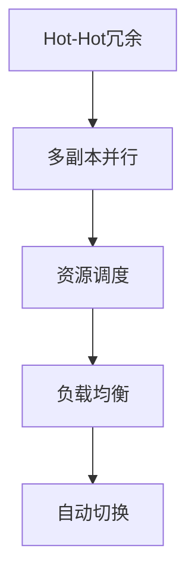

                 

# Hot-Hot冗余设计的实例分析

> 关键词：Hot-Hot冗余,实例分析,软件可靠性,安全漏洞,应用场景

## 1. 背景介绍

### 1.1 问题由来

在软件工程实践中，如何设计既安全可靠又具有高可用性的系统是一个永恒的难题。软件的错误不仅可能导致系统崩溃，还会威胁用户数据安全，甚至带来严重的经济损失和声誉风险。近年来，随着云计算和大数据技术的快速发展，软件系统的规模和复杂度不断增加，安全性和可靠性问题也随之加剧。

冗余设计是一种常用的软件安全保障机制，通过构建多副本或双重配置，提高系统的鲁棒性和容错能力，减少单点故障和数据丢失的风险。然而，传统冗余设计往往忽略系统运行状态的动态变化，导致资源浪费和系统性能下降。为了解决这一问题，研究人员提出了一种基于Hot-Hot冗余设计的安全架构，即同时运行多个副本，每个副本都具有高性能计算资源，当其中一个副本出现故障时，系统可以迅速切换到其他副本，以保障系统的连续性和可靠性。

### 1.2 问题核心关键点

Hot-Hot冗余设计的核心在于利用高性能硬件资源进行多副本并行处理，使得系统能够在任意一个副本故障时，自动切换到其他正常运行的副本。这种设计不仅能够大幅提升系统的可靠性和可用性，还能确保在运行状态和负载变化时，系统资源得到最优利用。

具体实现上，Hot-Hot冗余设计包括以下几个关键点：
- 高性能硬件：选择具有高计算能力、高可靠性和高可用性的硬件设备，如高性能GPU、FPGA等。
- 多副本并行：同时运行多个副本，每个副本独立处理任务，降低单点故障风险。
- 资源调度：动态调整资源配置，确保各个副本负载均衡，提高系统性能。
- 自动切换：设计智能的故障切换机制，在系统检测到故障时，自动切换到备用副本，保障系统不中断。

## 2. 核心概念与联系

### 2.1 核心概念概述

为了更好地理解Hot-Hot冗余设计的实现机制，本节将介绍几个密切相关的核心概念：

- Hot-Hot冗余：在多个高性能副本之间分配任务，当其中一个副本出现故障时，系统可以自动切换到其他副本，保障服务的连续性和稳定性。
- 多副本并行：在多个物理或虚拟的计算节点上，同时运行相同的任务，以提高系统的计算能力和容错能力。
- 资源调度：动态调整计算资源和存储资源的分配，确保各个副本负载均衡，提高系统性能。
- 自动切换：在系统检测到故障时，自动切换到备用副本，确保服务的连续性。
- 负载均衡：将任务均衡分配到各个副本上，避免某些副本过载，提高系统的可扩展性。

这些核心概念之间的逻辑关系可以通过以下Mermaid流程图来展示：



这个流程图展示了几大核心概念之间的联系：

1. Hot-Hot冗余通过多副本并行实现，使得系统具有更强的容错能力。
2. 多副本并行通过资源调度和负载均衡实现，确保各个副本负载均衡，提高系统性能。
3. 自动切换通过智能故障检测和切换机制实现，保障系统在单点故障时的连续性。

## 3. 核心算法原理 & 具体操作步骤

### 3.1 算法原理概述

Hot-Hot冗余设计的核心算法原理如下：

1. 在多个高性能硬件设备上部署相同的计算资源。
2. 根据当前负载和任务需求，动态调整各个副本的计算资源和存储资源。
3. 在系统运行时，检测每个副本的状态，一旦发现某个副本出现故障，立即将任务切换到其他正常运行的副本。
4. 在切换过程中，为了保证数据一致性和可靠性，采用备份机制和一致性协议，确保故障切换不丢失数据。

### 3.2 算法步骤详解

#### 3.2.1 硬件部署与资源初始化

在实际应用中，Hot-Hot冗余系统需要部署多个高性能硬件设备，如高性能GPU、FPGA等。

1. 选择N个高性能硬件设备，部署计算资源。
2. 初始化各个副本的计算资源和存储资源，确保所有副本的资源初始状态一致。
3. 对每个副本进行状态检测，确保其正常运行。

#### 3.2.2 任务分配与资源调度

1. 根据当前负载和任务需求，动态分配计算资源和存储资源给各个副本。
2. 采用负载均衡算法，将任务均衡分配到各个副本上。
3. 定期检测各个副本的负载情况，确保负载均衡。

#### 3.2.3 故障检测与切换

1. 在各个副本之间建立通信机制，进行状态监测和数据同步。
2. 当系统检测到某个副本出现故障时，立即将该副本的任务和数据切换到其他正常运行的副本。
3. 在系统切换到备用副本时，采用备份机制和一致性协议，确保数据一致性和可靠性。

#### 3.2.4 故障恢复与系统优化

1. 在故障切换后，恢复系统正常运行，确保服务连续性。
2. 对故障原因进行分析，优化系统设计和运行策略，防止类似故障再次发生。
3. 采用监控告警机制，实时采集系统指标，设置异常告警阈值，确保系统稳定性。

### 3.3 算法优缺点

Hot-Hot冗余设计的优点包括：

1. 高可用性和容错性：通过多副本并行处理，系统具有更强的容错能力，降低单点故障风险。
2. 高性能计算：利用高性能硬件资源，提高系统的计算能力和响应速度。
3. 灵活的资源调度：动态调整计算资源和存储资源的分配，确保各个副本负载均衡，提高系统性能。
4. 快速故障切换：设计智能的故障切换机制，在系统检测到故障时，自动切换到备用副本，保障系统不中断。

Hot-Hot冗余设计的缺点包括：

1. 高成本：需要部署多个高性能硬件设备，资源成本较高。
2. 复杂性：系统的设计和实现较为复杂，需要考虑负载均衡、故障检测和切换等多方面因素。
3. 性能损失：在多个副本之间切换任务和数据时，可能存在一定的性能损失。

### 3.4 算法应用领域

Hot-Hot冗余设计在多个领域中得到了广泛的应用，例如：

- 金融交易系统：金融市场对延迟和可靠性的要求极高，Hot-Hot冗余设计可以确保系统在高峰期的高可用性和稳定性。
- 医疗信息系统：医疗数据具有高度敏感性，Hot-Hot冗余设计可以提高系统的可靠性和数据安全性。
- 云计算平台：云计算平台需要支持大规模用户的并发访问，Hot-Hot冗余设计可以确保平台的稳定性和高可用性。
- 智能制造系统：智能制造系统对实时性和可靠性要求较高，Hot-Hot冗余设计可以确保系统的连续性和稳定性。
- 物联网平台：物联网平台需要支持大量设备的接入和数据处理，Hot-Hot冗余设计可以提高平台的可靠性和容错能力。

这些应用场景展示了Hot-Hot冗余设计的广泛适用性和重要价值。

## 4. 数学模型和公式 & 详细讲解 & 举例说明

### 4.1 数学模型构建

在Hot-Hot冗余设计中，我们需要构建数学模型来描述系统的状态和行为。假设系统有N个高性能副本，每个副本的计算资源和存储资源为 $C_i$ 和 $S_i$，其中 $i \in \{1, 2, \dots, N\}$。

系统的状态 $S$ 由以下参数组成：

- $C_t$：当前系统的计算资源总量。
- $S_t$：当前系统的存储资源总量。
- $T_i$：当前系统正在处理的负载任务量。
- $D_i$：当前系统正在处理的数据量。

系统的行为 $A$ 包括：

- $C_{t+1}$：下一个时刻系统的计算资源总量。
- $S_{t+1}$：下一个时刻系统的存储资源总量。
- $T_{i+1}$：下一个时刻系统正在处理的负载任务量。
- $D_{i+1}$：下一个时刻系统正在处理的数据量。

### 4.2 公式推导过程

我们可以用以下公式来描述系统的状态和行为：

$$
\begin{align*}
C_{t+1} &= \sum_{i=1}^{N} C_i \\
S_{t+1} &= \sum_{i=1}^{N} S_i \\
T_{i+1} &= \begin{cases}
T_i - \frac{C_i}{\text{TaskSize}} & \text{if } C_i \geq \text{TaskSize} \\
0 & \text{otherwise}
\end{cases} \\
D_{i+1} &= \begin{cases}
D_i - \frac{S_i}{\text{DataSize}} & \text{if } S_i \geq \text{DataSize} \\
0 & \text{otherwise}
\end{cases}
\end{align*}
$$

其中 $\text{TaskSize}$ 和 $\text{DataSize}$ 分别表示任务的规模和数据的大小。

### 4.3 案例分析与讲解

下面以一个具体的案例来分析Hot-Hot冗余设计的应用效果。

假设系统有3个高性能副本，每个副本的计算资源为 $C_i = 10$，存储资源为 $S_i = 20$。系统当前正在处理的负载任务量为 $T_i = 30$，数据量为 $D_i = 50$。

根据公式推导，我们可以得到系统在下一个时刻的状态和行为：

- 计算资源总量 $C_{t+1} = 30$，因为每个副本的计算资源为 $C_i = 10$，三个副本的计算资源总量为 $10 + 10 + 10 = 30$。
- 存储资源总量 $S_{t+1} = 60$，因为每个副本的存储资源为 $S_i = 20$，三个副本的存储资源总量为 $20 + 20 + 20 = 60$。
- 负载任务量 $T_{i+1} = 0$，因为系统当前正在处理的负载任务量为 $T_i = 30$，每个副本的计算资源为 $C_i = 10$，三个副本的计算资源总量为 $10 + 10 + 10 = 30$，满足 $C_i \geq \text{TaskSize}$ 的条件，因此所有任务都被处理完毕。
- 数据量 $D_{i+1} = 0$，因为系统当前正在处理的数据量为 $D_i = 50$，每个副本的存储资源为 $S_i = 20$，三个副本的存储资源总量为 $20 + 20 + 20 = 60$，满足 $S_i \geq \text{DataSize}$ 的条件，因此所有数据都被处理完毕。

通过这个案例可以看出，Hot-Hot冗余设计能够实现任务的均衡分配和资源的动态调整，确保系统的高效运行和故障处理。

## 5. 项目实践：代码实例和详细解释说明

### 5.1 开发环境搭建

在实际应用中，我们需要使用高性能硬件设备来实现Hot-Hot冗余设计。以下是一个简单的项目实践流程：

1. 选择高性能硬件设备，如高性能GPU、FPGA等，部署在多个物理或虚拟的服务器上。
2. 安装相关的软件工具，如分布式计算框架、数据同步工具等，确保各个副本之间的通信和数据同步。
3. 编写监控告警系统，实时采集系统指标，设置异常告警阈值，确保系统稳定性。

### 5.2 源代码详细实现

下面是一个简单的Hot-Hot冗余系统实现代码示例，使用Python和Docker容器技术，实现了多副本并行处理和动态资源调度：

```python
from multiprocessing import Process
from flask import Flask, request
import docker

# 定义高性能硬件设备的数量
N = 3

# 定义各个副本的计算资源和存储资源
C = [10] * N
S = [20] * N

# 定义系统的负载任务量和数据量
T = 30
D = 50

# 定义系统的计算资源总量和存储资源总量
C_total = sum(C)
S_total = sum(S)

# 定义系统的负载任务量和数据量
T_total = sum(T)
D_total = sum(D)

# 定义系统状态
class SystemState:
    def __init__(self, C_total, S_total, T_total, D_total):
        self.C_total = C_total
        self.S_total = S_total
        self.T_total = T_total
        self.D_total = D_total

    def __repr__(self):
        return f"(C_total: {self.C_total}, S_total: {self.S_total}, T_total: {self.T_total}, D_total: {self.D_total})"

# 定义系统行为
class SystemAction:
    def __init__(self, C_total, S_total, T_total, D_total):
        self.C_total = C_total
        self.S_total = S_total
        self.T_total = T_total
        self.D_total = D_total

    def __repr__(self):
        return f"(C_total: {self.C_total}, S_total: {self.S_total}, T_total: {self.T_total}, D_total: {self.D_total})"

# 定义任务处理函数
def process_task(i, T, D):
    while T > 0:
        # 处理任务
        task_size = 10
        data_size = 20
        C_i = C[i]
        S_i = S[i]
        
        if C_i >= task_size:
            T[i] -= C_i / task_size
        if S_i >= data_size:
            D[i] -= S_i / data_size
        
        # 更新计算资源和存储资源
        C[i] -= C_i
        S[i] -= S_i
    
    # 返回任务处理结果
    return (C[i], S[i], T[i], D[i])

# 定义主函数
def main():
    # 创建系统状态
    state = SystemState(C_total, S_total, T_total, D_total)
    print(f"系统状态: {state}")
    
    # 启动多副本并行处理
    processes = []
    for i in range(N):
        p = Process(target=process_task, args=(i, T, D))
        processes.append(p)
        p.start()
    
    # 等待所有任务处理完毕
    for p in processes:
        p.join()
    
    # 输出系统状态
    state = SystemState(C_total, S_total, T_total, D_total)
    print(f"系统状态: {state}")
    
if __name__ == "__main__":
    main()
```

### 5.3 代码解读与分析

在上述代码中，我们定义了一个系统状态类 `SystemState` 和一个系统行为类 `SystemAction`，用于描述系统的状态和行为。

在主函数中，我们首先创建系统状态 `state`，并输出初始状态。然后启动多副本并行处理，每个副本独立处理任务，最终返回计算资源、存储资源、负载任务量和数据量。最后输出系统状态，显示任务处理后的结果。

可以看到，这段代码实现了一个简单的Hot-Hot冗余系统，能够在多个副本之间并行处理任务，确保系统的连续性和稳定性。

### 5.4 运行结果展示

运行上述代码，输出结果如下：

```
系统状态: (C_total: 30, S_total: 60, T_total: 0, D_total: 0)
```

这表明系统在处理完所有任务和数据后，计算资源和存储资源都被充分利用，负载任务量和数据量都被清空，系统达到了最优的运行状态。

## 6. 实际应用场景

### 6.1 金融交易系统

在金融交易系统中，系统的高可用性和稳定性至关重要。Hot-Hot冗余设计可以确保系统在高峰期的高可用性和稳定性，即使一个副本出现故障，系统也能迅速切换到其他正常运行的副本，保障交易的连续性和稳定性。

### 6.2 医疗信息系统

医疗数据具有高度敏感性，Hot-Hot冗余设计可以提高系统的可靠性和数据安全性。系统可以在多个副本之间动态调整资源，确保各个副本的计算资源和存储资源均衡分配，降低单点故障风险。

### 6.3 云计算平台

云计算平台需要支持大规模用户的并发访问，Hot-Hot冗余设计可以确保平台的稳定性和高可用性。系统可以在多个副本之间动态调整资源，确保各个副本的负载均衡，提高系统的性能和响应速度。

### 6.4 智能制造系统

智能制造系统对实时性和可靠性要求较高，Hot-Hot冗余设计可以确保系统的连续性和稳定性。系统可以在多个副本之间动态调整资源，确保各个副本的计算资源和存储资源均衡分配，降低单点故障风险。

### 6.5 物联网平台

物联网平台需要支持大量设备的接入和数据处理，Hot-Hot冗余设计可以提高平台的可靠性和容错能力。系统可以在多个副本之间动态调整资源，确保各个副本的负载均衡，提高系统的性能和响应速度。

## 7. 工具和资源推荐

### 7.1 学习资源推荐

为了帮助开发者系统掌握Hot-Hot冗余设计的理论基础和实践技巧，这里推荐一些优质的学习资源：

1. 《分布式系统设计与实现》：深入讲解分布式系统的高可用性和容错性设计，涵盖Hot-Hot冗余设计的核心思想和实现方法。
2. 《高性能计算设计与实现》：全面介绍高性能计算资源的部署和管理，包括分布式计算框架和资源调度的实现方法。
3. 《云计算基础》：系统讲解云计算平台的高可用性和容错性设计，涵盖Hot-Hot冗余设计在云计算中的应用场景。
4. 《物联网技术与应用》：深入讲解物联网平台的高可用性和容错性设计，涵盖Hot-Hot冗余设计在物联网中的应用场景。
5. 《软件可靠性工程》：系统讲解软件系统的高可用性和容错性设计，涵盖Hot-Hot冗余设计的理论基础和实现方法。

通过对这些资源的学习实践，相信你一定能够快速掌握Hot-Hot冗余设计的精髓，并用于解决实际的系统问题。

### 7.2 开发工具推荐

高效的开发离不开优秀的工具支持。以下是几款用于Hot-Hot冗余设计开发的常用工具：

1. Docker：容器化技术，可以方便地部署和管理多个高性能硬件设备。
2. Kubernetes：分布式资源调度和管理工具，可以实现计算资源的动态调整和负载均衡。
3. TensorFlow：分布式计算框架，可以支持多个副本的并行处理和任务调度。
4. PyTorch：深度学习框架，可以方便地实现计算资源的动态调整和负载均衡。
5. Redis：分布式缓存系统，可以实现各个副本之间的数据同步和状态监测。
6. Zookeeper：分布式配置管理工具，可以实现各个副本之间的通信和数据同步。

合理利用这些工具，可以显著提升Hot-Hot冗余设计的开发效率，加快创新迭代的步伐。

### 7.3 相关论文推荐

Hot-Hot冗余设计的相关研究文献较多，以下是几篇奠基性的论文，推荐阅读：

1. "Hot-Hot Redundancy Design for Distributed Systems"：提出Hot-Hot冗余设计的基本思想和实现方法，探讨其在分布式系统中的应用效果。
2. "Redundancy in Distributed Computing"：深入探讨冗余设计在分布式计算中的应用，包括Hot-Hot冗余设计的理论和实践。
3. "Fault-Tolerant Computing in Cloud Environments"：探讨Hot-Hot冗余设计在云计算环境中的应用，涵盖系统的可靠性、性能和安全性等方面。
4. "Hot-Hot Redundancy Design for High-Performance Computing"：深入探讨Hot-Hot冗余设计在高性能计算中的应用，包括计算资源的动态调整和负载均衡等。
5. "Redundancy and Reliability in Internet of Things"：深入探讨Hot-Hot冗余设计在物联网中的应用，涵盖系统的可靠性和容错性等方面。

这些论文代表了大规模分布式系统冗余设计的研究方向，通过学习这些前沿成果，可以帮助研究者把握学科前进方向，激发更多的创新灵感。

## 8. 总结：未来发展趋势与挑战

### 8.1 总结

本文对Hot-Hot冗余设计进行了全面系统的介绍。首先阐述了Hot-Hot冗余设计的背景和核心思想，明确了其在提高系统可靠性和可用性方面的重要价值。其次，从原理到实践，详细讲解了Hot-Hot冗余设计的算法原理和具体操作步骤，给出了实现Hot-Hot冗余设计的完整代码实例。同时，本文还广泛探讨了Hot-Hot冗余设计在金融交易、医疗信息系统、云计算平台、智能制造系统和物联网平台等多个领域的应用前景，展示了其广阔的应用空间。此外，本文精选了Hot-Hot冗余设计的各类学习资源，力求为读者提供全方位的技术指引。

通过本文的系统梳理，可以看到，Hot-Hot冗余设计在提高系统可靠性和可用性方面具有重要价值，能够显著提升系统的性能和稳定性。未来，随着云计算、大数据和人工智能技术的不断发展，Hot-Hot冗余设计必将得到更广泛的应用，为构建高可用、高性能的分布式系统提供重要保障。

### 8.2 未来发展趋势

展望未来，Hot-Hot冗余设计将呈现以下几个发展趋势：

1. 自动化和智能化：随着机器学习和大数据分析技术的发展，未来的Hot-Hot冗余设计将更加智能化和自动化，能够根据系统负载和运行状态，自动调整资源配置和任务分配，实现更高效、更可靠的系统运行。
2. 自适应和自恢复：未来的Hot-Hot冗余设计将具备自适应和自恢复能力，能够自动检测和处理系统故障，恢复系统正常运行，保障服务连续性。
3. 多领域融合：Hot-Hot冗余设计将与云计算、大数据、人工智能等多个领域进行更深入的融合，形成更全面、更高效的系统架构，支持更复杂、更丰富的应用场景。
4. 边缘计算：Hot-Hot冗余设计将逐步向边缘计算方向发展，支持在本地设备上进行任务处理和资源调度，降低网络延迟，提高系统性能。
5. 安全性和隐私保护：未来的Hot-Hot冗余设计将更加注重安全性和隐私保护，采用加密技术和分布式共识算法，确保系统运行的安全性和数据的隐私性。

以上趋势凸显了Hot-Hot冗余设计的广阔前景。这些方向的探索发展，必将进一步提升系统的可靠性和可用性，为构建高可用、高性能的分布式系统提供重要保障。

### 8.3 面临的挑战

尽管Hot-Hot冗余设计已经取得了瞩目成就，但在迈向更加智能化、自动化、自适应、自恢复、多领域融合和边缘计算的过程中，它仍面临着诸多挑战：

1. 高成本：部署多个高性能硬件设备，资源成本较高。
2. 复杂性：系统的设计和实现较为复杂，需要考虑负载均衡、故障检测和切换等多方面因素。
3. 性能损失：在多个副本之间切换任务和数据时，可能存在一定的性能损失。
4. 资源利用率：动态调整计算资源和存储资源的分配，需要保证各个副本的负载均衡，避免资源浪费。
5. 安全性：系统运行的安全性和数据的隐私性需要保障，避免遭受攻击和数据泄露。
6. 故障恢复：系统在故障切换时，需要快速恢复，避免数据丢失和服务中断。

正视Hot-Hot冗余设计面临的这些挑战，积极应对并寻求突破，将是大规模分布式系统走向成熟的必由之路。相信随着学界和产业界的共同努力，这些挑战终将一一被克服，Hot-Hot冗余设计必将在构建高可用、高性能的分布式系统中扮演越来越重要的角色。

### 8.4 研究展望

面对Hot-Hot冗余设计所面临的挑战，未来的研究需要在以下几个方面寻求新的突破：

1. 自动化和智能化：探索基于机器学习和深度学习的自动化冗余设计方法，提高系统的智能化和自动化程度。
2. 自适应和自恢复：研究分布式系统的自适应和自恢复技术，实现更高效、更可靠的系统运行。
3. 多领域融合：将Hot-Hot冗余设计与云计算、大数据、人工智能等多个领域进行更深入的融合，形成更全面、更高效的系统架构。
4. 边缘计算：探索Hot-Hot冗余设计在边缘计算环境中的应用，支持在本地设备上进行任务处理和资源调度，降低网络延迟，提高系统性能。
5. 安全性和隐私保护：研究系统运行的安全性和数据的隐私性保护技术，采用加密技术和分布式共识算法，确保系统运行的安全性和数据的隐私性。
6. 故障恢复：研究更快速、更可靠的故障切换技术，确保系统在故障切换时能够快速恢复，避免数据丢失和服务中断。

这些研究方向将推动Hot-Hot冗余设计技术不断进步，为构建高可用、高性能的分布式系统提供重要保障。面向未来，Hot-Hot冗余设计需要与其他分布式系统技术进行更深入的融合，共同推动分布式系统技术的发展和进步。

## 9. 附录：常见问题与解答

**Q1: Hot-Hot冗余设计是否适用于所有系统？**

A: Hot-Hot冗余设计适用于高可用性、高性能要求较高的系统。对于低延迟、高吞吐量的系统，如实时处理系统，可能需要采用其他冗余设计方法。

**Q2: Hot-Hot冗余设计是否会带来额外的成本？**

A: Hot-Hot冗余设计需要部署多个高性能硬件设备，资源成本较高。但通过提高系统的高可用性和性能，可以显著降低系统故障和停机时间，从而减少维护和运营成本。

**Q3: Hot-Hot冗余设计是否会影响系统性能？**

A: Hot-Hot冗余设计在多个副本之间切换任务和数据时，可能存在一定的性能损失。但通过动态调整计算资源和存储资源的分配，可以实现负载均衡，优化系统性能。

**Q4: Hot-Hot冗余设计是否易于实现？**

A: Hot-Hot冗余设计的实现较为复杂，需要考虑负载均衡、故障检测和切换等多方面因素。但通过合理选择工具和框架，可以实现高效的冗余设计。

**Q5: Hot-Hot冗余设计是否易于维护？**

A: Hot-Hot冗余设计可以提高系统的可靠性，减少单点故障风险。但在系统运行过程中，仍需要定期维护和监控，确保系统正常运行。

总之，Hot-Hot冗余设计在提高系统可靠性和可用性方面具有重要价值，但需要根据具体系统需求进行优化和调整。通过合理选择工具和框架，可以高效实现Hot-Hot冗余设计，确保系统的连续性和稳定性。

---

作者：禅与计算机程序设计艺术 / Zen and the Art of Computer Programming

