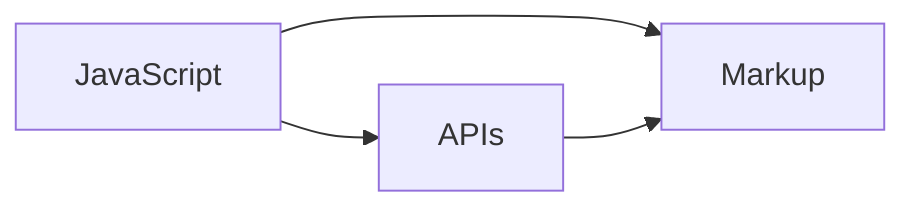

                 

# Jamstack：现代Web开发的新范式

在Web开发领域，Jamstack作为一个新兴的技术栈，正逐渐成为构建高性能、安全、可扩展的现代Web应用的主流范式。本文将系统性地介绍Jamstack的核心概念、技术原理、实际应用，并展望其未来的发展方向。

## 1. 背景介绍

### 1.1 问题由来

互联网的迅猛发展催生了Web应用的不断演进，从早期的静态页面、动态页面到现如今的复杂单页应用(SPA)，Web技术的进步始终伴随着对性能、安全性和可维护性的不断追求。然而，传统的Web开发范式存在诸多弊端，如后端依赖度高、性能瓶颈明显、扩展性差等。

为了解决这些挑战，Web开发社区不断探索新的技术栈和架构方案。2019年，Facebook的Vicenzo Raimondi在其博客中提出了一种新的Web技术栈——Jamstack，即**Javascript + APIs + Markup**。这一栈的提出，被视为Web开发的一次革命，开启了高性能、可维护、可扩展的现代Web应用新时代。

### 1.2 问题核心关键点

Jamstack的核心理念是将JavaScript、APIs和Markup三者分离，形成一个去中心化的、以客户端为主导的技术架构。这种设计降低了对后端服务器的依赖，提升了应用的性能和扩展性，也使得Web应用更加易于维护和升级。

具体来说，Jamstack的优点包括：

- 前端即后端：Jamstack去除了传统的服务器端渲染，将所有数据处理逻辑放到客户端JavaScript中，极大提升了应用性能。
- 数据分离：通过RESTful APIs或GraphQL等技术，使得数据和逻辑分离，降低耦合度。
- 静态组件：采用HTML、CSS等静态文件，降低了对服务器的依赖，加速渲染速度。
- 模块化开发：利用模块化和组件化的开发模式，提高了代码复用性和可维护性。

### 1.3 问题研究意义

Jamstack技术栈的提出，对Web开发带来了深远影响：

1. **提升性能**：通过前端渲染，减少了后端请求次数，提升了页面加载速度和响应时间。
2. **降低后端压力**：去除后端渲染逻辑，降低了后端服务器的负载。
3. **提升扩展性**：数据和逻辑分离，使得Web应用更易于扩展和维护。
4. **增强安全性**：数据在客户端处理，减少了数据泄露的风险。
5. **降低成本**：静态组件和模块化开发减少了开发和维护成本。

## 2. 核心概念与联系

### 2.1 核心概念概述

Jamstack的核心概念可以概括为：

- **JavaScript**：用于数据处理和逻辑渲染的前端语言。
- **APIs**：用于数据传输和业务逻辑处理的后端服务。
- **Markup**：用于页面结构和内容展示的静态文件。

这些概念共同构成了Jamstack的架构基石，其逻辑关系可以通过以下Mermaid流程图来展示：



这个流程图展示了Jamstack三者在架构中的作用和交互：

- JavaScript在前端处理数据和逻辑，通过APIs获取数据，渲染静态的Markup页面。
- APIs负责后端数据处理和逻辑服务，同时提供数据接口给JavaScript调用。
- Markup则作为Web页面的结构和内容展示，不受JavaScript和APIs的影响。

### 2.2 核心概念原理和架构

Jamstack的设计理念是减少对后端服务器的依赖，将数据处理逻辑和页面渲染过程尽可能移到客户端JavaScript中。这种设计理念具体体现在以下几个方面：

- **无服务器架构**：通过APIs提供无服务器的数据接口，使得前端JavaScript可以直接调用，无需依赖后端。
- **前端渲染**：将页面渲染逻辑移至前端JavaScript中，减少后端渲染次数，提升性能。
- **静态组件**：利用HTML、CSS等静态文件，实现页面的无服务器渲染。
- **模块化开发**：采用模块化和组件化的开发模式，提高代码复用性和可维护性。

### 2.3 核心概念联系

Jamstack的三个核心概念之间存在着紧密的联系：

- **JavaScript与APIs**：JavaScript通过APIs获取数据，APIs提供数据接口和业务逻辑处理。这种分离使得JavaScript的性能和扩展性得到了极大提升。
- **JavaScript与Markup**：JavaScript负责渲染静态的Markup页面，使得页面渲染过程高效且稳定。
- **APIs与Markup**：APIs提供数据接口，使得Markup页面可以动态更新内容，满足不同用户需求。

这些联系构成了Jamstack的核心技术栈，使其在现代Web开发中得以广泛应用。

## 3. 核心算法原理 & 具体操作步骤

### 3.1 算法原理概述

Jamstack的算法原理主要集中在以下几个方面：

- **前端渲染**：通过JavaScript渲染静态的Markup页面，减少了后端渲染次数，提升了应用性能。
- **数据分离**：利用APIs实现数据和逻辑的分离，降低了耦合度。
- **模块化开发**：采用模块化和组件化的开发模式，提高了代码复用性和可维护性。

这些算法原理确保了Jamstack在性能、安全性和可扩展性方面的优势。

### 3.2 算法步骤详解

Jamstack的核心算法步骤包括以下几个关键点：

1. **环境搭建**：准备开发环境，包括Node.js、npm等工具。
2. **模块化开发**：将应用分解为模块或组件，每个模块负责特定的功能。
3. **APIs实现**：实现RESTful APIs或GraphQL等数据接口。
4. **JavaScript处理**：在前端JavaScript中处理数据和逻辑，渲染页面。
5. **静态组件渲染**：利用HTML、CSS等静态文件实现无服务器渲染。
6. **部署与监控**：将应用部署到服务器，并进行性能监控和优化。

### 3.3 算法优缺点

Jamstack作为一种新兴的技术栈，具有以下优点：

- **性能提升**：通过前端渲染，减少了后端请求次数，提升了页面加载速度和响应时间。
- **扩展性强**：数据和逻辑分离，使得Web应用更易于扩展和维护。
- **安全性高**：数据在客户端处理，减少了数据泄露的风险。
- **成本低廉**：静态组件和模块化开发减少了开发和维护成本。

同时，Jamstack也存在一些缺点：

- **学习曲线陡峭**：对于习惯了传统Web开发的开发者，可能需要一定的学习成本。
- **复杂性高**：模块化和组件化的开发模式，需要开发者具备更高的编程技能和设计能力。
- **状态管理复杂**：前端渲染使得状态管理变得复杂，需要使用如Redux、Vuex等状态管理工具。

### 3.4 算法应用领域

Jamstack的应用领域非常广泛，涵盖以下几个方面：

- **前端渲染**：广泛应用于单页应用(SPA)、渐进式Web应用(PWA)、无服务器应用等。
- **APIs开发**：适用于电子商务、社交网络、在线教育、金融科技等领域。
- **静态组件**：在内容管理系统(CMS)、博客、新闻网站等静态内容展示应用中广泛使用。

此外，Jamstack还应用于移动应用、桌面应用、物联网设备等多个领域，展现出其强大的生命力和应用潜力。

## 4. 数学模型和公式 & 详细讲解 & 举例说明

### 4.1 数学模型构建

Jamstack的数学模型构建主要集中在数据处理和逻辑处理上，其中RESTful APIs和GraphQL是两个重要的数据接口实现方式。

### 4.2 公式推导过程

RESTful APIs的接口定义可以简单表示为：

$$
/api/resource/{id}
$$

其中，`/api`表示API的URL路径，`/resource`表示资源类型，`/{id}`表示资源ID。RESTful APIs通过HTTP方法（如GET、POST、PUT、DELETE）进行数据请求和响应，其请求和响应的数据格式通常为JSON或XML。

GraphQL的接口定义则更加灵活，通过Schema定义查询、变异和字段关系，可以动态获取所需数据。其接口表示为：

$$
{\rm query/mutation}(${\rm variable}):
\{\rm field1, field2\}
$$

其中，`query`和`mutation`表示查询和变异操作，`variable`表示输入的变量，`field1, field2`表示返回的字段。

### 4.3 案例分析与讲解

下面以一个简单的电商应用为例，演示Jamstack技术栈的实现过程：

1. **环境搭建**：
```bash
npm install
```

2. **模块化开发**：
```javascript
// packages/components/cart.js
import React from 'react';
import { connect } from 'react-redux';

function Cart(props) {
  return (
    <div>
      {props.items.map(item => (
        <div key={item.id}>
          {item.name} - ${item.price}
        </div>
      ))}
    </div>
  );
}

function mapStateToProps(state) {
  return {
    items: state.cart.items
  };
}

export default connect(mapStateToProps)(Cart);
```

3. **APIs实现**：
```javascript
// packages/services/api.js
import axios from 'axios';

export function fetchCartItems() {
  return axios.get('/api/cart')
    .then(response => response.data)
    .catch(error => console.error(error));
}

export function addItemToCart(id, price) {
  return axios.post('/api/cart', { id, price })
    .then(response => response.data)
    .catch(error => console.error(error));
}
```

4. **JavaScript处理**：
```javascript
// packages/store.js
import { createStore } from 'redux';
import rootReducer from './reducers';

const store = createStore(rootReducer);

export default store;
```

5. **静态组件渲染**：
```javascript
// src/index.html
<!DOCTYPE html>
<html>
  <head>
    <title>My App</title>
    <link rel="stylesheet" href="styles.css">
  </head>
  <body>
    <div id="root"></div>
    <script src="index.js"></script>
  </body>
</html>
```

6. **部署与监控**：
```bash
npm run build
```

### 4.4 案例分析与讲解

在上述案例中，我们将应用分解为多个模块和组件，每个模块负责特定的功能。通过RESTful APIs获取数据，在前端JavaScript中处理逻辑并渲染页面，实现了高性能、高可扩展性的现代Web应用。

## 5. 项目实践：代码实例和详细解释说明

### 5.1 开发环境搭建

为了构建Jamstack应用，我们需要准备以下开发环境：

1. Node.js：作为Jamstack运行的基础。
2. npm：作为Node.js的包管理器，用于安装和管理第三方包。
3. React或Vue等前端框架：用于模块化开发和组件化渲染。
4. Express或Koa等后端框架：用于实现APIs和数据处理。
5. Webpack或Rollup等构建工具：用于打包和部署应用。

### 5.2 源代码详细实现

以下是一个简单的Jamstack应用示例，展示了前后端数据的分离和渲染：

```javascript
// 前端代码
import React from 'react';
import { connect } from 'react-redux';

function App(props) {
  return (
    <div>
      <h1>My App</h1>
      <Cart items={props.items} />
    </div>
  );
}

function mapStateToProps(state) {
  return {
    items: state.cart.items
  };
}

export default connect(mapStateToProps)(App);
```

```javascript
// 后端代码
const express = require('express');
const app = express();
const port = 3000;

app.get('/cart', (req, res) => {
  // 模拟数据
  const data = [{ id: 1, name: 'Product 1', price: 10 }, { id: 2, name: 'Product 2', price: 20 }];
  res.json(data);
});

app.listen(port, () => {
  console.log(`Server listening on port ${port}`);
});
```

### 5.3 代码解读与分析

在上述代码中，前端使用React框架，通过Redux进行状态管理，实现了对后端APIs的调用和数据渲染。后端使用Express框架，实现了简单的RESTful API接口。

## 6. 实际应用场景

### 6.1 电商应用

Jamstack在电商应用中具有广泛的应用前景。通过前端渲染，电商应用可以快速加载商品列表和详细页面，提升用户体验。通过APIs获取数据，电商应用可以灵活处理用户的交互行为，如添加商品到购物车、结算订单等。

### 6.2 社交网络

社交网络应用通常需要实时更新内容，Jamstack通过前端渲染和动态数据接口，可以高效地处理用户的互动行为，如发布动态、点赞、评论等。同时，Jamstack还可以支持多设备、多平台的一体化用户体验。

### 6.3 在线教育

在线教育应用通常需要支持丰富的学习场景和互动功能，Jamstack通过模块化和组件化开发，可以灵活实现不同功能模块，如课程展示、视频播放器、在线测试等。通过APIs获取课程数据，Jamstack可以实现动态更新课程内容和推荐系统。

### 6.4 未来应用展望

未来，Jamstack将在更多领域得到应用，为各行各业带来变革性影响：

1. **移动应用**：Jamstack的响应式设计和数据分离特性，使得Web应用可以无缝适配移动设备。
2. **桌面应用**：通过Electron等技术，Jamstack可以在桌面应用中实现高性能、跨平台功能。
3. **物联网设备**：Jamstack的前端渲染和静态组件特性，使得Web技术可以应用到物联网设备中，实现智能化和互联互通。
4. **数据可视化**：Jamstack可以与数据可视化工具结合，实现动态数据驱动的可视化应用。
5. **游戏应用**：Jamstack的前端渲染和模块化特性，使得Web技术可以应用到游戏应用中，实现高性能和高互动性。

## 7. 工具和资源推荐

### 7.1 学习资源推荐

为了帮助开发者系统掌握Jamstack技术栈，这里推荐一些优质的学习资源：

1. **《Jamstack in Action》**：这本书详细介绍了Jamstack的基本概念、技术实现和最佳实践。
2. **Jamstack.io**：Jamstack官方文档，提供了全面的技术栈介绍和样例代码。
3. **Jamstack Academy**：提供了丰富的在线课程和实战项目，帮助开发者深入学习Jamstack技术。
4. **React官方文档**：React作为Jamstack的核心框架，官方文档提供了详细的API和开发指南。
5. **Node.js官方文档**：Node.js作为Jamstack的运行环境，官方文档提供了全面的安装和使用指南。

### 7.2 开发工具推荐

以下是几款用于Jamstack开发的工具推荐：

1. **Visual Studio Code**：轻量级且功能强大的代码编辑器，支持插件生态和丰富的扩展功能。
2. **Webpack**：流行的模块打包工具，支持多种构建模式和插件生态。
3. **GraphQL**：用于数据查询和变异处理的API设计语言，支持灵活的数据获取。
4. **Redux**：状态管理库，用于管理复杂应用的组件状态。
5. **Express**：轻量级的Web框架，适用于快速搭建后端API。

### 7.3 相关论文推荐

Jamstack技术的不断发展得益于学界的持续研究。以下是几篇具有代表性的论文推荐：

1. **《Jamstack: The Modern Approach to JavaScript Development》**：详细探讨了Jamstack的架构和优势。
2. **《A Survey of Client-Driven Web Development: The Quest for the Next Web Development Model》**：综述了Web开发技术栈的发展历程和Jamstack的崛起。
3. **《Client-Server Interactions: Exploring Web Application Architecture》**：讨论了Web应用架构的多样性和Jamstack的优势。
4. **《GraphQL: A GraphQL Primer》**：介绍GraphQL的核心概念和应用场景。
5. **《Redux: A Predictable State Container for JavaScript Applications》**：讲解Redux的原理和用法。

## 8. 总结：未来发展趋势与挑战

### 8.1 研究成果总结

Jamstack作为现代Web开发的新范式，已经展现出巨大的潜力和应用前景。其无服务器架构、前端渲染和模块化开发特性，使得Web应用在性能、扩展性和安全性方面取得了显著提升。

### 8.2 未来发展趋势

Jamstack的未来发展趋势包括以下几个方面：

1. **生态系统完善**：Jamstack的生态系统将不断完善，形成更加丰富和稳定的开发工具链。
2. **性能提升**：通过优化算法和工具，Jamstack的性能将进一步提升，实现更高频次的渲染和数据交互。
3. **跨平台互通**：Jamstack将支持更多平台和设备，实现跨平台的高效交互。
4. **数据管理优化**：通过更好的数据管理和查询优化，Jamstack将提升数据处理的效率和灵活性。
5. **安全和隐私保护**：Jamstack将更加注重安全和隐私保护，提升应用的安全性和可靠性。

### 8.3 面临的挑战

尽管Jamstack具有诸多优势，但也面临一些挑战：

1. **学习成本高**：对于习惯了传统Web开发的开发者，Jamstack需要一定的学习曲线。
2. **开发复杂度高**：模块化和组件化的开发模式，需要更高的编程技能和设计能力。
3. **状态管理复杂**：前端渲染使得状态管理变得复杂，需要使用如Redux、Vuex等工具。

### 8.4 研究展望

Jamstack技术栈的未来研究可以聚焦以下几个方向：

1. **无服务器架构的优化**：优化APIs的性能和安全性，提升无服务器架构的可靠性。
2. **前端渲染的优化**：优化JavaScript渲染算法，提升页面加载速度和渲染效率。
3. **跨平台互通**：实现跨平台的高效数据交互和用户体验。
4. **数据管理优化**：提升数据的存储、查询和处理效率。
5. **安全和隐私保护**：提升应用的安全性和隐私保护能力。

通过不断优化和创新，Jamstack必将在未来Web开发中发挥更大的作用，推动Web技术的发展和应用。

## 9. 附录：常见问题与解答

**Q1：什么是Jamstack？**

A: Jamstack是一种新兴的Web开发范式，由Javascript、APIs和Markup三个核心组件构成。其核心思想是将数据处理逻辑和页面渲染逻辑分离，提升Web应用的性能、扩展性和安全性。

**Q2：Jamstack与传统Web开发有何不同？**

A: 传统Web开发依赖于后端渲染，需要大量的服务器资源和带宽。而Jamstack通过前端渲染，减少了后端请求次数，提升了性能。同时，Jamstack的数据和逻辑分离特性，使得应用更易于扩展和维护。

**Q3：Jamstack的性能优势是什么？**

A: Jamstack通过前端渲染和无服务器架构，减少了后端请求次数，提升了应用性能。同时，Jamstack的数据和逻辑分离特性，使得应用更易于扩展和维护。

**Q4：如何优化Jamstack应用的性能？**

A: 优化Jamstack应用的性能需要从多个方面入手，包括：
1. 前端渲染优化，如代码分割、懒加载等。
2. 数据接口优化，如缓存策略、数据压缩等。
3. 状态管理优化，如状态复用、状态分片等。

**Q5：Jamstack的生态系统如何发展？**

A: 随着Jamstack的不断发展，其生态系统将不断完善，形成更加丰富和稳定的开发工具链。开发者可以使用更多高效、易用的工具，提升开发效率。同时，Jamstack社区也将更加活跃，开发者可以共享更多实践经验和代码示例。

**Q6：Jamstack的未来发展方向是什么？**

A: Jamstack的未来发展方向包括：
1. 无服务器架构的优化，提升APIs的性能和安全性。
2. 前端渲染的优化，提升页面加载速度和渲染效率。
3. 跨平台互通，实现跨平台的高效数据交互和用户体验。
4. 数据管理优化，提升数据的存储、查询和处理效率。
5. 安全和隐私保护，提升应用的安全性和隐私保护能力。

---

作者：禅与计算机程序设计艺术 / Zen and the Art of Computer Programming

