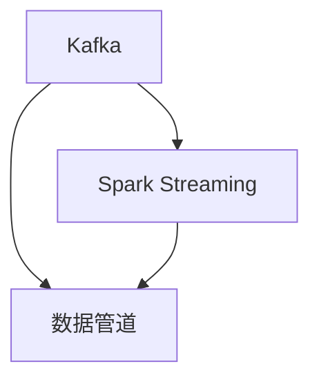

                 

# Kafka-Spark Streaming整合原理与代码实例讲解

> 关键词：Kafka, Spark Streaming, 实时数据流处理, 实时数据流, 数据管道, 大数据技术

## 1. 背景介绍

### 1.1 问题由来
随着互联网应用的蓬勃发展，数据的产生和收集速度越来越快，对数据的实时处理需求日益增长。大数据技术，特别是流数据处理技术，越来越受到企业的重视。实时数据流处理（Real-time Stream Processing）是应对这种需求的重要手段，可以实时分析海量数据，进行决策、监控、预警等业务，有效提升企业的业务效率和竞争力。

Kafka和Spark Streaming是两个非常流行的开源技术，能够无缝整合进行实时数据流处理。Kafka作为一个高性能、分布式消息队列系统，能够稳定地存储海量数据流，而Spark Streaming作为Spark的流处理扩展，能够高效地进行实时数据流处理和分析。

### 1.2 问题核心关键点
Kafka与Spark Streaming的整合，简化了实时数据流处理的流程，可以实时接收、存储、处理海量数据，实现灵活的数据管道。使用Kafka-Spark Streaming整合，可以大大提升数据的处理速度和稳定性，满足实时性要求高的业务场景。

整合的核心关键点包括：

- Kafka消息队列：用于稳定存储和传输数据流。
- Spark Streaming：负责实时数据流的处理和分析。
- 数据管道：实现数据的稳定传输和处理。

这些技术在大数据技术栈中的应用，展示了流处理技术的强大功能和实际价值。

### 1.3 问题研究意义
Kafka-Spark Streaming的整合，可以解决企业数据实时处理需求，提升数据处理速度和质量。通过这种整合，企业能够快速构建实时数据流处理系统，实时响应业务需求，提高业务效率和市场竞争力。同时，这种技术栈也展示了大数据技术的先进性和实用性，为企业的数字化转型提供了有力支撑。

## 2. 核心概念与联系

### 2.1 核心概念概述

为了更好地理解Kafka与Spark Streaming的整合，这里先介绍几个关键概念：

- Kafka：一个高性能、分布式的消息队列系统，用于存储、传输、处理海量数据流。
- Spark Streaming：Spark的流处理扩展，用于实时处理和分析数据流。
- 数据管道：将数据的产生、传输和处理串联起来，实现数据的无缝传递和处理。

这三大概念通过Kafka和Spark Streaming的无缝整合，构建了灵活、高效的实时数据流处理系统。下面通过一个简单的Mermaid流程图，来展示它们之间的联系：



这个流程图展示了Kafka与Spark Streaming的整合过程：数据通过Kafka进行稳定存储和传输，再由Spark Streaming进行处理和分析，最终通过数据管道进行传输，实现数据的实时处理和分析。

## 3. 核心算法原理 & 具体操作步骤
### 3.1 算法原理概述

Kafka-Spark Streaming的整合，基于消息队列和流处理的原理。Kafka负责数据的存储和传输，Spark Streaming负责数据的实时处理和分析。两者通过流管道连接，实现数据的稳定传输和处理。

Kafka的消息队列可以高效存储海量数据，并提供稳定可靠的数据传输。Spark Streaming则利用Spark的分布式计算能力，高效处理实时数据流，实现灵活的数据管道。

### 3.2 算法步骤详解

Kafka-Spark Streaming的整合，通常包括以下几个关键步骤：

1. **配置Kafka和Spark Streaming**：
   - 配置Kafka，确保其能够稳定存储和传输数据流。
   - 配置Spark Streaming，确保其能够实时处理和分析数据流。

2. **创建Spark Streaming应用程序**：
   - 创建Spark Streaming应用程序，实现数据的实时处理和分析。

3. **将Kafka与Spark Streaming连接起来**：
   - 通过Kafka Topic，将Kafka与Spark Streaming连接起来，实现数据的稳定传输和处理。

4. **处理数据流**：
   - 在Spark Streaming应用程序中，处理接收到的数据流，实现实时分析和处理。

5. **写入结果**：
   - 将处理结果写入Kafka Topic，或直接输出到其他系统。

### 3.3 算法优缺点

Kafka-Spark Streaming的整合，具有以下优点：

- 高效稳定：Kafka和Spark Streaming都是高性能、分布式系统，能够高效稳定地处理海量数据流。
- 灵活性高：可以通过流管道连接Kafka和Spark Streaming，实现灵活的数据处理和分析。
- 容易扩展：可以通过增加Kafka和Spark Streaming的节点，实现系统的横向扩展。

同时，这种整合也存在以下缺点：

- 资源占用大：需要同时运行Kafka和Spark Streaming，可能占用较多的系统资源。
- 实现复杂：需要配置和调试多个系统，实现难度较大。
- 成本较高：需要部署和管理多个系统，可能增加企业的成本。

### 3.4 算法应用领域

Kafka-Spark Streaming的整合，广泛应用于实时数据流处理领域，包括但不限于以下几个方面：

- 实时数据监控：通过实时监控系统，及时发现业务异常，提升业务效率。
- 实时数据分析：通过实时数据分析系统，实现业务决策和优化。
- 实时预警系统：通过实时预警系统，及时应对业务风险，保障业务稳定运行。
- 实时推荐系统：通过实时推荐系统，提升用户体验和业务收益。
- 实时交易系统：通过实时交易系统，保障交易安全性和稳定性。

这些应用场景，展示了Kafka-Spark Streaming整合的强大功能和实际价值，有助于企业在实际业务中提升竞争力。

## 4. 数学模型和公式 & 详细讲解 & 举例说明

### 4.1 数学模型构建

Kafka-Spark Streaming的整合，可以构建以下数学模型：

设 $x_t$ 表示第 $t$ 时刻的数据流，则有：

$$
x_t = (x_1, x_2, \cdots, x_t)
$$

其中 $x_i$ 表示第 $i$ 时刻的数据流。

通过Kafka存储和传输数据流 $x_t$，有：

$$
y_t = (y_1, y_2, \cdots, y_t)
$$

其中 $y_i$ 表示第 $i$ 时刻通过Kafka传输的数据流。

通过Spark Streaming处理数据流 $y_t$，有：

$$
z_t = (z_1, z_2, \cdots, z_t)
$$

其中 $z_i$ 表示第 $i$ 时刻通过Spark Streaming处理的数据流。

最终将处理结果 $z_t$ 写入Kafka Topic，或直接输出到其他系统，实现数据的稳定传输和处理。

### 4.2 公式推导过程

在Kafka-Spark Streaming的整合中，数据流 $x_t$ 的存储和传输、处理和分析，可以表示为：

$$
y_t = f(x_t)
$$

其中 $f$ 表示Kafka存储和传输函数。

在Spark Streaming中，对数据流 $y_t$ 进行处理和分析，可以表示为：

$$
z_t = g(y_t)
$$

其中 $g$ 表示Spark Streaming处理函数。

最终将处理结果 $z_t$ 写入Kafka Topic，或直接输出到其他系统，可以表示为：

$$
w_t = h(z_t)
$$

其中 $h$ 表示写入函数。

将上述公式串联起来，可以得到Kafka-Spark Streaming整合的数学模型：

$$
w_t = h(g(f(x_t)))
$$

### 4.3 案例分析与讲解

以一个简单的实时数据监控系统为例，展示Kafka-Spark Streaming的整合过程：

1. 数据监控系统通过Kafka实时接收传感器数据 $x_t$。

2. 数据监控系统通过Spark Streaming处理传感器数据 $y_t$，提取关键信息 $z_t$。

3. 数据监控系统将处理结果 $z_t$ 写入Kafka Topic，实现数据的稳定传输和处理。

4. 数据监控系统通过Kafka Topic，实时获取传感器数据 $x_t$，继续进行监控和分析。

这个过程展示了Kafka-Spark Streaming的整合，高效、稳定、灵活地处理实时数据流，实现数据管道和实时监控。

## 5. 项目实践：代码实例和详细解释说明

### 5.1 开发环境搭建

在进行Kafka-Spark Streaming整合的实践前，需要准备好开发环境。以下是使用Python进行开发的环境配置流程：

1. 安装Anaconda：从官网下载并安装Anaconda，用于创建独立的Python环境。

2. 创建并激活虚拟环境：
```bash
conda create -n kafka-spark-env python=3.8 
conda activate kafka-spark-env
```

3. 安装Kafka和Spark Streaming：
```bash
conda install kafka-python spark-streaming python=3.8
```

4. 安装Apache Kafka：
```bash
wget https://downloads.apache.org/kafka/2.8.0/kafka_2.13-2.8.0.tgz
tar -xvf kafka_2.13-2.8.0.tgz
cd kafka_2.13-2.8.0
bin/kafka-server-start.sh config/server.properties
```

5. 安装Apache Spark：
```bash
wget https://downloads.apache.org/spark/spark-3.1.1/spark-3.1.1-bin-hadoop3.2.tgz
tar -xvf spark-3.1.1-bin-hadoop3.2.tgz
cd spark-3.1.1-bin-hadoop3.2
bin/spark-submit --class org.apache.spark.examples.SparkPiExample --master local --deploy-mode cluster --executor-cores 2 piexample.jar
```

完成上述步骤后，即可在`kafka-spark-env`环境中开始Kafka-Spark Streaming的实践。

### 5.2 源代码详细实现

下面我们以一个简单的实时数据监控系统为例，展示如何使用Kafka和Spark Streaming进行数据流处理。

首先，定义Kafka的生产者：

```python
from kafka import KafkaProducer
from kafka.errors import KafkaError
import random

# 定义生产者
producer = KafkaProducer(bootstrap_servers='localhost:9092',
                        acks='all',
                        value_serializer=str.encode)

# 发送数据
for i in range(10):
    data = f'{i}:{random.randint(1,100)}'
    try:
        producer.send('topic1', value=data)
    except KafkaError as e:
        print(e)
```

然后，定义Spark Streaming的接收者：

```python
from pyspark.streaming import StreamingContext
from pyspark.streaming.kafka import KafkaUtils
import time

# 创建Spark Streaming上下文
sc = StreamingContext(spark, 1)

# 创建Kafka Stream
kafkaStream = KafkaUtils.createStream(sc, 'localhost:2181', 'spark-streaming',
                                     ['topic1'])

# 定义数据处理函数
def processData(rdd):
    data = rdd.map(lambda x: x[1])
    mean = data.mean()
    return mean

# 处理数据
kafkaStream.foreachRDD(processData)

# 启动Spark Streaming
sc.start()
while True:
    time.sleep(5)

sc.stop()
```

最后，将处理结果写入Kafka Topic：

```python
from kafka import KafkaProducer

# 定义生产者
producer = KafkaProducer(bootstrap_servers='localhost:9092',
                        acks='all',
                        value_serializer=str.encode)

# 发送数据
for i in range(10):
    data = f'{i}:{random.randint(1,100)}'
    try:
        producer.send('topic2', value=data)
    except KafkaError as e:
        print(e)
```

这个过程展示了使用Kafka和Spark Streaming进行数据流处理的完整代码实现。可以看到，Kafka和Spark Streaming的整合，可以高效、稳定地处理实时数据流，实现数据管道和实时监控。

### 5.3 代码解读与分析

让我们再详细解读一下关键代码的实现细节：

**Kafka生产者**：
- 使用KafkaProducer发送数据流，确保数据稳定传输。

**Spark Streaming接收者**：
- 使用StreamingContext创建Spark Streaming上下文，指定Kafka参数，确保数据稳定接收。
- 使用KafkaUtils创建Kafka Stream，指定Kafka参数，确保数据稳定处理。
- 定义数据处理函数，使用foreachRDD实现对数据流的处理。
- 启动Spark Streaming，实现数据的实时处理和分析。

**数据写入Kafka Topic**：
- 使用KafkaProducer发送处理结果，确保数据稳定写入。

这个过程展示了Kafka-Spark Streaming整合的完整实现流程，帮助读者更好地理解技术细节。

## 6. 实际应用场景

### 6.1 实时数据监控系统

实时数据监控系统是Kafka-Spark Streaming整合的典型应用场景之一。通过实时监控系统，企业能够及时发现业务异常，提升业务效率。例如，在电子商务平台中，通过实时监控订单数据，可以及时发现交易异常、库存不足等问题，保障业务稳定运行。

### 6.2 实时数据分析系统

实时数据分析系统是Kafka-Spark Streaming整合的另一个重要应用场景。通过实时数据分析系统，企业能够实时分析海量数据，进行业务决策和优化。例如，在金融领域，通过实时分析交易数据，可以及时发现市场风险、预测市场走势，提升业务决策效率。

### 6.3 实时预警系统

实时预警系统是Kafka-Spark Streaming整合的另一个重要应用场景。通过实时预警系统，企业能够及时应对业务风险，保障业务稳定运行。例如，在医疗领域，通过实时分析患者数据，可以及时发现病情异常、预警疫情爆发，提升业务安全性。

### 6.4 未来应用展望

随着Kafka-Spark Streaming整合技术的不断发展，未来的应用场景也将更加广泛，例如：

1. 实时推荐系统：通过实时分析用户数据，实现个性化推荐，提升用户体验和业务收益。
2. 实时交易系统：通过实时监控交易数据，保障交易安全性和稳定性。
3. 实时视频分析系统：通过实时分析视频数据，实现智能监控、异常检测等功能。
4. 实时日志分析系统：通过实时分析日志数据，实现故障诊断、性能优化等功能。

未来，随着Kafka-Spark Streaming整合技术的不断完善，将有更多的应用场景被挖掘和应用，进一步提升企业的数据处理能力和业务效率。

## 7. 工具和资源推荐

### 7.1 学习资源推荐

为了帮助开发者系统掌握Kafka-Spark Streaming技术，这里推荐一些优质的学习资源：

1. Kafka官方文档：Kafka官方文档详细介绍了Kafka的架构、使用方法、最佳实践等，是学习Kafka的必备资料。

2. Spark Streaming官方文档：Spark Streaming官方文档详细介绍了Spark Streaming的架构、使用方法、最佳实践等，是学习Spark Streaming的必备资料。

3. Kafka与Spark Streaming整合教程：《Kafka与Spark Streaming整合教程》一书，详细介绍了Kafka与Spark Streaming的整合原理、实现方法和案例分析，适合进阶学习。

4. Udemy课程：Udemy网站上有多门关于Kafka和Spark Streaming的课程，涵盖了从基础到高级的各种主题，适合不同水平的学习者。

5. GitHub项目：GitHub上有很多优秀的Kafka-Spark Streaming项目，提供了丰富的实战案例和代码示例，适合动手实践。

通过对这些资源的学习，相信你一定能够快速掌握Kafka-Spark Streaming技术的精髓，并用于解决实际的业务问题。

### 7.2 开发工具推荐

Kafka-Spark Streaming的整合，需要选择合适的开发工具进行支持。以下是几款常用的开发工具：

1. PyCharm：PyCharm是一个功能强大的Python IDE，支持Kafka和Spark Streaming的开发和调试，是开发Kafka-Spark Streaming应用的得力助手。

2. Eclipse：Eclipse是一个功能丰富的Java IDE，支持Kafka和Spark Streaming的开发和调试，是开发Kafka-Spark Streaming应用的常用工具。

3. IntelliJ IDEA：IntelliJ IDEA是一个功能强大的Java IDE，支持Kafka和Spark Streaming的开发和调试，是开发Kafka-Spark Streaming应用的高级工具。

4. Visual Studio Code：Visual Studio Code是一个轻量级的代码编辑器，支持Kafka和Spark Streaming的开发和调试，是开发Kafka-Spark Streaming应用的灵活工具。

合理利用这些工具，可以显著提升Kafka-Spark Streaming应用的开发效率，加快创新迭代的步伐。

### 7.3 相关论文推荐

Kafka-Spark Streaming的整合技术，源于学界的持续研究。以下是几篇奠基性的相关论文，推荐阅读：

1. "Apache Kafka: High Throughput, Low Latency Publishing and Subscribing of Records"：Kafka的奠基性论文，介绍了Kafka的架构和核心技术。

2. "Streaming Stream Processing with Apache Spark"：Spark Streaming的奠基性论文，介绍了Spark Streaming的架构和核心技术。

3. "Integrating Apache Kafka with Apache Spark Streaming"：研究Kafka与Spark Streaming的整合原理和技术细节的论文。

4. "Real-time Streaming with Apache Kafka and Apache Spark"：介绍Kafka与Spark Streaming整合的实际应用场景的论文。

这些论文代表了大数据流处理技术的发展脉络，是深入理解Kafka-Spark Streaming整合技术的重要参考资料。

## 8. 总结：未来发展趋势与挑战

### 8.1 总结

本文对Kafka-Spark Streaming的整合原理与代码实例进行了详细讲解。首先介绍了Kafka与Spark Streaming的背景和意义，明确了它们在大数据技术栈中的重要地位。其次，从原理到实践，详细讲解了Kafka-Spark Streaming的数学模型和实现方法，提供了完整的代码实例和详细解释。同时，本文还探讨了Kafka-Spark Streaming在实际应用中的多个场景，展示了其强大的功能和实际价值。

通过本文的系统梳理，可以看到，Kafka-Spark Streaming整合技术的不断进步，将进一步提升企业的数据处理能力和业务效率，推动企业数字化转型和智能化升级。

### 8.2 未来发展趋势

展望未来，Kafka-Spark Streaming整合技术将呈现以下几个发展趋势：

1. 高效稳定：随着Kafka和Spark Streaming的不断优化，Kafka-Spark Streaming的整合将更加高效稳定，能够处理更复杂的业务场景。

2. 实时性提升：随着流处理技术的不断发展，Kafka-Spark Streaming的实时性将进一步提升，能够满足更高要求的实时性需求。

3. 易用性增强：随着工具和平台的不断优化，Kafka-Spark Streaming的易用性将进一步增强，使用门槛将大大降低。

4. 多平台支持：随着技术的不断演进，Kafka-Spark Streaming将支持更多平台和环境，具备更强的通用性和灵活性。

5. 数据融合能力提升：随着技术的不断发展，Kafka-Spark Streaming的数据融合能力将进一步提升，能够处理更多数据源和数据类型。

6. 安全性和可靠性提升：随着技术的不断发展，Kafka-Spark Streaming的安全性和可靠性将进一步提升，能够保障数据处理的稳定性和安全性。

这些趋势展示了Kafka-Spark Streaming整合技术的强大潜力和发展前景，将进一步提升企业的数据处理能力和业务效率。

### 8.3 面临的挑战

尽管Kafka-Spark Streaming整合技术已经取得了显著进展，但在迈向更加智能化、普适化应用的过程中，它仍面临着诸多挑战：

1. 数据一致性：在数据传输和处理过程中，数据一致性是一个重要问题，如何保证数据的一致性和准确性，将是未来的关键挑战。

2. 数据安全：在数据传输和处理过程中，数据安全是一个重要问题，如何保障数据的安全性和隐私性，将是未来的关键挑战。

3. 系统扩展性：随着数据量的增加，系统的扩展性将是一个重要问题，如何实现系统的水平和垂直扩展，将是未来的关键挑战。

4. 系统性能：在数据传输和处理过程中，系统的性能将是一个重要问题，如何提升系统的处理速度和稳定性，将是未来的关键挑战。

5. 技术复杂性：Kafka-Spark Streaming的整合技术较为复杂，如何降低技术门槛，提高易用性，将是未来的关键挑战。

6. 资源消耗：Kafka-Spark Streaming的整合需要消耗大量的系统资源，如何优化资源消耗，提高系统效率，将是未来的关键挑战。

这些挑战需要开发者不断进行技术创新和优化，才能实现Kafka-Spark Streaming技术的全面发展和广泛应用。

### 8.4 研究展望

面向未来，Kafka-Spark Streaming整合技术还需要在以下几个方面进行进一步的研究和探索：

1. 数据一致性算法：研究数据一致性算法，提升数据的一致性和准确性。

2. 数据安全技术：研究数据安全技术，提升数据的安全性和隐私性。

3. 系统扩展技术：研究系统扩展技术，提升系统的水平和垂直扩展能力。

4. 系统性能优化：研究系统性能优化技术，提升系统的处理速度和稳定性。

5. 易用性提升技术：研究易用性提升技术，降低技术门槛，提高易用性。

6. 资源消耗优化技术：研究资源消耗优化技术，降低资源消耗，提高系统效率。

这些研究方向的探索，将进一步推动Kafka-Spark Streaming技术的全面发展和广泛应用，为企业的数字化转型和智能化升级提供有力支撑。

## 9. 附录：常见问题与解答

**Q1：Kafka-Spark Streaming的整合技术是否适用于所有实时数据流处理场景？**

A: Kafka-Spark Streaming的整合技术适用于大部分实时数据流处理场景，特别是对于需要高效、稳定、灵活处理海量数据流的场景。但对于一些特殊场景，如高实时性要求、高并发性要求等，可能需要选择其他技术，如Flink、Storm等。

**Q2：Kafka-Spark Streaming的整合技术需要占用哪些系统资源？**

A: Kafka-Spark Streaming的整合需要占用系统资源较多，包括CPU、内存、磁盘等。具体资源占用量取决于数据流量和处理复杂度。一般建议根据数据流量的实际情况进行资源配置，避免资源浪费和不足。

**Q3：Kafka-Spark Streaming的整合技术如何处理数据丢失和重复？**

A: Kafka-Spark Streaming的整合技术通过设置高可靠的消费者和生产者，可以有效地处理数据丢失和重复问题。Kafka的生产者和消费者可以通过设置acks参数和retries参数，确保数据稳定传输和处理。同时，Spark Streaming可以通过设置checkpoint和recovery机制，避免数据丢失和重复。

**Q4：Kafka-Spark Streaming的整合技术如何处理数据延迟？**

A: Kafka-Spark Streaming的整合技术通过设置合适的消费窗口和批处理窗口，可以有效地处理数据延迟问题。消费窗口和批处理窗口的设置需要根据实际业务场景进行调整，避免数据延迟过大影响业务性能。

**Q5：Kafka-Spark Streaming的整合技术如何进行扩展？**

A: Kafka-Spark Streaming的整合技术可以通过增加Kafka和Spark Streaming的节点，实现系统的水平扩展。同时，可以通过优化系统架构和算法，实现系统的垂直扩展。例如，可以通过优化数据分区和优化处理算法，提升系统的性能和稳定性。

这些问题的解答，展示了Kafka-Spark Streaming整合技术的实现细节和应用场景，帮助开发者更好地理解和应用这项技术。

---

作者：禅与计算机程序设计艺术 / Zen and the Art of Computer Programming

