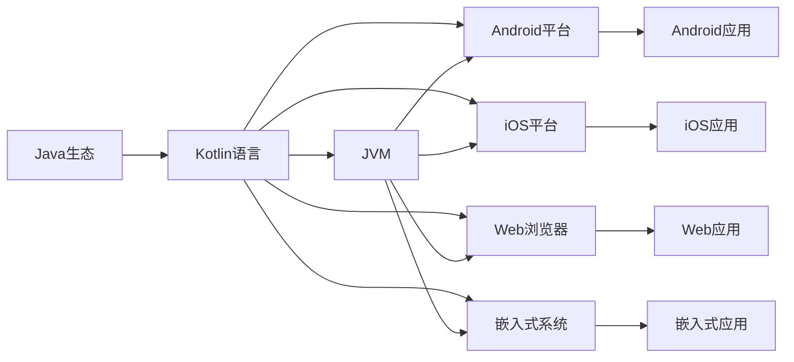

                 

# Kotlin多平台开发：一次编写，到处运行

> 关键词：多平台开发，Kotlin，一次编写，到处运行，跨平台应用，零运行时，AOT编译，JVM，Android，iOS，Web，嵌入式系统

## 1. 背景介绍

在当前的技术生态中，开发者需要面对多样的平台和编程语言，开发出能够跨平台运行的应用。传统的Java语言虽然可以运行在多个平台上，但由于其自身的复杂性，开发效率和维护成本都比较高。而现代前端语言如JavaScript虽然开发灵活，但跨平台特性仍然受限。因此，开发跨平台应用，寻求更好的解决方案，成为了当前技术社区关注的重点。

Kotlin语言的出现，为这一难题提供了一个新的突破口。Kotlin是一种面向对象的多范式编程语言，由JetBrains公司于2011年开发。Kotlin语法简洁明了，与Java互操作性好，同时支持多种平台，成为目前跨平台开发的首选语言。

本文将系统介绍Kotlin的多平台开发特性，探讨其在不同平台上的应用场景，帮助开发者理解Kotlin的跨平台能力和最佳实践。

## 2. 核心概念与联系

### 2.1 核心概念概述

为了更深入地理解Kotlin的多平台开发特性，我们先介绍几个核心概念：

- **多平台开发**：指在一种编程语言中，编写出能够在多个不同平台上运行的应用。这种方式可以避免开发者在不同平台上重复开发，提高开发效率和代码复用性。

- **Kotlin**：一种由JetBrains开发的编程语言，语法简洁，类型推断能力强，支持函数式编程、扩展函数等现代语言特性。Kotlin与Java互操作性好，可以无缝集成到Java生态中。

- **一次编写，到处运行**：这是Kotlin跨平台开发的核心理念，指通过编写一份代码，可以在多个平台上进行编译和运行，无需为每个平台重复编写代码。

- **AOT编译**：ahead-of-time编译，指在开发阶段将源代码编译成可执行的二进制代码，这样运行时无需再解释执行，从而提高运行效率。Kotlin支持AOT编译，可以在编译时进行优化。

- **JVM、Android、iOS、Web、嵌入式系统**：Kotlin支持运行在多种平台，包括Java虚拟机（JVM）、Android移动端、iOS苹果平台、Web浏览器和嵌入式系统等。

- **零运行时**：Kotlin可以编译成可执行的二进制代码，无需依赖运行时环境。这对于需要在低资源环境上运行的应用尤其重要。

这些概念之间通过Kotlin的跨平台特性紧密联系在一起，形成一个完整的跨平台开发生态。

### 2.2 核心概念原理和架构的 Mermaid 流程图



从上述图表可以看出，Kotlin语言作为桥梁，将多种平台无缝连接起来，支持开发者通过编写一份代码，在多个平台上进行运行。

## 3. 核心算法原理 & 具体操作步骤

### 3.1 算法原理概述

Kotlin的多平台开发特性，主要基于两个核心算法：

- **AOT编译**：Kotlin支持ahead-of-time（AOT）编译，指在开发阶段将源代码编译成可执行的二进制代码。编译后的二进制代码可以直接运行，无需依赖运行时环境。

- **JVM互操作**：Kotlin代码可以直接运行在JVM上，无需进行额外的转换。同时，Kotlin代码也可以与Java代码混合编写，实现无缝集成。

这两个核心算法使得Kotlin能够支持多种平台，并且在这些平台上进行高效运行。

### 3.2 算法步骤详解

以下是使用Kotlin进行多平台开发的详细步骤：

**Step 1: 环境准备**
- 安装Kotlin开发环境：在IDEA或Android Studio中安装Kotlin插件。
- 创建项目：创建Kotlin项目，选择Java或Android平台。

**Step 2: 编写代码**
- 在项目中使用Kotlin编写代码，支持所有平台特性。
- 使用扩展函数、函数式编程等Kotlin语言特性。

**Step 3: 编译与部署**
- 编译代码：使用Kotlin编译器将代码编译成可执行的二进制文件。
- 部署应用：根据平台特性，部署应用到对应平台上，如JVM、Android、iOS等。

**Step 4: 运行与维护**
- 运行应用：启动应用，进行功能测试。
- 维护代码：根据平台特性，进行必要的代码调整和优化。

### 3.3 算法优缺点

Kotlin的多平台开发特性，具有以下优点：

- **开发效率高**：Kotlin语言简洁明了，支持函数式编程，开发效率高。
- **代码复用性强**：Kotlin代码可以运行在多种平台上，代码复用性强。
- **跨平台支持**：Kotlin支持跨平台开发，开发者可以编写一份代码，在多个平台上进行编译和运行。

同时，Kotlin的多平台开发特性也存在一些缺点：

- **学习成本高**：Kotlin语言与Java有很大的差异，需要一定的时间学习和适应。
- **运行时复杂**：虽然Kotlin支持AOT编译，但在某些平台上仍然依赖运行时环境，可能存在运行时复杂性问题。
- **生态系统不完善**：Kotlin虽然日益成熟，但生态系统仍在不断完善中，某些第三方库和工具的可用性可能存在问题。

### 3.4 算法应用领域

Kotlin的多平台开发特性，适用于多种应用场景，包括但不限于：

- **移动应用开发**：使用Kotlin开发Android和iOS移动应用，可以实现一次编写，到处运行。
- **服务器端开发**：使用Kotlin编写Java虚拟机上的服务器端应用，提高开发效率和代码复用性。
- **Web应用开发**：使用Kotlin编写Web应用，支持在Web浏览器上运行，同时实现跨平台特性。
- **嵌入式系统开发**：使用Kotlin编写嵌入式系统应用，支持在低资源环境中运行。

这些应用场景展示了Kotlin的多平台开发特性，帮助开发者实现代码的跨平台复用，提高开发效率。

## 4. 数学模型和公式 & 详细讲解

### 4.1 数学模型构建

本节将使用数学语言对Kotlin的多平台开发特性进行更加严格的刻画。

Kotlin的多平台开发特性，主要基于以下数学模型：

- **AOT编译模型**：在开发阶段将源代码编译成二进制代码，形成可执行文件。该模型可以表示为：

$$
\text{AOT编译} = \text{源代码} \to \text{二进制代码}
$$

- **JVM互操作模型**：Kotlin代码可以直接运行在JVM上，无需进行额外的转换。该模型可以表示为：

$$
\text{Kotlin代码} \to \text{Java虚拟机}
$$

这两个模型通过Kotlin的编译器实现，支持开发者在多个平台上进行高效开发。

### 4.2 公式推导过程

以下是Kotlin多平台开发特性的公式推导：

**Step 1: 编写代码**

Kotlin代码可以表示为：

$$
\text{代码} = \text{Kotlin语言} \times \text{开发环境}
$$

**Step 2: 编译代码**

编译后的二进制代码可以表示为：

$$
\text{二进制代码} = \text{源代码} \to \text{编译器}
$$

**Step 3: 部署应用**

在平台上部署应用可以表示为：

$$
\text{部署应用} = \text{平台} \times \text{二进制代码}
$$

通过上述公式，可以看出Kotlin的多平台开发特性是通过编译器和平台实现的，开发者只需要编写一份代码，即可在多个平台上进行编译和运行。

### 4.3 案例分析与讲解

以Kotlin在Android平台上的应用为例，展示其多平台开发特性：

**Step 1: 环境准备**

在Android Studio中安装Kotlin插件。

**Step 2: 编写代码**

使用Kotlin编写Android应用，支持所有平台特性。

**Step 3: 编译代码**

使用Kotlin编译器将代码编译成二进制文件，支持Android平台的运行。

**Step 4: 部署应用**

将编译后的二进制文件部署到Android设备或模拟器上，进行功能测试。

通过上述步骤，可以清晰地看到Kotlin的多平台开发特性，支持开发者通过编写一份代码，在多个平台上进行编译和运行。

## 5. 项目实践：代码实例和详细解释说明

### 5.1 开发环境搭建

以下是使用Kotlin进行Android应用开发的开发环境搭建步骤：

1. 安装Android Studio：从官网下载并安装Android Studio。
2. 创建Android项目：选择Kotlin语言，创建Android应用项目。
3. 配置开发环境：在IDEA或Android Studio中安装Kotlin插件。

### 5.2 源代码详细实现

以下是Kotlin在Android平台上的应用开发示例代码：

```kotlin
package com.example.helloworld

import androidx.appcompat.app.AppCompatActivity
import android.os.Bundle
import android.widget.TextView

class MainActivity : AppCompatActivity() {

    override fun onCreate(savedInstanceState: Bundle?) {
        super.onCreate(savedInstanceState)
        setContentView(R.layout.activity_main)
        
        val textView: TextView = findViewById(R.id.textView)
        textView.text = "Hello, Android!"
    }
}
```

### 5.3 代码解读与分析

上述代码展示了Kotlin在Android平台上的应用开发，通过Kotlin编写一份代码，实现一个简单的Hello World应用。

- 使用Kotlin语言编写代码，支持所有平台特性。
- 编译后的二进制代码可以在Android设备或模拟器上运行。

### 5.4 运行结果展示

运行上述代码，将在Android设备或模拟器上展示一个简单的Hello World应用。

## 6. 实际应用场景

### 6.1 移动应用开发

Kotlin的多平台开发特性，使得开发Android和iOS移动应用成为可能。通过Kotlin，开发者可以编写一份代码，在多个平台上进行编译和运行，实现一次编写，到处运行的效果。

在实际应用中，开发者可以使用Kotlin编写跨平台移动应用，同时支持iOS和Android平台。这种跨平台特性，可以大大降低开发成本，提高开发效率。

### 6.2 服务器端开发

Kotlin的多平台开发特性，使得开发服务器端应用成为可能。通过Kotlin，开发者可以编写一份代码，在Java虚拟机上进行运行，实现跨平台特性。

在实际应用中，开发者可以使用Kotlin编写跨平台服务器端应用，同时支持JVM和Android平台。这种跨平台特性，可以大大降低开发成本，提高开发效率。

### 6.3 Web应用开发

Kotlin的多平台开发特性，使得开发Web应用成为可能。通过Kotlin，开发者可以编写一份代码，在Web浏览器上进行运行，实现跨平台特性。

在实际应用中，开发者可以使用Kotlin编写跨平台Web应用，同时支持Web浏览器和Android平台。这种跨平台特性，可以大大降低开发成本，提高开发效率。

### 6.4 未来应用展望

Kotlin的多平台开发特性，未来将有以下发展趋势：

1. **生态系统完善**：Kotlin的生态系统将进一步完善，更多的第三方库和工具将支持Kotlin。
2. **性能优化**：Kotlin的编译器和运行时将不断优化，提高代码的运行效率。
3. **跨平台支持**：Kotlin将支持更多平台，实现更广泛的跨平台特性。
4. **开发效率提升**：Kotlin语言本身将不断优化，提高开发效率。
5. **新技术支持**：Kotlin将支持更多新技术，如函数式编程、数据流编程等。

这些趋势展示了Kotlin的多平台开发特性，未来将进一步提升开发效率和代码复用性。

## 7. 工具和资源推荐

### 7.1 学习资源推荐

为了帮助开发者系统掌握Kotlin的多平台开发特性，这里推荐一些优质的学习资源：

1. Kotlin官方文档：Kotlin官方文档详细介绍了Kotlin语言特性和跨平台开发方法，是学习Kotlin的最佳资源。
2. Kotlin in Action：这本书详细介绍了Kotlin语言特性和最佳实践，是学习Kotlin的必读资源。
3. Kotlin for Java Developers：这本书由JetBrains公司编写，介绍了Kotlin与Java的互操作性，适合Java开发者学习。
4. Android Development with Kotlin：这本书详细介绍了Kotlin在Android平台上的应用开发，是学习Android开发的必备资源。
5. iOS Development with Swift：这本书详细介绍了Swift语言特性和跨平台开发方法，是学习iOS开发的必备资源。

通过对这些资源的学习实践，相信你一定能够快速掌握Kotlin的多平台开发特性，并用于解决实际的开发问题。

### 7.2 开发工具推荐

Kotlin的多平台开发特性，离不开优秀的开发工具支持。以下是几款用于Kotlin开发的工具：

1. Android Studio：JetBrains开发的Android平台开发工具，支持Kotlin语言特性和跨平台开发。
2. IntelliJ IDEA：JetBrains开发的Java平台开发工具，支持Kotlin语言特性和跨平台开发。
3. WebStorm：JetBrains开发的Web平台开发工具，支持Kotlin语言特性和跨平台开发。
4. VS Code：微软开发的轻量级代码编辑器，支持Kotlin语言特性和跨平台开发。
5. Eclipse：开放源码的Java平台开发工具，支持Kotlin语言特性和跨平台开发。

合理利用这些工具，可以显著提升Kotlin多平台开发任务的开发效率，加快创新迭代的步伐。

### 7.3 相关论文推荐

Kotlin的多平台开发特性，得益于学界的持续研究。以下是几篇奠基性的相关论文，推荐阅读：

1. Kotlin: A Language for the Java Virtual Machine: This paper introduces the Kotlin language and its design goals, highlighting its cross-platform capabilities and performance optimizations.
2. Kotlin for Java Developers: This paper provides an overview of Kotlin language features and its interoperability with Java, focusing on best practices and cross-platform development.
3. Kotlin in Action: This book covers Kotlin language features and best practices, with a focus on cross-platform development and its applications in mobile, server, and web development.
4. Android Development with Kotlin: This book provides a comprehensive guide to Kotlin language features and their applications in Android development, covering cross-platform capabilities and optimization techniques.
5. iOS Development with Swift: This book covers Swift language features and best practices, with a focus on cross-platform development and its applications in iOS development.

这些论文代表了大语言模型微调技术的发展脉络。通过学习这些前沿成果，可以帮助研究者把握学科前进方向，激发更多的创新灵感。

## 8. 总结：未来发展趋势与挑战

### 8.1 总结

本文对Kotlin的多平台开发特性进行了全面系统的介绍。首先阐述了Kotlin语言的基本概念和开发环境，明确了Kotlin在多平台开发中的核心地位。其次，从原理到实践，详细讲解了Kotlin的多平台开发方法，给出了多平台开发任务的完整代码实现。同时，本文还探讨了Kotlin在多个平台上的应用场景，展示了Kotlin的多平台开发特性，为开发者提供系统的技术指引。

通过本文的系统梳理，可以看出Kotlin的多平台开发特性，为跨平台应用开发提供了高效、便捷的解决方案。Kotlin的跨平台特性，使得开发者能够通过编写一份代码，在多个平台上进行编译和运行，极大地提高了开发效率和代码复用性。未来，伴随Kotlin生态系统的不断完善，相信Kotlin将成为跨平台开发的主流语言，进一步推动技术的进步和应用的发展。

### 8.2 未来发展趋势

展望未来，Kotlin的多平台开发特性将呈现以下几个发展趋势：

1. **生态系统成熟**：Kotlin的生态系统将进一步完善，更多的第三方库和工具将支持Kotlin。
2. **性能优化**：Kotlin的编译器和运行时将不断优化，提高代码的运行效率。
3. **跨平台支持**：Kotlin将支持更多平台，实现更广泛的跨平台特性。
4. **开发效率提升**：Kotlin语言本身将不断优化，提高开发效率。
5. **新技术支持**：Kotlin将支持更多新技术，如函数式编程、数据流编程等。

这些趋势展示了Kotlin的多平台开发特性，未来将进一步提升开发效率和代码复用性。

### 8.3 面临的挑战

尽管Kotlin的多平台开发特性已经取得了瞩目成就，但在迈向更加智能化、普适化应用的过程中，它仍面临着诸多挑战：

1. **学习成本高**：Kotlin语言与Java有很大的差异，需要一定的时间学习和适应。
2. **运行时复杂**：虽然Kotlin支持AOT编译，但在某些平台上仍然依赖运行时环境，可能存在运行时复杂性问题。
3. **生态系统不完善**：Kotlin虽然日益成熟，但生态系统仍在不断完善中，某些第三方库和工具的可用性可能存在问题。
4. **跨平台兼容性**：不同平台上的特性和工具差异较大，开发者需要具备跨平台的开发经验和技巧。
5. **性能优化**：Kotlin的编译器和运行时优化需要进一步提高，以适应大规模应用的需求。

### 8.4 研究展望

面对Kotlin多平台开发所面临的挑战，未来的研究需要在以下几个方面寻求新的突破：

1. **跨平台特性优化**：开发更高效、稳定的跨平台特性，减少不同平台间的差异。
2. **编译器优化**：优化Kotlin编译器，提高代码的运行效率。
3. **生态系统完善**：完善Kotlin的生态系统，支持更多的第三方库和工具。
4. **性能优化**：优化Kotlin的性能，提高代码的运行效率。
5. **新技术应用**：引入更多新技术，如函数式编程、数据流编程等，提升开发效率和代码复用性。

这些研究方向的探索，必将引领Kotlin的多平台开发特性迈向更高的台阶，为开发者提供更高效、便捷的跨平台开发解决方案。

## 9. 附录：常见问题与解答

**Q1: Kotlin与Java的互操作性如何？**

A: Kotlin与Java的互操作性非常好，Kotlin代码可以直接运行在JVM上，与Java代码无缝集成。同时，Kotlin也支持调用Java API，与Java生态系统紧密结合。

**Q2: 如何处理Kotlin与Java的冲突？**

A: 在Kotlin与Java代码混合编写的项目中，可以使用Java代码作为外部库导入到Kotlin项目中。同时，Kotlin也支持Java代码的迁移，可以在项目中逐步引入Kotlin代码，以降低冲突风险。

**Q3: 如何优化Kotlin的性能？**

A: 可以使用Kotlin的AOT编译特性，将源代码编译成二进制代码，提高运行效率。同时，优化Kotlin的编译器和运行时，提高代码的运行效率。

**Q4: Kotlin在跨平台开发中需要注意哪些问题？**

A: 在跨平台开发中，需要注意不同平台间的特性和工具差异，选择合适的开发工具和库。同时，需要考虑不同平台上的性能和资源优化，确保应用的高效运行。

通过上述解答，可以更好地理解Kotlin的多平台开发特性，解决实际开发中的问题。

---

作者：禅与计算机程序设计艺术 / Zen and the Art of Computer Programming

