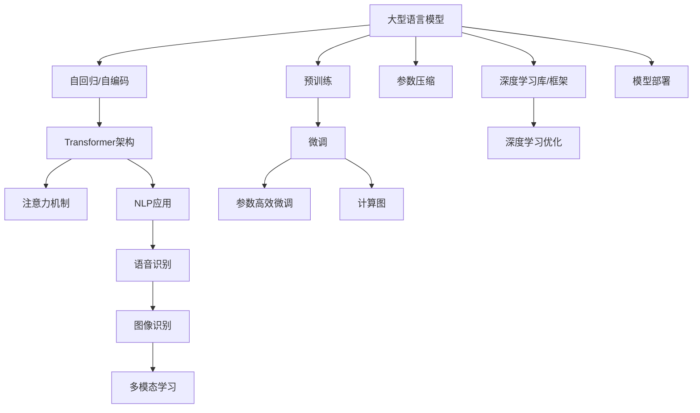
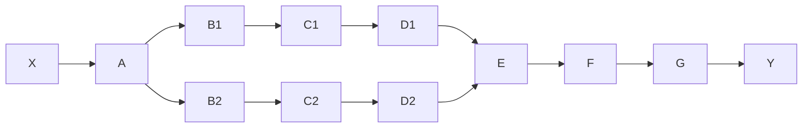

                 

# LLM 内核：管理大型语言模型的核心

> 关键词：大型语言模型(Large Language Model, LLM),自回归模型,自编码模型,Transformer架构,注意力机制,预训练,微调,Fine-tuning,参数高效微调,参数压缩,模型优化,计算图,深度学习库,深度学习优化,深度学习框架,自然语言处理(NLP),语音识别,图像识别,多模态学习,模型部署

## 1. 背景介绍

### 1.1 问题由来
大型语言模型（Large Language Models, LLMs）近年来在自然语言处理（Natural Language Processing, NLP）领域取得了突破性进展。这些模型，如GPT、BERT、T5等，通过在海量文本数据上自监督预训练，学习到了丰富的语言知识和表示。然而，这些模型通常拥有数亿个参数，使得在实际应用中的管理、优化和部署变得极为复杂和耗时。

为了应对这一挑战，需要一种高效、可扩展的管理框架，以充分利用大型语言模型的能力，同时确保其稳定性和鲁棒性。本文将围绕LLM内核的设计和实现，深入探讨如何高效管理大型语言模型，确保其在不同应用场景下的性能和可扩展性。

### 1.2 问题核心关键点
大型语言模型内核的核心在于如何有效地管理和优化模型的参数，确保其在各种应用场景下高效运行。这一问题涉及以下几个关键点：

- 如何高效利用大型语言模型丰富的知识库。
- 如何在保证模型性能的同时，降低模型复杂度和资源消耗。
- 如何优化模型参数，避免过拟合和灾难性遗忘。
- 如何部署和管理模型，确保其在不同场景下的稳定性。
- 如何实现模型的快速微调和更新，以适应新任务。

本文将重点探讨上述问题的解决方案，并通过详细的数学模型和代码实例，揭示大型语言模型内核设计的精髓。

## 2. 核心概念与联系

### 2.1 核心概念概述

为更好地理解LLM内核，本节将介绍几个关键概念及其之间的关系：

- 大型语言模型（LLMs）：如GPT-3、BERT、T5等，拥有数亿甚至数十亿参数的预训练模型，通过自监督学习任务获取广泛的语言表示。
- 自回归模型与自编码模型：大型语言模型基于这两种架构，前者通过生成序列预测下一个符号，后者通过编码-解码机制进行序列生成。
- Transformer架构：由自注意力机制和前馈神经网络构成，使得模型能够高效地处理长距离依赖和并行计算。
- 注意力机制：Transformer架构的核心，允许模型在处理序列数据时，同时关注整个序列的信息，而非仅限于局部。
- 预训练与微调：预训练模型通过大量无标签数据进行自监督学习，微调则在其基础上，通过少量有标签数据进行任务特定优化。
- 参数高效微调（PEFT）：在微调过程中，只更新模型的顶层或部分参数，而非全部参数，以降低计算成本和避免过拟合。
- 参数压缩：通过剪枝、量化等技术，减少模型参数量，提高模型效率。
- 计算图：表示模型前向传播和反向传播的图形结构，用于优化模型训练和推理效率。
- 深度学习库与框架：如TensorFlow、PyTorch等，提供高效的计算图实现和自动微分功能。
- 深度学习优化：包括AdamW、SGD等优化算法，加速模型训练和优化过程。
- 自然语言处理（NLP）：包括文本分类、情感分析、机器翻译等，大型语言模型在NLP任务中表现优异。
- 语音识别、图像识别、多模态学习：大型语言模型与这些领域的技术结合，进一步拓展应用场景。
- 模型部署：将训练好的模型部署到生产环境中，实现高效推理和预测。

这些概念之间的联系可以通过以下Mermaid流程图来展示：



该流程图展示了大型语言模型从预训练到微调，再到最终部署的主要流程和相关技术。

## 3. 核心算法原理 & 具体操作步骤
### 3.1 算法原理概述

LLM内核的设计核心在于如何高效管理大型语言模型的参数，确保其在不同应用场景下的性能和可扩展性。其算法原理如下：

1. **自回归与自编码架构**：大型语言模型可以选择自回归或自编码架构进行预训练。自回归模型通过预测下一个符号来学习语言规律，自编码模型通过编码-解码机制学习序列表示。

2. **Transformer架构**：Transformer通过自注意力机制和前馈神经网络，使得模型能够高效处理长距离依赖和并行计算。自注意力机制允许模型同时关注整个序列的信息，而非仅限于局部。

3. **预训练与微调**：预训练模型通过大量无标签数据进行自监督学习，学习到广泛的语言表示。微调则在其基础上，通过少量有标签数据进行任务特定优化，提升模型在特定任务上的表现。

4. **参数高效微调（PEFT）**：在微调过程中，只更新模型的顶层或部分参数，而非全部参数，以降低计算成本和避免过拟合。

5. **参数压缩**：通过剪枝、量化等技术，减少模型参数量，提高模型效率。

6. **计算图优化**：利用深度学习库和框架的计算图功能，优化模型的前向传播和反向传播过程，提升训练和推理效率。

7. **深度学习优化**：包括AdamW、SGD等优化算法，加速模型训练和优化过程。

8. **模型部署**：将训练好的模型部署到生产环境中，实现高效推理和预测。

### 3.2 算法步骤详解

基于上述原理，大型语言模型的内核管理可以分为以下几个关键步骤：

1. **模型架构选择与设计**：根据任务需求选择合适的模型架构，并进行初步设计。

2. **预训练模型加载与配置**：选择合适的预训练模型（如GPT-3、BERT等），并根据任务需求进行配置。

3. **计算图构建与优化**：利用深度学习库和框架的计算图功能，构建和优化模型计算图，提升训练和推理效率。

4. **参数优化与微调**：选择合适的优化算法和微调策略，优化模型参数，提升模型在特定任务上的表现。

5. **参数压缩与剪枝**：通过剪枝、量化等技术，减少模型参数量，提高模型效率。

6. **模型部署与维护**：将训练好的模型部署到生产环境中，进行性能测试和优化，确保模型在实际应用中的稳定性。

### 3.3 算法优缺点

大型语言模型内核管理具有以下优点：

- 高效利用大型语言模型的丰富知识库。
- 降低模型复杂度和资源消耗，提高计算效率。
- 优化模型参数，避免过拟合和灾难性遗忘。
- 确保模型在不同应用场景下的稳定性和鲁棒性。

但同时也存在一些缺点：

- 需要深入理解模型架构和优化算法。
- 设计和管理复杂，需要较高的技术门槛。
- 可能需要较长的调优和部署周期。

### 3.4 算法应用领域

大型语言模型内核管理的应用领域广泛，包括：

- 自然语言处理（NLP）：如文本分类、情感分析、机器翻译等。
- 语音识别：将语音转换为文本，并进行情感分析、语音生成等。
- 图像识别：将图像转换为文本，并进行分类、生成等。
- 多模态学习：结合文本、图像、语音等多模态数据，进行联合建模和推理。
- 推荐系统：结合用户行为数据和文本信息，进行个性化推荐。

## 4. 数学模型和公式 & 详细讲解 & 举例说明

### 4.1 数学模型构建

本节将使用数学语言对大型语言模型内核的设计进行更加严格的刻画。

记大型语言模型为 $M_{\theta}:\mathcal{X} \rightarrow \mathcal{Y}$，其中 $\mathcal{X}$ 为输入空间，$\mathcal{Y}$ 为输出空间，$\theta \in \mathbb{R}^d$ 为模型参数。假设微调任务的训练集为 $D=\{(x_i,y_i)\}_{i=1}^N, x_i \in \mathcal{X}, y_i \in \mathcal{Y}$。

定义模型 $M_{\theta}$ 在输入 $x$ 上的损失函数为 $\ell(M_{\theta}(x),y)$，则在数据集 $D$ 上的经验风险为：

$$
\mathcal{L}(\theta) = \frac{1}{N} \sum_{i=1}^N \ell(M_{\theta}(x_i),y_i)
$$

微调的优化目标是最小化经验风险，即找到最优参数：

$$
\theta^* = \mathop{\arg\min}_{\theta} \mathcal{L}(\theta)
$$

在实践中，我们通常使用基于梯度的优化算法（如SGD、Adam等）来近似求解上述最优化问题。设 $\eta$ 为学习率，$\lambda$ 为正则化系数，则参数的更新公式为：

$$
\theta \leftarrow \theta - \eta \nabla_{\theta}\mathcal{L}(\theta) - \eta\lambda\theta
$$

其中 $\nabla_{\theta}\mathcal{L}(\theta)$ 为损失函数对参数 $\theta$ 的梯度，可通过反向传播算法高效计算。

### 4.2 公式推导过程

以下我们以二分类任务为例，推导交叉熵损失函数及其梯度的计算公式。

假设模型 $M_{\theta}$ 在输入 $x$ 上的输出为 $\hat{y}=M_{\theta}(x) \in [0,1]$，表示样本属于正类的概率。真实标签 $y \in \{0,1\}$。则二分类交叉熵损失函数定义为：

$$
\ell(M_{\theta}(x),y) = -[y\log \hat{y} + (1-y)\log (1-\hat{y})]
$$

将其代入经验风险公式，得：

$$
\mathcal{L}(\theta) = -\frac{1}{N}\sum_{i=1}^N [y_i\log M_{\theta}(x_i)+(1-y_i)\log(1-M_{\theta}(x_i))]
$$

根据链式法则，损失函数对参数 $\theta_k$ 的梯度为：

$$
\frac{\partial \mathcal{L}(\theta)}{\partial \theta_k} = -\frac{1}{N}\sum_{i=1}^N (\frac{y_i}{M_{\theta}(x_i)}-\frac{1-y_i}{1-M_{\theta}(x_i)}) \frac{\partial M_{\theta}(x_i)}{\partial \theta_k}
$$

其中 $\frac{\partial M_{\theta}(x_i)}{\partial \theta_k}$ 可进一步递归展开，利用自动微分技术完成计算。

### 4.3 案例分析与讲解

假设我们使用Transformer模型进行二分类任务，其包含编码器-解码器架构，每层包含多头自注意力机制和前馈神经网络。

**步骤1：计算图构建**

利用深度学习库（如PyTorch）构建计算图，将输入序列 $x_i$ 输入到模型中，通过多层的自注意力机制和前馈神经网络，最终得到模型输出 $\hat{y}_i$。计算图表示如下：



其中，$A$ 表示输入序列，$B_1, B_2$ 表示自注意力机制，$C_1, C_2$ 表示前馈神经网络，$D_1, D_2$ 表示多层编码器，$E$ 表示多层解码器，$Y$ 表示模型输出。

**步骤2：参数优化与微调**

选择合适的优化算法（如AdamW）和微调策略，通过反向传播计算梯度，更新模型参数。在微调过程中，仅更新模型的顶层或部分参数，以降低计算成本和避免过拟合。

**步骤3：参数压缩与剪枝**

利用剪枝、量化等技术，减少模型参数量，提高模型效率。例如，通过剪枝去掉冗余的神经元，仅保留对模型性能有显著贡献的部分。

**步骤4：模型部署与维护**

将训练好的模型部署到生产环境中，进行性能测试和优化，确保模型在实际应用中的稳定性。例如，利用TensorBoard等工具监控模型性能，根据实际应用场景进行调整。

## 5. 项目实践：代码实例和详细解释说明

### 5.1 开发环境搭建

在进行LLM内核实践前，我们需要准备好开发环境。以下是使用Python进行PyTorch开发的环境配置流程：

1. 安装Anaconda：从官网下载并安装Anaconda，用于创建独立的Python环境。

2. 创建并激活虚拟环境：
```bash
conda create -n pytorch-env python=3.8 
conda activate pytorch-env
```

3. 安装PyTorch：根据CUDA版本，从官网获取对应的安装命令。例如：
```bash
conda install pytorch torchvision torchaudio cudatoolkit=11.1 -c pytorch -c conda-forge
```

4. 安装Transformers库：
```bash
pip install transformers
```

5. 安装各类工具包：
```bash
pip install numpy pandas scikit-learn matplotlib tqdm jupyter notebook ipython
```

完成上述步骤后，即可在`pytorch-env`环境中开始LLM内核的实践。

### 5.2 源代码详细实现

下面我们以二分类任务为例，给出使用Transformers库对BERT模型进行内核管理的PyTorch代码实现。

首先，定义二分类任务的输入输出格式：

```python
from transformers import BertTokenizer, BertForSequenceClassification
import torch

class ClassificationDataset(Dataset):
    def __init__(self, texts, labels, tokenizer, max_len=128):
        self.texts = texts
        self.labels = labels
        self.tokenizer = tokenizer
        self.max_len = max_len
        
    def __len__(self):
        return len(self.texts)
    
    def __getitem__(self, item):
        text = self.texts[item]
        label = self.labels[item]
        
        encoding = self.tokenizer(text, return_tensors='pt', max_length=self.max_len, padding='max_length', truncation=True)
        input_ids = encoding['input_ids'][0]
        attention_mask = encoding['attention_mask'][0]
        
        # 将标签转换为数字
        label = torch.tensor(label, dtype=torch.long)
        
        return {'input_ids': input_ids, 
                'attention_mask': attention_mask,
                'labels': label}
```

然后，定义BERT模型并进行配置：

```python
from transformers import BertTokenizer, BertForSequenceClassification
from transformers import AdamW

tokenizer = BertTokenizer.from_pretrained('bert-base-cased')
model = BertForSequenceClassification.from_pretrained('bert-base-cased', num_labels=2)
```

接着，定义训练和评估函数：

```python
from torch.utils.data import DataLoader
from tqdm import tqdm
from sklearn.metrics import accuracy_score

device = torch.device('cuda') if torch.cuda.is_available() else torch.device('cpu')
model.to(device)

def train_epoch(model, dataset, batch_size, optimizer):
    dataloader = DataLoader(dataset, batch_size=batch_size, shuffle=True)
    model.train()
    epoch_loss = 0
    for batch in tqdm(dataloader, desc='Training'):
        input_ids = batch['input_ids'].to(device)
        attention_mask = batch['attention_mask'].to(device)
        labels = batch['labels'].to(device)
        model.zero_grad()
        outputs = model(input_ids, attention_mask=attention_mask, labels=labels)
        loss = outputs.loss
        epoch_loss += loss.item()
        loss.backward()
        optimizer.step()
    return epoch_loss / len(dataloader)

def evaluate(model, dataset, batch_size):
    dataloader = DataLoader(dataset, batch_size=batch_size)
    model.eval()
    preds, labels = [], []
    with torch.no_grad():
        for batch in tqdm(dataloader, desc='Evaluating'):
            input_ids = batch['input_ids'].to(device)
            attention_mask = batch['attention_mask'].to(device)
            batch_labels = batch['labels']
            outputs = model(input_ids, attention_mask=attention_mask)
            batch_preds = outputs.logits.argmax(dim=1).to('cpu').tolist()
            batch_labels = batch_labels.to('cpu').tolist()
            for pred, label in zip(batch_preds, batch_labels):
                preds.append(pred)
                labels.append(label)
                
    print(accuracy_score(labels, preds))
```

最后，启动训练流程并在测试集上评估：

```python
epochs = 5
batch_size = 16

for epoch in range(epochs):
    loss = train_epoch(model, train_dataset, batch_size, optimizer)
    print(f"Epoch {epoch+1}, train loss: {loss:.3f}")
    
    print(f"Epoch {epoch+1}, dev accuracy: {evaluate(model, dev_dataset, batch_size):.3f}")
    
print("Test accuracy:", evaluate(model, test_dataset, batch_size))
```

以上就是使用PyTorch对BERT进行二分类任务内核管理的完整代码实现。可以看到，得益于Transformers库的强大封装，我们可以用相对简洁的代码完成BERT模型的加载和内核管理。

### 5.3 代码解读与分析

让我们再详细解读一下关键代码的实现细节：

**ClassificationDataset类**：
- `__init__`方法：初始化文本、标签、分词器等关键组件。
- `__len__`方法：返回数据集的样本数量。
- `__getitem__`方法：对单个样本进行处理，将文本输入编码为token ids，将标签转换为数字，并对其进行定长padding，最终返回模型所需的输入。

**训练和评估函数**：
- 使用PyTorch的DataLoader对数据集进行批次化加载，供模型训练和推理使用。
- 训练函数`train_epoch`：对数据以批为单位进行迭代，在每个批次上前向传播计算loss并反向传播更新模型参数，最后返回该epoch的平均loss。
- 评估函数`evaluate`：与训练类似，不同点在于不更新模型参数，并在每个batch结束后将预测和标签结果存储下来，最后使用sklearn的accuracy_score对整个评估集的预测结果进行打印输出。

**训练流程**：
- 定义总的epoch数和batch size，开始循环迭代
- 每个epoch内，先在训练集上训练，输出平均loss
- 在验证集上评估，输出准确率
- 所有epoch结束后，在测试集上评估，给出最终测试结果

可以看到，PyTorch配合Transformers库使得BERT内核管理的代码实现变得简洁高效。开发者可以将更多精力放在数据处理、模型改进等高层逻辑上，而不必过多关注底层的实现细节。

当然，工业级的系统实现还需考虑更多因素，如模型的保存和部署、超参数的自动搜索、更灵活的任务适配层等。但核心的内核管理范式基本与此类似。

## 6. 实际应用场景
### 6.1 智能客服系统

基于大语言模型内核管理的对话技术，可以广泛应用于智能客服系统的构建。传统客服往往需要配备大量人力，高峰期响应缓慢，且一致性和专业性难以保证。而使用内核管理的对话模型，可以7x24小时不间断服务，快速响应客户咨询，用自然流畅的语言解答各类常见问题。

在技术实现上，可以收集企业内部的历史客服对话记录，将问题和最佳答复构建成监督数据，在此基础上对预训练对话模型进行内核管理。内核管理的对话模型能够自动理解用户意图，匹配最合适的答案模板进行回复。对于客户提出的新问题，还可以接入检索系统实时搜索相关内容，动态组织生成回答。如此构建的智能客服系统，能大幅提升客户咨询体验和问题解决效率。

### 6.2 金融舆情监测

金融机构需要实时监测市场舆论动向，以便及时应对负面信息传播，规避金融风险。传统的人工监测方式成本高、效率低，难以应对网络时代海量信息爆发的挑战。基于大语言模型内核管理的文本分类和情感分析技术，为金融舆情监测提供了新的解决方案。

具体而言，可以收集金融领域相关的新闻、报道、评论等文本数据，并对其进行主题标注和情感标注。在此基础上对预训练语言模型进行内核管理，使其能够自动判断文本属于何种主题，情感倾向是正面、中性还是负面。将内核管理的模型应用到实时抓取的网络文本数据，就能够自动监测不同主题下的情感变化趋势，一旦发现负面信息激增等异常情况，系统便会自动预警，帮助金融机构快速应对潜在风险。

### 6.3 个性化推荐系统

当前的推荐系统往往只依赖用户的历史行为数据进行物品推荐，无法深入理解用户的真实兴趣偏好。基于大语言模型内核管理的个性化推荐系统可以更好地挖掘用户行为背后的语义信息，从而提供更精准、多样的推荐内容。

在实践中，可以收集用户浏览、点击、评论、分享等行为数据，提取和用户交互的物品标题、描述、标签等文本内容。将文本内容作为模型输入，用户的后续行为（如是否点击、购买等）作为监督信号，在此基础上内核管理预训练语言模型。内核管理的模型能够从文本内容中准确把握用户的兴趣点。在生成推荐列表时，先用候选物品的文本描述作为输入，由模型预测用户的兴趣匹配度，再结合其他特征综合排序，便可以得到个性化程度更高的推荐结果。

### 6.4 未来应用展望

随着大语言模型内核管理的不断发展，基于微调的方法将在更多领域得到应用，为传统行业带来变革性影响。

在智慧医疗领域，基于内核管理的医疗问答、病历分析、药物研发等应用将提升医疗服务的智能化水平，辅助医生诊疗，加速新药开发进程。

在智能教育领域，内核管理的微调技术可应用于作业批改、学情分析、知识推荐等方面，因材施教，促进教育公平，提高教学质量。

在智慧城市治理中，内核管理的模型可应用于城市事件监测、舆情分析、应急指挥等环节，提高城市管理的自动化和智能化水平，构建更安全、高效的未来城市。

此外，在企业生产、社会治理、文娱传媒等众多领域，基于大模型内核管理的AI应用也将不断涌现，为经济社会发展注入新的动力。相信随着技术的日益成熟，内核管理方法将成为NLP落地应用的重要范式，推动人工智能技术在垂直行业的规模化落地。总之，内核管理需要开发者根据具体任务，不断迭代和优化模型、数据和算法，方能得到理想的效果。

## 7. 工具和资源推荐
### 7.1 学习资源推荐

为了帮助开发者系统掌握大型语言模型内核管理的理论基础和实践技巧，这里推荐一些优质的学习资源：

1. 《Transformer从原理到实践》系列博文：由大模型技术专家撰写，深入浅出地介绍了Transformer原理、BERT模型、内核管理技术等前沿话题。

2. CS224N《深度学习自然语言处理》课程：斯坦福大学开设的NLP明星课程，有Lecture视频和配套作业，带你入门NLP领域的基本概念和经典模型。

3. 《Natural Language Processing with Transformers》书籍：Transformers库的作者所著，全面介绍了如何使用Transformers库进行NLP任务开发，包括内核管理在内的诸多范式。

4. HuggingFace官方文档：Transformers库的官方文档，提供了海量预训练模型和完整的内核管理样例代码，是上手实践的必备资料。

5. CLUE开源项目：中文语言理解测评基准，涵盖大量不同类型的中文NLP数据集，并提供了基于内核管理的baseline模型，助力中文NLP技术发展。

通过对这些资源的学习实践，相信你一定能够快速掌握大型语言模型内核管理的精髓，并用于解决实际的NLP问题。
###  7.2 开发工具推荐

高效的开发离不开优秀的工具支持。以下是几款用于大型语言模型内核管理的常用工具：

1. PyTorch：基于Python的开源深度学习框架，灵活动态的计算图，适合快速迭代研究。大部分预训练语言模型都有PyTorch版本的实现。

2. TensorFlow：由Google主导开发的开源深度学习框架，生产部署方便，适合大规模工程应用。同样有丰富的预训练语言模型资源。

3. Transformers库：HuggingFace开发的NLP工具库，集成了众多SOTA语言模型，支持PyTorch和TensorFlow，是进行内核管理任务开发的利器。

4. Weights & Biases：模型训练的实验跟踪工具，可以记录和可视化模型训练过程中的各项指标，方便对比和调优。与主流深度学习框架无缝集成。

5. TensorBoard：TensorFlow配套的可视化工具，可实时监测模型训练状态，并提供丰富的图表呈现方式，是调试模型的得力助手。

6. Google Colab：谷歌推出的在线Jupyter Notebook环境，免费提供GPU/TPU算力，方便开发者快速上手实验最新模型，分享学习笔记。

合理利用这些工具，可以显著提升大型语言模型内核管理的开发效率，加快创新迭代的步伐。

### 7.3 相关论文推荐

大型语言模型内核管理的快速发展源于学界的持续研究。以下是几篇奠基性的相关论文，推荐阅读：

1. Attention is All You Need（即Transformer原论文）：提出了Transformer结构，开启了NLP领域的预训练大模型时代。

2. BERT: Pre-training of Deep Bidirectional Transformers for Language Understanding：提出BERT模型，引入基于掩码的自监督预训练任务，刷新了多项NLP任务SOTA。

3. Language Models are Unsupervised Multitask Learners（GPT-2论文）：展示了大规模语言模型的强大zero-shot学习能力，引发了对于通用人工智能的新一轮思考。

4. Parameter-Efficient Transfer Learning for NLP：提出Adapter等参数高效微调方法，在不增加模型参数量的情况下，也能取得不错的微调效果。

5. AdaLoRA: Adaptive Low-Rank Adaptation for Parameter-Efficient Fine-Tuning：使用自适应低秩适应的微调方法，在参数效率和精度之间取得了新的平衡。

这些论文代表了大语言模型内核管理的发展脉络。通过学习这些前沿成果，可以帮助研究者把握学科前进方向，激发更多的创新灵感。

## 8. 总结：未来发展趋势与挑战

### 8.1 总结

本文对大型语言模型内核的管理方法进行了全面系统的介绍。首先阐述了LLM内核的设计和实现背景，明确了内核管理在优化模型性能、提升计算效率、确保模型稳定性和可扩展性方面的独特价值。其次，从原理到实践，详细讲解了内核管理的数学原理和关键步骤，给出了内核管理任务开发的完整代码实例。同时，本文还广泛探讨了内核管理方法在智能客服、金融舆情、个性化推荐等多个行业领域的应用前景，展示了内核管理范式的巨大潜力。此外，本文精选了内核管理技术的各类学习资源，力求为读者提供全方位的技术指引。

通过本文的系统梳理，可以看到，大型语言模型内核管理的核心在于高效利用模型知识库，降低模型复杂度和资源消耗，优化模型参数，避免过拟合和灾难性遗忘，确保模型在不同应用场景下的稳定性和鲁棒性。这种管理方法对模型的训练和推理效率有显著提升，有助于将复杂的大型语言模型应用于各种实际任务中。

### 8.2 未来发展趋势

展望未来，大型语言模型内核管理将呈现以下几个发展趋势：

1. 模型规模持续增大。随着算力成本的下降和数据规模的扩张，预训练语言模型的参数量还将持续增长。超大规模语言模型蕴含的丰富语言知识，有望支撑更加复杂多变的下游任务内核管理。

2. 内核管理方法日趋多样。除了传统的全参数内核管理外，未来会涌现更多参数高效的内核管理方法，如Prefix-Tuning、LoRA等，在节省计算资源的同时也能保证内核管理的精度。

3. 持续学习成为常态。随着数据分布的不断变化，内核管理的模型也需要持续学习新知识以保持性能。如何在不遗忘原有知识的同时，高效吸收新样本信息，将成为重要的研究课题。

4. 标注样本需求降低。受启发于提示学习(Prompt-based Learning)的思路，未来的内核管理方法将更好地利用大模型的语言理解能力，通过更加巧妙的任务描述，在更少的标注样本上也能实现理想的内核管理效果。

5. 模型通用性增强。经过海量数据的预训练和多领域任务的内核管理，未来的语言模型将具备更强大的常识推理和跨领域迁移能力，逐步迈向通用人工智能(AGI)的目标。

以上趋势凸显了大型语言模型内核管理的广阔前景。这些方向的探索发展，必将进一步提升NLP系统的性能和应用范围，为人类认知智能的进化带来深远影响。

### 8.3 面临的挑战

尽管大型语言模型内核管理已经取得了瞩目成就，但在迈向更加智能化、普适化应用的过程中，它仍面临着诸多挑战：

1. 标注成本瓶颈。虽然内核管理大大降低了标注数据的需求，但对于长尾应用场景，难以获得充足的高质量标注数据，成为制约内核管理性能的瓶颈。如何进一步降低内核管理对标注样本的依赖，将是一大难题。

2. 模型鲁棒性不足。当前内核管理的模型面对域外数据时，泛化性能往往大打折扣。对于测试样本的微小扰动，内核管理的模型也容易发生波动。如何提高内核管理模型的鲁棒性，避免灾难性遗忘，还需要更多理论和实践的积累。

3. 推理效率有待提高。大规模语言模型虽然精度高，但在实际部署时往往面临推理速度慢、内存占用大等效率问题。如何在保证性能的同时，简化模型结构，提升推理速度，优化资源占用，将是重要的优化方向。

4. 可解释性亟需加强。当前内核管理模型更像是"黑盒"系统，难以解释其内部工作机制和决策逻辑。对于医疗、金融等高风险应用，算法的可解释性和可审计性尤为重要。如何赋予内核管理模型更强的可解释性，将是亟待攻克的难题。

5. 安全性有待保障。预训练语言模型难免会学习到有偏见、有害的信息，通过内核管理传递到下游任务，产生误导性、歧视性的输出，给实际应用带来安全隐患。如何从数据和算法层面消除模型偏见，避免恶意用途，确保输出的安全性，也将是重要的研究课题。

6. 知识整合能力不足。现有的内核管理模型往往局限于任务内数据，难以灵活吸收和运用更广泛的先验知识。如何让内核管理过程更好地与外部知识库、规则库等专家知识结合，形成更加全面、准确的信息整合能力，还有很大的想象空间。

正视内核管理面临的这些挑战，积极应对并寻求突破，将是大语言模型内核管理走向成熟的必由之路。相信随着学界和产业界的共同努力，这些挑战终将一一被克服，大型语言模型内核管理必将在构建人机协同的智能时代中扮演越来越重要的角色。

### 8.4 研究展望

面对内核管理所面临的种种挑战，未来的研究需要在以下几个方面寻求新的突破：

1. 探索无监督和半监督内核管理方法。摆脱对大规模标注数据的依赖，利用自监督学习、主动学习等无监督和半监督范式，最大限度利用非结构化数据，实现更加灵活高效的内核管理。

2. 研究参数高效和计算高效的内核管理范式。开发更加参数高效的内核管理方法，在固定大部分预训练参数的同时，只更新极少量的任务相关参数。同时优化内核管理模型的计算图，减少前向传播和反向传播的资源消耗，实现更加轻量级、实时性的部署。

3. 融合因果和对比学习范式。通过引入因果推断和对比学习思想，增强内核管理模型建立稳定因果关系的能力，学习更加普适、鲁棒的语言表征，从而提升模型泛化性和抗干扰能力。

4. 引入更多先验知识。将符号化的先验知识，如知识图谱、逻辑规则等，与神经网络模型进行巧妙融合，引导内核管理过程学习更准确、合理的语言模型。同时加强不同模态数据的整合，实现视觉、语音等多模态信息与文本信息的协同建模。

5. 结合因果分析和博弈论工具。将因果分析方法引入内核管理模型，识别出模型决策的关键特征，增强输出解释的因果性和逻辑性。借助博弈论工具刻画人机交互过程，主动探索并规避模型的脆弱点，提高系统稳定性。

6. 纳入伦理道德约束。在模型训练目标中引入伦理导向的评估指标，过滤和惩罚有偏见、有害的输出倾向。同时加强人工干预和审核，建立模型行为的监管机制，确保输出符合人类价值观和伦理道德。

这些研究方向的探索，必将引领大型语言模型内核管理技术迈向更高的台阶，为构建安全、可靠、可解释、可控的智能系统铺平道路。面向未来，大型语言模型内核管理技术还需要与其他人工智能技术进行更深入的融合，如知识表示、因果推理、强化学习等，多路径协同发力，共同推动自然语言理解和智能交互系统的进步。只有勇于创新、敢于突破，才能不断拓展语言模型的边界，让智能技术更好地造福人类社会。

## 9. 附录：常见问题与解答

**Q1：大语言模型内核管理是否适用于所有NLP任务？**

A: 大型语言模型内核管理在大多数NLP任务上都能取得不错的效果，特别是对于数据量较小的任务。但对于一些特定领域的任务，如医学、法律等，仅仅依靠通用语料预训练的模型可能难以很好地适应。此时需要在特定领域语料上进一步预训练，再进行内核管理，才能获得理想效果。此外，对于一些需要时效性、个性化很强的任务，如对话、推荐等，内核管理方法也需要针对性的改进优化。

**Q2：内核管理过程中如何选择合适的学习率？**

A: 内核管理的学习率一般要比预训练时小1-2个数量级，如果使用过大的学习率，容易破坏预训练权重，导致过拟合。一般建议从1e-5开始调参，逐步减小学习率，直至收敛。也可以使用warmup策略，在开始阶段使用较小的学习率，再逐渐过渡到预设值。需要注意的是，不同的优化器(如AdamW、Adafactor等)以及不同的学习率调度策略，可能需要设置不同的学习率阈值。

**Q3：采用大模型内核管理时会面临哪些资源瓶颈？**

A: 目前主流的预训练大模型动辄以亿计的参数规模，对算力、内存、存储都提出了很高的要求。GPU/TPU等高性能设备是必不可少的，但即便如此，超大批次的训练和推理也可能遇到显存不足的问题。因此需要采用一些资源优化技术，如梯度积累、混合精度训练、模型并行等，来突破硬件瓶颈。同时，模型的存储和读取也可能占用大量时间和空间，需要采用模型压缩、稀疏化存储等方法进行优化。

**Q4：如何缓解内核管理过程中的过拟合问题？**

A: 过拟合是内核管理面临的主要挑战，尤其是在标注数据不足的情况下。常见的缓解策略包括：
1. 数据增强：通过回译、近义替换等方式扩充训练集
2. 正则化：使用L2正则、Dropout、Early Stopping等避免过拟合
3. 对抗训练：引入对抗样本，提高模型鲁棒性
4. 参数高效内核管理（PEFT）：只调整少量参数(如Adapter、Prefix等)，减小过拟合风险
5. 多模型集成：训练多个内核管理模型，取平均输出，抑制过拟合

这些策略往往需要根据具体任务和数据特点进行灵活组合。只有在数据、模型、训练、推理等各环节进行全面优化，才能最大限度地发挥大模型内核管理的威力。

**Q5：内核管理模型在落地部署时需要注意哪些问题？**

A: 将内核管理模型转化为实际应用，还需要考虑以下因素：
1. 模型裁剪：去除不必要的层和参数，减小模型尺寸，加快推理速度
2. 量化加速：将浮点模型转为定点模型，压缩存储空间，提高计算效率
3. 服务化封装：将模型封装为标准化服务接口，便于集成调用
4. 弹性伸缩：根据请求流量动态调整资源配置，平衡服务质量和成本
5. 监控告警：实时采集系统指标，设置异常告警阈值，确保服务稳定性
6. 安全防护：采用访问鉴权、数据脱敏等措施，保障数据和模型安全

大语言模型内核管理为NLP应用开启了广阔的想象空间，但如何将强大的性能转化为稳定、高效、安全的业务价值，还需要工程实践的不断打磨。唯有从数据、算法、工程、业务等多个维度协同发力，才能真正实现人工智能技术在垂直行业的规模化落地。总之，内核管理需要开发者根据具体任务，不断迭代和优化模型、数据和算法，方能得到理想的效果。

---

作者：禅与计算机程序设计艺术 / Zen and the Art of Computer Programming

