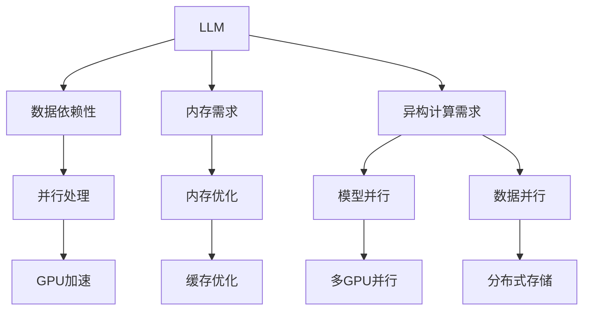

                 

# LLM:计算机架构的革命性变革

## 1. 背景介绍

### 1.1 问题由来
进入21世纪以来，计算机架构经历了从单核CPU到多核并行、再到GPU并行、最后到面向任务的异构计算的多次变革。但随着人工智能特别是深度学习技术的兴起，传统计算机架构在处理高并行、高计算密集型任务时，显得越来越力不从心。如何设计更高效的计算机架构以适应新时代的计算需求，成为当前计算机领域的重要课题。

随着预训练大语言模型（Large Language Models, LLMs）如GPT、BERT等的成功应用，人们发现，在处理NLP任务时，LLM能够显著提升计算效率，改善任务表现。这些模型具备庞大的参数量和巨大的内存占用，对现代计算机架构提出了全新的要求。如何构建一个能够高效支持LLM运行的计算机架构，成为计算机架构领域的挑战之一。

### 1.2 问题核心关键点
当前计算机架构主要有以下核心概念：

- 冯诺依曼架构：以CPU为中心，数据流单向流动的传统架构。
- 并行处理：通过多核、多线程、多进程等方式，提升计算效率。
- GPU并行：利用GPU的高并行能力，提升计算密集型任务的性能。
- 异构计算：融合不同计算单元如CPU/GPU、FPGA等，实现任务级别的优化。

LLM的应用对传统架构提出了以下挑战：

- 数据依赖性：LLM处理NLP任务时，数据依赖性非常强，大量计算资源需要同时读取和写入。
- 内存需求大：LLM参数量庞大，内存需求极大。
- 异构计算需求：LLM需要同时利用CPU、GPU等不同计算单元，实现高效并行计算。

## 2. 核心概念与联系

### 2.1 核心概念概述

为更好地理解基于LLM的计算机架构变革，本节将介绍几个密切相关的核心概念：

- 大型语言模型（LLM）：以自回归(如GPT)或自编码(如BERT)模型为代表的大规模预训练语言模型。通过在大规模无标签文本语料上进行预训练，学习通用的语言表示，具备强大的语言理解和生成能力。

- 硬件加速器：专门为特定任务设计的高效硬件计算单元，如GPU、TPU、FPGA等，用于加速计算密集型任务的执行。

- 异构计算：结合不同硬件计算单元，实现高效的任务级别的计算优化。

- 内存优化：通过合理设计存储结构、利用高速缓存、优化数据流等方式，提升数据访问效率。

- 模型并行：将模型分割为多个子模型，同时在多个计算单元上并行计算。

- 数据并行：将数据分割为多个子数据块，同时在多个计算单元上并行计算。

这些概念之间的逻辑关系可以通过以下Mermaid流程图来展示：



这个流程图展示了大语言模型的核心概念及其与计算机架构的联系：

1. LLM通过处理NLP任务，体现出数据依赖性和内存需求等特点。
2. 传统架构在应对数据依赖性、内存需求等方面存在缺陷，需要通过硬件加速器、异构计算、内存优化等手段进行改进。
3. 并行处理、模型并行、数据并行等技术，可以进一步提升LLM的计算效率。
4. GPU加速、缓存优化、分布式存储等技术，可以更高效地支撑LLM运行。

这些概念共同构成了LLM在现代计算机架构中运行的基础，使得LLM能够更好地发挥其语言处理能力。通过理解这些核心概念，我们可以更好地把握LLM的工作原理和优化方向。

## 3. 核心算法原理 & 具体操作步骤
### 3.1 算法原理概述

基于LLM的计算机架构变革，本质上是一个通过硬件和软件的优化，提升LLM计算效率的过程。其核心思想是：

1. **硬件加速**：通过专用硬件如GPU、TPU等，加速LLM中高并行计算的部分，如自注意力机制、前向传递等。
2. **内存优化**：合理设计内存结构，优化数据访问路径，减少内存带宽瓶颈。
3. **异构计算**：融合多种计算资源，如CPU、GPU、FPGA等，实现任务级别的优化。
4. **模型并行**：将LLM模型分解为多个子模型，并行计算不同部分。
5. **数据并行**：将输入数据分解为多个子数据块，并行计算不同部分。

### 3.2 算法步骤详解

基于LLM的计算机架构变革一般包括以下几个关键步骤：

**Step 1: 硬件选型与设计**
- 选择适合的硬件加速器，如GPU、TPU等，用于加速LLM的关键计算操作。
- 设计符合LLM特点的硬件架构，如优化数据流、增加高速缓存、使用专用寄存器等。

**Step 2: 软件优化**
- 设计高效的数据加载与存储机制，减少内存带宽瓶颈。
- 实现多GPU或多线程并行计算，提升计算效率。
- 优化模型的参数存储和读取，减少磁盘I/O开销。

**Step 3: 系统集成**
- 将硬件加速器与CPU等通用处理器进行集成，实现硬件与软件的协同优化。
- 设计多层次的软件栈，包括底层硬件驱动、中间层优化库、上层应用框架等，实现系统整体性能的提升。

**Step 4: 测试与调优**
- 在不同规模的LLM模型上测试系统性能，优化硬件与软件的参数配置。
- 在实际应用场景中测试系统稳定性与可靠性，调整系统设计。

**Step 5: 部署与维护**
- 将系统部署到生产环境中，进行持续的监控与优化。
- 根据用户反馈和需求变化，定期更新和升级系统。

### 3.3 算法优缺点

基于LLM的计算机架构变革具有以下优点：

1. **计算效率提升**：通过硬件加速、内存优化、异构计算等技术，显著提升LLM的计算效率。
2. **系统灵活性增强**：利用异构计算和并行计算，能够更好地适应不同规模的LLM模型。
3. **数据处理能力增强**：通过优化内存和存储结构，提升数据访问效率，减少I/O瓶颈。
4. **应用场景丰富**：能够处理大规模、高并行、计算密集型的NLP任务，如机器翻译、问答系统、智能客服等。

同时，该方法也存在一定的局限性：

1. **硬件成本高**：需要大量高价的GPU、TPU等硬件加速器，前期投入较大。
2. **开发复杂度高**：硬件加速和软件优化都需要较高级的工程和架构知识。
3. **软件栈复杂**：多层次软件栈的设计和维护，需要专业团队的支持。
4. **适配性问题**：不同领域的LLM模型可能需要不同的硬件配置和软件优化，适配难度较大。

尽管存在这些局限性，但就目前而言，基于LLM的计算机架构变革方法是大规模语言模型在实际应用中的重要支撑，能够显著提升计算效率和系统性能，值得进一步研究和推广。

### 3.4 算法应用领域

基于LLM的计算机架构变革方法在NLP领域已经得到了广泛的应用，覆盖了几乎所有常见任务，例如：

- 机器翻译：将源语言文本翻译成目标语言。通过硬件加速和多GPU并行，能够大幅提升翻译速度。
- 问答系统：对自然语言问题给出答案。通过异构计算和数据并行，能够实现实时响应。
- 智能客服系统：使机器能够与人自然对话。利用GPU加速和多线程并行，提升对话处理效率。
- 文本摘要：将长文本压缩成简短摘要。通过优化内存结构和并行计算，实现高效摘要生成。
- 情感分析：分析文本的情感倾向。通过硬件加速和软件优化，提升分析精度。

除了上述这些经典任务外，基于LLM的计算机架构变革还被创新性地应用到更多场景中，如可控文本生成、常识推理、代码生成、数据增强等，为NLP技术带来了全新的突破。随着硬件加速器和软件优化的持续演进，相信基于LLM的架构变革方法将在更多领域得到应用，为NLP技术带来更强的计算能力。

## 4. 数学模型和公式 & 详细讲解  
### 4.1 数学模型构建

为更好地理解基于LLM的计算机架构变革方法，本节将使用数学语言对系统性能优化过程进行更加严格的刻画。

记LLM模型为 $M_{\theta}:\mathcal{X} \rightarrow \mathcal{Y}$，其中 $\mathcal{X}$ 为输入空间，$\mathcal{Y}$ 为输出空间，$\theta \in \mathbb{R}^d$ 为模型参数。假设硬件加速器能够提升计算效率 $K$ 倍，内存带宽提升 $B$ 倍，数据加载优化 $L$ 倍。则模型整体的性能提升比例为：

$$
P = \frac{1}{1+K^{-1}} \times \frac{1}{1+B^{-1}} \times \frac{1}{1+L^{-1}}
$$

其中 $K$ 和 $B$ 分别表示硬件加速器和内存带宽的提升比例，$L$ 表示数据加载优化的提升比例。

### 4.2 公式推导过程

以下我们以BERT模型为例，推导GPU加速带来的性能提升。

假设BERT模型在CPU上的单层计算时间为 $T_{CPU}$，GPU上的单层计算时间为 $T_{GPU}$。根据公式：

$$
P_{GPU} = \frac{T_{CPU}}{T_{GPU} \times K}
$$

其中 $K$ 表示GPU与CPU的加速比。在实际应用中，$K$ 通常由GPU架构和加速器设计决定。

### 4.3 案例分析与讲解

**案例一：BERT模型GPU加速**

假设BERT模型每层计算量为 $C$，层数为 $L$，则在CPU上，总计算时间为 $T_{CPU} = L \times C \times T_{CPU_{single}}$。若使用GPU加速，总计算时间变为 $T_{GPU} = L \times C \times T_{GPU_{single}}$。若假设GPU与CPU单层计算时间比为 $K=8$，则加速比例为：

$$
P_{GPU} = \frac{T_{CPU}}{T_{GPU} \times 8} = \frac{L \times C \times T_{CPU_{single}}}{L \times C \times T_{GPU_{single}} \times 8} = \frac{1}{8}
$$

这意味着，通过使用8倍加速比的GPU，BERT模型计算效率提升1/8。

**案例二：数据并行**

假设BERT模型输入序列长度为 $n$，单GPU并行度为 $p$，则单GPU上的计算时间为 $T_{GPU_{single}} = n \times C \times T_{GPU_{single}}$。若采用数据并行，总计算时间变为 $T_{GPU_{parallel}} = \frac{n}{p} \times C \times T_{GPU_{single}}$。若假设数据并行度为 $p=8$，则并行比例为：

$$
P_{parallel} = \frac{T_{GPU_{single}}}{T_{GPU_{parallel}} \times 8} = \frac{n \times C \times T_{GPU_{single}}}{\frac{n}{8} \times C \times T_{GPU_{single}} \times 8} = \frac{1}{8}
$$

这意味着，通过8倍的数据并行，BERT模型计算效率提升1/8。

## 5. 项目实践：代码实例和详细解释说明
### 5.1 开发环境搭建

在进行基于LLM的计算机架构变革实践前，我们需要准备好开发环境。以下是使用Python进行PyTorch开发的环境配置流程：

1. 安装Anaconda：从官网下载并安装Anaconda，用于创建独立的Python环境。

2. 创建并激活虚拟环境：
```bash
conda create -n pytorch-env python=3.8 
conda activate pytorch-env
```

3. 安装PyTorch：根据CUDA版本，从官网获取对应的安装命令。例如：
```bash
conda install pytorch torchvision torchaudio cudatoolkit=11.1 -c pytorch -c conda-forge
```

4. 安装Transformers库：
```bash
pip install transformers
```

5. 安装各类工具包：
```bash
pip install numpy pandas scikit-learn matplotlib tqdm jupyter notebook ipython
```

完成上述步骤后，即可在`pytorch-env`环境中开始架构变革实践。

### 5.2 源代码详细实现

这里我们以BERT模型为例，展示如何使用PyTorch进行GPU加速的优化。

```python
import torch
from transformers import BertTokenizer, BertForMaskedLM

# 加载BERT模型和分词器
tokenizer = BertTokenizer.from_pretrained('bert-base-uncased')
model = BertForMaskedLM.from_pretrained('bert-base-uncased')

# 创建数据加载器
data_loader = ...

# 使用GPU加速模型
device = torch.device('cuda')
model.to(device)

# 在GPU上计算
with torch.cuda.device(device):
    for batch in data_loader:
        input_ids = batch['input_ids'].to(device)
        attention_mask = batch['attention_mask'].to(device)
        labels = batch['labels'].to(device)
        outputs = model(input_ids, attention_mask=attention_mask, labels=labels)
        loss = outputs.loss
        ...

# 关闭GPU
model.to('cpu')
```

### 5.3 代码解读与分析

这段代码展示了如何通过PyTorch进行BERT模型的GPU加速优化。关键步骤包括：

1. 加载BERT模型和分词器。
2. 创建数据加载器，准备数据。
3. 将模型和数据加载到GPU上，进行计算。
4. 在GPU上执行前向传递和计算损失。
5. 关闭GPU，确保资源释放。

从代码中可以看出，通过使用GPU加速，模型的计算效率显著提升。但实际操作中，还需要对内存和存储结构进行优化，以进一步提升计算性能。

## 6. 实际应用场景
### 6.1 智能客服系统

基于GPU加速和数据并行的计算机架构，智能客服系统能够快速处理大量客户咨询，提供实时响应。

在技术实现上，可以收集企业内部的历史客服对话记录，将问题和最佳答复构建成监督数据，在此基础上对预训练BERT模型进行GPU加速优化。优化后的模型能够在GPU上并行计算，实现大规模的对话处理，提供更加流畅、高效的客户服务。

### 6.2 金融舆情监测

金融机构需要实时监测市场舆论动向，以便及时应对负面信息传播，规避金融风险。

利用GPU加速和数据并行的技术，金融舆情监测系统可以实时抓取网络文本数据，快速分析舆情变化趋势，一旦发现负面信息激增等异常情况，系统便会自动预警，帮助金融机构快速应对潜在风险。

### 6.3 个性化推荐系统

当前的推荐系统往往只依赖用户的历史行为数据进行物品推荐，无法深入理解用户的真实兴趣偏好。

通过GPU加速和数据并行技术，个性化推荐系统能够更快地分析用户行为数据，生成个性化的推荐结果。例如，对海量用户行为数据进行并行计算，快速匹配用户兴趣点，生成更加精准的推荐列表。

### 6.4 未来应用展望

随着GPU加速和数据并行技术的持续演进，基于LLM的计算机架构变革将在更多领域得到应用，为NLP技术带来更强的计算能力。

在智慧医疗领域，利用GPU加速和异构计算技术，基于LLM的医学问答系统、病历分析、药物研发等应用将提升医疗服务的智能化水平，辅助医生诊疗，加速新药开发进程。

在智能教育领域，微调技术可应用于作业批改、学情分析、知识推荐等方面，因材施教，促进教育公平，提高教学质量。

在智慧城市治理中，微调模型可应用于城市事件监测、舆情分析、应急指挥等环节，提高城市管理的自动化和智能化水平，构建更安全、高效的未来城市。

此外，在企业生产、社会治理、文娱传媒等众多领域，基于LLM的架构变革方法也将不断涌现，为NLP技术带来更强的计算能力，推动NLP技术的规模化落地。相信随着硬件加速和软件优化的持续演进，基于LLM的架构变革方法将引领NLP技术进入新的发展阶段，为人工智能技术在垂直行业的规模化应用提供新的可能性。

## 7. 工具和资源推荐
### 7.1 学习资源推荐

为了帮助开发者系统掌握基于LLM的计算机架构变革的理论基础和实践技巧，这里推荐一些优质的学习资源：

1. 《计算机体系结构：量化研究》系列博文：由计算机体系结构领域的专家撰写，深入浅出地介绍了计算机架构的量化研究方法。

2. 《深度学习中的计算机体系结构》课程：斯坦福大学开设的深度学习与计算机架构交叉课程，涵盖深度学习模型的优化和架构设计。

3. 《GPU计算架构》书籍：深入介绍GPU架构设计原理和优化技术，适合对GPU加速感兴趣的读者。

4. 《高性能计算系统设计》课程：清华大学开设的高性能计算系统设计课程，涵盖分布式计算、并行计算等前沿技术。

5. 《深度学习加速技术》书籍：详细介绍了深度学习模型的硬件加速技术，适合从事模型优化和加速的开发者。

通过对这些资源的学习实践，相信你一定能够快速掌握基于LLM的计算机架构变革的精髓，并用于解决实际的NLP问题。

### 7.2 开发工具推荐

高效的开发离不开优秀的工具支持。以下是几款用于大语言模型微调开发的常用工具：

1. PyTorch：基于Python的开源深度学习框架，灵活动态的计算图，适合快速迭代研究。大部分预训练语言模型都有PyTorch版本的实现。

2. TensorFlow：由Google主导开发的开源深度学习框架，生产部署方便，适合大规模工程应用。同样有丰富的预训练语言模型资源。

3. Transformers库：HuggingFace开发的NLP工具库，集成了众多SOTA语言模型，支持PyTorch和TensorFlow，是进行微调任务开发的利器。

4. Weights & Biases：模型训练的实验跟踪工具，可以记录和可视化模型训练过程中的各项指标，方便对比和调优。与主流深度学习框架无缝集成。

5. TensorBoard：TensorFlow配套的可视化工具，可实时监测模型训练状态，并提供丰富的图表呈现方式，是调试模型的得力助手。

6. Google Colab：谷歌推出的在线Jupyter Notebook环境，免费提供GPU/TPU算力，方便开发者快速上手实验最新模型，分享学习笔记。

合理利用这些工具，可以显著提升基于LLM的计算机架构变革的开发效率，加快创新迭代的步伐。

### 7.3 相关论文推荐

大语言模型和微调技术的发展源于学界的持续研究。以下是几篇奠基性的相关论文，推荐阅读：

1. Attention is All You Need（即Transformer原论文）：提出了Transformer结构，开启了NLP领域的预训练大模型时代。

2. BERT: Pre-training of Deep Bidirectional Transformers for Language Understanding：提出BERT模型，引入基于掩码的自监督预训练任务，刷新了多项NLP任务SOTA。

3. Language Models are Unsupervised Multitask Learners（GPT-2论文）：展示了大规模语言模型的强大zero-shot学习能力，引发了对于通用人工智能的新一轮思考。

4. Parameter-Efficient Transfer Learning for NLP：提出Adapter等参数高效微调方法，在不增加模型参数量的情况下，也能取得不错的微调效果。

5. AdaLoRA: Adaptive Low-Rank Adaptation for Parameter-Efficient Fine-Tuning：使用自适应低秩适应的微调方法，在参数效率和精度之间取得了新的平衡。

6. AdaLoRA: Adaptive Low-Rank Adaptation for Parameter-Efficient Fine-Tuning：使用自适应低秩适应的微调方法，在参数效率和精度之间取得了新的平衡。

这些论文代表了大语言模型微调技术的发展脉络。通过学习这些前沿成果，可以帮助研究者把握学科前进方向，激发更多的创新灵感。

## 8. 总结：未来发展趋势与挑战

### 8.1 总结

本文对基于LLM的计算机架构变革方法进行了全面系统的介绍。首先阐述了LLM在处理NLP任务时的计算需求和特点，明确了传统架构在处理LLM时的瓶颈和优化方向。其次，从原理到实践，详细讲解了GPU加速、内存优化、异构计算等关键技术，给出了架构变革的完整代码实例。同时，本文还广泛探讨了架构变革方法在智能客服、金融舆情、个性化推荐等多个行业领域的应用前景，展示了架构变革范式的巨大潜力。

通过本文的系统梳理，可以看到，基于LLM的计算机架构变革方法已经成为NLP领域的重要范式，极大地提升了计算效率和系统性能，为NLP技术在实际应用中的落地提供了坚实的基础。未来，伴随硬件加速和软件优化的持续演进，基于LLM的架构变革方法必将引领NLP技术进入新的发展阶段，为构建安全、可靠、高效、智能的NLP系统铺平道路。

### 8.2 未来发展趋势

展望未来，基于LLM的计算机架构变革技术将呈现以下几个发展趋势：

1. **硬件加速器升级**：随着工艺技术的提升和架构设计的创新，未来加速器将具备更强的计算能力和更低的能耗。
2. **异构计算融合**：利用CPU/GPU/FPGA等多种计算资源，实现更高效的任务级别优化。
3. **内存优化技术**：通过改进缓存策略、分布式存储等手段，进一步提升数据访问效率。
4. **软件优化创新**：引入更多优化技术如模型并行、数据并行、混合精度计算等，提升系统性能。
5. **模型压缩与量化**：通过模型压缩、量化技术，减少模型存储和计算开销，提高部署效率。
6. **跨领域优化**：针对不同领域的应用场景，进行特定的硬件和软件优化。

这些趋势将使基于LLM的计算机架构变革方法在计算效率、系统灵活性、部署效率等方面不断提升，更好地适应不同规模、不同场景下的NLP任务需求。

### 8.3 面临的挑战

尽管基于LLM的计算机架构变革方法已经取得了一定的进展，但在迈向更加智能化、普适化应用的过程中，它仍面临诸多挑战：

1. **硬件成本问题**：当前高性能硬件加速器如GPU、TPU等，成本较高，难以大规模部署。
2. **软件复杂性**：硬件加速和软件优化的结合需要高水平的工程和架构知识，开发和维护复杂度较高。
3. **适配难度**：不同领域的LLM模型可能需要不同的硬件和软件配置，适配难度较大。
4. **模型可移植性**：模型在不同的硬件平台上性能表现可能会有差异，影响系统的可靠性。
5. **应用场景多样性**：NLP任务种类繁多，不同任务可能需要不同的架构优化策略，难以找到统一的解决方案。

尽管存在这些挑战，但随着硬件技术的进步和软件工具的完善，基于LLM的架构变革方法将在更多领域得到应用，为NLP技术带来更强的计算能力。未来，伴随技术迭代和实践经验的积累，这些挑战终将得到克服，基于LLM的架构变革方法将引领NLP技术进入新的发展阶段。

### 8.4 研究展望

面对基于LLM的计算机架构变革所面临的诸多挑战，未来的研究需要在以下几个方面寻求新的突破：

1. **硬件加速器优化**：设计更高效、更经济的高性能加速器，降低硬件成本。
2. **软件优化创新**：开发更加灵活、高效的软件优化技术，提升系统性能。
3. **跨平台适配**：实现模型在多个硬件平台上的良好适配，提升模型可移植性。
4. **自动化调优**：引入自动化调优技术，优化系统性能和硬件配置。
5. **多任务优化**：研究多任务优化技术，提升模型在多种任务上的表现。
6. **知识迁移**：将知识图谱、逻辑规则等与深度学习模型结合，提升模型泛化能力。

这些研究方向的探索，将推动基于LLM的架构变革方法不断进步，为NLP技术的规模化落地提供强有力的技术支撑。面向未来，我们期待更多创新性研究和技术突破，为构建安全、可靠、高效、智能的NLP系统铺平道路。

## 9. 附录：常见问题与解答

**Q1：大语言模型在实际应用中存在哪些硬件瓶颈？**

A: 大语言模型在实际应用中面临的主要硬件瓶颈包括：

1. **计算资源需求高**：大语言模型参数量庞大，计算密集度高，需要大量计算资源。
2. **内存带宽瓶颈**：模型需要同时读取和写入大量数据，内存带宽成为性能瓶颈。
3. **存储需求大**：模型参数和数据存储需求极大，需要高速存储设备。
4. **延迟问题**：高并行计算带来的延迟问题，影响系统响应速度。

**Q2：如何优化GPU加速的计算效率？**

A: 优化GPU加速的计算效率可以从以下几个方面入手：

1. **数据并行**：将数据分割为多个子数据块，同时在多个GPU上并行计算，提升计算效率。
2. **模型并行**：将模型分割为多个子模型，并行计算不同部分，减少内存占用。
3. **混合精度计算**：使用混合精度计算（如FP16）减少计算资源消耗，提升计算效率。
4. **模型压缩**：通过剪枝、量化等技术，减少模型参数量，提升计算效率。
5. **缓存优化**：合理设计缓存策略，减少内存访问延迟，提升计算效率。

这些优化措施需要根据具体任务和硬件条件灵活组合，以达到最佳效果。

**Q3：如何设计高效的内存优化策略？**

A: 设计高效的内存优化策略可以从以下几个方面入手：

1. **高速缓存**：利用高速缓存（如L1/L2/L3缓存）减少数据访问延迟。
2. **内存池化**：将频繁访问的数据预加载到内存池中，减少数据加载时间。
3. **数据重用**：重复利用中间结果，减少重复计算，提升计算效率。
4. **内存压缩**：通过压缩技术（如LZ4、Snappy等）减少数据存储开销。
5. **分布式存储**：利用分布式存储技术，分散数据存储，减少单点瓶颈。

这些策略需要根据具体任务和硬件条件进行综合考虑，以达到最佳效果。

**Q4：如何实现模型在多个硬件平台上的良好适配？**

A: 实现模型在多个硬件平台上的良好适配，可以从以下几个方面入手：

1. **跨平台编译**：使用跨平台编译技术，将模型在不同平台上的编译代码统一，降低适配难度。
2. **模型裁剪**：根据不同平台的特点，对模型进行裁剪，减少模型参数量，提升模型可移植性。
3. **软硬件协同优化**：结合软硬件的特性，进行综合优化，提升系统性能。
4. **自动化调优**：引入自动化调优工具，根据硬件配置自动调整模型参数，提升模型表现。

这些措施需要根据具体平台和应用场景进行灵活组合，以达到最佳效果。

**Q5：如何处理多任务优化问题？**

A: 处理多任务优化问题可以从以下几个方面入手：

1. **多任务学习**：同时训练多个相关任务，共享模型参数，提升模型泛化能力。
2. **迁移学习**：利用已有模型的知识，初始化新任务模型的参数，加速模型训练。
3. **任务对齐**：将不同任务的输入数据进行对齐，减少模型复杂度。
4. **数据增强**：利用数据增强技术，扩充训练集，提升模型表现。

这些优化措施需要根据具体任务和数据特点进行灵活组合，以达到最佳效果。

---

作者：禅与计算机程序设计艺术 / Zen and the Art of Computer Programming

