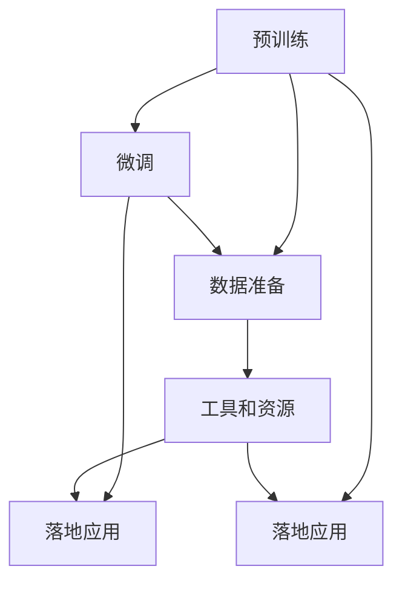

                 

# LLM产业链：AI领域新兴经济体系的形成

> 关键词：大语言模型(LLM), 产业链, AI, 自然语言处理(NLP), 应用场景, 开发工具, 学习资源

## 1. 背景介绍

### 1.1 问题由来

近年来，随着人工智能(AI)技术的快速发展，尤其是大语言模型(LLM)的兴起，一个新的经济体系正在逐渐形成。这个新兴的经济体系以大语言模型为核心，涵盖了从预训练到微调，再到落地应用的全过程，包括了模型开发、数据准备、软件工具、应用场景等多个环节。

LLM作为AI领域的重要分支，不仅在自然语言处理(NLP)等任务上取得了令人瞩目的成果，还逐渐渗透到金融、医疗、教育等多个领域，催生了新的商业机会和产业生态。然而，大语言模型的开发和应用过程复杂，涉及众多的技术细节和环节，如何有效组织和管理这些环节，实现各方的协同创新，成为了当前面临的重要问题。

### 1.2 问题核心关键点

大语言模型的产业链大致可以划分为以下几个关键环节：

1. **预训练环节**：通过大规模的无标签文本数据，训练出高质量的预训练模型。这一环节通常需要强大的计算资源和丰富的语料库。

2. **微调环节**：在预训练模型的基础上，通过有标签的数据进行微调，适配具体的任务需求。这一环节通常涉及模型的优化算法、损失函数设计、超参数调优等技术细节。

3. **落地应用环节**：将微调后的模型部署到实际应用场景中，通过API接口等方式提供服务，实现商业化应用。这一环节关注模型的性能优化、可扩展性和用户体验。

4. **数据准备环节**：为预训练和微调环节提供必要的数据支持，包括数据收集、标注、清洗等。这一环节的质量直接影响模型的最终效果。

5. **工具和资源环节**：提供高效开发和运行大语言模型所需的工具、库和资源，如框架、算法、工具链等。

这些环节之间相互依赖，相互促进，共同构成了大语言模型的完整产业链。理解这一产业链的形成和运作机制，对于推进AI技术的普及和落地应用具有重要意义。

### 1.3 问题研究意义

研究大语言模型产业链，对于推动AI技术的产业化和商业化，提升各环节的效率和质量，具有重要意义：

1. **降低开发成本**：通过标准化的流程和工具，可以显著降低大语言模型的开发成本，加速模型迭代和优化。

2. **提升应用效果**：合理组织产业链各环节，确保数据质量、模型精度和算法优化，可以提升大语言模型在实际应用中的效果。

3. **促进创新合作**：产业链的各个环节相互协作，可以汇集各方的资源和技术，推动更多的创新和合作。

4. **赋能行业转型**：大语言模型在金融、医疗、教育等领域的应用，将带动相关行业的数字化转型升级。

5. **推动产业经济**：大语言模型产业链的形成和发展，将催生新的商业机会和就业岗位，促进经济增长。

## 2. 核心概念与联系

### 2.1 核心概念概述

为更好地理解大语言模型的产业链，本节将介绍几个关键概念及其之间的联系：

- **大语言模型(LLM)**：指通过自监督或监督学习任务训练出的高质量预训练模型，具有强大的语言理解和生成能力。

- **预训练(Pre-training)**：指在无标签数据上训练模型，学习语言的通用表示，为后续微调和应用打下基础。

- **微调(Fine-tuning)**：指在预训练模型上，通过有标签数据进行优化，适配特定任务需求。

- **落地应用(Real-world Application)**：指将微调后的模型部署到实际业务场景中，提供服务并创造商业价值。

- **数据准备(Data Preparation)**：指为预训练和微调提供必要的数据支持，包括数据收集、标注和清洗。

- **工具和资源(Tools and Resources)**：指开发和运行大语言模型所需的工具、库和资源，如框架、算法、工具链等。

这些概念之间的联系可以通过以下Mermaid流程图来展示：



这个流程图展示了从预训练到落地应用的全过程，以及各环节之间的依赖关系。

## 3. 核心算法原理 & 具体操作步骤

### 3.1 算法原理概述

大语言模型的产业链的形成，依赖于一系列算法和技术的支撑。其中，预训练和微调是大语言模型产业链的核心环节，其算法原理和技术细节如下：

1. **预训练算法**：通过自监督学习任务，如语言模型、掩码语言模型等，训练大语言模型，使其学习到丰富的语言知识和表示能力。

2. **微调算法**：在预训练模型的基础上，通过有标签的数据进行优化，适配特定的任务需求。常见的微调算法包括梯度下降、Adam、SGD等。

3. **损失函数设计**：微调过程中需要设计合适的损失函数，衡量模型预测输出与真实标签之间的差异。常用的损失函数包括交叉熵、均方误差等。

4. **超参数调优**：微调过程中需要调整模型学习率、批大小、迭代轮数等超参数，以获得最佳的性能表现。

### 3.2 算法步骤详解

大语言模型产业链的形成主要包括以下几个关键步骤：

**Step 1: 数据准备**
- 收集并预处理数据，确保数据质量和多样性。
- 划分训练集、验证集和测试集。
- 标注数据集，使其适合模型微调。

**Step 2: 预训练模型选择**
- 选择合适的预训练模型，如BERT、GPT等。
- 加载预训练模型，初始化模型参数。

**Step 3: 微调模型训练**
- 设计任务适配层，适配特定的任务需求。
- 选择优化算法和超参数，进行模型训练。
- 在训练集上进行训练，调整模型参数。

**Step 4: 模型评估和优化**
- 在验证集上评估模型性能，根据评估结果调整模型参数。
- 重复训练和评估，直到模型达到预期性能。

**Step 5: 部署和应用**
- 将训练好的模型部署到实际应用场景中。
- 提供API接口，支持模型的服务化。
- 监控模型性能，不断优化模型和算法。

### 3.3 算法优缺点

大语言模型产业链的形成具有以下优点：

1. **高效协作**：产业链各环节相互协作，提高了模型的开发和应用效率。

2. **质量保证**：通过标准化的流程和工具，确保了数据质量、模型精度和算法优化。

3. **快速迭代**：产业链各环节可以并行工作，加快了模型的迭代和优化速度。

4. **资源共享**：产业链各环节可以共享数据、工具和资源，减少了重复劳动和资源浪费。

5. **创新生态**：产业链的形成促进了各方的合作和创新，催生了更多的商业机会。

同时，大语言模型产业链的形成也存在一些缺点：

1. **高成本投入**：预训练和微调环节需要大量的计算资源和标注数据，成本较高。

2. **技术复杂**：产业链各环节涉及众多技术细节，需要专业知识和技能。

3. **数据依赖**：数据质量和数量直接影响模型的效果，获取高质量标注数据的成本较高。

4. **技术迭代快**：预训练和微调算法不断更新，需要持续学习和跟进。

5. **安全风险**：大规模模型的应用可能涉及隐私和安全问题，需要加强管理和监管。

### 3.4 算法应用领域

大语言模型产业链的形成已经广泛应用于多个领域，具体包括：

1. **自然语言处理(NLP)**：包括文本分类、命名实体识别、情感分析、机器翻译等任务。

2. **金融科技(Fintech)**：应用于金融市场分析、风险管理、智能客服等。

3. **医疗健康**：应用于病历分析、诊断建议、医学研究等。

4. **教育培训**：应用于智能辅导、个性化推荐、作业批改等。

5. **零售电商**：应用于智能客服、个性化推荐、商品描述等。

6. **内容创作**：应用于智能写作、内容生成、文案创作等。

## 4. 数学模型和公式 & 详细讲解 & 举例说明

### 4.1 数学模型构建

大语言模型的微调过程可以通过数学模型来描述。假设预训练模型为 $M_{\theta}$，其中 $\theta$ 为模型参数。在微调任务 $T$ 的数据集 $D=\{(x_i,y_i)\}_{i=1}^N$ 上，微调的目标是最小化经验风险，即：

$$
\mathcal{L}(\theta) = \frac{1}{N} \sum_{i=1}^N \ell(M_{\theta}(x_i),y_i)
$$

其中 $\ell$ 为损失函数，用于衡量模型预测输出与真实标签之间的差异。

### 4.2 公式推导过程

以二分类任务为例，假设模型 $M_{\theta}$ 在输入 $x$ 上的输出为 $\hat{y}=M_{\theta}(x) \in [0,1]$，表示样本属于正类的概率。真实标签 $y \in \{0,1\}$。则二分类交叉熵损失函数定义为：

$$
\ell(M_{\theta}(x),y) = -[y\log \hat{y} + (1-y)\log (1-\hat{y})]
$$

将其代入经验风险公式，得：

$$
\mathcal{L}(\theta) = -\frac{1}{N}\sum_{i=1}^N [y_i\log M_{\theta}(x_i)+(1-y_i)\log(1-M_{\theta}(x_i))]
$$

根据链式法则，损失函数对参数 $\theta_k$ 的梯度为：

$$
\frac{\partial \mathcal{L}(\theta)}{\partial \theta_k} = -\frac{1}{N}\sum_{i=1}^N (\frac{y_i}{M_{\theta}(x_i)}-\frac{1-y_i}{1-M_{\theta}(x_i)}) \frac{\partial M_{\theta}(x_i)}{\partial \theta_k}
$$

其中 $\frac{\partial M_{\theta}(x_i)}{\partial \theta_k}$ 可进一步递归展开，利用自动微分技术完成计算。

### 4.3 案例分析与讲解

假设某公司需要构建一个情感分析模型，用于对社交媒体上的评论进行情感分类。公司收集了大量的社交媒体评论数据，并标注了评论的情感标签（正面、负面、中性）。可以使用预训练的BERT模型作为基础，对其进行微调，适配情感分析任务。具体步骤如下：

1. **数据准备**：收集并预处理社交媒体评论数据，划分训练集、验证集和测试集。

2. **模型选择**：选择预训练的BERT模型作为基础模型，加载并初始化模型参数。

3. **任务适配层设计**：在BERT模型的顶部添加全连接层和softmax层，用于情感分类。

4. **损失函数设计**：选择交叉熵损失函数，衡量模型预测输出与真实标签之间的差异。

5. **微调模型训练**：在训练集上进行训练，调整模型参数。在验证集上评估模型性能，根据评估结果调整模型参数。

6. **模型评估和优化**：在测试集上评估模型性能，使用混淆矩阵、ROC曲线等指标评估模型效果。

## 5. 项目实践：代码实例和详细解释说明

### 5.1 开发环境搭建

在进行大语言模型微调实践前，我们需要准备好开发环境。以下是使用Python进行PyTorch开发的环境配置流程：

1. 安装Anaconda：从官网下载并安装Anaconda，用于创建独立的Python环境。

2. 创建并激活虚拟环境：
```bash
conda create -n pytorch-env python=3.8 
conda activate pytorch-env
```

3. 安装PyTorch：根据CUDA版本，从官网获取对应的安装命令。例如：
```bash
conda install pytorch torchvision torchaudio cudatoolkit=11.1 -c pytorch -c conda-forge
```

4. 安装Transformers库：
```bash
pip install transformers
```

5. 安装各类工具包：
```bash
pip install numpy pandas scikit-learn matplotlib tqdm jupyter notebook ipython
```

完成上述步骤后，即可在`pytorch-env`环境中开始微调实践。

### 5.2 源代码详细实现

下面我们以情感分析任务为例，给出使用Transformers库对BERT模型进行微调的PyTorch代码实现。

首先，定义情感分析任务的数据处理函数：

```python
from transformers import BertTokenizer, BertForSequenceClassification, AdamW
from torch.utils.data import Dataset, DataLoader
import torch

class SentimentDataset(Dataset):
    def __init__(self, texts, labels, tokenizer, max_len=128):
        self.texts = texts
        self.labels = labels
        self.tokenizer = tokenizer
        self.max_len = max_len
        
    def __len__(self):
        return len(self.texts)
    
    def __getitem__(self, item):
        text = self.texts[item]
        label = self.labels[item]
        
        encoding = self.tokenizer(text, return_tensors='pt', max_length=self.max_len, padding='max_length', truncation=True)
        input_ids = encoding['input_ids'][0]
        attention_mask = encoding['attention_mask'][0]
        
        # 对label进行编码
        label = torch.tensor([label], dtype=torch.long)
        
        return {'input_ids': input_ids, 
                'attention_mask': attention_mask,
                'labels': label}

# 定义标签与id的映射
label2id = {'positive': 0, 'negative': 1, 'neutral': 2}
id2label = {v: k for k, v in label2id.items()}

# 创建dataset
tokenizer = BertTokenizer.from_pretrained('bert-base-cased')

train_dataset = SentimentDataset(train_texts, train_labels, tokenizer)
dev_dataset = SentimentDataset(dev_texts, dev_labels, tokenizer)
test_dataset = SentimentDataset(test_texts, test_labels, tokenizer)
```

然后，定义模型和优化器：

```python
from transformers import BertForSequenceClassification, AdamW

model = BertForSequenceClassification.from_pretrained('bert-base-cased', num_labels=len(label2id))

optimizer = AdamW(model.parameters(), lr=2e-5)
```

接着，定义训练和评估函数：

```python
from torch.utils.data import DataLoader
from tqdm import tqdm
from sklearn.metrics import classification_report

device = torch.device('cuda') if torch.cuda.is_available() else torch.device('cpu')
model.to(device)

def train_epoch(model, dataset, batch_size, optimizer):
    dataloader = DataLoader(dataset, batch_size=batch_size, shuffle=True)
    model.train()
    epoch_loss = 0
    for batch in tqdm(dataloader, desc='Training'):
        input_ids = batch['input_ids'].to(device)
        attention_mask = batch['attention_mask'].to(device)
        labels = batch['labels'].to(device)
        model.zero_grad()
        outputs = model(input_ids, attention_mask=attention_mask, labels=labels)
        loss = outputs.loss
        epoch_loss += loss.item()
        loss.backward()
        optimizer.step()
    return epoch_loss / len(dataloader)

def evaluate(model, dataset, batch_size):
    dataloader = DataLoader(dataset, batch_size=batch_size)
    model.eval()
    preds, labels = [], []
    with torch.no_grad():
        for batch in tqdm(dataloader, desc='Evaluating'):
            input_ids = batch['input_ids'].to(device)
            attention_mask = batch['attention_mask'].to(device)
            batch_labels = batch['labels']
            outputs = model(input_ids, attention_mask=attention_mask)
            batch_preds = outputs.logits.argmax(dim=1).to('cpu').tolist()
            batch_labels = batch_labels.to('cpu').tolist()
            for pred, label in zip(batch_preds, batch_labels):
                preds.append(pred)
                labels.append(label)
                
    print(classification_report(labels, preds))
```

最后，启动训练流程并在测试集上评估：

```python
epochs = 5
batch_size = 16

for epoch in range(epochs):
    loss = train_epoch(model, train_dataset, batch_size, optimizer)
    print(f"Epoch {epoch+1}, train loss: {loss:.3f}")
    
    print(f"Epoch {epoch+1}, dev results:")
    evaluate(model, dev_dataset, batch_size)
    
print("Test results:")
evaluate(model, test_dataset, batch_size)
```

以上就是使用PyTorch对BERT进行情感分析任务微调的完整代码实现。可以看到，得益于Transformers库的强大封装，我们可以用相对简洁的代码完成BERT模型的加载和微调。

### 5.3 代码解读与分析

让我们再详细解读一下关键代码的实现细节：

**SentimentDataset类**：
- `__init__`方法：初始化文本、标签、分词器等关键组件。
- `__len__`方法：返回数据集的样本数量。
- `__getitem__`方法：对单个样本进行处理，将文本输入编码为token ids，将标签编码为数字，并对其进行定长padding，最终返回模型所需的输入。

**label2id和id2label字典**：
- 定义了标签与数字id之间的映射关系，用于将标签解码为真实的情感。

**训练和评估函数**：
- 使用PyTorch的DataLoader对数据集进行批次化加载，供模型训练和推理使用。
- 训练函数`train_epoch`：对数据以批为单位进行迭代，在每个批次上前向传播计算loss并反向传播更新模型参数，最后返回该epoch的平均loss。
- 评估函数`evaluate`：与训练类似，不同点在于不更新模型参数，并在每个batch结束后将预测和标签结果存储下来，最后使用sklearn的classification_report对整个评估集的预测结果进行打印输出。

**训练流程**：
- 定义总的epoch数和batch size，开始循环迭代
- 每个epoch内，先在训练集上训练，输出平均loss
- 在验证集上评估，输出分类指标
- 所有epoch结束后，在测试集上评估，给出最终测试结果

可以看到，PyTorch配合Transformers库使得BERT微调的代码实现变得简洁高效。开发者可以将更多精力放在数据处理、模型改进等高层逻辑上，而不必过多关注底层的实现细节。

当然，工业级的系统实现还需考虑更多因素，如模型的保存和部署、超参数的自动搜索、更灵活的任务适配层等。但核心的微调范式基本与此类似。

## 6. 实际应用场景

### 6.1 智能客服系统

基于大语言模型微调的对话技术，可以广泛应用于智能客服系统的构建。传统客服往往需要配备大量人力，高峰期响应缓慢，且一致性和专业性难以保证。而使用微调后的对话模型，可以7x24小时不间断服务，快速响应客户咨询，用自然流畅的语言解答各类常见问题。

在技术实现上，可以收集企业内部的历史客服对话记录，将问题和最佳答复构建成监督数据，在此基础上对预训练对话模型进行微调。微调后的对话模型能够自动理解用户意图，匹配最合适的答案模板进行回复。对于客户提出的新问题，还可以接入检索系统实时搜索相关内容，动态组织生成回答。如此构建的智能客服系统，能大幅提升客户咨询体验和问题解决效率。

### 6.2 金融舆情监测

金融机构需要实时监测市场舆论动向，以便及时应对负面信息传播，规避金融风险。传统的人工监测方式成本高、效率低，难以应对网络时代海量信息爆发的挑战。基于大语言模型微调的文本分类和情感分析技术，为金融舆情监测提供了新的解决方案。

具体而言，可以收集金融领域相关的新闻、报道、评论等文本数据，并对其进行主题标注和情感标注。在此基础上对预训练语言模型进行微调，使其能够自动判断文本属于何种主题，情感倾向是正面、中性还是负面。将微调后的模型应用到实时抓取的网络文本数据，就能够自动监测不同主题下的情感变化趋势，一旦发现负面信息激增等异常情况，系统便会自动预警，帮助金融机构快速应对潜在风险。

### 6.3 个性化推荐系统

当前的推荐系统往往只依赖用户的历史行为数据进行物品推荐，无法深入理解用户的真实兴趣偏好。基于大语言模型微调技术，个性化推荐系统可以更好地挖掘用户行为背后的语义信息，从而提供更精准、多样的推荐内容。

在实践中，可以收集用户浏览、点击、评论、分享等行为数据，提取和用户交互的物品标题、描述、标签等文本内容。将文本内容作为模型输入，用户的后续行为（如是否点击、购买等）作为监督信号，在此基础上微调预训练语言模型。微调后的模型能够从文本内容中准确把握用户的兴趣点。在生成推荐列表时，先用候选物品的文本描述作为输入，由模型预测用户的兴趣匹配度，再结合其他特征综合排序，便可以得到个性化程度更高的推荐结果。

### 6.4 未来应用展望

随着大语言模型微调技术的发展，其应用场景将不断拓展，未来可能涉及更多领域。

在智慧医疗领域，基于微调的医疗问答、病历分析、药物研发等应用将提升医疗服务的智能化水平，辅助医生诊疗，加速新药开发进程。

在智能教育领域，微调技术可应用于作业批改、学情分析、知识推荐等方面，因材施教，促进教育公平，提高教学质量。

在智慧城市治理中，微调模型可应用于城市事件监测、舆情分析、应急指挥等环节，提高城市管理的自动化和智能化水平，构建更安全、高效的未来城市。

此外，在企业生产、社会治理、文娱传媒等众多领域，基于大模型微调的人工智能应用也将不断涌现，为NLP技术带来新的突破。

## 7. 工具和资源推荐

### 7.1 学习资源推荐

为了帮助开发者系统掌握大语言模型微调的理论基础和实践技巧，这里推荐一些优质的学习资源：

1. 《Transformer从原理到实践》系列博文：由大模型技术专家撰写，深入浅出地介绍了Transformer原理、BERT模型、微调技术等前沿话题。

2. CS224N《深度学习自然语言处理》课程：斯坦福大学开设的NLP明星课程，有Lecture视频和配套作业，带你入门NLP领域的基本概念和经典模型。

3. 《Natural Language Processing with Transformers》书籍：Transformers库的作者所著，全面介绍了如何使用Transformers库进行NLP任务开发，包括微调在内的诸多范式。

4. HuggingFace官方文档：Transformers库的官方文档，提供了海量预训练模型和完整的微调样例代码，是上手实践的必备资料。

5. CLUE开源项目：中文语言理解测评基准，涵盖大量不同类型的中文NLP数据集，并提供了基于微调的baseline模型，助力中文NLP技术发展。

通过对这些资源的学习实践，相信你一定能够快速掌握大语言模型微调的精髓，并用于解决实际的NLP问题。
###  7.2 开发工具推荐

高效的开发离不开优秀的工具支持。以下是几款用于大语言模型微调开发的常用工具：

1. PyTorch：基于Python的开源深度学习框架，灵活动态的计算图，适合快速迭代研究。大部分预训练语言模型都有PyTorch版本的实现。

2. TensorFlow：由Google主导开发的开源深度学习框架，生产部署方便，适合大规模工程应用。同样有丰富的预训练语言模型资源。

3. Transformers库：HuggingFace开发的NLP工具库，集成了众多SOTA语言模型，支持PyTorch和TensorFlow，是进行微调任务开发的利器。

4. Weights & Biases：模型训练的实验跟踪工具，可以记录和可视化模型训练过程中的各项指标，方便对比和调优。与主流深度学习框架无缝集成。

5. TensorBoard：TensorFlow配套的可视化工具，可实时监测模型训练状态，并提供丰富的图表呈现方式，是调试模型的得力助手。

6. Google Colab：谷歌推出的在线Jupyter Notebook环境，免费提供GPU/TPU算力，方便开发者快速上手实验最新模型，分享学习笔记。

合理利用这些工具，可以显著提升大语言模型微调任务的开发效率，加快创新迭代的步伐。

### 7.3 相关论文推荐

大语言模型和微调技术的发展源于学界的持续研究。以下是几篇奠基性的相关论文，推荐阅读：

1. Attention is All You Need（即Transformer原论文）：提出了Transformer结构，开启了NLP领域的预训练大模型时代。

2. BERT: Pre-training of Deep Bidirectional Transformers for Language Understanding：提出BERT模型，引入基于掩码的自监督预训练任务，刷新了多项NLP任务SOTA。

3. Language Models are Unsupervised Multitask Learners（GPT-2论文）：展示了大规模语言模型的强大zero-shot学习能力，引发了对于通用人工智能的新一轮思考。

4. Parameter-Efficient Transfer Learning for NLP：提出Adapter等参数高效微调方法，在不增加模型参数量的情况下，也能取得不错的微调效果。

5. Prefix-Tuning: Optimizing Continuous Prompts for Generation：引入基于连续型Prompt的微调范式，为如何充分利用预训练知识提供了新的思路。

6. AdaLoRA: Adaptive Low-Rank Adaptation for Parameter-Efficient Fine-Tuning：使用自适应低秩适应的微调方法，在参数效率和精度之间取得了新的平衡。

这些论文代表了大语言模型微调技术的发展脉络。通过学习这些前沿成果，可以帮助研究者把握学科前进方向，激发更多的创新灵感。

## 8. 总结：未来发展趋势与挑战

### 8.1 总结

本文对大语言模型产业链的形成进行了全面系统的介绍。首先阐述了大语言模型和微调技术的研究背景和意义，明确了产业链各环节的协作机制。其次，从原理到实践，详细讲解了产业链各环节的算法原理和技术细节，给出了微调任务开发的完整代码实例。同时，本文还广泛探讨了微调方法在多个领域的应用前景，展示了产业链的形成和运作机制。

通过本文的系统梳理，可以看到，大语言模型产业链的形成是大语言模型技术普及和应用的重要基础。这一产业链不仅涉及技术研发和数据处理，还涵盖工具支持、商业应用等多个环节，各环节相互协作，共同推动了NLP技术的创新和落地。未来，随着产业链的不断成熟，相信大语言模型将会在更多领域发挥更大的作用，带来更多的商业价值和社会效益。

### 8.2 未来发展趋势

展望未来，大语言模型产业链的形成将呈现以下几个发展趋势：

1. **产业链完整化**：随着技术的发展，产业链各环节将不断完善，形成更加完整的开发、训练、部署、监控体系。

2. **技术创新化**：产业链各环节将不断引入新的技术，如参数高效微调、多任务学习、自监督学习等，提升模型的性能和效率。

3. **应用多样化**：大语言模型将广泛应用于更多领域，如医疗、教育、金融、娱乐等，催生更多的商业机会和创新应用。

4. **工具标准化**：为提升开发效率，产业链各环节将逐渐形成标准化的工具和流程，减少重复劳动和资源浪费。

5. **生态多样化**：产业链将涉及更多的参与方，包括研究机构、企业、开发者等，形成更加多样化的生态系统。

6. **隐私保护加强**：随着模型的应用场景扩大，隐私和安全问题将受到更多关注，需要加强数据保护和模型安全。

7. **标准化和规范化**：为推动大语言模型的普及和标准化，产业链将逐步形成统一的标准和规范，促进技术的可持续发展。

以上趋势凸显了大语言模型产业链的形成和发展方向，各环节需协同努力，共同推动这一新兴经济体系的成熟。

### 8.3 面临的挑战

尽管大语言模型产业链的形成带来了诸多机遇，但也面临诸多挑战：

1. **高昂成本**：预训练和微调环节需要大量计算资源和标注数据，成本较高。

2. **技术复杂**：产业链各环节涉及众多技术细节，需要专业知识和技能。

3. **数据依赖**：数据质量和数量直接影响模型的效果，获取高质量标注数据的成本较高。

4. **技术迭代快**：预训练和微调算法不断更新，需要持续学习和跟进。

5. **隐私风险**：大规模模型的应用可能涉及隐私和安全问题，需要加强管理和监管。

6. **生态建设**：产业链各环节需协同努力，形成标准化的工具和流程，才能提升开发效率。

7. **性能优化**：模型在实际应用中需要优化性能，提升推理速度和资源利用率。

8. **应用落地**：如何将大语言模型有效应用于实际场景，并取得商业价值，仍需进一步探索。

### 8.4 研究展望

面对大语言模型产业链所面临的挑战，未来的研究需要在以下几个方面寻求新的突破：

1. **降低成本**：探索无监督和半监督微调方法，降低对标注数据的依赖。

2. **提高性能**：研究参数高效和计算高效的微调范式，提升模型性能和推理效率。

3. **增强鲁棒性**：引入对抗训练、数据增强等技术，提高模型的鲁棒性和泛化能力。

4. **加强隐私保护**：开发隐私保护技术，确保数据和模型的安全。

5. **促进协作**：加强产业链各环节的协作，形成标准化的工具和流程，提升开发效率。

6. **优化应用**：探索更多应用场景，优化模型在实际应用中的性能和用户体验。

7. **提升标准化**：推动大语言模型的标准化和规范化，促进技术的可持续发展。

这些研究方向的探索，将有助于大语言模型产业链的进一步成熟和完善，推动NLP技术的普及和应用。

## 9. 附录：常见问题与解答

**Q1：大语言模型微调是否适用于所有NLP任务？**

A: 大语言模型微调在大多数NLP任务上都能取得不错的效果，特别是对于数据量较小的任务。但对于一些特定领域的任务，如医学、法律等，仅仅依靠通用语料预训练的模型可能难以很好地适应。此时需要在特定领域语料上进一步预训练，再进行微调，才能获得理想效果。此外，对于一些需要时效性、个性化很强的任务，如对话、推荐等，微调方法也需要针对性的改进优化。

**Q2：微调过程中如何选择合适的学习率？**

A: 微调的学习率一般要比预训练时小1-2个数量级，如果使用过大的学习率，容易破坏预训练权重，导致过拟合。一般建议从1e-5开始调参，逐步减小学习率，直至收敛。也可以使用warmup策略，在开始阶段使用较小的学习率，再逐渐过渡到预设值。需要注意的是，不同的优化器(如AdamW、Adafactor等)以及不同的学习率调度策略，可能需要设置不同的学习率阈值。

**Q3：采用大模型微调时会面临哪些资源瓶颈？**

A: 目前主流的预训练大模型动辄以亿计的参数规模，对算力、内存、存储都提出了很高的要求。GPU/TPU等高性能设备是必不可少的，但即便如此，超大批次的训练和推理也可能遇到显存不足的问题。因此需要采用一些资源优化技术，如梯度积累、混合精度训练、模型并行等，来突破硬件瓶颈。同时，模型的存储和读取也可能占用大量时间和空间，需要采用模型压缩、稀疏化存储等方法进行优化。

**Q4：如何缓解微调过程中的过拟合问题？**

A: 过拟合是微调面临的主要挑战，尤其是在标注数据不足的情况下。常见的缓解策略包括：

1. 数据增强：通过回译、近义替换等方式扩充训练集。
2. 正则化：使用L2正则、Dropout、Early Stopping等避免过拟合。
3. 对抗训练：引入对抗样本，提高模型鲁棒性。
4. 参数高效微调：只调整少量参数(如Adapter、Prefix等)，减小过拟合风险。
5. 多模型集成：训练多个微调模型，取平均输出，抑制过拟合。

这些策略往往需要根据具体任务和数据特点进行灵活组合。只有在数据、模型、训练、推理等各环节进行全面优化，才能最大限度地发挥大模型微调的威力。

**Q5：微调模型在落地部署时需要注意哪些问题？**

A: 将微调模型转化为实际应用，还需要考虑以下因素：

1. 模型裁剪：去除不必要的层和参数，减小模型尺寸，加快推理速度。
2. 量化加速：将浮点模型转为定点模型，压缩存储空间，提高计算效率。
3. 服务化封装：将模型封装为标准化服务接口，便于集成调用。
4. 弹性伸缩：根据请求流量动态调整资源配置，平衡服务质量和成本。
5. 监控告警：实时采集系统指标，设置异常告警阈值，确保服务稳定性。
6. 安全防护：采用访问鉴权、数据脱敏等措施，保障数据和模型安全。

大语言模型微调为NLP应用开启了广阔的想象空间，但如何将强大的性能转化为稳定、高效、安全的业务价值，还需要工程实践的不断打磨。唯有从数据、算法、工程、业务等多个维度协同发力，才能真正实现人工智能技术在垂直行业的规模化落地。总之，微调需要开发者根据具体任务，不断迭代和优化模型、数据和算法，方能得到理想的效果。

---

作者：禅与计算机程序设计艺术 / Zen and the Art of Computer Programming

