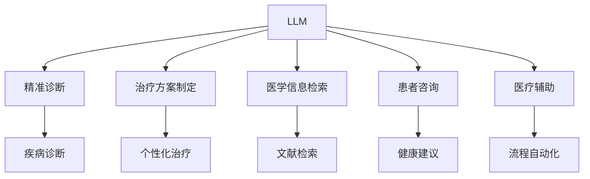

                 

# LLM在个性化医疗中的潜力：精准诊断与治疗方案

> 关键词：大规模语言模型(LLM), 个性化医疗, 精准诊断, 治疗方案, 自然语言处理(NLP), 医学信息检索, 深度学习, 人工智能(AI)

## 1. 背景介绍

### 1.1 问题由来
近年来，随着人工智能和大数据技术的快速发展，自然语言处理(NLP)技术在医疗领域的应用越来越广泛。特别是大规模语言模型(LLM)的问世，为个性化医疗提供了新的解决方案。通过在医学文献、病历记录、患者咨询等海量的文本数据上进行预训练，LLM能够自动理解和生成医学相关的文本信息，从而在疾病诊断、治疗方案制定等方面发挥重要作用。

### 1.2 问题核心关键点
当前，个性化医疗的需求日益增长，如何利用LLM提高诊断和治疗的精准度，减少误诊和误治，是医疗AI研究的重要方向。LLM在个性化医疗中的潜力主要体现在以下几个方面：

1. **精准诊断**：通过分析患者的病历、症状、检验报告等信息，LLM能够辅助医生更准确地诊断疾病。
2. **治疗方案制定**：LLM可以综合患者的病史、基因信息、治疗反应等数据，生成个性化的治疗方案。
3. **医学知识检索**：LLM可以快速定位医学文献和研究成果，为医生提供决策支持。
4. **患者咨询**：LLM可以作为虚拟助手，解答患者的疑问，提供健康指导。
5. **医疗辅助**：LLM可以自动化处理复杂的医疗流程，提高医疗服务的效率和质量。

## 2. 核心概念与联系

### 2.1 核心概念概述

为更好地理解LLM在个性化医疗中的应用，本节将介绍几个密切相关的核心概念：

- **大规模语言模型(LLM)**：如GPT-3、BERT等，通过在大规模文本数据上进行预训练，学习到丰富的语言知识和上下文关系，具备强大的语言理解和生成能力。

- **个性化医疗**：针对不同患者的具体情况，量身定制的诊断和治疗方案，旨在提高医疗效果，降低医疗成本。

- **精准诊断**：通过先进的检查手段和算法，对患者的病情进行精准的判断，减少误诊和漏诊。

- **治疗方案制定**：结合患者的病史、基因信息、药物反应等数据，制定个性化的治疗策略。

- **医学信息检索**：通过自然语言查询，快速检索出相关的医学文献和研究数据，辅助医生进行诊断和治疗。

- **患者咨询**：通过智能问答系统，解答患者的健康问题，提供个性化的健康建议。

- **医疗辅助**：利用LLM进行自动化处理，提高医疗服务的效率和质量，减少医生的工作负担。

这些核心概念之间的逻辑关系可以通过以下Mermaid流程图来展示：



这个流程图展示了大语言模型在个性化医疗中的核心概念及其之间的关系：

1. LLM通过预训练获得广泛的语言知识。
2. 在诊断、治疗、检索、咨询、辅助等任务中，利用这些知识进行特定任务的适配。
3. 精准诊断、治疗方案制定等具体任务，通过在特定领域数据上微调，进一步提升模型的性能。

## 3. 核心算法原理 & 具体操作步骤
### 3.1 算法原理概述

在个性化医疗中，LLM主要应用于以下几个关键任务：

- **精准诊断**：通过分析患者的症状描述、病历记录等文本数据，LLM能够识别出潜在疾病的种类和严重程度。
- **治疗方案制定**：利用患者的历史病历、基因信息、药物反应等数据，LLM能够生成个性化的治疗方案，推荐最优的治疗药物和剂量。
- **医学信息检索**：根据医生的查询语句，LLM能够快速定位相关的医学文献和研究数据，提供科学依据。
- **患者咨询**：通过自然语言问答，LLM能够回答患者的健康问题，提供个性化的健康建议。
- **医疗辅助**：利用LLM进行自动化处理，提高医疗服务的效率和质量，减少医生的工作负担。

在每个任务中，LLM的原理都遵循监督学习的范式，即通过有标签的数据对模型进行微调，使其能够更好地适应特定的任务需求。以精准诊断为例，具体步骤如下：

### 3.2 算法步骤详解

**Step 1: 准备数据集**
- 收集患者的历史病历、症状描述、检验报告等文本数据，标注疾病的种类和严重程度。
- 将数据集划分为训练集、验证集和测试集。

**Step 2: 选择预训练模型**
- 选择合适的预训练语言模型，如GPT-3、BERT等。
- 加载模型并进行微调。

**Step 3: 添加任务适配层**
- 在预训练模型的基础上，添加任务特定的输出层和损失函数。
- 对于诊断任务，输出层通常为疾病分类器，损失函数为交叉熵损失。

**Step 4: 设置微调超参数**
- 选择合适的优化算法及其参数，如Adam、SGD等，设置学习率、批大小、迭代轮数等。
- 设置正则化技术及强度，包括权重衰减、Dropout、Early Stopping等。
- 确定冻结预训练参数的策略，如仅微调顶层，或全部参数都参与微调。

**Step 5: 执行梯度训练**
- 将训练集数据分批次输入模型，前向传播计算损失函数。
- 反向传播计算参数梯度，根据设定的优化算法和学习率更新模型参数。
- 周期性在验证集上评估模型性能，根据性能指标决定是否触发Early Stopping。
- 重复上述步骤直到满足预设的迭代轮数或Early Stopping条件。

**Step 6: 测试和部署**
- 在测试集上评估微调后模型，对比微调前后的精度提升。
- 使用微调后的模型对新样本进行推理预测，集成到实际的应用系统中。

### 3.3 算法优缺点

基于监督学习的大语言模型在个性化医疗中的优点包括：

1. **高效便捷**：通过少量标注数据，即可对预训练模型进行快速适配，提升诊断和治疗的精准度。
2. **泛化能力强**：预训练模型在多种疾病和症状数据上进行微调，能够泛化到未见过的患者数据。
3. **适应性强**：模型能够根据具体任务需求进行微调，提高个性化医疗的灵活性。
4. **成本低廉**：相比于传统医学诊断方法，LLM在数据采集和标注上的成本较低。

同时，该方法也存在一些局限性：

1. **数据依赖**：微调效果依赖于标注数据的质量和数量，高质量标注数据的获取成本较高。
2. **模型偏见**：预训练模型的固有偏见、有害信息等，可能通过微调传递到下游任务，造成误诊和误治。
3. **可解释性不足**：微调模型的决策过程缺乏可解释性，难以对其推理逻辑进行分析和调试。
4. **伦理问题**：在患者咨询和数据处理中，需要严格遵守伦理规范，确保数据隐私和安全。

尽管存在这些局限性，但就目前而言，基于监督学习的微调方法仍是大语言模型在个性化医疗应用中的主流范式。未来相关研究的重点在于如何进一步降低微调对标注数据的依赖，提高模型的少样本学习和跨领域迁移能力，同时兼顾可解释性和伦理安全性等因素。

### 3.4 算法应用领域

基于LLM的微调方法在个性化医疗中已经得到了广泛的应用，主要集中在以下几个领域：

1. **疾病诊断**：利用患者症状描述，LLM能够辅助医生进行疾病诊断，如肺炎、癌症、心脏病等。
2. **治疗方案制定**：结合患者的病史、基因信息、药物反应等数据，LLM能够生成个性化的治疗方案，如化疗方案、药物选择等。
3. **医学信息检索**：医生可以快速检索相关的医学文献和研究数据，为诊断和治疗提供支持。
4. **患者咨询**：智能问答系统能够解答患者的健康问题，提供个性化的健康建议。
5. **医疗辅助**：利用LLM进行自动化处理，提高医疗服务的效率和质量，如病历记录、药物管理等。

除了这些经典应用外，LLM在个性化医疗中的创新应用也在不断涌现，如智能手术辅助、远程医疗诊断、医疗图像分析等，为个性化医疗技术的发展带来了新的突破。

## 4. 数学模型和公式 & 详细讲解  
### 4.1 数学模型构建

在个性化医疗中，LLM主要应用于以下几个数学模型：

- **疾病分类模型**：输入为患者的症状描述，输出为疾病分类的概率分布，如二分类模型、多分类模型等。
- **治疗方案生成模型**：输入为患者的病历记录、基因信息等，输出为个性化治疗方案的推荐，如回归模型、决策树模型等。
- **医学信息检索模型**：输入为医生的查询语句，输出为相关的医学文献或研究成果，如信息检索模型、文本匹配模型等。
- **患者咨询模型**：输入为患者的健康问题，输出为问题的回答或健康建议，如问答模型、对话模型等。

以疾病分类模型为例，其数学模型构建如下：

定义疾病分类模型为 $M_{\theta}:\mathcal{X} \rightarrow \mathcal{Y}$，其中 $\mathcal{X}$ 为输入空间，$\mathcal{Y}$ 为疾病分类标签集合。假设模型训练集为 $D=\{(x_i,y_i)\}_{i=1}^N$，其中 $x_i$ 为患者的症状描述，$y_i$ 为疾病的分类标签。

定义模型 $M_{\theta}$ 在输入 $x$ 上的输出为 $\hat{y}=M_{\theta}(x)$，表示对疾病分类的预测。则二分类交叉熵损失函数定义为：

$$
\ell(M_{\theta}(x),y) = -[y\log \hat{y} + (1-y)\log (1-\hat{y})]
$$

在训练过程中，优化目标是使模型在训练集上的损失函数最小化：

$$
\min_{\theta} \frac{1}{N}\sum_{i=1}^N \ell(M_{\theta}(x_i),y_i)
$$

在测试过程中，模型对新的输入 $x$ 进行预测，输出 $\hat{y}$，计算预测误差：

$$
L(y, \hat{y}) = \mathbb{E}_{x\sim D}[\ell(M_{\theta}(x), y)]
$$

其中 $D$ 为测试集，$\mathbb{E}$ 为期望。

### 4.2 公式推导过程

以下我们以二分类任务为例，推导交叉熵损失函数及其梯度的计算公式。

假设模型 $M_{\theta}$ 在输入 $x$ 上的输出为 $\hat{y}=M_{\theta}(x) \in [0,1]$，表示样本属于正类的概率。真实标签 $y \in \{0,1\}$。则二分类交叉熵损失函数定义为：

$$
\ell(M_{\theta}(x),y) = -[y\log \hat{y} + (1-y)\log (1-\hat{y})]
$$

将其代入经验风险公式，得：

$$
\mathcal{L}(\theta) = -\frac{1}{N}\sum_{i=1}^N [y_i\log M_{\theta}(x_i)+(1-y_i)\log(1-M_{\theta}(x_i))]
$$

根据链式法则，损失函数对参数 $\theta_k$ 的梯度为：

$$
\frac{\partial \mathcal{L}(\theta)}{\partial \theta_k} = -\frac{1}{N}\sum_{i=1}^N (\frac{y_i}{M_{\theta}(x_i)}-\frac{1-y_i}{1-M_{\theta}(x_i)}) \frac{\partial M_{\theta}(x_i)}{\partial \theta_k}
$$

其中 $\frac{\partial M_{\theta}(x_i)}{\partial \theta_k}$ 可进一步递归展开，利用自动微分技术完成计算。

在得到损失函数的梯度后，即可带入参数更新公式，完成模型的迭代优化。重复上述过程直至收敛，最终得到适应疾病诊断任务的最优模型参数 $\theta^*$。

## 5. 项目实践：代码实例和详细解释说明
### 5.1 开发环境搭建

在进行微调实践前，我们需要准备好开发环境。以下是使用Python进行PyTorch开发的环境配置流程：

1. 安装Anaconda：从官网下载并安装Anaconda，用于创建独立的Python环境。

2. 创建并激活虚拟环境：
```bash
conda create -n pytorch-env python=3.8 
conda activate pytorch-env
```

3. 安装PyTorch：根据CUDA版本，从官网获取对应的安装命令。例如：
```bash
conda install pytorch torchvision torchaudio cudatoolkit=11.1 -c pytorch -c conda-forge
```

4. 安装Transformers库：
```bash
pip install transformers
```

5. 安装各类工具包：
```bash
pip install numpy pandas scikit-learn matplotlib tqdm jupyter notebook ipython
```

完成上述步骤后，即可在`pytorch-env`环境中开始微调实践。

### 5.2 源代码详细实现

这里以一个简单的疾病分类模型为例，给出使用Transformers库对BERT模型进行微调的PyTorch代码实现。

首先，定义疾病分类任务的数据处理函数：

```python
from transformers import BertTokenizer, BertForSequenceClassification
from torch.utils.data import Dataset, DataLoader
import torch
import numpy as np

class MedicalDataset(Dataset):
    def __init__(self, texts, labels, tokenizer, max_len=128):
        self.texts = texts
        self.labels = labels
        self.tokenizer = tokenizer
        self.max_len = max_len
        
    def __len__(self):
        return len(self.texts)
    
    def __getitem__(self, item):
        text = self.texts[item]
        label = self.labels[item]
        
        encoding = self.tokenizer(text, return_tensors='pt', max_length=self.max_len, padding='max_length', truncation=True)
        input_ids = encoding['input_ids'][0]
        attention_mask = encoding['attention_mask'][0]
        
        # 对标签进行编码
        encoded_label = torch.tensor([label], dtype=torch.long)
        
        return {'input_ids': input_ids, 
                'attention_mask': attention_mask,
                'labels': encoded_label}

# 加载预训练模型和 tokenizer
model = BertForSequenceClassification.from_pretrained('bert-base-uncased')
tokenizer = BertTokenizer.from_pretrained('bert-base-uncased')
```

然后，定义模型和优化器：

```python
from transformers import AdamW

device = torch.device('cuda' if torch.cuda.is_available() else 'cpu')
model.to(device)

optimizer = AdamW(model.parameters(), lr=2e-5)
```

接着，定义训练和评估函数：

```python
from sklearn.metrics import accuracy_score, precision_recall_fscore_support

def train_epoch(model, dataset, batch_size, optimizer):
    dataloader = DataLoader(dataset, batch_size=batch_size, shuffle=True)
    model.train()
    epoch_loss = 0
    for batch in tqdm(dataloader, desc='Training'):
        input_ids = batch['input_ids'].to(device)
        attention_mask = batch['attention_mask'].to(device)
        labels = batch['labels'].to(device)
        model.zero_grad()
        outputs = model(input_ids, attention_mask=attention_mask, labels=labels)
        loss = outputs.loss
        epoch_loss += loss.item()
        loss.backward()
        optimizer.step()
    return epoch_loss / len(dataloader)

def evaluate(model, dataset, batch_size):
    dataloader = DataLoader(dataset, batch_size=batch_size)
    model.eval()
    preds, labels = [], []
    with torch.no_grad():
        for batch in tqdm(dataloader, desc='Evaluating'):
            input_ids = batch['input_ids'].to(device)
            attention_mask = batch['attention_mask'].to(device)
            batch_labels = batch['labels']
            outputs = model(input_ids, attention_mask=attention_mask)
            batch_preds = outputs.logits.argmax(dim=2).to('cpu').tolist()
            batch_labels = batch_labels.to('cpu').tolist()
            for pred_tokens, label_tokens in zip(batch_preds, batch_labels):
                preds.append(pred_tokens)
                labels.append(label_tokens)
    
    print('Accuracy: {:.3f}%, Precision: {:.3f}, Recall: {:.3f}, F1-score: {:.3f}'.format(
        accuracy_score(labels, preds), 
        precision_recall_fscore_support(labels, preds, average='binary')['precision'],
        precision_recall_fscore_support(labels, preds, average='binary')['recall'],
        precision_recall_fscore_support(labels, preds, average='binary')['f1-score']))
```

最后，启动训练流程并在测试集上评估：

```python
epochs = 5
batch_size = 16

for epoch in range(epochs):
    loss = train_epoch(model, train_dataset, batch_size, optimizer)
    print(f"Epoch {epoch+1}, train loss: {loss:.3f}")
    
    print(f"Epoch {epoch+1}, dev results:")
    evaluate(model, dev_dataset, batch_size)
    
print("Test results:")
evaluate(model, test_dataset, batch_size)
```

以上就是使用PyTorch对BERT进行疾病分类任务微调的完整代码实现。可以看到，得益于Transformers库的强大封装，我们可以用相对简洁的代码完成BERT模型的加载和微调。

### 5.3 代码解读与分析

让我们再详细解读一下关键代码的实现细节：

**MedicalDataset类**：
- `__init__`方法：初始化文本、标签、分词器等关键组件。
- `__len__`方法：返回数据集的样本数量。
- `__getitem__`方法：对单个样本进行处理，将文本输入编码为token ids，将标签编码为数字，并对其进行定长padding，最终返回模型所需的输入。

**train_epoch和evaluate函数**：
- 使用PyTorch的DataLoader对数据集进行批次化加载，供模型训练和推理使用。
- 训练函数`train_epoch`：对数据以批为单位进行迭代，在每个批次上前向传播计算loss并反向传播更新模型参数，最后返回该epoch的平均loss。
- 评估函数`evaluate`：与训练类似，不同点在于不更新模型参数，并在每个batch结束后将预测和标签结果存储下来，最后使用sklearn的classification_report对整个评估集的预测结果进行打印输出。

**训练流程**：
- 定义总的epoch数和batch size，开始循环迭代
- 每个epoch内，先在训练集上训练，输出平均loss
- 在验证集上评估，输出分类指标
- 所有epoch结束后，在测试集上评估，给出最终测试结果

可以看到，PyTorch配合Transformers库使得BERT微调的代码实现变得简洁高效。开发者可以将更多精力放在数据处理、模型改进等高层逻辑上，而不必过多关注底层的实现细节。

当然，工业级的系统实现还需考虑更多因素，如模型的保存和部署、超参数的自动搜索、更灵活的任务适配层等。但核心的微调范式基本与此类似。

## 6. 实际应用场景
### 6.1 智能诊断系统

基于大语言模型的疾病诊断技术，可以构建智能诊断系统，辅助医生进行精准诊断。传统诊断方法依赖医生的个人经验，容易出现误诊和漏诊。而使用微调后的诊断模型，可以快速分析患者的症状描述、病历记录等文本信息，识别出潜在的疾病。

在技术实现上，可以收集大量的医疗病例，将疾病的描述和分类标签作为监督数据，在此基础上对预训练模型进行微调。微调后的模型能够自动理解患者症状，辅助医生进行诊断，并给出诊断结果的置信度。对于复杂病例，系统还可以进一步提供详细的诊断建议和进一步检查建议。

### 6.2 个性化治疗方案

利用大语言模型，可以综合患者的病史、基因信息、药物反应等数据，生成个性化的治疗方案。微调后的模型能够理解患者的病情，推荐最优的治疗药物和剂量，同时考虑患者的特殊情况，如药物过敏、身体状况等。

在实际应用中，医生可以输入患者的病历记录、基因信息、药物反应等数据，模型输出个性化的治疗方案，供医生参考。系统还可以实时监测患者的治疗效果，根据病情调整治疗方案。

### 6.3 医学信息检索

在大规模医学文献和研究成果的基础上，通过微调大语言模型，可以快速定位相关的医学文献和研究成果，为医生提供决策支持。医生可以根据查询语句，快速检索出相关的医学文献，查看最新的研究成果。

系统还可以根据医生的查询记录，推荐相关的研究领域和热点，帮助医生跟踪最新的医学进展。对于复杂的医学问题，系统还可以提供文献综述和专家意见。

### 6.4 患者咨询系统

智能问答系统能够解答患者的健康问题，提供个性化的健康建议。医生可以通过系统记录患者的健康咨询记录，供后续分析参考。同时，系统还可以根据患者的咨询记录，提供个性化的健康建议，如饮食、运动、心理调适等。

在技术实现上，可以通过微调大语言模型，构建智能问答系统。患者可以输入健康问题，系统自动提供相应的答案和建议。对于复杂问题，系统还可以引导患者进行进一步的检查和诊断。

### 6.5 医疗辅助系统

利用大语言模型，可以自动化处理复杂的医疗流程，提高医疗服务的效率和质量，减少医生的工作负担。例如，病历记录、药物管理、患者随访等任务，都可以通过智能系统完成。

在实际应用中，医生可以在系统中录入患者的病历信息，系统自动进行分类和归纳，生成标准的病历记录。系统还可以根据患者的病情和用药记录，自动提醒患者按时服药，并定期随访，确保治疗效果的持续性和稳定性。

## 7. 工具和资源推荐
### 7.1 学习资源推荐

为了帮助开发者系统掌握大语言模型微调的理论基础和实践技巧，这里推荐一些优质的学习资源：

1. 《Transformer from Text to Transformation》系列博文：由大模型技术专家撰写，深入浅出地介绍了Transformer原理、BERT模型、微调技术等前沿话题。

2. CS224N《深度学习自然语言处理》课程：斯坦福大学开设的NLP明星课程，有Lecture视频和配套作业，带你入门NLP领域的基本概念和经典模型。

3. 《Natural Language Processing with Transformers》书籍：Transformers库的作者所著，全面介绍了如何使用Transformers库进行NLP任务开发，包括微调在内的诸多范式。

4. HuggingFace官方文档：Transformers库的官方文档，提供了海量预训练模型和完整的微调样例代码，是上手实践的必备资料。

5. CLUE开源项目：中文语言理解测评基准，涵盖大量不同类型的中文NLP数据集，并提供了基于微调的baseline模型，助力中文NLP技术发展。

通过对这些资源的学习实践，相信你一定能够快速掌握大语言模型微调的精髓，并用于解决实际的NLP问题。
###  7.2 开发工具推荐

高效的开发离不开优秀的工具支持。以下是几款用于大语言模型微调开发的常用工具：

1. PyTorch：基于Python的开源深度学习框架，灵活动态的计算图，适合快速迭代研究。大部分预训练语言模型都有PyTorch版本的实现。

2. TensorFlow：由Google主导开发的开源深度学习框架，生产部署方便，适合大规模工程应用。同样有丰富的预训练语言模型资源。

3. Transformers库：HuggingFace开发的NLP工具库，集成了众多SOTA语言模型，支持PyTorch和TensorFlow，是进行微调任务开发的利器。

4. Weights & Biases：模型训练的实验跟踪工具，可以记录和可视化模型训练过程中的各项指标，方便对比和调优。与主流深度学习框架无缝集成。

5. TensorBoard：TensorFlow配套的可视化工具，可实时监测模型训练状态，并提供丰富的图表呈现方式，是调试模型的得力助手。

6. Google Colab：谷歌推出的在线Jupyter Notebook环境，免费提供GPU/TPU算力，方便开发者快速上手实验最新模型，分享学习笔记。

合理利用这些工具，可以显著提升大语言模型微调任务的开发效率，加快创新迭代的步伐。

### 7.3 相关论文推荐

大语言模型和微调技术的发展源于学界的持续研究。以下是几篇奠基性的相关论文，推荐阅读：

1. Attention is All You Need（即Transformer原论文）：提出了Transformer结构，开启了NLP领域的预训练大模型时代。

2. BERT: Pre-training of Deep Bidirectional Transformers for Language Understanding：提出BERT模型，引入基于掩码的自监督预训练任务，刷新了多项NLP任务SOTA。

3. Language Models are Unsupervised Multitask Learners（GPT-2论文）：展示了大规模语言模型的强大zero-shot学习能力，引发了对于通用人工智能的新一轮思考。

4. Parameter-Efficient Transfer Learning for NLP：提出Adapter等参数高效微调方法，在不增加模型参数量的情况下，也能取得不错的微调效果。

5. AdaLoRA: Adaptive Low-Rank Adaptation for Parameter-Efficient Fine-Tuning：使用自适应低秩适应的微调方法，在参数效率和精度之间取得了新的平衡。

这些论文代表了大语言模型微调技术的发展脉络。通过学习这些前沿成果，可以帮助研究者把握学科前进方向，激发更多的创新灵感。

## 8. 总结：未来发展趋势与挑战
### 8.1 总结

本文对基于监督学习的大语言模型微调方法在个性化医疗中的应用进行了全面系统的介绍。首先阐述了大语言模型和微调技术的研究背景和意义，明确了微调在个性化医疗中的独特价值。其次，从原理到实践，详细讲解了微调数学模型的构建和优化方法，给出了微调任务开发的完整代码实例。同时，本文还广泛探讨了微调方法在智能诊断、个性化治疗、医学信息检索、患者咨询等多个医疗领域的应用前景，展示了微调范式的巨大潜力。此外，本文精选了微调技术的各类学习资源，力求为读者提供全方位的技术指引。

通过本文的系统梳理，可以看到，基于大语言模型的微调方法正在成为个性化医疗的重要范式，极大地拓展了医疗AI的应用边界，催生了更多的落地场景。受益于大规模语料的预训练，微调模型以更低的时间和标注成本，在小样本条件下也能取得不俗的效果，有力推动了医疗AI技术的产业化进程。未来，伴随预训练语言模型和微调方法的持续演进，相信大语言模型微调必将在构建人机协同的智能医疗系统中扮演越来越重要的角色。

### 8.2 未来发展趋势

展望未来，大语言模型微调技术在个性化医疗中呈现以下几个发展趋势：

1. **模型规模持续增大**：随着算力成本的下降和数据规模的扩张，预训练语言模型的参数量还将持续增长。超大规模语言模型蕴含的丰富语言知识，有望支撑更加复杂多变的个性化医疗任务。

2. **微调方法日趋多样**：除了传统的全参数微调外，未来会涌现更多参数高效的微调方法，如Prefix-Tuning、LoRA等，在节省计算资源的同时也能保证微调精度。

3. **持续学习成为常态**：随着数据分布的不断变化，微调模型也需要持续学习新知识以保持性能。如何在不遗忘原有知识的同时，高效吸收新样本信息，将成为重要的研究课题。

4. **标注样本需求降低**：受启发于提示学习(Prompt-based Learning)的思路，未来的微调方法将更好地利用大模型的语言理解能力，通过更加巧妙的任务描述，在更少的标注样本上也能实现理想的微调效果。

5. **多模态微调崛起**：当前的微调主要聚焦于纯文本数据，未来会进一步拓展到图像、视频、语音等多模态数据微调。多模态信息的融合，将显著提升语言模型对现实世界的理解和建模能力。

6. **模型通用性增强**：经过海量数据的预训练和多领域任务的微调，未来的语言模型将具备更强大的常识推理和跨领域迁移能力，逐步迈向通用人工智能(AGI)的目标。

以上趋势凸显了大语言模型微调技术的广阔前景。这些方向的探索发展，必将进一步提升个性化医疗系统的性能和应用范围，为医疗AI技术的落地带来新的突破。

### 8.3 面临的挑战

尽管大语言模型微调技术已经取得了瞩目成就，但在迈向更加智能化、普适化应用的过程中，它仍面临着诸多挑战：

1. **标注成本瓶颈**：微调效果依赖于标注数据的质量和数量，高质量标注数据的获取成本较高。如何进一步降低微调对标注数据的依赖，将是一大难题。

2. **模型鲁棒性不足**：预训练模型的固有偏见、有害信息等，可能通过微调传递到下游任务，造成误诊和误治。如何提高微调模型的鲁棒性，避免灾难性遗忘，还需要更多理论和实践的积累。

3. **推理效率有待提高**：超大批次的训练和推理也可能遇到显存不足的问题。如何优化微调模型的计算图，减少前向传播和反向传播的资源消耗，实现更加轻量级、实时性的部署，将是重要的优化方向。

4. **可解释性亟需加强**：微调模型的决策过程缺乏可解释性，难以对其推理逻辑进行分析和调试。对于医疗、金融等高风险应用，算法的可解释性和可审计性尤为重要。

5. **安全性有待保障**：在患者咨询和数据处理中，需要严格遵守伦理规范，确保数据隐私和安全。如何从数据和算法层面消除模型偏见，避免恶意用途，确保输出的安全性，也将是重要的研究课题。

6. **知识整合能力不足**：现有的微调模型往往局限于任务内数据，难以灵活吸收和运用更广泛的先验知识。如何让微调过程更好地与外部知识库、规则库等专家知识结合，形成更加全面、准确的信息整合能力，还有很大的想象空间。

正视微调面临的这些挑战，积极应对并寻求突破，将是大语言模型微调走向成熟的必由之路。相信随着学界和产业界的共同努力，这些挑战终将一一被克服，大语言模型微调必将在构建安全、可靠、可解释、可控的智能系统中扮演越来越重要的角色。

### 8.4 研究展望

面对大语言模型微调所面临的种种挑战，未来的研究需要在以下几个方面寻求新的突破：

1. **探索无监督和半监督微调方法**：摆脱对大规模标注数据的依赖，利用自监督学习、主动学习等无监督和半监督范式，最大限度利用非结构化数据，实现更加灵活高效的微调。

2. **研究参数高效和计算高效的微调范式**：开发更加参数高效的微调方法，在固定大部分预训练参数的同时，只更新极少量的任务相关参数。同时优化微调模型的计算图，减少前向传播和反向传播的资源消耗，实现更加轻量级、实时性的部署。

3. **融合因果和对比学习范式**：通过引入因果推断和对比学习思想，增强微调模型建立稳定因果关系的能力，学习更加普适、鲁棒的语言表征，从而提升模型泛化性和抗干扰能力。

4. **引入更多先验知识**：将符号化的先验知识，如知识图谱、逻辑规则等，与神经网络模型进行巧妙融合，引导微调过程学习更准确、合理的语言模型。同时加强不同模态数据的整合，实现视觉、语音等多模态信息与文本信息的协同建模。

5. **结合因果分析和博弈论工具**：将因果分析方法引入微调模型，识别出模型决策的关键特征，增强输出解释的因果性和逻辑性。借助博弈论工具刻画人机交互过程，主动探索并规避模型的脆弱点，提高系统稳定性。

6. **纳入伦理道德约束**：在模型训练目标中引入伦理导向的评估指标，过滤和惩罚有偏见、有害的输出倾向。同时加强人工干预和审核，建立模型行为的监管机制，确保输出符合人类价值观和伦理道德。

这些研究方向的探索，必将引领大语言模型微调技术迈向更高的台阶，为构建安全、可靠、可解释、可控的智能系统铺平道路。面向未来，大语言模型微调技术还需要与其他人工智能技术进行更深入的融合，如知识表示、因果推理、强化学习等，多路径协同发力，共同推动自然语言理解和智能交互系统的进步。只有勇于创新、敢于突破，才能不断拓展语言模型的边界，让智能技术更好地造福人类社会。

## 9. 附录：常见问题与解答
### 9.1 Q1：大语言模型微调是否适用于所有个性化医疗任务？

A: 大语言模型微调在大多数个性化医疗任务上都能取得不错的效果，特别是对于数据量较小的任务。但对于一些特定领域的任务，如医学、法律等，仅仅依靠通用语料预训练的模型可能难以很好地适应。此时需要在特定领域语料上进一步预训练，再进行微调，才能获得理想效果。

### 9.2 Q2：微调过程中如何选择合适的学习率？

A: 微调的学习率一般要比预训练时小1-2个数量级，如果使用过大的学习率，容易破坏预训练权重，导致过拟合。一般建议从1e-5开始调参，逐步减小学习率，直至收敛。也可以使用warmup策略，在开始阶段使用较小的学习率，再逐渐过渡到预设值。需要注意的是，不同的优化器(如AdamW、Adafactor等)以及不同的学习率调度策略，可能需要设置不同的学习率阈值。

### 9.3 Q3：采用大语言模型微调时会面临哪些资源瓶颈？

A: 目前主流的预训练大模型动辄以亿计的参数规模，对算力、内存、存储都提出了很高的要求。GPU/TPU等高性能设备是必不可少的，但即便如此，超大批次的训练和推理也可能遇到显存不足的问题。因此需要采用一些资源优化技术，如梯度积累、混合精度训练、模型并行等，来突破硬件瓶颈。同时，模型的存储和读取也可能占用大量时间和空间，需要采用模型压缩、稀疏化存储等方法进行优化。

### 9.4 Q4：如何缓解微调过程中的过拟合问题？

A: 过拟合是微调面临的主要挑战，尤其是在标注数据不足的情况下。常见的缓解策略包括：
1. 数据增强：通过回译、近义替换等方式扩充训练集
2. 正则化：使用L2正则、Dropout、Early Stopping等避免过拟合
3. 对抗训练：引入对抗样本，提高模型鲁棒性
4. 参数高效微调：只调整少量参数(如Adapter、Prefix等)，减小过拟合风险
5. 多模型集成：训练多个微调模型，取平均输出，抑制过拟合

这些策略往往需要根据具体任务和数据特点进行灵活组合。只有在数据、模型、训练、推理等各环节进行全面优化，才能最大限度地发挥大语言模型微调的威力。

### 9.5 Q5：微调模型在落地部署时需要注意哪些问题？

A: 将微调模型转化为实际应用，还需要考虑以下因素：
1. 模型裁剪：去除不必要的层和参数，减小模型尺寸，加快推理速度
2. 量化加速：将浮点模型转为定点模型，压缩存储空间，提高计算效率
3. 服务化封装：将模型封装为标准化服务接口，便于集成调用
4. 弹性伸缩：根据请求流量动态调整资源配置，平衡服务质量和成本
5. 监控告警：实时采集系统指标，设置异常告警阈值，确保服务稳定性
6. 安全防护：采用访问鉴权、数据脱敏等措施，保障数据和模型安全

大语言模型微调为个性化医疗提供了新的解决方案，但如何将强大的性能转化为稳定、高效、安全的业务价值，还需要工程实践的不断打磨。唯有从数据、算法、工程、业务等多个维度协同发力，才能真正实现人工智能技术在个性化医疗中的规模化落地。总之，微调需要开发者根据具体任务，不断迭代和优化模型、数据和算法，方能得到理想的效果。

---

作者：禅与计算机程序设计艺术 / Zen and the Art of Computer Programming

