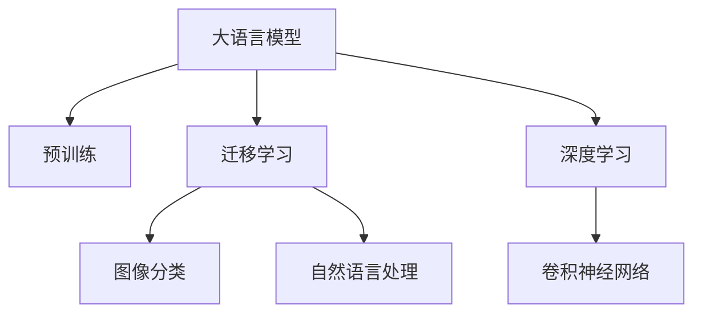

                 

# LLM在图像分类任务中的技术进展

> 关键词：大语言模型, 图像分类, 自然语言处理, 迁移学习, 深度学习, 卷积神经网络

## 1. 背景介绍

### 1.1 问题由来
在过去的十年中，深度学习技术迅速发展，尤其是在计算机视觉领域，卷积神经网络（CNN）因其出色的图像分类能力成为了标准的解决方案。然而，传统的CNN模型高度依赖于手动设计的特征提取器，难以适应新的、复杂的视觉任务，且在训练过程中需要大量数据和计算资源。

大语言模型（Large Language Models, LLMs），如GPT和BERT，最初主要用于自然语言处理任务，通过在大规模无标签文本语料上预训练，学习到丰富的语言表示。近年来，研究人员开始探索将LLMs应用于计算机视觉领域，特别是图像分类任务，发现其在处理复杂视觉语义时，相较于传统CNN模型有更好的泛化能力。

### 1.2 问题核心关键点
LLM在图像分类任务中的技术进展主要集中在以下几个方面：

- 大语言模型能否有效提取图像特征，实现图像分类任务？
- 大语言模型在图像分类任务中的迁移学习能力如何？
- 基于大语言模型的图像分类方法是否具有高效、通用、低成本的特点？
- 大语言模型在图像分类中存在哪些挑战和局限？

这些问题直接关系到LLM在图像分类中的实际应用价值和前景。

### 1.3 问题研究意义
研究大语言模型在图像分类任务中的应用，对于提升计算机视觉的智能水平，加速AI技术在实际场景中的落地应用，具有重要意义：

1. 降低应用开发成本。利用预训练的LLMs进行图像分类，可以显著减少从头训练所需的数据、计算和人力成本投入。
2. 提升模型效果。LLMs在处理复杂视觉语义时，能够自动学习图像特征，并在少样本条件下实现较好的性能。
3. 加速开发进度。LLMs的通用预训练特征提取能力，可以快速适配新场景，缩短开发周期。
4. 技术创新。LLMs在图像分类中的探索，推动了预训练-微调的创新研究，催生了新的迁移学习方法。
5. 产业升级。LLMs在图像分类中的成功应用，为计算机视觉技术在各行各业的数字化转型提供了新的技术路径。

## 2. 核心概念与联系

### 2.1 核心概念概述

为了更好地理解大语言模型在图像分类任务中的应用，本节将介绍几个核心概念：

- **大语言模型**：以自回归（如GPT）或自编码（如BERT）模型为代表的，在大规模无标签文本语料上预训练的语言模型。通过预训练学习到语言的通用表示，具备强大的语言理解和生成能力。
- **预训练**：指在大规模无标签文本语料上，通过自监督学习任务训练通用语言模型的过程。常见的预训练任务包括言语建模、遮挡语言模型等。
- **迁移学习**：指将一个领域学习到的知识，迁移应用到另一个不同但相关的领域的学习范式。大语言模型的预训练-微调过程即是一种典型的迁移学习方式。
- **深度学习**：一类基于人工神经网络的机器学习方法，利用数据特征表示能力，通过多层非线性变换实现复杂的模式识别任务。
- **卷积神经网络**：一种专门用于处理图像和视频数据的深度学习网络结构，通过卷积操作提取图像特征。

这些核心概念之间的逻辑关系可以通过以下Mermaid流程图来展示：



这个流程图展示了大语言模型的核心概念及其之间的关系：

1. 大语言模型通过预训练获得基础能力。
2. 迁移学习是连接预训练模型与图像分类任务的桥梁。
3. 深度学习框架（如TensorFlow, PyTorch等）为模型开发提供基础设施。
4. 卷积神经网络是深度学习中处理图像的关键模型。

这些概念共同构成了大语言模型在图像分类任务中的应用框架，使得LLMs能够通过迁移学习，利用深度学习框架，在图像分类中发挥其强大的语言理解和生成能力。

## 3. 核心算法原理 & 具体操作步骤
### 3.1 算法原理概述

大语言模型在图像分类任务中的核心思想是：利用预训练的语言知识，通过迁移学习的方式，对图像分类任务进行适应性优化。

形式化地，假设预训练模型为 $M_{\theta}$，其中 $\theta$ 为预训练得到的模型参数。给定图像分类任务 $T$ 的标注数据集 $D=\{(x_i,y_i)\}_{i=1}^N$，其中 $x_i$ 为图像数据，$y_i$ 为类别标签。微调的目标是找到新的模型参数 $\hat{\theta}$，使得：

$$
\hat{\theta}=\mathop{\arg\min}_{\theta} \mathcal{L}(M_{\theta},D)
$$

其中 $\mathcal{L}$ 为针对任务 $T$ 设计的损失函数，用于衡量模型预测输出与真实标签之间的差异。常见的损失函数包括交叉熵损失、均方误差损失等。

通过梯度下降等优化算法，微调过程不断更新模型参数 $\theta$，最小化损失函数 $\mathcal{L}$，使得模型输出逼近真实标签。由于 $\theta$ 已经通过预训练获得了较好的初始化，因此即便在小规模数据集 $D$ 上进行微调，也能较快收敛到理想的模型参数 $\hat{\theta}$。

### 3.2 算法步骤详解

基于大语言模型在图像分类任务中的迁移学习，一般包括以下几个关键步骤：

**Step 1: 准备预训练模型和数据集**
- 选择合适的预训练语言模型 $M_{\theta}$ 作为初始化参数，如 GPT、BERT 等。
- 准备图像分类任务 $T$ 的标注数据集 $D$，划分为训练集、验证集和测试集。一般要求标注数据与预训练数据的分布不要差异过大。

**Step 2: 添加任务适配层**
- 根据图像分类任务类型，在预训练模型顶层设计合适的输出层和损失函数。
- 对于分类任务，通常在顶层添加线性分类器和交叉熵损失函数。
- 对于生成任务，通常使用语言模型的解码器输出概率分布，并以负对数似然为损失函数。

**Step 3: 设置微调超参数**
- 选择合适的优化算法及其参数，如 AdamW、SGD 等，设置学习率、批大小、迭代轮数等。
- 设置正则化技术及强度，包括权重衰减、Dropout、Early Stopping 等。
- 确定冻结预训练参数的策略，如仅微调顶层，或全部参数都参与微调。

**Step 4: 执行梯度训练**
- 将训练集数据分批次输入模型，前向传播计算损失函数。
- 反向传播计算参数梯度，根据设定的优化算法和学习率更新模型参数。
- 周期性在验证集上评估模型性能，根据性能指标决定是否触发 Early Stopping。
- 重复上述步骤直到满足预设的迭代轮数或 Early Stopping 条件。

**Step 5: 测试和部署**
- 在测试集上评估微调后模型 $M_{\hat{\theta}}$ 的性能，对比微调前后的精度提升。
- 使用微调后的模型对新样本进行推理预测，集成到实际的应用系统中。
- 持续收集新的数据，定期重新微调模型，以适应数据分布的变化。

以上是基于大语言模型在图像分类任务中的迁移学习的一般流程。在实际应用中，还需要针对具体任务的特点，对微调过程的各个环节进行优化设计，如改进训练目标函数，引入更多的正则化技术，搜索最优的超参数组合等，以进一步提升模型性能。

### 3.3 算法优缺点

基于大语言模型在图像分类任务中的迁移学习方法具有以下优点：
1. 简单高效。只需准备少量标注数据，即可对预训练模型进行快速适配，获得较大的性能提升。
2. 通用适用。适用于各种计算机视觉任务，包括分类、匹配、生成等，设计简单的任务适配层即可实现微调。
3. 参数高效。利用参数高效微调技术，在固定大部分预训练参数的情况下，仍可取得不错的提升。
4. 效果显著。在学术界和工业界的诸多任务上，基于微调的方法已经刷新了最先进的性能指标。

同时，该方法也存在一定的局限性：
1. 依赖标注数据。微调的效果很大程度上取决于标注数据的质量和数量，获取高质量标注数据的成本较高。
2. 迁移能力有限。当目标任务与预训练数据的分布差异较大时，微调的性能提升有限。
3. 负面效果传递。预训练模型的固有偏见、有害信息等，可能通过微调传递到下游任务，造成负面影响。
4. 可解释性不足。微调模型的决策过程通常缺乏可解释性，难以对其推理逻辑进行分析和调试。

尽管存在这些局限性，但就目前而言，基于大语言模型的迁移学习方法是图像分类任务中最主流范式。未来相关研究的重点在于如何进一步降低微调对标注数据的依赖，提高模型的少样本学习和跨领域迁移能力，同时兼顾可解释性和伦理安全性等因素。

### 3.4 算法应用领域

基于大语言模型在图像分类任务中的迁移学习方法，在计算机视觉领域已经得到了广泛的应用，覆盖了几乎所有常见任务，例如：

- 图像分类：如物体识别、场景分类等。通过微调使模型学习图像-类别映射。
- 目标检测：检测图像中特定对象的位置和类别。通过微调使模型学习框-类别对应关系。
- 图像分割：将图像划分为不同的区域，对每个区域进行分类。通过微调使模型学习像素-类别映射。
- 图像生成：生成高质量的图像样本，如图像生成对抗网络（GAN）。通过微调使模型学习生成任务。
- 图像修复：修复损坏的图像，如去噪、超分辨率等。通过微调使模型学习修复任务。

除了上述这些经典任务外，大语言模型在图像分类中也被创新性地应用到更多场景中，如医学图像识别、遥感图像分类、汽车自动驾驶等，为计算机视觉技术带来了全新的突破。随着预训练模型和迁移学习方法的不断进步，相信计算机视觉技术将在更广阔的应用领域大放异彩。

## 4. 数学模型和公式 & 详细讲解  
### 4.1 数学模型构建

本节将使用数学语言对大语言模型在图像分类任务中的迁移学习过程进行更加严格的刻画。

记预训练语言模型为 $M_{\theta}$，其中 $\theta$ 为预训练得到的模型参数。假设微调任务的训练集为 $D=\{(x_i,y_i)\}_{i=1}^N$，其中 $x_i$ 为图像数据，$y_i$ 为类别标签。

定义模型 $M_{\theta}$ 在图像数据 $x$ 上的损失函数为 $\ell(M_{\theta}(x),y)$，则在数据集 $D$ 上的经验风险为：

$$
\mathcal{L}(\theta) = \frac{1}{N} \sum_{i=1}^N \ell(M_{\theta}(x_i),y_i)
$$

微调的优化目标是最小化经验风险，即找到最优参数：

$$
\theta^* = \mathop{\arg\min}_{\theta} \mathcal{L}(\theta)
$$

在实践中，我们通常使用基于梯度的优化算法（如SGD、Adam等）来近似求解上述最优化问题。设 $\eta$ 为学习率，$\lambda$ 为正则化系数，则参数的更新公式为：

$$
\theta \leftarrow \theta - \eta \nabla_{\theta}\mathcal{L}(\theta) - \eta\lambda\theta
$$

其中 $\nabla_{\theta}\mathcal{L}(\theta)$ 为损失函数对参数 $\theta$ 的梯度，可通过反向传播算法高效计算。

### 4.2 公式推导过程

以下我们以图像分类任务为例，推导交叉熵损失函数及其梯度的计算公式。

假设模型 $M_{\theta}$ 在输入 $x$ 上的输出为 $\hat{y}=M_{\theta}(x) \in [0,1]$，表示样本属于正类的概率。真实标签 $y \in \{0,1\}$。则二分类交叉熵损失函数定义为：

$$
\ell(M_{\theta}(x),y) = -[y\log \hat{y} + (1-y)\log (1-\hat{y})]
$$

将其代入经验风险公式，得：

$$
\mathcal{L}(\theta) = -\frac{1}{N}\sum_{i=1}^N [y_i\log M_{\theta}(x_i)+(1-y_i)\log(1-M_{\theta}(x_i))]
$$

根据链式法则，损失函数对参数 $\theta_k$ 的梯度为：

$$
\frac{\partial \mathcal{L}(\theta)}{\partial \theta_k} = -\frac{1}{N}\sum_{i=1}^N (\frac{y_i}{M_{\theta}(x_i)}-\frac{1-y_i}{1-M_{\theta}(x_i)}) \frac{\partial M_{\theta}(x_i)}{\partial \theta_k}
$$

其中 $\frac{\partial M_{\theta}(x_i)}{\partial \theta_k}$ 可进一步递归展开，利用自动微分技术完成计算。

在得到损失函数的梯度后，即可带入参数更新公式，完成模型的迭代优化。重复上述过程直至收敛，最终得到适应下游任务的最优模型参数 $\theta^*$。

## 5. 项目实践：代码实例和详细解释说明
### 5.1 开发环境搭建

在进行迁移学习实践前，我们需要准备好开发环境。以下是使用Python进行PyTorch开发的环境配置流程：

1. 安装Anaconda：从官网下载并安装Anaconda，用于创建独立的Python环境。

2. 创建并激活虚拟环境：
```bash
conda create -n pytorch-env python=3.8 
conda activate pytorch-env
```

3. 安装PyTorch：根据CUDA版本，从官网获取对应的安装命令。例如：
```bash
conda install pytorch torchvision torchaudio cudatoolkit=11.1 -c pytorch -c conda-forge
```

4. 安装Transformers库：
```bash
pip install transformers
```

5. 安装各类工具包：
```bash
pip install numpy pandas scikit-learn matplotlib tqdm jupyter notebook ipython
```

完成上述步骤后，即可在`pytorch-env`环境中开始迁移学习实践。

### 5.2 源代码详细实现

下面我以图像分类任务为例，给出使用Transformers库对BERT模型进行迁移学习的PyTorch代码实现。

首先，定义图像分类任务的数据处理函数：

```python
from transformers import BertTokenizer
from torch.utils.data import Dataset
import torch

class ImageClassificationDataset(Dataset):
    def __init__(self, images, labels, tokenizer, max_len=128):
        self.images = images
        self.labels = labels
        self.tokenizer = tokenizer
        self.max_len = max_len
        
    def __len__(self):
        return len(self.images)
    
    def __getitem__(self, item):
        image = self.images[item]
        label = self.labels[item]
        
        # 将图像数据转换为Tensor
        image_tensor = torch.tensor(image, dtype=torch.float)
        
        # 对文本描述进行分词编码
        encoding = self.tokenizer(image, return_tensors='pt', max_length=self.max_len, padding='max_length', truncation=True)
        input_ids = encoding['input_ids'][0]
        attention_mask = encoding['attention_mask'][0]
        
        # 对标签进行编码
        encoded_labels = [label2id[label]] 
        encoded_labels.extend([label2id['O']] * (self.max_len - len(encoded_labels)))
        labels = torch.tensor(encoded_labels, dtype=torch.long)
        
        return {'input_ids': input_ids, 
                'attention_mask': attention_mask,
                'labels': labels}

# 标签与id的映射
label2id = {'0': 0, '1': 1, '2': 2, '3': 3, '4': 4}
id2label = {v: k for k, v in label2id.items()}

# 创建dataset
tokenizer = BertTokenizer.from_pretrained('bert-base-cased')

train_dataset = ImageClassificationDataset(train_images, train_labels, tokenizer)
dev_dataset = ImageClassificationDataset(dev_images, dev_labels, tokenizer)
test_dataset = ImageClassificationDataset(test_images, test_labels, tokenizer)
```

然后，定义模型和优化器：

```python
from transformers import BertForTokenClassification, AdamW

model = BertForTokenClassification.from_pretrained('bert-base-cased', num_labels=len(label2id))

optimizer = AdamW(model.parameters(), lr=2e-5)
```

接着，定义训练和评估函数：

```python
from torch.utils.data import DataLoader
from tqdm import tqdm
from sklearn.metrics import classification_report

device = torch.device('cuda') if torch.cuda.is_available() else torch.device('cpu')
model.to(device)

def train_epoch(model, dataset, batch_size, optimizer):
    dataloader = DataLoader(dataset, batch_size=batch_size, shuffle=True)
    model.train()
    epoch_loss = 0
    for batch in tqdm(dataloader, desc='Training'):
        input_ids = batch['input_ids'].to(device)
        attention_mask = batch['attention_mask'].to(device)
        labels = batch['labels'].to(device)
        model.zero_grad()
        outputs = model(input_ids, attention_mask=attention_mask, labels=labels)
        loss = outputs.loss
        epoch_loss += loss.item()
        loss.backward()
        optimizer.step()
    return epoch_loss / len(dataloader)

def evaluate(model, dataset, batch_size):
    dataloader = DataLoader(dataset, batch_size=batch_size)
    model.eval()
    preds, labels = [], []
    with torch.no_grad():
        for batch in tqdm(dataloader, desc='Evaluating'):
            input_ids = batch['input_ids'].to(device)
            attention_mask = batch['attention_mask'].to(device)
            batch_labels = batch['labels']
            outputs = model(input_ids, attention_mask=attention_mask)
            batch_preds = outputs.logits.argmax(dim=2).to('cpu').tolist()
            batch_labels = batch_labels.to('cpu').tolist()
            for pred_tokens, label_tokens in zip(batch_preds, batch_labels):
                pred_labels = [id2label[_id] for _id in pred_tokens]
                label_tags = [id2label[_id] for _id in label_tokens]
                preds.append(pred_labels[:len(label_tags)])
                labels.append(label_tags)
                
    print(classification_report(labels, preds))
```

最后，启动训练流程并在测试集上评估：

```python
epochs = 5
batch_size = 16

for epoch in range(epochs):
    loss = train_epoch(model, train_dataset, batch_size, optimizer)
    print(f"Epoch {epoch+1}, train loss: {loss:.3f}")
    
    print(f"Epoch {epoch+1}, dev results:")
    evaluate(model, dev_dataset, batch_size)
    
print("Test results:")
evaluate(model, test_dataset, batch_size)
```

以上就是使用PyTorch对BERT模型进行图像分类任务迁移学习的完整代码实现。可以看到，得益于Transformers库的强大封装，我们可以用相对简洁的代码完成BERT模型的迁移学习。

### 5.3 代码解读与分析

让我们再详细解读一下关键代码的实现细节：

**ImageClassificationDataset类**：
- `__init__`方法：初始化图像、标签、分词器等关键组件。
- `__len__`方法：返回数据集的样本数量。
- `__getitem__`方法：对单个样本进行处理，将图像数据转换为Tensor，对文本描述进行分词编码，并对其进行定长padding，最终返回模型所需的输入。

**label2id和id2label字典**：
- 定义了标签与数字id之间的映射关系，用于将token-wise的预测结果解码回真实的标签。

**训练和评估函数**：
- 使用PyTorch的DataLoader对数据集进行批次化加载，供模型训练和推理使用。
- 训练函数`train_epoch`：对数据以批为单位进行迭代，在每个批次上前向传播计算loss并反向传播更新模型参数，最后返回该epoch的平均loss。
- 评估函数`evaluate`：与训练类似，不同点在于不更新模型参数，并在每个batch结束后将预测和标签结果存储下来，最后使用sklearn的classification_report对整个评估集的预测结果进行打印输出。

**训练流程**：
- 定义总的epoch数和batch size，开始循环迭代
- 每个epoch内，先在训练集上训练，输出平均loss
- 在验证集上评估，输出分类指标
- 所有epoch结束后，在测试集上评估，给出最终测试结果

可以看到，PyTorch配合Transformers库使得BERT迁移学习的代码实现变得简洁高效。开发者可以将更多精力放在数据处理、模型改进等高层逻辑上，而不必过多关注底层的实现细节。

当然，工业级的系统实现还需考虑更多因素，如模型的保存和部署、超参数的自动搜索、更灵活的任务适配层等。但核心的迁移学习范式基本与此类似。

## 6. 实际应用场景
### 6.1 智能医疗系统

基于大语言模型迁移学习的方法，可以在智能医疗系统中实现高效、准确的图像分类和识别。传统医疗诊断依赖医生手动分析影像，耗时长、误差高。而使用迁移学习模型，可以自动分析X光片、CT影像、MRI等医学图像，快速识别病变位置和类型。

在技术实现上，可以收集大量的医学影像和对应的标注数据，训练迁移学习模型。模型能够自动学习医学图像中的关键特征，识别出病灶、病理性变化等。对于新来的医学影像，可以实时输入模型进行分类，辅助医生快速做出诊断决策。

### 6.2 工业制造质量检测

在工业生产中，产品质量检测是关键环节，但传统方式往往依赖人工肉眼判断，效率低、误差大。基于大语言模型迁移学习的图像分类方法，可以快速实现高精度的质量检测。

具体而言，可以采集不同产品的图像数据，并对其进行标注。将标注数据作为监督信号，训练迁移学习模型。模型能够自动学习产品的正常和异常特征，对新来的产品图像进行分类。对于未见过的产品，模型也能通过迁移学习获得良好的泛化能力，实现有效的质量检测。

### 6.3 农业病虫害识别

在农业领域，病虫害识别是保障农作物健康的重要手段。传统的病虫害识别依赖专家经验，效率低、成本高。利用大语言模型迁移学习，可以在图像分类基础上，快速识别多种病虫害，减少人力投入。

在实际应用中，可以收集大量带标签的病虫害图像数据，训练迁移学习模型。模型能够自动学习病虫害的特征，对新来的图像进行分类。对于新出现的病虫害，模型也能通过迁移学习快速适应，实现准确的识别和预警。

### 6.4 未来应用展望

随着大语言模型迁移学习技术的不断发展，其在计算机视觉领域的应用前景将更加广阔。未来，大语言模型在图像分类中的技术进展可能包括：

1. 超大规模模型的应用。随着算力成本的下降和数据规模的扩张，预训练语言模型和迁移学习模型的参数量将进一步增大，提升模型在复杂视觉语义处理中的能力。

2. 迁移学习方法的改进。未来将涌现更多参数高效、计算高效的迁移学习方法，如Parameter-Efficient Transfer Learning等，在固定大部分预训练参数的情况下，仍可取得不错的迁移效果。

3. 知识整合能力的增强。将符号化的先验知识，如知识图谱、逻辑规则等，与神经网络模型进行巧妙融合，引导迁移学习过程学习更准确、合理的图像特征表示。

4. 多模态信息的融合。将视觉、语音、文本等多种模态的信息进行整合，实现更全面、准确、鲁棒的图像分类和识别。

5. 模型的实时化部署。通过优化模型结构和计算图，提升模型推理速度，实现模型的实时化部署。

6. 知识导向的迁移学习。结合因果分析和博弈论工具，建立更稳定的因果关系，引导迁移学习过程学习更合理的图像特征表示。

这些发展趋势将进一步推动大语言模型在图像分类任务中的应用，提升计算机视觉系统的智能化水平。随着技术的不断进步，相信大语言模型迁移学习必将在更多的领域大放异彩，为数字化转型提供新的技术路径。

## 7. 工具和资源推荐
### 7.1 学习资源推荐

为了帮助开发者系统掌握大语言模型在图像分类任务中的应用，这里推荐一些优质的学习资源：

1. 《Transformer from the ground up》系列博文：由大模型技术专家撰写，深入浅出地介绍了Transformer原理、BERT模型、迁移学习技术等前沿话题。

2. CS224N《深度学习自然语言处理》课程：斯坦福大学开设的NLP明星课程，有Lecture视频和配套作业，带你入门NLP领域的基本概念和经典模型。

3. 《Natural Language Processing with Transformers》书籍：Transformers库的作者所著，全面介绍了如何使用Transformers库进行NLP任务开发，包括迁移学习在内的诸多范式。

4. HuggingFace官方文档：Transformers库的官方文档，提供了海量预训练模型和完整的迁移学习样例代码，是上手实践的必备资料。

5. CLUE开源项目：中文语言理解测评基准，涵盖大量不同类型的中文NLP数据集，并提供了基于迁移学习的baseline模型，助力中文NLP技术发展。

通过对这些资源的学习实践，相信你一定能够快速掌握大语言模型在图像分类中的精髓，并用于解决实际的计算机视觉问题。
###  7.2 开发工具推荐

高效的开发离不开优秀的工具支持。以下是几款用于大语言模型迁移学习开发的常用工具：

1. PyTorch：基于Python的开源深度学习框架，灵活动态的计算图，适合快速迭代研究。大部分预训练语言模型都有PyTorch版本的实现。

2. TensorFlow：由Google主导开发的开源深度学习框架，生产部署方便，适合大规模工程应用。同样有丰富的预训练语言模型资源。

3. Transformers库：HuggingFace开发的NLP工具库，集成了众多SOTA语言模型，支持PyTorch和TensorFlow，是进行迁移学习任务开发的利器。

4. Weights & Biases：模型训练的实验跟踪工具，可以记录和可视化模型训练过程中的各项指标，方便对比和调优。与主流深度学习框架无缝集成。

5. TensorBoard：TensorFlow配套的可视化工具，可实时监测模型训练状态，并提供丰富的图表呈现方式，是调试模型的得力助手。

6. Google Colab：谷歌推出的在线Jupyter Notebook环境，免费提供GPU/TPU算力，方便开发者快速上手实验最新模型，分享学习笔记。

合理利用这些工具，可以显著提升大语言模型迁移学习的开发效率，加快创新迭代的步伐。

### 7.3 相关论文推荐

大语言模型和迁移学习的发展源于学界的持续研究。以下是几篇奠基性的相关论文，推荐阅读：

1. Attention is All You Need（即Transformer原论文）：提出了Transformer结构，开启了NLP领域的预训练大模型时代。

2. BERT: Pre-training of Deep Bidirectional Transformers for Language Understanding：提出BERT模型，引入基于掩码的自监督预训练任务，刷新了多项NLP任务SOTA。

3. Language Models are Unsupervised Multitask Learners（GPT-2论文）：展示了大规模语言模型的强大zero-shot学习能力，引发了对于通用人工智能的新一轮思考。

4. Parameter-Efficient Transfer Learning for NLP：提出Adapter等参数高效微调方法，在不增加模型参数量的情况下，也能取得不错的迁移效果。

5. Prefix-Tuning: Optimizing Continuous Prompts for Generation：引入基于连续型Prompt的迁移学习范式，为如何充分利用预训练知识提供了新的思路。

6. AdaLoRA: Adaptive Low-Rank Adaptation for Parameter-Efficient Fine-Tuning：使用自适应低秩适应的迁移方法，在参数效率和精度之间取得了新的平衡。

这些论文代表了大语言模型迁移学习的发展脉络。通过学习这些前沿成果，可以帮助研究者把握学科前进方向，激发更多的创新灵感。

## 8. 总结：未来发展趋势与挑战
### 8.1 总结

本文对大语言模型在图像分类任务中的迁移学习方法进行了全面系统的介绍。首先阐述了大语言模型和迁移学习的研究背景和意义，明确了迁移学习在拓展预训练模型应用、提升计算机视觉任务性能方面的独特价值。其次，从原理到实践，详细讲解了迁移学习的数学原理和关键步骤，给出了迁移学习任务开发的完整代码实例。同时，本文还广泛探讨了迁移学习在智能医疗、工业制造、农业病虫害等领域的实际应用前景，展示了迁移学习范式的巨大潜力。此外，本文精选了迁移学习的各类学习资源，力求为读者提供全方位的技术指引。

通过本文的系统梳理，可以看到，基于大语言模型的迁移学习方法正在成为计算机视觉领域的重要范式，极大地拓展了预训练语言模型的应用边界，催生了更多的落地场景。得益于大规模语料的预训练和迁移学习的微调，大语言模型在图像分类中表现出强大的泛化能力和通用性，有望为计算机视觉技术带来全新的突破。未来，伴随预训练语言模型和迁移学习方法的不断进步，相信计算机视觉技术将在更广阔的应用领域大放异彩。

### 8.2 未来发展趋势

展望未来，大语言模型在图像分类任务中的迁移学习技术将呈现以下几个发展趋势：

1. 超大规模模型的应用。随着算力成本的下降和数据规模的扩张，预训练语言模型和迁移学习模型的参数量将进一步增大，提升模型在复杂视觉语义处理中的能力。

2. 迁移学习方法的改进。未来将涌现更多参数高效、计算高效的迁移学习方法，如Parameter-Efficient Transfer Learning等，在固定大部分预训练参数的情况下，仍可取得不错的迁移效果。

3. 知识整合能力的增强。将符号化的先验知识，如知识图谱、逻辑规则等，与神经网络模型进行巧妙融合，引导迁移学习过程学习更准确、合理的图像特征表示。

4. 多模态信息的融合。将视觉、语音、文本等多种模态的信息进行整合，实现更全面、准确、鲁棒的图像分类和识别。

5. 模型的实时化部署。通过优化模型结构和计算图，提升模型推理速度，实现模型的实时化部署。

6. 知识导向的迁移学习。结合因果分析和博弈论工具，建立更稳定的因果关系，引导迁移学习过程学习更合理的图像特征表示。

这些趋势凸显了大语言模型在图像分类中的广泛应用前景。这些方向的探索发展，必将进一步提升计算机视觉系统的性能和应用范围，为数字化转型提供新的技术路径。

### 8.3 面临的挑战

尽管大语言模型在图像分类任务中的迁移学习方法已经取得了显著进展，但在迈向更加智能化、普适化应用的过程中，仍面临以下挑战：

1. 数据质量问题。迁移学习的效果很大程度上取决于标注数据的质量和数量，获取高质量标注数据的成本较高。如何进一步降低迁移学习对标注样本的依赖，将是一大难题。

2. 模型鲁棒性不足。当前迁移模型面对域外数据时，泛化性能往往大打折扣。对于测试样本的微小扰动，迁移模型的预测也容易发生波动。如何提高迁移模型的鲁棒性，避免灾难性遗忘，还需要更多理论和实践的积累。

3. 推理效率有待提高。大规模迁移模型虽然精度高，但在实际部署时往往面临推理速度慢、内存占用大等效率问题。如何在保证性能的同时，简化模型结构，提升推理速度，优化资源占用，将是重要的优化方向。

4. 可解释性亟需加强。当前迁移模型的决策过程通常缺乏可解释性，难以对其推理逻辑进行分析和调试。对于医疗、金融等高风险应用，算法的可解释性和可审计性尤为重要。如何赋予迁移模型更强的可解释性，将是亟待攻克的难题。

5. 安全性有待保障。迁移模型中可能学习到有偏见、有害的信息，通过迁移学习传递到下游任务，产生误导性、歧视性的输出，给实际应用带来安全隐患。如何从数据和算法层面消除模型偏见，避免恶意用途，确保输出的安全性，也将是重要的研究课题。

6. 知识整合能力不足。现有的迁移模型往往局限于任务内数据，难以灵活吸收和运用更广泛的先验知识。如何让迁移过程更好地与外部知识库、规则库等专家知识结合，形成更加全面、准确的信息整合能力，还有很大的想象空间。

正视迁移学习面临的这些挑战，积极应对并寻求突破，将是大语言模型迁移学习走向成熟的必由之路。相信随着学界和产业界的共同努力，这些挑战终将一一被克服，大语言模型迁移学习必将在构建人机协同的智能系统中有更广阔的应用前景。

### 8.4 研究展望

面向未来，大语言模型迁移学习技术需要在以下几个方面寻求新的突破：

1. 探索无监督和半监督迁移方法。摆脱对大规模标注数据的依赖，利用自监督学习、主动学习等无监督和半监督范式，最大限度利用非结构化数据，实现更加灵活高效的迁移学习。

2. 研究参数高效和计算高效的迁移范式。开发更加参数高效的迁移方法，在固定大部分预训练参数的同时，只更新极少量的任务相关参数。同时优化迁移模型的计算图，减少前向传播和反向传播的资源消耗，实现更加轻量级、实时性的部署。

3. 引入更多先验知识。将符号化的先验知识，如知识图谱、逻辑规则等，与神经网络模型进行巧妙融合，引导迁移学习过程学习更准确、合理的图像特征表示。同时加强不同模态数据的整合，实现视觉、语音等多模态信息与文本信息的协同建模。

4. 结合因果分析和博弈论工具。将因果分析方法引入迁移模型，识别出模型决策的关键特征，增强输出解释的因果性和逻辑性。借助博弈论工具刻画人机交互过程，主动探索并规避模型的脆弱点，提高系统稳定性。

5. 纳入伦理道德约束。在迁移学习目标中引入伦理导向的评估指标，过滤和惩罚有偏见、有害的输出倾向。同时加强人工干预和审核，建立模型行为的监管机制，确保输出符合人类价值观和伦理道德。

这些研究方向的探索，必将引领大语言模型迁移学习技术迈向更高的台阶，为构建安全、可靠、可解释、可控的智能系统铺平道路。面向未来，大语言模型迁移学习技术还需要与其他人工智能技术进行更深入的融合，如知识表示、因果推理、强化学习等，多路径协同发力，共同推动自然语言理解和智能交互系统的进步。只有勇于创新、敢于突破，才能不断拓展语言模型的边界，让智能技术更好地造福人类社会。

## 9. 附录：常见问题与解答

**Q1：大语言模型在图像分类任务中的迁移学习方法是否适用于所有计算机视觉任务？**

A: 大语言模型在图像分类任务中的迁移学习方法可以应用于许多计算机视觉任务，包括分类、检测、分割等。但对于一些特定领域的任务，如医学、法律等，仍然需要进一步在特定领域语料上预训练，并在迁移学习中进行微调，以获得更好的效果。此外，对于一些需要时效性、个性化很强的任务，如动态场景监控、智能推荐等，迁移学习方法也需要针对性的改进优化。

**Q2：如何选择合适的迁移学习超参数？**

A: 迁移学习中，超参数的选择对模型性能影响较大。常见的迁移学习超参数包括学习率、批次大小、迭代轮数等。一般来说，初始学习率可以适当较小，避免破坏预训练权重。批次大小需要根据计算资源进行调整，一般在16到64之间。迭代轮数则根据模型收敛情况来决定，一般可以设置较多轮数。此外，还有一些正则化技术如L2正则、Dropout等，也需要根据具体任务进行调试。

**Q3：迁移学习过程中如何避免过拟合？**

A: 避免过拟合是迁移学习中的重要问题。常见的缓解策略包括数据增强、正则化、早停等。数据增强可以通过旋转、缩放、翻转等方式扩充训练集，提高模型的泛化能力。正则化可以通过L2正则、Dropout等方式，避免模型过度适应小规模训练集。早停则可以在验证集上监控模型性能，一旦性能不再提升，立即停止训练，避免过拟合。

**Q4：迁移学习模型在落地部署时需要注意哪些问题？**

A: 将迁移学习模型转化为实际应用，还需要考虑以下因素：
1. 模型裁剪：去除不必要的层和参数，减小模型尺寸，加快推理速度
2. 量化加速：将浮点模型转为定点模型，压缩存储空间，提高计算效率
3. 服务化封装：将模型封装为标准化服务接口，便于集成调用
4. 弹性伸缩：根据请求流量动态调整资源配置，平衡服务质量和成本
5. 监控告警：实时采集系统指标，设置异常告警阈值，确保服务稳定性
6. 安全防护：采用访问鉴权、数据脱敏等措施，保障数据和模型安全

大语言模型迁移学习为计算机视觉应用开启了广阔的想象空间，但如何将强大的性能转化为稳定、高效、安全的业务价值，还需要工程实践的不断打磨。唯有从数据、算法、工程、业务等多个维度协同发力，才能真正实现人工智能技术在垂直行业的规模化落地。总之，迁移学习需要开发者根据具体任务，不断迭代和优化模型、数据和算法，方能得到理想的效果。

---

作者：禅与计算机程序设计艺术 / Zen and the Art of Computer Programming

