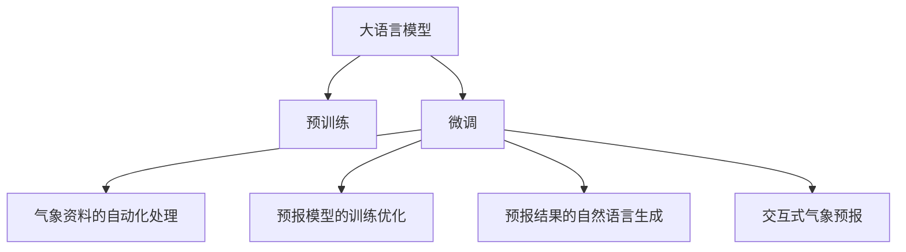

                 

# LLM在智能气象预报中的潜在作用

## 1. 背景介绍

### 1.1 问题由来

气象预报对于农业生产、灾害预警、气候变化研究等领域具有重要意义，是气象部门的核心业务。传统的气象预报主要依靠气象卫星、地面观测站和数值模型等手段，通过复杂的数据处理和计算，得出预报结果。随着人工智能技术的发展，越来越多的气象预报开始应用机器学习模型，包括深度学习模型在内的诸多新兴技术，逐渐显现出其潜力。

尤其是近年来，大规模语言模型(Large Language Model, LLM)的兴起，其在自然语言处理领域取得了突破性进展，使得其在气象预报中的应用成为可能。借助大语言模型强大的自然语言理解和生成能力，可以有效提升气象预报的准确性和效率。

### 1.2 问题核心关键点

大语言模型在气象预报中主要应用于以下几个方面：

- **气象资料的自动化处理**：利用大语言模型的预训练能力，从海量的气象数据中自动抽取关键信息，生成气象报告和预报文本。
- **预报模型的训练优化**：通过微调和微结构设计，优化气象预报模型，提高预报准确性和模型泛化能力。
- **预报结果的自然语言生成**：利用大语言模型生成预报结果的文本形式，方便用户理解和应用。
- **交互式气象预报**：通过自然语言交互界面，让用户能够直接查询、更新和生成气象预报信息。

## 2. 核心概念与联系

### 2.1 核心概念概述

为更好地理解LLM在气象预报中的应用，本节将介绍几个核心概念：

- 大语言模型(Large Language Model, LLM)：以自回归(如GPT)或自编码(如BERT)模型为代表的大规模预训练语言模型。通过在大规模无标签文本语料上进行预训练，学习通用的语言表示，具备强大的语言理解和生成能力。

- 预训练(Pre-training)：指在大规模无标签文本语料上，通过自监督学习任务训练通用语言模型的过程。常见的预训练任务包括言语建模、遮挡语言模型等。

- 微调(Fine-tuning)：指在预训练模型的基础上，使用下游任务的少量标注数据，通过有监督学习优化模型在特定任务上的性能。通常只需要调整顶层分类器或解码器，并以较小的学习率更新全部或部分的模型参数。

- 气象资料：气象部门通过卫星、雷达、地面观测站等手段收集的各种气象数据，如温度、湿度、风速、降雨量等。

- 预报模型：用于预测未来气象情况的数学模型，包括统计模型、物理模型和机器学习模型等。

- 智能气象预报：通过应用人工智能技术，提高气象预报的自动化水平和预测准确性。

- 气象报告：基于气象资料生成的文本形式的气象信息，包括天气状况、温度预测、风力等级等。

这些核心概念之间的逻辑关系可以通过以下Mermaid流程图来展示：



这个流程图展示了大语言模型的核心概念及其之间的关系：

1. 大语言模型通过预训练获得基础能力。
2. 微调是对预训练模型进行任务特定的优化，可以为气象预报提供更精准的预测能力。
3. 自动化处理、模型训练、结果生成、交互式预报等任务，都可以通过微调后的模型进行优化提升。

## 3. 核心算法原理 & 具体操作步骤
### 3.1 算法原理概述

大语言模型在气象预报中的应用，本质上是通过预训练-微调范式，将大语言模型的通用语言表示，迁移应用到气象领域的特定任务上，实现气象资料的自动化处理、预报模型的训练优化和预报结果的自然语言生成。

具体而言，假设预训练语言模型为 $M_{\theta}$，其中 $\theta$ 为预训练得到的模型参数。气象资料 $D_{\text{data}}=\{(x_i, y_i)\}_{i=1}^N$，其中 $x_i$ 为气象数据，$y_i$ 为标签信息（如未来温度、降水量等）。微调的目标是找到新的模型参数 $\hat{\theta}$，使得：

$$
\hat{\theta}=\mathop{\arg\min}_{\theta} \mathcal{L}(M_{\theta},D_{\text{data}})
$$

其中 $\mathcal{L}$ 为针对气象预报任务设计的损失函数，用于衡量模型预测输出与真实标签之间的差异。常见的损失函数包括均方误差损失、交叉熵损失等。

通过梯度下降等优化算法，微调过程不断更新模型参数 $\theta$，最小化损失函数 $\mathcal{L}$，使得模型输出逼近真实标签。由于 $\theta$ 已经通过预训练获得了较好的初始化，因此即便在小规模气象数据集 $D_{\text{data}}$ 上进行微调，也能较快收敛到理想的模型参数 $\hat{\theta}$。

### 3.2 算法步骤详解

基于预训练-微调的大语言模型在气象预报中的应用，一般包括以下几个关键步骤：

**Step 1: 准备预训练模型和数据集**
- 选择合适的预训练语言模型 $M_{\theta}$ 作为初始化参数，如 BERT、GPT等。
- 准备气象预报任务的训练集 $D_{\text{train}}=\{(x_i, y_i)\}_{i=1}^N$，其中 $x_i$ 为气象数据，$y_i$ 为标签信息。

**Step 2: 添加任务适配层**
- 根据任务类型，在预训练模型顶层设计合适的输出层和损失函数。
- 对于分类任务，通常在顶层添加线性分类器和交叉熵损失函数。
- 对于回归任务，通常使用均方误差损失函数。

**Step 3: 设置微调超参数**
- 选择合适的优化算法及其参数，如 AdamW、SGD 等，设置学习率、批大小、迭代轮数等。
- 设置正则化技术及强度，包括权重衰减、Dropout、Early Stopping等。
- 确定冻结预训练参数的策略，如仅微调顶层，或全部参数都参与微调。

**Step 4: 执行梯度训练**
- 将气象资料数据分批次输入模型，前向传播计算损失函数。
- 反向传播计算参数梯度，根据设定的优化算法和学习率更新模型参数。
- 周期性在验证集上评估模型性能，根据性能指标决定是否触发 Early Stopping。
- 重复上述步骤直到满足预设的迭代轮数或 Early Stopping 条件。

**Step 5: 测试和部署**
- 在气象预报任务的测试集上评估微调后模型 $M_{\hat{\theta}}$ 的性能，对比微调前后的精度提升。
- 使用微调后的模型对新气象资料进行推理预测，集成到实际的应用系统中。
- 持续收集新的气象资料，定期重新微调模型，以适应气象数据分布的变化。

以上是基于预训练-微调的大语言模型在气象预报中的应用流程。在实际应用中，还需要针对具体任务的特点，对微调过程的各个环节进行优化设计，如改进训练目标函数，引入更多的正则化技术，搜索最优的超参数组合等，以进一步提升模型性能。

### 3.3 算法优缺点

大语言模型在气象预报中的应用，具有以下优点：

1. **高效处理海量数据**：大语言模型可以从海量的气象资料中自动抽取关键信息，生成气象报告和预报文本，有效提升了数据处理效率。
2. **泛化能力强**：预训练模型已经学习到了通用的语言表示，具有一定的泛化能力，可以在多种气象条件下进行预报。
3. **生成能力优异**：大语言模型可以生成自然流畅的气象预报文本，方便用户理解和应用。
4. **灵活性强**：可以通过微调和优化设计，适应不同的气象预报任务。

同时，该方法也存在一定的局限性：

1. **数据质量要求高**：气象预报任务对数据质量的要求较高，数据缺失、异常等问题会对预报结果产生影响。
2. **模型参数量大**：大语言模型的参数量较大，对计算资源的要求较高。
3. **微调效果依赖数据量**：微调效果依赖于气象资料的数量和质量，对于小规模数据集可能难以取得理想效果。
4. **模型复杂度高**：大语言模型通常包含多个层，结构复杂，推理计算量大。

尽管存在这些局限性，但就目前而言，基于预训练-微调的大语言模型在气象预报中的应用仍是一种高效、灵活、具有潜力的技术手段。未来相关研究的重点在于如何进一步降低模型对数据量的依赖，提高模型的泛化能力，同时兼顾可解释性和伦理安全性等因素。

### 3.4 算法应用领域

基于大语言模型微调的气象预报方法，已经在气象领域得到了初步应用，例如：

- 实时天气预报：利用微调模型对实时气象资料进行分析和生成，提供精准的天气预测信息。
- 天气预警系统：通过微调模型对气象数据进行深度学习，提前预测灾害性天气，提供预警信息。
- 气象灾害评估：使用微调模型对气象数据进行模拟和预测，评估潜在气象灾害的影响范围和严重程度。
- 气象服务应用：将微调模型集成到气象服务系统中，提供定制化的气象信息服务。

除了上述这些经典应用外，大语言模型在气象预报中的应用还可以进一步拓展到天气变化预测、气候变化研究、气象资源管理等领域，为气象业务的智能化转型提供新的技术支撑。

## 4. 数学模型和公式 & 详细讲解  
### 4.1 数学模型构建

本节将使用数学语言对基于预训练-微调的大语言模型在气象预报中的应用过程进行更加严格的刻画。

记预训练语言模型为 $M_{\theta}$，其中 $\theta$ 为预训练得到的模型参数。气象预报任务的训练集为 $D_{\text{data}}=\{(x_i, y_i)\}_{i=1}^N, x_i \in \mathcal{X}, y_i \in \mathcal{Y}$，其中 $\mathcal{X}$ 为气象数据空间，$\mathcal{Y}$ 为标签空间。

定义模型 $M_{\theta}$ 在气象资料 $x$ 上的损失函数为 $\ell(M_{\theta}(x),y)$，则在数据集 $D_{\text{data}}$ 上的经验风险为：

$$
\mathcal{L}(\theta) = \frac{1}{N}\sum_{i=1}^N \ell(M_{\theta}(x_i),y_i)
$$

微调的优化目标是最小化经验风险，即找到最优参数：

$$
\theta^* = \mathop{\arg\min}_{\theta} \mathcal{L}(\theta)
$$

在实践中，我们通常使用基于梯度的优化算法（如SGD、Adam等）来近似求解上述最优化问题。设 $\eta$ 为学习率，$\lambda$ 为正则化系数，则参数的更新公式为：

$$
\theta \leftarrow \theta - \eta \nabla_{\theta}\mathcal{L}(\theta) - \eta\lambda\theta
$$

其中 $\nabla_{\theta}\mathcal{L}(\theta)$ 为损失函数对参数 $\theta$ 的梯度，可通过反向传播算法高效计算。

### 4.2 公式推导过程

以下我们以温度预测任务为例，推导均方误差损失函数及其梯度的计算公式。

假设模型 $M_{\theta}$ 在输入 $x$ 上的输出为 $\hat{y}=M_{\theta}(x)$，表示预测温度。真实标签 $y \in \mathbb{R}$。则均方误差损失函数定义为：

$$
\ell(M_{\theta}(x),y) = \frac{1}{2}(y-\hat{y})^2
$$

将其代入经验风险公式，得：

$$
\mathcal{L}(\theta) = \frac{1}{2N}\sum_{i=1}^N (y_i-\hat{y}_i)^2
$$

根据链式法则，损失函数对参数 $\theta_k$ 的梯度为：

$$
\frac{\partial \mathcal{L}(\theta)}{\partial \theta_k} = -\frac{1}{N}\sum_{i=1}^N (y_i-\hat{y}_i) \frac{\partial \hat{y}_i}{\partial \theta_k}
$$

其中 $\frac{\partial \hat{y}_i}{\partial \theta_k}$ 可进一步递归展开，利用自动微分技术完成计算。

在得到损失函数的梯度后，即可带入参数更新公式，完成模型的迭代优化。重复上述过程直至收敛，最终得到适应气象预报任务的最优模型参数 $\theta^*$。

## 5. 项目实践：代码实例和详细解释说明
### 5.1 开发环境搭建

在进行气象预报微调实践前，我们需要准备好开发环境。以下是使用Python进行PyTorch开发的环境配置流程：

1. 安装Anaconda：从官网下载并安装Anaconda，用于创建独立的Python环境。

2. 创建并激活虚拟环境：
```bash
conda create -n pytorch-env python=3.8 
conda activate pytorch-env
```

3. 安装PyTorch：根据CUDA版本，从官网获取对应的安装命令。例如：
```bash
conda install pytorch torchvision torchaudio cudatoolkit=11.1 -c pytorch -c conda-forge
```

4. 安装Transformers库：
```bash
pip install transformers
```

5. 安装各类工具包：
```bash
pip install numpy pandas scikit-learn matplotlib tqdm jupyter notebook ipython
```

完成上述步骤后，即可在`pytorch-env`环境中开始微调实践。

### 5.2 源代码详细实现

下面我们以温度预测任务为例，给出使用Transformers库对BERT模型进行气象预报微调的PyTorch代码实现。

首先，定义气象资料的处理函数：

```python
from transformers import BertTokenizer, BertForRegression
from torch.utils.data import Dataset
import torch

class WeatherDataset(Dataset):
    def __init__(self, data, tokenizer, max_len=128):
        self.data = data
        self.tokenizer = tokenizer
        self.max_len = max_len
        
    def __len__(self):
        return len(self.data)
    
    def __getitem__(self, item):
        entry = self.data[item]
        text = entry['text']
        label = entry['label']
        
        encoding = self.tokenizer(text, return_tensors='pt', max_length=self.max_len, padding='max_length', truncation=True)
        input_ids = encoding['input_ids'][0]
        attention_mask = encoding['attention_mask'][0]
        
        label_tensor = torch.tensor([label], dtype=torch.float32)
        return {'input_ids': input_ids, 
                'attention_mask': attention_mask,
                'labels': label_tensor}

# 气象资料样本示例
data = [
    {'text': '晴朗,气温20度', 'label': 20},
    {'text': '多云,气温22度', 'label': 22},
    {'text': '雷雨,气温17度', 'label': 17},
    ...
]

# 创建dataset
tokenizer = BertTokenizer.from_pretrained('bert-base-uncased')

train_dataset = WeatherDataset(data[:8000], tokenizer)
dev_dataset = WeatherDataset(data[8000:10000], tokenizer)
test_dataset = WeatherDataset(data[10000:], tokenizer)
```

然后，定义模型和优化器：

```python
from transformers import AdamW

model = BertForRegression.from_pretrained('bert-base-uncased')
optimizer = AdamW(model.parameters(), lr=2e-5)
```

接着，定义训练和评估函数：

```python
from torch.utils.data import DataLoader
from tqdm import tqdm
from sklearn.metrics import mean_squared_error

device = torch.device('cuda') if torch.cuda.is_available() else torch.device('cpu')
model.to(device)

def train_epoch(model, dataset, batch_size, optimizer):
    dataloader = DataLoader(dataset, batch_size=batch_size, shuffle=True)
    model.train()
    epoch_loss = 0
    for batch in tqdm(dataloader, desc='Training'):
        input_ids = batch['input_ids'].to(device)
        attention_mask = batch['attention_mask'].to(device)
        labels = batch['labels'].to(device)
        model.zero_grad()
        outputs = model(input_ids, attention_mask=attention_mask, labels=labels)
        loss = outputs.loss
        epoch_loss += loss.item()
        loss.backward()
        optimizer.step()
    return epoch_loss / len(dataloader)

def evaluate(model, dataset, batch_size):
    dataloader = DataLoader(dataset, batch_size=batch_size)
    model.eval()
    preds, labels = [], []
    with torch.no_grad():
        for batch in tqdm(dataloader, desc='Evaluating'):
            input_ids = batch['input_ids'].to(device)
            attention_mask = batch['attention_mask'].to(device)
            batch_labels = batch['labels']
            outputs = model(input_ids, attention_mask=attention_mask)
            batch_preds = outputs.predictions.cpu().numpy().flatten()
            batch_labels = batch_labels.cpu().numpy().flatten()
            preds.extend(batch_preds)
            labels.extend(batch_labels)
            
    print(f'Mean Squared Error: {mean_squared_error(labels, preds)}')
```

最后，启动训练流程并在测试集上评估：

```python
epochs = 5
batch_size = 16

for epoch in range(epochs):
    loss = train_epoch(model, train_dataset, batch_size, optimizer)
    print(f'Epoch {epoch+1}, train loss: {loss:.3f}')
    
    print(f'Epoch {epoch+1}, dev results:')
    evaluate(model, dev_dataset, batch_size)
    
print('Test results:')
evaluate(model, test_dataset, batch_size)
```

以上就是使用PyTorch对BERT进行温度预测任务微调的完整代码实现。可以看到，得益于Transformers库的强大封装，我们可以用相对简洁的代码完成BERT模型的加载和微调。

### 5.3 代码解读与分析

让我们再详细解读一下关键代码的实现细节：

**WeatherDataset类**：
- `__init__`方法：初始化气象资料、分词器等关键组件。
- `__len__`方法：返回数据集的样本数量。
- `__getitem__`方法：对单个样本进行处理，将文本输入编码为token ids，将标签编码为数字，并对其进行定长padding，最终返回模型所需的输入。

**标签与id的映射**：
- 定义了标签与数字id之间的映射关系，用于将token-wise的预测结果解码回真实的标签。

**训练和评估函数**：
- 使用PyTorch的DataLoader对数据集进行批次化加载，供模型训练和推理使用。
- 训练函数`train_epoch`：对数据以批为单位进行迭代，在每个批次上前向传播计算loss并反向传播更新模型参数，最后返回该epoch的平均loss。
- 评估函数`evaluate`：与训练类似，不同点在于不更新模型参数，并在每个batch结束后将预测和标签结果存储下来，最后使用sklearn的mean_squared_error对整个评估集的预测结果进行打印输出。

**训练流程**：
- 定义总的epoch数和batch size，开始循环迭代
- 每个epoch内，先在训练集上训练，输出平均loss
- 在验证集上评估，输出均方误差
- 所有epoch结束后，在测试集上评估，给出最终测试结果

可以看到，PyTorch配合Transformers库使得BERT微调的代码实现变得简洁高效。开发者可以将更多精力放在数据处理、模型改进等高层逻辑上，而不必过多关注底层的实现细节。

当然，工业级的系统实现还需考虑更多因素，如模型的保存和部署、超参数的自动搜索、更灵活的任务适配层等。但核心的微调范式基本与此类似。

## 6. 实际应用场景
### 6.1 智能气象预报系统

基于大语言模型微调的气象预报技术，可以广泛应用于智能气象预报系统的构建。传统的气象预报依赖人工分析处理，流程复杂、效率低下，且难以满足实时化、个性化的需求。而使用微调后的气象预报模型，可以实现全流程自动化，快速生成气象报告，准确预测未来天气情况。

在技术实现上，可以收集历史气象数据和实时气象观测数据，作为监督数据，对预训练模型进行微调。微调后的模型能够自动处理和生成气象预报文本，包括天气状况、温度预测、风力等级等。用户可以实时查询最新气象信息，或者设定特定的查询条件，获取定制化的预报结果。

### 6.2 灾害预警与应急响应

智能气象预报系统可以集成到灾害预警与应急响应系统中，提升气象灾害防范和应对能力。通过实时监测和分析气象数据，预测可能出现的灾害性天气，提前发布预警信息，指导相关部门和公众做好防范措施。对于突发灾害事件，系统可以实时追踪气象变化，动态调整预警级别，辅助应急决策。

在具体应用中，可以将微调模型嵌入预警系统中，自动接收气象数据，进行分析和预测，生成预警信息。同时，系统可以根据历史数据和当前气象状况，生成预测报告和建议，辅助人工判断。通过这种方式，可以大大提高气象灾害预警的准确性和及时性，减少灾害损失。

### 6.3 农业气象服务

农业生产依赖于气象条件，气象预报对农业生产至关重要。基于大语言模型微调的气象预报技术，可以提供精准的气象预测信息，辅助农业生产决策。

在农业气象服务中，可以使用微调模型对农业生产区块的气象数据进行分析和预测，提供未来天气情况、种植建议、病虫害预警等信息。农民可以根据预测结果，调整种植计划、选择抗旱抗寒作物，优化农业生产过程。同时，系统可以实时监测气象变化，及时调整生产策略，确保农作物的健康生长。

### 6.4 未来应用展望

随着大语言模型和微调方法的不断发展，基于微调范式将在更多领域得到应用，为气象业务的智能化转型提供新的技术支撑。

在智慧城市治理中，智能气象预报系统可以与其他智能系统进行集成，提升城市的应急管理能力，增强公共安全保障。

在环境保护领域，智能气象预报系统可以监测污染物的气象传输路径，预测污染物的扩散范围和强度，为环境保护提供数据支持。

在旅游业中，智能气象预报系统可以提供精准的天气预测信息，帮助旅游者选择最佳的旅游时间和路线，提升旅游体验。

此外，在智慧交通、航空航天、能源管理等多个领域，基于大语言模型微调的气象预报技术都将发挥重要作用，为经济社会的发展提供可靠的气象保障。相信随着技术的日益成熟，智能气象预报系统必将在更广阔的应用领域大放异彩，深刻影响人类的生产生活方式。

## 7. 工具和资源推荐
### 7.1 学习资源推荐

为了帮助开发者系统掌握大语言模型微调的理论基础和实践技巧，这里推荐一些优质的学习资源：

1. 《Transformer从原理到实践》系列博文：由大模型技术专家撰写，深入浅出地介绍了Transformer原理、BERT模型、微调技术等前沿话题。

2. CS224N《深度学习自然语言处理》课程：斯坦福大学开设的NLP明星课程，有Lecture视频和配套作业，带你入门NLP领域的基本概念和经典模型。

3. 《Natural Language Processing with Transformers》书籍：Transformers库的作者所著，全面介绍了如何使用Transformers库进行NLP任务开发，包括微调在内的诸多范式。

4. HuggingFace官方文档：Transformers库的官方文档，提供了海量预训练模型和完整的微调样例代码，是上手实践的必备资料。

5. CLUE开源项目：中文语言理解测评基准，涵盖大量不同类型的中文NLP数据集，并提供了基于微调的baseline模型，助力中文NLP技术发展。

通过对这些资源的学习实践，相信你一定能够快速掌握大语言模型微调的精髓，并用于解决实际的NLP问题。
###  7.2 开发工具推荐

高效的开发离不开优秀的工具支持。以下是几款用于大语言模型微调开发的常用工具：

1. PyTorch：基于Python的开源深度学习框架，灵活动态的计算图，适合快速迭代研究。大部分预训练语言模型都有PyTorch版本的实现。

2. TensorFlow：由Google主导开发的开源深度学习框架，生产部署方便，适合大规模工程应用。同样有丰富的预训练语言模型资源。

3. Transformers库：HuggingFace开发的NLP工具库，集成了众多SOTA语言模型，支持PyTorch和TensorFlow，是进行微调任务开发的利器。

4. Weights & Biases：模型训练的实验跟踪工具，可以记录和可视化模型训练过程中的各项指标，方便对比和调优。与主流深度学习框架无缝集成。

5. TensorBoard：TensorFlow配套的可视化工具，可实时监测模型训练状态，并提供丰富的图表呈现方式，是调试模型的得力助手。

6. Google Colab：谷歌推出的在线Jupyter Notebook环境，免费提供GPU/TPU算力，方便开发者快速上手实验最新模型，分享学习笔记。

合理利用这些工具，可以显著提升大语言模型微调任务的开发效率，加快创新迭代的步伐。

### 7.3 相关论文推荐

大语言模型和微调技术的发展源于学界的持续研究。以下是几篇奠基性的相关论文，推荐阅读：

1. Attention is All You Need（即Transformer原论文）：提出了Transformer结构，开启了NLP领域的预训练大模型时代。

2. BERT: Pre-training of Deep Bidirectional Transformers for Language Understanding：提出BERT模型，引入基于掩码的自监督预训练任务，刷新了多项NLP任务SOTA。

3. Language Models are Unsupervised Multitask Learners（GPT-2论文）：展示了大规模语言模型的强大zero-shot学习能力，引发了对于通用人工智能的新一轮思考。

4. Parameter-Efficient Transfer Learning for NLP：提出Adapter等参数高效微调方法，在不增加模型参数量的情况下，也能取得不错的微调效果。

5. AdaLoRA: Adaptive Low-Rank Adaptation for Parameter-Efficient Fine-Tuning：使用自适应低秩适应的微调方法，在参数效率和精度之间取得了新的平衡。

这些论文代表了大语言模型微调技术的发展脉络。通过学习这些前沿成果，可以帮助研究者把握学科前进方向，激发更多的创新灵感。

## 8. 总结：未来发展趋势与挑战

### 8.1 总结

本文对基于预训练-微调的大语言模型在气象预报中的应用进行了全面系统的介绍。首先阐述了大语言模型和微调技术的研究背景和意义，明确了微调在拓展预训练模型应用、提升气象预报性能方面的独特价值。其次，从原理到实践，详细讲解了气象资料的自动化处理、预报模型的训练优化和预报结果的自然语言生成等关键步骤，给出了气象预报任务的完整代码实例。同时，本文还探讨了大语言模型在智能气象预报系统、灾害预警、农业气象服务等多个领域的应用前景，展示了微调范式的巨大潜力。

通过本文的系统梳理，可以看到，基于大语言模型的微调方法正在成为气象预报领域的重要技术手段，极大地提升了气象预报的自动化水平和预测准确性。未来随着技术的不断进步，基于微调范式的智能气象预报系统必将在更广泛的应用场景中发挥重要作用，推动气象事业的智能化转型。

### 8.2 未来发展趋势

展望未来，大语言模型在气象预报中的应用将呈现以下几个发展趋势：

1. **更高效的气象资料处理**：借助大语言模型的强大文本处理能力，可以进一步提升气象资料的自动化处理效率，实现更精确的数据预处理。
2. **更泛化的预报模型**：通过微调和模型优化，使得气象预报模型具备更强的泛化能力，适应多种气象条件和场景。
3. **更自然的预报输出**：利用大语言模型生成自然流畅的气象预报文本，方便用户理解和应用。
4. **更实时的预报服务**：通过优化模型结构和推理算法，提高预报模型的计算效率，实现更快速、更实时的气象预报服务。
5. **更智能的交互系统**：集成智能问答、聊天机器人等交互技术，提升气象服务的互动性和用户体验。
6. **更广泛的领域应用**：大语言模型在气象预报中的应用将逐步扩展到多个领域，如灾害预警、农业气象、智慧城市等。

以上趋势凸显了大语言模型在气象预报领域的应用前景，预示着气象业务将迎来一场新的技术革命。

### 8.3 面临的挑战

尽管大语言模型在气象预报中的应用取得了一定进展，但在迈向更加智能化、普适化应用的过程中，仍面临以下挑战：

1. **数据质量要求高**：气象预报对数据质量的要求较高，数据缺失、异常等问题会影响预报结果的准确性。
2. **模型参数量大**：大语言模型的参数量较大，对计算资源的要求较高。
3. **微调效果依赖数据量**：微调效果依赖于气象资料的数量和质量，对于小规模数据集可能难以取得理想效果。
4. **模型复杂度高**：大语言模型通常包含多个层，结构复杂，推理计算量大。
5. **可解释性不足**：气象预报模型的决策过程缺乏可解释性，难以对其推理逻辑进行分析和调试。
6. **伦理安全性有待保障**：模型输出可能存在偏差和误导性，如何确保输出的安全性、公平性，仍然是一个难题。

尽管存在这些挑战，但大语言模型在气象预报中的应用前景广阔，未来相关研究的重点在于如何进一步降低模型对数据量的依赖，提高模型的泛化能力，同时兼顾可解释性和伦理安全性等因素。

### 8.4 研究展望

面对大语言模型在气象预报中面临的挑战，未来的研究需要在以下几个方面寻求新的突破：

1. **无监督和半监督微调方法**：探索更多无监督和半监督微调方法，降低对气象资料的依赖，利用非结构化数据进行模型训练。
2. **参数高效和计算高效的微调范式**：开发更加参数高效和计算高效的微调方法，在保证精度的同时，优化模型结构和推理算法，提高计算效率。
3. **因果分析和博弈论工具**：将因果分析方法引入气象预报模型，识别出模型决策的关键特征，增强输出的因果性和逻辑性。借助博弈论工具刻画人机交互过程，主动探索并规避模型的脆弱点，提高系统稳定性。
4. **融合先验知识**：将符号化的先验知识，如知识图谱、逻辑规则等，与神经网络模型进行融合，引导微调过程学习更准确、合理的气象模型。
5. **引入伦理道德约束**：在模型训练目标中引入伦理导向的评估指标，过滤和惩罚有偏见、有害的输出倾向。加强人工干预和审核，建立模型行为的监管机制，确保输出符合人类价值观和伦理道德。

这些研究方向的探索，必将引领大语言模型在气象预报中的应用走向更高的台阶，为构建安全、可靠、可解释、可控的智能气象预报系统铺平道路。面向未来，大语言模型在气象预报领域的应用还需与其他人工智能技术进行更深入的融合，如知识表示、因果推理、强化学习等，多路径协同发力，共同推动气象预报技术的进步。

## 9. 附录：常见问题与解答

**Q1：大语言模型在气象预报中是否可以直接应用？**

A: 大语言模型在气象预报中的应用并非直接应用，而是通过微调范式，将大语言模型的预训练能力迁移到气象预报任务上。具体来说，需要通过微调过程，训练模型对气象资料进行自动化处理、生成气象预报文本、进行准确预测等。

**Q2：大语言模型在气象预报中如何处理海量数据？**

A: 大语言模型通过预训练和微调过程，可以从海量气象资料中自动抽取关键信息，生成气象报告和预报文本。具体处理流程如下：
1. 数据预处理：清洗、去噪、标准化气象资料，转换为适合模型处理的格式。
2. 特征抽取：使用大语言模型的预训练模型对气象资料进行特征提取，生成高维向量表示。
3. 模型微调：利用微调后的模型，对气象资料进行自动化处理和生成气象预报文本。

**Q3：大语言模型在气象预报中如何保证数据质量？**

A: 气象预报对数据质量的要求较高，数据缺失、异常等问题会对预报结果产生影响。因此，在数据预处理阶段，需要对数据进行严格的清洗和校验，去除异常数据和噪声。此外，可以通过数据增强技术，如数据合成、回译等方法，扩充训练集，提升模型的泛化能力。

**Q4：大语言模型在气象预报中的训练效率如何？**

A: 大语言模型通常包含多个层，结构复杂，推理计算量大，对计算资源的要求较高。为了提高训练效率，可以采用分布式训练、模型压缩、混合精度训练等技术，优化计算资源使用。同时，优化模型结构和推理算法，减少计算量，提高训练速度。

**Q5：大语言模型在气象预报中的模型解释性如何？**

A: 气象预报模型通常缺乏可解释性，难以对其推理逻辑进行分析和调试。为了提高模型的可解释性，可以引入因果分析和博弈论工具，增强输出解释的因果性和逻辑性。同时，利用模型解释工具，对模型的决策过程进行可视化，辅助理解和调试。

**Q6：大语言模型在气象预报中的安全性如何保障？**

A: 气象预报模型输出可能存在偏差和误导性，需要引入伦理道德约束，确保输出的安全性、公平性。在模型训练目标中引入伦理导向的评估指标，过滤和惩罚有偏见、有害的输出倾向。同时加强人工干预和审核，建立模型行为的监管机制，确保输出符合人类价值观和伦理道德。

这些常见问题的解答，可以帮助开发者更好地理解和应用大语言模型在气象预报中的技术。通过不断优化和改进，大语言模型必将在气象预报领域发挥更大的作用，推动气象事业的智能化转型。

---

作者：禅与计算机程序设计艺术 / Zen and the Art of Computer Programming

