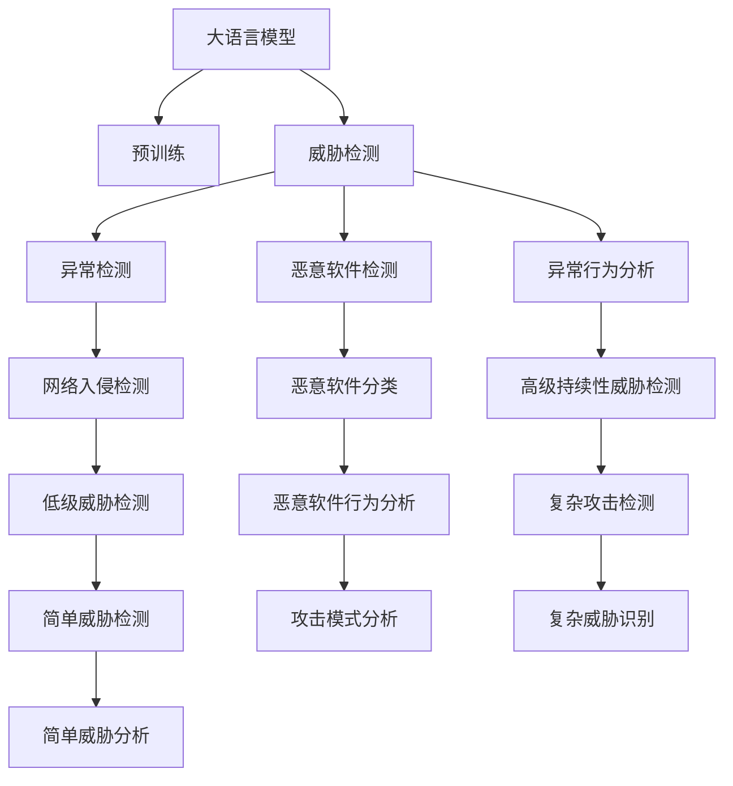

                 

# LLM在网络安全中的应用：智能威胁检测

> 关键词：
- 大语言模型
- 网络安全
- 威胁检测
- 智能识别
- 异常检测
- 恶意软件检测
- 异常行为分析

## 1. 背景介绍

### 1.1 问题由来

随着信息技术的飞速发展，网络安全问题日益凸显。恶意软件、钓鱼攻击、DDoS攻击等网络威胁给企业和个人的财产安全、隐私保护带来严重挑战。而传统的安全检测技术，往往依赖于规则库、签名特征等静态手段，难以应对日益复杂多变的攻击手段。为此，研究人员提出了基于机器学习，尤其是深度学习技术的智能威胁检测方法，利用大语言模型（Large Language Model，简称LLM）进行威胁检测和分析，具有独特的优势。

### 1.2 问题核心关键点

大语言模型在网络安全中的应用，主要体现在以下几个方面：

1. **数据驱动的威胁检测**：利用大规模无标签文本数据进行预训练，提取特征，捕捉潜在的网络威胁。
2. **自适应威胁识别**：能够自动学习新出现的威胁模式，适应不断变化的网络环境。
3. **上下文理解**：通过深度学习模型，可以理解上下文信息，提高威胁识别的准确性。
4. **多模态融合**：结合文本、图片、音频等多模态数据，提供更全面的威胁识别能力。
5. **高效训练和推理**：利用预训练和大规模微调，能够在大规模数据集上快速训练和推理，提高检测效率。

### 1.3 问题研究意义

大语言模型在网络安全领域的应用，对于提升威胁检测的准确性和时效性具有重要意义：

1. **降低误报率**：利用深度学习模型，可以自动学习复杂的威胁模式，减少对规则库的依赖，从而降低误报率。
2. **应对未知威胁**：深度学习模型具有较强的泛化能力，可以自动学习新出现的威胁模式，及时应对未知威胁。
3. **提升自动化程度**：通过智能检测，能够自动化地进行威胁识别和响应，减轻人工分析的负担。
4. **增强威胁理解**：通过上下文理解，可以更深入地分析威胁行为的特征和动机，制定更有效的应对措施。

## 2. 核心概念与联系

### 2.1 核心概念概述

为更好地理解大语言模型在网络安全中的应用，本节将介绍几个密切相关的核心概念：

- **大语言模型**：如BERT、GPT-3等，通过大规模无标签文本数据预训练，具有强大的自然语言处理能力。
- **威胁检测**：利用各种技术手段，自动检测和分析网络威胁的过程，包括入侵检测、异常检测、恶意软件检测等。
- **异常检测**：基于行为或数据模式的变化，自动检测异常事件的过程，常用于识别潜在的威胁。
- **恶意软件检测**：识别和分类恶意软件的过程，包括病毒、木马、蠕虫等。
- **异常行为分析**：对网络行为进行分析，识别异常行为的过程，常用于检测高级持续性威胁（APT）等复杂攻击。
- **多模态融合**：结合文本、图片、音频等多模态数据，提高威胁识别的全面性和准确性。

这些核心概念之间的逻辑关系可以通过以下Mermaid流程图来展示：



这个流程图展示了大语言模型在网络安全领域的核心概念及其之间的关系：

1. 大语言模型通过预训练获得基础能力。
2. 威胁检测、异常检测、恶意软件检测和异常行为分析等任务，都是在大语言模型的基础上进行微调得到的。
3. 不同任务之间可以相互借鉴和融合，共同构建更加全面的威胁检测系统。

## 3. 核心算法原理 & 具体操作步骤
### 3.1 算法原理概述

基于大语言模型（LLM）的威胁检测方法，本质上是一种有监督的分类任务，利用深度学习模型对输入数据进行分类。其核心思想是：将网络安全事件转换为文本输入，利用预训练模型提取特征，并根据威胁类型进行分类。

形式化地，假设预训练模型为 $M_{\theta}$，其中 $\theta$ 为预训练得到的模型参数。给定网络安全事件 $x$，根据威胁类型 $y$ 分为 $k$ 类（如正常、钓鱼、木马等），训练的目标是找到最优参数 $\theta^*$，使得：

$$
\theta^* = \mathop{\arg\min}_{\theta} \mathcal{L}(M_{\theta},D)
$$

其中 $\mathcal{L}$ 为交叉熵损失函数，$D$ 为标注数据集，$y_i$ 为事件 $x_i$ 的真实标签。通过梯度下降等优化算法，微调过程不断更新模型参数 $\theta$，最小化损失函数 $\mathcal{L}$，使得模型输出逼近真实标签。

### 3.2 算法步骤详解

基于大语言模型的威胁检测方法一般包括以下几个关键步骤：

**Step 1: 准备数据集和模型**
- 收集网络安全事件的文本描述，作为输入数据。
- 根据不同威胁类型，标注数据集 $D=\{(x_i,y_i)\}_{i=1}^N$。
- 选择合适的预训练语言模型 $M_{\theta}$，如BERT、GPT等。

**Step 2: 设计任务适配层**
- 设计适当的输出层和损失函数。
- 对于分类任务，通常使用线性分类器，交叉熵损失函数。
- 对于生成任务，可以使用语言模型的解码器输出概率分布，负对数似然为损失函数。

**Step 3: 设置微调超参数**
- 选择合适的优化算法及其参数，如 AdamW、SGD 等。
- 设置学习率、批大小、迭代轮数等。
- 设置正则化技术及强度，包括权重衰减、Dropout、Early Stopping 等。

**Step 4: 执行梯度训练**
- 将训练集数据分批次输入模型，前向传播计算损失函数。
- 反向传播计算参数梯度，根据设定的优化算法和学习率更新模型参数。
- 周期性在验证集上评估模型性能，根据性能指标决定是否触发 Early Stopping。
- 重复上述步骤直到满足预设的迭代轮数或 Early Stopping 条件。

**Step 5: 测试和部署**
- 在测试集上评估微调后模型 $M_{\hat{\theta}}$ 的性能，对比微调前后的精度提升。
- 使用微调后的模型对新样本进行推理预测，集成到实际的应用系统中。

### 3.3 算法优缺点

基于大语言模型的威胁检测方法具有以下优点：
1. **高效性**：利用预训练模型，可以显著减少从头训练的时间和数据量，加快检测速度。
2. **鲁棒性**：深度学习模型具有较强的泛化能力，能够适应不断变化的网络威胁。
3. **可扩展性**：可以通过微调添加新的威胁类型，扩展威胁检测系统。

同时，该方法也存在一定的局限性：
1. **数据依赖**：模型的性能很大程度上取决于标注数据的质量和数量，标注成本较高。
2. **解释性不足**：深度学习模型的决策过程缺乏可解释性，难以理解其内部工作机制。
3. **过拟合风险**：在标注数据不足的情况下，存在过拟合的风险，需要额外注意正则化技术的应用。
4. **硬件资源需求**：大模型参数量较大，对硬件资源要求较高。

尽管存在这些局限性，但就目前而言，基于大语言模型的威胁检测方法仍是大规模网络安全防御的重要手段。未来相关研究的重点在于如何进一步降低对标注数据的依赖，提高模型的泛化能力和可解释性，同时兼顾硬件资源的需求。

### 3.4 算法应用领域

大语言模型在网络安全中的应用广泛，主要包括以下几个方面：

1. **入侵检测系统（IDS）**：利用大语言模型对网络流量进行分析，自动检测入侵行为。
2. **异常检测系统（EDS）**：通过分析用户行为模式，自动检测异常行为。
3. **恶意软件检测**：利用大语言模型对软件行为进行分析，自动识别和分类恶意软件。
4. **威胁情报分析**：利用大语言模型对威胁情报进行分析，自动提取有价值的信息。
5. **漏洞检测**：利用大语言模型对代码进行分析，自动检测潜在漏洞。
6. **数据泄露防护**：利用大语言模型对数据流量进行分析，自动检测数据泄露行为。

除了上述这些应用外，大语言模型还可以用于威胁报告生成、攻击模式分析、网络流量监控等多个环节，为网络安全防御提供全面的解决方案。

## 4. 数学模型和公式 & 详细讲解  
### 4.1 数学模型构建

本节将使用数学语言对基于大语言模型的威胁检测过程进行更加严格的刻画。

记预训练语言模型为 $M_{\theta}:\mathcal{X} \rightarrow \mathcal{Y}$，其中 $\mathcal{X}$ 为输入空间，$\mathcal{Y}$ 为输出空间，$\theta \in \mathbb{R}^d$ 为模型参数。假设威胁检测任务的训练集为 $D=\{(x_i,y_i)\}_{i=1}^N, x_i \in \mathcal{X}, y_i \in \{0,1,\ldots,k-1\}$。

定义模型 $M_{\theta}$ 在输入 $x$ 上的输出为 $\hat{y}=M_{\theta}(x) \in [0,1]$，表示样本属于第 $i$ 类威胁的概率。真实标签 $y \in \{0,1,\ldots,k-1\}$。则威胁检测的交叉熵损失函数定义为：

$$
\ell(M_{\theta}(x),y) = -[y\log \hat{y} + (1-y)\log (1-\hat{y})]
$$

将其代入经验风险公式，得：

$$
\mathcal{L}(\theta) = -\frac{1}{N}\sum_{i=1}^N [y_i\log M_{\theta}(x_i)+(1-y_i)\log(1-M_{\theta}(x_i))]
$$

在得到损失函数的梯度后，即可带入参数更新公式，完成模型的迭代优化。重复上述过程直至收敛，最终得到适应威胁检测任务的最优模型参数 $\theta^*$。

### 4.2 公式推导过程

以下我们以二分类任务为例，推导交叉熵损失函数及其梯度的计算公式。

假设模型 $M_{\theta}$ 在输入 $x$ 上的输出为 $\hat{y}=M_{\theta}(x) \in [0,1]$，表示样本属于正类的概率。真实标签 $y \in \{0,1\}$。则二分类交叉熵损失函数定义为：

$$
\ell(M_{\theta}(x),y) = -[y\log \hat{y} + (1-y)\log (1-\hat{y})]
$$

将其代入经验风险公式，得：

$$
\mathcal{L}(\theta) = -\frac{1}{N}\sum_{i=1}^N [y_i\log M_{\theta}(x_i)+(1-y_i)\log(1-M_{\theta}(x_i))]
$$

根据链式法则，损失函数对参数 $\theta_k$ 的梯度为：

$$
\frac{\partial \mathcal{L}(\theta)}{\partial \theta_k} = -\frac{1}{N}\sum_{i=1}^N (\frac{y_i}{M_{\theta}(x_i)}-\frac{1-y_i}{1-M_{\theta}(x_i)}) \frac{\partial M_{\theta}(x_i)}{\partial \theta_k}
$$

其中 $\frac{\partial M_{\theta}(x_i)}{\partial \theta_k}$ 可进一步递归展开，利用自动微分技术完成计算。

在得到损失函数的梯度后，即可带入参数更新公式，完成模型的迭代优化。重复上述过程直至收敛，最终得到适应威胁检测任务的最优模型参数 $\theta^*$。

## 5. 项目实践：代码实例和详细解释说明
### 5.1 开发环境搭建

在进行威胁检测实践前，我们需要准备好开发环境。以下是使用Python进行PyTorch开发的环境配置流程：

1. 安装Anaconda：从官网下载并安装Anaconda，用于创建独立的Python环境。

2. 创建并激活虚拟环境：
```bash
conda create -n pytorch-env python=3.8 
conda activate pytorch-env
```

3. 安装PyTorch：根据CUDA版本，从官网获取对应的安装命令。例如：
```bash
conda install pytorch torchvision torchaudio cudatoolkit=11.1 -c pytorch -c conda-forge
```

4. 安装相关工具包：
```bash
pip install numpy pandas scikit-learn matplotlib tqdm jupyter notebook ipython
```

完成上述步骤后，即可在`pytorch-env`环境中开始威胁检测实践。

### 5.2 源代码详细实现

下面我们以恶意软件检测任务为例，给出使用Transformers库对BERT模型进行威胁检测的PyTorch代码实现。

首先，定义威胁检测任务的数据处理函数：

```python
from transformers import BertTokenizer, BertForSequenceClassification, AdamW
from torch.utils.data import Dataset, DataLoader
import torch

class ThreatDetectionDataset(Dataset):
    def __init__(self, texts, labels, tokenizer, max_len=128):
        self.texts = texts
        self.labels = labels
        self.tokenizer = tokenizer
        self.max_len = max_len
        
    def __len__(self):
        return len(self.texts)
    
    def __getitem__(self, item):
        text = self.texts[item]
        label = self.labels[item]
        
        encoding = self.tokenizer(text, return_tensors='pt', max_length=self.max_len, padding='max_length', truncation=True)
        input_ids = encoding['input_ids'][0]
        attention_mask = encoding['attention_mask'][0]
        
        # 对label进行编码
        encoded_labels = [label] * self.max_len
        labels = torch.tensor(encoded_labels, dtype=torch.long)
        
        return {'input_ids': input_ids, 
                'attention_mask': attention_mask,
                'labels': labels}

# 标签与id的映射
label2id = {0: 'normal', 1: 'phishing', 2: 'malware', 3: 'ddos', 4: 'data_leak'}

# 创建dataset
tokenizer = BertTokenizer.from_pretrained('bert-base-cased')
train_dataset = ThreatDetectionDataset(train_texts, train_labels, tokenizer)
dev_dataset = ThreatDetectionDataset(dev_texts, dev_labels, tokenizer)
test_dataset = ThreatDetectionDataset(test_texts, test_labels, tokenizer)
```

然后，定义模型和优化器：

```python
model = BertForSequenceClassification.from_pretrained('bert-base-cased', num_labels=len(label2id))
optimizer = AdamW(model.parameters(), lr=2e-5)
```

接着，定义训练和评估函数：

```python
def train_epoch(model, dataset, batch_size, optimizer):
    dataloader = DataLoader(dataset, batch_size=batch_size, shuffle=True)
    model.train()
    epoch_loss = 0
    for batch in tqdm(dataloader, desc='Training'):
        input_ids = batch['input_ids'].to(device)
        attention_mask = batch['attention_mask'].to(device)
        labels = batch['labels'].to(device)
        model.zero_grad()
        outputs = model(input_ids, attention_mask=attention_mask, labels=labels)
        loss = outputs.loss
        epoch_loss += loss.item()
        loss.backward()
        optimizer.step()
    return epoch_loss / len(dataloader)

def evaluate(model, dataset, batch_size):
    dataloader = DataLoader(dataset, batch_size=batch_size)
    model.eval()
    preds, labels = [], []
    with torch.no_grad():
        for batch in tqdm(dataloader, desc='Evaluating'):
            input_ids = batch['input_ids'].to(device)
            attention_mask = batch['attention_mask'].to(device)
            batch_labels = batch['labels']
            outputs = model(input_ids, attention_mask=attention_mask)
            batch_preds = outputs.logits.argmax(dim=2).to('cpu').tolist()
            batch_labels = batch_labels.to('cpu').tolist()
            for pred_tokens, label_tokens in zip(batch_preds, batch_labels):
                pred_labels = [label2id[_id] for _id in pred_tokens]
                label_tokens = [label2id[_id] for _id in label_tokens]
                preds.append(pred_labels[:len(label_tokens)])
                labels.append(label_tokens)
                
    print(classification_report(labels, preds))
```

最后，启动训练流程并在测试集上评估：

```python
epochs = 5
batch_size = 16

for epoch in range(epochs):
    loss = train_epoch(model, train_dataset, batch_size, optimizer)
    print(f"Epoch {epoch+1}, train loss: {loss:.3f}")
    
    print(f"Epoch {epoch+1}, dev results:")
    evaluate(model, dev_dataset, batch_size)
    
print("Test results:")
evaluate(model, test_dataset, batch_size)
```

以上就是使用PyTorch对BERT进行恶意软件检测任务的威胁检测代码实现。可以看到，得益于Transformers库的强大封装，我们可以用相对简洁的代码完成BERT模型的加载和威胁检测。

### 5.3 代码解读与分析

让我们再详细解读一下关键代码的实现细节：

**ThreatDetectionDataset类**：
- `__init__`方法：初始化文本、标签、分词器等关键组件。
- `__len__`方法：返回数据集的样本数量。
- `__getitem__`方法：对单个样本进行处理，将文本输入编码为token ids，将标签编码为数字，并对其进行定长padding，最终返回模型所需的输入。

**label2id和id2label字典**：
- 定义了标签与数字id之间的映射关系，用于将模型预测结果解码回真实的标签。

**训练和评估函数**：
- 使用PyTorch的DataLoader对数据集进行批次化加载，供模型训练和推理使用。
- 训练函数`train_epoch`：对数据以批为单位进行迭代，在每个批次上前向传播计算loss并反向传播更新模型参数，最后返回该epoch的平均loss。
- 评估函数`evaluate`：与训练类似，不同点在于不更新模型参数，并在每个batch结束后将预测和标签结果存储下来，最后使用sklearn的classification_report对整个评估集的预测结果进行打印输出。

**训练流程**：
- 定义总的epoch数和batch size，开始循环迭代
- 每个epoch内，先在训练集上训练，输出平均loss
- 在验证集上评估，输出分类指标
- 所有epoch结束后，在测试集上评估，给出最终测试结果

可以看到，PyTorch配合Transformers库使得BERT威胁检测的代码实现变得简洁高效。开发者可以将更多精力放在数据处理、模型改进等高层逻辑上，而不必过多关注底层的实现细节。

当然，工业级的系统实现还需考虑更多因素，如模型的保存和部署、超参数的自动搜索、更灵活的任务适配层等。但核心的威胁检测范式基本与此类似。

## 6. 实际应用场景
### 6.1 智能入侵检测系统

基于大语言模型的入侵检测系统，可以在网络流量中进行智能入侵检测。传统入侵检测系统依赖于规则库和签名特征，难以应对复杂的入侵手段。而利用大语言模型，可以从大量的网络流量数据中自动学习入侵模式，实现智能化的入侵检测。

在技术实现上，可以收集网络流量数据，并提取其中的文本信息，如协议栈信息、应用层数据等。将提取出的文本数据作为输入，使用微调后的BERT模型进行威胁检测。对于检测出的异常流量，可以进一步分析其特征，定位攻击类型和来源，自动生成威胁报告，并采取相应的防御措施。

### 6.2 异常行为分析系统

异常行为分析系统利用大语言模型对用户行为进行分析，自动检测异常行为，如账户被盗用、敏感数据泄露等。通过收集用户登录、操作等行为数据，将数据转换为文本形式，利用微调后的BERT模型进行威胁检测。对于检测出的异常行为，可以自动触发警报，通知安全管理人员进行处理。

### 6.3 恶意软件检测系统

恶意软件检测系统利用大语言模型对软件行为进行分析，自动识别和分类恶意软件。通过收集软件的行为数据，将数据转换为文本形式，使用微调后的BERT模型进行威胁检测。对于检测出的恶意软件，可以自动进行隔离和清除，并更新软件库中的恶意样本库，以提高后续检测的准确性。

### 6.4 未来应用展望

随着大语言模型和威胁检测方法的不断发展，基于微调范式将在更多领域得到应用，为网络安全防御带来新的解决方案：

1. **高级威胁检测**：利用大语言模型对复杂攻击进行检测和分析，如APT攻击、供应链攻击等。
2. **威胁情报分析**：利用大语言模型对威胁情报进行分析，提取有价值的信息，为安全策略制定提供依据。
3. **安全事件响应**：利用大语言模型对安全事件进行自动响应，如自动隔离异常流量、自动生成防御策略等。
4. **自动化安全监控**：利用大语言模型进行持续的安全监控，及时发现和响应潜在威胁。
5. **跨领域威胁检测**：利用大语言模型进行多模态融合，结合文本、图片、音频等多模态数据，提高威胁检测的全面性和准确性。

这些趋势凸显了大语言模型在网络安全领域的广阔前景。未来，基于大语言模型的威胁检测技术将更加智能化、全面化，为构建更加安全可靠的网络环境提供有力保障。

## 7. 工具和资源推荐
### 7.1 学习资源推荐

为了帮助开发者系统掌握大语言模型在网络安全中的应用，这里推荐一些优质的学习资源：

1. 《深度学习与网络安全》书籍：系统介绍深度学习在网络安全中的应用，涵盖威胁检测、异常检测、恶意软件检测等多个环节。
2. 《网络安全中的深度学习》课程：由清华大学开设的深度学习课程，涵盖网络安全中的深度学习技术，包括威胁检测、异常检测、恶意软件检测等。
3. 《自然语言处理与深度学习》书籍：介绍自然语言处理中的深度学习技术，包括文本分类、命名实体识别、情感分析等，可作为威胁检测任务的数据处理参考。
4. 《Python深度学习》书籍：系统介绍深度学习在Python中的应用，包括模型训练、数据处理、模型优化等多个环节，可作为威胁检测任务的开发工具参考。
5. CSAPP《计算机系统编程》书籍：介绍计算机系统编程技术，涵盖操作系统、网络编程、数据结构等多个领域，可作为威胁检测任务的底层技术参考。

通过对这些资源的学习实践，相信你一定能够快速掌握大语言模型在网络安全中的应用，并用于解决实际的安全问题。
###  7.2 开发工具推荐

高效的开发离不开优秀的工具支持。以下是几款用于大语言模型在网络安全中的应用开发的常用工具：

1. PyTorch：基于Python的开源深度学习框架，灵活动态的计算图，适合快速迭代研究。大部分预训练语言模型都有PyTorch版本的实现。

2. TensorFlow：由Google主导开发的开源深度学习框架，生产部署方便，适合大规模工程应用。同样有丰富的预训练语言模型资源。

3. Transformers库：HuggingFace开发的NLP工具库，集成了众多SOTA语言模型，支持PyTorch和TensorFlow，是进行威胁检测任务开发的利器。

4. Weights & Biases：模型训练的实验跟踪工具，可以记录和可视化模型训练过程中的各项指标，方便对比和调优。与主流深度学习框架无缝集成。

5. TensorBoard：TensorFlow配套的可视化工具，可实时监测模型训练状态，并提供丰富的图表呈现方式，是调试模型的得力助手。

6. Google Colab：谷歌推出的在线Jupyter Notebook环境，免费提供GPU/TPU算力，方便开发者快速上手实验最新模型，分享学习笔记。

合理利用这些工具，可以显著提升大语言模型在网络安全中的应用开发效率，加快创新迭代的步伐。

### 7.3 相关论文推荐

大语言模型在网络安全领域的应用源于学界的持续研究。以下是几篇奠基性的相关论文，推荐阅读：

1. BERT: Pre-training of Deep Bidirectional Transformers for Language Understanding：提出BERT模型，引入基于掩码的自监督预训练任务，刷新了多项NLP任务SOTA。

2. Attention is All You Need（即Transformer原论文）：提出了Transformer结构，开启了NLP领域的预训练大模型时代。

3. Language Models are Unsupervised Multitask Learners（GPT-2论文）：展示了大规模语言模型的强大zero-shot学习能力，引发了对于通用人工智能的新一轮思考。

4. Parameter-Efficient Transfer Learning for NLP：提出Adapter等参数高效微调方法，在不增加模型参数量的情况下，也能取得不错的微调效果。

5. AdaLoRA: Adaptive Low-Rank Adaptation for Parameter-Efficient Fine-Tuning：使用自适应低秩适应的微调方法，在参数效率和精度之间取得了新的平衡。

这些论文代表了大语言模型在网络安全领域的应用发展脉络。通过学习这些前沿成果，可以帮助研究者把握学科前进方向，激发更多的创新灵感。

## 8. 总结：未来发展趋势与挑战
### 8.1 总结

本文对基于大语言模型的威胁检测方法进行了全面系统的介绍。首先阐述了大语言模型和威胁检测技术的研究背景和意义，明确了微调在拓展预训练模型应用、提升威胁检测性能方面的独特价值。其次，从原理到实践，详细讲解了威胁检测的数学原理和关键步骤，给出了威胁检测任务开发的完整代码实例。同时，本文还广泛探讨了威胁检测方法在网络入侵检测、异常行为分析、恶意软件检测等多个网络安全领域的应用前景，展示了微调范式的巨大潜力。

通过本文的系统梳理，可以看到，基于大语言模型的威胁检测方法在网络安全领域的应用前景广阔。利用深度学习模型的强大泛化能力，可以高效地检测和分析网络威胁，提升网络安全防御的能力和效率。未来，伴随预训练语言模型和威胁检测方法的持续演进，相信网络安全防御技术将不断创新，为构建更加安全可靠的网络环境提供有力保障。

### 8.2 未来发展趋势

展望未来，基于大语言模型的威胁检测方法将呈现以下几个发展趋势：

1. **模型规模增大**：随着算力成本的下降和数据规模的扩张，预训练语言模型的参数量还将持续增长。超大模型参数量使得大语言模型可以学习到更加丰富的特征，从而提升威胁检测的准确性。

2. **多模态融合**：结合文本、图片、音频等多模态数据，提高威胁识别的全面性和准确性。未来的大语言模型将更多地融合多模态数据，提供更加全面和精确的威胁检测能力。

3. **自适应威胁检测**：通过在线学习，能够自动适应不断变化的网络威胁。未来的大语言模型将具备更强的自适应能力，能够实时学习和更新威胁特征。

4. **对抗性攻击检测**：利用对抗性攻击检测技术，能够识别出恶意对抗样本，提升威胁检测的鲁棒性。

5. **威胁情报分析**：利用大语言模型对威胁情报进行分析，提取有价值的信息，为安全策略制定提供依据。

6. **威胁预测**：利用大语言模型对威胁进行预测，提前发现潜在的安全隐患。

以上趋势凸显了大语言模型在网络安全领域的广阔前景。这些方向的探索发展，必将进一步提升威胁检测的准确性和时效性，为构建更加安全可靠的网络环境提供有力保障。

### 8.3 面临的挑战

尽管基于大语言模型的威胁检测技术已经取得了瞩目成就，但在迈向更加智能化、普适化应用的过程中，它仍面临着诸多挑战：

1. **数据依赖**：模型的性能很大程度上取决于标注数据的质量和数量，标注成本较高。如何进一步降低对标注数据的依赖，将是一大难题。

2. **模型鲁棒性不足**：当前威胁检测模型面对域外数据时，泛化性能往往大打折扣。对于测试样本的微小扰动，威胁检测模型的预测也容易发生波动。如何提高威胁检测模型的鲁棒性，避免灾难性遗忘，还需要更多理论和实践的积累。

3. **推理效率有待提高**：超大模型参数量对硬件资源要求较高，推理速度慢、内存占用大。如何在保证性能的同时，简化模型结构，提升推理速度，优化资源占用，将是重要的优化方向。

4. **可解释性亟需加强**：当前威胁检测模型缺乏可解释性，难以理解其内部工作机制和决策逻辑。对于医疗、金融等高风险应用，算法的可解释性和可审计性尤为重要。如何赋予威胁检测模型更强的可解释性，将是亟待攻克的难题。

5. **安全性有待保障**：威胁检测模型可能学习到有害的威胁模式，甚至在对抗样本的诱导下进行误判。如何从数据和算法层面消除模型偏见，避免恶意用途，确保输出的安全性，也将是重要的研究课题。

6. **跨领域迁移能力不足**：现有的威胁检测模型往往局限于特定领域，难以灵活适应不同领域的安全需求。如何让威胁检测过程更好地与外部知识库、规则库等专家知识结合，形成更加全面、准确的信息整合能力，还有很大的想象空间。

正视威胁检测面临的这些挑战，积极应对并寻求突破，将是大语言模型威胁检测走向成熟的必由之路。相信随着学界和产业界的共同努力，这些挑战终将一一被克服，大语言模型威胁检测必将在构建安全可靠的网络环境中扮演越来越重要的角色。

### 8.4 研究展望

面对大语言模型威胁检测所面临的种种挑战，未来的研究需要在以下几个方面寻求新的突破：

1. **探索无监督和半监督威胁检测方法**：摆脱对大规模标注数据的依赖，利用自监督学习、主动学习等无监督和半监督范式，最大限度利用非结构化数据，实现更加灵活高效的威胁检测。

2. **研究参数高效和计算高效的威胁检测方法**：开发更加参数高效的威胁检测方法，在固定大部分预训练参数的同时，只更新极少量的任务相关参数。同时优化威胁检测模型的计算图，减少前向传播和反向传播的资源消耗，实现更加轻量级、实时性的部署。

3. **融合因果和对比学习范式**：通过引入因果推断和对比学习思想，增强威胁检测模型建立稳定因果关系的能力，学习更加普适、鲁棒的语言表征，从而提升威胁检测的泛化性和抗干扰能力。

4. **引入更多先验知识**：将符号化的先验知识，如知识图谱、逻辑规则等，与神经网络模型进行巧妙融合，引导威胁检测过程学习更准确、合理的语言模型。同时加强不同模态数据的整合，实现视觉、语音等多模态信息与文本信息的协同建模。

5. **结合因果分析和博弈论工具**：将因果分析方法引入威胁检测模型，识别出模型决策的关键特征，增强输出解释的因果性和逻辑性。借助博弈论工具刻画人机交互过程，主动探索并规避模型的脆弱点，提高系统稳定性。

6. **纳入伦理道德约束**：在威胁检测目标中引入伦理导向的评估指标，过滤和惩罚有偏见、有害的输出倾向。同时加强人工干预和审核，建立威胁检测行为的监管机制，确保输出符合人类价值观和伦理道德。

这些研究方向的探索，必将引领大语言模型威胁检测技术迈向更高的台阶，为构建安全、可靠、可解释、可控的威胁检测系统铺平道路。面向未来，大语言模型威胁检测技术还需要与其他人工智能技术进行更深入的融合，如知识表示、因果推理、强化学习等，多路径协同发力，共同推动网络安全防御技术的进步。只有勇于创新、敢于突破，才能不断拓展威胁检测的边界，让智能技术更好地服务于网络安全防御。

## 9. 附录：常见问题与解答
**Q1：基于大语言模型的威胁检测是否适用于所有威胁类型？**

A: 大语言模型在威胁检测中的应用非常广泛，可以用于多种类型的威胁检测，如入侵检测、恶意软件检测、异常检测等。但对于一些特定领域的威胁，如针对性攻击、零日攻击等，由于数据和模型的复杂性，可能需要更加定制化的解决方案。

**Q2：大语言模型在威胁检测中的学习效率如何？**

A: 大语言模型在威胁检测中的学习效率较高。通过预训练和微调，可以在较短的时间内获得较好的效果。但由于模型的参数量较大，对硬件资源要求较高，可能需要使用GPU/TPU等高性能设备进行加速。

**Q3：大语言模型在威胁检测中的鲁棒性如何？**

A: 大语言模型在威胁检测中的鲁棒性较好，能够适应不断变化的网络威胁。但由于模型的泛化能力有限，面对域外数据和对抗样本时，可能出现一定的误判。因此，在实际应用中，需要进行更多的正则化技术和模型优化，提高威胁检测的鲁棒性。

**Q4：大语言模型在威胁检测中的解释性如何？**

A: 大语言模型在威胁检测中的解释性不足，难以理解其内部工作机制和决策逻辑。对于医疗、金融等高风险应用，算法的可解释性和可审计性尤为重要。因此，未来的研究需要探索更多的可解释性方法，提高威胁检测模型的透明度和可理解性。

**Q5：大语言模型在威胁检测中的安全性如何？**

A: 大语言模型在威胁检测中的安全性需要保障。由于模型的自学习能力，可能学习到有害的威胁模式，甚至在对抗样本的诱导下进行误判。因此，在实际应用中，需要采用数据清洗、对抗训练等方法，避免模型学习到有害信息，确保威胁检测的安全性。

**Q6：大语言模型在威胁检测中的跨领域迁移能力如何？**

A: 大语言模型在威胁检测中的跨领域迁移能力有待提升。由于不同领域的威胁特征差异较大，简单的模型迁移可能无法有效适应。因此，未来的研究需要探索更多跨领域迁移的方法，提高威胁检测模型的泛化能力和适应性。

这些常见问题与解答，有助于开发者更好地理解大语言模型在网络安全中的应用，并针对具体场景进行模型优化和部署。

---

作者：禅与计算机程序设计艺术 / Zen and the Art of Computer Programming

