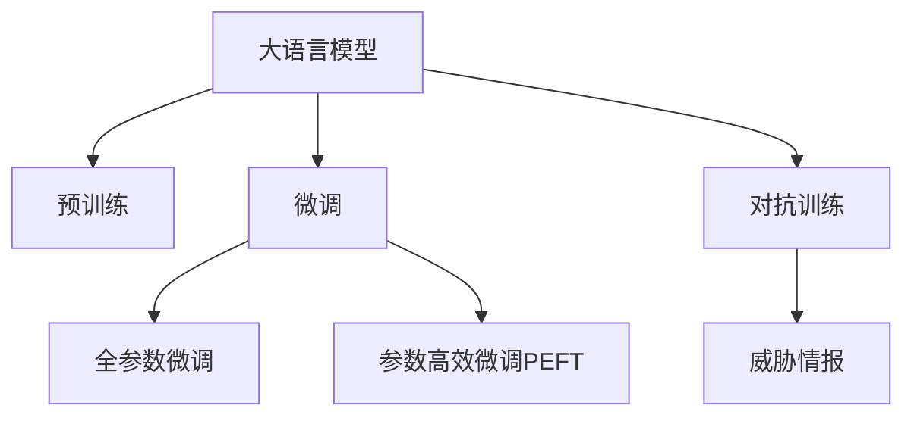

                 

# LLM对传统网络安全策略的挑战与创新

## 1. 背景介绍

### 1.1 问题由来
随着人工智能技术，特别是大语言模型（Large Language Models, LLM）的迅猛发展，其在网络安全领域的应用也日益增多。大语言模型可以通过自然语言处理能力，在威胁情报分析、漏洞检测、入侵防御等方面发挥重要作用。然而，大语言模型的应用也给传统网络安全策略带来了新的挑战，需要重新审视和创新。

### 1.2 问题核心关键点
大语言模型对传统网络安全策略的挑战主要体现在以下几个方面：

1. **动态威胁环境的适应性**：传统安全策略往往依赖静态规则和固定的特征检测，难以应对复杂的、不断变化的攻击手段。
2. **威胁情报的生成与分析**：传统网络安全依赖人工构建和分析威胁情报，难以快速、准确地响应新兴威胁。
3. **自动化检测与响应**：传统网络安全措施难以自动化地进行复杂、高精度的威胁检测与响应。
4. **跨领域知识融合**：传统安全策略缺乏与其他领域知识（如医学、金融等）的协同。

## 2. 核心概念与联系

### 2.1 核心概念概述

为更好地理解大语言模型在网络安全领域的应用及其挑战，本节将介绍几个密切相关的核心概念：

- 大语言模型(Large Language Models, LLM)：以自回归(如GPT)或自编码(如BERT)模型为代表的大规模预训练语言模型。通过在大规模无标签文本语料上进行预训练，学习通用的语言表示，具备强大的语言理解和生成能力。

- 预训练(Pre-training)：指在大规模无标签文本语料上，通过自监督学习任务训练通用语言模型的过程。常见的预训练任务包括言语建模、遮挡语言模型等。预训练使得模型学习到语言的通用表示。

- 微调(Fine-tuning)：指在预训练模型的基础上，使用下游任务的少量标注数据，通过有监督地训练来优化模型在特定任务上的性能。通常只需要调整顶层分类器或解码器，并以较小的学习率更新全部或部分的模型参数。

- 迁移学习(Transfer Learning)：指将一个领域学习到的知识，迁移应用到另一个不同但相关的领域的学习范式。大模型的预训练-微调过程即是一种典型的迁移学习方式。

- 对抗训练(Adversarial Training)：在训练过程中加入对抗样本，提高模型的鲁棒性，使其能更好地抵御攻击。

- 威胁情报(Threat Intelligence)：通过收集、分析网络威胁信息，形成的情报报告，用于指导防御策略。

这些核心概念之间的逻辑关系可以通过以下Mermaid流程图来展示：



这个流程图展示了大语言模型的核心概念及其之间的关系：

1. 大语言模型通过预训练获得基础能力。
2. 微调是对预训练模型进行任务特定的优化，可以分为全参数微调和参数高效微调（PEFT）。
3. 对抗训练可以在训练过程中引入对抗样本，提高模型的鲁棒性。
4. 威胁情报为微调模型提供对抗样本来源，增强模型的防御能力。

## 3. 核心算法原理 & 具体操作步骤
### 3.1 算法原理概述

大语言模型在网络安全领域的应用，主要基于其强大的自然语言处理能力和丰富的知识库。通过微调，大语言模型可以针对特定的网络安全任务，进行有针对性的优化，提升威胁检测和响应能力。

具体而言，大语言模型在网络安全中的应用场景包括：

- 威胁情报生成：利用大语言模型对网络流量、日志等数据进行分析，生成威胁情报。
- 漏洞扫描与修复：通过自然语言查询，利用大语言模型进行漏洞检测，并自动生成修复建议。
- 入侵检测与防御：使用大语言模型分析入侵行为，生成实时防御策略。
- 自动化应急响应：利用大语言模型辅助构建自动化应急响应流程，提升响应速度和效率。

### 3.2 算法步骤详解

基于大语言模型的网络安全应用，一般包括以下几个关键步骤：

**Step 1: 数据收集与预处理**
- 收集网络流量、日志、事件等数据，并进行清洗、标注。
- 根据具体任务，选择合适的数据集和标注方式。

**Step 2: 大语言模型选择与微调**
- 选择合适的预训练语言模型 $M_{\theta}$ 作为初始化参数。
- 将数据集划分为训练集、验证集和测试集。
- 添加任务适配层，如分类器、生成器等，设计合适的损失函数。
- 设置微调超参数，包括学习率、批大小、迭代轮数等。

**Step 3: 模型训练与验证**
- 使用训练集进行模型训练，前向传播计算损失函数。
- 反向传播计算参数梯度，根据设定的优化算法和学习率更新模型参数。
- 周期性在验证集上评估模型性能，根据性能指标决定是否触发 Early Stopping。
- 重复上述步骤直到满足预设的迭代轮数或 Early Stopping 条件。

**Step 4: 模型部署与应用**
- 在测试集上评估微调后模型 $M_{\hat{\theta}}$ 的性能。
- 使用微调后的模型对新数据进行推理预测，集成到实际的安全防御系统中。
- 持续收集新的威胁情报数据，定期重新微调模型，以适应数据分布的变化。

### 3.3 算法优缺点

大语言模型在网络安全中的应用具有以下优点：

1. **适应性强**：大语言模型通过微调可以适应不同的安全任务，如威胁情报生成、漏洞扫描、入侵检测等。
2. **自动化程度高**：大语言模型可以通过自动化方式处理大量数据，生成威胁情报和漏洞报告，提高效率。
3. **跨领域能力**：大语言模型可以融合多个领域的知识，提升威胁情报的全面性和准确性。

然而，大语言模型在网络安全中应用也存在一定的局限性：

1. **隐私与安全问题**：大语言模型需要处理大量敏感数据，隐私保护和安全防御是一个重要挑战。
2. **模型鲁棒性不足**：大语言模型对输入噪声和对抗样本的鲁棒性需要进一步提升。
3. **计算资源需求高**：大语言模型的训练和推理需要大量的计算资源，对硬件设施要求较高。
4. **对抗攻击风险**：大语言模型可能受到对抗样本的攻击，影响其正常工作。

尽管存在这些局限性，但就目前而言，大语言模型在网络安全中的应用已展现出强大的潜力，有望在未来进一步拓展。

### 3.4 算法应用领域

大语言模型在网络安全领域已经得到了广泛的应用，具体包括：

- 威胁情报生成：利用大语言模型分析网络流量和日志数据，生成威胁情报，帮助安全分析师快速掌握当前威胁态势。
- 漏洞检测与修复：使用大语言模型进行漏洞检测，并自动生成修复建议，加速漏洞修复流程。
- 入侵检测与防御：通过分析入侵行为，生成实时防御策略，提升防御效率和效果。
- 自动化应急响应：利用大语言模型辅助构建自动化应急响应流程，快速响应网络攻击。
- 身份验证与授权：利用大语言模型进行自然语言理解，提升身份验证和授权的准确性和安全性。

此外，大语言模型还可能拓展到其他网络安全领域，如DDoS防御、密码破解、网络监控等，为网络安全带来新的解决方案。

## 4. 数学模型和公式 & 详细讲解 & 举例说明

### 4.1 数学模型构建

在大语言模型应用于网络安全时，常见的数学模型包括：

- 威胁情报生成：利用分类器对网络流量和日志进行分类，识别威胁行为。
- 漏洞检测与修复：使用生成器生成漏洞检测报告，并自动生成修复建议。
- 入侵检测与防御：构建序列到序列模型，分析入侵行为，生成防御策略。
- 自动化应急响应：设计图灵机模型，模拟应急响应流程，生成响应策略。

以威胁情报生成为例，构建分类器的数学模型如下：

假设网络流量数据集为 $D=\{(x_i, y_i)\}_{i=1}^N, x_i \in \mathcal{X}, y_i \in \{0,1\}$，其中 $x_i$ 表示网络流量数据，$y_i$ 表示是否存在威胁行为。

定义模型 $M_{\theta}$ 在输入 $x$ 上的输出为 $\hat{y}=M_{\theta}(x) \in [0,1]$，表示样本属于威胁行为的概率。

模型 $M_{\theta}$ 在数据样本 $(x,y)$ 上的损失函数为 $\ell(M_{\theta}(x),y)$，其中 $\ell$ 为损失函数，如交叉熵损失函数。

在数据集 $D$ 上的经验风险为：

$$
\mathcal{L}(\theta) = \frac{1}{N} \sum_{i=1}^N \ell(M_{\theta}(x_i),y_i)
$$

最小化经验风险的优化目标是最小化损失函数：

$$
\theta^* = \mathop{\arg\min}_{\theta} \mathcal{L}(\theta)
$$

### 4.2 公式推导过程

以威胁情报生成为例，推导分类器的梯度计算过程。

假设模型 $M_{\theta}$ 在输入 $x$ 上的输出为 $\hat{y}=M_{\theta}(x) \in [0,1]$，表示样本属于威胁行为的概率。

则交叉熵损失函数定义为：

$$
\ell(M_{\theta}(x),y) = -[y\log \hat{y} + (1-y)\log (1-\hat{y})]
$$

将其代入经验风险公式，得：

$$
\mathcal{L}(\theta) = -\frac{1}{N}\sum_{i=1}^N [y_i\log M_{\theta}(x_i)+(1-y_i)\log(1-M_{\theta}(x_i))]
$$

根据链式法则，损失函数对参数 $\theta_k$ 的梯度为：

$$
\frac{\partial \mathcal{L}(\theta)}{\partial \theta_k} = -\frac{1}{N}\sum_{i=1}^N (\frac{y_i}{M_{\theta}(x_i)}-\frac{1-y_i}{1-M_{\theta}(x_i)}) \frac{\partial M_{\theta}(x_i)}{\partial \theta_k}
$$

其中 $\frac{\partial M_{\theta}(x_i)}{\partial \theta_k}$ 可进一步递归展开，利用自动微分技术完成计算。

在得到损失函数的梯度后，即可带入参数更新公式，完成模型的迭代优化。重复上述过程直至收敛，最终得到适应网络安全任务的最优模型参数 $\theta^*$。

## 5. 项目实践：代码实例和详细解释说明
### 5.1 开发环境搭建

在进行网络安全领域的大语言模型微调实践前，我们需要准备好开发环境。以下是使用Python进行PyTorch开发的环境配置流程：

1. 安装Anaconda：从官网下载并安装Anaconda，用于创建独立的Python环境。

2. 创建并激活虚拟环境：
```bash
conda create -n pytorch-env python=3.8 
conda activate pytorch-env
```

3. 安装PyTorch：根据CUDA版本，从官网获取对应的安装命令。例如：
```bash
conda install pytorch torchvision torchaudio cudatoolkit=11.1 -c pytorch -c conda-forge
```

4. 安装TensorFlow：由Google主导开发的开源深度学习框架，生产部署方便，适合大规模工程应用。同样有丰富的预训练语言模型资源。

5. 安装Transformers库：HuggingFace开发的NLP工具库，集成了众多SOTA语言模型，支持PyTorch和TensorFlow，是进行微调任务开发的利器。

6. 安装各类工具包：
```bash
pip install numpy pandas scikit-learn matplotlib tqdm jupyter notebook ipython
```

完成上述步骤后，即可在`pytorch-env`环境中开始微调实践。

### 5.2 源代码详细实现

这里我们以威胁情报生成为例，给出使用Transformers库对BERT模型进行微调的PyTorch代码实现。

首先，定义威胁情报生成任务的数据处理函数：

```python
from transformers import BertTokenizer
from torch.utils.data import Dataset
import torch

class ThreatIntelligenceDataset(Dataset):
    def __init__(self, texts, labels, tokenizer, max_len=128):
        self.texts = texts
        self.labels = labels
        self.tokenizer = tokenizer
        self.max_len = max_len
        
    def __len__(self):
        return len(self.texts)
    
    def __getitem__(self, item):
        text = self.texts[item]
        label = self.labels[item]
        
        encoding = self.tokenizer(text, return_tensors='pt', max_length=self.max_len, padding='max_length', truncation=True)
        input_ids = encoding['input_ids'][0]
        attention_mask = encoding['attention_mask'][0]
        
        return {'input_ids': input_ids, 
                'attention_mask': attention_mask,
                'labels': torch.tensor(label, dtype=torch.long)}
```

然后，定义模型和优化器：

```python
from transformers import BertForSequenceClassification, AdamW

model = BertForSequenceClassification.from_pretrained('bert-base-cased', num_labels=2)

optimizer = AdamW(model.parameters(), lr=2e-5)
```

接着，定义训练和评估函数：

```python
from torch.utils.data import DataLoader
from tqdm import tqdm
from sklearn.metrics import accuracy_score

device = torch.device('cuda') if torch.cuda.is_available() else torch.device('cpu')
model.to(device)

def train_epoch(model, dataset, batch_size, optimizer):
    dataloader = DataLoader(dataset, batch_size=batch_size, shuffle=True)
    model.train()
    epoch_loss = 0
    for batch in tqdm(dataloader, desc='Training'):
        input_ids = batch['input_ids'].to(device)
        attention_mask = batch['attention_mask'].to(device)
        labels = batch['labels'].to(device)
        model.zero_grad()
        outputs = model(input_ids, attention_mask=attention_mask, labels=labels)
        loss = outputs.loss
        epoch_loss += loss.item()
        loss.backward()
        optimizer.step()
    return epoch_loss / len(dataloader)

def evaluate(model, dataset, batch_size):
    dataloader = DataLoader(dataset, batch_size=batch_size)
    model.eval()
    preds, labels = [], []
    with torch.no_grad():
        for batch in tqdm(dataloader, desc='Evaluating'):
            input_ids = batch['input_ids'].to(device)
            attention_mask = batch['attention_mask'].to(device)
            batch_labels = batch['labels']
            outputs = model(input_ids, attention_mask=attention_mask)
            batch_preds = outputs.logits.argmax(dim=1).to('cpu').tolist()
            batch_labels = batch_labels.to('cpu').tolist()
            for pred, label in zip(batch_preds, batch_labels):
                preds.append(pred)
                labels.append(label)
                
    return accuracy_score(labels, preds)

```

最后，启动训练流程并在测试集上评估：

```python
epochs = 5
batch_size = 16

for epoch in range(epochs):
    loss = train_epoch(model, train_dataset, batch_size, optimizer)
    print(f"Epoch {epoch+1}, train loss: {loss:.3f}")
    
    print(f"Epoch {epoch+1}, dev accuracy: {evaluate(model, dev_dataset, batch_size)}")
    
print(f"Final accuracy: {evaluate(model, test_dataset, batch_size)}")
```

以上就是使用PyTorch对BERT进行威胁情报生成任务的微调实践，展示了从数据处理到模型训练的全流程。

### 5.3 代码解读与分析

让我们再详细解读一下关键代码的实现细节：

**ThreatIntelligenceDataset类**：
- `__init__`方法：初始化文本、标签、分词器等关键组件。
- `__len__`方法：返回数据集的样本数量。
- `__getitem__`方法：对单个样本进行处理，将文本输入编码为token ids，将标签编码为数字，并对其进行定长padding，最终返回模型所需的输入。

**模型与优化器定义**：
- 选择BERT作为预训练模型，并设置微调目标为二分类任务。
- 使用AdamW优化器进行参数更新，设置较小的学习率。

**训练和评估函数**：
- 使用PyTorch的DataLoader对数据集进行批次化加载，供模型训练和推理使用。
- 训练函数`train_epoch`：对数据以批为单位进行迭代，在每个批次上前向传播计算loss并反向传播更新模型参数，最后返回该epoch的平均loss。
- 评估函数`evaluate`：与训练类似，不同点在于不更新模型参数，并在每个batch结束后将预测和标签结果存储下来，最后使用sklearn的accuracy_score计算分类准确率。

**训练流程**：
- 定义总的epoch数和batch size，开始循环迭代
- 每个epoch内，先在训练集上训练，输出平均loss
- 在验证集上评估，输出分类准确率
- 所有epoch结束后，在测试集上评估，给出最终测试准确率

可以看到，PyTorch配合Transformers库使得BERT微调的代码实现变得简洁高效。开发者可以将更多精力放在数据处理、模型改进等高层逻辑上，而不必过多关注底层的实现细节。

当然，工业级的系统实现还需考虑更多因素，如模型的保存和部署、超参数的自动搜索、更灵活的任务适配层等。但核心的微调范式基本与此类似。

## 6. 实际应用场景
### 6.1 智能入侵检测系统

基于大语言模型的入侵检测系统，可以实时监测网络流量，识别并拦截入侵行为。该系统通过收集网络流量数据，使用大语言模型进行异常行为分析，生成入侵事件报告，并通过自动化机制进行实时响应。

在技术实现上，可以部署多个微调模型，对不同时间段和不同地点的流量进行实时分析。模型输出的入侵事件报告将被发送到安全监控中心，进行进一步的处理和响应。

### 6.2 安全事件响应平台

安全事件响应平台利用大语言模型进行威胁情报分析，帮助安全分析师快速定位和处理安全事件。该平台收集网络威胁情报数据，使用大语言模型生成威胁情报报告，并对威胁等级进行分类。根据分类结果，平台自动触发应急响应流程，提高响应效率和效果。

在具体实现中，平台首先对收集到的网络威胁情报数据进行清洗和标注，然后使用大语言模型进行分类。模型输出的威胁情报报告将进入应急响应系统，指导安全团队采取相应措施。

### 6.3 网络安全态势感知系统

网络安全态势感知系统通过大语言模型对网络数据进行综合分析，生成实时网络安全态势报告。该系统收集来自不同源的网络流量数据，使用大语言模型进行综合分析，生成综合态势报告。报告中包含网络威胁情报、异常流量统计、防御策略等关键信息，帮助安全分析师快速掌握当前网络安全态势。

在技术实现上，系统使用多个微调模型，对不同类型的网络数据进行分析，并将结果进行综合。系统输出的态势报告将进入安全决策系统，指导安全团队采取相应措施。

### 6.4 未来应用展望

随着大语言模型微调技术的不断发展，其在网络安全领域的应用将更加广泛和深入。未来可能的应用场景包括：

- 自适应威胁情报生成：利用大语言模型生成自适应威胁情报，实时响应新兴威胁。
- 自动化漏洞扫描与修复：使用大语言模型进行自动化漏洞扫描，并自动生成修复建议。
- 跨领域知识融合：将大语言模型与其他领域知识进行融合，提升威胁情报的全面性和准确性。
- 对抗训练与防御：使用对抗训练提高模型的鲁棒性，增强对恶意攻击的防御能力。
- 智能应急响应：利用大语言模型构建智能应急响应流程，提高响应速度和效果。

这些未来应用场景将进一步拓展大语言模型在网络安全领域的应用范围，提升网络安全防护水平。

## 7. 工具和资源推荐
### 7.1 学习资源推荐

为了帮助开发者系统掌握大语言模型微调的理论基础和实践技巧，这里推荐一些优质的学习资源：

1. 《Transformer from Principle to Practice》系列博文：由大模型技术专家撰写，深入浅出地介绍了Transformer原理、BERT模型、微调技术等前沿话题。

2. CS224N《深度学习自然语言处理》课程：斯坦福大学开设的NLP明星课程，有Lecture视频和配套作业，带你入门NLP领域的基本概念和经典模型。

3. 《Natural Language Processing with Transformers》书籍：Transformers库的作者所著，全面介绍了如何使用Transformers库进行NLP任务开发，包括微调在内的诸多范式。

4. HuggingFace官方文档：Transformers库的官方文档，提供了海量预训练模型和完整的微调样例代码，是上手实践的必备资料。

5. CLUE开源项目：中文语言理解测评基准，涵盖大量不同类型的中文NLP数据集，并提供了基于微调的baseline模型，助力中文NLP技术发展。

通过对这些资源的学习实践，相信你一定能够快速掌握大语言模型微调的精髓，并用于解决实际的NLP问题。
###  7.2 开发工具推荐

高效的开发离不开优秀的工具支持。以下是几款用于大语言模型微调开发的常用工具：

1. PyTorch：基于Python的开源深度学习框架，灵活动态的计算图，适合快速迭代研究。大部分预训练语言模型都有PyTorch版本的实现。

2. TensorFlow：由Google主导开发的开源深度学习框架，生产部署方便，适合大规模工程应用。同样有丰富的预训练语言模型资源。

3. Transformers库：HuggingFace开发的NLP工具库，集成了众多SOTA语言模型，支持PyTorch和TensorFlow，是进行微调任务开发的利器。

4. Weights & Biases：模型训练的实验跟踪工具，可以记录和可视化模型训练过程中的各项指标，方便对比和调优。与主流深度学习框架无缝集成。

5. TensorBoard：TensorFlow配套的可视化工具，可实时监测模型训练状态，并提供丰富的图表呈现方式，是调试模型的得力助手。

6. Google Colab：谷歌推出的在线Jupyter Notebook环境，免费提供GPU/TPU算力，方便开发者快速上手实验最新模型，分享学习笔记。

合理利用这些工具，可以显著提升大语言模型微调任务的开发效率，加快创新迭代的步伐。

### 7.3 相关论文推荐

大语言模型和微调技术的发展源于学界的持续研究。以下是几篇奠基性的相关论文，推荐阅读：

1. Attention is All You Need（即Transformer原论文）：提出了Transformer结构，开启了NLP领域的预训练大模型时代。

2. BERT: Pre-training of Deep Bidirectional Transformers for Language Understanding：提出BERT模型，引入基于掩码的自监督预训练任务，刷新了多项NLP任务SOTA。

3. Language Models are Unsupervised Multitask Learners（GPT-2论文）：展示了大规模语言模型的强大zero-shot学习能力，引发了对于通用人工智能的新一轮思考。

4. Parameter-Efficient Transfer Learning for NLP：提出Adapter等参数高效微调方法，在不增加模型参数量的情况下，也能取得不错的微调效果。

5. Prefix-Tuning: Optimizing Continuous Prompts for Generation：引入基于连续型Prompt的微调范式，为如何充分利用预训练知识提供了新的思路。

6. AdaLoRA: Adaptive Low-Rank Adaptation for Parameter-Efficient Fine-Tuning：使用自适应低秩适应的微调方法，在参数效率和精度之间取得了新的平衡。

这些论文代表了大语言模型微调技术的发展脉络。通过学习这些前沿成果，可以帮助研究者把握学科前进方向，激发更多的创新灵感。

## 8. 总结：未来发展趋势与挑战

### 8.1 总结

本文对基于大语言模型的大规模网络安全策略进行了全面系统的介绍。首先阐述了大语言模型在网络安全领域的应用背景和重要意义，明确了其在威胁情报生成、漏洞检测、入侵防御等方面的独特价值。其次，从原理到实践，详细讲解了大语言模型微调的数学模型和关键步骤，给出了微调任务开发的完整代码实例。同时，本文还广泛探讨了大语言模型在网络安全中的实际应用场景，展示了其巨大的应用潜力。

通过本文的系统梳理，可以看到，大语言模型在网络安全领域的应用正日益广泛，成为提升网络安全防护水平的重要手段。未来，伴随大语言模型和微调方法的不断进步，网络安全技术必将迎来新的发展机遇。

### 8.2 未来发展趋势

展望未来，大语言模型在网络安全领域的应用将呈现以下几个发展趋势：

1. **动态威胁检测与响应**：利用大语言模型对实时数据进行动态威胁检测，实现自动化应急响应，提升安全防护的实时性和效率。
2. **自适应威胁情报生成**：通过大语言模型生成自适应威胁情报，实时响应新兴威胁，提升威胁情报的及时性和准确性。
3. **跨领域知识融合**：将大语言模型与其他领域知识进行融合，提升威胁情报的全面性和准确性，增强网络安全防护的多样性。
4. **对抗训练与防御**：使用对抗训练提高模型的鲁棒性，增强对恶意攻击的防御能力，提升网络安全的可靠性。
5. **自动化漏洞扫描与修复**：利用大语言模型进行自动化漏洞扫描，并自动生成修复建议，提升漏洞修复的自动化水平。
6. **智能应急响应**：利用大语言模型构建智能应急响应流程，提高响应速度和效果，增强网络安全防护的智能化水平。

以上趋势凸显了大语言模型微调技术在网络安全领域的广阔前景。这些方向的探索发展，必将进一步提升网络安全防护水平，构建更加安全可靠的网络环境。

### 8.3 面临的挑战

尽管大语言模型在网络安全中的应用已展现出显著效果，但在迈向更加智能化、普适化应用的过程中，仍面临诸多挑战：

1. **隐私保护与安全问题**：大语言模型需要处理大量敏感数据，隐私保护和安全防御是一个重要挑战。
2. **模型鲁棒性不足**：大语言模型对输入噪声和对抗样本的鲁棒性需要进一步提升，以应对各种恶意攻击。
3. **计算资源需求高**：大语言模型的训练和推理需要大量的计算资源，对硬件设施要求较高。
4. **对抗攻击风险**：大语言模型可能受到对抗样本的攻击，影响其正常工作。
5. **数据质量与标注问题**：网络安全数据质量参差不齐，标注工作繁琐，需要大量人力和时间。

尽管存在这些挑战，但大语言模型在网络安全中的应用前景仍然广阔。未来，需要通过技术创新和实践优化，逐步克服这些难题，实现大语言模型在网络安全领域的长远发展。

### 8.4 研究展望

面对大语言模型在网络安全领域所面临的挑战，未来的研究需要在以下几个方面寻求新的突破：

1. **隐私保护技术**：研究如何在保护隐私的前提下，利用大语言模型进行网络安全分析，提升数据隐私保护能力。
2. **模型鲁棒性提升**：开发更加鲁棒的大语言模型，使其能够抵御各种恶意攻击，提升网络安全防护的可靠性。
3. **计算资源优化**：研究如何优化大语言模型的计算资源使用，降低硬件成本，提升网络安全分析的效率。
4. **自动化标注技术**：研究如何利用大语言模型进行自动化数据标注，提高标注效率和数据质量，降低人工标注成本。
5. **跨领域知识整合**：研究如何利用大语言模型整合多领域知识，提升威胁情报的全面性和准确性，增强网络安全防护的多样性。
6. **对抗样本生成与检测**：研究如何生成和检测对抗样本，提高大语言模型对恶意攻击的识别能力。

这些研究方向的探索，将有助于推动大语言模型在网络安全领域的应用，实现更加智能化、可靠化的网络安全防护。

## 9. 附录：常见问题与解答

**Q1：大语言模型在网络安全中的作用有哪些？**

A: 大语言模型在网络安全中的应用主要体现在以下几个方面：

1. **威胁情报生成**：利用大语言模型对网络流量和日志进行分析，生成威胁情报，帮助安全分析师快速掌握当前威胁态势。
2. **漏洞检测与修复**：使用大语言模型进行漏洞检测，并自动生成修复建议，加速漏洞修复流程。
3. **入侵检测与防御**：通过分析入侵行为，生成实时防御策略，提升防御效率和效果。
4. **自动化应急响应**：利用大语言模型辅助构建自动化应急响应流程，快速响应网络攻击。
5. **身份验证与授权**：利用大语言模型进行自然语言理解，提升身份验证和授权的准确性和安全性。

**Q2：大语言模型微调在网络安全中需要注意哪些问题？**

A: 大语言模型微调在网络安全中需要注意以下问题：

1. **隐私保护**：大语言模型需要处理大量敏感数据，隐私保护和安全防御是一个重要挑战。
2. **模型鲁棒性**：大语言模型对输入噪声和对抗样本的鲁棒性需要进一步提升，以应对各种恶意攻击。
3. **计算资源需求高**：大语言模型的训练和推理需要大量的计算资源，对硬件设施要求较高。
4. **对抗攻击风险**：大语言模型可能受到对抗样本的攻击，影响其正常工作。
5. **数据质量与标注问题**：网络安全数据质量参差不齐，标注工作繁琐，需要大量人力和时间。

**Q3：大语言模型微调在网络安全中的应用案例有哪些？**

A: 大语言模型在网络安全领域已经得到了广泛的应用，具体包括：

1. **智能入侵检测系统**：利用大语言模型对网络流量进行异常行为分析，生成入侵事件报告，并通过自动化机制进行实时响应。
2. **安全事件响应平台**：使用大语言模型进行威胁情报分析，帮助安全分析师快速定位和处理安全事件。
3. **网络安全态势感知系统**：通过大语言模型对网络数据进行综合分析，生成实时网络安全态势报告。

**Q4：大语言模型微调在网络安全中的技术难点有哪些？**

A: 大语言模型微调在网络安全中的技术难点主要包括以下几个方面：

1. **隐私保护**：大语言模型需要处理大量敏感数据，隐私保护和安全防御是一个重要挑战。
2. **模型鲁棒性不足**：大语言模型对输入噪声和对抗样本的鲁棒性需要进一步提升，以应对各种恶意攻击。
3. **计算资源需求高**：大语言模型的训练和推理需要大量的计算资源，对硬件设施要求较高。
4. **对抗攻击风险**：大语言模型可能受到对抗样本的攻击，影响其正常工作。
5. **数据质量与标注问题**：网络安全数据质量参差不齐，标注工作繁琐，需要大量人力和时间。

**Q5：如何优化大语言模型在网络安全中的应用？**

A: 优化大语言模型在网络安全中的应用可以从以下几个方面入手：

1. **隐私保护技术**：研究如何在保护隐私的前提下，利用大语言模型进行网络安全分析，提升数据隐私保护能力。
2. **模型鲁棒性提升**：开发更加鲁棒的大语言模型，使其能够抵御各种恶意攻击，提升网络安全防护的可靠性。
3. **计算资源优化**：研究如何优化大语言模型的计算资源使用，降低硬件成本，提升网络安全分析的效率。
4. **自动化标注技术**：研究如何利用大语言模型进行自动化数据标注，提高标注效率和数据质量，降低人工标注成本。
5. **跨领域知识整合**：研究如何利用大语言模型整合多领域知识，提升威胁情报的全面性和准确性，增强网络安全防护的多样性。
6. **对抗样本生成与检测**：研究如何生成和检测对抗样本，提高大语言模型对恶意攻击的识别能力。

这些优化措施将有助于推动大语言模型在网络安全领域的应用，实现更加智能化、可靠化的网络安全防护。

---

作者：禅与计算机程序设计艺术 / Zen and the Art of Computer Programming

