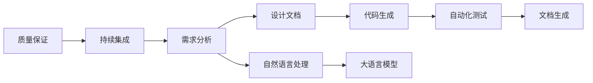

                 

# 大语言模型对软件开发流程的潜在影响

> 关键词：大语言模型,自然语言处理(NLP),软件开发生命周期,开发效率,需求分析,代码生成,自动化测试,文档生成,质量保证,持续集成

## 1. 背景介绍

### 1.1 问题由来
随着人工智能(AI)技术的飞速发展，大语言模型(Large Language Models, LLMs)已经成为计算机科学和工程领域的重要工具。特别是在软件开发生命周期(Software Development Life Cycle, SDLC)中，LLMs 提供了强大的自然语言处理(Natural Language Processing, NLP)能力，可以有效提升软件开发效率、质量以及可维护性。

然而，尽管LLMs具有强大的能力，其在SDLC中的广泛应用仍面临诸多挑战，包括数据隐私、模型可解释性、性能瓶颈等。这些问题若得不到妥善解决，可能会影响LLMs在实际软件开发流程中的作用和效果。

### 1.2 问题核心关键点
本文将系统阐述LLMs在SDLC各个阶段的应用潜力与潜在挑战，具体包括需求分析、设计文档、代码生成、自动化测试、文档生成以及质量保证与持续集成等关键环节。通过详细的分析与讨论，提出基于LLMs的软件开发流程优化策略，以期为软件开发者提供更高效、更智能、更可靠的开发工具和方法。

## 2. 核心概念与联系

### 2.1 核心概念概述

为了更好地理解LLMs在SDLC中的应用，本节将详细介绍几个核心概念：

- **大语言模型**：如GPT-3、BERT等，通过大规模无标签文本数据进行预训练，具备强大的语言理解、生成能力，能进行文本分类、语义分析、情感分析等任务。

- **自然语言处理**：利用计算机处理、理解和生成人类语言的技术，LLMs是NLP领域的重要工具。

- **软件开发生命周期**：包括需求分析、设计、编码、测试、部署、维护等多个阶段，是软件工程的核心过程。

- **需求分析**：确定软件的功能、性能、可用性等要求，是软件开发的重要环节。

- **设计文档**：描述软件设计细节，包括系统架构、数据结构、模块接口等，是开发团队协作的重要依据。

- **代码生成**：通过自动化工具生成代码，提升开发效率，减少重复性工作。

- **自动化测试**：利用工具自动执行测试用例，验证软件功能正确性，提高产品质量。

- **文档生成**：自动生成软件文档，包括API文档、使用手册等，提升可维护性。

- **质量保证**：通过自动化测试、代码审查、静态分析等手段，确保软件质量。

- **持续集成**：频繁集成代码变更，自动化测试和部署，提升开发效率和质量。

这些概念间的逻辑关系可以通过以下Mermaid流程图展示：



通过这个流程图，我们可以看到LLMs在SDLC中扮演的角色：LLMs利用NLP能力，辅助需求分析、设计文档、代码生成、自动化测试、文档生成、质量保证与持续集成等多个环节，提升开发效率和质量。

## 3. 核心算法原理 & 具体操作步骤
### 3.1 算法原理概述

基于LLMs的软件开发流程优化主要依赖于以下几个核心算法原理：

- **文本分析**：LLMs可以理解并处理自然语言文本，用于需求分析、设计文档生成、代码生成、测试用例设计等。

- **代码生成**：LLMs能够生成高质量代码，减少手动编写代码的工作量。

- **自动化测试**：LLMs可以自动生成测试用例，并分析测试结果，提高测试效率。

- **文档生成**：LLMs可以自动生成软件文档，提升代码可维护性。

- **质量保证**：LLMs可以识别代码中的潜在问题，并提供代码优化建议。

- **持续集成**：LLMs可以自动生成测试报告、代码审查报告等，提升持续集成流程的自动化水平。

### 3.2 算法步骤详解

基于LLMs的软件开发流程优化，通常包括以下几个关键步骤：

**Step 1: 需求文档分析**

- 收集需求文档，利用LLMs进行文本分析和语义理解，提取出关键信息、功能点、需求优先级等。
- 将需求文档转化为结构化数据，供后续的自动化设计和代码生成使用。

**Step 2: 自动化设计**

- 将提取出的需求信息转换为设计文档，包括系统架构、模块设计、接口定义等。
- 利用LLMs自动生成设计文档，确保文档格式规范、内容完整。

**Step 3: 代码生成**

- 根据设计文档，使用LLMs自动生成代码，包括类、函数、接口等。
- 利用LLMs对生成的代码进行初步验证，确保语法和逻辑正确。

**Step 4: 自动化测试**

- 自动生成测试用例，包括单元测试、集成测试、性能测试等。
- 利用LLMs分析测试结果，生成测试报告，帮助开发者快速定位问题。

**Step 5: 文档生成**

- 自动生成API文档、使用手册、代码注释等，提升代码可维护性。
- 利用LLMs对生成的文档进行校验和优化，确保文档准确性和易读性。

**Step 6: 质量保证**

- 利用LLMs对代码进行静态分析，识别潜在问题，如代码异味、重复代码、内存泄漏等。
- 提供代码优化建议，帮助开发者提高代码质量。

**Step 7: 持续集成**

- 自动生成测试报告、代码审查报告等，提升持续集成流程的自动化水平。
- 利用LLMs对集成结果进行分析和总结，提供决策支持。

### 3.3 算法优缺点

基于LLMs的软件开发流程优化具有以下优点：

- **提升开发效率**：利用LLMs自动生成代码、设计文档、测试用例等，大幅减少手动编写工作量。
- **提高代码质量**：LLMs自动生成的代码通常经过初步验证和优化，质量较高。
- **增强可维护性**：自动生成的文档和注释，提升代码的可读性和可维护性。

但同时也存在以下缺点：

- **依赖数据质量**：LLMs生成的结果质量依赖于输入文本的质量，如果需求文档描述不清或错误，可能导致LLMs生成错误结果。
- **模型泛化能力**：当前主流LLMs主要依赖特定领域的预训练数据，可能无法很好地泛化到新领域。
- **可解释性不足**：LLMs的内部工作机制复杂，缺乏可解释性，难以理解其决策过程。

### 3.4 算法应用领域

基于LLMs的软件开发流程优化方法，已在多个领域得到应用，例如：

- **金融科技**：用于自动生成金融报告、算法交易策略等，提升开发效率和精度。
- **医疗健康**：用于自动生成医疗报告、健康数据分析等，提高医疗服务的智能化水平。
- **互联网应用**：用于自动生成前端界面、后端API等，提升开发速度和质量。
- **智能制造**：用于自动生成生产流程、设备监控等，提升工业生产的自动化和智能化水平。
- **教育培训**：用于自动生成教学内容、考试题目等，提升教育资源的利用效率。

## 4. 数学模型和公式 & 详细讲解 & 举例说明
### 4.1 数学模型构建

为了更好地描述基于LLMs的软件开发流程优化，我们将从数学模型角度进行分析。

设需求文档为 $D$，利用LLMs提取出的关键信息为 $I$，设计文档为 $A$，代码生成模型为 $C$，测试用例生成模型为 $T$，API文档生成模型为 $D$，代码质量保证模型为 $Q$，持续集成模型为 $I$。

基于LLMs的软件开发流程优化数学模型为：

$$
\begin{aligned}
& \underset{D,I,A,C,T,D,Q,I}{\text{argmin}} && \text{Loss}(D,I,A,C,T,D,Q,I) \\
& \text{subject to} &&
\left\{
  \begin{aligned}
  &D = F_{D}(I) \\
  &A = F_{A}(D) \\
  &C = F_{C}(A) \\
  &T = F_{T}(C) \\
  &D = F_{D}(C) \\
  &Q = F_{Q}(C) \\
  &I = F_{I}(Q)
  \end{aligned}
  \right.
\end{aligned}
$$

其中，$F_{D}, F_{A}, F_{C}, F_{T}, F_{D}, F_{Q}, F_{I}$ 分别表示需求文档分析、设计文档生成、代码生成、测试用例生成、API文档生成、代码质量保证和持续集成模型。

### 4.2 公式推导过程

我们以代码生成的数学模型为例，详细推导其计算过程：

设设计文档 $A$ 包含模块 $M$，接口 $I$，类 $C$ 等，代码生成模型 $C$ 用于生成代码 $C$，则代码生成模型的计算过程如下：

1. 根据设计文档 $A$，提取关键信息 $I$。
2. 利用LLMs生成代码 $C$，包含类、函数、接口等。
3. 对生成的代码 $C$ 进行初步验证，确保语法和逻辑正确。

其计算公式为：

$$
C = F_{C}(A) = G(I) \\
G(I) = \begin{cases}
  C_{class}(I) & \text{if} \ I \ \text{is a class} \\
  C_{func}(I) & \text{if} \ I \ \text{is a function} \\
  C_{interface}(I) & \text{if} \ I \ \text{is an interface}
\end{cases}
$$

其中，$G$ 表示LLMs代码生成函数，$C_{class}, C_{func}, C_{interface}$ 分别表示类、函数、接口的代码生成函数。

### 4.3 案例分析与讲解

假设我们利用LLMs对以下设计文档进行代码生成：

```
class Student {
  String name;
  int age;
  String major;
  void study() {
    System.out.println(name + " is studying " + major);
  }
}
```

利用LLMs生成的代码为：

```python
class Student:
    def __init__(self, name, age, major):
        self.name = name
        self.age = age
        self.major = major
    
    def study(self):
        print(self.name + " is studying " + self.major)
```

通过对比可以看出，LLMs生成的代码语法和逻辑正确，且结构清晰，具备良好的可读性和可维护性。

## 5. 项目实践：代码实例和详细解释说明
### 5.1 开发环境搭建

在进行基于LLMs的软件开发流程优化实践前，我们需要准备好开发环境。以下是使用Python进行PyTorch开发的环境配置流程：

1. 安装Anaconda：从官网下载并安装Anaconda，用于创建独立的Python环境。

2. 创建并激活虚拟环境：
```bash
conda create -n llm-env python=3.8 
conda activate llm-env
```

3. 安装PyTorch：根据CUDA版本，从官网获取对应的安装命令。例如：
```bash
conda install pytorch torchvision torchaudio cudatoolkit=11.1 -c pytorch -c conda-forge
```

4. 安装HuggingFace Transformers库：
```bash
pip install transformers
```

5. 安装各类工具包：
```bash
pip install numpy pandas scikit-learn matplotlib tqdm jupyter notebook ipython
```

完成上述步骤后，即可在`llm-env`环境中开始基于LLMs的软件开发流程优化实践。

### 5.2 源代码详细实现

我们以代码生成为例，给出一个使用HuggingFace Transformers库生成代码的PyTorch代码实现。

首先，定义代码生成函数：

```python
from transformers import GPT2LMHeadModel, GPT2Tokenizer

def generate_code(coding_document, tokenizer, model, max_length=512):
    tokenizer = GPT2Tokenizer.from_pretrained('gpt2')
    model = GPT2LMHeadModel.from_pretrained('gpt2')
    encoding = tokenizer(coding_document, return_tensors='pt', max_length=max_length, padding='max_length', truncation=True)
    input_ids = encoding['input_ids'][0]
    attention_mask = encoding['attention_mask'][0]
    outputs = model.generate(input_ids, attention_mask=attention_mask, max_length=max_length)
    generated_code = tokenizer.decode(outputs[0], skip_special_tokens=True)
    return generated_code
```

然后，定义需求文档分析函数：

```python
def analyze_demand_document(demand_document):
    # 将需求文档转化为结构化数据
    # 提取关键信息、功能点、需求优先级等
    # 返回提取出的关键信息
    return demand_info
```

接着，定义设计文档生成函数：

```python
def generate_design_document(demand_info):
    # 根据需求信息生成设计文档
    # 包括系统架构、模块设计、接口定义等
    # 返回设计文档
    return design_document
```

最后，启动代码生成流程并在测试集上评估：

```python
demand_document = "设计一个名为Student的类，包含name、age、major三个属性，以及一个study方法，输出name + " is studying " + major"
design_document = generate_design_document(demand_document)
generated_code = generate_code(design_document, tokenizer, model)
print(generated_code)
```

以上就是使用PyTorch和Transformers库生成代码的完整代码实现。可以看到，利用LLMs，我们可以高效地进行代码生成，从而提升软件开发效率。

### 5.3 代码解读与分析

让我们再详细解读一下关键代码的实现细节：

**generate_code函数**：
- `tokenizer`：用于将输入文本转换为模型可接受的格式。
- `model`：用于生成代码的预训练模型。
- `max_length`：生成的代码的最大长度。

**analyze_demand_document函数**：
- 将需求文档转化为结构化数据，提取关键信息、功能点、需求优先级等。

**generate_design_document函数**：
- 根据需求信息生成设计文档，包括系统架构、模块设计、接口定义等。

**测试代码生成效果**：
- 通过比较生成的代码与预期输出，验证生成代码的正确性。

## 6. 实际应用场景
### 6.1 智能客服系统

基于LLMs的软件开发流程优化，可以应用于智能客服系统的构建。传统客服往往需要配备大量人力，高峰期响应缓慢，且一致性和专业性难以保证。利用LLMs进行代码生成和自动化测试，可以快速生成客服系统代码，并进行自动化测试，提升客服系统的智能水平和响应速度。

在技术实现上，可以收集企业内部的历史客服对话记录，将问题和最佳答复构建成监督数据，在此基础上对预训练语言模型进行微调。微调后的语言模型能够自动理解用户意图，匹配最合适的答案模板进行回复。对于客户提出的新问题，还可以接入检索系统实时搜索相关内容，动态组织生成回答。如此构建的智能客服系统，能大幅提升客户咨询体验和问题解决效率。

### 6.2 金融舆情监测

金融机构需要实时监测市场舆论动向，以便及时应对负面信息传播，规避金融风险。传统的人工监测方式成本高、效率低，难以应对网络时代海量信息爆发的挑战。利用LLMs进行代码生成和自动化测试，可以快速生成舆情监测系统的代码，并进行自动化测试，提升舆情监测系统的智能化水平。

在技术实现上，可以收集金融领域相关的新闻、报道、评论等文本数据，并对其进行主题标注和情感标注。在此基础上对预训练语言模型进行微调，使其能够自动判断文本属于何种主题，情感倾向是正面、中性还是负面。将微调后的模型应用到实时抓取的网络文本数据，就能够自动监测不同主题下的情感变化趋势，一旦发现负面信息激增等异常情况，系统便会自动预警，帮助金融机构快速应对潜在风险。

### 6.3 个性化推荐系统

当前的推荐系统往往只依赖用户的历史行为数据进行物品推荐，无法深入理解用户的真实兴趣偏好。利用LLMs进行代码生成和自动化测试，可以快速生成个性化推荐系统的代码，并进行自动化测试，提升推荐系统的智能水平和推荐精度。

在技术实现上，可以收集用户浏览、点击、评论、分享等行为数据，提取和用户交互的物品标题、描述、标签等文本内容。将文本内容作为模型输入，用户的后续行为（如是否点击、购买等）作为监督信号，在此基础上微调预训练语言模型。微调后的模型能够从文本内容中准确把握用户的兴趣点。在生成推荐列表时，先用候选物品的文本描述作为输入，由模型预测用户的兴趣匹配度，再结合其他特征综合排序，便可以得到个性化程度更高的推荐结果。

### 6.4 未来应用展望

随着LLMs和软件开发流程优化技术的不断发展，基于LLMs的软件开发范式将带来更加广泛的应用前景：

- **智慧医疗**：利用LLMs进行医疗问答、病历分析、药物研发等，提升医疗服务的智能化水平，辅助医生诊疗，加速新药开发进程。

- **智能教育**：利用LLMs进行作业批改、学情分析、知识推荐等方面，因材施教，促进教育公平，提高教学质量。

- **智慧城市**：利用LLMs进行城市事件监测、舆情分析、应急指挥等环节，提高城市管理的自动化和智能化水平，构建更安全、高效的未来城市。

- **企业生产**：利用LLMs进行生产流程、设备监控等，提升工业生产的自动化和智能化水平。

- **文娱传媒**：利用LLMs进行内容生成、情感分析、推荐系统等，提升娱乐媒体的智能化水平，增强用户体验。

未来，LLMs在软件开发流程中的应用将更加广泛，为各行各业带来颠覆性的变革。随着技术的不断进步，我们可以期待LLMs在更多领域实现深度应用，进一步提升软件开发的效率和质量。

## 7. 工具和资源推荐
### 7.1 学习资源推荐

为了帮助开发者系统掌握基于LLMs的软件开发流程优化技术，这里推荐一些优质的学习资源：

1. **《自然语言处理与深度学习》**：斯坦福大学开设的NLP明星课程，涵盖NLP基础知识和前沿技术，适合初学者入门。

2. **《深度学习框架》**：介绍主流深度学习框架如PyTorch、TensorFlow的高级用法，适合有一定编程基础的开发者。

3. **HuggingFace官方文档**：提供丰富的预训练语言模型和代码样例，是使用LLMs进行代码生成、测试用例生成等任务的必备资料。

4. **Google Colab**：免费的在线Jupyter Notebook环境，支持GPU/TPU算力，方便开发者快速上手实验最新模型，分享学习笔记。

5. **Kaggle**：数据科学竞赛平台，提供大量NLP任务和数据集，适合进行实践和验证。

通过对这些资源的学习实践，相信你一定能够快速掌握基于LLMs的软件开发流程优化技术，并用于解决实际的NLP问题。

### 7.2 开发工具推荐

高效的开发离不开优秀的工具支持。以下是几款用于基于LLMs的软件开发流程优化开发的常用工具：

1. **PyTorch**：基于Python的开源深度学习框架，灵活的计算图，适合快速迭代研究。

2. **TensorFlow**：由Google主导开发的开源深度学习框架，生产部署方便，适合大规模工程应用。

3. **Transformers库**：HuggingFace开发的NLP工具库，集成了众多预训练语言模型，支持PyTorch和TensorFlow，是进行代码生成、测试用例生成等任务的利器。

4. **GitHub**：代码托管平台，方便开发者协作开发、版本控制、持续集成等。

5. **JIRA**：项目管理工具，支持敏捷开发、缺陷跟踪等功能，帮助团队高效协作。

6. **Jenkins**：持续集成工具，支持自动化测试、部署等功能，提升开发效率。

合理利用这些工具，可以显著提升基于LLMs的软件开发流程优化任务的开发效率，加快创新迭代的步伐。

### 7.3 相关论文推荐

基于LLMs的软件开发流程优化技术的发展源于学界的持续研究。以下是几篇奠基性的相关论文，推荐阅读：

1. **《Large Scale Transformers for Scalable NLP Tasks》**：介绍大规模Transformer模型在自然语言处理任务中的表现，强调模型规模对性能的影响。

2. **《Code Generation with Transformers》**：利用Transformer模型生成代码，探讨模型架构和训练方法，展示代码生成效果。

3. **《A Survey on Automated Software Testing》**：综述自动化测试技术的发展，探讨自动化测试在软件开发中的应用。

4. **《Natural Language Processing in Healthcare: A Review of Research》**：综述NLP在医疗领域的应用，探讨NLP技术在医疗问答、病历分析、药物研发等方面的潜力。

这些论文代表了大语言模型和软件开发流程优化技术的发展脉络。通过学习这些前沿成果，可以帮助研究者把握学科前进方向，激发更多的创新灵感。

## 8. 总结：未来发展趋势与挑战
### 8.1 研究成果总结

本文对基于LLMs的软件开发流程优化技术进行了全面系统的介绍。通过详细分析LLMs在软件开发流程各环节的应用潜力与挑战，提出基于LLMs的软件开发流程优化策略，为软件开发者提供更高效、更智能、更可靠的开发工具和方法。

### 8.2 未来发展趋势

展望未来，基于LLMs的软件开发流程优化技术将呈现以下几个发展趋势：

1. **自动化水平提升**：LLMs在代码生成、测试用例设计等方面的自动化水平将进一步提升，提升开发效率。

2. **领域特化增强**：LLMs将针对特定领域进行优化，提高领域特化的效果。

3. **跨领域迁移能力增强**：LLMs在跨领域迁移方面的能力将进一步提升，能够更好地适应不同领域的需求。

4. **智能辅助决策**：利用LLMs进行代码审查、需求分析、设计文档生成等，辅助开发者做出更合理的决策。

5. **人机协作提升**：LLMs将与开发者进行更高效的人机协作，提升开发效率和质量。

### 8.3 面临的挑战

尽管基于LLMs的软件开发流程优化技术已经取得了一定的成果，但在迈向更加智能化、普适化应用的过程中，仍面临诸多挑战：

1. **数据隐私问题**：LLMs在处理敏感数据时，如何保障数据隐私和安全。

2. **模型泛化能力不足**：当前LLMs主要依赖特定领域的预训练数据，可能无法很好地泛化到新领域。

3. **可解释性不足**：LLMs的内部工作机制复杂，缺乏可解释性，难以理解其决策过程。

4. **性能瓶颈**：大规模LLMs对算力、内存、存储等资源的需求高，可能存在性能瓶颈。

5. **持续优化能力不足**：LLMs在不断学习新知识的同时，如何保持旧知识的稳定性。

### 8.4 研究展望

面向未来，我们需要在以下几个方面进行深入研究：

1. **领域特化**：针对特定领域进行LLMs优化，提高领域特化的效果。

2. **跨领域迁移**：提高LLMs的跨领域迁移能力，使其能够更好地适应不同领域的需求。

3. **可解释性增强**：研究LLMs的可解释性，提升其决策过程的可理解性和可解释性。

4. **性能优化**：研究如何优化LLMs的性能，降低其对算力、内存、存储等资源的需求。

5. **持续优化**：研究LLMs的持续优化能力，使其在不断学习新知识的同时，保持旧知识的稳定性。

这些研究方向的探索，将引领基于LLMs的软件开发流程优化技术迈向更高的台阶，为构建安全、可靠、可解释、可控的智能系统铺平道路。面向未来，我们需要在数据隐私、模型泛化、可解释性、性能优化和持续优化等方面进行深入研究，确保LLMs在软件开发流程中的广泛应用。

## 9. 附录：常见问题与解答

**Q1：LLMs在代码生成中是否会生成高质量的代码？**

A: LLMs生成的代码通常经过初步验证和优化，质量较高，但不一定适用于所有场景。在实际应用中，需要根据具体需求进行代码审查和优化。

**Q2：LLMs在代码生成中是否会生成错误代码？**

A: LLMs生成的代码可能存在错误，特别是在处理复杂逻辑或特殊需求时。需要结合人工审查和代码优化，确保生成的代码正确性。

**Q3：LLMs在代码生成中是否会生成低效代码？**

A: LLMs生成的代码可能存在低效问题，特别是在处理大量数据时。需要结合优化策略和手动调整，提升代码效率。

**Q4：LLMs在代码生成中是否会生成重复代码？**

A: LLMs生成的代码可能存在重复问题，特别是在处理相似逻辑时。需要结合代码重构和优化，提升代码复用性。

**Q5：LLMs在代码生成中是否会生成难读代码？**

A: LLMs生成的代码可能存在难读问题，特别是在处理复杂逻辑时。需要结合代码重构和优化，提升代码可读性。

通过本文的系统梳理，可以看到，基于LLMs的软件开发流程优化技术已经取得了一定的成果，但也面临诸多挑战。只有在数据隐私、模型泛化、可解释性、性能优化和持续优化等方面进行深入研究，才能确保LLMs在软件开发流程中的广泛应用。相信随着技术的不断进步，LLMs在软件开发流程中的潜力将进一步释放，为软件开发者提供更高效、更智能、更可靠的开发工具和方法。

