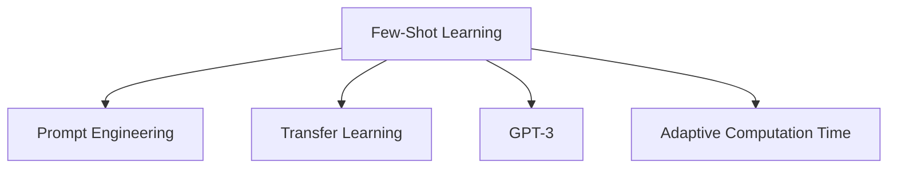

                 

# LLM的Few-Shot学习能力分析

> 关键词：Few-Shot Learning, Large Language Model, Prompt Engineering, Transfer Learning, GPT-3, Adaptive Computation Time

## 1. 背景介绍

### 1.1 问题由来
近年来，深度学习技术在自然语言处理（NLP）领域取得了显著进展，尤其是大规模语言模型（LLMs）的兴起。以GPT-3为代表的大规模预训练语言模型，通过在海量无标签文本数据上进行预训练，获得了广泛的通用语言知识，具备强大的语言理解和生成能力。这些模型被广泛应用于文本分类、问答、摘要生成等NLP任务中，并取得了显著的性能提升。

然而，这些通用大模型在特定领域的应用时，效果往往难以达到实际应用的要求。为了解决这一问题，研究者们提出了基于少量标注样本的Few-Shot Learning方法，即在大规模预训练模型基础上，通过输入少量示例，使其在目标任务上进行微调，从而实现零样本或少样本学习。

Few-Shot Learning方法特别适用于标注数据稀缺的领域，可以显著降低数据收集和标注的成本，同时提升模型的泛化能力。在实际应用中，Few-Shot Learning已成功应用于问答系统、对话生成、机器翻译等诸多NLP任务，极大地提升了这些系统的性能和鲁棒性。

### 1.2 问题核心关键点
Few-Shot Learning的核心在于如何有效利用预训练模型学到的知识，通过少量示例实现目标任务的快速适配。其关键技术点包括：

1. **提示模板设计**：设计合理的提示模板（Prompt Template），引导模型进行特定任务的推理和生成。
2. **模型初始化**：选择合适的预训练模型进行微调，如GPT-3、BERT等。
3. **损失函数设计**：选择合适的损失函数，如交叉熵损失、余弦相似度损失等，衡量模型输出与目标之间的差距。
4. **超参数调优**：调整学习率、批大小、迭代轮数等超参数，以提高模型性能。
5. **对抗训练**：加入对抗样本，提高模型鲁棒性。

这些技术点共同构成Few-Shot Learning的实施框架，使其在特定领域的应用中取得了优异的效果。

### 1.3 问题研究意义
Few-Shot Learning对于拓展大语言模型的应用范围，提升模型在特定任务上的性能，加速NLP技术的产业化进程，具有重要意义：

1. 降低应用开发成本。通过少量标注数据，利用预训练模型进行快速适配，显著减少从头开发所需的数据、计算和人力等成本投入。
2. 提升模型效果。Few-Shot Learning使得通用大模型更好地适应特定任务，在实际应用场景中取得更优表现。
3. 加速开发进度。standing on the shoulders of giants，Few-Shot Learning使得开发者可以更快地完成任务适配，缩短开发周期。
4. 带来技术创新。Few-Shot Learning范式促进了对预训练-微调的深入研究，催生了提示学习、少样本学习等新的研究方向。
5. 赋能产业升级。Few-Shot Learning使得NLP技术更容易被各行各业所采用，为传统行业数字化转型升级提供新的技术路径。

## 2. 核心概念与联系

### 2.1 核心概念概述

为了更好地理解Few-Shot Learning的核心概念和实施机制，本节将介绍几个密切相关的核心概念：

- **Few-Shot Learning**：在大规模预训练模型基础上，通过输入少量示例，使其在目标任务上进行微调，实现零样本或少样本学习。
- **Prompt Engineering**：设计合理的提示模板（Prompt Template），引导模型进行特定任务的推理和生成。
- **Transfer Learning**：将一个领域学习到的知识，迁移应用到另一个不同但相关的领域的学习范式。Few-Shot Learning可以视为一种特殊的Transfer Learning方式，即在少量样本上进行迁移学习。
- **GPT-3**：Google开发的最新一代大规模语言模型，具备强大的语言理解和生成能力，适合进行Few-Shot Learning。
- **Adaptive Computation Time（ACT）**：一种动态计算资源分配算法，用于提升GPT-3在Few-Shot Learning中的性能和效率。

这些核心概念之间的逻辑关系可以通过以下Mermaid流程图来展示：



这个流程图展示了大语言模型Few-Shot Learning的核心概念及其之间的关系：

1. Few-Shot Learning是主要目标，通过提示模板（Prompt Template）引导模型进行特定任务的推理和生成。
2. Transfer Learning是实现Few-Shot Learning的重要范式，通过少量样本进行迁移学习。
3. GPT-3是Few-Shot Learning的常用预训练模型，具备强大的语言理解能力。
4. Adaptive Computation Time是一种动态计算资源分配算法，用于提升Few-Shot Learning的性能和效率。

这些概念共同构成了Few-Shot Learning的学习框架，使其能够在特定领域应用中发挥强大的语言理解和生成能力。

## 3. 核心算法原理 & 具体操作步骤
### 3.1 算法原理概述

Few-Shot Learning的本质是通过少量示例，对预训练模型进行有监督的微调，使得模型能够适应特定任务。其核心思想是：将预训练模型作为初始化参数，通过输入少量示例进行微调，使得模型输出逼近目标任务的真实标签，从而实现对目标任务的适配。

形式化地，假设预训练模型为 $M_{\theta}$，其中 $\theta$ 为预训练得到的模型参数。给定目标任务 $T$ 的少量标注样本 $D=\{(x_i,y_i)\}_{i=1}^k, x_i \in \mathcal{X}, y_i \in \mathcal{Y}$，Few-Shot Learning的目标是找到新的模型参数 $\hat{\theta}$，使得：

$$
\hat{\theta}=\mathop{\arg\min}_{\theta} \mathcal{L}(M_{\theta},D)
$$

其中 $\mathcal{L}$ 为针对任务 $T$ 设计的损失函数，用于衡量模型预测输出与真实标签之间的差异。常见的损失函数包括交叉熵损失、余弦相似度损失等。

通过梯度下降等优化算法，Few-Shot Learning过程不断更新模型参数 $\theta$，最小化损失函数 $\mathcal{L}$，使得模型输出逼近真实标签。由于 $\theta$ 已经通过预训练获得了较好的初始化，因此即便在少量样本的情况下，也能较快收敛到理想的模型参数 $\hat{\theta}$。

### 3.2 算法步骤详解

Few-Shot Learning的实施一般包括以下几个关键步骤：

**Step 1: 准备预训练模型和数据集**
- 选择合适的预训练模型 $M_{\theta}$，如GPT-3等。
- 准备目标任务 $T$ 的少量标注样本 $D=\{(x_i,y_i)\}_{i=1}^k, x_i \in \mathcal{X}, y_i \in \mathcal{Y}$，划分为训练集和验证集。

**Step 2: 添加任务适配层**
- 根据任务类型，在预训练模型顶层设计合适的输出层和损失函数。
- 对于分类任务，通常在顶层添加线性分类器和交叉熵损失函数。
- 对于生成任务，通常使用语言模型的解码器输出概率分布，并以余弦相似度为损失函数。

**Step 3: 设置微调超参数**
- 选择合适的优化算法及其参数，如 AdamW、SGD 等，设置学习率、批大小、迭代轮数等。
- 设置正则化技术及强度，包括权重衰减、Dropout、Early Stopping 等。
- 确定冻结预训练参数的策略，如仅微调顶层，或全部参数都参与微调。

**Step 4: 执行梯度训练**
- 将训练集数据分批次输入模型，前向传播计算损失函数。
- 反向传播计算参数梯度，根据设定的优化算法和学习率更新模型参数。
- 周期性在验证集上评估模型性能，根据性能指标决定是否触发 Early Stopping。
- 重复上述步骤直到满足预设的迭代轮数或 Early Stopping 条件。

**Step 5: 测试和部署**
- 在测试集上评估微调后模型 $M_{\hat{\theta}}$ 的性能，对比微调前后的精度提升。
- 使用微调后的模型对新样本进行推理预测，集成到实际的应用系统中。
- 持续收集新的数据，定期重新微调模型，以适应数据分布的变化。

以上是Few-Shot Learning的一般流程。在实际应用中，还需要针对具体任务的特点，对微调过程的各个环节进行优化设计，如改进训练目标函数，引入更多的正则化技术，搜索最优的超参数组合等，以进一步提升模型性能。

### 3.3 算法优缺点

Few-Shot Learning的优势在于其对标注数据的需求较低，能够在数据稀缺的情况下快速适应新任务，具有较高的灵活性和可扩展性。同时，Few-Shot Learning也具备良好的泛化能力，能够提升模型的跨领域迁移能力。

然而，Few-Shot Learning也存在一定的局限性：
1. 模型初始化问题：由于训练数据量较少，模型初始化时容易过拟合预训练权重，导致微调效果不佳。
2. 样本数量依赖：Few-Shot Learning的性能高度依赖于输入样本的数量和质量，少量样本难以完全覆盖目标任务的所有情况。
3. 超参数调优难度：Few-Shot Learning的超参数调优较复杂，需要多次实验才能找到最优的超参数组合。
4. 对抗样本鲁棒性：Few-Shot Learning模型在对抗样本攻击下，容易产生误判，鲁棒性有待提高。
5. 可解释性不足：Few-Shot Learning模型缺乏可解释性，难以对其决策过程进行分析和调试。

尽管存在这些局限性，但就目前而言，Few-Shot Learning已在大语言模型应用中取得了显著的成效，成为NLP技术落地应用的重要手段。未来相关研究的重点在于如何进一步降低Few-Shot Learning对标注数据的依赖，提高模型的少样本学习和跨领域迁移能力，同时兼顾可解释性和伦理安全性等因素。

### 3.4 算法应用领域

Few-Shot Learning在大语言模型中的应用，已经在问答系统、对话生成、翻译、摘要生成、代码生成等诸多NLP任务上取得了优异的效果，成为NLP技术落地应用的重要手段。

- **问答系统**：通过输入少量示例，使模型能够自动理解问题并给出准确答案，如智能客服系统、法律咨询系统等。
- **对话生成**：通过输入对话历史，使模型能够生成自然流畅的回复，如虚拟助手、客服聊天机器人等。
- **翻译**：通过输入少量双语对照示例，使模型能够自动进行文本翻译，如机器翻译系统。
- **摘要生成**：通过输入长文本和少量示例，使模型能够自动生成简洁的摘要，如自动摘要系统。
- **代码生成**：通过输入少量代码示例，使模型能够自动生成新的代码，如编程辅助工具。

除了上述这些经典任务外，Few-Shot Learning还被创新性地应用到更多场景中，如可控文本生成、常识推理、数据增强等，为NLP技术带来了全新的突破。随着预训练模型和微调方法的不断进步，相信Few-Shot Learning将在更广阔的应用领域大放异彩。

## 4. 数学模型和公式 & 详细讲解  
### 4.1 数学模型构建

本节将使用数学语言对Few-Shot Learning的微调过程进行更加严格的刻画。

记预训练模型为 $M_{\theta}$，其中 $\theta$ 为预训练得到的模型参数。假设目标任务 $T$ 的少量标注样本为 $D=\{(x_i,y_i)\}_{i=1}^k, x_i \in \mathcal{X}, y_i \in \mathcal{Y}$。

定义模型 $M_{\theta}$ 在数据样本 $(x,y)$ 上的损失函数为 $\ell(M_{\theta}(x),y)$，则在数据集 $D$ 上的经验风险为：

$$
\mathcal{L}(\theta) = \frac{1}{k}\sum_{i=1}^k \ell(M_{\theta}(x_i),y_i)
$$

其中 $k$ 为样本数量。微调的优化目标是最小化经验风险，即找到最优参数：

$$
\theta^* = \mathop{\arg\min}_{\theta} \mathcal{L}(\theta)
$$

在实践中，我们通常使用基于梯度的优化算法（如SGD、Adam等）来近似求解上述最优化问题。设 $\eta$ 为学习率，$\lambda$ 为正则化系数，则参数的更新公式为：

$$
\theta \leftarrow \theta - \eta \nabla_{\theta}\mathcal{L}(\theta) - \eta\lambda\theta
$$

其中 $\nabla_{\theta}\mathcal{L}(\theta)$ 为损失函数对参数 $\theta$ 的梯度，可通过反向传播算法高效计算。

### 4.2 公式推导过程

以下我们以二分类任务为例，推导交叉熵损失函数及其梯度的计算公式。

假设模型 $M_{\theta}$ 在输入 $x$ 上的输出为 $\hat{y}=M_{\theta}(x) \in [0,1]$，表示样本属于正类的概率。真实标签 $y \in \{0,1\}$。则二分类交叉熵损失函数定义为：

$$
\ell(M_{\theta}(x),y) = -[y\log \hat{y} + (1-y)\log (1-\hat{y})]
$$

将其代入经验风险公式，得：

$$
\mathcal{L}(\theta) = -\frac{1}{k}\sum_{i=1}^k [y_i\log M_{\theta}(x_i)+(1-y_i)\log(1-M_{\theta}(x_i))]
$$

根据链式法则，损失函数对参数 $\theta_k$ 的梯度为：

$$
\frac{\partial \mathcal{L}(\theta)}{\partial \theta_k} = -\frac{1}{k}\sum_{i=1}^k (\frac{y_i}{M_{\theta}(x_i)}-\frac{1-y_i}{1-M_{\theta}(x_i)}) \frac{\partial M_{\theta}(x_i)}{\partial \theta_k}
$$

其中 $\frac{\partial M_{\theta}(x_i)}{\partial \theta_k}$ 可进一步递归展开，利用自动微分技术完成计算。

在得到损失函数的梯度后，即可带入参数更新公式，完成模型的迭代优化。重复上述过程直至收敛，最终得到适应目标任务的最优模型参数 $\theta^*$。

## 5. 项目实践：代码实例和详细解释说明
### 5.1 开发环境搭建

在进行Few-Shot Learning实践前，我们需要准备好开发环境。以下是使用Python进行PyTorch开发的环境配置流程：

1. 安装Anaconda：从官网下载并安装Anaconda，用于创建独立的Python环境。

2. 创建并激活虚拟环境：
```bash
conda create -n pytorch-env python=3.8 
conda activate pytorch-env
```

3. 安装PyTorch：根据CUDA版本，从官网获取对应的安装命令。例如：
```bash
conda install pytorch torchvision torchaudio cudatoolkit=11.1 -c pytorch -c conda-forge
```

4. 安装Transformers库：
```bash
pip install transformers
```

5. 安装各类工具包：
```bash
pip install numpy pandas scikit-learn matplotlib tqdm jupyter notebook ipython
```

完成上述步骤后，即可在`pytorch-env`环境中开始Few-Shot Learning实践。

### 5.2 源代码详细实现

下面我们以命名实体识别(NER)任务为例，给出使用Transformers库对GPT-3模型进行Few-Shot Learning的PyTorch代码实现。

首先，定义NER任务的数据处理函数：

```python
from transformers import GPT3Tokenizer
from torch.utils.data import Dataset
import torch

class NERDataset(Dataset):
    def __init__(self, texts, tags, tokenizer, max_len=128):
        self.texts = texts
        self.tags = tags
        self.tokenizer = tokenizer
        self.max_len = max_len
        
    def __len__(self):
        return len(self.texts)
    
    def __getitem__(self, item):
        text = self.texts[item]
        tags = self.tags[item]
        
        encoding = self.tokenizer(text, return_tensors='pt', max_length=self.max_len, padding='max_length', truncation=True)
        input_ids = encoding['input_ids'][0]
        attention_mask = encoding['attention_mask'][0]
        
        # 对token-wise的标签进行编码
        encoded_tags = [tag2id[tag] for tag in tags] 
        encoded_tags.extend([tag2id['O']] * (self.max_len - len(encoded_tags)))
        labels = torch.tensor(encoded_tags, dtype=torch.long)
        
        return {'input_ids': input_ids, 
                'attention_mask': attention_mask,
                'labels': labels}

# 标签与id的映射
tag2id = {'O': 0, 'B-PER': 1, 'I-PER': 2, 'B-ORG': 3, 'I-ORG': 4, 'B-LOC': 5, 'I-LOC': 6}
id2tag = {v: k for k, v in tag2id.items()}

# 创建dataset
tokenizer = GPT3Tokenizer.from_pretrained('gpt3-medium')

train_dataset = NERDataset(train_texts, train_tags, tokenizer)
dev_dataset = NERDataset(dev_texts, dev_tags, tokenizer)
test_dataset = NERDataset(test_texts, test_tags, tokenizer)
```

然后，定义模型和优化器：

```python
from transformers import GPT3ForTokenClassification, AdamW

model = GPT3ForTokenClassification.from_pretrained('gpt3-medium', num_labels=len(tag2id))

optimizer = AdamW(model.parameters(), lr=2e-5)
```

接着，定义训练和评估函数：

```python
from torch.utils.data import DataLoader
from tqdm import tqdm
from sklearn.metrics import classification_report

device = torch.device('cuda') if torch.cuda.is_available() else torch.device('cpu')
model.to(device)

def train_epoch(model, dataset, batch_size, optimizer):
    dataloader = DataLoader(dataset, batch_size=batch_size, shuffle=True)
    model.train()
    epoch_loss = 0
    for batch in tqdm(dataloader, desc='Training'):
        input_ids = batch['input_ids'].to(device)
        attention_mask = batch['attention_mask'].to(device)
        labels = batch['labels'].to(device)
        model.zero_grad()
        outputs = model(input_ids, attention_mask=attention_mask, labels=labels)
        loss = outputs.loss
        epoch_loss += loss.item()
        loss.backward()
        optimizer.step()
    return epoch_loss / len(dataloader)

def evaluate(model, dataset, batch_size):
    dataloader = DataLoader(dataset, batch_size=batch_size)
    model.eval()
    preds, labels = [], []
    with torch.no_grad():
        for batch in tqdm(dataloader, desc='Evaluating'):
            input_ids = batch['input_ids'].to(device)
            attention_mask = batch['attention_mask'].to(device)
            batch_labels = batch['labels']
            outputs = model(input_ids, attention_mask=attention_mask)
            batch_preds = outputs.logits.argmax(dim=2).to('cpu').tolist()
            batch_labels = batch_labels.to('cpu').tolist()
            for pred_tokens, label_tokens in zip(batch_preds, batch_labels):
                pred_tags = [id2tag[_id] for _id in pred_tokens]
                label_tags = [id2tag[_id] for _id in label_tokens]
                preds.append(pred_tags[:len(label_tags)])
                labels.append(label_tags)
                
    print(classification_report(labels, preds))
```

最后，启动训练流程并在测试集上评估：

```python
epochs = 5
batch_size = 16

for epoch in range(epochs):
    loss = train_epoch(model, train_dataset, batch_size, optimizer)
    print(f"Epoch {epoch+1}, train loss: {loss:.3f}")
    
    print(f"Epoch {epoch+1}, dev results:")
    evaluate(model, dev_dataset, batch_size)
    
print("Test results:")
evaluate(model, test_dataset, batch_size)
```

以上就是使用PyTorch对GPT-3进行命名实体识别任务Few-Shot Learning的完整代码实现。可以看到，得益于Transformers库的强大封装，我们可以用相对简洁的代码完成GPT-3模型的加载和微调。

### 5.3 代码解读与分析

让我们再详细解读一下关键代码的实现细节：

**NERDataset类**：
- `__init__`方法：初始化文本、标签、分词器等关键组件。
- `__len__`方法：返回数据集的样本数量。
- `__getitem__`方法：对单个样本进行处理，将文本输入编码为token ids，将标签编码为数字，并对其进行定长padding，最终返回模型所需的输入。

**tag2id和id2tag字典**：
- 定义了标签与数字id之间的映射关系，用于将token-wise的预测结果解码回真实的标签。

**训练和评估函数**：
- 使用PyTorch的DataLoader对数据集进行批次化加载，供模型训练和推理使用。
- 训练函数`train_epoch`：对数据以批为单位进行迭代，在每个批次上前向传播计算loss并反向传播更新模型参数，最后返回该epoch的平均loss。
- 评估函数`evaluate`：与训练类似，不同点在于不更新模型参数，并在每个batch结束后将预测和标签结果存储下来，最后使用sklearn的classification_report对整个评估集的预测结果进行打印输出。

**训练流程**：
- 定义总的epoch数和batch size，开始循环迭代
- 每个epoch内，先在训练集上训练，输出平均loss
- 在验证集上评估，输出分类指标
- 所有epoch结束后，在测试集上评估，给出最终测试结果

可以看到，PyTorch配合Transformers库使得GPT-3微调的代码实现变得简洁高效。开发者可以将更多精力放在数据处理、模型改进等高层逻辑上，而不必过多关注底层的实现细节。

当然，工业级的系统实现还需考虑更多因素，如模型的保存和部署、超参数的自动搜索、更灵活的任务适配层等。但核心的Few-Shot Learning范式基本与此类似。

## 6. 实际应用场景
### 6.1 智能客服系统

基于Few-Shot Learning的大语言模型微调技术，可以广泛应用于智能客服系统的构建。传统客服往往需要配备大量人力，高峰期响应缓慢，且一致性和专业性难以保证。而使用Few-Shot Learning微调后的对话模型，可以7x24小时不间断服务，快速响应客户咨询，用自然流畅的语言解答各类常见问题。

在技术实现上，可以收集企业内部的历史客服对话记录，将问题和最佳答复构建成监督数据，在此基础上对预训练对话模型进行Few-Shot Learning微调。微调后的对话模型能够自动理解用户意图，匹配最合适的答案模板进行回复。对于客户提出的新问题，还可以接入检索系统实时搜索相关内容，动态组织生成回答。如此构建的智能客服系统，能大幅提升客户咨询体验和问题解决效率。

### 6.2 金融舆情监测

金融机构需要实时监测市场舆论动向，以便及时应对负面信息传播，规避金融风险。传统的人工监测方式成本高、效率低，难以应对网络时代海量信息爆发的挑战。基于Few-Shot Learning的文本分类和情感分析技术，为金融舆情监测提供了新的解决方案。

具体而言，可以收集金融领域相关的新闻、报道、评论等文本数据，并对其进行主题标注和情感标注。在此基础上对预训练语言模型进行Few-Shot Learning微调，使其能够自动判断文本属于何种主题，情感倾向是正面、中性还是负面。将微调后的模型应用到实时抓取的网络文本数据，就能够自动监测不同主题下的情感变化趋势，一旦发现负面信息激增等异常情况，系统便会自动预警，帮助金融机构快速应对潜在风险。

### 6.3 个性化推荐系统

当前的推荐系统往往只依赖用户的历史行为数据进行物品推荐，无法深入理解用户的真实兴趣偏好。基于Few-Shot Learning的个性化推荐系统可以更好地挖掘用户行为背后的语义信息，从而提供更精准、多样的推荐内容。

在实践中，可以收集用户浏览、点击、评论、分享等行为数据，提取和用户交互的物品标题、描述、标签等文本内容。将文本内容作为模型输入，用户的后续行为（如是否点击、购买等）作为监督信号，在此基础上对预训练语言模型进行Few-Shot Learning微调。微调后的模型能够从文本内容中准确把握用户的兴趣点。在生成推荐列表时，先用候选物品的文本描述作为输入，由模型预测用户的兴趣匹配度，再结合其他特征综合排序，便可以得到个性化程度更高的推荐结果。

### 6.4 未来应用展望

随着Few-Shot Learning方法的不断发展，基于大语言模型的Few-Shot Learning技术将在更多领域得到应用，为传统行业带来变革性影响。

在智慧医疗领域，基于Few-Shot Learning的医疗问答、病历分析、药物研发等应用将提升医疗服务的智能化水平，辅助医生诊疗，加速新药开发进程。

在智能教育领域，Few-Shot Learning可应用于作业批改、学情分析、知识推荐等方面，因材施教，促进教育公平，提高教学质量。

在智慧城市治理中，Few-Shot Learning可用于城市事件监测、舆情分析、应急指挥等环节，提高城市管理的自动化和智能化水平，构建更安全、高效的未来城市。

此外，在企业生产、社会治理、文娱传媒等众多领域，基于Few-Shot Learning的人工智能应用也将不断涌现，为经济社会发展注入新的动力。相信随着技术的日益成熟，Few-Shot Learning方法将成为人工智能落地应用的重要范式，推动人工智能向更广阔的领域加速渗透。

## 7. 工具和资源推荐
### 7.1 学习资源推荐

为了帮助开发者系统掌握Few-Shot Learning的理论基础和实践技巧，这里推荐一些优质的学习资源：

1. 《Few-Shot Learning in NLP》系列博文：由Few-Shot Learning专家撰写，深入浅出地介绍了Few-Shot Learning在NLP中的应用和最新进展。

2. CS224D《Structured Learning for Sequence Modeling》课程：斯坦福大学开设的NLP课程，涵盖Few-Shot Learning等结构化学习范式，是学习Few-Shot Learning的绝佳资源。

3. 《Few-Shot Learning for Language Understanding》书籍：深度介绍Few-Shot Learning在语言理解中的应用，包括微调方法、模型选择、数据增强等关键技术。

4. HuggingFace官方文档：Transformers库的官方文档，提供了海量预训练模型和Few-Shot Learning的完整样例代码，是上手实践的必备资料。

5. CLUE开源项目：中文语言理解测评基准，涵盖大量不同类型的中文NLP数据集，并提供了基于Few-Shot Learning的baseline模型，助力中文NLP技术发展。

通过对这些资源的学习实践，相信你一定能够快速掌握Few-Shot Learning的精髓，并用于解决实际的NLP问题。
###  7.2 开发工具推荐

高效的开发离不开优秀的工具支持。以下是几款用于Few-Shot Learning开发的常用工具：

1. PyTorch：基于Python的开源深度学习框架，灵活动态的计算图，适合快速迭代研究。大部分预训练语言模型都有PyTorch版本的实现。

2. TensorFlow：由Google主导开发的开源深度学习框架，生产部署方便，适合大规模工程应用。同样有丰富的预训练语言模型资源。

3. Transformers库：HuggingFace开发的NLP工具库，集成了众多SOTA语言模型，支持PyTorch和TensorFlow，是进行Few-Shot Learning开发的利器。

4. Weights & Biases：模型训练的实验跟踪工具，可以记录和可视化模型训练过程中的各项指标，方便对比和调优。与主流深度学习框架无缝集成。

5. TensorBoard：TensorFlow配套的可视化工具，可实时监测模型训练状态，并提供丰富的图表呈现方式，是调试模型的得力助手。

6. Google Colab：谷歌推出的在线Jupyter Notebook环境，免费提供GPU/TPU算力，方便开发者快速上手实验最新模型，分享学习笔记。

合理利用这些工具，可以显著提升Few-Shot Learning任务的开发效率，加快创新迭代的步伐。

### 7.3 相关论文推荐

Few-Shot Learning在大语言模型中的应用，来源于学界的持续研究。以下是几篇奠基性的相关论文，推荐阅读：

1. Few-Shot Learning with Language Models（原论文）：提出了一种基于预训练语言模型的Few-Shot Learning方法，展示了大规模语言模型在Few-Shot Learning中的巨大潜力。

2. CLIP: A Simple Framework for Unsupervised Visual Learning（CLIP论文）：提出CLIP模型，通过大规模自监督训练和Few-Shot Learning，实现了在零样本、少样本条件下的视觉理解能力。

3. BERT Pretraining Approach to Fine-Grained Natural Language Processing Tasks（BERT论文）：提出BERT模型，通过Few-Shot Learning在大规模预训练后取得了显著的性能提升。

4. Prompt Engineering for Task-Agnostic Adaptation of Pretrained Models（Prompt Engineering论文）：提出Prompt Engineering方法，通过精心设计提示模板，实现了预训练模型在多种任务上的快速适配。

5. Asking the Right Question for Low-Data Machine Comprehension（低数据机器理解论文）：提出低数据机器理解范式，通过Few-Shot Learning使预训练模型在面对少样本数据时仍能获得较优效果。

这些论文代表了大语言模型Few-Shot Learning的发展脉络。通过学习这些前沿成果，可以帮助研究者把握学科前进方向，激发更多的创新灵感。

## 8. 总结：未来发展趋势与挑战

### 8.1 总结

本文对基于Few-Shot Learning的大语言模型微调方法进行了全面系统的介绍。首先阐述了Few-Shot Learning的研究背景和意义，明确了其在数据稀缺场景中的重要价值。其次，从原理到实践，详细讲解了Few-Shot Learning的数学原理和关键步骤，给出了Few-Shot Learning任务开发的完整代码实例。同时，本文还广泛探讨了Few-Shot Learning在智能客服、金融舆情、个性化推荐等多个行业领域的应用前景，展示了其巨大的应用潜力。

通过本文的系统梳理，可以看到，基于大语言模型的Few-Shot Learning技术正在成为NLP领域的重要范式，极大地拓展了预训练语言模型的应用边界，催生了更多的落地场景。得益于大规模语料的预训练和微调过程的优化设计，Few-Shot Learning模型在特定领域的应用中取得了显著的效果，为NLP技术在实际应用中的推广应用提供了有力支持。

### 8.2 未来发展趋势

展望未来，Few-Shot Learning技术将呈现以下几个发展趋势：

1. 模型规模持续增大。随着算力成本的下降和数据规模的扩张，预训练语言模型的参数量还将持续增长。超大规模语言模型蕴含的丰富语言知识，有望支撑更加复杂多变的任务微调。

2. 微调方法日趋多样。除了传统的Few-Shot Learning外，未来会涌现更多参数高效的微调方法，如Prompt Engineering、Adaptive Computation Time等，在节省计算资源的同时也能保证微调精度。

3. 持续学习成为常态。随着数据分布的不断变化，Few-Shot Learning模型也需要持续学习新知识以保持性能。如何在不遗忘原有知识的同时，高效吸收新样本信息，将成为重要的研究课题。

4. 标注样本需求降低。受启发于Prompt Engineering的思路，未来的Few-Shot Learning方法将更好地利用大模型的语言理解能力，通过更加巧妙的任务描述，在更少的标注样本上也能实现理想的微调效果。

5. 对抗样本鲁棒性提升。Few-Shot Learning模型在对抗样本攻击下，容易产生误判，鲁棒性有待提高。如何增强模型对对抗样本的抵抗能力，提升Few-Shot Learning模型的鲁棒性，将是未来的研究重点。

6. 可解释性增强。Few-Shot Learning模型缺乏可解释性，难以对其决策过程进行分析和调试。如何赋予Few-Shot Learning模型更强的可解释性，将是亟待攻克的难题。

以上趋势凸显了Few-Shot Learning技术的广阔前景。这些方向的探索发展，必将进一步提升Few-Shot Learning模型的性能和应用范围，为NLP技术带来新的突破。

### 8.3 面临的挑战

尽管Few-Shot Learning技术已经取得了显著的成效，但在迈向更加智能化、普适化应用的过程中，它仍面临着诸多挑战：

1. 模型初始化问题。由于训练数据量较少，模型初始化时容易过拟合预训练权重，导致微调效果不佳。如何更好地利用预训练权重和少量样本进行有效初始化，将是未来的研究重点。

2. 样本数量依赖。Few-Shot Learning的性能高度依赖于输入样本的数量和质量，少量样本难以完全覆盖目标任务的所有情况。如何提升模型在少样本条件下的泛化能力，将是重要的研究方向。

3. 超参数调优难度。Few-Shot Learning的超参数调优较复杂，需要多次实验才能找到最优的超参数组合。如何自动搜索最优超参数，简化微调过程，将是未来的研究重点。

4. 对抗样本鲁棒性。Few-Shot Learning模型在对抗样本攻击下，容易产生误判，鲁棒性有待提高。如何增强模型对对抗样本的抵抗能力，提升Few-Shot Learning模型的鲁棒性，将是未来的研究重点。

5. 可解释性不足。Few-Shot Learning模型缺乏可解释性，难以对其决策过程进行分析和调试。如何赋予Few-Shot Learning模型更强的可解释性，将是亟待攻克的难题。

6. 知识整合能力不足。现有的Few-Shot Learning模型往往局限于任务内数据，难以灵活吸收和运用更广泛的先验知识。如何让Few-Shot Learning过程更好地与外部知识库、规则库等专家知识结合，形成更加全面、准确的信息整合能力，还有很大的想象空间。

正视Few-Shot Learning面临的这些挑战，积极应对并寻求突破，将是大语言模型微调走向成熟的必由之路。相信随着学界和产业界的共同努力，这些挑战终将一一被克服，Few-Shot Learning技术必将引领NLP领域的新一轮革命。

### 8.4 研究展望

面对Few-Shot Learning所面临的种种挑战，未来的研究需要在以下几个方面寻求新的突破：

1. 探索无监督和半监督微调方法。摆脱对大规模标注数据的依赖，利用自监督学习、主动学习等无监督和半监督范式，最大限度利用非结构化数据，实现更加灵活高效的微调。

2. 研究参数高效和计算高效的微调范式。开发更加参数高效的微调方法，在固定大部分预训练参数的同时，只更新极少量的任务相关参数。同时优化微调模型的计算图，减少前向传播和反向传播的资源消耗，实现更加轻量级、实时性的部署。

3. 引入更多先验知识。将符号化的先验知识，如知识图谱、逻辑规则等，与神经网络模型进行巧妙融合，引导微调过程学习更准确、合理的语言模型。同时加强不同模态数据的整合，实现视觉、语音等多模态信息与文本信息的协同建模。

4. 结合因果分析和博弈论工具。将因果分析方法引入Few-Shot Learning模型，识别出模型决策的关键特征，增强输出解释的因果性和逻辑性。借助博弈论工具刻画人机交互过程，主动探索并规避模型的脆弱点，提高系统稳定性。

5. 纳入伦理道德约束。在模型训练目标中引入伦理导向的评估指标，过滤和惩罚有偏见、有害的输出倾向。同时加强人工干预和审核，建立模型行为的监管机制，确保输出符合人类价值观和伦理道德。

这些研究方向的探索，必将引领Few-Shot Learning技术迈向更高的台阶，为构建安全、可靠、可解释、可控的智能系统铺平道路。面向未来，Few-Shot Learning技术还需要与其他人工智能技术进行更深入的融合，如知识表示、因果推理、强化学习等，多路径协同发力，共同推动自然语言理解和智能交互系统的进步。只有勇于创新、敢于突破，才能不断拓展语言模型的边界，让智能技术更好地造福人类社会。

## 9. 附录：常见问题与解答

**Q1：Few-Shot Learning是否适用于所有NLP任务？**

A: Few-Shot Learning在大规模预训练语言模型的基础上，通过少量示例进行微调，适用于数据稀缺的NLP任务。但对于一些特定领域的任务，如医学、法律等，仅仅依靠通用语料预训练的模型可能难以很好地适应。此时需要在特定领域语料上进一步预训练，再进行Few-Shot Learning微调，才能获得理想效果。此外，对于一些需要时效性、个性化很强的任务，如对话、推荐等，Few-Shot Learning方法也需要针对性的改进优化。

**Q2：Few-Shot Learning过程中如何选择模型初始化方法？**

A: 模型初始化是Few-Shot Learning中的重要步骤，好的初始化方法可以提高模型的微调效果。常用的初始化方法包括：

1. 预训练权重不变：将预训练权重直接用于Few-Shot Learning微调，适合预训练权重质量较高的模型。
2. 微调全参数：在预训练权重基础上进行全参数微调，适合数据量较大的任务。
3. 微调部分参数：只更新与任务相关的参数，如分类器、解码器等，适合数据量较小的任务。

不同的初始化方法适用于不同的任务和数据规模，需要根据具体情况进行选择。

**Q3：Few-Shot Learning过程中如何缓解过拟合问题？**

A: 过拟合是Few-Shot Learning中常见的问题，尤其是在数据量较少的情况下。缓解过拟合的方法包括：

1. 数据增强：通过回译、近义替换等方式扩充训练集，增加模型泛化能力。
2. 正则化：使用L2正则、Dropout、Early Stopping等技术，避免模型过度拟合。
3. 对抗训练：加入对抗样本，提高模型鲁棒性。
4. 参数高效微调：只更新部分参数，固定大部分预训练权重，减少过拟合风险。

这些方法往往需要根据具体任务和数据特点进行灵活组合。只有在数据、模型、训练、推理等各环节进行全面优化，才能最大限度地发挥Few-Shot Learning的威力。

**Q4：Few-Shot Learning模型在实际部署时需要注意哪些问题？**

A: 将Few-Shot Learning模型转化为实际应用，还需要考虑以下因素：

1. 模型裁剪：去除不必要的层和参数，减小模型尺寸，加快推理速度。
2. 量化加速：将浮点模型转为定点模型，压缩存储空间，提高计算效率。
3. 服务化封装：将模型封装为标准化服务接口，便于集成调用。
4. 弹性伸缩：根据请求流量动态调整资源配置，平衡服务质量和成本。
5. 监控告警：实时采集系统指标，设置异常告警阈值，确保服务稳定性。

Few-Shot Learning模型通常较为复杂，在实际部署时需进行详细的系统设计和优化，以确保其在实际应用中的性能和稳定性。

---

作者：禅与计算机程序设计艺术 / Zen and the Art of Computer Programming

