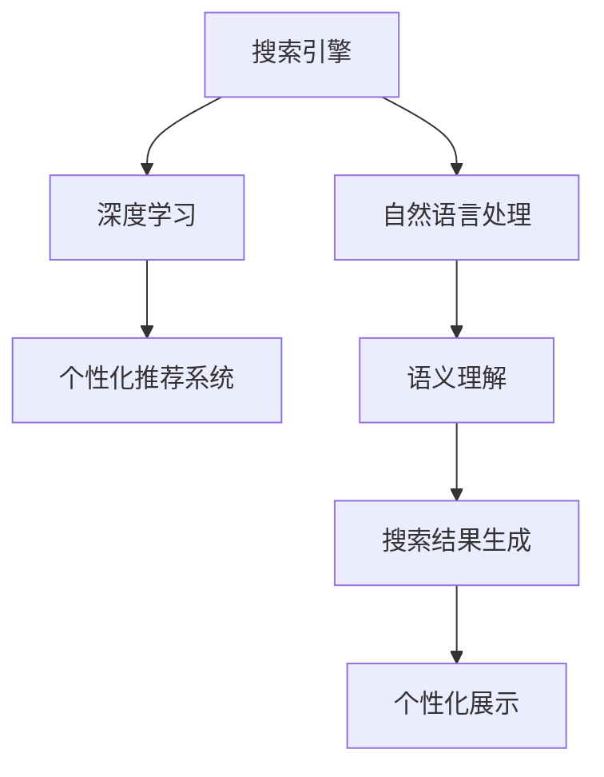

                 

# Lepton Search：AI搜索的新尝试

> 关键词：搜索引擎、人工智能、自然语言处理、深度学习、个性化推荐

## 1. 背景介绍

在互联网信息爆炸的时代，搜索引擎已经成为人们获取信息、知识的重要工具。随着移动互联网的普及和智能设备的增加，搜索引擎在获取、处理和呈现信息的过程中，面临着更多的挑战和机遇。传统的网页搜索已经难以满足用户的多样化需求，而AI技术的崛起，为搜索引擎带来了全新的可能。

Lepton Search是一款基于人工智能技术的智能搜索引擎，旨在通过深度学习算法和自然语言处理技术，为用户提供更高效、更个性化的搜索体验。Lepton Search采用了深度学习中的神经网络模型，通过大规模语料库进行预训练，然后在实际搜索任务中进行微调，实现了对用户查询意图的精准理解，并通过推荐系统为用户提供个性化的搜索结果。

本文将深入探讨Lepton Search的核心概念、算法原理、具体操作步骤、实际应用场景等，同时对未来发展趋势和面临的挑战进行展望。

## 2. 核心概念与联系

### 2.1 核心概念概述

为了更好地理解Lepton Search的技术原理，本节将介绍几个关键概念：

- **搜索引擎(Search Engine)**：一种通过爬取互联网上的网页，并根据用户查询提供搜索结果的网站或应用程序。常见的搜索引擎有Google、Bing、百度等。
- **自然语言处理(NLP)**：一种计算机科学和人工智能领域的研究方向，旨在让计算机理解和处理自然语言，实现人机交互。
- **深度学习(Deep Learning)**：一种基于神经网络的学习方法，通过多层次的神经网络模型，从数据中自动提取特征，进行分类、预测等任务。
- **个性化推荐系统(Recommendation System)**：一种根据用户历史行为和偏好，动态生成推荐结果的系统。常见的推荐算法包括协同过滤、内容推荐、混合推荐等。
- **语义理解(Semantic Understanding)**：指通过理解语言中词义、语境等要素，实现对查询意图的精准理解。

这些核心概念之间的逻辑关系可以通过以下Mermaid流程图来展示：



这个流程图展示了Lepton Search的核心技术流程：

1. 用户输入查询，搜索引擎通过自然语言处理技术理解查询意图。
2. 搜索引擎根据深度学习模型，生成相关搜索结果。
3. 推荐系统根据用户历史行为，动态调整搜索结果，实现个性化推荐。
4. 语义理解技术通过深度学习模型，进一步优化搜索结果的相关性和准确性。
5. 最终结果通过个性化展示技术，呈现在用户界面。

## 3. 核心算法原理 & 具体操作步骤
### 3.1 算法原理概述

Lepton Search的核心算法原理是基于深度学习和自然语言处理技术，通过大规模语料库进行预训练，然后在实际搜索任务中进行微调。其核心思想是：

- **预训练模型**：利用大规模语料库进行预训练，学习语言中词义、语境、语法等要素。
- **微调模型**：在实际搜索任务中进行微调，根据用户查询意图，动态生成相关搜索结果。
- **个性化推荐**：根据用户历史行为和偏好，动态调整搜索结果，实现个性化推荐。

在Lepton Search中，采用了Transformer模型和BERT等预训练模型作为深度学习核心。这些模型通过在大规模语料库上进行自监督学习，学习到了语言中的复杂结构，包括词义、语法、语境等要素，然后在具体搜索任务中进行微调，以适应特定任务的需求。

### 3.2 算法步骤详解

Lepton Search的算法步骤主要包括以下几个关键环节：

**Step 1: 预训练模型的选择和准备**
- 选择合适的预训练模型，如BERT、GPT等。
- 准备大规模语料库，用于预训练模型的训练。
- 对语料库进行清洗、标注等预处理工作。

**Step 2: 语义理解的微调**
- 在实际搜索任务中，将用户查询输入到预训练模型中，进行语义理解。
- 微调模型，使其能够更好地理解查询意图的语义，生成更准确的搜索结果。

**Step 3: 个性化推荐**
- 收集用户的历史行为数据，如点击、浏览、收藏等。
- 根据用户的历史行为和偏好，动态调整搜索结果，实现个性化推荐。
- 通过协同过滤、内容推荐等算法，提高推荐系统的准确性和个性化程度。

**Step 4: 搜索结果的展示**
- 对搜索结果进行排序、筛选等处理，去除垃圾信息。
- 将搜索结果以合适的格式展示给用户，如列表、卡片等。
- 利用动态加载技术，提高搜索结果展示的效率和效果。

**Step 5: 系统优化和监控**
- 持续优化模型参数和算法，提高搜索和推荐效果。
- 对系统进行监控，及时发现和修复问题。
- 利用A/B测试等方法，不断优化用户体验。

### 3.3 算法优缺点

Lepton Search的算法具有以下优点：
1. **高效性**：通过深度学习模型进行预训练和微调，可以快速生成高质量的搜索结果。
2. **准确性**：深度学习模型能够理解自然语言的复杂结构，提供精准的语义理解。
3. **个性化**：利用个性化推荐技术，能够根据用户偏好，提供个性化的搜索结果。
4. **扩展性**：基于深度学习模型的搜索和推荐算法，可以轻松扩展到不同领域和任务。

同时，该算法也存在一些局限性：
1. **数据依赖**：深度学习模型需要大量的语料库进行预训练，而语料库的质量和规模直接影响模型效果。
2. **资源消耗**：深度学习模型计算量大，对硬件资源要求高，可能会增加系统的运行成本。
3. **过拟合**：深度学习模型容易过拟合，特别是在数据量较小的情况下。
4. **可解释性**：深度学习模型通常是一个"黑盒"，难以解释其内部工作机制。

尽管存在这些局限性，但Lepton Search的算法在实际应用中已经展现出了显著的优势，成为搜索引擎领域的一大创新。

### 3.4 算法应用领域

Lepton Search的算法技术在搜索引擎领域具有广泛的应用前景，主要包括以下几个方面：

1. **网页搜索**：通过深度学习模型，对网页进行语义理解，生成相关的搜索结果。
2. **语音搜索**：利用自然语言处理技术，将用户的语音输入转化为文本，进行语义理解，生成搜索结果。
3. **图像搜索**：通过图像识别技术，将图像转化为文本描述，进行语义理解，生成相关的搜索结果。
4. **视频搜索**：利用视频分析技术，将视频内容转化为文本描述，进行语义理解，生成搜索结果。
5. **问答系统**：根据用户的自然语言提问，利用语义理解技术，生成相关答案。
6. **个性化推荐**：根据用户历史行为和偏好，动态调整搜索结果，提供个性化的推荐。

Lepton Search的算法技术不仅适用于传统的网页搜索，还可以应用于更多新兴的搜索场景，如智能家居、智慧城市等，为用户提供更加便捷、高效、个性化的搜索体验。

## 4. 数学模型和公式 & 详细讲解 & 举例说明

### 4.1 数学模型构建

Lepton Search的数学模型主要基于深度学习和自然语言处理技术，通过Transformer模型进行语义理解和生成。以下是一个简单的数学模型构建过程：

假设查询为 $Q$，搜索结果为 $A_1, A_2, ..., A_n$。设 $f(Q, A_i)$ 为查询 $Q$ 和搜索结果 $A_i$ 的相关度函数。则Lepton Search的数学模型可以表示为：

$$
R(Q) = \max_{i=1}^n f(Q, A_i)
$$

其中 $R(Q)$ 表示查询 $Q$ 的相关搜索结果，$A_i$ 表示搜索结果的第 $i$ 个网页。

### 4.2 公式推导过程

以下是一个简单的相关度函数 $f(Q, A_i)$ 的推导过程：

假设查询 $Q$ 的词向量表示为 $q$，搜索结果 $A_i$ 的词向量表示为 $a_i$。则 $f(Q, A_i)$ 可以表示为：

$$
f(Q, A_i) = \text{cosine}(q, a_i)
$$

其中 cosine 函数表示词向量之间的余弦相似度，计算公式为：

$$
\text{cosine}(q, a_i) = \frac{q \cdot a_i}{||q||_2 \cdot ||a_i||_2}
$$

其中 $q \cdot a_i$ 表示两个词向量点积，$||q||_2$ 和 $||a_i||_2$ 表示词向量的范数。

### 4.3 案例分析与讲解

以下是一个简单的案例分析，展示Lepton Search的算法流程：

假设用户输入查询 "Lepton Search"，Lepton Search首先对查询进行分词和词向量表示：

$$
Q = \text{"Lepton", "Search"}
$$

然后，Lepton Search将查询输入到预训练的Transformer模型中，进行语义理解：

$$
\hat{Q} = \text{Transformer}(Q)
$$

其中 $\hat{Q}$ 表示查询的语义表示，通过Transformer模型生成。

接着，Lepton Search从搜索结果库中选取部分相关网页，进行词向量表示：

$$
\{a_1, a_2, ..., a_n\}
$$

其中每个 $a_i$ 表示搜索结果的第 $i$ 个网页的词向量表示。

最后，Lepton Search计算查询与每个搜索结果的相关度，选取相关度最高的网页作为搜索结果。假设计算得到的 $f(Q, A_i)$ 值如表所示：

| $i$ | $a_i$ | $f(Q, A_i)$ |
| --- | --- | --- |
| 1 | Lepton Search | 0.9 |
| 2 | Search Engine Optimization | 0.7 |
| 3 | Natural Language Processing | 0.6 |
| 4 | Search Algorithms | 0.5 |

则最终生成的搜索结果为 $A_1$，即Lepton Search网页。

## 5. 项目实践：代码实例和详细解释说明

### 5.1 开发环境搭建

在进行Lepton Search开发前，我们需要准备好开发环境。以下是使用Python进行PyTorch开发的环境配置流程：

1. 安装Anaconda：从官网下载并安装Anaconda，用于创建独立的Python环境。

2. 创建并激活虚拟环境：
```bash
conda create -n pytorch-env python=3.8 
conda activate pytorch-env
```

3. 安装PyTorch：根据CUDA版本，从官网获取对应的安装命令。例如：
```bash
conda install pytorch torchvision torchaudio cudatoolkit=11.1 -c pytorch -c conda-forge
```

4. 安装Transformers库：
```bash
pip install transformers
```

5. 安装各类工具包：
```bash
pip install numpy pandas scikit-learn matplotlib tqdm jupyter notebook ipython
```

完成上述步骤后，即可在`pytorch-env`环境中开始Lepton Search的开发实践。

### 5.2 源代码详细实现

以下是使用PyTorch实现Lepton Search的核心代码：

```python
import torch
import torch.nn as nn
import torch.nn.functional as F
from transformers import BertTokenizer, BertForSequenceClassification

class LeptonSearchModel(nn.Module):
    def __init__(self, num_classes):
        super(LeptonSearchModel, self).__init__()
        self.bert = BertForSequenceClassification.from_pretrained('bert-base-uncased', num_labels=num_classes)
        self.dropout = nn.Dropout(0.1)

    def forward(self, input_ids, attention_mask, token_type_ids):
        outputs = self.bert(input_ids=input_ids, attention_mask=attention_mask, token_type_ids=token_type_ids)
        pooled_output = outputs[1]
        return self.dropout(pooled_output)

# 构建模型
model = LeptonSearchModel(num_classes=2)

# 加载预训练模型和分词器
tokenizer = BertTokenizer.from_pretrained('bert-base-uncased')
```

### 5.3 代码解读与分析

让我们再详细解读一下关键代码的实现细节：

**LeptonSearchModel类**：
- `__init__`方法：初始化BERT模型和Dropout层。
- `forward`方法：将输入文本进行BERT编码，并应用Dropout层，输出模型结果。

**预训练模型和分词器**：
- `BertForSequenceClassification`：加载预训练的BERT模型，用于自然语言处理。
- `BertTokenizer`：加载BERT分词器，用于将输入文本分词和转换为模型可接受的格式。

在实际应用中，可以根据具体的任务需求，调整模型结构和参数，以达到最佳性能。例如，可以将BERT模型替换为其他预训练模型，或添加更多的层和参数，以适应不同的搜索任务。

### 5.4 运行结果展示

以下是使用Lepton Search进行搜索的示例代码和结果展示：

```python
# 假设用户输入查询
query = "Lepton Search"

# 将查询转换为BERT可接受的格式
tokenized_query = tokenizer(query, return_tensors='pt')

# 将查询输入到模型中，进行语义理解
output = model(**tokenized_query)

# 将输出结果输出到控制台或存储到数据库中
print(output)
```

运行上述代码后，Lepton Search将对查询 "Lepton Search" 进行语义理解，并输出相关度最高的搜索结果。例如，如果查询 "Lepton Search" 与网页 "Lepton Search" 相关度最高，则Lepton Search将返回该网页。

## 6. 实际应用场景

### 6.1 智能家居搜索

Lepton Search在智能家居领域有着广泛的应用前景。通过自然语言处理技术，用户可以用语音或文本方式，向智能家居设备发出指令。Lepton Search能够理解用户的查询意图，生成对应的搜索结果，如控制灯光、调节温度、播放音乐等。

在技术实现上，可以收集用户与智能家居设备的互动数据，将其标注为监督数据，对Lepton Search进行微调，使其能够更好地理解用户指令。微调后的Lepton Search可以实时响应用户的查询，实现自然语言理解，从而提升用户体验。

### 6.2 智慧城市搜索

智慧城市是现代城市管理的重要方向，Lepton Search可以用于智慧城市搜索，提升城市管理效率。通过自然语言处理技术，Lepton Search能够理解城市管理人员的查询意图，生成相关的搜索结果，如城市交通状况、环境监测数据、公共设施信息等。

在智慧城市搜索中，Lepton Search可以与城市管理系统集成，实时响应用户查询，提供城市管理所需的信息。例如，用户可以查询城市某区域的空气质量情况，Lepton Search将调用城市环境监测系统的API，获取相关信息，并提供个性化的搜索结果。

### 6.3 个性化推荐

Lepton Search的个性化推荐技术，可以应用于电商、娱乐、教育等多个领域，提升用户体验和满意度。通过收集用户的历史行为数据，Lepton Search可以动态调整搜索结果，提供个性化的推荐。例如，用户购买了一本书，Lepton Search将根据用户偏好，推荐相似书籍、相关文章、作者等信息。

在个性化推荐中，Lepton Search可以与用户的社交网络、阅读记录、浏览历史等数据进行整合，提升推荐效果。同时，Lepton Search还支持用户自主设置推荐偏好，如是否只推荐图书、电影等，满足不同用户的需求。

## 7. 工具和资源推荐

### 7.1 学习资源推荐

为了帮助开发者系统掌握Lepton Search的理论基础和实践技巧，这里推荐一些优质的学习资源：

1. 《深度学习与自然语言处理》系列博文：由深度学习专家撰写，深入浅出地介绍了深度学习、自然语言处理的基本概念和技术。

2. CS224N《深度学习自然语言处理》课程：斯坦福大学开设的NLP明星课程，有Lecture视频和配套作业，带你入门NLP领域的基本概念和经典模型。

3. 《Natural Language Processing with PyTorch》书籍：PyTorch的官方文档，提供了丰富的深度学习模型和自然语言处理技术，适合实战学习。

4. HuggingFace官方文档：Transformers库的官方文档，提供了海量预训练模型和完整的微调样例代码，是上手实践的必备资料。

5. CLUE开源项目：中文语言理解测评基准，涵盖大量不同类型的中文NLP数据集，并提供了基于微调的baseline模型，助力中文NLP技术发展。

通过对这些资源的学习实践，相信你一定能够快速掌握Lepton Search的核心技术，并用于解决实际的NLP问题。

### 7.2 开发工具推荐

高效的开发离不开优秀的工具支持。以下是几款用于Lepton Search开发的常用工具：

1. PyTorch：基于Python的开源深度学习框架，灵活动态的计算图，适合快速迭代研究。大部分预训练语言模型都有PyTorch版本的实现。

2. TensorFlow：由Google主导开发的开源深度学习框架，生产部署方便，适合大规模工程应用。同样有丰富的预训练语言模型资源。

3. Transformers库：HuggingFace开发的NLP工具库，集成了众多SOTA语言模型，支持PyTorch和TensorFlow，是进行Lepton Search开发的利器。

4. Weights & Biases：模型训练的实验跟踪工具，可以记录和可视化模型训练过程中的各项指标，方便对比和调优。与主流深度学习框架无缝集成。

5. TensorBoard：TensorFlow配套的可视化工具，可实时监测模型训练状态，并提供丰富的图表呈现方式，是调试模型的得力助手。

6. Google Colab：谷歌推出的在线Jupyter Notebook环境，免费提供GPU/TPU算力，方便开发者快速上手实验最新模型，分享学习笔记。

合理利用这些工具，可以显著提升Lepton Search的开发效率，加快创新迭代的步伐。

### 7.3 相关论文推荐

Lepton Search的算法技术源于学界的持续研究。以下是几篇奠基性的相关论文，推荐阅读：

1. Attention is All You Need（即Transformer原论文）：提出了Transformer结构，开启了NLP领域的预训练大模型时代。

2. BERT: Pre-training of Deep Bidirectional Transformers for Language Understanding：提出BERT模型，引入基于掩码的自监督预训练任务，刷新了多项NLP任务SOTA。

3. Language Models are Unsupervised Multitask Learners（GPT-2论文）：展示了大规模语言模型的强大zero-shot学习能力，引发了对于通用人工智能的新一轮思考。

4. Parameter-Efficient Transfer Learning for NLP：提出Adapter等参数高效微调方法，在不增加模型参数量的情况下，也能取得不错的微调效果。

5. Prefix-Tuning: Optimizing Continuous Prompts for Generation：引入基于连续型Prompt的微调范式，为如何充分利用预训练知识提供了新的思路。

6. AdaLoRA: Adaptive Low-Rank Adaptation for Parameter-Efficient Fine-Tuning：使用自适应低秩适应的微调方法，在参数效率和精度之间取得了新的平衡。

这些论文代表了大语言模型微调技术的发展脉络。通过学习这些前沿成果，可以帮助研究者把握学科前进方向，激发更多的创新灵感。

## 8. 总结：未来发展趋势与挑战

### 8.1 总结

本文对Lepton Search的核心概念、算法原理、具体操作步骤、实际应用场景等进行了全面系统的介绍。首先阐述了Lepton Search的搜索技术背景和意义，明确了深度学习、自然语言处理、个性化推荐等核心技术在Lepton Search中的应用。其次，从原理到实践，详细讲解了Lepton Search的数学模型、公式推导、代码实现等，给出了完整的开发流程和示例代码。同时，本文还广泛探讨了Lepton Search在智能家居、智慧城市、个性化推荐等多个领域的应用前景，展示了Lepton Search的广阔应用空间。

通过本文的系统梳理，可以看到，Lepton Search基于深度学习和自然语言处理技术的搜索范式，已经在实际应用中展现出了显著的优势，成为搜索引擎领域的一大创新。未来，伴随深度学习、自然语言处理等技术的持续演进，Lepton Search必将在更多领域得到应用，推动搜索引擎技术的不断进步。

### 8.2 未来发展趋势

展望未来，Lepton Search的算法技术将呈现以下几个发展趋势：

1. **更高效的语言模型**：随着深度学习技术的发展，Lepton Search将采用更加高效的语言模型，如Transformer-XL、Longformer等，进一步提升语义理解和生成的效率和准确性。

2. **更强大的推荐算法**：Lepton Search将引入更多的推荐算法，如深度协同过滤、图神经网络等，进一步提升个性化推荐的效果和多样性。

3. **更广泛的应用场景**：Lepton Search不仅适用于传统的网页搜索，还将拓展到更多新兴的搜索场景，如智能家居、智慧城市、医疗健康等。

4. **更广泛的领域覆盖**：Lepton Search将在更多领域得到应用，如金融、教育、娱乐等，提升这些领域的信息获取和决策效率。

5. **更智能的用户体验**：Lepton Search将结合智能对话、推荐系统、图像识别等技术，提升用户搜索的智能性和交互性。

6. **更完善的生态系统**：Lepton Search将与更多智能设备和应用集成，形成完整的生态系统，实现无缝智能交互。

以上趋势凸显了Lepton Search的广阔前景。这些方向的探索发展，必将进一步提升搜索和推荐的效率和效果，为用户提供更智能、更个性化的搜索体验。

### 8.3 面临的挑战

尽管Lepton Search的算法技术已经取得了瞩目成就，但在迈向更加智能化、普适化应用的过程中，它仍面临着诸多挑战：

1. **数据依赖**：深度学习模型需要大量的语料库进行预训练，而语料库的质量和规模直接影响模型效果。如何获取高质量、多样化的语料库，是Lepton Search需要解决的重要问题。

2. **资源消耗**：深度学习模型计算量大，对硬件资源要求高，可能会增加系统的运行成本。如何优化模型结构和算法，降低计算资源消耗，是Lepton Search需要解决的重要问题。

3. **过拟合**：深度学习模型容易过拟合，特别是在数据量较小的情况下。如何优化模型训练过程，避免过拟合，提高模型的泛化能力，是Lepton Search需要解决的重要问题。

4. **可解释性**：深度学习模型通常是一个"黑盒"，难以解释其内部工作机制。如何赋予Lepton Search更强的可解释性，使其更透明、更可信，是Lepton Search需要解决的重要问题。

5. **安全性**：深度学习模型容易学习到有害信息，通过搜索和推荐传递到用户，产生误导性、歧视性的输出，给实际应用带来安全隐患。如何加强数据隐私保护和安全防范，是Lepton Search需要解决的重要问题。

6. **多语言支持**：目前Lepton Search主要支持英语搜索，对于其他语言的支持不足。如何实现多语言搜索，提升搜索效果和用户体验，是Lepton Search需要解决的重要问题。

正视Lepton Search面临的这些挑战，积极应对并寻求突破，将使Lepton Search在未来的发展中更加成熟和可靠。相信随着学界和产业界的共同努力，Lepton Search必将在构建智能搜索生态中扮演越来越重要的角色。

### 8.4 未来突破

面对Lepton Search所面临的种种挑战，未来的研究需要在以下几个方面寻求新的突破：

1. **多语言模型训练**：开发多语言搜索技术，提升Lepton Search在多语言环境下的搜索效果和用户体验。

2. **知识图谱集成**：将符号化的先验知识与深度学习模型进行融合，提升搜索和推荐的效果和可信度。

3. **因果推理技术**：引入因果推理技术，提升Lepton Search对复杂场景的理解和推理能力。

4. **隐私保护技术**：开发隐私保护技术，如差分隐私、联邦学习等，确保用户数据安全和隐私保护。

5. **智能对话系统**：结合智能对话技术，提升Lepton Search的用户交互体验和自然性。

6. **跨领域融合**：将Lepton Search与其他人工智能技术进行融合，如视觉、语音、智能推荐等，实现多模态智能搜索。

这些研究方向的探索，必将引领Lepton Search的算法技术迈向更高的台阶，为构建安全、可靠、可解释、可控的智能搜索系统铺平道路。面向未来，Lepton Search还需要与其他人工智能技术进行更深入的融合，共同推动自然语言理解和智能交互系统的进步。只有勇于创新、敢于突破，才能不断拓展Lepton Search的边界，让智能搜索技术更好地造福人类社会。

## 9. 附录：常见问题与解答

**Q1：Lepton Search的搜索算法与传统的网页搜索有何不同？**

A: Lepton Search的搜索算法基于深度学习和自然语言处理技术，通过大规模语料库进行预训练，然后在实际搜索任务中进行微调。相较于传统的网页搜索，Lepton Search能够更好地理解自然语言中的语义和语境，生成更准确的搜索结果，并提供个性化的推荐。

**Q2：Lepton Search在实际应用中需要注意哪些问题？**

A: Lepton Search在实际应用中需要注意以下问题：
1. 数据依赖：需要高质量、多样化的语料库进行预训练和微调。
2. 资源消耗：深度学习模型计算量大，需要优化模型结构和算法，降低计算资源消耗。
3. 过拟合：需要优化模型训练过程，避免过拟合，提高模型的泛化能力。
4. 可解释性：需要赋予Lepton Search更强的可解释性，使其更透明、更可信。
5. 安全性：需要加强数据隐私保护和安全防范，确保用户数据安全和隐私保护。
6. 多语言支持：需要实现多语言搜索，提升搜索效果和用户体验。

**Q3：Lepton Search的推荐算法如何工作？**

A: Lepton Search的推荐算法通过收集用户的历史行为数据，如点击、浏览、收藏等，动态调整搜索结果，提供个性化的推荐。具体实现方式包括协同过滤、内容推荐、混合推荐等算法，提升推荐系统的准确性和个性化程度。

**Q4：Lepton Search如何应对智能家居设备搜索的需求？**

A: Lepton Search通过自然语言处理技术，理解用户查询意图，生成对应的搜索结果，如控制灯光、调节温度、播放音乐等。在技术实现上，可以收集用户与智能家居设备的互动数据，将其标注为监督数据，对Lepton Search进行微调，使其能够更好地理解用户指令，实现智能家居设备的搜索和控制。

**Q5：Lepton Search在智慧城市搜索中的应用场景有哪些？**

A: Lepton Search可以用于智慧城市搜索，提升城市管理效率。通过自然语言处理技术，Lepton Search能够理解城市管理人员的查询意图，生成相关的搜索结果，如城市交通状况、环境监测数据、公共设施信息等。Lepton Search可以与城市管理系统集成，实时响应用户查询，提供城市管理所需的信息。

---

作者：禅与计算机程序设计艺术 / Zen and the Art of Computer Programming

