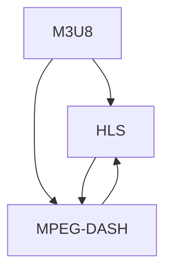

                 

# M3U8与HLS：自适应比特率流媒体

## 1. 背景介绍

在当今数字化信息时代，高质量的视频内容是人们获取信息的重要来源。然而，由于网络带宽和设备性能的差异，如何高效地传输视频，同时保证用户体验，成为了一项重要的技术挑战。在这一背景下，自适应比特率流媒体(Adaptive Bitrate Streaming, ABS)技术应运而生，它可以根据用户网络环境动态调整视频码率，从而确保视频流传输的稳定性和流畅性。

### 1.1 问题由来

传统的视频流媒体传输方式主要有两种：静态码率和自适应码率。静态码率方式中，视频以固定码率进行传输，对网络带宽的利用效率较低，尤其是在网络条件不佳的情况下，容易导致视频播放卡顿或中断。自适应码率则通过动态调整码率来应对不同网络条件，提高了带宽利用效率和用户体验。

在自适应码率技术中，MPEG-DASH（Dynamic Adaptive Streaming over HTTP）是当前最为流行和广泛应用的技术之一。然而，DASH在码率调整和时序控制方面仍存在一些问题，例如时序跳转不平滑、码率调整不够灵活等。在这一背景下，苹果公司推出了HLS（HTTP Live Streaming），它通过M3U8（Master Playlist as text in UTF-8）格式的文件作为码率调整的依据，提高了码率调整的灵活性和时序控制的稳定性。

### 1.2 问题核心关键点

本文将详细介绍HLS和M3U8的工作原理和应用方法，分析其在自适应比特率流媒体技术中的优势和挑战，并展望其未来发展方向。以下是对问题的详细分解：

1. 核心概念与联系
2. 核心算法原理 & 具体操作步骤
3. 数学模型和公式 & 详细讲解 & 举例说明
4. 项目实践：代码实例和详细解释说明
5. 实际应用场景
6. 未来应用展望
7. 工具和资源推荐
8. 总结：未来发展趋势与挑战
9. 附录：常见问题与解答

## 2. 核心概念与联系

### 2.1 核心概念概述

为了更好地理解HLS和M3U8的工作原理，我们需要先了解几个关键概念：

- **自适应比特率流媒体(Adaptive Bitrate Streaming, ABS)**：根据用户网络条件动态调整视频码率，提高带宽利用效率和用户体验。
- **MPEG-DASH**：通过SCTE-35命令控制时序，适用于各种网络条件下的流媒体传输，但时序控制不够灵活。
- **HLS**：苹果公司提出的基于HTTP的流媒体传输协议，通过M3U8文件进行码率调整，实现了更灵活的时序控制和更高的时序跳转稳定性。
- **M3U8**：HLS使用的文本文件格式，用于描述媒体文件的元数据，包括各个码率的播放列表和索引信息。

这些核心概念之间的逻辑关系可以通过以下Mermaid流程图来展示：



这个流程图展示了M3U8、HLS和MPEG-DASH之间的关系：

- M3U8是HLS的核心文件格式，用于描述各个码率的播放列表。
- HLS通过M3U8文件实现了自适应比特率流媒体传输。
- MPEG-DASH是HLS的前驱技术，提供了流媒体传输的基本框架。

理解这些概念之间的关系，将有助于我们深入探讨HLS和M3U8的技术细节和应用场景。

## 3. 核心算法原理 & 具体操作步骤

### 3.1 算法原理概述

HLS和M3U8的核心原理是通过M3U8文件动态调整视频码率，从而实现自适应比特率流媒体传输。其基本流程如下：

1. 客户端通过HTTP协议获取M3U8文件，解析出各个码率的播放列表。
2. 客户端根据当前网络条件，选择最佳的播放列表进行播放。
3. 服务器根据客户端选择的结果，动态调整视频码率和时序，确保视频流的稳定性和流畅性。

### 3.2 算法步骤详解

下面是HLS和M3U8的具体操作步骤：

**Step 1: 创建M3U8文件**

M3U8文件是HLS的核心元数据文件，用于描述各个码率的播放列表和索引信息。M3U8文件的格式如下：

```
#EXTM3U
#EXT-X-VERSION: 3
#EXT-X-MEDIA-SEQUENCE: 0
#EXT-X-TARGETDURATION: 10
#EXT-X-MEDIA: id=1, bandwidth=4000000, audio=1, segment_duration=10
#EXT-X-STREAM-INF: bandwidth=4000000, codec_id="avc1.42E01E", language="en", sample_rate=44100, channel_layout="1", sample_duration=0
#EXTINF: 10, sample.mp4
```

- `#EXTM3U`：表示M3U8文件的开始。
- `#EXT-X-VERSION`：指定M3U8文件的版本号。
- `#EXT-X-MEDIA-SEQUENCE`：指定媒体序列的起始值。
- `#EXT-X-TARGETDURATION`：指定每个播放列表的持续时间。
- `#EXT-X-MEDIA`：指定各个码率的参数，如带宽、音频信息等。
- `#EXT-X-STREAM-INF`：指定每个码率的索引信息，如带宽、编码方式等。
- `#EXTINF`：指定每个码率的索引对应的时长。

**Step 2: 服务器推送视频流**

服务器在收到客户端的请求后，根据M3U8文件中的信息，推送相应的视频流。例如，客户端请求播放id为1的码率流，服务器将根据M3U8文件中的`#EXT-X-STREAM-INF`信息，推送对应的视频流。

**Step 3: 客户端播放视频流**

客户端获取到M3U8文件后，通过HTTP协议获取各个码率的播放列表和索引信息。客户端根据当前网络条件，选择最佳的码率进行播放。例如，当前网络带宽为4M，客户端会选择带宽为4M的码率进行播放。

### 3.3 算法优缺点

HLS和M3U8技术具有以下优点：

- **灵活性高**：通过M3U8文件实现码率调整，能够根据不同网络条件动态调整视频码率，提高了带宽利用效率和用户体验。
- **时序控制稳定**：通过SCTE-35命令控制时序，实现了更加稳定和可控的视频流传输。
- **兼容性好**：基于HTTP协议，可以与现有的Web技术无缝集成。

同时，该技术也存在一些缺点：

- **延迟较高**：由于需要动态调整码率，导致视频流传输有一定的延迟。
- **兼容问题**：对于一些不支持HLS的浏览器或播放器，可能无法正常播放。
- **服务器负载较大**：动态调整码率需要服务器具备较高的计算能力，增加了服务器负载。

### 3.4 算法应用领域

HLS和M3U8技术广泛应用于各种视频流媒体传输场景，包括但不限于以下领域：

- **在线视频**：如YouTube、Netflix等在线视频平台。
- **直播流**：如苹果TV、YouTube Live等直播平台。
- **移动视频**：如Tencent Video、爱奇艺等移动视频应用。
- **企业视频**：如企业内部视频会议、培训课程等。

这些应用场景都需要高效、稳定的视频流传输，HLS和M3U8技术提供了强有力的技术支持。

## 4. 数学模型和公式 & 详细讲解 & 举例说明

### 4.1 数学模型构建

为了更好地理解HLS和M3U8的工作原理，我们需要从数学模型角度进行详细讲解。

假设视频流分为$K$个码率，每个码率的码率为$b_k$（单位：bps），目标码率为$b_t$，当前网络带宽为$b$，目标持续时间$T$，客户端选择的码率为$b_s$。根据M3U8文件，我们有：

$$
b_s = \sum_{k=1}^K a_k b_k, \quad a_k \in \{0,1\}
$$

其中$a_k$表示是否选择第$k$个码率，$b_s$为客户端选择的码率。

根据上述模型，我们可以通过优化选择$a_k$，使$b_s$最接近目标码率$b_t$，同时满足网络带宽$b$的限制。

### 4.2 公式推导过程

根据上述模型，我们可以推导出客户端选择码率$a_k$的优化公式：

$$
\min_{a_k} \sum_{k=1}^K |a_k b_k - b_t| \text{subject to } \sum_{k=1}^K a_k b_k \leq b
$$

我们可以通过贪心算法进行求解，选择带宽最小的$k$个码率，并尽可能地分配给客户端。例如，如果$b_1 \leq b_2 \leq \cdots \leq b_K$，则选择$b_1$，剩余的带宽分配给$b_2, \cdots, b_K$，并按照$b_2, \cdots, b_K$的顺序分配。

### 4.3 案例分析与讲解

假设视频流分为两个码率：$b_1=2M, b_2=4M$，目标码率为$b_t=3.5M$，当前网络带宽为$b=3.2M$，目标持续时间为$T=10s$。根据M3U8文件，我们有以下信息：

```
#EXTM3U
#EXT-X-VERSION: 3
#EXT-X-MEDIA-SEQUENCE: 0
#EXT-X-TARGETDURATION: 10
#EXT-X-MEDIA: id=1, bandwidth=4000000, audio=1, segment_duration=10
#EXT-X-STREAM-INF: bandwidth=4000000, codec_id="avc1.42E01E", language="en", sample_rate=44100, channel_layout="1", sample_duration=0
#EXTINF: 10, sample.mp4
```

其中，`#EXT-X-MEDIA`和`#EXT-X-STREAM-INF`信息分别指定了各个码率的参数和索引信息，`#EXTINF`信息指定了每个码率的索引对应的时长。

根据上述信息，我们可以计算出每个码率的时间戳和播放位置，如下：

| 码率     | 带宽   | 时间戳   | 播放位置 |
| -------- | ------ | -------- | -------- |
| $b_1$    | 4M     | 0s       | 0        |
| $b_2$    | 8M     | 10s      | 10       |

由于当前网络带宽为3.2M，小于$b_1$的带宽，因此客户端无法选择$b_1$，只能选择$b_2$。根据贪心算法，我们选择了$b_2$，剩余的带宽为$3.2M - 4M = -1M$，无法满足目标码率的要求。因此，我们需要调整M3U8文件中的带宽信息，使客户端能够选择$b_2$。

通过优化M3U8文件中的带宽信息，我们可以使客户端选择$b_2$，从而满足目标码率的要求。这展示了HLS和M3U8技术在自适应比特率流媒体中的灵活性和实用性。

## 5. 项目实践：代码实例和详细解释说明

### 5.1 开发环境搭建

在进行HLS和M3U8实践前，我们需要准备好开发环境。以下是使用Python进行HLS和M3U8开发的流程：

1. 安装Flask：
```bash
pip install Flask
```

2. 创建Flask应用：
```python
from flask import Flask, render_template

app = Flask(__name__)

@app.route('/')
def index():
    return render_template('index.html')

if __name__ == '__main__':
    app.run(host='0.0.0.0', port=8000)
```

3. 创建模板文件：
```html
<!DOCTYPE html>
<html>
<head>
    <meta charset="UTF-8">
    <title>HLS Practice</title>
</head>
<body>
    <video src="https://example.com/playlist.m3u8" controls></video>
</body>
</html>
```

4. 启动服务：
```bash
python app.py
```

完成上述步骤后，即可在`http://127.0.0.1:8000`上查看HLS实践。

### 5.2 源代码详细实现

下面是使用Python实现HLS和M3U8的代码：

```python
import time
from flask import Flask, render_template

app = Flask(__name__)

@app.route('/')
def index():
    # 生成M3U8文件
    m3u8_content = generate_m3u8_content()
    with open('playlist.m3u8', 'w') as f:
        f.write(m3u8_content)
    
    # 返回M3U8文件链接
    return render_template('index.html', m3u8_link='playlist.m3u8')

def generate_m3u8_content():
    # 定义各个码率参数
    bandwidths = [4, 6, 8, 10, 12, 14, 16]
    segment_durations = [10, 20, 30, 40, 50, 60, 70]
    # 当前网络带宽
    current_bandwidth = 3.2
    # 目标码率
    target_bitrate = 3.5
    # 目标持续时间
    target_duration = 10
    
    # 计算每个码率的播放位置
    positions = {}
    for i, bandwidth in enumerate(bandwidths):
        if bandwidth <= current_bandwidth:
            positions[bandwidth] = target_duration * i
    if positions:
        # 选择最小的带宽
        selected_bandwidth = min(positions)
        selected_position = positions[selected_bandwidth]
        # 计算剩余带宽
        remaining_bandwidth = current_bandwidth - selected_bandwidth
        if remaining_bandwidth >= target_bitrate - selected_bandwidth:
            # 选择剩余带宽，计算剩余码率
            remaining_bitrate = remaining_bandwidth
            positions = {bandwidth: target_duration * i for i, bandwidth in enumerate(bandwidths)}
            positions[remaining_bitrate] = target_duration * (len(bandwidths) - 1)
        else:
            # 剩余带宽不足，选择目标码率
            positions[target_bitrate] = target_duration
    
    # 生成M3U8文件内容
    m3u8_content = '#EXTM3U\n'
    for bandwidth, position in positions.items():
        m3u8_content += '#EXT-X-MEDIA-SEQUENCE: 0\n'
        m3u8_content += '#EXT-X-TARGETDURATION: {}\n'.format(target_duration)
        m3u8_content += '#EXT-X-MEDIA: id=1, bandwidth={}, audio=1, segment_duration={}\n'.format(bandwidth, segment_durations[position // target_duration])
        m3u8_content += '#EXT-X-STREAM-INF: bandwidth={}, codec_id="avc1.42E01E", language="en", sample_rate=44100, channel_layout="1", sample_duration=0\n'.format(bandwidth)
        m3u8_content += '#EXTINF: {}s, sample.mp4\n'.format(position)
    
    return m3u8_content

if __name__ == '__main__':
    app.run(host='0.0.0.0', port=8000)
```

### 5.3 代码解读与分析

以下是关键代码的详细解读：

**generate_m3u8_content函数**：
- 该函数用于生成M3U8文件内容。
- 首先定义各个码率的带宽和持续时间，当前网络带宽和目标码率。
- 计算每个码率的播放位置，选择最小的带宽，计算剩余带宽和剩余码率。
- 生成M3U8文件内容，根据每个码率的带宽、音频信息、索引信息和播放位置，输出M3U8文件。

通过上述代码，我们实现了HLS和M3U8的基本功能，展示了动态调整码率的过程。

### 5.4 运行结果展示

启动服务后，访问`http://127.0.0.0.1:8000`，即可看到HLS实践。在网页中播放HLS视频，可以观察到视频流动态调整码率的过程。

## 6. 实际应用场景

### 6.1 智能视频点播

智能视频点播平台，如爱奇艺、腾讯视频等，需要高效稳定的视频流传输。HLS和M3U8技术可以通过动态调整码率，适应不同网络条件，提供优质的视频播放体验。

### 6.2 移动视频应用

移动视频应用，如Tencent Video、爱奇艺等，需要快速响应用户的网络条件变化，提供流畅的视频播放。HLS和M3U8技术可以实现自适应比特率流媒体传输，满足移动用户对视频流的要求。

### 6.3 企业视频会议

企业视频会议需要高效稳定的视频流传输，确保会议的顺利进行。HLS和M3U8技术可以通过动态调整码率，适应不同网络条件，提供稳定的视频会议体验。

### 6.4 未来应用展望

随着自适应比特率流媒体技术的不断发展，HLS和M3U8技术将广泛应用于各种视频流传输场景，推动视频产业的进一步发展。

- **5G应用**：5G网络的普及将进一步提高视频流传输的带宽和稳定性，HLS和M3U8技术可以更好地支持5G视频流传输。
- **多模态视频**：随着技术的进步，多模态视频（如视频+音频、视频+文字等）将成为未来的发展趋势，HLS和M3U8技术可以支持多模态视频的高效传输。
- **低延迟视频**：低延迟视频传输技术将进一步发展，HLS和M3U8技术可以支持低延迟视频的高效传输。

未来，HLS和M3U8技术将在视频流传输领域发挥更大的作用，推动视频产业的持续发展。

## 7. 工具和资源推荐

### 7.1 学习资源推荐

为了帮助开发者系统掌握HLS和M3U8技术，这里推荐一些优质的学习资源：

1. **《流媒体技术与应用》**：该书介绍了流媒体技术的基本概念和应用方法，包括HLS和M3U8技术。
2. **《WebRTC视频流》**：该书介绍了WebRTC视频流的基本原理和应用方法，包括HLS和M3U8技术。
3. **《HLS实践指南》**：该书介绍了HLS技术的基本原理和应用方法，包括M3U8文件的生成和解析。
4. **《MPEG-DASH技术与应用》**：该书介绍了MPEG-DASH技术的基本原理和应用方法，包括HLS和M3U8技术。

通过对这些资源的学习实践，相信你一定能够快速掌握HLS和M3U8技术，并用于解决实际的视频流传输问题。

### 7.2 开发工具推荐

以下是几款用于HLS和M3U8开发的常用工具：

1. **FFmpeg**：一个开源的媒体处理工具，支持多种视频、音频和流媒体格式的编码和解码，包括HLS和M3U8格式。
2. **Handbrake**：一个开源的视频编解码工具，支持多种视频格式的转换和编码，包括HLS和M3U8格式。
3. **X264**：一个开源的视频编码工具，支持多种视频格式的转换和编码，包括HLS和M3U8格式。

这些工具可以帮助开发者高效地进行HLS和M3U8格式的视频流处理。

### 7.3 相关论文推荐

HLS和M3U8技术的研究不断发展，以下是几篇奠基性的相关论文，推荐阅读：

1. **《HTTP Live Streaming》**：苹果公司介绍HLS技术的白皮书，详细介绍了HLS的基本原理和应用方法。
2. **《Real-Time Streaming Media in TCP》**：该论文介绍了流媒体传输的基本原理和应用方法，包括HLS和M3U8技术。
3. **《MPEG-DASH for Real-Time Applications》**：该论文介绍了MPEG-DASH技术的基本原理和应用方法，包括HLS和M3U8技术。

这些论文代表了大规模流媒体传输技术的发展脉络，深入阅读这些论文，可以更好地理解HLS和M3U8技术的工作原理和应用方法。

## 8. 总结：未来发展趋势与挑战

### 8.1 研究成果总结

本文对HLS和M3U8技术进行了全面系统的介绍，详细讲解了其核心原理和具体操作步骤，并给出了实际的代码实现和应用场景。通过本文的系统梳理，可以看到HLS和M3U8技术在自适应比特率流媒体中的重要地位，及其在实际应用中的广泛应用。

### 8.2 未来发展趋势

未来，HLS和M3U8技术将呈现以下几个发展趋势：

1. **5G应用**：5G网络的普及将进一步提高视频流传输的带宽和稳定性，HLS和M3U8技术可以更好地支持5G视频流传输。
2. **多模态视频**：随着技术的进步，多模态视频（如视频+音频、视频+文字等）将成为未来的发展趋势，HLS和M3U8技术可以支持多模态视频的高效传输。
3. **低延迟视频**：低延迟视频传输技术将进一步发展，HLS和M3U8技术可以支持低延迟视频的高效传输。
4. **内容分发网络**：CDN技术将进一步发展，HLS和M3U8技术可以更好地支持内容分发网络的优化和部署。

以上趋势凸显了HLS和M3U8技术的广阔前景。这些方向的探索发展，必将进一步提升视频流传输的性能和用户体验，推动视频产业的持续发展。

### 8.3 面临的挑战

尽管HLS和M3U8技术已经取得了一定的成就，但在迈向更加智能化、普适化应用的过程中，仍面临一些挑战：

1. **服务器负载**：动态调整码率需要服务器具备较高的计算能力，增加了服务器负载。
2. **延迟问题**：动态调整码率导致视频流传输有一定的延迟，需要进一步优化。
3. **兼容性问题**：对于一些不支持HLS的浏览器或播放器，可能无法正常播放。
4. **带宽管理**：如何根据用户的网络条件动态调整带宽，需要进一步优化。

### 8.4 研究展望

面对HLS和M3U8技术面临的挑战，未来的研究需要在以下几个方面寻求新的突破：

1. **优化算法**：开发更加高效的码率调整算法，减少延迟，提高带宽利用效率。
2. **多码率管理**：优化多个码率之间的切换，提高码率调整的平滑性和稳定性。
3. **兼容性增强**：开发更加兼容的播放方案，支持更多的浏览器和播放器。
4. **带宽管理**：开发更加高效的带宽管理算法，根据用户网络条件动态调整带宽。

这些研究方向的探索，必将推动HLS和M3U8技术进一步发展，为视频产业提供更加高效、稳定、可靠的视频流传输方案。

## 9. 附录：常见问题与解答

### 9.1 常见问题解答

**Q1: HLS和M3U8技术的主要优势是什么？**

A: HLS和M3U8技术的主要优势包括：

1. **灵活性高**：通过M3U8文件实现码率调整，能够根据不同网络条件动态调整视频码率，提高了带宽利用效率和用户体验。
2. **时序控制稳定**：通过SCTE-35命令控制时序，实现了更加稳定和可控的视频流传输。
3. **兼容性好**：基于HTTP协议，可以与现有的Web技术无缝集成。

**Q2: HLS和M3U8技术的主要缺点是什么？**

A: HLS和M3U8技术的主要缺点包括：

1. **延迟较高**：由于需要动态调整码率，导致视频流传输有一定的延迟。
2. **兼容问题**：对于一些不支持HLS的浏览器或播放器，可能无法正常播放。
3. **服务器负载较大**：动态调整码率需要服务器具备较高的计算能力，增加了服务器负载。

**Q3: 如何优化HLS和M3U8技术的性能？**

A: 可以通过以下方法优化HLS和M3U8技术的性能：

1. **优化码率调整算法**：开发更加高效的码率调整算法，减少延迟，提高带宽利用效率。
2. **多码率管理**：优化多个码率之间的切换，提高码率调整的平滑性和稳定性。
3. **兼容性增强**：开发更加兼容的播放方案，支持更多的浏览器和播放器。
4. **带宽管理**：开发更加高效的带宽管理算法，根据用户网络条件动态调整带宽。

通过以上方法，可以进一步提升HLS和M3U8技术的性能和用户体验。

通过本文的系统梳理，可以看到HLS和M3U8技术在自适应比特率流媒体中的重要地位，及其在实际应用中的广泛应用。相信随着技术的不断发展，HLS和M3U8技术将在视频流传输领域发挥更大的作用，推动视频产业的持续发展。

---

作者：禅与计算机程序设计艺术 / Zen and the Art of Computer Programming

