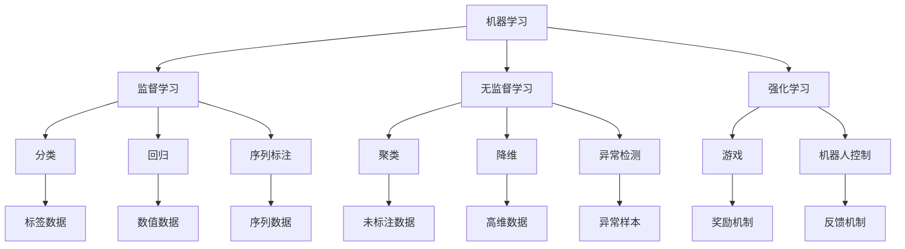

                 

# Machine Learning

> 关键词：机器学习,深度学习,监督学习,无监督学习,强化学习,模型优化,超参数调优,应用场景

## 1. 背景介绍

### 1.1 问题由来

机器学习是人工智能领域的重要分支，主要研究如何让计算机通过数据学习，从而自动进行任务决策和模式识别。在过去的几十年中，机器学习技术取得了显著进展，广泛应用于图像识别、自然语言处理、语音识别、推荐系统等多个领域，极大地推动了科技进步和社会发展。

然而，随着数据量的爆炸式增长和算力水平的持续提升，传统的机器学习技术已经无法满足日益复杂的现实需求。新的挑战不断涌现，如数据的多模态性、动态性、多样性等，这些都对机器学习模型的性能和效率提出了更高要求。

为此，研究人员和工程师们不断探索新的机器学习方法，以适应新环境和提升机器学习系统的能力。在这篇博客文章中，我们将深入探讨机器学习的核心概念和关键技术，结合最新的研究成果和应用实例，帮助读者更好地理解机器学习的原理和实践。

### 1.2 问题核心关键点

机器学习领域的关键问题主要包括以下几点：

- 模型选择：根据具体任务选择合适的机器学习模型，如线性回归、决策树、支持向量机、神经网络等。
- 数据预处理：清洗、归一化、降维等步骤，将原始数据转化为可供模型使用的格式。
- 模型训练与评估：使用训练数据对模型进行优化，并在测试数据上评估模型性能，确保模型泛化能力。
- 模型调优与集成：通过超参数调优、模型融合等手段提升模型性能。
- 模型应用与优化：将训练好的模型部署到实际应用中，并在不断实践中优化模型，提升其鲁棒性和准确性。

本文将详细介绍机器学习的核心概念和关键技术，并结合实际应用场景，探讨机器学习未来的发展趋势和面临的挑战。

## 2. 核心概念与联系

### 2.1 核心概念概述

在深入了解机器学习的核心概念之前，需要先明确机器学习的三个主要分支：监督学习、无监督学习和强化学习。

- **监督学习**（Supervised Learning）：在标注数据上训练模型，使其能够从输入和输出之间的映射关系中学习。常见的监督学习任务包括分类、回归、序列标注等。
- **无监督学习**（Unsupervised Learning）：从未标注的数据中学习数据的内在结构，如聚类、降维、异常检测等。
- **强化学习**（Reinforcement Learning）：通过与环境互动，通过奖励和惩罚机制学习最优策略，常用于游戏、机器人控制等领域。

此外，还有一些关键概念需要了解：

- **模型优化**：通过优化算法（如梯度下降、牛顿法等）最小化损失函数，训练模型参数。
- **超参数调优**：选择模型架构和训练策略，如学习率、批大小、正则化强度等。
- **应用场景**：机器学习在图像识别、自然语言处理、推荐系统、金融预测等领域有广泛应用。

### 2.2 核心概念原理和架构的 Mermaid 流程图



通过这张流程图，我们可以清晰地看到机器学习的三个分支及其具体应用场景。监督学习、无监督学习和强化学习是机器学习领域的基础，它们各自解决不同的问题。在实际应用中，通常需要根据具体任务选择合适的机器学习方法和策略。

## 3. 核心算法原理 & 具体操作步骤

### 3.1 算法原理概述

机器学习算法可以分为监督学习、无监督学习和强化学习三类。这里我们将重点介绍监督学习算法，并结合实际应用场景进行讲解。

监督学习算法的基本流程如下：

1. **数据预处理**：收集并清洗数据，进行归一化、降维等处理。
2. **模型选择**：根据任务性质选择合适的模型结构，如线性回归、决策树、神经网络等。
3. **模型训练**：使用训练数据对模型进行优化，最小化损失函数。
4. **模型评估**：使用测试数据评估模型性能，如准确率、召回率、F1-score等。
5. **模型应用**：将训练好的模型部署到实际应用中，并不断优化提升。

### 3.2 算法步骤详解

以下是监督学习算法的详细步骤：

1. **数据准备**：收集数据集，并进行清洗、归一化、降维等预处理。
2. **模型选择**：根据任务性质选择合适的模型结构，如线性回归、决策树、神经网络等。
3. **模型训练**：使用训练数据对模型进行优化，最小化损失函数。常见的优化算法包括梯度下降、牛顿法等。
4. **模型评估**：使用测试数据评估模型性能，如准确率、召回率、F1-score等。
5. **模型应用**：将训练好的模型部署到实际应用中，并不断优化提升。

### 3.3 算法优缺点

监督学习算法有以下优点：

- **精度高**：在有标注数据的情况下，监督学习算法可以训练出高精度的模型，适用于分类、回归等任务。
- **适用性强**：监督学习算法可以处理各种类型的数据，如结构化数据、非结构化数据、图像数据等。
- **可解释性强**：监督学习算法通常是可解释的，可以用于理解模型的决策过程。

然而，监督学习算法也存在一些缺点：

- **依赖标注数据**：监督学习算法需要大量标注数据进行训练，获取高质量标注数据的成本较高。
- **过拟合风险**：在标注数据较少的情况下，监督学习算法容易过拟合，泛化性能较差。
- **处理动态数据困难**：监督学习算法无法处理动态变化的数据，如时序数据。

### 3.4 算法应用领域

监督学习算法在许多领域都有广泛应用，例如：

- **图像识别**：如人脸识别、物体检测、图像分类等。
- **自然语言处理**：如文本分类、情感分析、机器翻译等。
- **金融预测**：如股票预测、信用评分、欺诈检测等。
- **推荐系统**：如商品推荐、新闻推荐、广告推荐等。
- **医疗诊断**：如疾病预测、医学图像分析等。

## 4. 数学模型和公式 & 详细讲解 & 举例说明

### 4.1 数学模型构建

以线性回归模型为例，介绍监督学习模型的数学模型构建过程。

假设有一个线性回归模型 $y = \theta_0 + \theta_1 x_1 + \theta_2 x_2 + \cdots + \theta_n x_n$，其中 $y$ 为预测值，$x_i$ 为输入特征，$\theta_i$ 为模型参数。

线性回归模型的目标是最小化预测值与真实值之间的误差，通常使用均方误差（MSE）作为损失函数：

$$
L(\theta) = \frac{1}{2N} \sum_{i=1}^N (y_i - \theta_0 - \theta_1 x_{i1} - \theta_2 x_{i2} - \cdots - \theta_n x_{in})^2
$$

其中 $y_i$ 为真实值，$x_{ij}$ 为输入特征的 $j$ 维，$N$ 为样本数量。

### 4.2 公式推导过程

线性回归模型的参数优化目标是找到最小化损失函数的参数 $\theta$。使用梯度下降算法，可以得到参数的更新公式：

$$
\theta_i \leftarrow \theta_i - \eta \frac{\partial L(\theta)}{\partial \theta_i}
$$

其中 $\eta$ 为学习率。

### 4.3 案例分析与讲解

以房价预测为例，介绍线性回归模型的应用。

假设有一个房价预测问题，收集了若干房屋的特征（如房屋面积、房间数量、地理位置等）以及对应的房价数据。使用线性回归模型进行预测，具体步骤如下：

1. **数据准备**：收集数据，并进行清洗、归一化等预处理。
2. **模型选择**：选择线性回归模型进行预测。
3. **模型训练**：使用训练数据对模型进行优化，最小化损失函数。
4. **模型评估**：使用测试数据评估模型性能。
5. **模型应用**：将训练好的模型部署到实际应用中，如房产中介网站、银行贷款评估等。

## 5. 项目实践：代码实例和详细解释说明

### 5.1 开发环境搭建

在开始项目实践之前，需要先搭建好开发环境。这里以 Python 和 Scikit-learn 为例，介绍开发环境的搭建步骤。

1. 安装 Python：从官网下载并安装 Python 3.x，建议使用 Anaconda 或 Miniconda 进行安装。
2. 创建虚拟环境：使用 `conda create` 命令创建虚拟环境，避免与其他项目冲突。
3. 安装 Scikit-learn：使用 `pip install scikit-learn` 命令安装 Scikit-learn 库。
4. 安装其他依赖库：根据需要安装其他依赖库，如 NumPy、Pandas、Matplotlib 等。

### 5.2 源代码详细实现

以线性回归模型为例，展示 Scikit-learn 库的代码实现。

```python
from sklearn.linear_model import LinearRegression
from sklearn.metrics import mean_squared_error
import numpy as np

# 生成样本数据
X = np.array([[1, 2], [2, 3], [3, 4], [4, 5]])
y = np.array([2, 4, 6, 8])

# 创建线性回归模型
model = LinearRegression()

# 训练模型
model.fit(X, y)

# 预测
y_pred = model.predict(np.array([[5, 6]]))

# 评估模型
mse = mean_squared_error(y, y_pred)
print("Mean Squared Error: {:.2f}".format(mse))
```

### 5.3 代码解读与分析

上述代码实现了简单的线性回归模型，包含数据生成、模型训练、预测和评估等步骤。

1. **数据生成**：使用 NumPy 生成样本数据，包含特征和目标变量。
2. **模型创建**：使用 Scikit-learn 库的 LinearRegression 类创建线性回归模型。
3. **模型训练**：使用 `fit` 方法训练模型，将特征和目标变量作为输入。
4. **模型预测**：使用 `predict` 方法预测新数据的输出。
5. **模型评估**：使用均方误差（MSE）评估模型预测的准确性。

## 6. 实际应用场景

### 6.1 图像识别

图像识别是机器学习的一个重要应用领域，广泛应用于人脸识别、物体检测、图像分类等任务。

以物体检测为例，使用深度学习模型（如卷积神经网络 CNN）进行物体检测，具体步骤如下：

1. **数据准备**：收集标注数据集，包含图像和物体的位置信息。
2. **模型选择**：选择深度学习模型进行训练。
3. **模型训练**：使用训练数据对模型进行优化，最小化损失函数。
4. **模型评估**：使用测试数据评估模型性能。
5. **模型应用**：将训练好的模型部署到实际应用中，如监控系统、自动驾驶等。

### 6.2 自然语言处理

自然语言处理（NLP）是机器学习的另一重要领域，广泛应用于文本分类、情感分析、机器翻译等任务。

以情感分析为例，使用深度学习模型（如循环神经网络 RNN、长短时记忆网络 LSTM、Transformer 等）进行情感分析，具体步骤如下：

1. **数据准备**：收集标注数据集，包含文本和情感标签。
2. **模型选择**：选择深度学习模型进行训练。
3. **模型训练**：使用训练数据对模型进行优化，最小化损失函数。
4. **模型评估**：使用测试数据评估模型性能。
5. **模型应用**：将训练好的模型部署到实际应用中，如社交媒体情感分析、客户反馈分析等。

### 6.3 金融预测

金融预测是机器学习的一个重要应用领域，广泛应用于股票预测、信用评分、欺诈检测等任务。

以股票预测为例，使用深度学习模型（如卷积神经网络 CNN、循环神经网络 RNN、长短期记忆网络 LSTM 等）进行股票预测，具体步骤如下：

1. **数据准备**：收集历史股票数据，并进行预处理。
2. **模型选择**：选择深度学习模型进行训练。
3. **模型训练**：使用训练数据对模型进行优化，最小化损失函数。
4. **模型评估**：使用测试数据评估模型性能。
5. **模型应用**：将训练好的模型部署到实际应用中，如股票交易系统、风险评估等。

## 7. 工具和资源推荐

### 7.1 学习资源推荐

为了帮助读者系统掌握机器学习的核心概念和关键技术，这里推荐一些优质的学习资源：

1. 《机器学习实战》：本书介绍了机器学习的基础知识和常用算法，内容通俗易懂，适合初学者入门。
2. 《深度学习》：本书深入介绍了深度学习的基本原理和常用技术，涵盖神经网络、卷积神经网络、循环神经网络等。
3. Coursera《机器学习》课程：由斯坦福大学开设的在线课程，由吴恩达教授主讲，系统讲解了机器学习的理论和实践。
4. Udacity《深度学习》纳米学位：Udacity 推出的深度学习课程，涵盖深度学习的基本原理和实践，适合深入学习。
5. Kaggle：Kaggle 是一个数据科学竞赛平台，提供大量数据集和实战项目，适合实践和竞赛。

通过对这些资源的学习实践，相信读者一定能够全面掌握机器学习的核心概念和关键技术，并用于解决实际的机器学习问题。

### 7.2 开发工具推荐

高效的开发离不开优秀的工具支持。以下是几款用于机器学习开发的常用工具：

1. Jupyter Notebook：开源的交互式编程环境，支持 Python 和 R 等多种编程语言，适合数据预处理、模型训练和结果展示。
2. PyTorch：基于 Python 的开源深度学习框架，灵活动态的计算图，适合快速迭代研究。
3. TensorFlow：由 Google 主导开发的开源深度学习框架，生产部署方便，适合大规模工程应用。
4. Scikit-learn：基于 Python 的科学计算库，提供了丰富的机器学习算法和工具，适合数据预处理和模型训练。
5. Matplotlib：基于 Python 的绘图库，支持多种数据可视化，适合结果展示和分析。

合理利用这些工具，可以显著提升机器学习任务的开发效率，加快创新迭代的步伐。

### 7.3 相关论文推荐

机器学习领域的研究成果丰富多样，以下是几篇奠基性的相关论文，推荐阅读：

1. "A Tutorial on Support Vector Machines for Pattern Recognition"：SVM 算法的基础论文，介绍了支持向量机的原理和应用。
2. "Neural Networks and Deep Learning"：深度学习领域的经典教材，涵盖了神经网络、卷积神经网络、循环神经网络等。
3. "TensorFlow: A System for Large-Scale Machine Learning"：TensorFlow 框架的介绍论文，详细描述了 TensorFlow 的架构和应用。
4. "PyTorch: An Introduction"：PyTorch 框架的介绍论文，介绍了 PyTorch 的架构和优势。
5. "Deep Learning for Self-Driving Cars"：使用深度学习技术进行自动驾驶的论文，展示了深度学习在实际应用中的强大能力。

这些论文代表了机器学习领域的研究进展，通过学习这些前沿成果，可以帮助读者掌握机器学习的最新技术和应用。

## 8. 总结：未来发展趋势与挑战

### 8.1 研究成果总结

机器学习技术在过去的几十年中取得了显著进展，广泛应用于多个领域，取得了许多重要成果。在图像识别、自然语言处理、金融预测等领域，机器学习模型已经超越了人类专家的表现，成为行业的重要工具。

### 8.2 未来发展趋势

展望未来，机器学习技术将呈现以下几个发展趋势：

1. **深度学习**：深度学习算法将继续占据主导地位，新的深度学习模型和算法将不断涌现，提升模型性能和效率。
2. **强化学习**：强化学习在自动控制、游戏、机器人等领域将有更广泛的应用，产生更多创新成果。
3. **联邦学习**：联邦学习将改变数据分布不均的现状，使得不同设备之间的数据共享成为可能，提升模型泛化能力。
4. **多模态学习**：多模态学习将融合视觉、语音、文本等多种数据形式，提升模型的综合能力。
5. **可解释性**：模型可解释性将成为重要研究方向，帮助人们理解模型的决策过程，提升模型的可信度。
6. **隐私保护**：隐私保护技术将提升数据使用的安全性，保护用户隐私。

### 8.3 面临的挑战

尽管机器学习技术取得了显著进展，但在迈向更加智能化、普适化应用的过程中，仍面临诸多挑战：

1. **数据瓶颈**：数据量不足、数据质量不高、数据分布不均等问题仍然存在，制约着模型的性能提升。
2. **计算资源**：深度学习模型需要大量的计算资源，对于普通设备来说，训练和推理的效率仍然较低。
3. **模型泛化**：模型的泛化能力不足，无法适应新数据和新场景，导致模型性能下降。
4. **可解释性**：许多深度学习模型具有“黑盒”性质，难以解释模型的决策过程，限制了其应用范围。
5. **公平性**：机器学习模型可能存在偏见和歧视，影响模型的公平性。

### 8.4 研究展望

面向未来，机器学习领域的研究方向将聚焦于以下几个方面：

1. **自适应学习**：自适应学习能够根据数据和任务的特点进行动态调整，提升模型的泛化能力和鲁棒性。
2. **可解释性增强**：通过可解释性技术，帮助人们理解模型的决策过程，提升模型的可信度。
3. **联邦学习**：联邦学习能够解决数据分布不均的问题，提升模型泛化能力。
4. **多模态学习**：多模态学习能够融合多种数据形式，提升模型的综合能力。
5. **隐私保护**：隐私保护技术能够保护用户隐私，提升数据使用的安全性。

这些研究方向将引领机器学习技术迈向更高的台阶，为人工智能技术的普及和应用提供更强大的支持。

## 9. 附录：常见问题与解答

**Q1：如何选择合适的机器学习算法？**

A: 选择机器学习算法时，需要考虑以下几个因素：
1. 数据类型：根据数据的类型选择合适的算法，如结构化数据使用线性回归、决策树等，非结构化数据使用深度学习等。
2. 任务类型：根据任务类型选择合适的算法，如分类任务使用逻辑回归、支持向量机等，回归任务使用线性回归、随机森林等。
3. 数据量：对于小数据集，可以选择简单的算法，如线性回归、逻辑回归等；对于大数据集，可以选择复杂的算法，如深度学习、强化学习等。

**Q2：如何缓解过拟合问题？**

A: 缓解过拟合问题的方法包括：
1. 数据增强：通过数据扩充和增强，增加数据集的多样性。
2. 正则化：通过正则化技术，如 L2 正则化、Dropout 等，避免过拟合。
3. 早停法：通过早停法，在验证集上评估模型性能，避免过度训练。
4. 模型简化：通过模型简化，减少模型的复杂度，避免过拟合。

**Q3：如何提高模型泛化能力？**

A: 提高模型泛化能力的方法包括：
1. 增加数据量：增加数据量可以提高模型的泛化能力，避免过拟合。
2. 数据增强：通过数据扩充和增强，增加数据集的多样性。
3. 正则化：通过正则化技术，如 L2 正则化、Dropout 等，避免过拟合。
4. 早停法：通过早停法，在验证集上评估模型性能，避免过度训练。
5. 模型简化：通过模型简化，减少模型的复杂度，避免过拟合。

**Q4：如何在实际应用中优化模型性能？**

A: 在实际应用中，优化模型性能的方法包括：
1. 数据预处理：清洗、归一化、降维等数据预处理步骤，提高模型性能。
2. 模型选择：根据任务性质选择合适的模型，如线性回归、决策树、神经网络等。
3. 模型训练：使用优化算法（如梯度下降、牛顿法等）最小化损失函数，优化模型参数。
4. 超参数调优：通过超参数调优，选择最优的模型架构和训练策略，如学习率、批大小、正则化强度等。
5. 模型集成：通过模型融合，提升模型的性能，如集成学习、模型融合等。

通过对这些常见问题的解答，相信读者一定能够更好地理解机器学习的核心概念和关键技术，并应用于实际问题的解决中。

