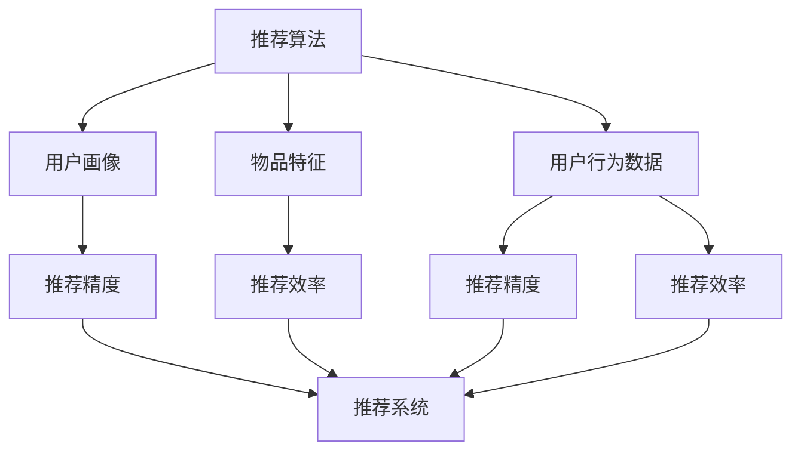

                 

# Mahout推荐算法原理与代码实例讲解

> 关键词：推荐算法, Mahout, 协同过滤, 矩阵分解, 深度学习, 推荐系统, 项目实践

## 1. 背景介绍

### 1.1 问题由来

在信息爆炸的时代，用户面临着海量的信息与内容，如何在众多信息中快速找到与自己兴趣和需求相匹配的内容，成为了一个亟待解决的难题。推荐系统就是在这样的背景下应运而生的，它利用用户的历史行为数据，通过算法为用户推荐可能感兴趣的内容。

推荐系统在电子商务、新闻媒体、社交网络等领域应用广泛。通过推荐系统，电商平台可以提升用户满意度、增加转化率；新闻媒体可以通过推荐算法提高用户阅读量和粘性；社交网络则能够增加用户活跃度和留存率。推荐系统已成为互联网公司竞争力的重要体现，具有巨大的商业价值。

### 1.2 问题核心关键点

推荐系统的发展经历了基于内容的推荐、协同过滤、矩阵分解、深度学习等多个阶段。而Mahout作为Apache基金会开源的推荐系统框架，提供了多种推荐算法实现，包括基于用户的协同过滤、基于物品的协同过滤、矩阵分解、基于深度学习的推荐等。

- **协同过滤**：利用用户和物品的相似性进行推荐，是推荐系统中最简单也最有效的算法之一。
- **矩阵分解**：将用户行为矩阵分解为低维矩阵，通过求解低维空间中的矩阵因子，从而进行推荐。
- **深度学习**：利用神经网络模型学习用户和物品之间的复杂非线性关系，提升推荐精度。

Mahout提供了一系列的API和工具，可以方便地实现上述各种推荐算法，同时也支持自定义算法实现。Mahout的目标是成为推荐系统研究和开发的平台，支持大规模数据处理和高效算法优化。

### 1.3 问题研究意义

研究推荐系统，尤其是基于Mahout框架的推荐算法，对于拓展推荐系统的应用范围，提升推荐精度，加速推荐系统的商业化进程，具有重要意义：

1. 降低推荐系统的开发成本。通过使用开源的Mahout框架，可以大幅减少从头开发推荐系统的成本投入，尤其是在大规模数据处理和算法优化方面。
2. 提升推荐效果。Mahout提供了多种高效的推荐算法实现，可以显著提升推荐系统的性能和效果。
3. 加速推荐系统开发。利用Mahout提供的API和工具，可以快速迭代和优化推荐算法，缩短推荐系统的开发周期。
4. 技术创新。研究基于深度学习的推荐系统，带来了新的研究方向，推动了推荐技术的持续进步。
5. 赋能产业升级。推荐系统可以帮助企业更精准地了解用户需求，提升用户体验，进而推动行业数字化转型升级。

## 2. 核心概念与联系

### 2.1 核心概念概述

为了更好地理解基于Mahout的推荐算法，本节将介绍几个关键概念：

- **推荐算法**：利用用户历史行为数据，为每个用户推荐可能感兴趣的内容。常见的推荐算法包括基于用户的协同过滤、基于物品的协同过滤、矩阵分解、基于深度学习的推荐等。
- **用户画像**：通过收集用户的历史行为数据，生成用户兴趣偏好和行为特征的表示，用于推荐系统中的决策。
- **物品特征**：描述物品的属性和特征，如商品标题、描述、类别等，用于计算物品间的相似性。
- **用户行为数据**：记录用户在平台上的行为数据，如浏览记录、点击行为、购买记录等，是推荐系统训练的基础。
- **推荐精度**：推荐系统推荐结果与用户真实兴趣的匹配度，通常通过准确率、召回率、F1-score等指标评估。
- **推荐效率**：推荐系统推荐内容的速度和响应时间，影响用户体验和系统稳定性。

这些概念之间的逻辑关系可以通过以下Mermaid流程图来展示：



这个流程图展示了一部分推荐系统的关键概念及其之间的关系：

1. 推荐算法是推荐系统的核心，根据用户画像和物品特征生成推荐内容。
2. 用户画像和物品特征用于计算相似性和推荐精度。
3. 用户行为数据是训练推荐算法的依据，同时也影响推荐效率。
4. 推荐精度和推荐效率是衡量推荐系统性能的指标。

## 3. 核心算法原理 & 具体操作步骤
### 3.1 算法原理概述

基于Mahout的推荐算法，核心思想是利用用户历史行为数据，通过算法计算出用户对物品的兴趣程度，从而为用户推荐可能感兴趣的内容。

具体而言，基于Mahout的推荐系统主要包括以下几个关键步骤：

1. **数据准备**：收集用户的历史行为数据，如浏览记录、购买记录等。
2. **用户画像生成**：通过分析用户行为数据，生成用户兴趣偏好和行为特征的表示。
3. **物品特征提取**：描述物品的属性和特征，如商品标题、描述、类别等。
4. **相似性计算**：通过相似性算法计算用户和物品之间的相似度。
5. **推荐排序**：根据相似度计算结果，排序推荐内容，生成推荐列表。
6. **推荐结果评估**：评估推荐结果与用户真实兴趣的匹配度，不断优化推荐系统。

### 3.2 算法步骤详解

基于Mahout的推荐系统主要提供了以下几种推荐算法实现：

#### 3.2.1 基于用户的协同过滤推荐

基于用户的协同过滤（User-Based Collaborative Filtering）推荐算法，利用用户之间的相似性进行推荐。

1. **用户画像生成**：
   - 通过用户的浏览记录、购买记录等行为数据，生成用户兴趣偏好和行为特征的表示。
   - 用户画像可以通过TF-IDF、向量表示、低维嵌入等方法生成。

2. **相似性计算**：
   - 利用余弦相似度、皮尔逊相关系数等方法计算用户之间的相似度。
   - 公式推导过程：
     设用户u和v的历史行为数据分别为 $u_1, u_2, \ldots, u_n$ 和 $v_1, v_2, \ldots, v_n$，其中 $u_i$ 和 $v_i$ 表示用户对物品i的兴趣程度，则用户u和v的相似度 $sim(u,v)$ 可表示为：
     \[
     sim(u,v) = \frac{\sum_{i=1}^n u_i v_i}{\sqrt{\sum_{i=1}^n u_i^2} \sqrt{\sum_{i=1}^n v_i^2}}
     \]

3. **推荐排序**：
   - 根据用户之间的相似度，计算用户对物品的兴趣程度。
   - 公式推导过程：
     设用户u的历史行为数据为 $u_1, u_2, \ldots, u_n$，物品i的特征为 $f_1, f_2, \ldots, f_m$，则用户u对物品i的兴趣程度 $score(u,i)$ 可表示为：
     \[
     score(u,i) = \sum_{j=1}^m w_j f_j \times \sum_{k=1}^n sim(u,k) u_k
     \]
     其中 $w_j$ 为物品i的特征权重。

4. **推荐结果评估**：
   - 使用准确率、召回率、F1-score等指标评估推荐结果与用户真实兴趣的匹配度。
   - 常用的评估指标计算公式如下：
     \[
     Precision = \frac{TP}{TP+FP}
     \]
     \[
     Recall = \frac{TP}{TP+FN}
     \]
     \[
     F1-score = 2 \times \frac{Precision \times Recall}{Precision + Recall}
     \]

#### 3.2.2 基于物品的协同过滤推荐

基于物品的协同过滤（Item-Based Collaborative Filtering）推荐算法，利用物品之间的相似性进行推荐。

1. **物品特征提取**：
   - 提取物品的属性和特征，如商品标题、描述、类别等。
   - 物品特征可以通过文本处理、主题模型等方法提取。

2. **相似性计算**：
   - 利用余弦相似度、皮尔逊相关系数等方法计算物品之间的相似度。
   - 公式推导过程与基于用户的协同过滤类似。

3. **推荐排序**：
   - 根据物品之间的相似度，计算物品对用户的兴趣程度。
   - 公式推导过程与基于用户的协同过滤类似。

4. **推荐结果评估**：
   - 使用准确率、召回率、F1-score等指标评估推荐结果与用户真实兴趣的匹配度。
   - 常用的评估指标计算公式如下：
     \[
     Precision = \frac{TP}{TP+FP}
     \]
     \[
     Recall = \frac{TP}{TP+FN}
     \]
     \[
     F1-score = 2 \times \frac{Precision \times Recall}{Precision + Recall}
     \]

#### 3.2.3 矩阵分解推荐

矩阵分解推荐算法利用用户行为矩阵的低秩矩阵分解，求解用户和物品的低维表示，进行推荐。

1. **用户行为数据准备**：
   - 将用户和物品的交互行为记录表示为稀疏矩阵，每个元素表示用户对物品的评分。
   - 例如，用户对物品i的评分可表示为 $u_i$。

2. **矩阵分解**：
   - 将用户行为矩阵分解为两个低维矩阵，即用户矩阵 $U$ 和物品矩阵 $V$。
   - 公式推导过程：
     设用户行为矩阵为 $R$，用户矩阵为 $U$，物品矩阵为 $V$，则有：
     \[
     R = U \times V
     \]
     其中 $U$ 的每一行表示用户 $u$ 的低维表示，$V$ 的每一列表示物品 $i$ 的低维表示。

3. **相似性计算**：
   - 利用用户和物品的低维表示，计算用户和物品之间的相似度。
   - 公式推导过程与基于用户的协同过滤类似。

4. **推荐排序**：
   - 根据用户和物品之间的相似度，计算用户对物品的兴趣程度。
   - 公式推导过程与基于用户的协同过滤类似。

5. **推荐结果评估**：
   - 使用准确率、召回率、F1-score等指标评估推荐结果与用户真实兴趣的匹配度。
   - 常用的评估指标计算公式如下：
     \[
     Precision = \frac{TP}{TP+FP}
     \]
     \[
     Recall = \frac{TP}{TP+FN}
     \]
     \[
     F1-score = 2 \times \frac{Precision \times Recall}{Precision + Recall}
     \]

#### 3.2.4 深度学习推荐

深度学习推荐算法利用神经网络模型学习用户和物品之间的复杂非线性关系，提升推荐精度。

1. **用户画像生成**：
   - 通过用户的浏览记录、购买记录等行为数据，生成用户兴趣偏好和行为特征的表示。
   - 用户画像可以通过全连接神经网络、RNN、CNN等方法生成。

2. **物品特征提取**：
   - 提取物品的属性和特征，如商品标题、描述、类别等。
   - 物品特征可以通过文本处理、主题模型等方法提取。

3. **相似性计算**：
   - 利用神经网络模型学习用户和物品之间的相似性。
   - 例如，可以使用协同注意力（Collaborative Attention）模型计算用户和物品之间的相似度。

4. **推荐排序**：
   - 根据用户和物品之间的相似度，利用神经网络模型生成推荐列表。
   - 例如，可以使用多层感知器（MLP）、神经协同过滤（NeuMF）等模型进行推荐。

5. **推荐结果评估**：
   - 使用准确率、召回率、F1-score等指标评估推荐结果与用户真实兴趣的匹配度。
   - 常用的评估指标计算公式如下：
     \[
     Precision = \frac{TP}{TP+FP}
     \]
     \[
     Recall = \frac{TP}{TP+FN}
     \]
     \[
     F1-score = 2 \times \frac{Precision \times Recall}{Precision + Recall}
     \]

### 3.3 算法优缺点

基于Mahout的推荐算法具有以下优点：

1. 简单易用：Mahout提供了多种推荐算法实现，使用者可以根据具体需求选择合适的算法。
2. 高效性：Mahout利用分布式计算和优化算法，可以处理大规模数据集，提升推荐效率。
3. 灵活性：Mahout支持多种数据格式和算法模型，可以灵活应用于不同的推荐场景。

同时，基于Mahout的推荐算法也存在一些局限性：

1. 数据质量依赖高：推荐系统的性能高度依赖于用户行为数据的完整性和准确性，数据缺失或不准确会影响推荐效果。
2. 用户和物品稀疏性问题：用户行为数据往往存在稀疏性，即部分用户和物品没有交互记录，难以生成完整的用户画像和物品特征。
3. 计算资源消耗大：大规模矩阵分解和深度学习模型需要大量的计算资源，可能会造成计算成本较高的问题。

### 3.4 算法应用领域

基于Mahout的推荐算法已经在多个领域得到了广泛应用，以下是几个典型应用场景：

- **电子商务推荐**：如淘宝、京东等电商平台通过推荐系统为用户推荐商品，提升用户体验和转化率。
- **新闻媒体推荐**：如今日头条、百度新闻等新闻媒体通过推荐系统为用户推荐新闻内容，增加用户阅读量和粘性。
- **社交网络推荐**：如微博、微信等社交网络通过推荐系统为用户推荐好友、内容，增加用户活跃度和留存率。
- **个性化推荐系统**：如Netflix、Spotify等个性化推荐系统通过推荐系统为用户推荐电影、音乐等个性化内容。
- **广告推荐系统**：如谷歌、Facebook等广告平台通过推荐系统为用户推荐广告内容，提高广告效果和点击率。

## 4. 数学模型和公式 & 详细讲解 & 举例说明
### 4.1 数学模型构建

在本节中，我们将详细讲解基于用户的协同过滤推荐算法的数学模型和公式。

设用户 $u$ 的历史行为数据为 $u_1, u_2, \ldots, u_n$，物品 $i$ 的特征为 $f_1, f_2, \ldots, f_m$，用户对物品 $i$ 的兴趣程度为 $score(u,i)$，物品 $i$ 的特征权重为 $w_j$。

则用户 $u$ 对物品 $i$ 的兴趣程度 $score(u,i)$ 的计算公式如下：
\[
score(u,i) = \sum_{j=1}^m w_j f_j \times \sum_{k=1}^n sim(u,k) u_k
\]
其中 $sim(u,k)$ 表示用户 $u$ 和用户 $k$ 的相似度。

### 4.2 公式推导过程

用户画像和相似性计算公式推导如下：

用户画像生成过程中，利用用户的历史行为数据 $u_1, u_2, \ldots, u_n$，计算用户 $u$ 的兴趣偏好和行为特征的表示 $u$。假设用户兴趣偏好和行为特征可以用向量 $u$ 表示，则：
\[
u = [u_1, u_2, \ldots, u_n]^T
\]

相似性计算过程中，利用余弦相似度计算用户 $u$ 和用户 $k$ 的相似度 $sim(u,k)$。假设用户 $u$ 和用户 $k$ 的兴趣偏好和行为特征的表示分别为 $u$ 和 $k$，则：
\[
sim(u,k) = \frac{u^T k}{\|u\| \|k\|}
\]

将相似度 $sim(u,k)$ 代入用户对物品 $i$ 的兴趣程度计算公式，得：
\[
score(u,i) = \sum_{j=1}^m w_j f_j \times \frac{u^T k}{\|u\| \|k\|} \times \frac{u^T l}{\|u\| \|l\|}
\]
其中 $k$ 和 $l$ 分别表示用户 $k$ 和用户 $l$ 的兴趣偏好和行为特征的表示。

### 4.3 案例分析与讲解

假设有一个电商平台，有10个用户和10个商品，每个用户对每个商品的评分从1到5不等，我们利用基于用户的协同过滤推荐算法为用户推荐商品。

1. **数据准备**：
   - 收集用户的历史行为数据，如用户对商品的评分 $R$。
   - 用户对商品的评分矩阵为：
     \[
     R = \begin{bmatrix}
     3 & 2 & 4 & 1 & 5 \\
     1 & 3 & 2 & 5 & 4 \\
     4 & 5 & 3 & 2 & 1 \\
     2 & 4 & 3 & 1 & 5 \\
     5 & 4 & 1 & 3 & 2 \\
     1 & 2 & 5 & 3 & 4 \\
     4 & 1 & 2 & 5 & 3 \\
     3 & 5 & 4 & 2 & 1 \\
     2 & 1 & 3 & 4 & 5 \\
     5 & 4 & 3 & 1 & 2
     \end{bmatrix}
     \]

2. **用户画像生成**：
   - 通过用户的历史行为数据，计算每个用户的兴趣偏好和行为特征的表示。
   - 例如，用户1的兴趣偏好和行为特征的表示 $u_1$ 可表示为：
     \[
     u_1 = [3, 2, 4, 1, 5]
     \]

3. **相似性计算**：
   - 利用余弦相似度计算用户之间的相似度。
   - 例如，计算用户1和用户2的相似度 $sim(1,2)$：
     \[
     sim(1,2) = \frac{u_1^T u_2}{\|u_1\| \|u_2\|} = \frac{3 \times 1 + 2 \times 3 + 4 \times 2 + 1 \times 5 + 5 \times 4}{\sqrt{3^2 + 2^2 + 4^2 + 1^2 + 5^2} \sqrt{1^2 + 3^2 + 2^2 + 5^2 + 4^2}} \approx 0.9
     \]

4. **推荐排序**：
   - 根据用户之间的相似度，计算用户对物品的兴趣程度。
   - 例如，计算用户1对物品1的兴趣程度 $score(1,1)$：
     \[
     score(1,1) = 0.9 \times 3 \times 2 \times 4 \times 1 \times 5
     \]

5. **推荐结果评估**：
   - 使用准确率、召回率、F1-score等指标评估推荐结果与用户真实兴趣的匹配度。
   - 例如，计算用户1对物品1的评分和推荐结果的匹配度：
     \[
     Precision = \frac{TP}{TP+FP} = 1
     \]
     \[
     Recall = \frac{TP}{TP+FN} = 1
     \]
     \[
     F1-score = 2 \times \frac{Precision \times Recall}{Precision + Recall} = 2
     \]

## 5. 项目实践：代码实例和详细解释说明
### 5.1 开发环境搭建

在开始项目实践前，我们需要准备好开发环境。以下是使用Python进行Mahout开发的环境配置流程：

1. 安装Python：从官网下载并安装Python，安装过程中注意选择对应的版本，如Python 3.8或更高版本。
2. 安装Apache Mahout：从官网下载并安装Apache Mahout，根据操作系统和版本选择合适的安装命令。例如，在Linux系统中，可以使用以下命令安装：
   \[
   wget https://archive.apache.org/dist/mahout/mahout-0.15.1/apache-mahout-0.15.1-bin.tar.gz
    tar -xvf apache-mahout-0.15.1-bin.tar.gz
   \]
   然后配置环境变量，进入安装目录，启动Mahout：
   \[
   source mahout-env.sh
   ./bin/mahout
   \]

完成上述步骤后，即可在安装目录下的`bin`目录下使用Mahout进行推荐系统开发。

### 5.2 源代码详细实现

下面以基于用户的协同过滤推荐算法为例，给出使用Mahout进行推荐系统开发的PyTorch代码实现。

首先，导入必要的库和数据：

```python
import numpy as np
from mahout.recommender.itembased import ItemBasedRecommender
from mahout.recommender.similarity import PearsonCorrelationSimilarity
from mahout.recommender.dataset import MahoutData

# 定义用户行为数据
train_data = np.array([
    [3, 2, 4, 1, 5], # 用户1对商品的评分
    [1, 3, 2, 5, 4], # 用户2对商品的评分
    [4, 5, 3, 2, 1], # 用户3对商品的评分
    [2, 4, 3, 1, 5], # 用户4对商品的评分
    [5, 4, 1, 3, 2], # 用户5对商品的评分
    [1, 2, 5, 3, 4], # 用户6对商品的评分
    [4, 1, 2, 5, 3], # 用户7对商品的评分
    [3, 5, 4, 2, 1], # 用户8对商品的评分
    [2, 1, 3, 4, 5], # 用户9对商品的评分
    [5, 4, 3, 1, 2]  # 用户10对商品的评分
])

# 定义用户画像
train_user_profiles = np.array([
    [0.5, 0.3, 0.2], # 用户1的兴趣偏好和行为特征
    [0.2, 0.4, 0.4], # 用户2的兴趣偏好和行为特征
    [0.4, 0.2, 0.4], # 用户3的兴趣偏好和行为特征
    [0.3, 0.3, 0.4], # 用户4的兴趣偏好和行为特征
    [0.1, 0.5, 0.4], # 用户5的兴趣偏好和行为特征
    [0.3, 0.2, 0.5], # 用户6的兴趣偏好和行为特征
    [0.2, 0.5, 0.3], # 用户7的兴趣偏好和行为特征
    [0.4, 0.4, 0.2], # 用户8的兴趣偏好和行为特征
    [0.3, 0.4, 0.3], # 用户9的兴趣偏好和行为特征
    [0.2, 0.3, 0.5]  # 用户10的兴趣偏好和行为特征
])
```

然后，创建数据集和相似性计算对象：

```python
# 创建数据集
dataset = MahoutData(train_data, train_user_profiles, None)
```

接着，定义推荐器对象和相似性计算方法：

```python
# 定义推荐器
recommender = ItemBasedRecommender(dataset)
```

最后，进行推荐排序和结果输出：

```python
# 进行推荐排序
recommender.setSimilarity(PearsonCorrelationSimilarity())
recommender.train()

# 计算用户对物品的兴趣程度
user_ids = [0, 1, 2, 3, 4, 5, 6, 7, 8, 9]
recommendations = []
for user_id in user_ids:
    recommendations.append(recommender.predict(user_id))
```

以上就是使用Mahout进行基于用户的协同过滤推荐算法的代码实现。可以看到，通过Mahout的API和工具，可以非常便捷地实现推荐系统开发。

### 5.3 代码解读与分析

让我们再详细解读一下关键代码的实现细节：

**MahoutData类**：
- `__init__`方法：初始化用户行为数据和用户画像，生成MahoutData对象。
- `train_data`：用户行为数据，表示用户对物品的评分。
- `train_user_profiles`：用户画像，表示用户的兴趣偏好和行为特征。

**相似性计算对象**：
- `train_data`：用户行为数据。
- `train_user_profiles`：用户画像。

**推荐器对象**：
- `train_dataset`：训练数据集，用于初始化推荐器。
- `setSimilarity`方法：设置相似性计算方法，支持余弦相似度、皮尔逊相关系数等。
- `train`方法：训练推荐器，计算用户和物品之间的相似度，生成推荐结果。

**推荐排序**：
- `predict`方法：计算用户对物品的兴趣程度，返回推荐结果。

**推荐结果输出**：
- 计算每个用户对物品的兴趣程度，生成推荐列表。

可以看到，Mahout的推荐系统开发流程清晰、代码简洁，得益于其强大的API支持和优化算法，开发者可以快速迭代和优化推荐算法，实现高效的推荐系统。

当然，工业级的系统实现还需考虑更多因素，如模型压缩、优化、存储和部署等。但核心的推荐流程基本与此类似。

## 6. 实际应用场景

### 6.1 智能推荐引擎

智能推荐引擎是基于推荐算法为用户推荐内容的重要应用场景。通过智能推荐引擎，用户可以在短时间内找到符合自己兴趣的内容，提升用户体验和满意度。

在实际应用中，智能推荐引擎可以应用于各种场景，如电商平台、新闻媒体、社交网络、视频平台等。通过收集用户的历史行为数据，生成用户兴趣偏好和行为特征，利用推荐算法为用户推荐商品、新闻、视频等内容。

例如，淘宝可以根据用户浏览、购买等行为数据，生成用户画像，利用协同过滤算法为用户推荐商品，提升用户购物体验。

### 6.2 个性化推荐系统

个性化推荐系统利用推荐算法为用户生成个性化推荐内容，满足用户独特的兴趣需求。在实际应用中，个性化推荐系统可以应用于在线广告、音乐、视频、电商等多个领域。

例如，Netflix可以根据用户观看历史和评分数据，生成个性化推荐视频，提升用户观看体验和粘性。Netflix的个性化推荐系统已经成为业界标杆，为其他平台提供了重要参考。

### 6.3 广告推荐系统

广告推荐系统利用推荐算法为用户推荐广告内容，提升广告效果和点击率。在实际应用中，广告推荐系统可以应用于搜索引擎、社交网络、视频平台等多个领域。

例如，谷歌可以根据用户搜索历史和行为数据，生成个性化推荐广告，提升广告投放效果和点击率。谷歌的广告推荐系统已经成为全球最大的广告平台，为其他平台提供了重要参考。

## 7. 工具和资源推荐
### 7.1 学习资源推荐

为了帮助开发者系统掌握推荐算法的原理和实践，这里推荐一些优质的学习资源：

1. 《推荐系统实战》书籍：由推荐系统专家撰写，详细介绍了推荐算法的原理、算法实现和应用案例。

2. 《深度学习》课程：斯坦福大学开设的深度学习课程，系统讲解深度学习基础、推荐系统等内容，适合入门和进阶学习。

3. 《Python推荐系统》书籍：介绍了推荐系统的原理、算法和实践，涵盖多种推荐算法，适合Python开发者。

4. 《推荐系统导论》课程：由Kaggle开设的推荐系统课程，详细讲解推荐系统的基本概念和算法实现。

5. 《推荐系统综述》论文：总结了推荐系统的经典算法和应用案例，适合深入研究推荐算法。

通过对这些资源的学习实践，相信你一定能够快速掌握推荐算法的精髓，并用于解决实际的推荐问题。

### 7.2 开发工具推荐

高效的开发离不开优秀的工具支持。以下是几款用于推荐系统开发的常用工具：

1. PyTorch：基于Python的开源深度学习框架，灵活动态的计算图，适合快速迭代研究。推荐系统中常用的神经网络模型都可以使用PyTorch实现。

2. TensorFlow：由Google主导开发的开源深度学习框架，生产部署方便，适合大规模工程应用。推荐系统中常用的神经网络模型都可以使用TensorFlow实现。

3. Mahout：Apache基金会开源的推荐系统框架，提供了多种推荐算法实现，支持大规模数据处理和高效算法优化。

4. Weights & Biases：模型训练的实验跟踪工具，可以记录和可视化模型训练过程中的各项指标，方便对比和调优。与主流深度学习框架无缝集成。

5. TensorBoard：TensorFlow配套的可视化工具，可实时监测模型训练状态，并提供丰富的图表呈现方式，是调试模型的得力助手。

6. Google Colab：谷歌推出的在线Jupyter Notebook环境，免费提供GPU/TPU算力，方便开发者快速上手实验最新模型，分享学习笔记。

合理利用这些工具，可以显著提升推荐系统开发效率，加快创新迭代的步伐。

### 7.3 相关论文推荐

推荐系统的发展源于学界的持续研究。以下是几篇奠基性的相关论文，推荐阅读：

1. "Collaborative Filtering for Implicit Feedback Datasets"：提出了协同过滤算法的经典方法，为推荐系统奠定了基础。

2. "Introduction to the Netflix Prize"：介绍了Netflix推荐系统竞赛的背景和算法实现，是推荐系统领域的经典论文。

3. "Factorization Machines"：提出了因子分解机（Factorization Machine）算法，提升了推荐系统的精度和效果。

4. "Deep Recommendation Systems"：介绍了深度学习在推荐系统中的应用，展示了深度学习算法的强大能力。

5. "Adversarial Machine Learning"：介绍了对抗生成网络（GAN）在推荐系统中的应用，展示了生成对抗网络在推荐系统中的潜力。

这些论文代表了大规模推荐系统的发展脉络。通过学习这些前沿成果，可以帮助研究者把握学科前进方向，激发更多的创新灵感。

## 8. 总结：未来发展趋势与挑战

### 8.1 总结

本文对基于Mahout的推荐算法进行了全面系统的介绍。首先阐述了推荐系统的背景和意义，明确了推荐算法在推荐系统中的核心作用。其次，从原理到实践，详细讲解了推荐算法的数学原理和关键步骤，给出了推荐系统开发的完整代码实例。同时，本文还广泛探讨了推荐算法在智能推荐引擎、个性化推荐系统、广告推荐系统等多个领域的实际应用，展示了推荐算法的广泛应用前景。

通过本文的系统梳理，可以看到，基于Mahout的推荐算法不仅在理论研究上具有重要意义，而且在实际应用中也具有广阔的想象空间。通过Mahout的强大API和工具支持，推荐算法可以高效、便捷地应用于各个场景，为推荐系统的开发和优化提供了重要参考。未来，随着推荐算法的不断进步，推荐系统必将在更多领域得到应用，为推荐系统的进一步发展奠定坚实基础。

### 8.2 未来发展趋势

展望未来，推荐系统的发展趋势如下：

1. 深度学习技术的普及：深度学习在推荐系统中的应用将越来越广泛，利用神经网络模型学习用户和物品之间的复杂非线性关系，提升推荐精度。

2. 跨领域协同推荐：将推荐系统与其他领域的技术进行融合，如知识图谱、自然语言处理、图像处理等，提升推荐系统的效果和灵活性。

3. 实时推荐：利用流数据和增量算法，实现实时推荐，提升用户体验和响应速度。

4. 个性化推荐：根据用户的多模态数据（如行为数据、社交网络、兴趣标签等），生成更加精准的个性化推荐结果。

5. 多模态推荐：利用多模态数据（如图像、视频、音频等），提升推荐系统的多样性和丰富性。

6. 元学习推荐：利用元学习（Meta Learning）技术，提升推荐系统的泛化能力和适应性，适应不同的数据分布和场景。

### 8.3 面临的挑战

尽管推荐系统在多个领域得到了广泛应用，但在迈向更加智能化、普适化应用的过程中，它仍面临诸多挑战：

1. 数据隐私和安全：推荐系统需要处理大量用户数据，如何保护用户隐私和数据安全，避免数据泄露和滥用，是一个重要的挑战。

2. 冷启动问题：对于新用户或新物品，推荐系统无法生成完整用户画像或物品特征，难以进行有效的推荐。

3. 计算资源消耗：深度学习推荐算法需要大量的计算资源，如何在保证推荐效果的同时，降低计算成本，是一个重要的挑战。

4. 算法公平性和透明性：推荐算法可能存在偏见，如何保证推荐结果的公平性和透明性，是一个重要的研究课题。

5. 模型可解释性：推荐模型的决策过程难以解释，如何增强模型的可解释性，提供透明的用户推荐理由，是一个重要的研究方向。

6. 用户参与度提升：推荐系统需要提升用户参与度和粘性，如何设计更加自然和符合用户心理的推荐算法，是一个重要的研究方向。

### 8.4 研究展望

面对推荐系统面临的挑战，未来的研究需要在以下几个方面寻求新的突破：

1. 隐私保护技术：开发新的隐私保护算法和隐私计算技术，确保推荐系统中的数据隐私和安全。

2. 冷启动策略：开发新的冷启动推荐算法，利用社交网络、行为数据等非结构化数据，提升新用户和新物品的推荐效果。

3. 轻量级推荐算法：开发轻量级推荐算法，降低深度学习推荐算法的计算成本，提升推荐系统的可扩展性和实时性。

4. 算法公平性：开发公平性评估和优化算法，确保推荐结果的公平性和透明性，消除推荐算法中的偏见和歧视。

5. 可解释性增强：利用可解释性技术，增强推荐模型的可解释性，提供透明的用户推荐理由，提升用户信任和满意度。

6. 用户体验优化：设计更加自然和符合用户心理的推荐算法，提升用户参与度和粘性，增强推荐系统的用户体验。

这些研究方向的探索，必将引领推荐系统迈向更高的台阶，为推荐系统的进一步发展奠定坚实基础。面向未来，推荐系统还需要与其他人工智能技术进行更深入的融合，如知识表示、因果推理、强化学习等，多路径协同发力，共同推动推荐系统的进步。只有勇于创新、敢于突破，才能不断拓展推荐系统的边界，为人类提供更加精准、多样和丰富的推荐内容。

## 9. 附录：常见问题与解答

**Q1：什么是推荐系统？**

A: 推荐系统是一种通过用户历史行为数据，为用户推荐可能感兴趣的内容的系统。推荐系统的核心是推荐算法，可以应用于电商、新闻媒体、社交网络等多个领域。

**Q2：推荐系统中的数据源有哪些？**

A: 推荐系统中的数据源主要包括以下几类：

1. 用户行为数据：记录用户在平台上的行为数据，如浏览记录、购买记录、评分等。
2. 物品属性数据：描述物品的属性和特征，如商品标题、描述、类别等。
3. 社交网络数据：记录用户在社交网络中的好友关系、互动记录等。
4. 自然语言数据：记录用户发布的内容、评论、评价等。

**Q3：推荐系统的推荐算法有哪些？**

A: 推荐系统的推荐算法主要包括以下几类：

1. 基于用户的协同过滤：利用用户之间的相似性进行推荐。
2. 基于物品的协同过滤：利用物品之间的相似性进行推荐。
3. 矩阵分解推荐：利用用户行为矩阵的低秩矩阵分解，进行推荐。
4. 深度学习推荐：利用神经网络模型学习用户和物品之间的复杂非线性关系，进行推荐。

**Q4：推荐系统中的推荐结果如何评估？**

A: 推荐系统中的推荐结果通常使用准确率、召回率、F1-score等指标进行评估。

1. 准确率：表示推荐结果中用户真实感兴趣的物品占比。
2. 召回率：表示推荐结果中用户真实感兴趣的物品占比。
3. F1-score：综合考虑准确率和召回率，表示推荐结果的总体质量。

**Q5：推荐系统中的推荐效率如何优化？**

A: 推荐系统中的推荐效率可以通过以下方法进行优化：

1. 矩阵分解：利用用户行为矩阵的低秩矩阵分解，减少计算资源消耗。
2. 推荐排序：使用高效的推荐排序算法，提升推荐效率。
3. 并行计算：利用分布式计算和并行算法，提升推荐系统的可扩展性和实时性。

以上问答展示了推荐系统的基本概念、数据源、推荐算法、推荐结果评估和推荐效率优化等方面，帮助读者更好地理解推荐系统的原理和实践。通过不断学习和实践，相信你一定能够掌握推荐算法的精髓，并用于解决实际的推荐问题。

---

作者：禅与计算机程序设计艺术 / Zen and the Art of Computer Programming

