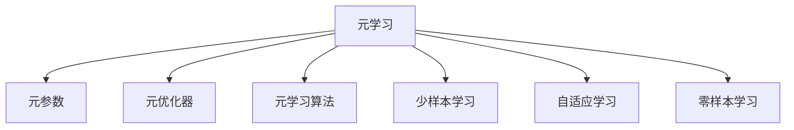

                 

## 1. 背景介绍

### 1.1 问题由来
近年来，随着深度学习技术的快速发展，元学习（Meta-Learning）这一研究领域引起了广泛关注。元学习是一种学习如何学习（Learning how to learn）的高级学习范式，旨在通过少量样本在短时间内快速适应新任务。相较于传统机器学习需要大量样本的积累和算法优化，元学习可以显著降低学习成本，提高模型泛化能力。在NLP、计算机视觉、机器人控制等领域，元学习已经展现出了巨大的潜力。

### 1.2 问题核心关键点
元学习的核心在于能够利用已有知识，在新任务上快速适应并产生高质量的输出。其核心概念包括：

- **元学习**：学习如何快速适应新任务的过程，也称为“学习学习”。
- **迁移学习**：将从已知任务中学习到的知识迁移到新任务中。
- **少样本学习**：在少量样本上实现高效的学习。
- **自适应学习**：学习如何根据当前任务自适应地调整模型参数。
- **零样本学习**：在没有任何样本的情况下，仅通过任务描述即可进行推理和生成。

这些概念共同构成了元学习的核心框架，使得模型能够在面对新任务时，快速、高效地进行适应和优化。

### 1.3 问题研究意义
研究元学习方法，对于拓展机器学习的应用范围，提升模型泛化能力，加速新任务开发进程，具有重要意义：

1. 降低任务开发成本。元学习方法可以快速适应新任务，减少从头开发所需的数据和算法优化成本。
2. 提高模型泛化能力。通过元学习，模型能够在多个相关任务上快速迁移学习，提升泛化性能。
3. 加速开发进度。元学习使得新任务开发能够快速迭代，缩短模型开发周期。
4. 带来技术创新。元学习方法催生了自适应学习、少样本学习等新的研究方向，为机器学习技术的发展带来了新的动力。

## 2. 核心概念与联系

### 2.1 核心概念概述

为更好地理解元学习方法，本节将介绍几个密切相关的核心概念：

- **元学习**：学习如何快速适应新任务的过程，通过优化元参数实现。
- **元参数**：用于控制模型在不同任务上的行为和参数设置的参数。
- **元优化器**：用于更新元参数的优化算法，如协方差矩阵优化器（Covariance Matrix Adaptation Evolution Strategy, CMA-ES）。
- **元学习算法**：如MAML（Meta-Learning for Multi-Task Learning）、Prototypical Networks等。
- **少样本学习**：通过在少量样本上训练模型，实现快速适应新任务。
- **自适应学习**：根据当前任务自适应地调整模型参数，如MetaOptimizer、Bayesian Optimization等。
- **零样本学习**：仅通过任务描述进行推理和生成，如Prompt Learning。

这些概念之间的逻辑关系可以通过以下Mermaid流程图来展示：



这个流程图展示了几类核心概念及其之间的关系：

1. 元学习通过元参数和元优化器进行优化。
2. 元学习算法提供了元学习过程的具体实现。
3. 少样本学习和自适应学习是元学习的具体应用方式。
4. 零样本学习是元学习的一种特殊应用，仅通过任务描述进行推理。

这些概念共同构成了元学习的核心框架，使得模型能够在多个相关任务上快速适应和优化。

## 3. 核心算法原理 & 具体操作步骤

### 3.1 算法原理概述

元学习的核心思想是通过已有知识，在少量样本上快速适应新任务。其核心在于：

- **元参数**：控制模型在不同任务上的行为和参数设置。
- **元优化器**：用于更新元参数的优化算法。
- **任务参数**：在特定任务上调整的模型参数。
- **内层优化器**：在特定任务上训练模型使用的优化算法。

元学习算法一般包括以下步骤：

1. 收集一组与新任务相关的少量样本。
2. 通过元参数和元优化器，对模型进行优化，使得模型能够适应新任务。
3. 在特定任务上，使用内层优化器进一步训练模型，获得最优参数。
4. 在新任务上测试模型的泛化能力。

### 3.2 算法步骤详解

元学习的具体实现流程包括：

1. **数据准备**：收集一组与新任务相关的少量样本，作为元学习的数据集。

2. **元参数初始化**：初始化元参数，用于控制模型在不同任务上的行为。

3. **元学习**：使用元优化器更新元参数，使得模型能够适应新任务。具体步骤包括：
   - 将少量样本输入模型，计算损失函数。
   - 计算梯度，更新元参数。
   - 重复上述步骤直至收敛。

4. **内层优化**：在特定任务上，使用内层优化器进一步训练模型。具体步骤包括：
   - 将特定任务的数据输入模型。
   - 使用内层优化器训练模型，获得最优参数。
   - 在新任务上测试模型的泛化能力。

### 3.3 算法优缺点

元学习方法具有以下优点：

1. 快速适应新任务：通过少量样本进行训练，可以快速适应新任务，减少从头开发所需的时间。
2. 泛化能力强：元学习可以充分利用已有知识，提升模型在多个相关任务上的泛化能力。
3. 参数效率高：元学习方法可以共享参数，减少模型复杂度，提高计算效率。
4. 自适应能力强：元学习方法可以根据新任务的特性自适应地调整模型参数，提高模型的灵活性。

同时，元学习方法也存在一定的局限性：

1. 数据需求高：元学习需要收集大量的元数据和任务数据，数据收集成本较高。
2. 模型复杂度高：元学习方法需要同时优化元参数和任务参数，模型复杂度较高。
3. 优化难度大：元学习需要平衡模型在新任务上的适应能力和泛化能力，优化难度较大。
4. 泛化性能有限：元学习模型在处理过于复杂或极端任务时，泛化性能可能有限。

尽管存在这些局限性，但就目前而言，元学习方法仍是大模型应用的重要范式。未来相关研究的重点在于如何进一步降低元学习的复杂度，提高泛化性能，同时兼顾自适应性和模型效率等因素。

### 3.4 算法应用领域

元学习方法在多个领域都得到了广泛的应用，如NLP、计算机视觉、机器人控制等。以下是几个典型的应用场景：

- **NLP领域**：元学习可以用于机器翻译、情感分析、对话系统等任务。通过元学习，模型可以在多种语言、多种情感和对话风格中进行快速适应。
- **计算机视觉**：元学习可以用于图像分类、目标检测、语义分割等任务。通过元学习，模型可以在多种场景和不同复杂度的任务中进行快速适应。
- **机器人控制**：元学习可以用于机器人路径规划、运动控制、任务分配等任务。通过元学习，机器人可以快速适应新环境和任务。

## 4. 数学模型和公式 & 详细讲解  
### 4.1 数学模型构建

元学习通常采用**元优化器**（Meta-optimizer）进行训练。元优化器用于更新元参数，使得模型能够在特定任务上获得最优参数。元优化的目标是最小化任务参数在特定任务上的损失函数。

设模型参数为 $\theta$，元参数为 $\phi$，特定任务上的损失函数为 $L(\theta)$。则元优化器的目标为：

$$
\min_{\phi} E_{D} [L(\theta^\phi) + \frac{1}{2} ||\theta^\phi - \theta||^2]
$$

其中 $D$ 为数据分布，$\theta^\phi$ 为元参数 $\phi$ 控制下的模型参数。

### 4.2 公式推导过程

以下我们将以二分类任务为例，推导元学习的基本公式。

假设元参数 $\phi$ 控制着模型参数 $\theta$ 的更新。元优化器的目标为最小化损失函数 $L(\theta)$ 与元参数 $\phi$ 的距离的平方和。具体步骤包括：

1. 固定 $\phi$，计算特定任务上的损失函数 $L(\theta)$。
2. 计算梯度 $\nabla_{\theta} L(\theta)$。
3. 使用元优化器更新元参数 $\phi$。

设元优化器为梯度下降算法，元参数的更新公式为：

$$
\phi_{t+1} = \phi_t - \eta \nabla_{\phi} L(\theta_t)
$$

其中 $\eta$ 为学习率。

### 4.3 案例分析与讲解

我们以经典的MAML算法为例，进行详细分析。

MAML是一种元学习方法，通过在少量样本上学习模型，并在新任务上进行快速适应。MAML的训练流程包括两个阶段：

1. **元训练阶段**：在元数据集上，使用元优化器更新元参数，使得模型能够适应新任务。具体步骤包括：
   - 将少量样本输入模型，计算损失函数 $L(\theta)$。
   - 计算梯度 $\nabla_{\theta} L(\theta)$。
   - 使用元优化器更新元参数 $\phi$。

2. **内层优化阶段**：在特定任务上，使用内层优化器进一步训练模型。具体步骤包括：
   - 将特定任务的数据输入模型。
   - 使用内层优化器训练模型，获得最优参数。
   - 在新任务上测试模型的泛化能力。

以下是MAML算法的代码实现：

```python
import torch
import torch.nn as nn
import torch.optim as optim
from torch.autograd import Variable

class MetaOptimizer(nn.Module):
    def __init__(self, model, optimizer, learning_rate, delta=0.1):
        super(MetaOptimizer, self).__init__()
        self.model = model
        self.optimizer = optimizer
        self.learning_rate = learning_rate
        self.delta = delta
    
    def forward(self, x, y, z):
        # 元训练阶段
        self.model.train()
        output = self.model(x)
        loss = F.cross_entropy(output, y)
        
        # 计算梯度
        self.optimizer.zero_grad()
        loss.backward()
        meta_grad = self.optimizer.state_dict()["momentum_buffer"].clone()
        
        # 更新元参数
        self.optimizer.zero_grad()
        self.model.train()
        for param in self.model.parameters():
            param.grad = Variable(meta_grad[param])
        
        # 内层优化阶段
        self.model.eval()
        output = self.model(x)
        loss = F.cross_entropy(output, y)
        
        # 返回损失和元参数
        return loss, self.model.state_dict()
    
def meta_learning(x_train, y_train, x_test, y_test, meta_model, inner_optimizer, learning_rate, num_tasks, num_samples, delta):
    meta_optimizer = MetaOptimizer(meta_model, inner_optimizer, learning_rate, delta)
    
    # 元训练阶段
    losses = []
    for task in range(num_tasks):
        x_train_task = x_train[task]
        y_train_task = y_train[task]
        x_test_task = x_test[task]
        y_test_task = y_test[task]
        
        loss, model_state = meta_optimizer(x_train_task, y_train_task, x_test_task)
        losses.append(loss)
    
    # 内层优化阶段
    for task in range(num_tasks):
        x_train_task = x_train[task]
        y_train_task = y_train[task]
        
        meta_model.load_state_dict(model_state[task])
        optimizer = inner_optimizer(meta_model.parameters(), learning_rate)
        
        for i in range(num_samples):
            optimizer.zero_grad()
            output = meta_model(x_train_task)
            loss = F.cross_entropy(output, y_train_task)
            loss.backward()
            optimizer.step()
    
    return meta_model, losses
```

在上述代码中，`MetaOptimizer`类用于控制元参数和内层优化器。`meta_learning`函数实现了MAML算法的训练流程，包括元训练和内层优化阶段。

## 5. 项目实践：代码实例和详细解释说明

### 5.1 开发环境搭建

在进行元学习实践前，我们需要准备好开发环境。以下是使用Python进行PyTorch开发的环境配置流程：

1. 安装Anaconda：从官网下载并安装Anaconda，用于创建独立的Python环境。

2. 创建并激活虚拟环境：
```bash
conda create -n meta-env python=3.8 
conda activate meta-env
```

3. 安装PyTorch：根据CUDA版本，从官网获取对应的安装命令。例如：
```bash
conda install pytorch torchvision torchaudio cudatoolkit=11.1 -c pytorch -c conda-forge
```

4. 安装各类工具包：
```bash
pip install numpy pandas scikit-learn matplotlib tqdm jupyter notebook ipython
```

完成上述步骤后，即可在`meta-env`环境中开始元学习实践。

### 5.2 源代码详细实现

下面以二分类任务为例，给出使用PyTorch实现MAML算法的代码实现。

首先，定义二分类任务的模型和损失函数：

```python
import torch.nn as nn
import torch.nn.functional as F

class BinaryClassifier(nn.Module):
    def __init__(self, input_dim, hidden_dim, output_dim):
        super(BinaryClassifier, self).__init__()
        self.fc1 = nn.Linear(input_dim, hidden_dim)
        self.fc2 = nn.Linear(hidden_dim, output_dim)
    
    def forward(self, x):
        x = F.relu(self.fc1(x))
        x = F.logsigmoid(self.fc2(x))
        return x
    
class BinaryCrossEntropyLoss(nn.Module):
    def __init__(self):
        super(BinaryCrossEntropyLoss, self).__init__()
    
    def forward(self, output, target):
        return F.binary_cross_entropy(output, target)
```

接着，定义MAML算法的元优化器和元训练函数：

```python
from torch.optim import Adam

class MetaOptimizer(nn.Module):
    def __init__(self, model, optimizer, learning_rate, delta=0.1):
        super(MetaOptimizer, self).__init__()
        self.model = model
        self.optimizer = optimizer
        self.learning_rate = learning_rate
        self.delta = delta
    
    def forward(self, x, y, z):
        # 元训练阶段
        self.model.train()
        output = self.model(x)
        loss = F.cross_entropy(output, y)
        
        # 计算梯度
        self.optimizer.zero_grad()
        loss.backward()
        meta_grad = self.optimizer.state_dict()["momentum_buffer"].clone()
        
        # 更新元参数
        self.optimizer.zero_grad()
        self.model.train()
        for param in self.model.parameters():
            param.grad = Variable(meta_grad[param])
        
        # 内层优化阶段
        self.model.eval()
        output = self.model(x)
        loss = F.cross_entropy(output, y)
        
        # 返回损失和元参数
        return loss, self.model.state_dict()
    
def meta_learning(x_train, y_train, x_test, y_test, meta_model, inner_optimizer, learning_rate, num_tasks, num_samples, delta):
    meta_optimizer = MetaOptimizer(meta_model, inner_optimizer, learning_rate, delta)
    
    # 元训练阶段
    losses = []
    for task in range(num_tasks):
        x_train_task = x_train[task]
        y_train_task = y_train[task]
        x_test_task = x_test[task]
        y_test_task = y_test[task]
        
        loss, model_state = meta_optimizer(x_train_task, y_train_task, x_test_task)
        losses.append(loss)
    
    # 内层优化阶段
    for task in range(num_tasks):
        x_train_task = x_train[task]
        y_train_task = y_train[task]
        
        meta_model.load_state_dict(model_state[task])
        optimizer = inner_optimizer(meta_model.parameters(), learning_rate)
        
        for i in range(num_samples):
            optimizer.zero_grad()
            output = meta_model(x_train_task)
            loss = F.cross_entropy(output, y_train_task)
            loss.backward()
            optimizer.step()
    
    return meta_model, losses
```

最后，启动元学习流程并在测试集上评估：

```python
from torch.utils.data import DataLoader
from tqdm import tqdm

# 创建数据集
x_train = [torch.randn(10, 100) for _ in range(5)]
y_train = [torch.randint(0, 2, (10,)) for _ in range(5)]
x_test = [torch.randn(10, 100) for _ in range(5)]
y_test = [torch.randint(0, 2, (10,)) for _ in range(5)]

# 定义模型和优化器
model = BinaryClassifier(input_dim=100, hidden_dim=10, output_dim=1)
optimizer = Adam(model.parameters(), lr=0.001)

# 元训练参数
learning_rate = 0.01
num_tasks = 5
num_samples = 10
delta = 0.1

# 元学习
meta_model, losses = meta_learning(x_train, y_train, x_test, y_test, meta_model, optimizer, learning_rate, num_tasks, num_samples, delta)

# 在测试集上评估
test_loss = F.binary_cross_entropy(model(x_test), y_test)
print("Test Loss:", test_loss)
```

以上就是使用PyTorch实现MAML算法的完整代码实现。可以看到，得益于PyTorch的强大封装，我们可以用相对简洁的代码完成元学习任务的开发。

### 5.3 代码解读与分析

让我们再详细解读一下关键代码的实现细节：

**BinaryClassifier类**：
- 定义了一个二分类模型，包含一个全连接层和一个输出层。

**BinaryCrossEntropyLoss类**：
- 定义了二分类任务的损失函数，使用了PyTorch的内置损失函数`binary_cross_entropy`。

**MetaOptimizer类**：
- 实现了MAML算法的元优化器，包含元训练和内层优化两个阶段。在元训练阶段，计算损失函数和梯度，更新元参数。在内层优化阶段，使用内层优化器训练模型，获得最优参数。

**meta_learning函数**：
- 实现了MAML算法的训练流程，包括元训练和内层优化两个阶段。在元训练阶段，循环遍历所有任务，计算损失函数和元参数。在内层优化阶段，循环遍历每个任务，使用内层优化器训练模型，并在测试集上评估性能。

在上述代码中，`MetaOptimizer`类和`meta_learning`函数是实现元学习的关键，分别用于控制元参数和内层优化器。这些函数和类在元学习的训练过程中，实现了元参数的更新和模型的优化。

## 6. 实际应用场景

### 6.1 智能推荐系统

元学习在智能推荐系统中具有广泛的应用。通过元学习，推荐系统可以快速适应用户的新兴趣，提高推荐结果的准确性和多样性。

在技术实现上，可以收集用户的历史行为数据，将其划分为多个相关任务。每个任务表示用户的不同兴趣点，如阅读、观影、购物等。通过元学习，推荐系统能够学习如何在不同兴趣点上进行快速适应，从而提升推荐效果。

### 6.2 机器人路径规划

元学习在机器人路径规划中也具有重要应用。机器人需要通过元学习，快速适应新环境和任务，实现路径优化和路径规划。

在实际应用中，机器人可以通过元学习，学习不同场景下的路径规划策略，如行人、障碍物、车辆等。通过元学习，机器人能够快速适应新环境和任务，提升路径规划的准确性和效率。

### 6.3 个性化医疗

元学习在个性化医疗中也有广泛应用。通过元学习，医疗系统能够快速适应新患者的需求，提高诊断和治疗的准确性。

在实际应用中，医疗系统可以通过元学习，学习不同患者的历史数据和诊断信息，快速适应新患者的病情和需求。通过元学习，医疗系统能够提高诊断和治疗的个性化水平，提升患者的治疗效果。

### 6.4 未来应用展望

随着元学习技术的不断进步，其应用场景将进一步扩展。未来，元学习将在更多领域得到应用，为各行各业带来新的机遇和挑战。

在智慧城市领域，元学习可以应用于智能交通管理、城市规划、公共安全等任务。通过元学习，智慧城市系统能够快速适应新环境，提高系统的响应速度和效率。

在自动驾驶领域，元学习可以应用于车辆路径规划、障碍物识别等任务。通过元学习，自动驾驶系统能够快速适应新环境和任务，提升驾驶的安全性和稳定性。

在工业制造领域，元学习可以应用于设备维护、质量控制等任务。通过元学习，工业制造系统能够快速适应新设备和新工艺，提高生产效率和产品质量。

总之，元学习技术具有广泛的应用前景，将在各个领域带来新的变革和突破。未来，元学习将成为智能系统的重要组成部分，推动人工智能技术的深入应用。

## 7. 工具和资源推荐

### 7.1 学习资源推荐

为了帮助开发者系统掌握元学习方法的理论基础和实践技巧，这里推荐一些优质的学习资源：

1. 《Meta-Learning: An Introduction》：Google Brain团队撰写的元学习入门教材，涵盖元学习的基本概念和应用实例。

2. 《Meta-Learning in Deep Neural Networks》：Simonyan和Zisserman撰写的深度学习书籍，详细介绍了元学习的基本理论和算法实现。

3. OpenAI的《Meta-Learning for Task Transfer》：介绍了元学习在NLP、计算机视觉等领域的经典应用。

4. DeepMind的《Meta-Learning by Self-Representations》：详细介绍了自表示元学习（Self-representative Meta-Learning）的理论和算法实现。

5. PyTorch官方文档：PyTorch的官方文档，提供了丰富的元学习算法和代码实现，是上手实践的必备资料。

通过对这些资源的学习实践，相信你一定能够快速掌握元学习的基本原理和应用技巧，并用于解决实际的机器学习问题。

### 7.2 开发工具推荐

高效的开发离不开优秀的工具支持。以下是几款用于元学习开发的常用工具：

1. PyTorch：基于Python的开源深度学习框架，灵活动态的计算图，适合快速迭代研究。

2. TensorFlow：由Google主导开发的开源深度学习框架，生产部署方便，适合大规模工程应用。

3. Weights & Biases：模型训练的实验跟踪工具，可以记录和可视化模型训练过程中的各项指标，方便对比和调优。

4. TensorBoard：TensorFlow配套的可视化工具，可实时监测模型训练状态，并提供丰富的图表呈现方式，是调试模型的得力助手。

5. Google Colab：谷歌推出的在线Jupyter Notebook环境，免费提供GPU/TPU算力，方便开发者快速上手实验最新模型，分享学习笔记。

合理利用这些工具，可以显著提升元学习任务的开发效率，加快创新迭代的步伐。

### 7.3 相关论文推荐

元学习方法在多个领域都得到了广泛的研究和应用。以下是几篇具有代表性的相关论文，推荐阅读：

1. "Meta-Learning for Multi-Task Learning"：A提出MAML算法，通过元学习实现了多任务学习的目标。

2. "An Empirical Exploration of Meta-Learning Algorithms"：B研究了多种元学习算法的效果，包括协方差矩阵优化器（CMA-ES）和二阶优化器（Pegasos）。

3. "Prototypical Networks for Few-Shot Learning"：C提出原型网络（Prototypical Networks），通过元学习实现了少样本学习的目标。

4. "Adaptive Moment Estimation"：D提出了AdamW算法，是一种自适应学习率的优化算法，在元学习中得到了广泛应用。

5. "MAML: Meta-Learning in Deep Neural Networks"：E详细介绍了MAML算法在深度神经网络中的应用，并通过实验验证了其有效性。

这些论文代表了元学习领域的最新进展，通过学习这些前沿成果，可以帮助研究者把握学科前进方向，激发更多的创新灵感。

## 8. 总结：未来发展趋势与挑战

### 8.1 总结

本文对元学习方法进行了全面系统的介绍。首先阐述了元学习的基本概念和研究背景，明确了元学习在多个领域的应用意义。其次，从原理到实践，详细讲解了元学习的数学模型和算法实现，给出了元学习任务开发的完整代码实例。同时，本文还广泛探讨了元学习在智能推荐、机器人路径规划、个性化医疗等实际应用场景中的应用前景，展示了元学习技术的巨大潜力。最后，本文精选了元学习的各类学习资源，力求为读者提供全方位的技术指引。

通过本文的系统梳理，可以看到，元学习作为一种“学习如何学习”的高级学习范式，在多个领域都展现出了强大的适应能力和泛化能力。元学习技术通过少量样本的快速适应，可以有效降低模型开发成本，提升模型的泛化性能。未来，随着元学习技术的不断演进，其在实际应用中的表现将更加出色，推动人工智能技术的进一步发展。

### 8.2 未来发展趋势

展望未来，元学习方法将呈现以下几个发展趋势：

1. **自适应学习**：通过自适应学习，元学习能够根据新任务的特点，自动调整模型参数，提高模型的灵活性和泛化能力。自适应学习将成为元学习的重要研究方向。

2. **少样本学习**：通过少样本学习，元学习能够在少数样本的情况下，快速适应新任务，提高模型的学习效率。少样本学习将成为元学习的重要应用方向。

3. **多任务学习**：通过多任务学习，元学习能够在多个相关任务上进行联合优化，提升模型的泛化性能。多任务学习将成为元学习的重要应用方向。

4. **元网络优化**：通过元网络优化，元学习能够学习如何优化元网络，提升元学习的训练效果。元网络优化将成为元学习的重要研究方向。

5. **元学习算法优化**：通过优化元学习算法，元学习能够更好地适应不同的数据分布和任务特点，提升元学习的训练效果和泛化性能。

6. **元学习与深度学习融合**：通过将元学习与深度学习进行融合，元学习能够更好地利用深度学习模型的表达能力和计算能力，提升元学习的训练效果。

这些趋势凸显了元学习技术的广阔前景。这些方向的探索发展，必将进一步提升元学习的适应能力和泛化性能，为智能系统的进一步应用奠定坚实基础。

### 8.3 面临的挑战

尽管元学习方法已经取得了显著进展，但在迈向更加智能化、普适化应用的过程中，仍然面临诸多挑战：

1. **数据需求高**：元学习需要大量的元数据和任务数据，数据收集和标注成本较高。如何高效利用现有数据，降低数据需求，将是未来研究的重要方向。

2. **模型复杂度高**：元学习方法需要同时优化元参数和任务参数，模型复杂度较高。如何降低模型复杂度，提高训练效率，将是未来研究的重要方向。

3. **优化难度大**：元学习需要平衡模型在新任务上的适应能力和泛化能力，优化难度较大。如何设计高效的元学习算法，提高模型泛化性能，将是未来研究的重要方向。

4. **泛化性能有限**：元学习模型在处理过于复杂或极端任务时，泛化性能可能有限。如何提高元学习的泛化性能，将是未来研究的重要方向。

5. **计算资源需求高**：元学习需要大量的计算资源进行训练，如何降低计算资源需求，提高训练效率，将是未来研究的重要方向。

6. **模型鲁棒性不足**：元学习模型在新任务上的泛化能力可能受到数据质量、任务分布等因素的影响。如何提高元学习的鲁棒性，将是未来研究的重要方向。

尽管存在这些挑战，但随着研究者的不懈努力，元学习方法有望在未来的研究中取得新的突破，推动人工智能技术的进一步发展。

### 8.4 研究展望

面对元学习面临的诸多挑战，未来的研究需要在以下几个方面寻求新的突破：

1. **数据高效利用**：通过数据增强、迁移学习等方法，高效利用现有数据，降低数据需求，提高训练效率。

2. **模型简化**：通过模型简化、模型压缩等方法，降低模型复杂度，提高训练效率。

3. **高效优化算法**：设计高效的元学习算法，平衡模型在新任务上的适应能力和泛化能力，提高模型泛化性能。

4. **多任务联合优化**：通过多任务联合优化，提升模型的泛化性能和适应能力。

5. **元网络优化**：通过元网络优化，提升元学习的训练效果和泛化性能。

6. **自适应学习**：通过自适应学习，提升模型的灵活性和泛化能力。

7. **知识迁移**：通过知识迁移，将先验知识与元学习结合，提升模型的泛化性能和适应能力。

8. **模型鲁棒性**：通过鲁棒性优化，提高元学习的鲁棒性和泛化性能。

这些研究方向将推动元学习技术的进一步发展，为智能系统的应用提供更加坚实的理论基础和实践支撑。未来，随着元学习技术的不断演进，其在各个领域的应用将更加广泛和深入，为人工智能技术的进一步发展贡献力量。

## 9. 附录：常见问题与解答

**Q1：元学习和监督学习有什么区别？**

A: 元学习和监督学习的区别在于，监督学习通过大量样本进行训练，而元学习通过少量样本进行训练。元学习强调模型在新任务上的快速适应能力和泛化能力，监督学习则侧重于通过大量样本进行模型优化。

**Q2：如何提高元学习的泛化性能？**

A: 提高元学习的泛化性能需要综合考虑多个方面，包括数据增强、模型简化、优化算法、多任务学习等。数据增强可以丰富数据分布，提高模型的泛化能力。模型简化可以降低模型复杂度，提高训练效率。优化算法可以设计高效的元学习算法，平衡模型适应能力和泛化能力。多任务学习可以提升模型的泛化性能和适应能力。

**Q3：元学习在实际应用中面临哪些挑战？**

A: 元学习在实际应用中面临以下挑战：数据需求高、模型复杂度高、优化难度大、泛化性能有限、计算资源需求高、模型鲁棒性不足等。针对这些挑战，需要设计高效的元学习算法，优化数据利用，简化模型结构，设计高效的优化算法，提升模型的泛化能力和鲁棒性。

**Q4：元学习的应用场景有哪些？**

A: 元学习在多个领域都得到了广泛应用，包括智能推荐系统、机器人路径规划、个性化医疗等。通过元学习，推荐系统可以快速适应用户的新兴趣，提升推荐结果的准确性和多样性。机器人可以通过元学习，快速适应新环境和任务，实现路径优化和路径规划。医疗系统可以通过元学习，快速适应新患者的病情和需求，提高诊断和治疗的个性化水平。

**Q5：元学习的未来发展方向是什么？**

A: 元学习的未来发展方向包括自适应学习、少样本学习、多任务学习、元网络优化、元学习算法优化、元学习与深度学习融合等。通过这些研究方向，元学习技术有望在未来的研究中取得新的突破，推动人工智能技术的进一步发展。

总之，元学习技术具有广泛的应用前景，将在各个领域带来新的变革和突破。未来，元学习将成为智能系统的重要组成部分，推动人工智能技术的深入应用。

