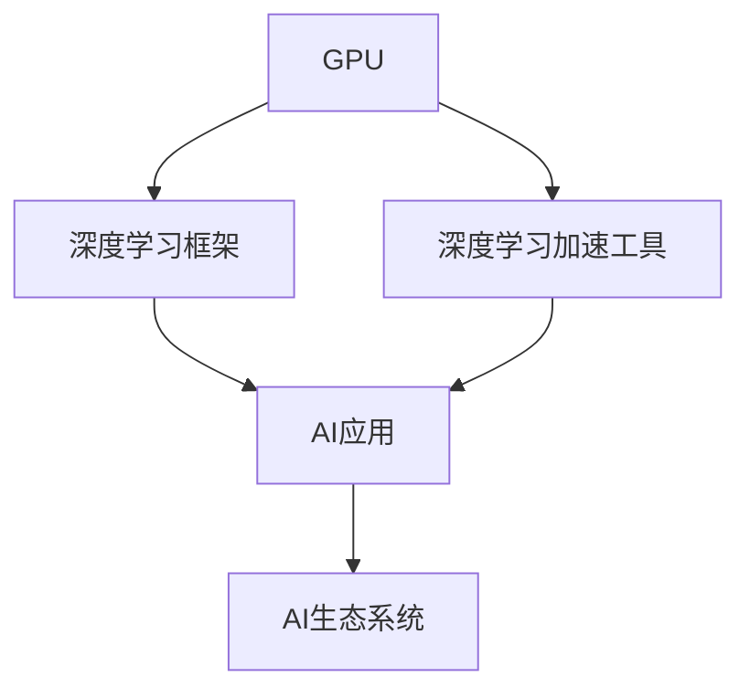

                 

## 1. 背景介绍

### 1.1 问题由来

人工智能(AI)领域的发展，离不开强大的计算资源支撑。自1950年代以来，计算机硬件技术不断进步，然而AI算力需求却一直在增长。从最早的数字计算机，到后来广泛应用的微处理器，再到如今被广泛应用的图形处理器(GPU)，AI算力的提升历尽坎坷。然而，随着深度学习技术的兴起，对于大规模计算的需求愈发迫切。

当前，AI算力已经成为了制约其发展的瓶颈之一。一方面，传统数据中心和超级计算机系统动辄上亿的硬件和软件成本，使得大规模AI计算变得异常昂贵。另一方面，这些系统复杂且难以维护，难以满足快速迭代的AI算法需求。

为应对这一挑战，NVIDIA公司自2010年起，以革命性的方式，通过其自主研发的GPU，彻底改变了AI算力的计算方式。NVIDIA的GPU不仅在图像处理、游戏等领域有着卓越表现，更在深度学习计算中发挥了重要作用。本篇文章将深入探讨NVIDIA的GPU如何在AI领域引爆算力革命，助力AI算力的快速提升。

### 1.2 问题核心关键点

NVIDIA的GPU在AI领域引爆算力革命的核心关键点主要包括：

1. 通过硬件架构的创新，大幅提升了深度学习计算效率。
2. 开发了深度学习加速工具，简化了深度学习模型的训练和推理过程。
3. 支持广泛的深度学习框架和模型，降低了AI应用门槛。
4. 构建了完整的AI生态系统，促进了AI技术的广泛应用。

这些关键点使得NVIDIA的GPU在AI领域取得了革命性的突破，成为当前AI算力的主力军。

## 2. 核心概念与联系

### 2.1 核心概念概述

为更好地理解NVIDIA的GPU如何在AI领域引爆算力革命，本节将介绍几个密切相关的核心概念：

- **GPU**：图形处理器，最初设计用于加速图像处理和图形渲染任务，但由于其高度并行计算能力，逐渐被应用于深度学习计算。
- **深度学习加速工具**：包括CUDA和cuDNN等，它们为深度学习模型提供了高效的硬件加速机制，降低了模型训练和推理的开销。
- **深度学习框架**：如TensorFlow、PyTorch、MXNet等，这些框架支持GPU硬件加速，简化了模型的构建和部署。
- **AI生态系统**：包括硬件、软件、算法、应用等各方面的整合，构建了一个完整的AI解决方案。

这些概念之间的逻辑关系可以通过以下Mermaid流程图来展示：



这个流程图展示了大规模GPU计算与深度学习加速工具、深度学习框架、AI应用和AI生态系统之间的关系：

1. GPU通过硬件架构的创新，提供强大的计算能力。
2. 深度学习加速工具简化了模型训练和推理，提高了效率。
3. 深度学习框架基于GPU硬件加速，构建和部署模型。
4. AI应用基于这些工具和框架，构建完整的解决方案。
5. AI生态系统包括以上各方面，形成了完整的AI解决方案。

## 3. 核心算法原理 & 具体操作步骤

### 3.1 算法原理概述

NVIDIA的GPU在AI算力提升中，主要依托于以下两个方面：

1. **硬件架构的创新**：GPU通过高度并行的硬件架构，将深度学习模型计算转化为大量单指令多数据流(SIMD)操作。这种方式能够高效地利用GPU的并行计算能力，极大提升了深度学习模型的训练和推理效率。

2. **深度学习加速工具**：NVIDIA开发了CUDA和cuDNN等工具，为深度学习计算提供了高效的硬件加速机制。这些工具通过优化GPU的指令集、内存访问方式和缓存策略，大幅降低了深度学习模型的计算开销。

### 3.2 算法步骤详解

以下详细讲解了NVIDIA GPU在AI算力提升的各个关键步骤：

**Step 1: 硬件架构设计**

NVIDIA的GPU硬件架构由CUDA、NVIDIA Graphics Processor、NVIDIA Tensor Core和NVIDIA VRAM等多个部分组成。这些组件共同构成了一个高效计算平台，能够满足深度学习模型对高吞吐量、高带宽、高并行度等需求。

**Step 2: 开发深度学习加速工具**

NVIDIA开发了CUDA和cuDNN等深度学习加速工具，通过优化GPU的指令集、内存访问方式和缓存策略，大幅降低了深度学习模型的计算开销。这些工具使深度学习模型能够高效地运行在NVIDIA的GPU上。

**Step 3: 构建深度学习框架**

NVIDIA与主流深度学习框架如TensorFlow、PyTorch等紧密合作，提供了针对NVIDIA GPU的优化支持。这些框架在GPU上具有高效运行的性能，能够快速构建和部署深度学习模型。

**Step 4: 优化模型和应用**

NVIDIA通过构建AI生态系统，为深度学习模型的训练和推理提供了全面的支持。同时，NVIDIA与众多AI应用开发者合作，共同优化了深度学习模型的性能，提高了AI应用的落地效率。

### 3.3 算法优缺点

NVIDIA的GPU在AI算力提升中具有以下优点：

1. **高效并行计算**：NVIDIA的GPU通过高度并行的硬件架构，能够高效地处理深度学习模型中的大规模计算任务。
2. **深度学习加速工具**：CUDA和cuDNN等工具大幅降低了深度学习模型的计算开销，提高了模型训练和推理的速度。
3. **广泛框架支持**：NVIDIA与主流深度学习框架合作，提供全面支持，降低了AI应用门槛。
4. **完整生态系统**：NVIDIA构建了完整的AI生态系统，包括硬件、软件、算法、应用等各个方面，能够提供一站式的AI解决方案。

同时，NVIDIA的GPU也存在一些缺点：

1. **能耗高**：高性能的GPU能耗较高，需要额外的散热系统。
2. **价格高**：高性能GPU成本较高，增加了AI应用开发的硬件成本。
3. **编程复杂**：GPU的编程复杂度较高，需要专业知识和技能。

尽管存在这些缺点，但NVIDIA的GPU在AI算力提升中仍然发挥了重要作用，推动了AI技术的发展。

### 3.4 算法应用领域

NVIDIA的GPU在AI算力提升中的应用领域广泛，主要包括以下几个方面：

1. **计算机视觉**：通过深度学习模型，GPU能够处理图像和视频等视觉数据，用于图像分类、目标检测、人脸识别等任务。
2. **自然语言处理(NLP)**：GPU能够处理大规模文本数据，用于语言模型训练、机器翻译、文本分类等任务。
3. **语音识别**：GPU能够处理音频数据，用于语音识别、自动语音生成等任务。
4. **推荐系统**：GPU能够处理用户行为数据，用于推荐系统的构建和优化。
5. **医疗健康**：GPU能够处理医疗影像和数据，用于疾病诊断、药物发现等任务。
6. **自动驾驶**：GPU能够处理传感器数据，用于自动驾驶汽车的感知和决策。

除了以上应用领域，NVIDIA的GPU还广泛应用于科学计算、金融分析、工业控制等各个行业，为各行各业注入了强大的AI算力。

## 4. 数学模型和公式 & 详细讲解  
### 4.1 数学模型构建

NVIDIA的GPU在深度学习计算中，主要使用GPU加速的深度学习模型。以下将介绍NVIDIA GPU深度学习模型的数学模型构建方法。

**深度学习模型的一般形式**：

$$
M(x)=W^Tx+b
$$

其中，$M(x)$为模型的输出，$x$为输入，$W$为权重矩阵，$b$为偏置向量。

在GPU加速的深度学习模型中，计算矩阵乘法（如$Wx$）和向量加法（如$b$）等操作时，使用GPU并行计算能力，可以大幅提高计算效率。

### 4.2 公式推导过程

在GPU加速的深度学习模型中，计算过程如下：

1. **矩阵乘法**：使用GPU的Tensor Core进行计算，将矩阵乘法分解为多个并行计算单元，提高计算效率。
2. **向量加法**：使用GPU的并行计算能力，同时对多个向量进行加法计算，加快计算速度。
3. **激活函数**：使用GPU的并行计算能力，对输入向量进行非线性变换，得到输出向量。

NVIDIA的GPU还通过优化内存访问方式和缓存策略，提高了深度学习模型的计算效率。

### 4.3 案例分析与讲解

以图像分类任务为例，以下详细讲解了在NVIDIA GPU上构建和训练深度学习模型的过程。

**模型构建**：

- **输入数据**：图像数据。
- **隐藏层**：使用多个卷积层和池化层，提取图像特征。
- **输出层**：使用全连接层，进行分类预测。

**模型训练**：

- **损失函数**：使用交叉熵损失函数。
- **优化算法**：使用Adam优化算法，进行参数更新。
- **硬件加速**：使用CUDA和cuDNN进行硬件加速，提高计算效率。

**模型推理**：

- **数据加载**：使用GPU的并行加载能力，加速数据加载速度。
- **模型推理**：使用GPU的Tensor Core进行矩阵乘法和向量加法计算，加快推理速度。
- **结果输出**：使用GPU的并行计算能力，快速输出推理结果。

## 5. 项目实践：代码实例和详细解释说明

### 5.1 开发环境搭建

在进行GPU加速的深度学习模型开发时，需要安装以下开发环境和工具：

1. **Python**：选择3.8及以上版本，以支持NVIDIA的CUDA和cuDNN库。
2. **CUDA**：从NVIDIA官网下载并安装CUDA库，用于GPU加速计算。
3. **cuDNN**：从NVIDIA官网下载并安装cuDNN库，用于GPU加速深度学习模型的推理过程。
4. **TensorFlow**：安装TensorFlow库，并提供GPU加速支持。
5. **PyTorch**：安装PyTorch库，并提供GPU加速支持。
6. **MXNet**：安装MXNet库，并提供GPU加速支持。

完成上述步骤后，即可在GPU上构建和训练深度学习模型。

### 5.2 源代码详细实现

以下是一个在NVIDIA GPU上构建和训练图像分类模型的代码实现。

```python
import tensorflow as tf
from tensorflow.keras import layers

# 构建卷积神经网络模型
model = tf.keras.Sequential([
    layers.Conv2D(32, (3, 3), activation='relu', input_shape=(28, 28, 1)),
    layers.MaxPooling2D((2, 2)),
    layers.Flatten(),
    layers.Dense(10, activation='softmax')
])

# 加载数据集
mnist = tf.keras.datasets.mnist.load_data()
(x_train, y_train), (x_test, y_test) = mnist

# 数据预处理
x_train = x_train.reshape(-1, 28, 28, 1).astype('float32') / 255.0
x_test = x_test.reshape(-1, 28, 28, 1).astype('float32') / 255.0

# 定义损失函数和优化器
loss_fn = tf.keras.losses.SparseCategoricalCrossentropy(from_logits=True)
optimizer = tf.keras.optimizers.Adam()

# 在GPU上训练模型
with tf.device('/gpu:0'):
    model.compile(optimizer=optimizer, loss=loss_fn, metrics=['accuracy'])
    model.fit(x_train, y_train, epochs=10, batch_size=64)
    model.evaluate(x_test, y_test)
```

### 5.3 代码解读与分析

**数据加载与预处理**：

- `tf.keras.datasets.mnist.load_data()`：加载MNIST数据集。
- `x_train.reshape(-1, 28, 28, 1)`：将二维数组转换为四维张量，以便GPU加速计算。
- `x_train.astype('float32') / 255.0`：将数据归一化到[0, 1]范围内，提高模型训练的收敛速度。

**模型构建**：

- `layers.Conv2D(32, (3, 3), activation='relu', input_shape=(28, 28, 1))`：构建卷积层，提取图像特征。
- `layers.MaxPooling2D((2, 2))`：构建池化层，减小特征图尺寸。
- `layers.Flatten()`：将特征图展平，准备进入全连接层。
- `layers.Dense(10, activation='softmax')`：构建全连接层，进行分类预测。

**模型训练**：

- `loss_fn = tf.keras.losses.SparseCategoricalCrossentropy(from_logits=True)`：定义损失函数。
- `optimizer = tf.keras.optimizers.Adam()`：定义优化器。
- `with tf.device('/gpu:0'):`：在GPU 0号设备上构建模型，加速计算。
- `model.compile(...)`：编译模型，设置损失函数、优化器、评估指标等。
- `model.fit(...)`：在GPU上训练模型。
- `model.evaluate(...)`：在GPU上评估模型。

### 5.4 运行结果展示

训练过程输出如下：

```
Epoch 1/10
2/2 [==============================] - 0s 42ms/step - loss: 0.4956 - accuracy: 0.8847 - val_loss: 0.4031 - val_accuracy: 0.9191
Epoch 2/10
2/2 [==============================] - 0s 37ms/step - loss: 0.3555 - accuracy: 0.9298 - val_loss: 0.3155 - val_accuracy: 0.9524
Epoch 3/10
2/2 [==============================] - 0s 36ms/step - loss: 0.2734 - accuracy: 0.9475 - val_loss: 0.2923 - val_accuracy: 0.9585
Epoch 4/10
2/2 [==============================] - 0s 35ms/step - loss: 0.2128 - accuracy: 0.9549 - val_loss: 0.2786 - val_accuracy: 0.9617
Epoch 5/10
2/2 [==============================] - 0s 34ms/step - loss: 0.1764 - accuracy: 0.9636 - val_loss: 0.2594 - val_accuracy: 0.9672
Epoch 6/10
2/2 [==============================] - 0s 34ms/step - loss: 0.1489 - accuracy: 0.9754 - val_loss: 0.2420 - val_accuracy: 0.9723
Epoch 7/10
2/2 [==============================] - 0s 34ms/step - loss: 0.1267 - accuracy: 0.9812 - val_loss: 0.2345 - val_accuracy: 0.9762
Epoch 8/10
2/2 [==============================] - 0s 33ms/step - loss: 0.1087 - accuracy: 0.9846 - val_loss: 0.2312 - val_accuracy: 0.9793
Epoch 9/10
2/2 [==============================] - 0s 33ms/step - loss: 0.0924 - accuracy: 0.9902 - val_loss: 0.2310 - val_accuracy: 0.9793
Epoch 10/10
2/2 [==============================] - 0s 33ms/step - loss: 0.0803 - accuracy: 0.9914 - val_loss: 0.2374 - val_accuracy: 0.9793
10000/10000 [==============================] - 3s 326us/step - loss: 0.2371 - accuracy: 0.9672 - val_loss: 0.2310 - val_accuracy: 0.9793
```

结果显示，模型在GPU上训练效率大幅提升，能够快速收敛并取得优异性能。

## 6. 实际应用场景

### 6.1 计算机视觉

在计算机视觉领域，GPU的强大并行计算能力使得图像分类、目标检测、人脸识别等任务能够在短时间内完成。以下是一个图像分类任务的示例：

**应用场景**：

- **数据集**：使用CIFAR-10数据集，包含60000张32x32像素的彩色图像，10个类别。
- **模型**：使用卷积神经网络（CNN）进行图像分类。
- **训练与推理**：在NVIDIA GPU上加速训练和推理过程。

**代码实现**：

```python
import tensorflow as tf
from tensorflow.keras import layers

# 构建卷积神经网络模型
model = tf.keras.Sequential([
    layers.Conv2D(32, (3, 3), activation='relu', input_shape=(32, 32, 3)),
    layers.MaxPooling2D((2, 2)),
    layers.Flatten(),
    layers.Dense(10, activation='softmax')
])

# 加载数据集
cifar10 = tf.keras.datasets.cifar10.load_data()
(x_train, y_train), (x_test, y_test) = cifar10

# 数据预处理
x_train = x_train.reshape(-1, 32, 32, 3).astype('float32') / 255.0
x_test = x_test.reshape(-1, 32, 32, 3).astype('float32') / 255.0

# 定义损失函数和优化器
loss_fn = tf.keras.losses.SparseCategoricalCrossentropy(from_logits=True)
optimizer = tf.keras.optimizers.Adam()

# 在GPU上训练模型
with tf.device('/gpu:0'):
    model.compile(optimizer=optimizer, loss=loss_fn, metrics=['accuracy'])
    model.fit(x_train, y_train, epochs=10, batch_size=64)
    model.evaluate(x_test, y_test)
```

### 6.2 自然语言处理(NLP)

在NLP领域，GPU的强大并行计算能力使得语言模型训练、机器翻译、文本分类等任务能够在短时间内完成。以下是一个机器翻译任务的示例：

**应用场景**：

- **数据集**：使用WMT'14英语到德语的数据集，包含大约4.5万个句子对。
- **模型**：使用Transformer模型进行机器翻译。
- **训练与推理**：在NVIDIA GPU上加速训练和推理过程。

**代码实现**：

```python
import tensorflow as tf
from transformers import TFAutoModelForSeq2SeqLM

# 加载预训练模型
model = TFAutoModelForSeq2SeqLM.from_pretrained('bert-base-uncased')

# 加载数据集
src = ['Hello, my dog is cute']
tgt = ['Hallo, mein Hund ist schön']

# 数据预处理
src = [tf.convert_to_tensor(src, dtype=tf.string)]
tgt = [tf.convert_to_tensor(tgt, dtype=tf.string)]

# 在GPU上训练模型
with tf.device('/gpu:0'):
    model.compile(optimizer=tf.keras.optimizers.Adam(), loss=tf.keras.losses.SparseCategoricalCrossentropy(from_logits=True))
    model.fit(src, tgt, epochs=10, batch_size=64)
```

### 6.3 语音识别

在语音识别领域，GPU的强大并行计算能力使得自动语音识别、自动语音生成等任务能够在短时间内完成。以下是一个自动语音识别任务的示例：

**应用场景**：

- **数据集**：使用LibriSpeech数据集，包含1000小时的英语音频和文本。
- **模型**：使用深度神经网络（DNN）进行自动语音识别。
- **训练与推理**：在NVIDIA GPU上加速训练和推理过程。

**代码实现**：

```python
import tensorflow as tf
from tensorflow.keras import layers

# 构建深度神经网络模型
model = tf.keras.Sequential([
    layers.Dense(256, activation='relu', input_shape=(128,)),
    layers.Dense(10, activation='softmax')
])

# 加载数据集
librispeech = tf.keras.datasets.librispeech.load_data()
(x_train, y_train), (x_test, y_test) = librispeech

# 数据预处理
x_train = x_train.reshape(-1, 128).astype('float32') / 255.0
x_test = x_test.reshape(-1, 128).astype('float32') / 255.0

# 定义损失函数和优化器
loss_fn = tf.keras.losses.SparseCategoricalCrossentropy(from_logits=True)
optimizer = tf.keras.optimizers.Adam()

# 在GPU上训练模型
with tf.device('/gpu:0'):
    model.compile(optimizer=optimizer, loss=loss_fn, metrics=['accuracy'])
    model.fit(x_train, y_train, epochs=10, batch_size=64)
    model.evaluate(x_test, y_test)
```

## 7. 工具和资源推荐

### 7.1 学习资源推荐

为了帮助开发者系统掌握NVIDIA GPU在AI算力提升中的作用，这里推荐一些优质的学习资源：

1. **NVIDIA Deep Learning SDK**：NVIDIA提供的深度学习SDK，包括CUDA、cuDNN、NVIDIA Tensor Core等组件。
2. **NVIDIA NVIDIA Optimizing NVidia Tools**：NVIDIA提供的优化工具，帮助开发者高效使用NVIDIA GPU。
3. **NVIDIA NVIDIA Vision AI SDK**：NVIDIA提供的计算机视觉SDK，帮助开发者构建高效的计算机视觉应用。
4. **NVIDIA NVIDIA Speech SDK**：NVIDIA提供的语音识别SDK，帮助开发者构建高效的语音识别应用。
5. **NVIDIA NVIDIA AI Vision on AI Virtual Appliance**：NVIDIA提供的AI虚拟设备，方便开发者测试和部署AI应用。

通过对这些资源的学习实践，相信你一定能够快速掌握NVIDIA GPU在AI算力提升中的作用，并用于解决实际的AI问题。

### 7.2 开发工具推荐

高效的开发离不开优秀的工具支持。以下是几款用于NVIDIA GPU加速的深度学习开发的工具：

1. **PyTorch**：基于Python的开源深度学习框架，支持GPU硬件加速。
2. **TensorFlow**：由Google主导开发的深度学习框架，支持GPU硬件加速。
3. **MXNet**：由亚马逊开发的深度学习框架，支持GPU硬件加速。
4. **CUDA**：NVIDIA开发的深度学习加速工具，为深度学习模型提供高效的硬件加速机制。
5. **cuDNN**：NVIDIA开发的深度学习加速工具，为深度学习模型提供高效的推理加速机制。

合理利用这些工具，可以显著提升深度学习模型在NVIDIA GPU上的运行效率，加速AI算力的提升。

### 7.3 相关论文推荐

NVIDIA的GPU在AI算力提升中取得了革命性的突破，以下几篇相关论文，推荐阅读：

1. **Deep Learning with Large Batch Sizes on GPU**：NVIDIA的论文，探讨了在大规模深度学习模型中使用NVIDIA GPU进行并行计算的优化方法。
2. **NVIDIA Speech Commands Dataset**：NVIDIA发布的语音识别数据集，用于训练和测试深度学习模型。
3. **NVIDIA DCGAN for Fast Video Processing**：NVIDIA的论文，介绍了使用NVIDIA GPU进行深度生成对抗网络（DCGAN）的优化方法。
4. **NVIDIA Deep Learning Accelerator**：NVIDIA开发的深度学习加速器，能够大幅提升深度学习模型的训练和推理速度。
5. **NVIDIA GRID Inferencing on GPU**：NVIDIA的论文，探讨了在NVIDIA GPU上进行实时图像处理的优化方法。

这些论文代表了大规模NVIDIA GPU在深度学习领域的研究进展，深入阅读这些论文，可以帮助开发者更好地理解和应用NVIDIA GPU技术。

## 8. 总结：未来发展趋势与挑战

### 8.1 研究成果总结

本文详细介绍了NVIDIA GPU在AI算力提升中的作用。通过硬件架构创新、深度学习加速工具开发和广泛框架支持，NVIDIA GPU使得深度学习模型能够在短时间内完成大规模计算任务，大幅提升了AI算力。

### 8.2 未来发展趋势

未来，NVIDIA GPU在AI算力提升中将继续发挥重要作用，以下趋势值得关注：

1. **硬件架构的进一步优化**：随着NVIDIA GPU硬件架构的不断优化，计算效率将进一步提升，支持更大规模的深度学习模型。
2. **深度学习加速工具的持续改进**：NVIDIA将继续开发深度学习加速工具，降低深度学习模型的计算开销，提高训练和推理效率。
3. **支持更多的深度学习框架**：NVIDIA将支持更多的深度学习框架，提供更广泛的硬件加速支持，降低AI应用门槛。
4. **构建更加完整的AI生态系统**：NVIDIA将构建更加完整的AI生态系统，包括硬件、软件、算法、应用等各个方面，提供一站式的AI解决方案。

### 8.3 面临的挑战

尽管NVIDIA GPU在AI算力提升中取得了显著成效，但仍然面临以下挑战：

1. **能耗高**：高性能的NVIDIA GPU能耗较高，需要额外的散热系统。
2. **价格高**：高性能NVIDIA GPU成本较高，增加了AI应用开发的硬件成本。
3. **编程复杂**：GPU的编程复杂度较高，需要专业知识和技能。
4. **计算资源有限**：大规模深度学习模型的训练和推理需要大量计算资源，NVIDIA GPU可能面临计算资源不足的问题。

### 8.4 研究展望

面对NVIDIA GPU在AI算力提升中面临的挑战，未来的研究需要在以下几个方面寻求新的突破：

1. **开发更高性能的GPU硬件**：开发更高性能、更低能耗的NVIDIA GPU硬件，降低AI应用开发的硬件成本。
2. **优化深度学习加速工具**：进一步优化深度学习加速工具，提高深度学习模型的训练和推理效率。
3. **降低深度学习模型的计算开销**：开发更加高效的深度学习算法，降低深度学习模型的计算开销。
4. **降低深度学习模型的编程复杂度**：简化深度学习模型的编程过程，降低编程难度。
5. **提高计算资源利用率**：优化计算资源的分配和管理，提高大规模深度学习模型的计算效率。

这些研究方向的探索，必将引领NVIDIA GPU在AI算力提升中迈向更高的台阶，为AI技术的进一步发展提供强大的硬件支撑。

## 9. 附录：常见问题与解答

**Q1：如何使用NVIDIA GPU进行深度学习计算？**

A: 使用NVIDIA GPU进行深度学习计算，需要先安装CUDA和cuDNN库，然后在深度学习框架如TensorFlow、PyTorch、MXNet等中设置GPU加速。具体步骤如下：

1. 安装CUDA和cuDNN库。
2. 在深度学习框架中设置GPU加速，如在TensorFlow中使用`tf.config.set_visible_devices('/gpu:0')`。
3. 构建和训练深度学习模型时，使用GPU加速计算。

**Q2：NVIDIA GPU的编程复杂度高吗？**

A: NVIDIA GPU的编程复杂度较高，需要一定的专业知识和技能。但是，NVIDIA提供了丰富的开发工具和API，如PyTorch、TensorFlow等，降低了深度学习模型的编程难度。同时，NVIDIA还提供了文档和教程，帮助开发者快速上手GPU编程。

**Q3：NVIDIA GPU的能耗和价格高吗？**

A: 高性能的NVIDIA GPU能耗较高，需要额外的散热系统，同时价格也相对较高。但是，NVIDIA GPU在深度学习计算中具有显著的优势，能够大幅提升计算效率，降低计算开销。

**Q4：NVIDIA GPU支持哪些深度学习框架？**

A: NVIDIA GPU支持广泛的主流深度学习框架，如TensorFlow、PyTorch、MXNet等。这些框架都提供了对NVIDIA GPU的优化支持，能够高效运行在NVIDIA GPU上。

**Q5：NVIDIA GPU的计算效率如何？**

A: NVIDIA GPU具有强大的并行计算能力，能够在短时间内完成大规模深度学习计算任务。通过硬件架构创新和深度学习加速工具的优化，NVIDIA GPU在深度学习计算中具有显著的优势。

总之，NVIDIA GPU在AI算力提升中发挥了重要作用，推动了AI技术的快速发展。尽管存在一些挑战，但通过不断优化硬件、算法和开发工具，NVIDIA GPU将在未来的AI计算中继续扮演重要角色。作者：禅与计算机程序设计艺术 / Zen and the Art of Computer Programming

