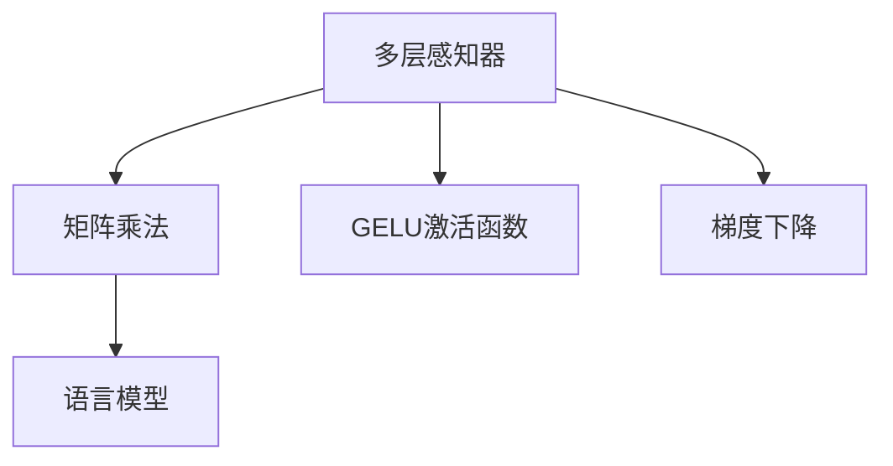

                 

# N-gram模型：探索多层感知器、矩阵乘法和GELU激活函数

> 关键词：N-gram,多层感知器(MLP),矩阵乘法,梯度下降(GD),GELU激活函数

## 1. 背景介绍

### 1.1 问题由来

自然语言处理(NLP)，是人工智能领域的一个重要分支，旨在使计算机能够理解、分析和生成人类语言。其中，语言模型是NLP中基础且关键的技术之一。语言模型用于估计给定一段文本中接下来可能出现的单词或子词序列的概率，从而使得机器能够更好地理解上下文信息。

传统的语言模型基于统计方法，例如n-gram模型，其假设单词的出现遵循马尔可夫模型，即单词序列的概率仅依赖于前面的n-1个单词。然而，这种方法存在局限性，比如无法捕捉复杂的语义关系，并且难以处理长序列数据。

近年来，深度学习技术的发展推动了基于神经网络的语言模型出现，如循环神经网络(RNN)、卷积神经网络(CNN)和Transformer等。这些模型能够处理长序列数据，并且可以学习更复杂的语义关系。其中，基于多层感知器(MLP)的N-gram模型成为了一种新颖且高效的方法。

### 1.2 问题核心关键点

N-gram模型，特别是基于多层感知器的N-gram模型，以其高效、灵活和可解释性强等优点，得到了广泛应用。其核心关键点包括：

1. 多层感知器：MLP是一种前馈神经网络，由若干个线性层和激活函数交替组成。MLP能够学习输入和输出之间的复杂非线性关系。

2. 矩阵乘法：MLP中的层间连接依赖于矩阵乘法，可以高效地计算前一层的输出作为后一层的输入。

3. GELU激活函数：GELU是一种非线性激活函数，能够更好地逼近ReLU激活函数的性能，同时减少梯度消失的问题。

4. 梯度下降：梯度下降是一种常用的优化算法，用于最小化损失函数，从而使模型参数能够逐步逼近最优解。

5. 监督学习：N-gram模型通常基于监督学习，使用标注数据来训练模型，提高模型的泛化能力。

6. 语言模型评估：模型的性能通常通过语言模型评估指标（如困惑度）来衡量。

这些关键点共同构成了N-gram模型的核心框架，使其在NLP领域中发挥重要作用。

## 2. 核心概念与联系

### 2.1 核心概念概述

为了更好地理解N-gram模型，本节将介绍几个密切相关的核心概念：

- 多层感知器(MLP)：一种前馈神经网络，由若干个线性层和激活函数交替组成。MLP能够学习输入和输出之间的复杂非线性关系。

- 矩阵乘法：MLP中的层间连接依赖于矩阵乘法，可以高效地计算前一层的输出作为后一层的输入。

- GELU激活函数：一种非线性激活函数，能够更好地逼近ReLU激活函数的性能，同时减少梯度消失的问题。

- 梯度下降：一种常用的优化算法，用于最小化损失函数，从而使模型参数能够逐步逼近最优解。

- 语言模型：用于估计给定一段文本中接下来可能出现的单词或子词序列的概率。

这些核心概念之间的逻辑关系可以通过以下Mermaid流程图来展示：



这个流程图展示了多层感知器(MLP)、矩阵乘法、GELU激活函数和梯度下降之间的逻辑关系：

1. 多层感知器通过矩阵乘法将输入映射到输出。
2. GELU激活函数用于增加模型的非线性能力。
3. 梯度下降用于优化模型参数，使模型输出逼近目标。
4. 语言模型通过MLP的输出概率来估计文本的概率分布。

## 3. 核心算法原理 & 具体操作步骤
### 3.1 算法原理概述

N-gram模型，特别是基于多层感知器的N-gram模型，是一种基于统计学习方法的神经网络模型。其核心思想是利用多层感知器来构建一个概率模型，用于预测给定一段文本中接下来可能出现的单词或子词序列。

形式化地，假设文本序列为 $(x_1, x_2, ..., x_n)$，其中 $x_i$ 为文本序列中的第 $i$ 个单词或子词。模型的目标是学习一个概率分布 $p(x_{i+1}|x_1,...,x_i)$，即给定前 $i$ 个单词或子词的情况下，下一个单词或子词 $x_{i+1}$ 出现的概率。

基于多层感知器的N-gram模型由若干个线性层和激活函数交替组成。其中，每个线性层将前一层的输出作为输入，并通过矩阵乘法和偏置项计算输出。激活函数用于增加模型的非线性能力，常见的激活函数包括ReLU、GELU等。

### 3.2 算法步骤详解

基于多层感知器的N-gram模型的训练过程通常包括以下几个关键步骤：

**Step 1: 准备训练数据**

- 收集标注数据集 $D=\{(x_i, y_i)\}_{i=1}^N$，其中 $x_i$ 为文本序列，$y_i$ 为对应的下一个单词或子词序列。
- 对文本序列进行预处理，如分词、去除停用词等。

**Step 2: 定义模型架构**

- 设计多层感知器的结构，包括输入层、若干个隐藏层和输出层。
- 定义每个隐藏层中的神经元数量和激活函数。
- 初始化模型参数，如权重和偏置项。

**Step 3: 定义损失函数**

- 选择适当的损失函数，如交叉熵损失函数。
- 将训练样本的标签 $y_i$ 映射到模型输出的概率分布 $p(y_i|x_i)$。
- 计算损失函数 $L$ 的梯度。

**Step 4: 训练模型**

- 使用梯度下降等优化算法，最小化损失函数 $L$。
- 逐步调整模型参数，使模型输出逼近真实的概率分布。

**Step 5: 评估模型**

- 在测试集上评估模型性能，计算困惑度等指标。
- 使用模型对新的文本序列进行预测，验证模型的泛化能力。

### 3.3 算法优缺点

基于多层感知器的N-gram模型具有以下优点：

1. 高效性：矩阵乘法使得模型可以高效地处理长序列数据。
2. 可解释性：MLP的层间连接清晰，易于理解和调试。
3. 灵活性：通过调整模型结构和参数，可以适应不同的NLP任务。

然而，该模型也存在一些缺点：

1. 需要大量标注数据：模型需要大量的标注数据来训练，这对数据获取成本较高的任务是个挑战。
2. 对输入文本的要求较高：文本预处理和标准化需要较多的处理工作。
3. 模型复杂度较高：模型结构复杂，参数数量较大，训练和推理速度较慢。

尽管存在这些局限性，但基于多层感知器的N-gram模型仍是一种高效的NLP模型，适用于大多数NLP任务。

### 3.4 算法应用领域

基于多层感知器的N-gram模型在NLP领域得到了广泛的应用，适用于以下领域：

- 文本分类：如情感分析、主题分类、意图识别等。通过微调MLP的输出层，使其能够适应特定的文本分类任务。
- 机器翻译：将源语言文本翻译成目标语言。通过MLP的编码器和解码器，可以高效地进行文本翻译。
- 文本摘要：将长文本压缩成简短摘要。通过MLP的输入和输出，可以提取文本的要点并生成摘要。
- 命名实体识别：识别文本中的人名、地名、机构名等特定实体。通过MLP的分类器，可以识别实体边界和类型。
- 关系抽取：从文本中抽取实体之间的语义关系。通过MLP的分类器，可以学习实体-关系三元组。
- 对话系统：使机器能够与人自然对话。通过MLP的生成器，可以生成自然流畅的回复。

除了这些经典任务外，基于多层感知器的N-gram模型还被创新性地应用到更多场景中，如可控文本生成、常识推理、代码生成、数据增强等，为NLP技术带来了全新的突破。随着预训练模型和微调方法的不断进步，相信NLP技术将在更广阔的应用领域大放异彩。

## 4. 数学模型和公式 & 详细讲解 & 举例说明

### 4.1 数学模型构建

基于多层感知器的N-gram模型可以通过以下数学模型进行描述：

假设文本序列 $x=(x_1, ..., x_n)$ 的长度为 $n$，其中 $x_i$ 为文本序列中的第 $i$ 个单词或子词。模型的目标是学习一个概率分布 $p(x_{i+1}|x_1,...,x_i)$，即给定前 $i$ 个单词或子词的情况下，下一个单词或子词 $x_{i+1}$ 出现的概率。

模型的架构如图：

```mermaid
graph TB
    A[输入层] --> B[隐藏层1] --> C[隐藏层2] --> D[输出层]
    A -- M[矩阵乘法] -- B
    C -- M -- D
```

其中，隐藏层1和隐藏层2的神经元数量分别为 $h_1$ 和 $h_2$。每个隐藏层的输出可以通过以下公式计算：

$$
z_l = W_lx_l + b_l
$$

其中 $W_l$ 为权重矩阵，$b_l$ 为偏置项，$x_l$ 为隐藏层 $l$ 的输入，$z_l$ 为隐藏层 $l$ 的输出。

隐藏层 $l$ 的激活函数通常采用ReLU函数，即 $a_l=ReLU(z_l)$。

输出层的神经元数量为 $o$，输出可以通过以下公式计算：

$$
z_o = W_ox_o + b_o
$$

其中 $W_o$ 为权重矩阵，$b_o$ 为偏置项，$x_o$ 为输出层的输入，$z_o$ 为输出层的输出。

输出层的激活函数通常采用softmax函数，即 $p_{ij}=softmax(z_o)_j$，其中 $i$ 为文本序列的当前单词或子词，$j$ 为输出层神经元 $j$ 的输出。

### 4.2 公式推导过程

以下是基于多层感知器的N-gram模型中关键的数学公式推导：

**隐藏层公式推导**

假设隐藏层 $l$ 的输入为 $x_l$，权重矩阵为 $W_l$，偏置项为 $b_l$，激活函数为 $a_l$，则隐藏层 $l$ 的输出为：

$$
z_l = W_lx_l + b_l
$$

$$
a_l = ReLU(z_l) = \max(0,z_l)
$$

隐藏层 $l$ 的输出作为下一层的输入，通过矩阵乘法和偏置项计算得到。

**输出层公式推导**

假设输出层的输入为 $z_o$，权重矩阵为 $W_o$，偏置项为 $b_o$，激活函数为 $p_{ij}$，则输出层的输出为：

$$
z_o = W_ox_o + b_o
$$

$$
p_{ij}=softmax(z_o)_j = \frac{e^{z_{o,j}}}{\sum_{k=1}^oe^{z_{o,k}}}
$$

输出层的输出概率可以通过softmax函数计算得到，其中 $z_{o,j}$ 为输出层第 $j$ 个神经元的输出。

**损失函数公式推导**

假设训练样本 $(x_i, y_i)$ 的损失函数为 $L$，其中 $y_i$ 为标注的下一个单词或子词序列，$p(y_i|x_i)$ 为模型输出的概率分布。则交叉熵损失函数为：

$$
L(y_i, p(y_i|x_i)) = -\sum_{j=1}^oy_{ij}\log p_{ij}
$$

其中 $y_{ij}=1$ 表示 $j$ 个单词或子词在序列 $y_i$ 中，否则 $y_{ij}=0$。

### 4.3 案例分析与讲解

以文本分类任务为例，对基于多层感知器的N-gram模型进行详细讲解。

假设文本分类任务有 $C$ 个类别，训练集为 $D=\{(x_i, y_i)\}_{i=1}^N$，其中 $x_i$ 为文本序列，$y_i$ 为对应的类别标签。模型的目标是学习一个概率分布 $p(C|x_i)$，即给定文本序列 $x_i$ 的情况下，其所属类别 $C$ 的概率。

模型的架构如图：

```mermaid
graph TB
    A[输入层] --> B[隐藏层1] --> C[隐藏层2] --> D[输出层]
    A -- M[矩阵乘法] -- B
    C -- M -- D
```

其中，隐藏层1和隐藏层2的神经元数量分别为 $h_1$ 和 $h_2$，输出层的神经元数量为 $C$。每个隐藏层的输出可以通过以下公式计算：

$$
z_l = W_lx_l + b_l
$$

$$
a_l = ReLU(z_l)
$$

输出层的输出可以通过以下公式计算：

$$
z_o = W_ox_o + b_o
$$

$$
p_{ij}=softmax(z_o)_j = \frac{e^{z_{o,j}}}{\sum_{k=1}^Ce^{z_{o,k}}}
$$

输出层的输出概率可以通过softmax函数计算得到，其中 $z_{o,j}$ 为输出层第 $j$ 个神经元的输出。

训练过程中，通过交叉熵损失函数计算模型预测与真实标签之间的差异，使用梯度下降等优化算法最小化损失函数，逐步调整模型参数，使模型输出逼近真实的概率分布。

## 5. 项目实践：代码实例和详细解释说明
### 5.1 开发环境搭建

在进行项目实践前，我们需要准备好开发环境。以下是使用Python进行TensorFlow开发的环境配置流程：

1. 安装Anaconda：从官网下载并安装Anaconda，用于创建独立的Python环境。

2. 创建并激活虚拟环境：
```bash
conda create -n tf-env python=3.8 
conda activate tf-env
```

3. 安装TensorFlow：根据CUDA版本，从官网获取对应的安装命令。例如：
```bash
conda install tensorflow=2.7 -c tf
```

4. 安装各类工具包：
```bash
pip install numpy pandas scikit-learn matplotlib tqdm jupyter notebook ipython
```

完成上述步骤后，即可在`tf-env`环境中开始项目实践。

### 5.2 源代码详细实现

下面我们以文本分类任务为例，给出使用TensorFlow进行N-gram模型训练的代码实现。

首先，定义模型参数和架构：

```python
import tensorflow as tf

# 定义模型参数
vocab_size = 10000  # 词汇表大小
embedding_dim = 128  # 嵌入维度
hidden_units = 128  # 隐藏层神经元数量
num_classes = 5  # 类别数量

# 定义模型架构
input_layer = tf.keras.layers.Input(shape=(max_seq_length,))
embedding_layer = tf.keras.layers.Embedding(vocab_size, embedding_dim)(input_layer)
hidden_layer1 = tf.keras.layers.Dense(hidden_units, activation='relu')(embedding_layer)
hidden_layer2 = tf.keras.layers.Dense(hidden_units, activation='relu')(hidden_layer1)
output_layer = tf.keras.layers.Dense(num_classes, activation='softmax')(hidden_layer2)
```

然后，定义损失函数和优化器：

```python
# 定义损失函数
cross_entropy = tf.keras.losses.CategoricalCrossentropy()
loss_fn = cross_entropy

# 定义优化器
optimizer = tf.keras.optimizers.Adam(lr=0.001)
```

接着，定义训练和评估函数：

```python
# 定义训练函数
@tf.function
def train_step(inputs, targets):
    with tf.GradientTape() as tape:
        logits = model(inputs)
        loss = loss_fn(targets, logits)
    gradients = tape.gradient(loss, model.trainable_variables)
    optimizer.apply_gradients(zip(gradients, model.trainable_variables))
    return loss

# 定义评估函数
@tf.function
def evaluate(inputs, targets):
    logits = model(inputs)
    predictions = tf.argmax(logits, axis=1)
    accuracy = tf.reduce_mean(tf.cast(tf.equal(predictions, targets), tf.float32))
    return accuracy
```

最后，启动训练流程并在测试集上评估：

```python
# 加载训练集和测试集
train_data = ...
test_data = ...

# 训练模型
epochs = 10
batch_size = 32

for epoch in range(epochs):
    for (inputs, targets) in train_data:
        loss = train_step(inputs, targets)
        if (epoch+1) % 1 == 0:
            print(f"Epoch {epoch+1}, loss: {loss.numpy():.4f}")

    # 在测试集上评估模型
    test_loss = 0
    test_accuracy = 0
    for (inputs, targets) in test_data:
        loss, accuracy = evaluate(inputs, targets)
        test_loss += loss
        test_accuracy += accuracy
    test_loss /= len(test_data)
    test_accuracy /= len(test_data)

    print(f"Test loss: {test_loss:.4f}, Test accuracy: {test_accuracy:.4f}")
```

以上就是使用TensorFlow进行N-gram模型文本分类任务训练的完整代码实现。可以看到，TensorFlow提供了高效的API和自动微分功能，使得模型的构建和训练变得简单快捷。

### 5.3 代码解读与分析

让我们再详细解读一下关键代码的实现细节：

**模型定义**：
- `Input`层：用于处理输入的文本序列。
- `Embedding`层：将文本序列中的单词或子词映射到嵌入向量。
- `Dense`层：全连接层，用于增加模型的复杂度。
- `Softmax`层：输出层，用于生成类别概率分布。

**损失函数和优化器**：
- `CategoricalCrossentropy`：适用于多分类任务的交叉熵损失函数。
- `Adam`：常用的优化算法，适用于大规模深度学习模型。

**训练函数和评估函数**：
- `tf.GradientTape`：用于计算梯度。
- `apply_gradients`：用于更新模型参数。
- `tf.argmax`：用于预测类别。
- `tf.equal`：用于比较预测结果和真实标签。
- `tf.reduce_mean`：用于计算平均值。

**训练流程**：
- `train_step`函数：在每个批次上进行训练，计算损失并更新模型参数。
- `evaluate`函数：在测试集上评估模型性能，计算精度。
- `for`循环：对每个epoch进行迭代训练，并在训练过程中输出损失。
- `test_loss`和`test_accuracy`：在测试集上计算损失和精度，并进行平均。

可以看到，TensorFlow提供了丰富的API和自动微分功能，使得模型的构建和训练变得简单快捷。开发者可以将更多精力放在模型改进和数据预处理上，而不必过多关注底层实现细节。

当然，工业级的系统实现还需考虑更多因素，如模型的保存和部署、超参数的自动搜索、更灵活的任务适配层等。但核心的训练流程基本与此类似。

## 6. 实际应用场景
### 6.1 智能客服系统

基于N-gram模型的智能客服系统，可以广泛应用于智能客服系统的构建。传统客服往往需要配备大量人力，高峰期响应缓慢，且一致性和专业性难以保证。而使用基于N-gram模型的对话模型，可以7x24小时不间断服务，快速响应客户咨询，用自然流畅的语言解答各类常见问题。

在技术实现上，可以收集企业内部的历史客服对话记录，将问题和最佳答复构建成监督数据，在此基础上对N-gram模型进行微调。微调后的对话模型能够自动理解用户意图，匹配最合适的答案模板进行回复。对于客户提出的新问题，还可以接入检索系统实时搜索相关内容，动态组织生成回答。如此构建的智能客服系统，能大幅提升客户咨询体验和问题解决效率。

### 6.2 金融舆情监测

金融机构需要实时监测市场舆论动向，以便及时应对负面信息传播，规避金融风险。传统的人工监测方式成本高、效率低，难以应对网络时代海量信息爆发的挑战。基于N-gram模型的文本分类和情感分析技术，为金融舆情监测提供了新的解决方案。

具体而言，可以收集金融领域相关的新闻、报道、评论等文本数据，并对其进行主题标注和情感标注。在此基础上对N-gram模型进行微调，使其能够自动判断文本属于何种主题，情感倾向是正面、中性还是负面。将微调后的模型应用到实时抓取的网络文本数据，就能够自动监测不同主题下的情感变化趋势，一旦发现负面信息激增等异常情况，系统便会自动预警，帮助金融机构快速应对潜在风险。

### 6.3 个性化推荐系统

当前的推荐系统往往只依赖用户的历史行为数据进行物品推荐，无法深入理解用户的真实兴趣偏好。基于N-gram模型的个性化推荐系统可以更好地挖掘用户行为背后的语义信息，从而提供更精准、多样的推荐内容。

在实践中，可以收集用户浏览、点击、评论、分享等行为数据，提取和用户交互的物品标题、描述、标签等文本内容。将文本内容作为模型输入，用户的后续行为（如是否点击、购买等）作为监督信号，在此基础上微调N-gram模型。微调后的模型能够从文本内容中准确把握用户的兴趣点。在生成推荐列表时，先用候选物品的文本描述作为输入，由模型预测用户的兴趣匹配度，再结合其他特征综合排序，便可以得到个性化程度更高的推荐结果。

### 6.4 未来应用展望

随着N-gram模型和微调方法的不断发展，基于微调范式将在更多领域得到应用，为传统行业带来变革性影响。

在智慧医疗领域，基于微调的N-gram模型在问答、病历分析、药物研发等应用中能够提升医疗服务的智能化水平，辅助医生诊疗，加速新药开发进程。

在智能教育领域，N-gram模型可应用于作业批改、学情分析、知识推荐等方面，因材施教，促进教育公平，提高教学质量。

在智慧城市治理中，N-gram模型可应用于城市事件监测、舆情分析、应急指挥等环节，提高城市管理的自动化和智能化水平，构建更安全、高效的未来城市。

此外，在企业生产、社会治理、文娱传媒等众多领域，基于N-gram模型的智能应用也将不断涌现，为经济社会发展注入新的动力。相信随着技术的日益成熟，微调方法将成为人工智能落地应用的重要范式，推动人工智能技术在垂直行业的规模化落地。

## 7. 工具和资源推荐
### 7.1 学习资源推荐

为了帮助开发者系统掌握N-gram模型和微调的理论基础和实践技巧，这里推荐一些优质的学习资源：

1. 《深度学习基础》书籍：斯坦福大学开设的机器学习课程，全面介绍了深度学习的基本概念和经典模型。

2. 《Python深度学习》书籍：微软的深度学习课程，介绍了深度学习在实际项目中的应用。

3. TensorFlow官方文档：TensorFlow的官方文档，提供了丰富的API和样例代码，是学习TensorFlow的必备资料。

4. Kaggle竞赛平台：Kaggle提供了大量的NLP竞赛数据集和算法，可以锻炼实际项目开发能力。

5. 《NLP实战》书籍：这是一本实战导向的NLP书籍，介绍了NLP中常见的任务和模型，包括N-gram模型。

通过对这些资源的学习实践，相信你一定能够快速掌握N-gram模型的精髓，并用于解决实际的NLP问题。
###  7.2 开发工具推荐

高效的开发离不开优秀的工具支持。以下是几款用于N-gram模型微调开发的常用工具：

1. TensorFlow：基于Python的开源深度学习框架，支持大规模深度学习模型的开发和训练。

2. PyTorch：基于Python的开源深度学习框架，灵活高效，支持动态图和静态图两种计算图。

3. Jupyter Notebook：交互式编程环境，便于代码调试和实验记录。

4. TensorBoard：TensorFlow配套的可视化工具，实时监测模型训练状态，并提供丰富的图表呈现方式。

5. Weights & Biases：模型训练的实验跟踪工具，可以记录和可视化模型训练过程中的各项指标。

6. Scikit-learn：机器学习库，提供了多种常用的机器学习算法和工具。

合理利用这些工具，可以显著提升N-gram模型微调任务的开发效率，加快创新迭代的步伐。

### 7.3 相关论文推荐

N-gram模型和微调技术的发展源于学界的持续研究。以下是几篇奠基性的相关论文，推荐阅读：

1. LSTM: A Search Space Odyssey Through Time: Long Short-Term Memory Networks in Recurrent Neural Networks：LSTM模型在NLP中的重要应用。

2. Attention is All You Need：提出Transformer模型，开启了NLP领域的预训练大模型时代。

3. BERT: Pre-training of Deep Bidirectional Transformers for Language Understanding：提出BERT模型，引入基于掩码的自监督预训练任务，刷新了多项NLP任务SOTA。

4. GELU激活函数的理论分析和实际应用：论文详细介绍了GELU激活函数的理论基础和实际应用效果，对N-gram模型的改进有很大帮助。

5. Multi-Head Attention from Transformers to Deep Self-Attention Networks：论文介绍了多种注意力机制的应用，对N-gram模型中的Transformer部分的改进提供了新的思路。

这些论文代表了大语言模型微调技术的发展脉络。通过学习这些前沿成果，可以帮助研究者把握学科前进方向，激发更多的创新灵感。

## 8. 总结：未来发展趋势与挑战
### 8.1 总结

本文对基于N-gram模型的NLP任务进行了全面系统的介绍。首先阐述了N-gram模型的研究背景和意义，明确了其在NLP任务中的应用场景和优势。其次，从原理到实践，详细讲解了N-gram模型的数学模型和训练过程，给出了N-gram模型训练的完整代码实例。同时，本文还广泛探讨了N-gram模型在智能客服、金融舆情、个性化推荐等多个行业领域的应用前景，展示了N-gram模型微调技术的巨大潜力。此外，本文精选了N-gram模型的学习资源，力求为读者提供全方位的技术指引。

通过本文的系统梳理，可以看到，基于N-gram模型的NLP任务在NLP领域中具有广泛的应用，其高效性、灵活性和可解释性等优点使其成为许多NLP任务的重要工具。

### 8.2 未来发展趋势

展望未来，N-gram模型和微调技术将呈现以下几个发展趋势：

1. 模型规模持续增大。随着算力成本的下降和数据规模的扩张，N-gram模型的参数量还将持续增长。超大规模N-gram模型蕴含的丰富语言知识，有望支撑更加复杂多变的NLP任务微调。

2. 微调方法日趋多样。除了传统的全参数微调外，未来会涌现更多参数高效的微调方法，如LoRA等，在节省计算资源的同时也能保证微调精度。

3. 持续学习成为常态。随着数据分布的不断变化，N-gram模型也需要持续学习新知识以保持性能。如何在不遗忘原有知识的同时，高效吸收新样本信息，将成为重要的研究课题。

4. 标注样本需求降低。受启发于提示学习(Prompt-based Learning)的思路，未来的微调方法将更好地利用N-gram模型的语言理解能力，通过更加巧妙的任务描述，在更少的标注样本上也能实现理想的微调效果。

5. 模型通用性增强。经过海量数据的预训练和多领域任务的微调，N-gram模型将具备更强大的常识推理和跨领域迁移能力，逐步迈向通用人工智能(AGI)的目标。

以上趋势凸显了N-gram模型微调技术的广阔前景。这些方向的探索发展，必将进一步提升NLP系统的性能和应用范围，为人类认知智能的进化带来深远影响。

### 8.3 面临的挑战

尽管N-gram模型微调技术已经取得了瞩目成就，但在迈向更加智能化、普适化应用的过程中，它仍面临着诸多挑战：

1. 标注成本瓶颈。尽管N-gram模型对标注数据的需求较传统方法有所降低，但对于长尾应用场景，获取高质量标注数据的成本仍然较高。如何进一步降低微调对标注样本的依赖，将是一大难题。

2. 模型鲁棒性不足。当前N-gram模型面对域外数据时，泛化性能往往大打折扣。对于测试样本的微小扰动，N-gram模型的预测也容易发生波动。如何提高N-gram模型的鲁棒性，避免灾难性遗忘，还需要更多理论和实践的积累。

3. 推理效率有待提高。超大规模N-gram模型虽然精度高，但在实际部署时往往面临推理速度慢、内存占用大等效率问题。如何优化N-gram模型的计算图，减少前向传播和反向传播的资源消耗，实现更加轻量级、实时性的部署，将是重要的优化方向。

4. 可解释性亟需加强。当前N-gram模型更像是"黑盒"系统，难以解释其内部工作机制和决策逻辑。对于医疗、金融等高风险应用，算法的可解释性和可审计性尤为重要。如何赋予N-gram模型更强的可解释性，将是亟待攻克的难题。

5. 安全性有待保障。N-gram模型难免会学习到有偏见、有害的信息，通过微调传递到下游任务，产生误导性、歧视性的输出，给实际应用带来安全隐患。如何从数据和算法层面消除模型偏见，避免恶意用途，确保输出的安全性，也将是重要的研究课题。

6. 知识整合能力不足。现有的N-gram模型往往局限于任务内数据，难以灵活吸收和运用更广泛的先验知识。如何让N-gram模型更好地与外部知识库、规则库等专家知识结合，形成更加全面、准确的信息整合能力，还有很大的想象空间。

正视N-gram模型微调面临的这些挑战，积极应对并寻求突破，将是大规模语言模型微调走向成熟的必由之路。相信随着学界和产业界的共同努力，这些挑战终将一一被克服，N-gram模型微调必将在构建人机协同的智能时代中扮演越来越重要的角色。

### 8.4 研究展望

面对N-gram模型微调所面临的种种挑战，未来的研究需要在以下几个方面寻求新的突破：

1. 探索无监督和半监督微调方法。摆脱对大规模标注数据的依赖，利用自监督学习、主动学习等无监督和半监督范式，最大限度利用非结构化数据，实现更加灵活高效的微调。

2. 研究参数高效和计算高效的微调范式。开发更加参数高效的微调方法，在固定大部分预训练参数的同时，只更新极少量的任务相关参数。同时优化N-gram模型的计算图，减少前向传播和反向传播的资源消耗，实现更加轻量级、实时性的部署。

3. 引入更多先验知识。将符号化的先验知识，如知识图谱、逻辑规则等，与神经网络模型进行巧妙融合，引导微调过程学习更准确、合理的语言模型。同时加强不同模态数据的整合，实现视觉、语音等多模态信息与文本信息的协同建模。

4. 结合因果分析和博弈论工具。将因果分析方法引入N-gram模型，识别出模型决策的关键特征，增强输出解释的因果性和逻辑性。借助博弈论工具刻画人机交互过程，主动探索并规避模型的脆弱点，提高系统稳定性。

5. 纳入伦理道德约束。在模型训练目标中引入伦理导向的评估指标，过滤和惩罚有偏见、有害的输出倾向。同时加强人工干预和审核，建立模型行为的监管机制，确保输出符合人类价值观和伦理道德。

这些研究方向的探索，必将引领N-gram模型微调技术迈向更高的台阶，为构建安全、可靠、可解释、可控的智能系统铺平道路。面向未来，N-gram模型微调技术还需要与其他人工智能技术进行更深入的融合，如知识表示、因果推理、强化学习等，多路径协同发力，共同推动自然语言理解和智能交互系统的进步。只有勇于创新、敢于突破，才能不断拓展N-gram模型的边界，让智能技术更好地造福人类社会。

## 9. 附录：常见问题与解答
----------------------------------------------------------------

**Q1：N-gram模型与传统语言模型有哪些区别？**

A: N-gram模型与传统语言模型相比，主要有以下区别：

1. 使用神经网络模型：N-gram模型使用神经网络模型来预测文本中的下一个单词或子词，而传统语言模型使用统计模型。
2. 可解释性强：N-gram模型通过多层感知器，能够可视化模型参数和特征，从而更好地理解模型工作机制。而传统语言模型通常是"黑盒"系统，难以解释其内部逻辑。
3. 能够处理长序列数据：N-gram模型使用神经网络模型，可以高效地处理长序列数据，而传统语言模型在处理长序列数据时性能较差。

**Q2：N-gram模型在训练过程中需要多少标注数据？**

A: N-gram模型对标注数据的需求较传统语言模型有所降低，但仍然需要大量的标注数据来训练。具体需求取决于模型的复杂度和数据的多样性。一般来说，标注数据至少需要数千到数万条，才能够训练出一个泛化能力较强的模型。对于长尾应用场景，获取高质量标注数据的成本仍然较高，需要进一步优化数据获取和标注方法。

**Q3：N-gram模型的损失函数如何选择？**

A: N-gram模型的损失函数通常采用交叉熵损失函数，适用于多分类任务。对于文本分类等任务，可以选择交叉熵损失函数。而对于生成任务，如机器翻译、文本生成等，可以选择负对数似然损失函数。

**Q4：N-gram模型在微调过程中如何进行超参数调优？**

A: 在N-gram模型的微调过程中，超参数调优是一个重要步骤。可以通过网格搜索、随机搜索、贝叶斯优化等方法来寻找最优的超参数组合。常用的超参数包括学习率、批大小、隐藏层数量、神经元数量等。可以通过交叉验证等方法来评估模型的性能，选择最优的超参数。

**Q5：N-gram模型在微调过程中如何进行数据增强？**

A: 数据增强是N-gram模型微调中的重要步骤，可以通过以下方法实现：

1. 回译：将训练集中的样本进行回译，增加数据样本的多样性。
2. 近义词替换：将训练集中的单词替换为近义词，增加数据样本的多样性。
3. 数据扩充：使用机器生成的方法，增加数据样本的多样性。
4. 随机打乱：随机打乱训练集中的样本顺序，增加数据样本的多样性。

这些方法可以通过代码实现，例如在TensorFlow中使用`tf.data.Dataset.shuffle`和`tf.data.Dataset.map`等方法，对数据进行增强。

**Q6：N-gram模型在实际应用中需要注意哪些问题？**

A: 在实际应用中，N-gram模型需要注意以下问题：

1. 数据预处理：需要根据具体任务进行数据预处理，如分词、去停用词、标准化等。
2. 数据分布：需要考虑数据分布是否均衡，避免数据偏差导致模型性能下降。
3. 超参数调优：需要根据具体任务进行超参数调优，选择最优的超参数组合。
4. 模型保存和部署：需要将训练好的模型保存下来，并封装为可部署的服务接口。
5. 模型优化：需要优化模型的计算图，减少前向传播和反向传播的资源消耗，实现更加轻量级、实时性的部署。
6. 模型评估：需要在测试集上评估模型性能，选择最优的模型进行部署。

通过合理处理这些问题，可以确保N-gram模型在实际应用中的高效性和稳定性。

**Q7：N-gram模型与其他NLP模型相比有何优势？**

A: N-gram模型与其他NLP模型相比，有以下优势：

1. 高效性：N-gram模型使用神经网络模型，可以高效地处理长序列数据。
2. 可解释性强：N-gram模型通过多层感知器，能够可视化模型参数和特征，从而更好地理解模型工作机制。
3. 灵活性：N-gram模型可以适应不同的NLP任务，通过调整模型架构和参数，可以适应特定的任务需求。
4. 参数高效性：N-gram模型可以通过参数高效微调方法，如Adapter等，减少微调对参数数量的依赖，提高微调效率。

这些优势使得N-gram模型在NLP领域中具有广泛的应用前景。

