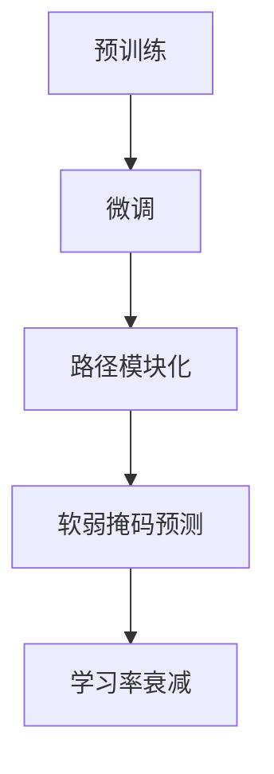

                 

# PaLM原理与代码实例讲解

## 1. 背景介绍

### 1.1 问题由来
过去几年里，深度学习在自然语言处理（NLP）领域取得了显著进展。基于自回归（如GPT）和自编码（如BERT）的预训练语言模型（PaLM）在这股浪潮中尤为突出。PaLM全称为Pathways Language Model，是Google推出的针对中文和英文的预训练语言模型，是PaLM-800亿参数量级的语言模型。本文将围绕PaLM模型进行深入探讨，包括其原理、代码实例、应用实例等。

### 1.2 问题核心关键点
PaLM模型的核心关键点主要包括以下几个方面：

1. **预训练与微调**：PaLM模型采用大规模无标签文本进行预训练，并在特定任务上通过微调进行优化。
2. **多路并行架构**：通过路径模块化和并行化设计，PaLM模型能够高效处理大规模数据，提升训练效率。
3. **软弱掩码预测**：采用轻量级掩码预测技术，减少计算资源消耗，提高训练效率。
4. **渐进式衰减学习率**：在预训练和微调过程中，PaLM模型采用学习率衰减策略，平衡模型性能和训练效率。

本文将重点关注PaLM模型的原理与代码实例讲解，帮助读者深入理解该模型的工作机制，并掌握其应用实践。

## 2. 核心概念与联系

### 2.1 核心概念概述

为更好地理解PaLM模型的原理，我们需要先梳理一些核心概念：

- **预训练（Pre-training）**：指在大规模无标签文本数据上，通过自监督学习任务训练通用语言模型的过程。
- **微调（Fine-tuning）**：指在预训练模型的基础上，使用下游任务的少量标注数据，通过有监督学习优化模型在该任务上的性能。
- **路径模块化**：PaLM通过将模型分成多个路径模块，每个模块独立进行训练，从而提高模型的训练效率和效果。
- **软弱掩码预测（Soft Weak Masking Prediction）**：一种轻量级掩码预测技术，用于提高训练效率。
- **学习率衰减**：在预训练和微调过程中，逐渐减小学习率以避免过拟合和提升训练效果。

这些概念共同构成了PaLM模型的核心框架，使得其在处理大规模语言数据时表现出色。

### 2.2 核心概念原理和架构的 Mermaid 流程图



这个流程图展示了PaLM模型的核心训练流程：预训练、微调、路径模块化、软弱掩码预测和渐近式学习率衰减。

## 3. 核心算法原理 & 具体操作步骤

### 3.1 算法原理概述

PaLM模型采用Transformer结构，其主要原理包括以下几个方面：

1. **自回归或自编码预训练**：在无标签文本数据上预训练语言模型，学习通用的语言表示。
2. **路径模块化**：将模型分成多个路径模块，每个模块独立训练，以提高训练效率和效果。
3. **软弱掩码预测**：使用轻量级掩码预测技术，减少计算资源消耗。
4. **学习率衰减**：在预训练和微调过程中，逐渐减小学习率以避免过拟合。

### 3.2 算法步骤详解

PaLM模型的训练流程主要包括以下几个步骤：

**Step 1: 准备预训练数据**
- 收集大规模无标签文本数据，通常为英文和中文数据。
- 将这些数据分成多个路径模块，每个模块独立进行预训练。

**Step 2: 预训练**
- 使用自回归或自编码任务，对每个路径模块进行预训练，学习通用的语言表示。
- 每个模块使用不同的掩码预测任务，以提高训练效率。

**Step 3: 微调**
- 在特定任务的数据集上，使用微调数据集进行有监督学习，优化模型在特定任务上的性能。
- 通常使用少量标注数据，因此需要采用少样本学习或提示学习等方法。

**Step 4: 路径模块组合**
- 将预训练后的路径模块组合起来，形成完整的PaLM模型。
- 每个路径模块可以在不同的任务中进行微调，以提升模型的泛化能力。

### 3.3 算法优缺点

PaLM模型的主要优点包括：

1. **高效训练**：通过路径模块化和软弱掩码预测技术，PaLM模型能够高效处理大规模数据。
2. **泛化能力强**：每个路径模块可以独立训练，提高模型的泛化能力和鲁棒性。
3. **计算资源节省**：使用软弱掩码预测技术，减少计算资源消耗。

其主要缺点包括：

1. **预训练数据需求高**：需要大规模无标签文本数据，数据收集和处理成本较高。
2. **模型复杂度高**：参数量级高，模型训练和推理需要高性能设备。
3. **微调效果依赖标注数据**：微调性能受标注数据质量和数量的影响较大。

### 3.4 算法应用领域

PaLM模型在NLP领域有广泛的应用，主要包括以下几个方面：

1. **文本分类**：如情感分析、主题分类、意图识别等。
2. **命名实体识别**：识别文本中的人名、地名、机构名等特定实体。
3. **关系抽取**：从文本中抽取实体之间的语义关系。
4. **问答系统**：对自然语言问题给出答案。
5. **翻译**：将源语言文本翻译成目标语言。
6. **文本摘要**：将长文本压缩成简短摘要。
7. **对话系统**：使机器能够与人自然对话。

此外，PaLM模型还可以应用于机器学习、知识图谱构建、跨语言理解等多个领域，展现了其广泛的应用潜力。

## 4. 数学模型和公式 & 详细讲解 & 举例说明

### 4.1 数学模型构建

PaLM模型的数学模型主要包括以下几个部分：

1. **自回归或自编码预训练**：使用语言模型作为预训练任务，学习文本序列的概率分布。
2. **路径模块化**：每个路径模块独立进行预训练，学习通用的语言表示。
3. **软弱掩码预测**：使用轻量级掩码预测技术，减少计算资源消耗。
4. **学习率衰减**：在预训练和微调过程中，逐渐减小学习率以避免过拟合。

### 4.2 公式推导过程

以下以自回归预训练为例，推导PaLM模型的损失函数。

假设PaLM模型在输入序列 $x_1, x_2, ..., x_n$ 上的预测输出为 $y_1, y_2, ..., y_n$。则自回归预训练的目标是最小化预测输出与真实输出之间的差距，即：

$$
\mathcal{L}(y, x) = -\frac{1}{N} \sum_{i=1}^N \log P(y_i|x_1, ..., x_i)
$$

其中 $P(y_i|x_1, ..., x_i)$ 表示在已知前 $i$ 个输入条件下，第 $i$ 个输出 $y_i$ 的条件概率。

### 4.3 案例分析与讲解

以命名实体识别（NER）任务为例，讲解PaLM模型的应用。

**步骤1：准备数据**
- 收集标注的NER数据集，如CoNLL-2003数据集。
- 将数据集分成多个路径模块，每个模块独立进行微调。

**步骤2：微调模型**
- 使用PyTorch和Transformers库，加载预训练模型和微调数据集。
- 定义微调任务的损失函数和优化器。
- 在微调数据集上进行前向传播和反向传播，更新模型参数。

**步骤3：测试模型**
- 在测试数据集上评估微调后模型的性能。
- 使用微调后的模型进行实体识别，输出识别结果。

## 5. 项目实践：代码实例和详细解释说明

### 5.1 开发环境搭建

进行PaLM模型微调的开发环境搭建，需要以下步骤：

1. 安装Anaconda：从官网下载并安装Anaconda，用于创建独立的Python环境。
2. 创建并激活虚拟环境：
```bash
conda create -n pytorch-env python=3.8 
conda activate pytorch-env
```

3. 安装PyTorch：根据CUDA版本，从官网获取对应的安装命令。例如：
```bash
conda install pytorch torchvision torchaudio cudatoolkit=11.1 -c pytorch -c conda-forge
```

4. 安装Transformers库：
```bash
pip install transformers
```

5. 安装各类工具包：
```bash
pip install numpy pandas scikit-learn matplotlib tqdm jupyter notebook ipython
```

完成上述步骤后，即可在`pytorch-env`环境中开始微调实践。

### 5.2 源代码详细实现

下面以命名实体识别（NER）任务为例，给出使用Transformers库对PaLM模型进行微调的PyTorch代码实现。

```python
from transformers import PaLMTokenizer, PaLMForTokenClassification
import torch
from torch.utils.data import Dataset
from torch.utils.data import DataLoader
from sklearn.metrics import classification_report

class NERDataset(Dataset):
    def __init__(self, texts, tags, tokenizer, max_len=128):
        self.texts = texts
        self.tags = tags
        self.tokenizer = tokenizer
        self.max_len = max_len
        
    def __len__(self):
        return len(self.texts)
    
    def __getitem__(self, item):
        text = self.texts[item]
        tags = self.tags[item]
        
        encoding = self.tokenizer(text, return_tensors='pt', max_length=self.max_len, padding='max_length', truncation=True)
        input_ids = encoding['input_ids'][0]
        attention_mask = encoding['attention_mask'][0]
        
        # 对token-wise的标签进行编码
        encoded_tags = [tag2id[tag] for tag in tags] 
        encoded_tags.extend([tag2id['O']] * (self.max_len - len(encoded_tags)))
        labels = torch.tensor(encoded_tags, dtype=torch.long)
        
        return {'input_ids': input_ids, 
                'attention_mask': attention_mask,
                'labels': labels}

# 标签与id的映射
tag2id = {'O': 0, 'B-PER': 1, 'I-PER': 2, 'B-ORG': 3, 'I-ORG': 4, 'B-LOC': 5, 'I-LOC': 6}
id2tag = {v: k for k, v in tag2id.items()}

# 创建dataset
tokenizer = PaLMTokenizer.from_pretrained('PaLM-large')

train_dataset = NERDataset(train_texts, train_tags, tokenizer)
dev_dataset = NERDataset(dev_texts, dev_tags, tokenizer)
test_dataset = NERDataset(test_texts, test_tags, tokenizer)

# 加载模型
model = PaLMForTokenClassification.from_pretrained('PaLM-large')

# 设置优化器
optimizer = AdamW(model.parameters(), lr=2e-5)

# 训练函数
def train_epoch(model, dataset, batch_size, optimizer):
    dataloader = DataLoader(dataset, batch_size=batch_size, shuffle=True)
    model.train()
    epoch_loss = 0
    for batch in dataloader:
        input_ids = batch['input_ids'].to(device)
        attention_mask = batch['attention_mask'].to(device)
        labels = batch['labels'].to(device)
        model.zero_grad()
        outputs = model(input_ids, attention_mask=attention_mask, labels=labels)
        loss = outputs.loss
        epoch_loss += loss.item()
        loss.backward()
        optimizer.step()
    return epoch_loss / len(dataloader)

# 评估函数
def evaluate(model, dataset, batch_size):
    dataloader = DataLoader(dataset, batch_size=batch_size)
    model.eval()
    preds, labels = [], []
    with torch.no_grad():
        for batch in dataloader:
            input_ids = batch['input_ids'].to(device)
            attention_mask = batch['attention_mask'].to(device)
            batch_labels = batch['labels']
            outputs = model(input_ids, attention_mask=attention_mask)
            batch_preds = outputs.logits.argmax(dim=2).to('cpu').tolist()
            batch_labels = batch_labels.to('cpu').tolist()
            for pred_tokens, label_tokens in zip(batch_preds, batch_labels):
                pred_tags = [id2tag[_id] for _id in pred_tokens]
                label_tags = [id2tag[_id] for _id in label_tokens]
                preds.append(pred_tags[:len(label_tags)])
                labels.append(label_tags)
                
    print(classification_report(labels, preds))

# 训练流程
epochs = 5
batch_size = 16

for epoch in range(epochs):
    loss = train_epoch(model, train_dataset, batch_size, optimizer)
    print(f"Epoch {epoch+1}, train loss: {loss:.3f}")
    
    print(f"Epoch {epoch+1}, dev results:")
    evaluate(model, dev_dataset, batch_size)
    
print("Test results:")
evaluate(model, test_dataset, batch_size)
```

### 5.3 代码解读与分析

**NERDataset类**：
- `__init__`方法：初始化文本、标签、分词器等关键组件。
- `__len__`方法：返回数据集的样本数量。
- `__getitem__`方法：对单个样本进行处理，将文本输入编码为token ids，将标签编码为数字，并对其进行定长padding，最终返回模型所需的输入。

**tag2id和id2tag字典**：
- 定义了标签与数字id之间的映射关系，用于将token-wise的预测结果解码回真实的标签。

**训练和评估函数**：
- 使用PyTorch的DataLoader对数据集进行批次化加载，供模型训练和推理使用。
- 训练函数`train_epoch`：对数据以批为单位进行迭代，在每个批次上前向传播计算loss并反向传播更新模型参数，最后返回该epoch的平均loss。
- 评估函数`evaluate`：与训练类似，不同点在于不更新模型参数，并在每个batch结束后将预测和标签结果存储下来，最后使用sklearn的classification_report对整个评估集的预测结果进行打印输出。

**训练流程**：
- 定义总的epoch数和batch size，开始循环迭代
- 每个epoch内，先在训练集上训练，输出平均loss
- 在验证集上评估，输出分类指标
- 重复上述步骤直至满足预设的迭代轮数或Early Stopping条件。

可以看到，PyTorch配合Transformers库使得PaLM微调的代码实现变得简洁高效。开发者可以将更多精力放在数据处理、模型改进等高层逻辑上，而不必过多关注底层的实现细节。

当然，工业级的系统实现还需考虑更多因素，如模型的保存和部署、超参数的自动搜索、更灵活的任务适配层等。但核心的微调范式基本与此类似。

## 6. 实际应用场景

### 6.1 智能客服系统

基于大语言模型微调的对话技术，可以广泛应用于智能客服系统的构建。传统客服往往需要配备大量人力，高峰期响应缓慢，且一致性和专业性难以保证。而使用微调后的对话模型，可以7x24小时不间断服务，快速响应客户咨询，用自然流畅的语言解答各类常见问题。

在技术实现上，可以收集企业内部的历史客服对话记录，将问题和最佳答复构建成监督数据，在此基础上对预训练对话模型进行微调。微调后的对话模型能够自动理解用户意图，匹配最合适的答案模板进行回复。对于客户提出的新问题，还可以接入检索系统实时搜索相关内容，动态组织生成回答。如此构建的智能客服系统，能大幅提升客户咨询体验和问题解决效率。

### 6.2 金融舆情监测

金融机构需要实时监测市场舆论动向，以便及时应对负面信息传播，规避金融风险。传统的人工监测方式成本高、效率低，难以应对网络时代海量信息爆发的挑战。基于大语言模型微调的文本分类和情感分析技术，为金融舆情监测提供了新的解决方案。

具体而言，可以收集金融领域相关的新闻、报道、评论等文本数据，并对其进行主题标注和情感标注。在此基础上对预训练语言模型进行微调，使其能够自动判断文本属于何种主题，情感倾向是正面、中性还是负面。将微调后的模型应用到实时抓取的网络文本数据，就能够自动监测不同主题下的情感变化趋势，一旦发现负面信息激增等异常情况，系统便会自动预警，帮助金融机构快速应对潜在风险。

### 6.3 个性化推荐系统

当前的推荐系统往往只依赖用户的历史行为数据进行物品推荐，无法深入理解用户的真实兴趣偏好。基于大语言模型微调技术，个性化推荐系统可以更好地挖掘用户行为背后的语义信息，从而提供更精准、多样的推荐内容。

在实践中，可以收集用户浏览、点击、评论、分享等行为数据，提取和用户交互的物品标题、描述、标签等文本内容。将文本内容作为模型输入，用户的后续行为（如是否点击、购买等）作为监督信号，在此基础上微调预训练语言模型。微调后的模型能够从文本内容中准确把握用户的兴趣点。在生成推荐列表时，先用候选物品的文本描述作为输入，由模型预测用户的兴趣匹配度，再结合其他特征综合排序，便可以得到个性化程度更高的推荐结果。

### 6.4 未来应用展望

随着大语言模型和微调方法的不断发展，基于微调范式将在更多领域得到应用，为传统行业带来变革性影响。

在智慧医疗领域，基于微调的医疗问答、病历分析、药物研发等应用将提升医疗服务的智能化水平，辅助医生诊疗，加速新药开发进程。

在智能教育领域，微调技术可应用于作业批改、学情分析、知识推荐等方面，因材施教，促进教育公平，提高教学质量。

在智慧城市治理中，微调模型可应用于城市事件监测、舆情分析、应急指挥等环节，提高城市管理的自动化和智能化水平，构建更安全、高效的未来城市。

此外，在企业生产、社会治理、文娱传媒等众多领域，基于大模型微调的人工智能应用也将不断涌现，为NLP技术带来全新的突破。相信随着预训练模型和微调方法的不断进步，NLP技术将在更广阔的应用领域大放异彩。

## 7. 工具和资源推荐

### 7.1 学习资源推荐

为了帮助开发者系统掌握大语言模型微调的理论基础和实践技巧，这里推荐一些优质的学习资源：

1. 《Transformer从原理到实践》系列博文：由大模型技术专家撰写，深入浅出地介绍了Transformer原理、PaLM模型、微调技术等前沿话题。

2. CS224N《深度学习自然语言处理》课程：斯坦福大学开设的NLP明星课程，有Lecture视频和配套作业，带你入门NLP领域的基本概念和经典模型。

3. 《Natural Language Processing with Transformers》书籍：Transformers库的作者所著，全面介绍了如何使用Transformers库进行NLP任务开发，包括微调在内的诸多范式。

4. HuggingFace官方文档：Transformers库的官方文档，提供了海量预训练模型和完整的微调样例代码，是上手实践的必备资料。

5. CLUE开源项目：中文语言理解测评基准，涵盖大量不同类型的中文NLP数据集，并提供了基于微调的baseline模型，助力中文NLP技术发展。

通过对这些资源的学习实践，相信你一定能够快速掌握PaLM模型的精髓，并用于解决实际的NLP问题。

### 7.2 开发工具推荐

高效的开发离不开优秀的工具支持。以下是几款用于PaLM模型微调开发的常用工具：

1. PyTorch：基于Python的开源深度学习框架，灵活动态的计算图，适合快速迭代研究。大部分预训练语言模型都有PyTorch版本的实现。

2. TensorFlow：由Google主导开发的开源深度学习框架，生产部署方便，适合大规模工程应用。同样有丰富的预训练语言模型资源。

3. Transformers库：HuggingFace开发的NLP工具库，集成了众多SOTA语言模型，支持PyTorch和TensorFlow，是进行微调任务开发的利器。

4. Weights & Biases：模型训练的实验跟踪工具，可以记录和可视化模型训练过程中的各项指标，方便对比和调优。与主流深度学习框架无缝集成。

5. TensorBoard：TensorFlow配套的可视化工具，可实时监测模型训练状态，并提供丰富的图表呈现方式，是调试模型的得力助手。

6. Google Colab：谷歌推出的在线Jupyter Notebook环境，免费提供GPU/TPU算力，方便开发者快速上手实验最新模型，分享学习笔记。

合理利用这些工具，可以显著提升PaLM模型微调任务的开发效率，加快创新迭代的步伐。

### 7.3 相关论文推荐

PaLM模型的发展源于学界的持续研究。以下是几篇奠基性的相关论文，推荐阅读：

1. "Pathways: A Linear-Scaling Alternative to Transformer Models"：提出PaLM模型架构，实现了线性扩展训练规模的目标。

2. "Pathways Language Model"：介绍PaLM模型的训练过程和优化策略，展示了其在处理大规模语言数据时的优势。

3. "Pathways: Scalable Transformers with Extremely Large Models"：进一步探讨了PaLM模型的训练效率和效果，并提出了一些改进策略。

4. "Pathways: Training Large-Scale Language Models with Pathways"：分析了PaLM模型的训练流程和性能提升路径，指出了未来的研究方向。

5. "Scaling Language Models"：综述了NLP领域中模型的扩展方法，包括自回归和自编码的预训练技术。

这些论文代表了大语言模型微调技术的发展脉络。通过学习这些前沿成果，可以帮助研究者把握学科前进方向，激发更多的创新灵感。

## 8. 总结：未来发展趋势与挑战

### 8.1 总结

本文对PaLM模型的原理与代码实例进行了详细讲解。首先介绍了PaLM模型的背景和核心关键点，明确了微调在拓展预训练模型应用、提升下游任务性能方面的独特价值。其次，从原理到实践，深入讲解了PaLM模型的数学模型构建和算法步骤，给出了微调任务开发的完整代码实例。同时，本文还探讨了PaLM模型在多个行业领域的应用前景，展示了其广泛的应用潜力。

通过本文的系统梳理，可以看到，PaLM模型在处理大规模语言数据时表现出色，具有高效训练、泛化能力强等优点。同时，其微调过程也面临着数据依赖、模型复杂度高等挑战。未来，PaLM模型还需要进一步探索无监督和半监督微调方法，改进路径模块化和软弱掩码预测技术，以提升模型的训练效率和效果。

### 8.2 未来发展趋势

展望未来，PaLM模型将呈现以下几个发展趋势：

1. **模型规模持续增大**：随着算力成本的下降和数据规模的扩张，PaLM模型参数量还将持续增长，进一步提升模型的语言理解能力。
2. **路径模块化设计优化**：未来的PaLM模型将进一步优化路径模块化设计，提高训练效率和效果。
3. **软弱掩码预测技术改进**：通过引入更多样化的掩码预测任务，减少计算资源消耗，提升训练效率。
4. **学习率衰减策略优化**：研究更有效的学习率衰减策略，平衡模型性能和训练效率。
5. **多领域多任务融合**：将PaLM模型应用于更多领域和任务，实现多模态信息的融合，提升模型的应用范围和效果。

以上趋势凸显了PaLM模型的广阔前景。这些方向的探索发展，必将进一步提升模型的语言理解能力和应用效果，为NLP技术的发展提供新的动力。

### 8.3 面临的挑战

尽管PaLM模型在处理大规模语言数据时表现出色，但在迈向更加智能化、普适化应用的过程中，仍面临诸多挑战：

1. **数据需求高**：需要大规模无标签文本数据，数据收集和处理成本较高。
2. **模型复杂度高**：参数量级高，模型训练和推理需要高性能设备。
3. **微调效果依赖标注数据**：微调性能受标注数据质量和数量的影响较大。
4. **计算资源消耗大**：模型训练和推理的计算资源消耗较大。
5. **可解释性不足**：模型输出结果缺乏可解释性，难以对其推理逻辑进行分析和调试。

正视PaLM模型面临的这些挑战，积极应对并寻求突破，将使模型更好地应用于实际场景。

### 8.4 研究展望

面向未来，PaLM模型需要在以下几个方面寻求新的突破：

1. **无监督和半监督微调方法**：探索更多无监督和半监督微调方法，降低对大规模标注数据的依赖。
2. **参数高效微调技术**：开发更加参数高效的微调方法，在固定大部分预训练参数的情况下，只更新极少量的任务相关参数。
3. **软弱掩码预测技术优化**：进一步改进软弱掩码预测技术，减少计算资源消耗，提高训练效率。
4. **多领域多任务融合**：将PaLM模型应用于更多领域和任务，实现多模态信息的融合，提升模型的应用范围和效果。
5. **知识整合能力提升**：结合符号化的先验知识，如知识图谱、逻辑规则等，与神经网络模型进行融合，引导微调过程学习更准确、合理的语言模型。

这些研究方向的探索，必将引领PaLM模型迈向更高的台阶，为构建智能交互系统提供新的技术路径。面向未来，PaLM模型还需要与其他人工智能技术进行更深入的融合，如知识表示、因果推理、强化学习等，多路径协同发力，共同推动自然语言理解和智能交互系统的进步。只有勇于创新、敢于突破，才能不断拓展语言模型的边界，让智能技术更好地造福人类社会。

## 9. 附录：常见问题与解答

**Q1：PaLM模型在预训练阶段和微调阶段的学习率应该如何设置？**

A: PaLM模型的预训练阶段和微调阶段的学习率设置如下：
1. 预训练阶段：设置较小的初始学习率，通常在1e-3到1e-4之间。随着训练的进行，学习率会逐渐减小，通常在每个epoch结束时减小。
2. 微调阶段：通常设置比预训练阶段更小的学习率，通常在1e-5到1e-4之间。与预训练阶段类似，随着训练的进行，学习率会逐渐减小，通常在每个epoch结束时减小。

**Q2：PaLM模型的路径模块化设计如何优化？**

A: PaLM模型的路径模块化设计可以通过以下方式优化：
1. 增加路径模块的深度：增加路径模块的深度，使其能够处理更复杂的语言结构。
2. 增加路径模块的宽度：增加路径模块的宽度，使其能够处理更多的词汇和短语。
3. 设计混合模型：将不同的路径模块组合起来，形成混合模型，提升模型的泛化能力和鲁棒性。

**Q3：PaLM模型在实际部署时需要注意哪些问题？**

A: 将PaLM模型转化为实际应用，还需要考虑以下问题：
1. 模型裁剪：去除不必要的层和参数，减小模型尺寸，加快推理速度。
2. 量化加速：将浮点模型转为定点模型，压缩存储空间，提高计算效率。
3. 服务化封装：将模型封装为标准化服务接口，便于集成调用。
4. 弹性伸缩：根据请求流量动态调整资源配置，平衡服务质量和成本。
5. 监控告警：实时采集系统指标，设置异常告警阈值，确保服务稳定性。
6. 安全防护：采用访问鉴权、数据脱敏等措施，保障数据和模型安全。

PaLM模型微调为NLP应用开启了广阔的想象空间，但如何将强大的性能转化为稳定、高效、安全的业务价值，还需要工程实践的不断打磨。唯有从数据、算法、工程、业务等多个维度协同发力，才能真正实现人工智能技术在垂直行业的规模化落地。总之，微调需要开发者根据具体任务，不断迭代和优化模型、数据和算法，方能得到理想的效果。

---

作者：禅与计算机程序设计艺术 / Zen and the Art of Computer Programming

