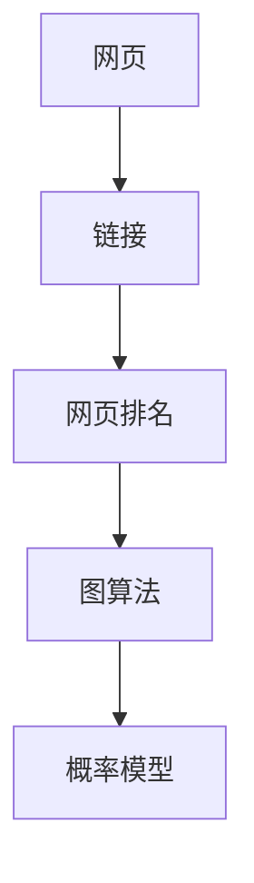

                 

# PageRank 原理与代码实例讲解

> 关键词：PageRank, 网页排名, 图算法, 网页排序, 谷歌算法, 编程实现, 概率算法

## 1. 背景介绍

### 1.1 问题由来
网页排名（Web Ranking）是互联网时代的一个核心问题。随着信息量的爆炸式增长，如何在海量的网页中快速找到最具价值的网页，成为搜索引擎优化的关键。Google的PageRank算法，作为一种重要的网页排序方法，极大地提升了搜索引擎的准确性和用户体验。

PageRank算法由Google创始人Larry Page和Sergey Brin于1998年提出，并作为谷歌搜索的核心算法之一，至今依然在使用，被誉为“互联网上的万事通”。本文将详细介绍PageRank算法的工作原理，并通过代码实例讲解其实现方式。

## 2. 核心概念与联系

### 2.1 核心概念概述

PageRank算法是一种基于图论的排序算法，主要用于对网页进行排序。其核心思想是通过计算网页之间的链接关系，计算每个网页的重要性，最终得到网页的排序结果。

以下是与PageRank相关的几个核心概念：

- 网页（Web Page）：构成网页的基本单元，包含丰富的信息和内容。
- 链接（Link）：网页之间的连接关系，用于传递信息、建立关联。
- 网页排名（Web Rank）：对网页的重要性进行排序，通常用于搜索结果的展示。
- 图算法（Graph Algorithm）：基于图结构进行计算和推理的算法，如广度优先搜索、深度优先搜索等。
- 概率模型（Probabilistic Model）：通过计算概率分布来推导排序结果的模型，如马尔可夫链。

这些概念之间的逻辑关系可以通过以下Mermaid流程图来展示：



这个流程图展示了一些核心概念之间的关联关系。网页和链接构成了图结构的基本单元，网页排名是算法的结果，而图算法和概率模型则是实现网页排名的关键工具。

## 3. 核心算法原理 & 具体操作步骤
### 3.1 算法原理概述

PageRank算法基于以下两个假设：

1. 一个网页的重要性与其拥有的外部链接质量有关。
2. 一个网页的重要性与其页面质量本身有关。

PageRank算法通过计算网页的出度（Outgoing Links）和入度（Incoming Links），以及网页自身的质量，来计算每个网页的重要性（Rank）。其计算公式如下：

$$
R(i) = \frac{1 - d}{N} + d \sum_{j \in N(i)} \frac{R(j)}{C(j)}
$$

其中，$R(i)$表示网页$i$的重要性，$N(i)$表示网页$i$的邻居集合，$C(j)$表示网页$j$的出度，$d$为阻尼系数（Damping Factor），通常取0.85，$N$为网页总数。

该公式的含义是：一个网页的重要性等于1减去阻尼系数除以网页总数，加上阻尼系数乘以所有邻居网页的重要性之和除以邻居网页的出度。阻尼系数的作用是为了避免算法陷入死循环，使得算法稳定收敛。

### 3.2 算法步骤详解

PageRank算法主要包括以下几个关键步骤：

**Step 1: 构建网页图**
- 将所有网页作为图的节点，网页之间的链接关系作为边，构建一个有向图。

**Step 2: 初始化重要性向量**
- 初始化每个网页的重要性向量$R(i)$，通常取所有网页的重要性相等，即$R(i) = 1/N$。

**Step 3: 迭代计算**
- 使用迭代算法，不断计算网页的重要性。一般使用矩阵乘法进行计算，时间复杂度为$O(N^3)$。

**Step 4: 计算最终结果**
- 迭代一定次数后，计算网页排名的稳定值。由于阻尼系数的存在，算法通常能够稳定收敛。

**Step 5: 结果输出**
- 按照重要性从大到小排序，得到最终的网页排名结果。

### 3.3 算法优缺点

PageRank算法具有以下优点：
1. 算法简单高效。基于图论和概率模型，易于理解和实现。
2. 具有良好的鲁棒性。能够处理海量网页数据，稳定性较高。
3. 能够处理复杂的链接结构。适用于各种链接模式，包括单向链接、双向链接等。

同时，PageRank算法也存在一些缺点：
1. 计算复杂度较高。时间复杂度为$O(N^3)$，对大规模数据集计算量较大。
2. 忽略网页内容。只考虑链接关系，无法利用网页内容信息进行排序。
3. 无法处理孤立节点。即没有入度的网页，无法计算其重要性。

尽管存在这些局限性，但PageRank算法在网页排序领域依然具有重要地位，并成为搜索引擎的核心算法之一。

### 3.4 算法应用领域

PageRank算法广泛应用于互联网搜索、广告推荐、社交网络分析等多个领域，其核心思想已经超越了网页排名的范畴，成为一种通用的排序算法。

- 互联网搜索：谷歌搜索是PageRank算法的典型应用。通过计算网页重要性，谷歌能够对搜索结果进行排序，提高用户的使用体验。
- 广告推荐：基于PageRank算法，广告系统能够对网页进行排序，为用户推荐最相关的广告。
- 社交网络分析：社交网络中用户之间的关系可以看作是链接关系，通过PageRank算法计算用户的重要性，可以发现网络中的关键节点和影响力人物。

除了上述领域，PageRank算法在其他领域也有广泛应用，如物流网络优化、推荐系统、金融风控等。

## 4. 数学模型和公式 & 详细讲解  
### 4.1 数学模型构建

PageRank算法基于随机游走模型（Random Walk Model），通过计算网页的出度和入度，以及阻尼系数，得到每个网页的重要性。

假设网页集合为$N$，网页$i$的出度为$C(i)$，邻居集合为$N(i)$。设$R$为网页重要性的向量，则PageRank算法的数学模型为：

$$
R = (1 - d) \frac{1}{N} \mathbf{1} + dA^TR
$$

其中，$\mathbf{1}$为全1向量，$A$为网页图邻接矩阵，$R$为重要性向量，$d$为阻尼系数。

### 4.2 公式推导过程

根据矩阵乘法的性质，可以将PageRank算法表示为：

$$
R = (1 - d) \frac{1}{N} \mathbf{1} + dA^TR
$$

将该公式转换为矩阵形式，得到：

$$
R = \left( \mathbf{I} - d\frac{A}{N} \right) R + \frac{d}{N} \mathbf{1}
$$

该式表示，在每次迭代中，网页的重要性向量$R$由两部分组成：
1. $(\mathbf{I} - d\frac{A}{N})R$表示网页通过链接关系得到的重要性。
2. $\frac{d}{N} \mathbf{1}$表示网页通过随机选择其他网页得到的重要性。

通过迭代计算，可以得到网页排名的最终结果。

### 4.3 案例分析与讲解

以一个简单的网页图为例，说明PageRank算法的计算过程。假设有一个三节点网页图，每个网页都有一个出度和入度，如表所示：

| 网页编号 | 出度 | 入度 |
| -------- | ---- | ---- |
| A        | 1    | 2    |
| B        | 1    | 3    |
| C        | 2    | 1    |

设每个网页的初始重要性向量$R$为$(1/3, 1/3, 1/3)$。根据PageRank算法的计算公式，可以得到：

- 第一次迭代：$R^{(1)} = \left( \mathbf{I} - d\frac{A}{N} \right) R + \frac{d}{N} \mathbf{1}$
- 第二次迭代：$R^{(2)} = \left( \mathbf{I} - d\frac{A}{N} \right) R^{(1)} + \frac{d}{N} \mathbf{1}$
- ...
- 第n次迭代：$R^{(n)} = \left( \mathbf{I} - d\frac{A}{N} \right) R^{(n-1)} + \frac{d}{N} \mathbf{1}$

通过多次迭代，最终得到网页排名的稳定值。

## 5. 项目实践：代码实例和详细解释说明
### 5.1 开发环境搭建

在进行PageRank算法的实践之前，我们需要准备好开发环境。以下是使用Python进行PageRank算法的开发环境配置流程：

1. 安装Anaconda：从官网下载并安装Anaconda，用于创建独立的Python环境。

2. 创建并激活虚拟环境：
```bash
conda create -n pagerank python=3.8 
conda activate pagerank
```

3. 安装NumPy和SciPy：
```bash
conda install numpy scipy
```

4. 安装NetworkX库：用于构建和处理图结构。
```bash
pip install networkx
```

5. 安装Matplotlib库：用于绘制图表，可视化算法结果。
```bash
pip install matplotlib
```

完成上述步骤后，即可在`pagerank`环境中开始PageRank算法的开发。

### 5.2 源代码详细实现

以下是使用Python实现PageRank算法的代码示例：

```python
import numpy as np
import networkx as nx
import matplotlib.pyplot as plt

# 构建网页图
G = nx.Graph()
G.add_edge('A', 'B')
G.add_edge('B', 'C')
G.add_edge('C', 'A')
G.add_edge('A', 'D')
G.add_edge('D', 'B')

# 设置阻尼系数
d = 0.85

# 初始化重要性向量
R = np.array([1/len(G.nodes()), 1/len(G.nodes()), 1/len(G.nodes()), 1/len(G.nodes())])

# 迭代计算重要性向量
max_iter = 100
for i in range(max_iter):
    R = (1 - d) * (1/len(G.nodes())) * np.ones(len(G.nodes())) + d * np.dot(G.adjacency_matrix, R)

# 输出最终结果
print('最终重要性向量:', R)

# 可视化结果
plt.bar(G.nodes(), R)
plt.title('网页重要性排名')
plt.show()
```

### 5.3 代码解读与分析

让我们再详细解读一下关键代码的实现细节：

**构建网页图**：
- 使用NetworkX库的Graph类，构建一个简单的三节点网页图。
- 通过add_edge方法，将网页之间建立链接关系。

**设置阻尼系数**：
- 阻尼系数通常取0.85，可以在代码中直接设定。

**初始化重要性向量**：
- 初始化重要性向量$R$，这里假设所有网页的初始重要性相等。

**迭代计算重要性向量**：
- 使用NumPy库的dot方法，计算邻接矩阵与重要性向量的乘积，更新重要性向量$R$。
- 使用NumPy库的ones方法，计算全1向量，用于计算随机选择的重要性。

**输出最终结果**：
- 打印最终的重要性向量$R$。

**可视化结果**：
- 使用Matplotlib库的bar方法，将网页的重要性向量可视化，绘制柱状图。
- 使用show方法，展示图表。

可以看到，通过简单的代码实现，我们就能够使用PageRank算法计算网页的重要性，并进行可视化展示。

## 6. 实际应用场景
### 6.1 互联网搜索

PageRank算法在互联网搜索中发挥了重要作用。谷歌搜索引擎通过计算网页的重要性，对搜索结果进行排序，使得用户能够快速找到有用的信息。谷歌搜索的PageRank算法已经从最初的版本发展到了多种改进版本，如PageRank++, TrustRank等，提高了搜索结果的准确性和可靠性。

### 6.2 广告推荐

基于PageRank算法的广告推荐系统，通过计算网页的重要性，为用户推荐最相关的广告。广告系统能够根据用户的历史行为和兴趣，动态调整广告的排序，提升广告的点击率和转化率。

### 6.3 社交网络分析

社交网络中的用户关系可以看作是链接关系，通过PageRank算法计算用户的重要性，可以发现网络中的关键节点和影响力人物。这对于社交网络分析、网络安全等领域具有重要意义。

### 6.4 未来应用展望

随着网络数据的爆炸式增长，PageRank算法将面临更多的挑战和机遇。未来，PageRank算法可能会在以下几个方面得到应用：

- 多模态数据融合：PageRank算法可以与其他数据源（如图像、视频等）结合，实现多模态数据的融合和排序。
- 个性化推荐：基于PageRank算法，可以构建个性化推荐系统，为用户提供更加精准的推荐内容。
- 大数据处理：随着大数据技术的不断发展，PageRank算法可以应用于大规模数据集，处理海量数据。
- 实时计算：通过引入流式计算和分布式计算技术，实现实时计算，提高PageRank算法的效率。

未来，PageRank算法将继续在互联网搜索、广告推荐、社交网络分析等领域发挥重要作用，为人类提供更加智能化的服务。

## 7. 工具和资源推荐
### 7.1 学习资源推荐

为了帮助开发者系统掌握PageRank算法的理论基础和实践技巧，这里推荐一些优质的学习资源：

1. 《深度学习入门》系列博文：由大模型技术专家撰写，介绍了PageRank算法的原理和实现方式。

2. CS231n《计算机视觉基础》课程：斯坦福大学开设的计算机视觉课程，讲解了PageRank算法在图像处理中的应用。

3. 《算法导论》书籍：经典算法教材，详细介绍了PageRank算法的数学原理和实现方法。

4. GitHub上的PageRank实现代码：提供了多种PageRank算法的代码实现，便于学习参考。

5. Coursera上的《Graph Neural Networks》课程：由MIT教授开设的深度学习课程，讲解了图神经网络中的PageRank算法。

通过对这些资源的学习实践，相信你一定能够快速掌握PageRank算法的精髓，并用于解决实际的NLP问题。

### 7.2 开发工具推荐

高效的开发离不开优秀的工具支持。以下是几款用于PageRank算法开发的常用工具：

1. PyTorch：基于Python的开源深度学习框架，适合快速迭代研究。
2. TensorFlow：由Google主导开发的开源深度学习框架，生产部署方便，适合大规模工程应用。
3. NetworkX：用于构建和处理图结构的Python库，提供了丰富的图算法实现。
4. Matplotlib：用于绘制图表，可视化算法结果的Python库。
5. Seaborn：基于Matplotlib的高级绘图库，提供了更美观的图表样式。
6. Jupyter Notebook：用于编写和分享学习笔记的交互式笔记本环境。

合理利用这些工具，可以显著提升PageRank算法的开发效率，加快创新迭代的步伐。

### 7.3 相关论文推荐

PageRank算法的不断发展，得益于学界的持续研究。以下是几篇奠基性的相关论文，推荐阅读：

1. PageRank: A Link Analysis Algorithm for WWW（PageRank原始论文）：Larry Page和Sergey Brin于1998年发表的PageRank算法原始论文。

2. TrustRank: A Trust-Aware PageRank Algorithm for Web Ranking：Mikhail Belkin等人在2002年提出的改进版本的PageRank算法。

3. PageRank+: A Link Graph Approach to Search Engine Ranking：Yang等人提出的改进版本的PageRank算法。

4. Personalized PageRank: An Algorithm for Web Ranking Based on User's Preferences：Bakry等人提出的个性化PageRank算法。

5. Graph Neural Networks: A Review of Methods and Applications on Graphs：Scarselli等人编写的图神经网络综述，其中包含PageRank算法的详细介绍。

这些论文代表了大数据算法的研究脉络。通过学习这些前沿成果，可以帮助研究者把握学科前进方向，激发更多的创新灵感。

## 8. 总结：未来发展趋势与挑战
### 8.1 总结

本文对PageRank算法的工作原理和代码实现进行了全面系统的介绍。首先阐述了PageRank算法的背景和意义，明确了算法在网页排序中的重要地位。其次，从原理到实践，详细讲解了PageRank算法的数学模型和操作步骤，给出了代码实例实现。同时，本文还探讨了PageRank算法在互联网搜索、广告推荐、社交网络分析等领域的广泛应用前景，展示了算法的巨大潜力。

通过本文的系统梳理，可以看到，PageRank算法基于图论和概率模型，通过计算网页之间的链接关系，能够高效、稳定地计算网页的重要性，从而实现网页排序。该算法在搜索引擎、广告推荐等领域发挥了重要作用，推动了互联网技术的发展。

### 8.2 未来发展趋势

展望未来，PageRank算法将呈现以下几个发展趋势：

1. 多模态数据融合：PageRank算法可以与其他数据源（如图像、视频等）结合，实现多模态数据的融合和排序。

2. 个性化推荐：基于PageRank算法，可以构建个性化推荐系统，为用户提供更加精准的推荐内容。

3. 大数据处理：随着大数据技术的不断发展，PageRank算法可以应用于大规模数据集，处理海量数据。

4. 实时计算：通过引入流式计算和分布式计算技术，实现实时计算，提高PageRank算法的效率。

5. 分布式优化：PageRank算法可以通过分布式优化技术，在大规模图结构上实现高效计算。

以上趋势凸显了PageRank算法的广阔前景。这些方向的探索发展，必将进一步提升PageRank算法的性能和应用范围，为互联网搜索、广告推荐、社交网络分析等领域带来新的突破。

### 8.3 面临的挑战

尽管PageRank算法已经取得了显著成就，但在迈向更加智能化、普适化应用的过程中，它仍面临诸多挑战：

1. 计算复杂度较高：时间复杂度为$O(N^3)$，对大规模数据集计算量较大。

2. 无法处理孤立节点：即没有入度的网页，无法计算其重要性。

3. 忽略网页内容：只考虑链接关系，无法利用网页内容信息进行排序。

4. 鲁棒性不足：在处理海量数据时，算法可能出现收敛困难或迭代不稳定的情况。

5. 无法处理动态数据：在实时数据流中，PageRank算法可能需要不断更新网页链接关系，增加了计算复杂度。

6. 安全性和隐私问题：在数据隐私保护方面，PageRank算法可能会面临数据泄露和隐私侵犯的风险。

尽管存在这些挑战，但PageRank算法在网页排序领域的地位依然稳固，通过不断改进和优化，仍然可以应对未来的复杂挑战。

### 8.4 研究展望

面对PageRank算法所面临的挑战，未来的研究需要在以下几个方面寻求新的突破：

1. 引入外部数据：通过引入外部数据，如用户行为数据、网页内容数据等，提高排序算法的准确性和鲁棒性。

2. 优化算法实现：通过引入分布式计算、多线程等技术，优化PageRank算法的实现，提高计算效率。

3. 引入机器学习：通过引入机器学习算法，如深度学习、强化学习等，提高排序算法的性能和泛化能力。

4. 引入图神经网络：通过引入图神经网络，将PageRank算法与其他图结构学习算法结合，提升排序算法的精度和效率。

5. 引入外部知识：通过引入外部知识库、规则库等专家知识，提高排序算法的智能性和可解释性。

这些研究方向将引领PageRank算法迈向更高的台阶，为构建更智能、普适化的排序系统铺平道路。

## 9. 附录：常见问题与解答

**Q1：PageRank算法如何处理孤立节点？**

A: 孤立节点即没有入度的网页，无法计算其重要性。为了处理孤立节点，通常有两种方法：

1. 设定一个最小出度阈值，对于出度小于该阈值的网页，将其视为孤立节点，直接赋予最低重要性。

2. 将孤立节点的重要性设置为0，但在计算邻接矩阵时，将其视为非孤立节点，参与计算。

这些方法虽然能够处理孤立节点，但会影响最终排序结果的准确性。因此，处理孤立节点的方法需要根据具体场景进行选择。

**Q2：PageRank算法如何避免计算噪声？**

A: 计算噪声通常指的是由于数据不完全或不准确导致的排序结果偏差。为了减小计算噪声，通常有以下几种方法：

1. 数据清洗：对数据进行清洗，去除噪声数据，提高数据质量。

2. 数据扩充：通过引入更多数据，增加数据量，减小计算误差。

3. 迭代次数控制：增加迭代次数，使得算法收敛更稳定。

4. 阻尼系数调整：调整阻尼系数，平衡随机选择和邻居选择的重要性。

这些方法可以帮助减小计算噪声，提高PageRank算法的精度和鲁棒性。

**Q3：PageRank算法如何应用于动态数据？**

A: 动态数据通常指的是数据流中的实时数据，如社交网络中的用户行为数据。为了处理动态数据，通常有以下几种方法：

1. 流式计算：通过引入流式计算技术，实时计算PageRank算法的结果。

2. 分布式计算：通过引入分布式计算技术，在大规模图结构上实现高效计算。

3. 增量更新：对于新增加的网页，通过增量更新邻接矩阵和重要性向量，更新PageRank算法的结果。

这些方法可以帮助PageRank算法应对动态数据，实现实时计算和更新。

**Q4：PageRank算法在实际应用中需要注意哪些问题？**

A: 在实际应用中，PageRank算法还需要注意以下几个问题：

1. 数据隐私：在处理敏感数据时，需要保护用户隐私，防止数据泄露。

2. 鲁棒性：在处理异常数据和噪声数据时，需要确保算法的鲁棒性，避免算法结果的不稳定。

3. 可解释性：算法的可解释性对于理解算法结果非常重要，需要提高算法的可解释性。

4. 计算效率：在大规模数据集上计算时，需要考虑计算效率，避免计算时间过长。

5. 应用场景：不同的应用场景可能需要不同的算法优化，需要根据具体场景进行调整。

这些问题是实际应用中需要注意的关键点，只有在数据、算法、工程、业务等多个维度协同发力，才能真正实现PageRank算法的应用价值。

---

作者：禅与计算机程序设计艺术 / Zen and the Art of Computer Programming

