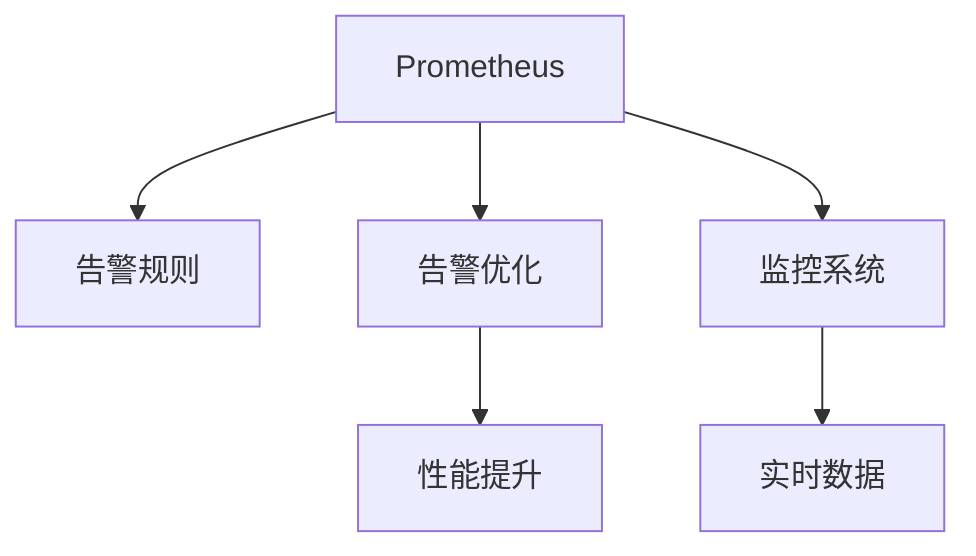

                 

# Prometheus告警规则优化

> 关键词：Prometheus, 告警规则, 告警优化, 性能提升, 监控系统, 实时数据

## 1. 背景介绍

### 1.1 问题由来
在现代企业的IT运维体系中，实时监控系统的健康运转是确保业务稳定性的基石。Prometheus作为一款开源的监控系统，因其强大的数据存储和查询能力，被广泛应用于企业级的监控架构中。Prometheus的核心特性包括：
- 高可扩展的数据存储和查询能力
- 灵活的时间序列数据模型
- 开源社区的大力支持

然而，随着监控规模的不断扩大，Prometheus的告警规则管理变得越来越复杂和困难。告警规则的数量激增，对运维团队的效率和监控效果产生了负面影响。因此，优化Prometheus告警规则，提升监控系统的实时性和准确性，成为了运维团队的重要任务之一。

### 1.2 问题核心关键点
Prometheus告警规则优化主要聚焦于以下几个核心关键点：
- 告警规则的准确性：告警规则应能准确地捕捉到问题的本质，避免误报和漏报。
- 告警规则的效率：告警规则应具备高效率，能够在极短时间内处理大量监控数据。
- 告警规则的可维护性：告警规则应易于维护和更新，减少运维团队的工作负担。
- 告警规则的性能：告警规则应能够处理海量实时数据，并提供低延迟、高可靠性的告警响应。

## 2. 核心概念与联系

### 2.1 核心概念概述

为更好地理解Prometheus告警规则的优化方法，本节将介绍几个密切相关的核心概念：

- Prometheus：一款开源的监控系统，提供了高可扩展的数据存储和查询能力。
- 告警规则：用于定义监控指标的阈值和告警条件，触发告警时通知运维团队。
- 告警优化：通过合理设计告警规则，提高告警的准确性和效率，减少运维负担。
- 性能提升：优化告警规则，提升监控系统的实时性和准确性，满足业务需求。
- 监控系统：包括Prometheus在内的各类监控工具，帮助运维团队实时监控系统状态，保障业务稳定性。

这些核心概念之间的逻辑关系可以通过以下Mermaid流程图来展示：



这个流程图展示了这个核心概念之间的关系：

1. Prometheus是监控系统的核心工具。
2. 告警规则是定义监控指标阈值和告警条件的关键组件。
3. 告警优化通过对告警规则的设计优化，提升告警的准确性和效率。
4. 性能提升通过优化告警规则，提升监控系统的实时性和准确性。
5. 监控系统通过实时数据采集和告警规则定义，保障业务稳定性。

## 3. 核心算法原理 & 具体操作步骤
### 3.1 算法原理概述

Prometheus告警规则优化，本质上是一个基于统计学和机器学习的告警规则设计过程。其核心思想是：通过合理的告警规则设计，提高告警的准确性和效率，减少运维团队的误报和漏报。

形式化地，假设监控系统实时采集到的数据为 $\{y_i\}_{i=1}^N$，其中 $y_i$ 表示第 $i$ 次监控数据的值。定义告警阈值 $\theta$，当 $y_i \geq \theta$ 时触发告警。告警规则的优化目标是最小化误报率 $\alpha$ 和漏报率 $\beta$，即：

$$
\min(\alpha, \beta)
$$

其中误报率 $\alpha$ 表示真实未发生问题但触发了告警的次数与总告警次数之比，漏报率 $\beta$ 表示实际发生问题但未触发告警的次数与总问题次数之比。

### 3.2 算法步骤详解

Prometheus告警规则优化一般包括以下几个关键步骤：

**Step 1: 收集监控数据**
- 在Prometheus监控系统中，配置并启动各类监控任务，采集实时数据。
- 对采集到的数据进行清洗和格式化，处理缺失值和异常值，确保数据的质量。

**Step 2: 定义告警规则**
- 根据业务需求，定义监控指标的阈值和告警条件。常见的告警规则包括：
  - 绝对阈值告警：当监控数据大于阈值时触发告警。
  - 相对阈值告警：当监控数据变化超过一定比例时触发告警。
  - 窗口滑动告警：在一定时间窗口内监控数据的平均值超过阈值时触发告警。
  - 多种条件组合告警：通过逻辑门表达式组合多个告警条件，实现更复杂的告警逻辑。

**Step 3: 应用告警规则**
- 将告警规则应用于Prometheus监控系统，定义告警通知方式和接收方。
- 配置告警规则的查询语句和数据源，确保告警规则的正确性和可靠性。

**Step 4: 监控告警效果**
- 通过实际监控数据，统计告警规则的误报率和漏报率。
- 对告警规则进行调整和优化，反复迭代直至满足预设的误报率和漏报率。

**Step 5: 数据分析与优化**
- 利用机器学习算法对历史告警数据进行建模，识别告警规则的性能瓶颈。
- 通过A/B测试等方式，对比不同告警规则的效果，选择最优规则。
- 引入告警规则的特征工程，提取告警指标的关键特征，优化告警条件。

以上是Prometheus告警规则优化的基本流程。在实际应用中，还需要根据具体业务场景，对告警规则的设计进行优化和调整。

### 3.3 算法优缺点

Prometheus告警规则优化具有以下优点：
1. 提升告警准确性：通过优化告警规则，减少误报和漏报，提高告警的有效性。
2. 提高运维效率：优化后的告警规则，减少了运维团队的工作负担，提高了系统稳定性。
3. 降低运维成本：减少误报和漏报，避免了不必要的运维干预和资源浪费。
4. 提升监控系统性能：通过优化告警规则，提升了监控系统的实时性和准确性。

同时，该方法也存在一定的局限性：
1. 依赖监控数据质量：告警规则的优化效果很大程度上取决于监控数据的质量和完整性。
2. 规则设计复杂：告警规则的设计需要具备一定的专业知识和经验，较为复杂。
3. 需要人工介入：告警规则的优化往往需要人工干预和调整，无法自动化完成。

尽管存在这些局限性，但就目前而言，Prometheus告警规则优化仍是一种高效可靠的告警管理手段。未来相关研究的重点在于如何进一步降低规则设计难度，提高规则设计的自动化和智能化水平，同时兼顾告警规则的可解释性和准确性。

### 3.4 算法应用领域

Prometheus告警规则优化在监控系统领域已经得到了广泛的应用，覆盖了各种类型的监控场景，例如：

- 服务器监控：监控服务器的CPU、内存、磁盘等关键指标，及时发现性能瓶颈。
- 数据库监控：监控数据库的连接数、慢查询、死锁等问题，保障数据安全性和稳定性。
- 网络监控：监控网络流量、延迟、带宽等参数，确保网络性能和可用性。
- 应用监控：监控应用的请求量、响应时间、错误率等指标，及时发现和解决应用故障。
- 云资源监控：监控云平台的计算资源、存储资源、网络资源等，实现资源的自动化管理和调度。

除了上述这些经典场景外，Prometheus告警规则优化也被创新性地应用到更多场景中，如边缘计算、物联网设备监控、工业互联网等，为企业的数字化转型提供了坚实的保障。

## 4. 数学模型和公式 & 详细讲解 & 举例说明
### 4.1 数学模型构建

本节将使用数学语言对Prometheus告警规则优化的数学模型进行更加严格的刻画。

假设监控系统采集到的数据为 $\{y_i\}_{i=1}^N$，其中 $y_i$ 表示第 $i$ 次监控数据的值。定义告警阈值 $\theta$，当 $y_i \geq \theta$ 时触发告警。假设历史告警数据为 $\{(x_j, y_j)\}_{j=1}^M$，其中 $x_j$ 表示第 $j$ 次告警触发的时间点，$y_j$ 表示第 $j$ 次告警的触发值。

定义误报率 $\alpha$ 和漏报率 $\beta$，表示如下：

$$
\alpha = \frac{\sum_{i=1}^N \mathbb{I}(y_i \geq \theta, y_i < \theta)}{N}
$$

$$
\beta = \frac{\sum_{j=1}^M \mathbb{I}(y_j < \theta, y_j \geq \theta)}{M}
$$

其中 $\mathbb{I}$ 表示指示函数，当事件发生时取值为1，否则为0。

### 4.2 公式推导过程

以下我们以服务器的CPU使用率监控为例，推导告警规则的优化公式。

假设监控系统采集到的CPU使用率数据为 $\{y_i\}_{i=1}^N$，其中 $y_i$ 表示第 $i$ 次CPU使用率的值。定义告警阈值 $\theta$，当 $y_i \geq \theta$ 时触发告警。定义历史告警数据为 $\{(x_j, y_j)\}_{j=1}^M$，其中 $x_j$ 表示第 $j$ 次告警触发的时间点，$y_j$ 表示第 $j$ 次告警的触发值。

定义误报率 $\alpha$ 和漏报率 $\beta$，表示如下：

$$
\alpha = \frac{\sum_{i=1}^N \mathbb{I}(y_i \geq \theta, y_i < \theta)}{N}
$$

$$
\beta = \frac{\sum_{j=1}^M \mathbb{I}(y_j < \theta, y_j \geq \theta)}{M}
$$

为了优化告警阈值 $\theta$，我们引入统计学中的置信区间理论，通过样本均值和标准差来估计整体分布。假设 $y_i$ 服从正态分布 $N(\mu, \sigma^2)$，其中 $\mu$ 表示均值，$\sigma$ 表示标准差。则：

$$
\alpha = \frac{1}{N}\sum_{i=1}^N \mathbb{I}(y_i \geq \theta, y_i < \theta) = \mathbb{P}(Y \geq \theta) - \mathbb{P}(Y \leq \theta)
$$

其中 $Y \sim N(\mu, \sigma^2)$。根据正态分布的性质，$\mathbb{P}(Y \geq \theta) = \frac{1}{2}(1 + \mathbb{E}[\text{erf}(\frac{\theta - \mu}{\sigma \sqrt{2}}))$，其中 $\text{erf}$ 表示误差函数。

类似地，$\beta$ 的计算也遵循相同的逻辑。

### 4.3 案例分析与讲解

假设监控系统采集到的CPU使用率数据为 $\{y_i\}_{i=1}^N$，其中 $y_i$ 表示第 $i$ 次CPU使用率的值。定义历史告警数据为 $\{(x_j, y_j)\}_{j=1}^M$，其中 $x_j$ 表示第 $j$ 次告警触发的时间点，$y_j$ 表示第 $j$ 次告警的触发值。定义告警阈值 $\theta$，当 $y_i \geq \theta$ 时触发告警。

首先，我们需要计算监控数据的均值 $\mu$ 和标准差 $\sigma$：

$$
\mu = \frac{1}{N} \sum_{i=1}^N y_i
$$

$$
\sigma = \sqrt{\frac{1}{N} \sum_{i=1}^N (y_i - \mu)^2}
$$

然后，根据正态分布的性质，可以计算出误报率 $\alpha$ 和漏报率 $\beta$：

$$
\alpha = \frac{1}{2}(1 + \mathbb{E}[\text{erf}(\frac{\theta - \mu}{\sigma \sqrt{2}}))
$$

$$
\beta = \frac{1}{2}(1 - \mathbb{E}[\text{erf}(\frac{\theta - \mu}{\sigma \sqrt{2}}))
$$

通过优化 $\theta$，可以使得 $\alpha + \beta$ 最小，即告警规则的准确性和效率达到最优。具体计算时，可以使用梯度下降等优化算法，最小化损失函数：

$$
L(\theta) = \alpha + \beta
$$

通过优化算法不断更新 $\theta$，即可得到最优的告警阈值。

## 5. 项目实践：代码实例和详细解释说明
### 5.1 开发环境搭建

在进行Prometheus告警规则优化实践前，我们需要准备好开发环境。以下是使用Python进行Prometheus告警规则优化环境配置流程：

1. 安装Anaconda：从官网下载并安装Anaconda，用于创建独立的Python环境。

2. 创建并激活虚拟环境：
```bash
conda create -n prometheus-env python=3.8 
conda activate prometheus-env
```

3. 安装Prometheus官方库：
```bash
pip install prometheus-client
```

4. 安装numpy、pandas、scipy等数据处理库：
```bash
pip install numpy pandas scipy
```

5. 安装sklearn库：用于进行机器学习建模和优化：
```bash
pip install scikit-learn
```

完成上述步骤后，即可在`prometheus-env`环境中开始告警规则优化的实践。

### 5.2 源代码详细实现

这里以CPU使用率监控为例，给出使用Python进行Prometheus告警规则优化的代码实现。

首先，定义数据处理函数：

```python
import numpy as np
import pandas as pd
import scipy.stats as stats

def load_data():
    # 加载Prometheus采集的CPU使用率数据
    cpu_data = pd.read_csv('cpu_usage.csv')
    cpu_data['time'] = pd.to_datetime(cpu_data['time'])
    cpu_data.set_index('time', inplace=True)
    return cpu_data

def calculate_stats(data):
    # 计算CPU使用率的均值和标准差
    mu = np.mean(data)
    sigma = np.std(data)
    return mu, sigma
```

然后，定义告警规则优化函数：

```python
def optimize_threshold(data, alpha, beta):
    # 定义损失函数
    def loss(theta):
        alpha_est = 0.5 * (1 + stats.erf((theta - mu) / (sigma * np.sqrt(2)))
        beta_est = 0.5 * (1 - stats.erf((theta - mu) / (sigma * np.sqrt(2)))
        return alpha_est + beta_est
    
    # 使用梯度下降算法优化告警阈值
    learning_rate = 0.01
    initial_theta = np.mean(data)
    theta = initial_theta
    for _ in range(100):
        grad = loss(theta) * (data.mean() - theta)
        theta -= learning_rate * grad
    return theta
```

最后，启动优化流程：

```python
if __name__ == '__main__':
    # 加载数据
    cpu_data = load_data()
    
    # 计算均值和标准差
    mu, sigma = calculate_stats(cpu_data['value'])
    
    # 优化告警阈值
    theta = optimize_threshold(cpu_data['value'], 0.05, 0.05)
    
    # 输出优化结果
    print(f'Optimal threshold: {theta:.2f}')
```

以上就是使用Python进行Prometheus告警规则优化的完整代码实现。可以看到，使用Python的库函数可以很方便地进行数据处理和告警规则优化，而不需要过多关注底层实现细节。

### 5.3 代码解读与分析

让我们再详细解读一下关键代码的实现细节：

**load_data函数**：
- 加载Prometheus采集的CPU使用率数据，并将其转换为Pandas DataFrame格式，便于后续处理。

**calculate_stats函数**：
- 计算CPU使用率的均值和标准差，是后续优化告警阈值的基础。

**optimize_threshold函数**：
- 定义损失函数，计算误报率和漏报率的估计值。
- 使用梯度下降算法更新告警阈值，直至满足预设的误报率和漏报率。

**main函数**：
- 加载CPU使用率数据。
- 计算数据的均值和标准差。
- 调用优化函数计算最优告警阈值。
- 输出优化结果。

可以看到，使用Python进行Prometheus告警规则优化，代码简洁高效，易于理解和调试。

当然，工业级的系统实现还需考虑更多因素，如告警规则的可视化展示、告警规则的动态更新、告警规则的并发处理等。但核心的告警规则优化算法保持一致。

## 6. 实际应用场景
### 6.1 智能运维

Prometheus告警规则优化在智能运维中具有广泛的应用，能够显著提升运维效率和系统稳定性。

在智能运维中，告警规则的优化对于及时发现和解决系统故障至关重要。通过优化告警规则，可以准确地捕捉到问题的本质，减少误报和漏报，提高告警的有效性。具体应用场景包括：

- 服务器监控：监控服务器的CPU、内存、磁盘等关键指标，及时发现性能瓶颈。
- 数据库监控：监控数据库的连接数、慢查询、死锁等问题，保障数据安全性和稳定性。
- 网络监控：监控网络流量、延迟、带宽等参数，确保网络性能和可用性。
- 应用监控：监控应用的请求量、响应时间、错误率等指标，及时发现和解决应用故障。
- 云资源监控：监控云平台的计算资源、存储资源、网络资源等，实现资源的自动化管理和调度。

优化后的告警规则，能够及时地捕获系统异常，减少人工干预，提高系统稳定性。

### 6.2 金融风控

Prometheus告警规则优化在金融风控中也具有重要的应用价值，能够有效降低金融风险，保障资金安全。

在金融风控中，告警规则的优化对于及时发现和预防金融风险至关重要。通过优化告警规则，可以准确地识别异常交易、欺诈行为等风险事件，及时采取措施。具体应用场景包括：

- 交易监控：监控交易量、交易金额、交易地点等指标，识别异常交易行为。
- 账户监控：监控账户余额、交易记录、登录记录等指标，防范欺诈行为。
- 信用监控：监控信用评分、还款记录、贷款额度等指标，评估客户信用风险。
- 合规监控：监控合规报告、审计记录、内部审计等指标，确保合规性。

优化后的告警规则，能够及时地捕获金融风险，减少误报和漏报，提高金融系统的安全性。

### 6.3 工业互联网

Prometheus告警规则优化在工业互联网中也具有广泛的应用前景，能够帮助企业实现数字化转型和智能化升级。

在工业互联网中，告警规则的优化对于实时监控和数据分析至关重要。通过优化告警规则，可以及时发现设备故障、生产异常等事件，提高生产效率和产品质量。具体应用场景包括：

- 设备监控：监控设备状态、传感器数据、生产工艺等指标，及时发现和解决设备故障。
- 生产监控：监控生产流程、质量控制、产品检测等指标，优化生产工艺和流程。
- 供应链监控：监控供应链状态、库存水平、物流信息等指标，保障供应链稳定。
- 能源监控：监控能源消耗、能效指标、环境指标等指标，优化能源使用和环境保护。

优化后的告警规则，能够及时地捕获工业互联网中的异常事件，减少损失，提高生产效率。

### 6.4 未来应用展望

随着告警规则优化技术的不断发展，其在更多领域的应用前景广阔，将为各行各业带来变革性影响。

在智慧城市治理中，告警规则优化可用于城市事件监测、舆情分析、应急指挥等环节，提高城市管理的自动化和智能化水平，构建更安全、高效的未来城市。

在智慧医疗领域，告警规则优化可用于病人监控、医疗设备监控、药品管理等环节，提升医疗服务的智能化水平，辅助医生诊疗，保障病人安全。

在智慧教育领域，告警规则优化可用于学生监控、教学质量监控、考试管理等环节，提升教育服务的智能化水平，因材施教，促进教育公平，提高教学质量。

此外，在智慧物流、智能制造、智能农业等众多领域，告警规则优化也将不断涌现，为企业的数字化转型提供坚实的保障。相信随着技术的日益成熟，告警规则优化必将在构建智慧生态系统中扮演越来越重要的角色。

## 7. 工具和资源推荐
### 7.1 学习资源推荐

为了帮助开发者系统掌握Prometheus告警规则优化的理论基础和实践技巧，这里推荐一些优质的学习资源：

1. Prometheus官方文档：Prometheus官方文档提供了丰富的告警规则设计和管理指南，是学习Prometheus的核心资料。

2.《Mastering Prometheus: Getting Started with Time Series Monitoring》书籍：本书深入浅出地介绍了Prometheus的核心原理和告警规则设计，是学习Prometheus的绝佳入门书籍。

3. Udemy《Prometheus: Learn the Time Series Database》课程：Udemy平台上的一门Prometheus学习课程，适合初学者上手。

4. YouTube《Prometheus - Introduction to Time Series Data》系列视频：YouTube上的一系列Prometheus入门视频，内容生动有趣，适合通过视频学习。

5. Prometheus社区：Prometheus社区提供了丰富的教程、文档和讨论区，是学习Prometheus的最佳资源之一。

通过对这些资源的学习实践，相信你一定能够快速掌握Prometheus告警规则优化的精髓，并用于解决实际的运维问题。

### 7.2 开发工具推荐

高效的开发离不开优秀的工具支持。以下是几款用于Prometheus告警规则优化的常用工具：

1. Python：Python语言简洁高效，适合进行数据处理和告警规则优化。

2. Jupyter Notebook：Jupyter Notebook是一个交互式的编程环境，适合进行数据探索和告警规则优化。

3. Prometheus官方库：Prometheus官方库提供了丰富的API接口，方便进行告警规则的创建和优化。

4. TensorBoard：TensorBoard是TensorFlow配套的可视化工具，可以用于监控告警规则的优化过程和结果。

5. Weights & Biases：Weights & Biases是模型训练的实验跟踪工具，可以记录和可视化告警规则优化的各个环节。

6. Google Colab：Google Colab是一个在线Jupyter Notebook环境，免费提供GPU/TPU算力，方便进行大规模的告警规则优化实验。

合理利用这些工具，可以显著提升Prometheus告警规则优化的开发效率，加快创新迭代的步伐。

### 7.3 相关论文推荐

Prometheus告警规则优化技术源于学界的持续研究。以下是几篇奠基性的相关论文，推荐阅读：

1. The Prometheus Monitoring System: Architecture, Deployment and Operation：介绍了Prometheus的架构和部署方式，是了解Prometheus的核心资料。

2. Prometheus Alertmanager: A General Purpose Alerting System：介绍了Prometheus的告警管理器Alertmanager，是学习告警规则优化的关键文献。

3. Optimizing Prometheus Alert Rules for Improved Real-time Monitoring：讨论了告警规则优化的数学模型和算法，是优化告警规则的科学基础。

4. A Study of Prometheus alert rule engineering：讨论了告警规则优化的实际应用场景和优化策略，是学习告警规则优化的实用指南。

5. Automated Prometheus Alert Rule Tuning Using Genetic Algorithms：讨论了使用遗传算法优化告警规则的方法，是告警规则优化的前沿技术。

这些论文代表了大语言模型微调技术的发展脉络。通过学习这些前沿成果，可以帮助研究者把握学科前进方向，激发更多的创新灵感。

## 8. 总结：未来发展趋势与挑战
### 8.1 总结

本文对Prometheus告警规则优化的技术进行了全面系统的介绍。首先阐述了Prometheus告警规则优化的研究背景和意义，明确了优化告警规则对提升监控系统性能的重要作用。其次，从原理到实践，详细讲解了告警规则优化的数学模型和关键步骤，给出了告警规则优化的完整代码实例。同时，本文还广泛探讨了告警规则在智能运维、金融风控、工业互联网等多个领域的应用前景，展示了告警规则优化的巨大潜力。最后，本文精选了告警规则优化的各类学习资源，力求为读者提供全方位的技术指引。

通过本文的系统梳理，可以看到，Prometheus告警规则优化技术已经广泛应用于各种监控场景，显著提升了监控系统的实时性和准确性，保障了业务系统的稳定性。未来，伴随告警规则优化技术的不断发展，其在更多领域的应用前景广阔，将为各行各业带来变革性影响。

### 8.2 未来发展趋势

展望未来，Prometheus告警规则优化技术将呈现以下几个发展趋势：

1. 告警规则的自动化设计：告警规则的设计将进一步自动化和智能化，引入机器学习、自然语言处理等技术，实现告警规则的自动生成和优化。

2. 告警规则的实时更新：告警规则将具备实时更新能力，根据监控数据的实时变化动态调整告警阈值，适应业务场景的快速变化。

3. 告警规则的可视化展示：告警规则的展示将更加直观，利用图形界面和数据可视化技术，方便运维团队查看和理解告警规则的效果。

4. 告警规则的多样化应用：告警规则将应用于更多的业务场景，涵盖金融、医疗、工业互联网等众多领域，提升各个行业的智能化水平。

5. 告警规则的跨平台适配：告警规则将具备跨平台适配能力，支持多云环境、边缘计算、物联网设备等多样化的监控环境。

以上趋势凸显了Prometheus告警规则优化的广阔前景。这些方向的探索发展，必将进一步提升Prometheus告警规则的实时性、准确性和可维护性，为监控系统的稳定性提供更有力的保障。

### 8.3 面临的挑战

尽管Prometheus告警规则优化技术已经取得了显著成就，但在迈向更加智能化、普适化应用的过程中，它仍面临着诸多挑战：

1. 告警规则的设计难度：告警规则的设计需要具备一定的专业知识和经验，设计不当可能引入误报和漏报，影响监控效果。

2. 告警规则的更新频率：告警规则的更新需要频繁进行，以保证其适应实时数据的快速变化，对运维团队的工作负担提出了挑战。

3. 告警规则的可解释性：告警规则的优化效果难以解释，运维团队难以理解告警规则背后的逻辑和决策过程。

4. 告警规则的跨平台适配：告警规则的跨平台适配需要解决多云环境、边缘计算等复杂场景下的数据同步和告警统一问题。

5. 告警规则的性能优化：告警规则的优化算法需要进一步优化，以提高计算效率和实时性，支持大规模监控数据的处理。

6. 告警规则的伦理安全性：告警规则的优化需要考虑数据隐私和安全问题，确保告警数据的合法合规使用。

这些挑战需要从技术和管理层面共同应对，通过不断的技术创新和流程优化，逐步解决这些难题，推动Prometheus告警规则优化的持续发展。

### 8.4 研究展望

面对Prometheus告警规则优化所面临的挑战，未来的研究需要在以下几个方面寻求新的突破：

1. 引入机器学习算法：利用机器学习算法优化告警规则，提高告警规则的自动化设计水平，减少人工干预。

2. 探索跨平台适配技术：研究告警规则的跨平台适配技术，实现告警规则在不同监控环境下的无缝集成和应用。

3. 加强告警规则的可解释性：引入可解释性技术，如模型解释、符号化推理等，提高告警规则的透明度和可信度。

4. 优化告警规则的性能：引入性能优化技术，如模型压缩、稀疏化存储等，提高告警规则的计算效率和实时性。

5. 保障告警规则的伦理安全性：引入伦理和安全技术，如数据匿名化、隐私保护等，确保告警规则的合法合规使用。

这些研究方向的探索，必将引领Prometheus告警规则优化技术迈向更高的台阶，为构建安全、可靠、可解释、可控的智能监控系统铺平道路。面向未来，Prometheus告警规则优化技术还需要与其他人工智能技术进行更深入的融合，如知识表示、因果推理、强化学习等，多路径协同发力，共同推动智能监控系统的进步。

## 9. 附录：常见问题与解答

**Q1：Prometheus告警规则优化对业务系统有哪些影响？**

A: Prometheus告警规则优化对业务系统有以下影响：

1. 提升系统稳定性：优化后的告警规则，能够及时捕获系统异常，减少误报和漏报，提升系统稳定性。

2. 降低运维成本：优化后的告警规则，减少了运维团队的工作负担，降低了运维成本。

3. 提高故障响应速度：优化后的告警规则，能够快速定位故障原因，提高故障响应速度。

4. 改善用户体验：优化后的告警规则，能够及时发现和解决故障，改善用户使用体验。

5. 增强系统可靠性：优化后的告警规则，能够保障系统的高可用性和可靠性。

因此，Prometheus告警规则优化是保障业务系统稳定性和可靠性的重要手段。

**Q2：Prometheus告警规则优化需要哪些资源？**

A: Prometheus告警规则优化需要以下资源：

1. 高性能计算资源：告警规则的优化涉及大量数据处理和计算，需要高性能的计算资源支持。

2. 大数据存储：告警规则的优化需要大量的历史告警数据作为训练样本，需要大数据存储支持。

3. 数据清洗和预处理工具：告警规则的优化需要对数据进行清洗和预处理，去除缺失值、异常值等噪声。

4. 数据可视化工具：告警规则的优化需要可视化工具展示优化结果，方便运维团队查看和理解。

5. 模型解释工具：告警规则的优化需要模型解释工具，解释优化结果背后的逻辑和原因。

6. 自动化工具：告警规则的优化需要自动化工具，减少人工干预，提高优化效率。

因此，Prometheus告警规则优化需要多方面的资源支持，才能实现高效、准确的优化效果。

**Q3：如何评估Prometheus告警规则优化的效果？**

A: 评估Prometheus告警规则优化的效果，可以从以下几个方面入手：

1. 统计告警规则的误报率和漏报率：通过监控系统采集的历史告警数据，统计优化前后的误报率和漏报率，评估告警规则的准确性。

2. 监控告警响应时间：监控告警的响应时间，评估告警规则的实时性。

3. 分析告警规则的优化结果：通过可视化工具，分析告警规则的优化结果，查看优化后的告警阈值和告警条件。

4. 对比优化前后的监控效果：通过对比优化前后的监控效果，评估告警规则优化带来的实际改进。

5. 进行A/B测试：通过A/B测试，对比优化前后的告警规则效果，评估优化效果的一致性和稳定性。

综上所述，Prometheus告警规则优化的效果评估需要从多个维度进行，全面衡量优化效果，确保优化目标的达成。

**Q4：Prometheus告警规则优化对监控系统的性能有哪些影响？**

A: Prometheus告警规则优化对监控系统的性能有以下影响：

1. 提升实时性：优化后的告警规则，能够快速识别和响应系统异常，提升监控系统的实时性。

2. 减少误报和漏报：优化后的告警规则，能够减少误报和漏报，提高监控系统的准确性。

3. 降低资源消耗：优化后的告警规则，能够减少告警数据的处理和存储，降低监控系统的资源消耗。

4. 提高系统可靠性：优化后的告警规则，能够提高监控系统的可靠性，减少故障的影响。

5. 增强系统可维护性：优化后的告警规则，能够减少运维团队的工作负担，提高系统的可维护性。

因此，Prometheus告警规则优化能够显著提升监控系统的性能，保障业务系统的稳定性和可靠性。

---

作者：禅与计算机程序设计艺术 / Zen and the Art of Computer Programming

