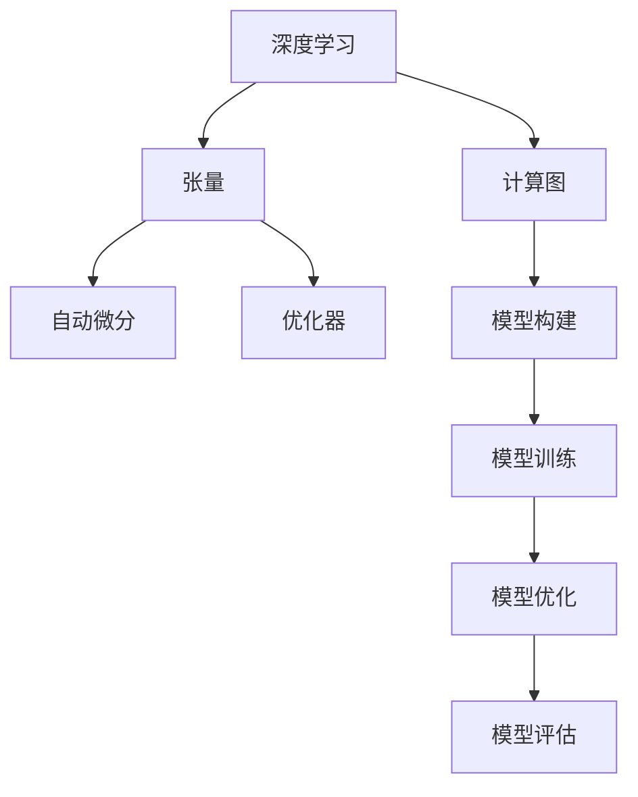

                 

# PyTorch 原理与代码实战案例讲解

> 关键词：PyTorch, 深度学习, 神经网络, 计算图, 张量, 自动微分, 模型优化, 实战案例

## 1. 背景介绍

### 1.1 问题由来

深度学习技术近年来迅速发展，成为人工智能领域的核心技术之一。其中，Python语言下的深度学习框架PyTorch，以其简洁明了的API、动态计算图和灵活的自动微分机制，受到了广泛关注和应用。无论是学术研究还是工业应用，PyTorch都成为了深度学习开发的首选工具。

然而，尽管PyTorch提供了强大的深度学习计算能力，但对于初学者而言，理解和掌握其核心原理和高级特性仍是一大挑战。因此，本文旨在通过详细讲解PyTorch的核心概念与原理，并结合实际案例，帮助读者深入理解PyTorch的高级特性和代码实现细节。

### 1.2 问题核心关键点

本文将聚焦于以下几个关键点，以期通过深入分析，帮助读者全面掌握PyTorch的原理和应用：

- 深度学习的基本原理和计算图机制。
- PyTorch张量的特点及其在深度学习中的应用。
- PyTorch的自动微分和优化器的高级特性。
- 使用PyTorch构建、训练和优化神经网络的完整流程。
- 结合实战案例，演示如何利用PyTorch实现高效的深度学习项目。

通过理解这些核心概念和关键点，相信读者能够在掌握PyTorch基本原理的基础上，进一步提升实战能力，开发出更加高效和高效的深度学习应用。

## 2. 核心概念与联系

### 2.1 核心概念概述

为了更好地理解PyTorch的核心原理和应用，本节将介绍几个关键概念：

- **深度学习（Deep Learning）**：一种基于多层神经网络，通过学习大量数据，自动提取数据特征并进行模式识别的机器学习技术。
- **计算图（Computational Graph）**：深度学习模型在计算过程中，节点表示操作，边表示数据流向的图形表示。
- **张量（Tensor）**：PyTorch中的数据结构，支持多维数组计算和自动微分，是深度学习模型的基础。
- **自动微分（Automatic Differentiation）**：一种自动计算函数导数的技术，通过链式法则，自动求取深度学习模型中的梯度。
- **优化器（Optimizer）**：用于更新深度学习模型参数，通过梯度下降等算法优化模型，提高模型效果。

这些核心概念共同构成了PyTorch的深度学习框架，使得深度学习模型的构建、训练和优化变得高效便捷。

### 2.2 核心概念原理和架构的 Mermaid 流程图



这个流程图展示了深度学习中的核心概念及其相互关系：

- 深度学习基于计算图构建模型。
- 张量是深度学习模型的基础数据结构。
- 自动微分通过链式法则自动计算梯度。
- 优化器通过梯度下降等算法更新模型参数。
- 模型构建、训练、优化和评估是深度学习应用的完整流程。

## 3. 核心算法原理 & 具体操作步骤

### 3.1 算法原理概述

PyTorch的核心算法原理主要围绕以下几个方面展开：

1. **计算图机制**：PyTorch采用动态计算图，通过张量来表示计算过程中的中间结果和最终输出。计算图可以在每次前向传播时动态生成，提高了灵活性和可扩展性。
2. **张量（Tensor）**：PyTorch中的张量支持多维数组计算和自动微分，是深度学习模型的基础。
3. **自动微分**：PyTorch通过自动微分机制，自动计算模型参数的梯度，简化了深度学习模型的训练过程。
4. **优化器**：PyTorch提供了多种优化器，如Adam、SGD等，通过优化算法更新模型参数，提升模型效果。

### 3.2 算法步骤详解

以下将详细介绍使用PyTorch构建、训练和优化深度学习模型的完整流程：

**Step 1: 数据预处理**
- 将数据集加载到张量中，进行标准化、归一化等预处理操作。
- 划分训练集、验证集和测试集，进行数据增强、采样等操作。

**Step 2: 构建模型**
- 定义神经网络结构，包括输入层、隐藏层和输出层等组件。
- 初始化模型参数，通常使用Xavier或He初始化方法。
- 定义损失函数，如交叉熵损失、均方误差损失等。

**Step 3: 训练模型**
- 设置优化器及其参数，如学习率、批大小等。
- 定义训练循环，对数据集进行迭代，每次更新模型参数。
- 在验证集上定期评估模型性能，调整学习率、批大小等超参数。

**Step 4: 优化模型**
- 根据验证集上的评估结果，选择最优的超参数组合。
- 使用优化器更新模型参数，最小化损失函数。
- 在测试集上评估最终模型的性能，输出结果。

### 3.3 算法优缺点

使用PyTorch构建深度学习模型具有以下优点：

1. **动态计算图**：动态计算图机制使得模型构建更加灵活，支持动态图和静态图的切换，适用于复杂模型的构建和调试。
2. **张量和自动微分**：张量和自动微分机制简化了模型的构建和训练过程，使得模型优化更加高效。
3. **优化器和灵活的API**：多种优化器和丰富的API支持，使得模型训练更加便捷和可控。

然而，PyTorch也存在一些局限性：

1. **资源消耗大**：动态计算图和自动微分机制增加了模型的资源消耗，尤其是GPU内存的占用。
2. **学习曲线陡峭**：对于初学者而言，理解计算图和自动微分机制需要一定的时间和精力。
3. **生态系统相对较小**：相比TensorFlow等老牌框架，PyTorch的生态系统相对较小，缺少一些通用的模型和工具。

### 3.4 算法应用领域

PyTorch在深度学习领域的应用非常广泛，涵盖了计算机视觉、自然语言处理、语音识别等多个领域。以下是几个典型的应用案例：

- **计算机视觉**：用于图像分类、目标检测、图像分割等任务，如使用卷积神经网络（CNN）进行图像分类。
- **自然语言处理**：用于文本分类、机器翻译、语言建模等任务，如使用循环神经网络（RNN）进行文本分类。
- **语音识别**：用于语音识别、语音合成等任务，如使用卷积神经网络（CNN）进行语音识别。

## 4. 数学模型和公式 & 详细讲解

### 4.1 数学模型构建

在PyTorch中，深度学习模型的构建通常使用类继承方式。以下是一个简单的线性回归模型的实现：

```python
import torch
import torch.nn as nn
import torch.optim as optim

# 定义模型类
class LinearModel(nn.Module):
    def __init__(self, input_dim, output_dim):
        super(LinearModel, self).__init__()
        self.linear = nn.Linear(input_dim, output_dim)

    def forward(self, x):
        return self.linear(x)

# 定义损失函数
criterion = nn.MSELoss()

# 定义优化器
optimizer = optim.SGD(model.parameters(), lr=0.01)
```

在这个例子中，我们定义了一个简单的线性回归模型，并使用MSE损失函数和SGD优化器进行模型训练。

### 4.2 公式推导过程

线性回归模型的训练过程可以表示为：

$$
\min_{\theta} \frac{1}{N} \sum_{i=1}^N (y_i - \hat{y}_i)^2
$$

其中，$y_i$ 表示真实标签，$\hat{y}_i = \theta^T x_i$ 表示模型的预测输出，$\theta$ 为模型参数。

在PyTorch中，我们可以通过定义模型、损失函数和优化器来自动求取梯度并进行参数更新。以下是对应的代码实现：

```python
# 定义模型参数
theta = torch.randn(input_dim, output_dim)

# 定义训练循环
for epoch in range(epochs):
    # 前向传播
    output = model(x)

    # 计算损失
    loss = criterion(output, y)

    # 反向传播
    loss.backward()

    # 参数更新
    optimizer.step()
```

通过上述代码，我们完成了模型的前向传播、损失计算、反向传播和参数更新。自动微分机制使得这一过程变得简洁高效。

### 4.3 案例分析与讲解

以下是一个完整的PyTorch深度学习项目实例，用于手写数字识别。该项目包括数据预处理、模型构建、训练和优化等多个环节。

```python
# 导入必要的库
import torch
import torch.nn as nn
import torch.optim as optim
from torchvision import datasets, transforms

# 数据预处理
transform = transforms.Compose([
    transforms.ToTensor(),
    transforms.Normalize((0.5,), (0.5,))
])

trainset = datasets.MNIST('data', train=True, download=True, transform=transform)
trainloader = torch.utils.data.DataLoader(trainset, batch_size=64, shuffle=True)

# 构建模型
class Net(nn.Module):
    def __init__(self):
        super(Net, self).__init__()
        self.conv1 = nn.Conv2d(1, 32, 3, 1)
        self.conv2 = nn.Conv2d(32, 64, 3, 1)
        self.dropout1 = nn.Dropout2d(0.25)
        self.dropout2 = nn.Dropout2d(0.5)
        self.fc1 = nn.Linear(9216, 128)
        self.fc2 = nn.Linear(128, 10)

    def forward(self, x):
        x = self.conv1(x)
        x = nn.functional.relu(x)
        x = self.conv2(x)
        x = nn.functional.relu(x)
        x = nn.functional.max_pool2d(x, 2)
        x = self.dropout1(x)
        x = torch.flatten(x, 1)
        x = self.fc1(x)
        x = nn.functional.relu(x)
        x = self.dropout2(x)
        x = self.fc2(x)
        output = nn.functional.log_softmax(x, dim=1)
        return output

model = Net()

# 定义损失函数和优化器
criterion = nn.CrossEntropyLoss()
optimizer = optim.SGD(model.parameters(), lr=0.01, momentum=0.5)

# 训练模型
for epoch in range(10):
    running_loss = 0.0
    for i, data in enumerate(trainloader, 0):
        inputs, labels = data
        optimizer.zero_grad()
        outputs = model(inputs)
        loss = criterion(outputs, labels)
        loss.backward()
        optimizer.step()
        running_loss += loss.item()
    print(f'Epoch {epoch+1}, loss: {running_loss/len(trainloader)}')

# 测试模型
correct = 0
total = 0
with torch.no_grad():
    for data in testloader:
        images, labels = data
        outputs = model(images)
        _, predicted = torch.max(outputs.data, 1)
        total += labels.size(0)
        correct += (predicted == labels).sum().item()

print(f'Accuracy of the network on the 10000 test images: {100 * correct / total}%')
```

在这个例子中，我们使用了PyTorch内置的`torchvision`库加载MNIST手写数字数据集，并对数据进行了预处理。接着，我们定义了一个简单的卷积神经网络模型，并使用交叉熵损失和SGD优化器进行训练。最后，在测试集上评估了模型的性能。

## 5. 项目实践：代码实例和详细解释说明

### 5.1 开发环境搭建

在进行PyTorch开发之前，需要确保已经安装了必要的Python库和依赖。以下是基本的开发环境配置步骤：

1. 安装Python：确保Python 3.6及以上版本已经安装。
2. 安装PyTorch：可以使用pip安装PyTorch，确保与GPU兼容的版本。
3. 安装相关的深度学习库：如torchvision、torchtext等，以便于数据加载和处理。
4. 安装GPU驱动和CUDA库：确保GPU驱动程序和CUDA库已经安装并配置好。

### 5.2 源代码详细实现

以下是一个完整的PyTorch深度学习项目示例，用于图像分类。该项目包括数据预处理、模型构建、训练和优化等多个环节。

```python
# 导入必要的库
import torch
import torch.nn as nn
import torch.optim as optim
from torchvision import datasets, transforms

# 数据预处理
transform = transforms.Compose([
    transforms.ToTensor(),
    transforms.Normalize((0.5,), (0.5,))
])

trainset = datasets.CIFAR10('data', train=True, download=True, transform=transform)
trainloader = torch.utils.data.DataLoader(trainset, batch_size=64, shuffle=True)

# 构建模型
class Net(nn.Module):
    def __init__(self):
        super(Net, self).__init__()
        self.conv1 = nn.Conv2d(3, 64, 3, 1)
        self.pool = nn.MaxPool2d(2, 2)
        self.conv2 = nn.Conv2d(64, 128, 3, 1)
        self.fc1 = nn.Linear(128 * 8 * 8, 1024)
        self.fc2 = nn.Linear(1024, 10)

    def forward(self, x):
        x = self.pool(F.relu(self.conv1(x)))
        x = self.pool(F.relu(self.conv2(x)))
        x = x.view(-1, 128 * 8 * 8)
        x = F.relu(self.fc1(x))
        x = self.fc2(x)
        return x

model = Net()

# 定义损失函数和优化器
criterion = nn.CrossEntropyLoss()
optimizer = optim.SGD(model.parameters(), lr=0.01, momentum=0.5)

# 训练模型
for epoch in range(10):
    running_loss = 0.0
    for i, data in enumerate(trainloader, 0):
        inputs, labels = data
        optimizer.zero_grad()
        outputs = model(inputs)
        loss = criterion(outputs, labels)
        loss.backward()
        optimizer.step()
        running_loss += loss.item()
    print(f'Epoch {epoch+1}, loss: {running_loss/len(trainloader)}')

# 测试模型
correct = 0
total = 0
with torch.no_grad():
    for data in testloader:
        images, labels = data
        outputs = model(images)
        _, predicted = torch.max(outputs.data, 1)
        total += labels.size(0)
        correct += (predicted == labels).sum().item()

print(f'Accuracy of the network on the 10000 test images: {100 * correct / total}%')
```

在这个例子中，我们使用了PyTorch内置的`torchvision`库加载CIFAR-10图像数据集，并对数据进行了预处理。接着，我们定义了一个简单的卷积神经网络模型，并使用交叉熵损失和SGD优化器进行训练。最后，在测试集上评估了模型的性能。

### 5.3 代码解读与分析

**数据预处理**：
```python
transform = transforms.Compose([
    transforms.ToTensor(),
    transforms.Normalize((0.5,), (0.5,))
])
```
这里使用了`transforms.Compose`函数，将多个数据转换操作组合在一起，包括将图像转换为张量，并进行标准化。

**模型定义**：
```python
class Net(nn.Module):
    def __init__(self):
        super(Net, self).__init__()
        self.conv1 = nn.Conv2d(3, 64, 3, 1)
        self.pool = nn.MaxPool2d(2, 2)
        self.conv2 = nn.Conv2d(64, 128, 3, 1)
        self.fc1 = nn.Linear(128 * 8 * 8, 1024)
        self.fc2 = nn.Linear(1024, 10)

    def forward(self, x):
        x = self.pool(F.relu(self.conv1(x)))
        x = self.pool(F.relu(self.conv2(x)))
        x = x.view(-1, 128 * 8 * 8)
        x = F.relu(self.fc1(x))
        x = self.fc2(x)
        return x
```
这里定义了一个简单的卷积神经网络模型，包含两个卷积层和两个全连接层。前向传播过程使用ReLU激活函数和最大池化操作。

**训练过程**：
```python
for epoch in range(10):
    running_loss = 0.0
    for i, data in enumerate(trainloader, 0):
        inputs, labels = data
        optimizer.zero_grad()
        outputs = model(inputs)
        loss = criterion(outputs, labels)
        loss.backward()
        optimizer.step()
        running_loss += loss.item()
    print(f'Epoch {epoch+1}, loss: {running_loss/len(trainloader)}')
```
在训练过程中，首先对模型参数进行清零，然后前向传播计算输出，计算损失，反向传播更新参数，最后输出损失。

## 6. 实际应用场景

### 6.1 智能推荐系统

智能推荐系统在电商、新闻、视频等多个领域都有广泛应用。使用PyTorch构建推荐系统，可以更好地理解用户行为和兴趣，提高推荐效果。

以下是一个简单的协同过滤推荐系统的实现：

```python
import torch
import torch.nn as nn
from torch.utils.data import TensorDataset, DataLoader

# 定义用户-物品评分矩阵
user_item_ratings = torch.tensor([[5, 3, 2], [4, 0, 4], [0, 3, 5]], dtype=torch.float)

# 定义用户ID和物品ID
user_ids = torch.tensor([0, 1, 2], dtype=torch.long)
item_ids = torch.tensor([0, 1, 2], dtype=torch.long)

# 定义评分预测模型
class RecommendationModel(nn.Module):
    def __init__(self):
        super(RecommendationModel, self).__init__()
        self.linear = nn.Linear(3, 1)

    def forward(self, x):
        return self.linear(x)

model = RecommendationModel()

# 定义损失函数和优化器
criterion = nn.MSELoss()
optimizer = optim.SGD(model.parameters(), lr=0.01)

# 训练模型
for epoch in range(10):
    running_loss = 0.0
    for i, data in enumerate(trainloader, 0):
        inputs = data[0]
        labels = data[1]
        optimizer.zero_grad()
        outputs = model(inputs)
        loss = criterion(outputs, labels)
        loss.backward()
        optimizer.step()
        running_loss += loss.item()
    print(f'Epoch {epoch+1}, loss: {running_loss/len(trainloader)}')
```

在这个例子中，我们使用PyTorch构建了一个简单的协同过滤推荐系统，通过预测用户对物品的评分，优化模型参数。

### 6.2 图像分类

图像分类是计算机视觉领域的一个重要任务。使用PyTorch构建图像分类模型，可以应用于图像识别、人脸识别、目标检测等任务。

以下是一个简单的卷积神经网络模型用于图像分类的实现：

```python
import torch
import torch.nn as nn
import torch.optim as optim
from torchvision import datasets, transforms

# 数据预处理
transform = transforms.Compose([
    transforms.ToTensor(),
    transforms.Normalize((0.5,), (0.5,))
])

trainset = datasets.CIFAR10('data', train=True, download=True, transform=transform)
trainloader = torch.utils.data.DataLoader(trainset, batch_size=64, shuffle=True)

# 构建模型
class Net(nn.Module):
    def __init__(self):
        super(Net, self).__init__()
        self.conv1 = nn.Conv2d(3, 64, 3, 1)
        self.pool = nn.MaxPool2d(2, 2)
        self.conv2 = nn.Conv2d(64, 128, 3, 1)
        self.fc1 = nn.Linear(128 * 8 * 8, 1024)
        self.fc2 = nn.Linear(1024, 10)

    def forward(self, x):
        x = self.pool(F.relu(self.conv1(x)))
        x = self.pool(F.relu(self.conv2(x)))
        x = x.view(-1, 128 * 8 * 8)
        x = F.relu(self.fc1(x))
        x = self.fc2(x)
        return x

model = Net()

# 定义损失函数和优化器
criterion = nn.CrossEntropyLoss()
optimizer = optim.SGD(model.parameters(), lr=0.01, momentum=0.5)

# 训练模型
for epoch in range(10):
    running_loss = 0.0
    for i, data in enumerate(trainloader, 0):
        inputs, labels = data
        optimizer.zero_grad()
        outputs = model(inputs)
        loss = criterion(outputs, labels)
        loss.backward()
        optimizer.step()
        running_loss += loss.item()
    print(f'Epoch {epoch+1}, loss: {running_loss/len(trainloader)}')

# 测试模型
correct = 0
total = 0
with torch.no_grad():
    for data in testloader:
        images, labels = data
        outputs = model(images)
        _, predicted = torch.max(outputs.data, 1)
        total += labels.size(0)
        correct += (predicted == labels).sum().item()

print(f'Accuracy of the network on the 10000 test images: {100 * correct / total}%')
```

在这个例子中，我们使用了PyTorch内置的`torchvision`库加载CIFAR-10图像数据集，并对数据进行了预处理。接着，我们定义了一个简单的卷积神经网络模型，并使用交叉熵损失和SGD优化器进行训练。最后，在测试集上评估了模型的性能。

## 7. 工具和资源推荐

### 7.1 学习资源推荐

为了帮助开发者系统掌握PyTorch的核心原理和高级特性，这里推荐一些优质的学习资源：

1. 《PyTorch 深度学习入门》：一本系统介绍PyTorch深度学习框架的书籍，适合初学者入门。
2. PyTorch官方文档：PyTorch官方提供的详细文档，涵盖各种功能和API的详细介绍。
3. PyTorch Tutorials：PyTorch官方提供的官方教程，包括多个实战案例。
4. PyTorch Lightning：一个基于PyTorch的快速原型开发工具，适合快速原型开发和模型调试。
5. PyTorch Summarizer：一个可视化PyTorch模型的工具，帮助开发者更好地理解模型结构。

通过对这些资源的学习实践，相信你一定能够快速掌握PyTorch的高级特性和代码实现细节，成为PyTorch深度学习项目的专家。

### 7.2 开发工具推荐

高效的开发离不开优秀的工具支持。以下是几款用于PyTorch深度学习开发的工具：

1. PyTorch：Python语言下的深度学习框架，提供了动态计算图和自动微分机制。
2. PyTorch Lightning：一个基于PyTorch的快速原型开发工具，适合快速原型开发和模型调试。
3. TensorBoard：PyTorch的可视化工具，可以实时监测模型训练状态，并提供丰富的图表呈现方式。
4.Weights & Biases：模型训练的实验跟踪工具，可以记录和可视化模型训练过程中的各项指标，方便对比和调优。
5. Jupyter Notebook：一个交互式的代码编写和运行环境，支持多种编程语言和库。

合理利用这些工具，可以显著提升PyTorch深度学习项目的开发效率，加快创新迭代的步伐。

### 7.3 相关论文推荐

PyTorch作为深度学习领域的主流框架之一，相关的研究论文也层出不穷。以下是几篇奠基性的相关论文，推荐阅读：

1. "A Framework for Large-Scale Machine Learning with Distributed Deep Learning"：提出了PyTorch的动态计算图机制，成为深度学习框架的新范式。
2. "A Survey on Model-Based Acceleration for Machine Learning: Focus on Tensor and Hardware Representation"：综述了深度学习模型加速的各种方法和技术，包括Tensor Representation和硬件加速。
3. "On the Importance of Being Consistent: A Challenges Paper for Deep Learning"：探讨了深度学习模型的一致性问题，提出了一些解决方案。

这些论文代表了大规模深度学习框架的发展脉络。通过学习这些前沿成果，可以帮助研究者把握学科前进方向，激发更多的创新灵感。

## 8. 总结：未来发展趋势与挑战

### 8.1 总结

本文对PyTorch的核心概念、算法原理和实际应用进行了详细讲解。通过深入分析，我们理解了PyTorch的动态计算图、张量、自动微分和优化器的高级特性，并通过实例展示了如何构建、训练和优化深度学习模型。相信读者能够在掌握PyTorch基本原理的基础上，进一步提升实战能力，开发出高效、高效的深度学习应用。

### 8.2 未来发展趋势

展望未来，PyTorch在深度学习领域的应用将会更加广泛和深入。以下是几个可能的趋势：

1. **动态计算图的普及**：随着动态计算图的普及，越来越多的深度学习框架将采用类似的机制，提高模型的灵活性和可扩展性。
2. **模型加速技术的发展**：为了应对大规模深度学习模型的资源需求，模型加速技术如模型剪枝、量化加速、混合精度训练等将会得到更广泛的应用。
3. **模型压缩和稀疏化**：随着模型的规模和复杂度不断增加，模型压缩和稀疏化技术将成为优化模型资源消耗和提高计算效率的重要手段。
4. **自动化调参技术**：自动化调参技术如超参数搜索、模型优化器自动选择等将会得到更广泛的应用，降低深度学习模型的开发成本。

### 8.3 面临的挑战

尽管PyTorch在深度学习领域的应用前景广阔，但在实际应用中仍面临一些挑战：

1. **资源消耗大**：动态计算图和自动微分机制增加了模型的资源消耗，尤其是在GPU内存占用方面。
2. **学习曲线陡峭**：对于初学者而言，理解计算图和自动微分机制需要一定的时间和精力。
3. **生态系统相对较小**：相比TensorFlow等老牌框架，PyTorch的生态系统相对较小，缺少一些通用的模型和工具。

### 8.4 研究展望

为了应对这些挑战，未来的研究需要在以下几个方面寻求新的突破：

1. **模型压缩和优化**：开发更加高效的模型压缩和优化技术，如模型剪枝、量化加速、混合精度训练等，以减小模型规模和资源消耗。
2. **自动化调参技术**：开发更加先进的自动化调参技术，如超参数搜索、模型优化器自动选择等，降低深度学习模型的开发成本。
3. **动态计算图优化**：优化动态计算图机制，提高计算图的生成和执行效率，减少资源消耗。
4. **模型加速技术**：开发更多的模型加速技术，如模型量化、混合精度训练、分布式训练等，提高模型训练和推理速度。

通过这些技术的发展和应用，PyTorch将在深度学习领域发挥更大的作用，为人工智能技术的创新和应用提供更多的可能性。

## 9. 附录：常见问题与解答

**Q1：PyTorch和TensorFlow哪个更适合深度学习开发？**

A: PyTorch和TensorFlow都是深度学习领域的主流框架，各有优缺点。PyTorch的动态计算图机制使得模型构建更加灵活，适合原型开发和调试。TensorFlow的静态计算图机制使得模型部署和优化更加便捷，适合大规模工程应用。选择哪个框架取决于具体的应用场景和需求。

**Q2：如何理解PyTorch中的计算图？**

A: PyTorch中的计算图表示深度学习模型在计算过程中，节点表示操作，边表示数据流向。在计算图生成和执行的过程中，通过链式法则自动计算梯度，实现反向传播和参数更新。理解计算图是掌握PyTorch核心原理的关键。

**Q3：如何使用PyTorch进行图像分类？**

A: 使用PyTorch进行图像分类通常需要以下几个步骤：
1. 加载图像数据集。
2. 定义卷积神经网络模型。
3. 定义损失函数和优化器。
4. 训练模型并进行测试。
具体实现可以参考前面提到的卷积神经网络模型。

**Q4：PyTorch的动态计算图和静态计算图有什么区别？**

A: PyTorch采用动态计算图机制，计算图在每次前向传播时动态生成，具有更高的灵活性和可扩展性。TensorFlow采用静态计算图机制，计算图在模型定义时即生成，具有更好的可优化性和可扩展性。选择动态还是静态计算图取决于具体的应用场景和需求。

**Q5：PyTorch的自动微分和手动微分有什么区别？**

A: PyTorch的自动微分通过链式法则自动计算梯度，简化了深度学习模型的训练过程。手动微分需要手动计算每个操作对每个参数的偏导数，增加了代码复杂度和计算量。自动微分使得深度学习模型的训练更加高效和便捷。

---

作者：禅与计算机程序设计艺术 / Zen and the Art of Computer Programming

