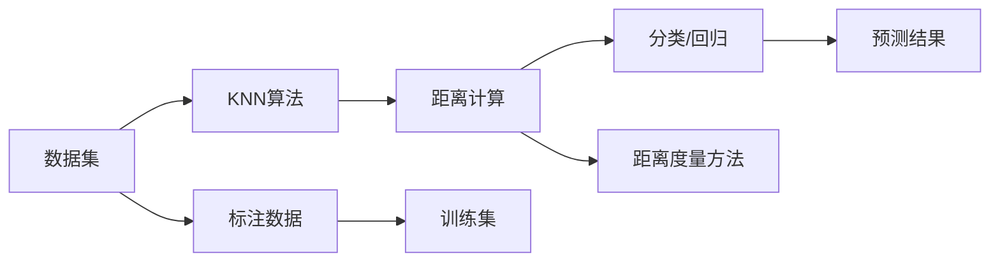

                 

# Python机器学习实战：K-近邻(KNN)算法的工作原理和应用

> 关键词：K近邻, 机器学习, 数据分类, 预测分析, 距离计算, 监督学习

## 1. 背景介绍

### 1.1 问题由来
在机器学习领域，数据分类和预测分析是两大核心任务。传统的监督学习算法如逻辑回归、支持向量机等，往往依赖于对数据特征的较强假设，如正态分布、线性可分性等。而K近邻(K-Nearest Neighbors, KNN)算法则是一种基于实例的简单、直观的机器学习算法。KNN算法无需对数据分布进行任何假设，适用于各种类型的数据，包括连续型和离散型。

KNN算法的基本思想是：对于一个新的样本点，将其归为离它最近的K个训练样本中数量最多的类别。这种基于局部决策的简单策略，在许多实际场景中表现出了很好的性能。然而，KNN算法的一个主要缺点是计算复杂度较高，尤其是在高维空间中。因此，本文将详细阐述KNN算法的工作原理、优缺点及其在数据分类和预测分析中的实际应用。

## 2. 核心概念与联系

### 2.1 核心概念概述

- **K近邻算法(KNN)**：一种基于实例的监督学习算法，用于分类和回归问题。算法通过计算测试样本与训练样本之间的距离（如欧几里得距离、曼哈顿距离等），选择K个最近邻样本，并将测试样本归为这K个样本中出现最多的类别或取其平均值。

- **数据分类(Data Classification)**：将数据集中的样本根据其特征属性进行分类，是机器学习中常见的任务之一。KNN算法适用于数据分类任务，通过计算样本之间的距离，将新样本归为离其最近的K个样本中的主要类别。

- **预测分析(Predictive Analytics)**：通过分析历史数据，对未来事件进行预测和分析。KNN算法可以用于预测分析，通过比较测试样本与训练样本的特征，预测其属于哪一类。

- **距离计算(Distance Calculation)**：在KNN算法中，计算测试样本与训练样本之间的距离是一个关键步骤。距离计算方法的选择将直接影响算法的性能。

- **监督学习(Supervised Learning)**：基于标注数据的机器学习，目标是学习一个模型，使其能够在新的数据上做出准确的预测。KNN算法是一种典型的监督学习算法，依赖于训练集中的标注数据进行分类或回归。

这些核心概念之间的关系可以用以下Mermaid流程图表示：



这个流程图展示了KNN算法的工作流程：首先收集数据集和标注数据，然后计算样本之间的距离，并根据K个最近邻的样本进行分类或回归。

## 3. 核心算法原理 & 具体操作步骤

### 3.1 算法原理概述

KNN算法的基本流程如下：

1. **收集数据**：收集标注数据集，每个数据点包含一个特征向量和对应的标签。
2. **距离计算**：计算测试样本与所有训练样本之间的距离，选择距离最近的K个样本。
3. **投票分类**：统计K个最近邻样本中每个类别的出现次数，将测试样本归为出现次数最多的类别。
4. **预测输出**：对于回归问题，取K个最近邻样本的均值作为预测结果。

KNN算法的核心在于距离计算和K值的选择。距离计算方法的选择将直接影响算法的性能，常见的距离度量方法包括欧几里得距离、曼哈顿距离、余弦相似度等。K值的选择同样重要，K值太小会导致噪声样本的影响增大，K值太大则可能导致分类边界模糊，性能下降。

### 3.2 算法步骤详解

**Step 1: 准备数据集**
- 收集包含特征和标签的数据集。
- 使用Python的scikit-learn库中的Dataset类创建数据集。

**Step 2: 训练模型**
- 加载训练集数据，使用训练集训练KNN模型。
- 使用scikit-learn库中的KNeighborsClassifier类创建KNN分类器。
- 设置距离度量方法（如'euclidean'）和K值。
- 调用fit方法训练模型。

**Step 3: 预测新数据**
- 加载测试集数据。
- 使用训练好的KNN模型进行预测。
- 输出预测结果。

**Step 4: 评估模型**
- 使用测试集评估模型的准确率、精确率、召回率等指标。
- 调整K值和距离度量方法，进一步优化模型性能。

### 3.3 算法优缺点

**优点**：
- 简单易懂，易于实现。
- 不需要对数据进行任何假设，适用于各种类型的数据。
- 鲁棒性好，对异常值不敏感。

**缺点**：
- 计算复杂度高，尤其是在高维空间中。
- 对数据的存储和I/O操作要求较高，内存占用大。
- 需要选择合适的K值，否则会影响模型性能。

### 3.4 算法应用领域

KNN算法广泛应用于各种数据分类和预测分析场景，包括：

- **文本分类**：将文本数据分类为不同的主题或情感类别。
- **图像识别**：识别图像中的物体或场景。
- **客户分群**：将客户根据购买行为、偏好等特征进行分组。
- **推荐系统**：推荐系统可以根据用户的历史行为，推荐相似的商品或服务。
- **股票预测**：根据历史股票价格数据，预测未来的股票价格变化。

KNN算法还可以与其他机器学习算法结合使用，如决策树、支持向量机等，进一步提升模型的性能。

## 4. 数学模型和公式 & 详细讲解 & 举例说明

### 4.1 数学模型构建

KNN算法基于实例的学习，其数学模型可以表示为：

- 对于分类问题，令 $y$ 表示测试样本的标签，$k$ 表示最近邻的数量，$D$ 表示距离度量方法，$x_t$ 表示测试样本的特征向量，$D_{i}(x_t, x_{train,i})$ 表示测试样本 $x_t$ 与训练样本 $x_{train,i}$ 之间的距离。

  \[
  \hat{y} = \text{arg}\max_{y} \sum_{i=1}^k I(y_i = y) \delta_i
  \]

  其中 $\delta_i$ 表示距离权重，通常采用逆距离权重，即 $\delta_i = 1 / D(x_t, x_{train,i})$。

- 对于回归问题，令 $y_t$ 表示测试样本的标签，$k$ 表示最近邻的数量，$D$ 表示距离度量方法，$x_t$ 表示测试样本的特征向量，$D_{i}(x_t, x_{train,i})$ 表示测试样本 $x_t$ 与训练样本 $x_{train,i}$ 之间的距离。

  \[
  \hat{y}_t = \frac{1}{k} \sum_{i=1}^k y_{train,i} \delta_i
  \]

### 4.2 公式推导过程

以欧几里得距离为例，计算两个样本之间的距离公式如下：

\[
D(x_t, x_{train,i}) = \sqrt{\sum_{j=1}^n (x_{t,j} - x_{train,i,j})^2}
\]

其中 $n$ 表示样本特征的维度，$j$ 表示特征向量中的第 $j$ 个分量。

在实际应用中，为了避免计算所有训练样本的距离，可以使用球树或KD树等数据结构，减少计算复杂度。

### 4.3 案例分析与讲解

假设有一个客户分群的场景，我们需要根据客户的历史购买数据，将其分为高价值客户和普通客户。我们可以使用KNN算法，选择最近邻的客户数据，并计算其分类结果。例如，如果一个客户购买了高价值产品，而其K个最近邻客户中有 $M$ 个购买了高价值产品，则该客户被分类为高价值客户。

## 5. 项目实践：代码实例和详细解释说明

### 5.1 开发环境搭建

**Step 1: 安装Python和scikit-learn库**

1. 安装Python：可以从官网下载并安装Python。
2. 安装scikit-learn：使用pip安装。

```bash
pip install -U scikit-learn
```

### 5.2 源代码详细实现

**Step 2: 加载数据集**

```python
from sklearn.datasets import load_iris
from sklearn.model_selection import train_test_split

# 加载鸢尾花数据集
iris = load_iris()
X, y = iris.data, iris.target

# 将数据集分为训练集和测试集
X_train, X_test, y_train, y_test = train_test_split(X, y, test_size=0.2, random_state=42)
```

**Step 3: 训练KNN模型**

```python
from sklearn.neighbors import KNeighborsClassifier

# 创建KNN分类器
knn = KNeighborsClassifier(n_neighbors=5, metric='euclidean')

# 训练模型
knn.fit(X_train, y_train)
```

**Step 4: 预测新数据**

```python
# 加载新的样本数据
new_sample = [[5.1, 3.5, 1.4, 0.2]]

# 使用模型进行预测
pred = knn.predict(new_sample)
print(pred)
```

**Step 5: 评估模型**

```python
from sklearn.metrics import accuracy_score

# 使用测试集评估模型
pred = knn.predict(X_test)
accuracy = accuracy_score(y_test, pred)
print('Accuracy:', accuracy)
```

### 5.3 代码解读与分析

**Step 2: 加载数据集**

- 使用scikit-learn库中的load_iris函数加载鸢尾花数据集。
- 使用train_test_split函数将数据集分为训练集和测试集。

**Step 3: 训练KNN模型**

- 创建KNeighborsClassifier对象，指定K值和距离度量方法。
- 使用fit方法训练模型。

**Step 4: 预测新数据**

- 加载新的样本数据。
- 使用predict方法进行预测，输出预测结果。

**Step 5: 评估模型**

- 使用accuracy_score函数计算模型在测试集上的准确率。

## 6. 实际应用场景

### 6.1 图像识别

KNN算法可以用于图像识别任务，如手写数字识别。通过将图像像素转换为特征向量，然后使用KNN算法进行分类，可以识别出数字。例如，在MNIST数据集上，使用KNN算法可以轻松识别手写数字。

### 6.2 推荐系统

KNN算法可以用于推荐系统，根据用户的历史行为推荐相似的商品或服务。通过计算用户行为特征向量与训练样本的距离，并选择距离最近的K个样本，可以推荐出与用户最相似的商品。

### 6.3 金融风险评估

KNN算法可以用于金融风险评估，根据客户的历史信用记录和行为数据，评估其信用风险。通过计算客户特征向量与训练样本的距离，并选择距离最近的K个样本，可以预测客户的信用风险等级。

## 7. 工具和资源推荐

### 7.1 学习资源推荐

- **《Python机器学习实战》**：这本书全面介绍了Python在机器学习中的应用，包括KNN算法的实现和应用。
- **《机器学习》**：周志华教授的经典教材，系统讲解了机器学习的基本概念和算法，适合入门和进阶学习。
- **Coursera机器学习课程**：由斯坦福大学的Andrew Ng教授主讲的机器学习课程，涵盖了机器学习的各个方面，适合在线学习。
- **Kaggle竞赛**：Kaggle平台上举办的数据竞赛，可以通过参加比赛学习和实践机器学习算法。

### 7.2 开发工具推荐

- **Jupyter Notebook**：免费的开源笔记本环境，支持Python编程和数据分析。
- **scikit-learn**：Python的机器学习库，提供了丰富的算法和工具，适合快速原型开发和模型训练。
- **TensorFlow**：Google开源的机器学习框架，支持深度学习和分布式计算。
- **PyTorch**：Facebook开源的深度学习框架，支持动态计算图和GPU加速。

### 7.3 相关论文推荐

- **KNN算法的理论研究**：李航教授的《统计学习方法》中详细介绍了KNN算法的理论基础。
- **KNN算法的实际应用**：《机器学习实践指南》一书中详细介绍了KNN算法在各个领域的实际应用。

## 8. 总结：未来发展趋势与挑战

### 8.1 总结

本文详细介绍了K近邻(KNN)算法的工作原理和实际应用。KNN算法是一种基于实例的简单、直观的机器学习算法，适用于各种数据类型。通过距离计算和K值选择，KNN算法可以实现数据分类和预测分析。

### 8.2 未来发展趋势

未来的KNN算法将朝着以下几个方向发展：

- **高效计算**：随着计算能力的提升，KNN算法将更适用于高维数据和大型数据集。
- **自动化调参**：通过自动化调参技术，自动选择最优的K值和距离度量方法，提升模型性能。
- **多模态融合**：将KNN算法与其他算法结合使用，实现多模态数据的融合，提升模型的泛化能力和鲁棒性。
- **分布式计算**：在分布式计算框架中实现KNN算法，提升算法的处理速度和效率。

### 8.3 面临的挑战

KNN算法在实际应用中仍然面临一些挑战：

- **计算复杂度高**：在高维空间中，计算距离和选择最近邻样本的复杂度较高。
- **数据稀疏性问题**：在稀疏数据情况下，KNN算法可能会遇到数据样本不足的问题。
- **特征选择问题**：如何选择最优的特征向量，对模型的性能有重要影响。
- **模型可解释性**：KNN算法的决策过程缺乏可解释性，难以解释其内部工作机制。

### 8.4 研究展望

未来的KNN算法研究将集中在以下几个方面：

- **高效计算算法**：开发高效的KNN算法实现，如KD树、球树等数据结构。
- **自动化调参技术**：使用贝叶斯优化、遗传算法等自动化调参技术，提升模型性能。
- **多模态融合算法**：研究如何将KNN算法与其他算法结合使用，实现多模态数据的融合。
- **可解释性研究**：开发可解释性强的KNN算法，提升模型的透明性和可信度。

## 9. 附录：常见问题与解答

**Q1: KNN算法如何选择合适的K值？**

A: 通常情况下，K值的选择需要根据数据集的大小和特点进行调整。一般使用交叉验证的方法，选择性能最好的K值。

**Q2: KNN算法是否可以用于回归问题？**

A: 是的，KNN算法可以用于回归问题，通过计算K个最近邻样本的均值来预测新样本的标签。

**Q3: KNN算法是否适用于高维数据？**

A: 在高维空间中，KNN算法的计算复杂度较高，需要进行优化。可以通过使用KD树、球树等数据结构来加速计算。

**Q4: KNN算法是否可以用于异常检测？**

A: 是的，KNN算法可以用于异常检测，通过计算新样本与训练样本的距离，将距离较大的样本视为异常点。

**Q5: KNN算法是否可以用于文本分类？**

A: 是的，KNN算法可以用于文本分类，通过计算文本特征向量之间的距离，将新文本分类到距离最近的K个文本中。

通过本文的详细讲解，相信读者已经对KNN算法的原理、操作步骤和实际应用有了全面的了解。KNN算法作为机器学习领域的经典算法，简单高效、易于实现，适用于各种数据类型。通过不断地优化和创新，KNN算法将在未来的机器学习应用中发挥更大的作用。

---

作者：禅与计算机程序设计艺术 / Zen and the Art of Computer Programming

