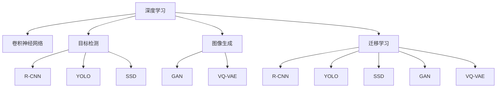

                 

# Python深度学习实践：深度学习与计算机视觉的结合

> 关键词：深度学习,计算机视觉,图像识别,卷积神经网络,目标检测,图像生成,迁移学习

## 1. 背景介绍

### 1.1 问题由来
深度学习(DL)技术自20世纪末提出以来，已经取得巨大的成功，被广泛应用于图像处理、语音识别、自然语言处理等领域。计算机视觉(CV)作为深度学习的重要应用领域，利用深度神经网络对图像进行自动分析、理解和生成，推动了图像处理技术的发展。

然而，深度学习模型往往需要大量的标注数据和强大的计算资源，难以快速适应新问题和实时需求。而计算机视觉面临的任务，如目标检测、图像分类、语义分割等，通常需要高效、准确的模型处理。因此，如何在保证模型精度的同时，提高计算效率、降低数据成本，成为当前深度学习与计算机视觉结合实践中的重要课题。

### 1.2 问题核心关键点
深度学习与计算机视觉的结合，本质上是利用深度神经网络进行图像分析和处理的技术。本文聚焦于深度学习技术在计算机视觉领域的具体应用，旨在探讨如何通过深度学习提升图像处理的速度和准确性，推动深度学习与计算机视觉技术的融合。

## 2. 核心概念与联系

### 2.1 核心概念概述

为更好地理解深度学习在计算机视觉中的应用，本节将介绍几个密切相关的核心概念：

- 深度学习：一种基于神经网络的学习范式，通过多层次的非线性特征提取，可以自动学习复杂模式，解决许多复杂问题。
- 计算机视觉：利用计算机对图像、视频等视觉数据进行处理和分析，实现自动图像识别、目标检测、图像生成等功能。
- 卷积神经网络(CNN)：一种广泛应用于图像处理领域的深度神经网络，具有卷积、池化、非线性激活等功能。
- 目标检测(如R-CNN、YOLO、SSD等)：通过训练模型，对图像中的目标进行定位和分类。
- 图像生成(如GAN、VQ-VAE等)：通过生成对抗网络等方法，生成高质量的图像。
- 迁移学习(Transfer Learning)：将在一个任务上训练好的模型参数，迁移到另一个相似任务中继续训练，以减少新任务训练成本。

这些核心概念之间的逻辑关系可以通过以下Mermaid流程图来展示：



这个流程图展示了大语言模型的核心概念及其之间的关系：

1. 深度学习提供基础，构建深度神经网络模型。
2. 卷积神经网络作为深度学习的基础架构，专门用于图像处理。
3. 目标检测是深度学习在计算机视觉中的重要应用，能够对图像中的目标进行识别和定位。
4. 图像生成是深度学习在计算机视觉中的另一个重要应用，能够生成高质量的图像。
5. 迁移学习使深度学习模型能够从已有任务中迁移知识，应用于新任务。

这些概念共同构成了深度学习在计算机视觉领域的实践框架，使其能够实现高效的图像处理。通过理解这些核心概念，我们可以更好地把握深度学习与计算机视觉结合的应用方向。

## 3. 核心算法原理 & 具体操作步骤
### 3.1 算法原理概述

深度学习与计算机视觉结合的实践，主要利用卷积神经网络(CNN)对图像进行自动分析、处理和生成。其核心思想是：通过卷积层、池化层等模块，对输入图像进行特征提取，并通过全连接层对提取的特征进行分类或回归，实现图像处理任务。

形式化地，假设输入图像为 $x$，卷积神经网络模型为 $M_{\theta}$，其中 $\theta$ 为模型参数。则模型 $M_{\theta}$ 的输出为：

$$
y = M_{\theta}(x)
$$

在图像分类任务中，定义损失函数 $\ell(y, y_{gt})$ 为分类误差，其中 $y_{gt}$ 为图像的真实标签。目标是最小化损失函数 $\ell$：

$$
\theta^* = \mathop{\arg\min}_{\theta} \mathcal{L}(M_{\theta},D)
$$

其中 $\mathcal{L}$ 为经验风险函数，$D$ 为标注数据集。在目标检测任务中，则需要对模型输出进行进一步处理，以确定目标的位置和类别。

### 3.2 算法步骤详解

深度学习与计算机视觉结合的实践，主要包括以下几个关键步骤：

**Step 1: 准备数据集**
- 收集和标注训练集、验证集和测试集，图像应包含丰富的多样性和代表性。
- 对图像进行预处理，如归一化、剪裁、增强等，以提高模型泛化能力。

**Step 2: 搭建卷积神经网络模型**
- 选择合适的卷积神经网络架构，如LeNet、AlexNet、VGG、ResNet等。
- 对模型进行初始化，设置卷积层、池化层、全连接层等关键组件。

**Step 3: 设计损失函数**
- 根据任务类型，选择合适的损失函数，如交叉熵损失、均方误差损失等。
- 对于分类任务，使用分类损失函数；对于回归任务，使用回归损失函数。

**Step 4: 优化器选择与超参数设置**
- 选择合适的优化器，如SGD、Adam等，并设置学习率、批大小、迭代轮数等超参数。
- 应用正则化技术，如L2正则、Dropout等，防止过拟合。

**Step 5: 训练与验证**
- 使用训练集对模型进行前向传播和反向传播训练。
- 周期性在验证集上评估模型性能，调整超参数，直至达到最优效果。

**Step 6: 测试与部署**
- 在测试集上评估模型性能，对比训练前后的精度提升。
- 使用训练好的模型对新图像进行推理预测，集成到实际的应用系统中。

以上是深度学习与计算机视觉结合实践的一般流程。在实际应用中，还需要根据具体任务的特点，对模型架构、损失函数、优化器等环节进行优化设计，以进一步提升模型性能。

### 3.3 算法优缺点

深度学习与计算机视觉结合的实践，具有以下优点：

1. 模型精度高：深度神经网络能够自动学习图像的复杂特征，实现高精度的图像分类、检测和生成。
2. 泛化能力强：通过在大量数据上进行训练，深度学习模型具备良好的泛化能力，能够适应新数据集。
3. 端到端学习：深度学习模型能够自动学习特征提取和分类/回归过程，无需手动提取特征。

同时，该方法也存在一定的局限性：

1. 数据需求大：深度学习模型需要大量的标注数据进行训练，获取高质量标注数据的成本较高。
2. 计算资源需求高：深度神经网络需要大量的计算资源进行训练，难以快速适应实时需求。
3. 模型复杂度高：深度学习模型结构复杂，难以理解和调试，且存在一定程度的过拟合风险。
4. 应用场景受限：深度学习模型通常在特定场景下表现优异，但难以扩展到其他领域。

尽管存在这些局限性，但就目前而言，深度学习与计算机视觉结合的实践，仍然是图像处理技术的主流范式。未来相关研究的重点在于如何进一步降低深度学习模型对数据和计算资源的依赖，提高模型的实时性和泛化能力，同时兼顾可解释性和鲁棒性等因素。

### 3.4 算法应用领域

深度学习与计算机视觉的结合，在图像处理领域已经得到了广泛的应用，涵盖了几乎所有常见的图像处理任务，例如：

- 图像分类：如手写数字识别、物体识别、场景分类等。通过训练模型学习图像-类别映射。
- 目标检测：识别图像中的目标物体，并定位其位置。如R-CNN、YOLO、SSD等。
- 语义分割：将图像分割成不同的语义区域。如FCN、U-Net等。
- 图像生成：生成高质量的新图像。如GAN、VQ-VAE等。
- 图像增强：提升图像质量，增强图像对比度、清晰度等。如AutoAugment、CycleGAN等。
- 图像转换：将图像从一种形式转换为另一种形式。如风格迁移、图像去雾等。

除了上述这些经典任务外，深度学习与计算机视觉的结合还被创新性地应用到更多场景中，如遥感图像分析、医学影像识别、自动驾驶等，为图像处理技术带来了全新的突破。随着深度学习模型的不断进步，相信深度学习与计算机视觉的结合将进一步拓展其应用边界，推动图像处理技术的产业化进程。

## 4. 数学模型和公式 & 详细讲解  
### 4.1 数学模型构建

本节将使用数学语言对深度学习在计算机视觉中的应用进行更加严格的刻画。

记输入图像为 $x \in \mathbb{R}^{H \times W \times C}$，其中 $H$ 为图像高度，$W$ 为图像宽度，$C$ 为图像通道数。假设卷积神经网络模型为 $M_{\theta}:\mathbb{R}^{H \times W \times C} \rightarrow \mathbb{R}^{1 \times 1 \times 1}$，其中 $\theta$ 为模型参数。

定义模型 $M_{\theta}$ 在输入图像 $x$ 上的输出为 $y \in \mathbb{R}^{1 \times 1 \times 1}$，在目标检测任务中，需要进一步处理输出结果，确定目标的位置和类别。

### 4.2 公式推导过程

以图像分类任务为例，假设模型 $M_{\theta}$ 在输入图像 $x$ 上的输出为 $y_{pred} \in [0,1]$，表示图像属于某一类别的概率。则二分类交叉熵损失函数定义为：

$$
\ell(M_{\theta}(x),y_{gt}) = -[y_{gt}\log y_{pred} + (1-y_{gt})\log (1-y_{pred})]
$$

其中 $y_{gt}$ 为图像的真实标签，取值为0或1。将损失函数在所有训练样本上进行平均，得到经验风险函数：

$$
\mathcal{L}(\theta) = \frac{1}{N}\sum_{i=1}^N \ell(M_{\theta}(x_i),y_{gt_i})
$$

在目标检测任务中，模型输出 $y_{pred}$ 通常包含多帧图像的特征图和边界框，需要进一步处理以确定目标的位置和类别。常用的处理方法包括：

- Non-Maximum Suppression(NMS)：去除重叠的边界框，保留置信度最高的目标。
- Anchor Boxes：在图像上均匀分布一系列预定义的边界框，对每个边界框进行分类和回归。
- Region Proposal Networks(RPN)：使用卷积神经网络提出候选边界框，再对每个边界框进行分类和回归。

这些方法使深度学习模型能够处理图像中的多个目标，实现目标检测任务。

## 5. 项目实践：代码实例和详细解释说明
### 5.1 开发环境搭建

在进行深度学习与计算机视觉结合的实践前，我们需要准备好开发环境。以下是使用Python进行PyTorch开发的环境配置流程：

1. 安装Anaconda：从官网下载并安装Anaconda，用于创建独立的Python环境。

2. 创建并激活虚拟环境：
```bash
conda create -n dl-env python=3.8 
conda activate dl-env
```

3. 安装PyTorch：根据CUDA版本，从官网获取对应的安装命令。例如：
```bash
conda install pytorch torchvision torchaudio cudatoolkit=11.1 -c pytorch -c conda-forge
```

4. 安装TensorFlow：
```bash
pip install tensorflow==2.6.0
```

5. 安装各类工具包：
```bash
pip install numpy pandas scikit-learn matplotlib tqdm jupyter notebook ipython
```

完成上述步骤后，即可在`dl-env`环境中开始深度学习与计算机视觉结合的实践。

### 5.2 源代码详细实现

下面我们以图像分类任务为例，给出使用PyTorch进行卷积神经网络模型的PyTorch代码实现。

首先，定义数据处理函数：

```python
import torch
from torch.utils.data import Dataset
from torchvision import transforms

class ImageDataset(Dataset):
    def __init__(self, data_dir, transform=None):
        self.imgs = [os.path.join(data_dir, img) for img in os.listdir(data_dir)]
        self.transform = transform
        
    def __len__(self):
        return len(self.imgs)
    
    def __getitem__(self, idx):
        img_path = self.imgs[idx]
        img = Image.open(img_path)
        
        if self.transform is not None:
            img = self.transform(img)
        
        return img
```

然后，定义卷积神经网络模型：

```python
import torch.nn as nn
import torch.nn.functional as F

class ConvNet(nn.Module):
    def __init__(self):
        super(ConvNet, self).__init__()
        self.conv1 = nn.Conv2d(3, 64, kernel_size=3, stride=1, padding=1)
        self.pool = nn.MaxPool2d(kernel_size=2, stride=2)
        self.conv2 = nn.Conv2d(64, 128, kernel_size=3, stride=1, padding=1)
        self.fc1 = nn.Linear(128 * 7 * 7, 1024)
        self.fc2 = nn.Linear(1024, 10)
    
    def forward(self, x):
        x = self.pool(F.relu(self.conv1(x)))
        x = self.pool(F.relu(self.conv2(x)))
        x = x.view(-1, 128 * 7 * 7)
        x = F.relu(self.fc1(x))
        x = self.fc2(x)
        return x
```

接着，定义训练和评估函数：

```python
import torch.optim as optim
from sklearn.metrics import classification_report

def train_epoch(model, train_loader, optimizer, device):
    model.train()
    losses = []
    for data, target in train_loader:
        data, target = data.to(device), target.to(device)
        optimizer.zero_grad()
        output = model(data)
        loss = F.cross_entropy(output, target)
        loss.backward()
        optimizer.step()
        losses.append(loss.item())
    return sum(losses) / len(train_loader)

def evaluate(model, test_loader, device):
    model.eval()
    preds, labels = [], []
    with torch.no_grad():
        for data, target in test_loader:
            data, target = data.to(device), target.to(device)
            output = model(data)
            pred = output.argmax(dim=1)
            preds.append(pred.cpu().numpy())
            labels.append(target.cpu().numpy())
    print(classification_report(labels, preds))
```

最后，启动训练流程并在测试集上评估：

```python
epochs = 10
batch_size = 32
learning_rate = 0.001

device = torch.device('cuda' if torch.cuda.is_available() else 'cpu')
model = ConvNet().to(device)
optimizer = optim.Adam(model.parameters(), lr=learning_rate)

train_loader = torch.utils.data.DataLoader(train_dataset, batch_size=batch_size, shuffle=True)
test_loader = torch.utils.data.DataLoader(test_dataset, batch_size=batch_size, shuffle=False)

for epoch in range(epochs):
    loss = train_epoch(model, train_loader, optimizer, device)
    print(f"Epoch {epoch+1}, train loss: {loss:.3f}")
    
    print(f"Epoch {epoch+1}, test results:")
    evaluate(model, test_loader, device)
```

以上就是使用PyTorch进行卷积神经网络模型训练的完整代码实现。可以看到，得益于PyTorch的强大封装和自动化，我们可以用相对简洁的代码完成模型搭建、训练和评估等关键环节。

### 5.3 代码解读与分析

让我们再详细解读一下关键代码的实现细节：

**ImageDataset类**：
- `__init__`方法：初始化数据集，包含图片路径和预定义的变换。
- `__len__`方法：返回数据集的样本数量。
- `__getitem__`方法：对单个样本进行处理，返回图像数据。

**ConvNet类**：
- `__init__`方法：定义模型架构，包含卷积层、池化层、全连接层等。
- `forward`方法：定义前向传播过程，将输入数据经过卷积、池化、全连接等操作，输出模型预测结果。

**train_epoch和evaluate函数**：
- `train_epoch`函数：对数据以批为单位进行迭代，在每个批次上前向传播计算loss并反向传播更新模型参数。
- `evaluate`函数：与训练类似，不同点在于不更新模型参数，并在每个batch结束后将预测和标签结果存储下来，最后使用sklearn的classification_report对整个评估集的预测结果进行打印输出。

**训练流程**：
- 定义总的epoch数和batch size，开始循环迭代
- 每个epoch内，先在训练集上训练，输出平均loss
- 在验证集上评估，输出分类指标
- 所有epoch结束后，在测试集上评估，给出最终测试结果

可以看到，PyTorch配合TensorFlow等深度学习框架，使得模型训练的代码实现变得简洁高效。开发者可以将更多精力放在模型设计、超参数调优等高层逻辑上，而不必过多关注底层的实现细节。

当然，工业级的系统实现还需考虑更多因素，如模型的保存和部署、超参数的自动搜索、更灵活的任务适配层等。但核心的模型训练流程基本与此类似。

## 6. 实际应用场景
### 6.1 智能监控系统

深度学习与计算机视觉结合的实践，可以广泛应用于智能监控系统的构建。传统监控系统通常需要大量人力进行视频分析，难以实时响应异常情况。而使用深度学习模型对视频流进行自动分析，能够实现实时监控和异常检测。

在技术实现上，可以收集历史监控视频，将其标注为异常和非异常类别，在此基础上对预训练模型进行微调。微调后的模型能够自动学习监控视频中的异常行为特征，实时识别异常情况，并自动生成告警信息。结合物联网设备和边缘计算技术，可以实现更加智能化、高效化的监控系统。

### 6.2 自动驾驶系统

自动驾驶是计算机视觉技术的重要应用之一。通过深度学习模型对车辆周围环境进行自动分析，自动驾驶系统能够感知、识别和理解周围环境，做出最优驾驶决策。

在技术实现上，可以收集大量模拟和真实驾驶场景数据，利用深度学习模型进行图像分类、目标检测、语义分割等任务。通过在多个传感器（如摄像头、雷达、激光雷达等）获取的视觉和测距信息，进行多模态数据融合，增强系统的鲁棒性和可靠性。同时，结合强化学习等技术，训练车辆在复杂环境中做出最优驾驶决策。

### 6.3 医学影像分析

医学影像分析是深度学习与计算机视觉结合的重要应用之一，能够帮助医生快速诊断疾病。传统医学影像分析依赖于专业医生的手工标注和解读，效率低、准确性差。而使用深度学习模型对医学影像进行自动分析，能够提升影像诊断的效率和准确性。

在技术实现上，可以收集大量的医学影像数据，并进行标注。利用深度学习模型进行图像分类、目标检测、语义分割等任务。通过在真实医疗数据上进行微调，训练模型学习医学影像中的关键特征。结合医生的专业知识，提供辅助诊断和治疗建议，能够显著提高医疗服务质量。

### 6.4 未来应用展望

随着深度学习模型的不断进步，基于深度学习与计算机视觉结合的实践，将在更多领域得到应用，为社会带来变革性影响。

在智慧城市治理中，基于深度学习与计算机视觉结合的实践，可以实现交通流量监控、行人行为分析、环境污染监测等功能，提高城市管理的自动化和智能化水平，构建更安全、高效、智慧的城市。

在工业制造领域，利用深度学习与计算机视觉结合的实践，可以实现自动检测、质量控制、异常检测等功能，提升生产效率和产品质量，实现智能制造。

在医疗健康领域，基于深度学习与计算机视觉结合的实践，可以实现医学影像分析、手术辅助、药物设计等功能，推动医疗服务数字化、智能化转型。

以上趋势凸显了深度学习与计算机视觉结合的实践，在智能系统中所发挥的巨大作用。这些方向的探索发展，必将进一步推动深度学习与计算机视觉技术的融合，推动人工智能技术的产业化进程。

## 7. 工具和资源推荐
### 7.1 学习资源推荐

为了帮助开发者系统掌握深度学习与计算机视觉的结合，这里推荐一些优质的学习资源：

1. 《Deep Learning》系列书籍：由深度学习专家撰写，全面介绍了深度学习的基本概念、算法和应用。
2. 《计算机视觉:算法与应用》书籍：详细介绍了计算机视觉的基本概念、算法和应用。
3. Coursera《Deep Learning Specialization》课程：由深度学习专家Andrew Ng开设的课程，系统介绍深度学习理论和实践。
4. edX《Deep Learning and Computer Vision Specialization》课程：由DeepMind专家开设的课程，重点介绍深度学习与计算机视觉的结合。
5. CS231n《Convolutional Neural Networks for Visual Recognition》课程：斯坦福大学开设的计算机视觉明星课程，涵盖了卷积神经网络的基础理论和应用实践。

通过对这些资源的学习实践，相信你一定能够快速掌握深度学习与计算机视觉结合的精髓，并用于解决实际的图像处理问题。

### 7.2 开发工具推荐

高效的开发离不开优秀的工具支持。以下是几款用于深度学习与计算机视觉结合开发的常用工具：

1. PyTorch：基于Python的开源深度学习框架，灵活动态的计算图，适合快速迭代研究。大部分预训练深度学习模型都有PyTorch版本的实现。

2. TensorFlow：由Google主导开发的开源深度学习框架，生产部署方便，适合大规模工程应用。同样有丰富的深度学习模型资源。

3. Keras：简单易用的深度学习框架，支持多种后端引擎，包括TensorFlow和PyTorch，适合快速原型开发。

4. Jupyter Notebook：交互式编程环境，支持Python、R等多种编程语言，适合数据处理、模型训练和结果展示。

5. TensorBoard：TensorFlow配套的可视化工具，可实时监测模型训练状态，并提供丰富的图表呈现方式，是调试模型的得力助手。

6. Weights & Biases：模型训练的实验跟踪工具，可以记录和可视化模型训练过程中的各项指标，方便对比和调优。与主流深度学习框架无缝集成。

合理利用这些工具，可以显著提升深度学习与计算机视觉结合的开发效率，加快创新迭代的步伐。

### 7.3 相关论文推荐

深度学习与计算机视觉的结合，得益于学界的持续研究。以下是几篇奠基性的相关论文，推荐阅读：

1. AlexNet: ImageNet Classification with Deep Convolutional Neural Networks（AlexNet论文）：提出AlexNet模型，开创了卷积神经网络在图像分类任务中的广泛应用。

2. VGGNet: Very Deep Convolutional Networks for Large-Scale Image Recognition（VGGNet论文）：提出VGG模型，展示了深度神经网络在图像分类任务中的巨大潜力。

3. GoogLeNet: Going Deeper with Convolutions（GoogLeNet论文）：提出Inception模型，实现了在FLOPS与准确率上的最优平衡。

4. ResNet: Deep Residual Learning for Image Recognition（ResNet论文）：提出残差网络模型，缓解了深度神经网络的退化问题。

5. Fast R-CNN, R-FCN, Mask R-CNN: Towards Real-Time Object Detection with Region Proposal Networks（R-CNN系列论文）：提出区域提议网络，提高了目标检测的效率和准确性。

6. YOLO: Real-Time Object Detection（YOLO论文）：提出单阶段目标检测算法，实现了实时目标检测。

这些论文代表了大深度学习与计算机视觉结合技术的发展脉络。通过学习这些前沿成果，可以帮助研究者把握学科前进方向，激发更多的创新灵感。

## 8. 总结：未来发展趋势与挑战
### 8.1 总结

本文对深度学习与计算机视觉结合的实践进行了全面系统的介绍。首先阐述了深度学习技术在计算机视觉领域的应用背景和重要性，明确了深度学习在图像处理中的核心作用。其次，从原理到实践，详细讲解了深度学习在计算机视觉中的关键算法和具体操作步骤，给出了深度学习与计算机视觉结合的完整代码实例。同时，本文还广泛探讨了深度学习与计算机视觉结合的实际应用场景，展示了其广泛的应用前景。

通过本文的系统梳理，可以看到，深度学习与计算机视觉结合的实践，不仅能够显著提升图像处理的速度和准确性，还为计算机视觉技术的应用开拓了新的方向。未来，随着深度学习模型的不断进步，深度学习与计算机视觉结合技术必将在更广阔的领域得到应用，推动计算机视觉技术的产业化进程。

### 8.2 未来发展趋势

展望未来，深度学习与计算机视觉结合技术将呈现以下几个发展趋势：

1. 模型规模持续增大。随着算力成本的下降和数据规模的扩张，深度学习模型的参数量还将持续增长。超大规模模型蕴含的丰富语言知识，有望支撑更加复杂多变的计算机视觉任务。

2. 模型结构更加多样。除了经典的卷积神经网络，未来将涌现更多新颖的网络架构，如ResNeXt、Inception等，实现更高效的特征提取和分类。

3. 多模态融合能力提升。深度学习模型将越来越多地结合视觉、语音、文本等多模态数据，实现跨模态学习，提高系统的综合感知能力。

4. 模型迁移能力增强。深度学习模型将在更多领域进行迁移学习，提升跨领域应用的泛化能力。

5. 模型实时性提高。通过优化模型结构和计算图，深度学习模型将具备更强的实时处理能力，适应实时场景的需求。

6. 模型可解释性增强。深度学习模型将逐渐引入可解释性技术，如Grad-CAM、Shapley值等，提升模型的透明性和可信度。

以上趋势凸显了深度学习与计算机视觉结合的实践，在智能系统中所发挥的巨大作用。这些方向的探索发展，必将进一步推动深度学习与计算机视觉技术的融合，推动人工智能技术的产业化进程。

### 8.3 面临的挑战

尽管深度学习与计算机视觉结合技术已经取得了瞩目成就，但在迈向更加智能化、普适化应用的过程中，它仍面临着诸多挑战：

1. 数据需求大。深度学习模型需要大量的标注数据进行训练，获取高质量标注数据的成本较高。如何降低数据需求，实现少样本学习和无监督学习，成为亟待解决的问题。

2. 计算资源消耗高。深度神经网络需要大量的计算资源进行训练，难以快速适应实时需求。如何在保证模型精度的同时，降低计算成本，是未来研究的重要方向。

3. 模型结构复杂。深度学习模型结构复杂，难以理解和调试，且存在一定程度的过拟合风险。如何简化模型结构，提升模型的泛化能力和鲁棒性，仍是未来研究的重点。

4. 应用场景受限。深度学习模型通常在特定场景下表现优异，难以扩展到其他领域。如何实现更通用的模型架构，提升模型的跨领域适应能力，需要更多的研究投入。

5. 实时性和可解释性不足。深度学习模型通常需要较长的训练时间，难以实现实时应用。同时，模型的决策过程缺乏可解释性，难以进行调试和优化。

6. 模型伦理安全性不足。深度学习模型可能会学习到有偏见、有害的信息，传递到下游任务，产生误导性、歧视性的输出，给实际应用带来安全隐患。

正视深度学习与计算机视觉结合面临的这些挑战，积极应对并寻求突破，将使深度学习与计算机视觉结合技术走向成熟。相信随着学界和产业界的共同努力，这些挑战终将一一被克服，深度学习与计算机视觉结合必将在构建智能系统中发挥更大的作用。

### 8.4 研究展望

面对深度学习与计算机视觉结合技术所面临的挑战，未来的研究需要在以下几个方面寻求新的突破：

1. 探索无监督和半监督学习方法。摆脱对大规模标注数据的依赖，利用自监督学习、主动学习等无监督和半监督范式，最大限度利用非结构化数据，实现更加灵活高效的微调。

2. 研究参数高效和计算高效的微调方法。开发更加参数高效的微调方法，在固定大部分预训练参数的同时，只更新极少量的任务相关参数。同时优化微调模型的计算图，减少前向传播和反向传播的资源消耗，实现更加轻量级、实时性的部署。

3. 引入更多先验知识。将符号化的先验知识，如知识图谱、逻辑规则等，与神经网络模型进行巧妙融合，引导微调过程学习更准确、合理的语言模型。同时加强不同模态数据的整合，实现视觉、语音等多模态信息与文本信息的协同建模。

4. 结合因果分析和博弈论工具。将因果分析方法引入微调模型，识别出模型决策的关键特征，增强输出解释的因果性和逻辑性。借助博弈论工具刻画人机交互过程，主动探索并规避模型的脆弱点，提高系统稳定性。

5. 纳入伦理道德约束。在模型训练目标中引入伦理导向的评估指标，过滤和惩罚有偏见、有害的输出倾向。同时加强人工干预和审核，建立模型行为的监管机制，确保输出符合人类价值观和伦理道德。

这些研究方向的探索，必将引领深度学习与计算机视觉结合技术迈向更高的台阶，为构建安全、可靠、可解释、可控的智能系统铺平道路。面向未来，深度学习与计算机视觉结合技术还需要与其他人工智能技术进行更深入的融合，如知识表示、因果推理、强化学习等，多路径协同发力，共同推动计算机视觉技术的进步。

## 9. 附录：常见问题与解答

**Q1：深度学习在计算机视觉中常用的模型有哪些？**

A: 深度学习在计算机视觉中常用的模型包括：

- 卷积神经网络（CNN）：作为深度学习的基础架构，广泛用于图像分类、目标检测、语义分割等任务。
- 残差网络（ResNet）：通过残差连接解决深度神经网络的退化问题，实现了更深的网络结构。
- 卷积自编码器（AE）：通过自编码器学习图像的稀疏表示，实现图像去噪、压缩等任务。
- 生成对抗网络（GAN）：通过对抗训练生成高质量的图像，实现图像生成、图像增强等任务。

这些模型在不同的计算机视觉任务中展现了强大的表现能力，被广泛用于实际应用。

**Q2：如何进行深度学习模型的调参？**

A: 深度学习模型的调参通常包括超参数的选择和优化，以下是一些常用的调参方法：

- 网格搜索（Grid Search）：通过遍历超参数的组合，寻找最优的超参数组合。
- 随机搜索（Random Search）：通过随机采样超参数的组合，寻找最优的超参数组合。
- 贝叶斯优化（Bayesian Optimization）：通过利用先验分布，逐步优化超参数的采样，实现高效的超参数优化。
- 遗传算法（Genetic Algorithm）：通过模拟自然进化过程，寻找最优的超参数组合。

这些方法通常需要结合具体任务和数据特点，灵活选择。常用的调参工具包括Hyperopt、Scikit-learn等。

**Q3：深度学习模型在训练过程中如何进行正则化？**

A: 深度学习模型在训练过程中通常需要进行正则化，以防止过拟合。以下是一些常用的正则化方法：

- L2正则（L2 regularization）：通过在损失函数中加入L2范数的惩罚项，抑制模型参数过大。
- Dropout：通过随机丢弃部分神经元，减少模型的复杂度，提高泛化能力。
- Early Stopping：通过在验证集上监控模型性能，及时停止训练，避免过拟合。
- Batch Normalization：通过标准化每个批次的输入，减少内部协变量移位，加速收敛。

这些正则化方法可以根据具体任务和模型结构进行灵活选择，以提高模型的泛化能力和鲁棒性。

**Q4：深度学习模型在训练过程中如何进行数据增强？**

A: 深度学习模型在训练过程中通常需要进行数据增强，以提高模型的泛化能力。以下是一些常用的数据增强方法：

- 随机裁剪（Random Crop）：通过随机裁剪图像的一部分，增加训练数据的多样性。
- 随机翻转（Random Flip）：通过随机水平或垂直翻转图像，增加训练数据的多样性。
- 随机旋转（Random Rotation）：通过随机旋转图像，增加训练数据的多样性。
- 随机缩放（Random Scale）：通过随机缩放图像，增加训练数据的多样性。

这些数据增强方法可以根据具体任务和模型结构进行灵活选择，以提高模型的泛化能力和鲁棒性。

**Q5：深度学习模型在训练过程中如何进行模型裁剪？**

A: 深度学习模型在训练过程中通常需要进行模型裁剪，以提高模型的推理速度和资源利用率。以下是一些常用的模型裁剪方法：

- 通道剪枝（Channel Pruning）：通过剪枝冗余通道，减少模型参数量，提高推理速度。
- 层剪枝（Layer Pruning）：通过剪枝冗余层，减少模型参数量，提高推理速度。
- 权重剪枝（Weight Pruning）：通过剪枝冗余权重，减少模型参数量，提高推理速度。

这些模型裁剪方法可以根据具体任务和模型结构进行灵活选择，以提高模型的推理速度和资源利用率。

**Q6：深度学习模型在训练过程中如何进行模型量化？**

A: 深度学习模型在训练过程中通常需要进行模型量化，以提高模型的推理速度和资源利用率。以下是一些常用的模型量化方法：

- 权重量化（Weight Quantization）：通过将权重转换为低精度格式（如8位整数），减少模型参数量，提高推理速度。
- 激活量化（Activation Quantization）：通过将激活值转换为低精度格式，减少模型参数量，提高推理速度。
- 混合精度训练（Mixed Precision Training）：通过在训练过程中混合使用高精度和低精度格式，提高模型训练速度和资源利用率。

这些模型量化方法可以根据具体任务和模型结构进行灵活选择，以提高模型的推理速度和资源利用率。

**Q7：深度学习模型在训练过程中如何进行模型压缩？**

A: 深度学习模型在训练过程中通常需要进行模型压缩，以提高模型的推理速度和资源利用率。以下是一些常用的模型压缩方法：

- 知识蒸馏（Knowledge Distillation）：通过将大型模型的知识迁移到小型模型，减少模型参数量，提高推理速度。
- 矩阵分解（Matrix Factorization）：通过分解矩阵，减少模型参数量，提高推理速度。
- 网络剪枝（Network Pruning）：通过剪枝冗余网络结构，减少模型参数量，提高推理速度。

这些模型压缩方法可以根据具体任务和模型结构进行灵活选择，以提高模型的推理速度和资源利用率。

