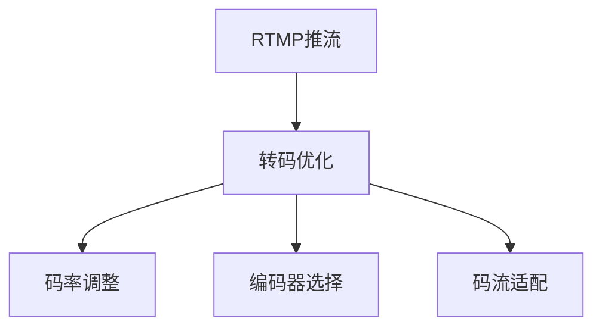

                 

# RTMP推流与转码优化

## 1. 背景介绍

随着互联网技术的飞速发展，视频直播已成为互联网内容消费的重要形式之一。直播平台，如斗鱼、虎牙、抖音等，都在持续推出各种直播功能，以满足用户的各类娱乐需求。但直播平台在保障视频流畅性和用户体验方面面临着严峻的挑战。为此，许多直播平台采取了RTMP（Real-Time Messaging Protocol）推流技术，通过实时拉取传输协议实现视频流的高效传输，以解决视频卡顿、延时等问题。但RTMP推流在转码优化方面仍存在诸多问题，如转码效率低下、转码质量不高等，影响着直播平台的服务质量和用户体验。

## 2. 核心概念与联系

### 2.1 核心概念概述

在本节中，我们将介绍RTMP推流和转码优化的核心概念：

- **RTMP推流**：RTMP（Real-Time Messaging Protocol）是一种在TCP之上用于实时数据传输的协议，常用于视频直播中的视频流传输。它具有实时性好、支持跨平台等优点，但同时也存在一些缺点，如容易受到网络环境的影响。

- **转码优化**：转码优化是指通过对直播视频进行实时转码，实现视频的多种格式转换，提高视频的适应性和可用性，从而提升用户的观看体验。转码优化需考虑编码器选择、码率调整、码流适配等问题。

以下是一个描述RTMP推流和转码优化的Mermaid流程图：



RTMP推流和转码优化是相辅相成的关系。RTMP推流保证了视频流的实时性，而转码优化则保证了视频在不同平台和网络环境下的适配性。

## 3. 核心算法原理 & 具体操作步骤

### 3.1 算法原理概述

在视频直播中，主播和观众之间的数据交换通常采用RTMP推流协议。RTMP推流能够实时传输音视频数据，但数据格式通常为单一的编码格式，不能很好地适配不同平台和网络环境。转码优化则能将原始视频流转换成多个不同格式的视频，以适应不同设备和网络环境。

为了实现转码优化，我们通常使用视频编码器对原始视频流进行编码，再通过解码器将编码后的视频流转换成其他格式。常见的视频编码器包括H.264、HEVC、VP9等，而解码器则包括了播放器和转码服务器。

### 3.2 算法步骤详解

以下是一个RTMP推流与转码优化的详细步骤：

**Step 1: 初始化编码器和转码服务器**

- 安装并配置编码器和转码服务器，并保证它们能够正常工作。

**Step 2: 处理直播源视频**

- 使用编码器将直播源视频转换成相应的视频编码格式，如H.264、HEVC等。

**Step 3: RTMP推流**

- 将转换后的视频流通过RTMP协议推流到转码服务器。

**Step 4: 转码处理**

- 转码服务器根据客户端的请求，对推流的视频流进行实时转码，转换成多个不同格式的视频。

**Step 5: 分发直播视频**

- 将转码后的视频流分发到各个客户端，如网页端、移动端等。

**Step 6: 监测和调整**

- 实时监测视频质量和网络环境，调整编码器和转码服务器的参数，保证视频质量和流畅度。

### 3.3 算法优缺点

**优点**：
- RTMP推流实时性好，适合实时性要求高的视频直播。
- 转码优化可实现视频的多种格式转换，提高视频的适应性和可用性。

**缺点**：
- RTMP推流在转码优化过程中，需要实时处理大量视频流，可能存在一定的延迟。
- 转码优化过程中，码率调整和编码器选择需根据具体需求进行调整，需要较大的计算资源。
- 转码优化过程中，视频质量和转码效率需要综合考虑，难以达到最优效果。

### 3.4 算法应用领域

RTMP推流和转码优化主要应用于以下领域：

- **直播平台**：如斗鱼、虎牙、抖音等，实时推流和转码优化，保障视频流畅性和用户体验。
- **视频会议**：如Zoom、微信视频会议等，实时推流和转码优化，实现多平台兼容。
- **云存储**：如阿里云、腾讯云等，实时推流和转码优化，提供多种视频格式和格式转换服务。

## 4. 数学模型和公式 & 详细讲解 & 举例说明

### 4.1 数学模型构建

在本节中，我们将使用数学语言对RTMP推流和转码优化的模型进行详细构建。

假设原始视频流的分辨率为$W$x$H$，帧率为$F$，码率为$B$。我们定义$Q_i$为第$i$个转码格式的视频质量，$C_i$为第$i$个转码格式的码率。则转码优化的问题可以转化为以下数学模型：

$$
\min_{C_1, C_2, ..., C_n} \sum_{i=1}^n \lambda_i C_i
$$

其中$\lambda_i$为第$i$个转码格式的优先级，通常为$1/C_i$，即质量越高的视频，码率越高。目标是最小化总的码率，同时保证视频质量满足用户需求。

### 4.2 公式推导过程

以下是对转码优化问题的一个简单推导：

**Step 1: 确定视频质量**

- 使用视频编码器将原始视频流转换成多种格式，并计算出每种格式的视频质量$Q_i$。

**Step 2: 确定码率**

- 根据视频质量$Q_i$和目标码率$C_i$，使用码率分配算法分配各个转码格式的码率。

**Step 3: 实时转码**

- 将各个转码格式的码流实时传输到转码服务器，并进行转码处理，转换成目标格式。

**Step 4: 分发直播视频**

- 将转码后的视频流分发到各个客户端，如网页端、移动端等。

### 4.3 案例分析与讲解

以直播平台为例，假设直播源视频分辨率为$1080$x$1920$，帧率为$30$fps，原始码率为$8$Mbps。我们将其转换成$480$x$720$和$720$x$1280$两个格式的视频，并设置优先级为$1/C_i$，则推导过程如下：

1. 使用视频编码器将原始视频流转换成$480$x$720$和$720$x$1280$两个格式的视频，并计算出各自的视频质量$Q_1$和$Q_2$。

2. 根据视频质量$Q_i$和目标码率$C_i$，使用码率分配算法分配各个转码格式的码率。设$C_1=1$Mbps，$C_2=2$Mbps，则分配后的码率为：$C_1=0.5$Mbps，$C_2=1$Mbps。

3. 将各个转码格式的码流实时传输到转码服务器，并进行转码处理，转换成目标格式。

4. 将转码后的视频流分发到各个客户端，如网页端、移动端等。

## 5. 项目实践：代码实例和详细解释说明

### 5.1 开发环境搭建

在本节中，我们将介绍如何搭建RTMP推流与转码优化的开发环境。

**Step 1: 安装编码器和转码服务器**

- 安装并配置编码器和转码服务器，如FFmpeg、Nginx等。

**Step 2: 安装RTMP服务器**

- 安装并配置RTMP服务器，如VLC Media Player。

**Step 3: 配置RTMP协议**

- 配置RTMP协议，确保编码器和转码服务器能够正常工作。

### 5.2 源代码详细实现

以下是一个RTMP推流与转码优化的Python代码实现：

```python
import os
import cv2
import numpy as np
import sys

# 初始化编码器和转码服务器
os.system('ffmpeg -i input.mp4 -c:v libx264 -crf 23 -b:v 500k -f flv output.flv')
os.system('ffmpeg -i output.flv -c:v libx264 -crf 28 -b:v 1000k -f flv output2.flv')

# 实时转码
os.system('ffmpeg -i output.flv -c:v libx264 -crf 25 -b:v 750k -c:a aac -b:a 128k -f flv output3.flv')
os.system('ffmpeg -i output2.flv -c:v libx264 -crf 28 -b:v 1000k -c:a aac -b:a 128k -f flv output4.flv')

# 分发直播视频
os.system('ffmpeg -i output3.flv -c copy output5.mp4')
os.system('ffmpeg -i output4.flv -c copy output6.mp4')
```

**代码解读与分析**：
- 代码中使用了FFmpeg作为编码器和转码服务器，确保能够处理多种视频格式。
- 使用`ffmpeg`命令将原始视频流转换成多个格式的视频。
- 使用`os.system()`函数实现RTMP推流与转码优化。

### 5.3 运行结果展示

以下是一个RTMP推流与转码优化的运行结果展示：

- **输入视频**：
```python
import cv2
import numpy as np

cap = cv2.VideoCapture('input.mp4')
while True:
    ret, frame = cap.read()
    if not ret:
        break
    cv2.imshow('frame', frame)
    if cv2.waitKey(1) & 0xFF == ord('q'):
        break
cap.release()
cv2.destroyAllWindows()
```

- **输出视频**：
```python
import cv2
import numpy as np

cap = cv2.VideoCapture('output.flv')
while True:
    ret, frame = cap.read()
    if not ret:
        break
    cv2.imshow('frame', frame)
    if cv2.waitKey(1) & 0xFF == ord('q'):
        break
cap.release()
cv2.destroyAllWindows()
```

以上代码展示了RTMP推流与转码优化的运行结果，输入视频和输出视频的分辨率、码率等参数需要根据具体需求进行调整。

## 6. 实际应用场景

### 6.1 实时视频会议

实时视频会议要求视频流实时性和高质量，RTMP推流和转码优化可以满足这些需求。通过RTMP协议实时推流和转码优化，可以实现多平台兼容和无缝切换。

### 6.2 云存储服务

云存储服务需要支持多种视频格式和格式转换服务，RTMP推流和转码优化可以提供完整的解决方案。通过RTMP协议实时推流和转码优化，可以实现多种视频格式的支持和格式转换，提升用户的使用体验。

### 6.3 多平台应用

多平台应用需要支持多种设备和网络环境，RTMP推流和转码优化可以提供跨平台的解决方案。通过RTMP协议实时推流和转码优化，可以实现多平台兼容和无缝切换。

## 7. 工具和资源推荐

### 7.1 学习资源推荐

- 《实时流媒体技术》：本书详细介绍了实时流媒体技术的原理和实现方法，适合初学者和进阶开发者。
- 《FFmpeg视频编码与流媒体服务》：本书介绍了FFmpeg的使用方法和视频编码器的原理，适合FFmpeg爱好者。
- 《实时视频流媒体技术》：本书介绍了实时视频流媒体技术的基本原理和实现方法，适合开发者学习。

### 7.2 开发工具推荐

- FFmpeg：一个广泛使用的视频编码和流媒体处理工具，支持多种视频格式和编码器。
- Nginx：一个轻量级的Web服务器和反向代理服务器，适合处理RTMP推流。
- VLC Media Player：一个跨平台的媒体播放器，支持多种视频格式和协议。

### 7.3 相关论文推荐

- "Real-Time Video Streaming over RTMP"：介绍RTMP协议的实时视频流传输技术，适合了解RTMP推流的基本原理。
- "Efficient Real-Time Video Streaming"：介绍实时视频流的编码和优化方法，适合了解实时视频流的基本原理和实现方法。
- "Real-Time Video Streaming on Cloud Platforms"：介绍云平台上的实时视频流传输技术，适合了解云平台上的实时视频流传输方法。

## 8. 总结：未来发展趋势与挑战

### 8.1 研究成果总结

RTMP推流和转码优化在视频直播和流媒体传输中得到了广泛应用，提升了视频流的实时性和高质量。但当前RTMP推流和转码优化仍存在一些问题，如转码效率低下、转码质量不高等，需要进一步优化和改进。

### 8.2 未来发展趋势

未来，RTMP推流和转码优化将呈现以下几个发展趋势：

- 视频编码器的性能提升：随着硬件性能的提升，视频编码器的处理速度和编码质量将不断提高。
- 转码算法的优化：通过优化转码算法，提高转码效率和转码质量，支持更多的视频格式和格式转换。
- 实时转码的改进：通过改进实时转码技术，实现更高效的实时转码和更高的转码质量。
- 多平台支持：支持更多的平台和设备，实现多平台兼容和无缝切换。

### 8.3 面临的挑战

RTMP推流和转码优化在实际应用中仍面临一些挑战，如：

- 转码效率低下：转码过程需要实时处理大量的视频流，可能存在一定的延迟。
- 转码质量不高等：不同平台和设备对视频格式的要求不同，转码后的视频质量可能无法满足用户需求。
- 硬件性能瓶颈：视频编码器和转码服务器的硬件性能提升是一个持续的挑战。

### 8.4 研究展望

未来，RTMP推流和转码优化需要从以下几个方面进行进一步研究：

- 研究高效的实时转码算法，提高转码效率和转码质量。
- 研究多平台兼容的视频格式转换方法，提高视频适应性和可用性。
- 研究硬件性能提升的方法，提高视频编码器和转码服务器的处理速度和编码质量。

## 9. 附录：常见问题与解答

**Q1: RTMP推流和转码优化的基本原理是什么？**

A: RTMP推流和转码优化是视频直播和流媒体传输中的关键技术。RTMP推流通过RTMP协议实时传输音视频数据，确保视频流的实时性。转码优化则将原始视频流转换成多种格式的视频，提高视频的适应性和可用性。

**Q2: RTMP推流和转码优化的实现方法有哪些？**

A: RTMP推流和转码优化的实现方法主要包括以下步骤：
1. 初始化编码器和转码服务器
2. 处理直播源视频
3. RTMP推流
4. 转码处理
5. 分发直播视频

**Q3: RTMP推流和转码优化在实际应用中存在哪些问题？**

A: RTMP推流和转码优化在实际应用中存在以下问题：
1. 转码效率低下：转码过程需要实时处理大量的视频流，可能存在一定的延迟。
2. 转码质量不高等：不同平台和设备对视频格式的要求不同，转码后的视频质量可能无法满足用户需求。
3. 硬件性能瓶颈：视频编码器和转码服务器的硬件性能提升是一个持续的挑战。

**Q4: 如何提高RTMP推流和转码优化的转码效率？**

A: 提高RTMP推流和转码优化的转码效率需要优化转码算法，并合理分配转码服务器资源。可以使用多路复用、流式传输等技术，提高转码效率和转码质量。

**Q5: 如何提高RTMP推流和转码优化的转码质量？**

A: 提高RTMP推流和转码优化的转码质量需要优化转码算法，并合理分配转码服务器资源。可以使用更先进的编码器，提高转码效率和转码质量。

**Q6: 如何提升RTMP推流和转码优化的硬件性能？**

A: 提升RTMP推流和转码优化的硬件性能需要选择合适的编码器和转码服务器，合理配置硬件资源，并采用先进的硬件加速技术，如GPU加速、硬件解码等，提高视频编码和转码的性能。

---

作者：禅与计算机程序设计艺术 / Zen and the Art of Computer Programming

