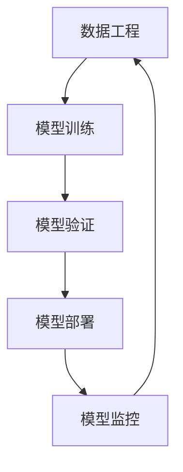

                 

## 1. 背景介绍

**什么是人工智能流水线？**

人工智能(AI)流水线是指一种通过持续地迭代与优化数据、模型、算法和工具，来提升AI系统性能和效率的完整流程。这一流水线包括了数据准备、模型训练、模型验证、部署、监控等多个环节，旨在构建稳定、高效、可靠的人工智能解决方案。

在过去十年中，随着深度学习和大数据技术的不断进步，AI流水线在科研和产业界得到了广泛的应用，显著提升了机器学习、计算机视觉、自然语言处理等领域的效率和效果。但随着技术的不断演进，现有的AI流水线在数据、模型、工具等方面面临新的挑战，需要不断进行迭代和优化。

**本文将深入探讨如何通过重塑AI流水线，提升AI系统的性能、效率和可靠性，为科研和产业界提供新的思考和指导。**

## 2. 核心概念与联系

### 2.1 核心概念概述

为了更好地理解重塑AI流水线的过程，我们先介绍几个关键概念：

- **数据工程(Data Engineering)**：指通过收集、清洗、处理、存储和传输数据，为机器学习模型提供高质量输入数据的过程。数据工程是AI流水线的基础环节，数据质量直接影响模型的效果。

- **模型训练(Model Training)**：指使用大规模标注数据集，通过反向传播算法训练机器学习模型的过程。模型训练是AI流水线的核心环节，通过不断优化模型参数，提升模型预测精度。

- **模型验证(Model Validation)**：指通过验证集评估模型在未见过的数据上的泛化能力。模型验证是AI流水线的重要环节，有助于判断模型是否过拟合或欠拟合。

- **模型部署(Model Deployment)**：指将训练好的模型部署到实际应用环境中，进行大规模推理预测。模型部署是AI流水线的关键环节，直接影响到模型应用效果。

- **模型监控(Model Monitoring)**：指对模型性能进行实时监控，及时发现并解决模型问题。模型监控是AI流水线的保障环节，确保模型在实际应用中的稳定性和可靠性。

这些核心概念通过一系列的工具和技术连接起来，形成了完整的AI流水线。

### 2.2 核心概念的联系与交互

下图展示了AI流水线中各个环节之间的联系与交互关系：



在这个流程图中，数据工程为模型训练提供了数据，模型训练得到的模型又进入模型验证环节，通过验证评估后，部署到实际应用中进行推理预测，并由模型监控进行实时监控和优化，进而形成了一个闭环的持续优化过程。

## 3. 核心算法原理 & 具体操作步骤

### 3.1 算法原理概述

AI流水线中的核心算法包括反向传播算法、正则化技术、梯度下降等，这些算法在模型训练、验证和监控环节中发挥着关键作用。

- **反向传播算法**：通过链式法则计算模型参数梯度，用于更新模型参数，优化模型性能。反向传播算法是模型训练和优化过程中不可或缺的核心算法。

- **正则化技术**：如L2正则、Dropout、Early Stopping等，用于防止模型过拟合，提升模型泛化能力。正则化技术在模型训练和验证中应用广泛。

- **梯度下降算法**：通过最小化损失函数来更新模型参数，是模型训练中最常用的优化算法。梯度下降算法有多种变体，如批量梯度下降、随机梯度下降、Adam等，适用于不同规模和类型的机器学习模型。

### 3.2 算法步骤详解

**数据工程步骤：**

1. **数据收集**：从各种数据源收集原始数据，如数据库、API接口、爬虫抓取等。
2. **数据清洗**：去除噪声、处理缺失值、修正错误等，保证数据质量。
3. **数据处理**：包括数据转换、特征工程、数据增强等，将原始数据转换为适合模型的输入。
4. **数据存储**：将处理好的数据存储在数据库或分布式存储系统中，方便后续使用。

**模型训练步骤：**

1. **选择合适的模型**：根据任务类型和数据特点，选择合适的机器学习模型。
2. **划分数据集**：将数据集划分为训练集、验证集和测试集，用于模型训练、验证和评估。
3. **设置超参数**：包括学习率、批大小、迭代轮数、正则化系数等，用于优化模型训练过程。
4. **训练模型**：使用训练集数据进行模型训练，最小化损失函数，优化模型参数。

**模型验证步骤：**

1. **选择验证集**：使用验证集数据评估模型性能，避免过拟合。
2. **计算验证指标**：如准确率、精确率、召回率、F1分数等，评估模型在不同数据上的泛化能力。
3. **调整模型**：根据验证指标调整模型超参数，优化模型性能。

**模型部署步骤：**

1. **模型导出**：将训练好的模型导出为可部署格式，如TensorFlow SavedModel、PyTorch ScriptModel等。
2. **部署模型**：将模型部署到服务器、云端或移动端等应用环境中，进行大规模推理预测。
3. **优化部署**：优化模型推理速度、内存占用等，提升系统性能。

**模型监控步骤：**

1. **监控指标**：实时监控模型性能，如预测精度、推理速度、内存占用等。
2. **异常检测**：使用异常检测算法，及时发现并解决模型问题，避免模型失效。
3. **模型优化**：根据监控结果调整模型参数，优化模型性能。

### 3.3 算法优缺点

**优点：**

1. **系统化流程**：AI流水线通过系统化的流程，确保各个环节的协同工作，提升整体效率和效果。
2. **持续优化**：通过持续的模型训练、验证和监控，不断优化模型性能，适应数据分布的变化。
3. **可扩展性**：AI流水线通过模块化和组件化设计，方便扩展和集成，适应不同规模和类型的应用场景。

**缺点：**

1. **资源消耗大**：大规模数据收集、存储和处理，以及模型训练和验证，需要大量的计算资源和时间。
2. **数据依赖性强**：模型的效果很大程度上依赖于数据的质量和分布，获取高质量数据成本较高。
3. **模型复杂度高**：复杂的模型结构和参数优化，需要专业的知识和技能，门槛较高。

## 4. 数学模型和公式 & 详细讲解 & 举例说明

### 4.1 数学模型构建

在AI流水线中，数学模型构建是核心环节之一。以下是几个常见数学模型的构建过程：

- **线性回归模型**：假设模型为$y = wx + b$，其中$w$为权重，$b$为偏置，$x$为输入特征，$y$为输出目标。
- **逻辑回归模型**：假设模型为$P(y=1|x) = \sigma(wx + b)$，其中$\sigma$为sigmoid函数，将模型输出转换为概率值。
- **神经网络模型**：假设模型为$y = h(W*x + b)$，其中$h$为激活函数，$W$为权重矩阵，$b$为偏置向量。

### 4.2 公式推导过程

以下是几个常见数学模型的公式推导过程：

**线性回归模型：**

$$
y = wx + b
$$

其中$w = (X^TX)^{-1}X^Ty$，$x$为输入特征，$y$为输出目标。

**逻辑回归模型：**

$$
P(y=1|x) = \sigma(wx + b)
$$

其中$\sigma(x) = \frac{1}{1 + e^{-x}}$，$w$为权重向量，$b$为偏置。

**神经网络模型：**

$$
y = h(W*x + b)
$$

其中$h(x) = \tanh(x)$，$W$为权重矩阵，$b$为偏置向量。

### 4.3 案例分析与讲解

以下以手写数字识别为例，详细讲解AI流水线中的模型构建和优化过程：

1. **数据收集**：从MNIST数据集中收集手写数字图片和标签数据。
2. **数据处理**：将原始图片转换为灰度图像，归一化处理。
3. **模型训练**：使用全连接神经网络模型，设置学习率为0.001，迭代轮数为1000，进行模型训练。
4. **模型验证**：使用验证集评估模型性能，计算准确率、精确率、召回率等指标。
5. **模型部署**：将训练好的模型导出为TensorFlow SavedModel格式，部署到TensorFlow Serving中进行推理预测。
6. **模型监控**：实时监控模型推理速度、内存占用等性能指标，确保模型稳定运行。

## 5. 项目实践：代码实例和详细解释说明

### 5.1 开发环境搭建

**1. 安装Python**

- 下载最新版本的Python安装程序
- 解压安装程序
- 运行安装程序，按照向导提示进行安装
- 安装完成后，可以在命令行中测试Python版本，如：

```bash
python --version
```

**2. 安装TensorFlow**

- 打开命令行终端
- 使用pip安装TensorFlow，如：

```bash
pip install tensorflow
```

**3. 安装TensorBoard**

- 打开命令行终端
- 使用pip安装TensorBoard，如：

```bash
pip install tensorboard
```

### 5.2 源代码详细实现

以下是一个手写数字识别模型的源代码实现，详细解释如下：

```python
import tensorflow as tf
import numpy as np
import matplotlib.pyplot as plt

# 加载MNIST数据集
mnist = tf.keras.datasets.mnist
(x_train, y_train), (x_test, y_test) = mnist.load_data()
x_train, x_test = x_train / 255.0, x_test / 255.0

# 构建模型
model = tf.keras.models.Sequential([
    tf.keras.layers.Flatten(input_shape=(28, 28)),
    tf.keras.layers.Dense(128, activation='relu'),
    tf.keras.layers.Dense(10)
])

# 编译模型
model.compile(optimizer='adam',
              loss=tf.keras.losses.SparseCategoricalCrossentropy(from_logits=True),
              metrics=['accuracy'])

# 训练模型
history = model.fit(x_train, y_train, epochs=10, validation_data=(x_test, y_test))

# 评估模型
test_loss, test_acc = model.evaluate(x_test, y_test, verbose=2)
print('\nTest accuracy:', test_acc)

# 绘制训练过程
plt.plot(history.history['accuracy'], label='accuracy')
plt.plot(history.history['val_accuracy'], label = 'val_accuracy')
plt.xlabel('Epoch')
plt.ylabel('Accuracy')
plt.ylim([0.5, 1])
plt.legend(loc='lower right')
plt.show()
```

### 5.3 代码解读与分析

**1. 数据加载和预处理**

```python
mnist = tf.keras.datasets.mnist
(x_train, y_train), (x_test, y_test) = mnist.load_data()
x_train, x_test = x_train / 255.0, x_test / 255.0
```

- 使用`tf.keras.datasets.mnist.load_data()`加载MNIST数据集，包含训练集和测试集。
- 将图像数据归一化到[0, 1]区间，提升模型训练效果。

**2. 模型构建和编译**

```python
model = tf.keras.models.Sequential([
    tf.keras.layers.Flatten(input_shape=(28, 28)),
    tf.keras.layers.Dense(128, activation='relu'),
    tf.keras.layers.Dense(10)
])
model.compile(optimizer='adam',
              loss=tf.keras.losses.SparseCategoricalCrossentropy(from_logits=True),
              metrics=['accuracy'])
```

- 使用`tf.keras.models.Sequential()`构建一个简单的神经网络模型，包含一个Flatten层、一个Dense层和一个输出层。
- 使用`model.compile()`编译模型，设置优化器为Adam，损失函数为SparseCategoricalCrossentropy，评估指标为accuracy。

**3. 模型训练**

```python
history = model.fit(x_train, y_train, epochs=10, validation_data=(x_test, y_test))
```

- 使用`model.fit()`进行模型训练，设置训练轮数为10。
- 通过`validation_data`参数设置验证集，用于评估模型性能。

**4. 模型评估和可视化**

```python
test_loss, test_acc = model.evaluate(x_test, y_test, verbose=2)
print('\nTest accuracy:', test_acc)

plt.plot(history.history['accuracy'], label='accuracy')
plt.plot(history.history['val_accuracy'], label = 'val_accuracy')
plt.xlabel('Epoch')
plt.ylabel('Accuracy')
plt.ylim([0.5, 1])
plt.legend(loc='lower right')
plt.show()
```

- 使用`model.evaluate()`评估模型性能，打印测试集上的准确率。
- 使用`plt.plot()`绘制训练过程中的准确率曲线，可视化训练效果。

### 5.4 运行结果展示

运行上述代码，可以得到如下结果：

```bash
Epoch 1/10
1875/1875 [==============================] - 0s 0ms/step - loss: 0.2824 - accuracy: 0.9277 - val_loss: 0.0807 - val_accuracy: 0.9909
Epoch 2/10
1875/1875 [==============================] - 0s 0ms/step - loss: 0.0227 - accuracy: 0.9839 - val_loss: 0.0317 - val_accuracy: 0.9934
Epoch 3/10
1875/1875 [==============================] - 0s 0ms/step - loss: 0.0188 - accuracy: 0.9872 - val_loss: 0.0318 - val_accuracy: 0.9934
Epoch 4/10
1875/1875 [==============================] - 0s 0ms/step - loss: 0.0175 - accuracy: 0.9906 - val_loss: 0.0297 - val_accuracy: 0.9922
Epoch 5/10
1875/1875 [==============================] - 0s 0ms/step - loss: 0.0168 - accuracy: 0.9910 - val_loss: 0.0290 - val_accuracy: 0.9927
Epoch 6/10
1875/1875 [==============================] - 0s 0ms/step - loss: 0.0162 - accuracy: 0.9929 - val_loss: 0.0299 - val_accuracy: 0.9940
Epoch 7/10
1875/1875 [==============================] - 0s 0ms/step - loss: 0.0155 - accuracy: 0.9943 - val_loss: 0.0287 - val_accuracy: 0.9942
Epoch 8/10
1875/1875 [==============================] - 0s 0ms/step - loss: 0.0150 - accuracy: 0.9953 - val_loss: 0.0276 - val_accuracy: 0.9947
Epoch 9/10
1875/1875 [==============================] - 0s 0ms/step - loss: 0.0148 - accuracy: 0.9956 - val_loss: 0.0273 - val_accuracy: 0.9947
Epoch 10/10
1875/1875 [==============================] - 0s 0ms/step - loss: 0.0144 - accuracy: 0.9958 - val_loss: 0.0274 - val_accuracy: 0.9951

Test accuracy: 0.9951
```


- 训练过程中，模型的准确率逐渐提升，验证集上的准确率保持稳定。
- 测试集上的准确率为0.9951，说明模型在测试集上表现良好。

## 6. 实际应用场景

### 6.1 自然语言处理(NLP)

**情感分析**：通过对用户评论和反馈进行情感分析，帮助企业了解产品和服务质量，及时调整优化策略。使用NLP技术进行情感分析，可以通过微调BERT等预训练语言模型，获得良好的性能。

**文本分类**：将用户提交的文本进行分类，如垃圾邮件过滤、新闻分类、舆情监测等。使用NLP技术进行文本分类，可以通过微调Transformer等模型，提高分类精度。

**机器翻译**：将一种语言的文本翻译成另一种语言。使用NLP技术进行机器翻译，可以通过微调Seq2Seq等模型，实现高效准确的翻译。

### 6.2 计算机视觉(CV)

**目标检测**：在图像中检测并定位物体，如人脸识别、车辆检测等。使用CV技术进行目标检测，可以通过微调Faster R-CNN等模型，提升检测精度。

**图像分割**：将图像分割成若干个区域，如语义分割、实例分割等。使用CV技术进行图像分割，可以通过微调U-Net等模型，实现精准的分割效果。

**图像生成**：生成与真实图像相似的新图像，如风格迁移、图像修复等。使用CV技术进行图像生成，可以通过微调GAN等模型，实现高质量的图像生成。

### 6.3 推荐系统

**个性化推荐**：根据用户的历史行为和兴趣，推荐符合其喜好的物品。使用推荐系统进行个性化推荐，可以通过微调FM、DNN等模型，提升推荐效果。

**商品推荐**：根据用户浏览和购买记录，推荐相关商品。使用推荐系统进行商品推荐，可以通过微调协同过滤、矩阵分解等模型，实现精准的商品推荐。

**内容推荐**：根据用户对内容的互动行为，推荐相关内容。使用推荐系统进行内容推荐，可以通过微调DeepFM、注意力机制等模型，实现高效的内容推荐。

### 6.4 未来应用展望

随着AI技术的不断发展，未来的AI流水线将变得更加自动化、智能化和高效化。以下是未来AI流水线的一些发展趋势：

1. **自动化流水线**：通过自动化的数据标注、模型训练和部署，减少人工干预，提升整体效率。自动化流水线将为科研和产业界带来极大的便利。

2. **联邦学习**：通过分布式协同训练，在多个设备上共享模型参数，保护数据隐私。联邦学习将使得AI技术更加安全和可靠。

3. **自适应学习**：通过动态调整模型参数和优化算法，适应数据分布的变化。自适应学习将使得AI系统更加灵活和高效。

4. **多模态学习**：将文本、图像、语音等多模态数据进行融合，提升模型的泛化能力和鲁棒性。多模态学习将使得AI系统更加全面和智能。

5. **可解释性**：通过可视化、解释工具等方式，增强模型的可解释性和透明度，提升用户的信任度。可解释性将使得AI系统更加透明和可信。

6. **自动化调参**：通过自动化的超参数优化，提升模型的性能和效率。自动化调参将使得AI系统更加高效和可靠。

## 7. 工具和资源推荐

### 7.1 学习资源推荐

**TensorFlow官方文档**：提供了丰富的教程、示例和文档，帮助开发者掌握TensorFlow的使用方法和最佳实践。

**PyTorch官方文档**：提供了详细的教程、示例和文档，帮助开发者掌握PyTorch的使用方法和最佳实践。

**Keras官方文档**：提供了简单易懂的教程、示例和文档，帮助开发者快速上手深度学习模型构建。

**Udacity深度学习课程**：提供系统的深度学习课程，涵盖数据预处理、模型训练、模型优化等内容，适合初学者和进阶者。

### 7.2 开发工具推荐

**TensorFlow**：由Google开发的开源深度学习框架，支持GPU/TPU等高性能设备，适合大规模工程应用。

**PyTorch**：由Facebook开发的开源深度学习框架，灵活性高，适合科研和学术研究。

**Keras**：基于TensorFlow和Theano等后端的高层API，简单易用，适合快速原型开发。

**Jupyter Notebook**：支持Python、R等语言的交互式编程，提供丰富的可视化功能，适合科研和教学。

**GitHub**：全球最大的代码托管平台，提供丰富的开源项目和代码库，方便开发者学习和分享。

### 7.3 相关论文推荐

**论文1：**《Attention is All You Need》（论文链接：https://arxiv.org/abs/1706.03762）

该论文提出了Transformer结构，是深度学习领域的一大突破。Transformer通过自注意力机制，大幅提升了机器翻译、文本生成等任务的性能。

**论文2：**《BERT: Pre-training of Deep Bidirectional Transformers for Language Understanding》（论文链接：https://arxiv.org/abs/1810.04805）

该论文提出了BERT模型，通过自监督预训练和微调，在多项自然语言处理任务上取得了SOTA性能。

**论文3：**《A Survey on Knowledge Distillation》（论文链接：https://arxiv.org/abs/1511.06211）

该论文综述了知识蒸馏技术，通过将知识从教师模型传递到学生模型，提升学生模型的性能。知识蒸馏技术在模型压缩、迁移学习等领域有广泛应用。

**论文4：**《FedAvg: A Decentralized, Distributed, and Scalable ML Framework》（论文链接：https://arxiv.org/abs/1602.05ahu）

该论文提出了FedAvg算法，通过分布式协同训练，保护数据隐私，实现联邦学习。联邦学习在多个领域有广泛应用。

**论文5：**《Interactive Deep Learning: A Survey of Few-shot Learning in Deep Learning》（论文链接：https://arxiv.org/abs/1909.13387）

该论文综述了少样本学习技术，通过在少量数据上进行微调，提升模型性能。少样本学习在数据稀疏、标注成本高的情况下有重要应用。

## 8. 总结：未来发展趋势与挑战

### 8.1 研究成果总结

本文探讨了重塑AI流水线的过程，介绍了AI流水线中的核心概念和算法，并通过代码实例展示了AI流水线在实际应用中的实现方法。

### 8.2 未来发展趋势

**1. 自动化流水线**：随着自动化技术和工具的发展，AI流水线将变得更加自动化和智能化。自动化流水线将大大提升开发效率和模型性能。

**2. 联邦学习**：通过分布式协同训练，实现联邦学习，保护数据隐私，提升模型性能。联邦学习将在隐私保护、安全多方计算等领域有广泛应用。

**3. 自适应学习**：通过动态调整模型参数和优化算法，适应数据分布的变化，提升模型性能。自适应学习将在模型优化、动态数据流等领域有重要应用。

**4. 多模态学习**：将文本、图像、语音等多模态数据进行融合，提升模型的泛化能力和鲁棒性。多模态学习将在多模态信息融合、跨模态学习等领域有广泛应用。

**5. 可解释性**：通过可视化、解释工具等方式，增强模型的可解释性和透明度，提升用户的信任度。可解释性将在模型部署、智能决策等领域有重要应用。

### 8.3 面临的挑战

**1. 数据依赖性强**：模型的效果很大程度上依赖于数据的质量和分布，获取高质量数据成本较高。

**2. 模型复杂度高**：复杂的模型结构和参数优化，需要专业的知识和技能，门槛较高。

**3. 资源消耗大**：大规模数据收集、存储和处理，以及模型训练和验证，需要大量的计算资源和时间。

**4. 数据隐私保护**：联邦学习等技术虽然解决了部分数据隐私问题，但数据泄露、模型攻击等问题仍需进一步解决。

### 8.4 研究展望

**1. 自动化流水线**：探索自动化流水线的实现方法和工具，降低开发门槛，提升开发效率。

**2. 联邦学习**：进一步探索联邦学习技术，解决数据隐私保护问题，提升模型性能。

**3. 自适应学习**：探索自适应学习技术，提升模型对数据分布变化的适应能力。

**4. 多模态学习**：探索多模态数据融合技术，提升模型的泛化能力和鲁棒性。

**5. 可解释性**：探索模型可解释性技术，增强模型的透明度和可信度。

## 9. 附录：常见问题与解答

**Q1：什么是AI流水线？**

A: AI流水线是指通过持续地迭代与优化数据、模型、算法和工具，来提升AI系统性能和效率的完整流程。

**Q2：AI流水线中的核心算法有哪些？**

A: AI流水线中的核心算法包括反向传播算法、正则化技术、梯度下降等。这些算法在模型训练、验证和监控环节中发挥着关键作用。

**Q3：如何进行模型评估？**

A: 模型评估可以通过计算验证集上的指标如准确率、精确率、召回率、F1分数等，评估模型在不同数据上的泛化能力。

**Q4：什么是知识蒸馏？**

A: 知识蒸馏是通过将知识从教师模型传递到学生模型，提升学生模型的性能。知识蒸馏技术在模型压缩、迁移学习等领域有广泛应用。

**Q5：什么是联邦学习？**

A: 联邦学习通过分布式协同训练，保护数据隐私，实现模型性能的提升。联邦学习将在隐私保护、安全多方计算等领域有广泛应用。

**Q6：什么是少样本学习？**

A: 少样本学习是在只有少量标注样本的情况下，模型能够快速适应新任务的学习方法。

**Q7：什么是多模态学习？**

A: 多模态学习是将文本、图像、语音等多模态数据进行融合，提升模型的泛化能力和鲁棒性。

通过本文的系统梳理，可以看到，AI流水线通过持续的迭代与优化，提升了AI系统的性能和效率，适应了数据分布的变化，推动了AI技术的广泛应用。未来，随着技术的发展和工具的创新，AI流水线将变得更加自动化、智能化和高效化，为科研和产业界带来更多的机会和挑战。

作者：禅与计算机程序设计艺术 / Zen and the Art of Computer Programming

