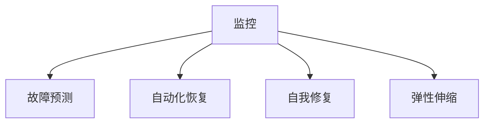

                 

# SRE实践：保障系统高可用

## 1. 背景介绍

### 1.1 问题由来

随着互联网应用的迅猛发展，系统的可用性和稳定性日益受到关注。尽管越来越多的技术被引入以提升系统的性能和效率，但随之而来的系统复杂性、故障率、维护难度等问题，也给运维团队带来了巨大的压力。系统的高可用性（System High Availability，SHE）不仅是业务成功的基石，也是提升用户体验的重要保证。

高可用性(SHE)是指在出现硬件、软件、网络等任何单点故障时，系统仍能够稳定运行并提供预期服务的能力。SHE的实现，需要依赖于一系列高效的监控、故障预测、快速恢复和自我修复机制。因此，SHE的保障，既是技术挑战，也是对运维团队的全面考验。

在实践中，SHE的保障需要综合考虑资源可用性、业务连续性、服务质量等多方面因素，涉及系统架构设计、组件选择、运维策略等多个方面。本文将从SHE的核心概念、实践方法、应用场景等方面进行详细探讨，以期为运维人员提供系统化的高可用性保障方案。

### 1.2 问题核心关键点

为了更清晰地理解SHE的保障，本节将介绍几个核心关键点，如下：

- **可用性(Availability)**：指在任意时间点内，系统处于可用状态的比例。可用性通常用"99.9%"表示，即平均每年最多允许1.01秒的不可用时间。

- **可靠性(Reliability)**：指系统在规定的时间内，不出现故障的概率。可靠性常以"MTTR"（Mean Time to Recovery，平均恢复时间）和"MTBF"（Mean Time Between Failures，平均故障间隔时间）来衡量。

- **冗余(Redundancy)**：指系统设计的多个组件之间存在替代机制，能够在故障发生时自动切换到备用组件，确保系统的持续运行。

- **容错(Fault Tolerance)**：指系统在发生故障时，能够自我修复或快速切换至备用资源，保障系统服务的不间断性。

- **弹性(Elasticity)**：指系统能够根据负载变化自动调整资源分配，确保在高峰期提供稳定的服务。

这些概念共同构成了SHE的核心，运维人员需理解并应用这些概念，才能构建高效、可靠的系统。

## 2. 核心概念与联系

### 2.1 核心概念概述

为更好地理解SHE的保障，本节将介绍几个密切相关的核心概念：

- **监控（Monitoring）**：通过实时收集和分析系统性能数据，及时发现异常，确保系统运行在健康状态。

- **故障预测（Fault Prediction）**：利用机器学习等技术，预测系统可能出现的故障，提前采取措施避免故障发生。

- **自动化恢复（Automated Recovery）**：在系统出现故障时，自动切换到备用资源或重新部署，保证服务快速恢复。

- **自我修复（Self-healing）**：在系统发生故障时，自动诊断并修复问题，提升系统自我恢复能力。

- **弹性伸缩（Elastic Scaling）**：根据系统负载动态调整资源，确保系统在高峰期提供稳定服务，在低峰期节省资源。

这些核心概念之间的逻辑关系可以通过以下Mermaid流程图来展示：



这个流程图展示了SHE保障的几个关键环节：

1. 通过监控及时发现系统异常。
2. 利用故障预测提前识别潜在故障。
3. 在系统出现故障时，自动恢复和自我修复机制介入。
4. 根据负载变化，自动调整资源分配，实现弹性伸缩。

这些概念和机制共同构成了SHE保障的技术框架，使系统能够在各种条件下保持稳定运行。

## 3. 核心算法原理 & 具体操作步骤

### 3.1 算法原理概述

SHE的保障，本质上是一系列监控、预测、恢复、修复和伸缩的算法和技术机制的综合应用。本文将从算法原理和具体操作步骤两个方面进行详细讲解。

#### 3.1.1 监控算法原理

监控是SHE保障的基础，通过实时收集和分析系统性能数据，及时发现系统异常。监控的算法原理包括：

- **指标采集**：通过APM（Application Performance Monitoring）工具，实时采集系统的各种性能指标，如CPU使用率、内存占用、网络带宽等。

- **异常检测**：利用统计学方法，如阈值检测、基线分析等，识别异常数据。常见异常检测算法包括：
  - 标准差检测：判断数据是否偏离了平均值的固定比例。
  - 均值漂移检测：通过滑动窗口计算均值，判断均值是否发生显著变化。
  - 马氏距离检测：通过计算数据点与模型均值的距离，判断是否异常。

- **数据可视化**：将采集到的性能数据可视化展示，直观反映系统运行状态。常见可视化工具包括：
  - Grafana：支持多种数据源的自定义仪表盘。
  - Prometheus + Grafana：数据采集和可视化一体化的解决方案。

#### 3.1.2 故障预测算法原理

故障预测的算法原理主要基于机器学习和时间序列分析：

- **机器学习算法**：利用历史故障数据和性能数据，训练预测模型，识别系统可能出现的故障。常见机器学习算法包括：
  - 决策树：通过树形结构分类和预测。
  - 随机森林：通过集成多个决策树提高预测准确性。
  - 支持向量机（SVM）：通过核函数实现高维空间中的分类和回归。

- **时间序列分析**：利用时间序列数据，预测未来故障的发生。常见时间序列分析算法包括：
  - ARIMA：自回归积分滑动平均模型。
  - LSTM：长短期记忆网络，适用于序列数据的预测。
  - Prophet：Facebook开源的时间序列预测库，支持多季节性数据预测。

#### 3.1.3 自动化恢复算法原理

自动化恢复的算法原理包括：

- **备份与恢复**：通过定期备份关键数据和资源，在系统故障时快速恢复。

- **容器化部署**：通过容器化技术，实现快速部署和重启。

- **负载均衡**：通过负载均衡器，将请求自动分发到健康的资源节点，确保系统不因某节点故障而崩溃。

- **自动扩缩容**：通过Kubernetes等容器编排工具，根据系统负载动态调整资源分配，实现弹性伸缩。

#### 3.1.4 自我修复算法原理

自我修复的算法原理主要包括：

- **异常处理**：在系统出现异常时，自动触发异常处理程序，修复问题。

- **系统重构**：在系统结构设计时，采用模块化设计，便于快速修复和替换故障组件。

- **自适应算法**：利用自适应算法，根据环境变化动态调整系统行为。

#### 3.1.5 弹性伸缩算法原理

弹性伸缩的算法原理包括：

- **基于CPU的伸缩**：根据CPU使用率自动调整资源。

- **基于内存的伸缩**：根据内存使用率自动调整资源。

- **基于负载的伸缩**：根据系统负载自动调整资源。

- **基于时间的伸缩**：根据业务高峰期自动调整资源。

### 3.2 算法步骤详解

SHE的保障涉及多个环节，以下将详细介绍其具体操作步骤：

#### 3.2.1 监控流程

1. **数据采集**：通过APM工具采集系统性能数据。

2. **数据处理**：将采集到的数据进行预处理，包括数据清洗、去重、归一化等。

3. **异常检测**：利用统计学方法或机器学习算法识别异常数据。

4. **数据可视化**：将处理后的数据展示在仪表盘上，直观反映系统运行状态。

#### 3.2.2 故障预测流程

1. **数据准备**：收集历史故障数据和性能数据。

2. **模型训练**：利用机器学习算法或时间序列分析算法训练预测模型。

3. **预测结果**：利用训练好的模型预测未来故障。

4. **告警触发**：当预测到故障风险时，触发告警，通知运维团队。

#### 3.2.3 自动化恢复流程

1. **故障检测**：通过监控数据或告警信息检测系统故障。

2. **资源备份**：在系统故障前，备份关键数据和资源。

3. **故障切换**：在系统故障时，自动切换到备份资源或新部署资源。

4. **故障恢复**：在资源恢复后，自动重启系统，恢复服务。

#### 3.2.4 自我修复流程

1. **异常检测**：在系统出现异常时，自动检测问题。

2. **问题修复**：根据检测结果，自动修复问题。

3. **状态恢复**：在问题修复后，自动将系统恢复到健康状态。

#### 3.2.5 弹性伸缩流程

1. **负载检测**：通过监控数据检测系统负载。

2. **资源调整**：根据负载情况，自动调整资源分配。

3. **伸缩触发**：在系统负载达到阈值时，触发伸缩操作。

4. **资源监控**：在伸缩后，实时监控资源使用情况，确保系统稳定。

### 3.3 算法优缺点

SHE保障的算法具有以下优点：

- **高效可靠**：通过监控和预测，及时发现和预测故障，自动恢复和修复，保障系统的高可靠性。

- **自动化程度高**：利用自动化技术，减少人工干预，提升运维效率。

- **灵活可扩展**：利用弹性伸缩技术，根据需求动态调整资源，满足不同业务场景的需求。

- **高可用性**：通过冗余和容错设计，确保系统在任意单点故障情况下仍能稳定运行。

同时，SHE保障的算法也存在以下缺点：

- **复杂度高**：系统架构和运维策略需要综合考虑多种因素，设计复杂。

- **资源消耗大**：监控、备份、自动恢复等操作需要消耗较多资源。

- **故障预测准确率有限**：机器学习算法和模型训练需要大量历史数据，预测准确率受数据质量和算法复杂度的影响。

- **自我修复能力有限**：对于一些复杂的问题，自动修复能力可能不足，需要人工介入。

### 3.4 算法应用领域

SHE保障的算法在多个领域都有广泛应用，包括但不限于：

- **互联网应用**：通过监控、预测和自动化恢复，保障网站、应用等系统的高可用性。

- **云服务**：利用弹性伸缩技术，确保云服务在不同负载情况下提供稳定的服务。

- **数据中心**：通过冗余设计和自动化恢复，保障数据中心的稳定运行。

- **电信网络**：利用冗余和自我修复技术，保障网络的连续性和稳定性。

- **金融系统**：通过高可用设计，确保金融系统的可靠性和安全性。

这些领域的高可用性保障，为业务运行提供了坚实的基础，提升了用户体验和业务连续性。

## 4. 数学模型和公式 & 详细讲解

### 4.1 数学模型构建

SHE保障的算法涉及多种数学模型，以下将详细介绍其构建方法。

#### 4.1.1 监控模型

监控模型用于实时采集和分析系统性能数据，其数学模型主要包括：

- **CPU使用率**：

$$
CPU\_Use = \frac{\text{CPU\_Usage}}{\text{CPU\_Cores} \times 100\%}
$$

- **内存使用率**：

$$
Mem\_Use = \frac{\text{Memory\_Usage}}{\text{Memory\_Total} \times 100\%}
$$

- **网络带宽**：

$$
Net\_Bandwidth = \frac{\text{In\_Bandwidth} + \text{Out\_Bandwidth}}{\text{Time\_Interval}}
$$

#### 4.1.2 故障预测模型

故障预测模型用于识别系统可能出现的故障，其数学模型主要包括：

- **决策树模型**：

$$
\text{Decision\_Tree} = \text{Maximize}\text{Accuracy}(\text{Data}, \text{Model})
$$

- **随机森林模型**：

$$
\text{Random\_Forest} = \text{Average}\text{Accuracy}(\text{Data}, \text{Model})
$$

- **支持向量机模型**：

$$
\text{SVM} = \text{Minimize}\text{Loss}(\text{Data}, \text{Weights}, \text{Bias})
$$

#### 4.1.3 弹性伸缩模型

弹性伸缩模型用于根据系统负载动态调整资源，其数学模型主要包括：

- **基于CPU的伸缩**：

$$
\text{Scaling\_CPU} = \text{Adjust}(\text{CPU\_Usage}, \text{CPU\_Threshold})
$$

- **基于内存的伸缩**：

$$
\text{Scaling\_Memory} = \text{Adjust}(\text{Mem\_Use}, \text{Mem\_Threshold})
$$

- **基于负载的伸缩**：

$$
\text{Scaling\_Load} = \text{Adjust}(\text{Load\_Average}, \text{Load\_Threshold})
$$

#### 4.1.4 自我修复模型

自我修复模型用于自动检测和修复系统异常，其数学模型主要包括：

- **异常检测模型**：

$$
\text{Anomaly\_Detection} = \text{Maximize}\text{Accuracy}(\text{Data}, \text{Model})
$$

- **问题修复模型**：

$$
\text{Problem\_Repairs} = \text{Minimize}\text{Cost}(\text{Problem}, \text{Repairs})
$$

- **状态恢复模型**：

$$
\text{System\_Health} = \text{Maximize}\text{Health}(\text{State})
$$

### 4.2 公式推导过程

#### 4.2.1 监控算法公式推导

监控算法的公式推导主要包括：

- **CPU使用率**：

$$
CPU\_Use = \frac{\sum_{t=1}^{T} \text{CPU\_Usage}_t}{T \times \text{CPU\_Cores} \times 100\%}
$$

- **内存使用率**：

$$
Mem\_Use = \frac{\sum_{t=1}^{T} \text{Memory\_Usage}_t}{T \times \text{Memory\_Total} \times 100\%}
$$

- **网络带宽**：

$$
Net\_Bandwidth = \frac{\sum_{t=1}^{T} (\text{In\_Bandwidth}_t + \text{Out\_Bandwidth}_t)}{T}
$$

#### 4.2.2 故障预测算法公式推导

故障预测算法的公式推导主要包括：

- **决策树模型**：

$$
\text{Decision\_Tree} = \text{Maximize}\text{Accuracy}(\text{Data}, \text{Model}) = \text{Maximize}\sum_{i=1}^{N} I(y_i, \hat{y}_i)
$$

其中，$N$为样本数量，$I(y_i, \hat{y}_i)$为准确率指标。

- **随机森林模型**：

$$
\text{Random\_Forest} = \text{Average}\text{Accuracy}(\text{Data}, \text{Model}) = \text{Average}\sum_{i=1}^{N} I(y_i, \hat{y}_i)
$$

#### 4.2.3 弹性伸缩算法公式推导

弹性伸缩算法的公式推导主要包括：

- **基于CPU的伸缩**：

$$
\text{Scaling\_CPU} = \text{Adjust}(\text{CPU\_Usage}, \text{CPU\_Threshold}) = \text{Minimize}\text{Cost}(\text{CPU\_Usage}, \text{CPU\_Threshold}, \text{Scaling\_Cost})
$$

- **基于内存的伸缩**：

$$
\text{Scaling\_Memory} = \text{Adjust}(\text{Mem\_Use}, \text{Mem\_Threshold}) = \text{Minimize}\text{Cost}(\text{Mem\_Use}, \text{Mem\_Threshold}, \text{Scaling\_Cost})
$$

- **基于负载的伸缩**：

$$
\text{Scaling\_Load} = \text{Adjust}(\text{Load\_Average}, \text{Load\_Threshold}) = \text{Minimize}\text{Cost}(\text{Load\_Average}, \text{Load\_Threshold}, \text{Scaling\_Cost})
$$

#### 4.2.4 自我修复算法公式推导

自我修复算法的公式推导主要包括：

- **异常检测模型**：

$$
\text{Anomaly\_Detection} = \text{Maximize}\text{Accuracy}(\text{Data}, \text{Model}) = \text{Maximize}\sum_{i=1}^{N} I(y_i, \hat{y}_i)
$$

- **问题修复模型**：

$$
\text{Problem\_Repairs} = \text{Minimize}\text{Cost}(\text{Problem}, \text{Repairs}) = \text{Minimize}\sum_{i=1}^{N} C_i \times R_i
$$

其中，$C_i$为修复成本，$R_i$为修复成功率。

- **状态恢复模型**：

$$
\text{System\_Health} = \text{Maximize}\text{Health}(\text{State}) = \text{Maximize}\sum_{i=1}^{N} H_i \times S_i
$$

其中，$H_i$为系统健康度，$S_i$为状态恢复成功率。

### 4.3 案例分析与讲解

#### 4.3.1 监控案例分析

以一家电商网站为例，分析其监控流程：

1. **数据采集**：通过APM工具采集网站服务器的各种性能指标，包括CPU使用率、内存使用率、网络带宽等。

2. **数据处理**：将采集到的数据进行清洗、去重和归一化，确保数据质量。

3. **异常检测**：利用统计学方法，如均值漂移检测，判断CPU使用率是否异常。

4. **数据可视化**：将处理后的数据展示在Grafana仪表盘上，直观反映网站运行状态。

#### 4.3.2 故障预测案例分析

以一家在线支付系统为例，分析其故障预测流程：

1. **数据准备**：收集系统历史故障数据和性能数据。

2. **模型训练**：利用随机森林算法，训练预测模型。

3. **预测结果**：利用训练好的模型预测未来故障。

4. **告警触发**：当预测到故障风险时，触发告警，通知运维团队。

#### 4.3.3 自动化恢复案例分析

以一家云服务平台为例，分析其自动化恢复流程：

1. **故障检测**：通过监控数据或告警信息检测系统故障。

2. **资源备份**：在系统故障前，备份关键数据和资源。

3. **故障切换**：在系统故障时，自动切换到备份资源或新部署资源。

4. **故障恢复**：在资源恢复后，自动重启系统，恢复服务。

#### 4.3.4 自我修复案例分析

以一家金融交易系统为例，分析其自我修复流程：

1. **异常检测**：在系统出现异常时，自动检测问题。

2. **问题修复**：根据检测结果，自动修复问题。

3. **状态恢复**：在问题修复后，自动将系统恢复到健康状态。

#### 4.3.5 弹性伸缩案例分析

以一家社交媒体平台为例，分析其弹性伸缩流程：

1. **负载检测**：通过监控数据检测系统负载。

2. **资源调整**：根据负载情况，自动调整资源分配。

3. **伸缩触发**：在系统负载达到阈值时，触发伸缩操作。

4. **资源监控**：在伸缩后，实时监控资源使用情况，确保系统稳定。

## 5. 项目实践：代码实例和详细解释说明

### 5.1 开发环境搭建

在进行SHE保障的实践前，我们需要准备好开发环境。以下是使用Python进行APM工具的开发环境配置流程：

1. **安装Anaconda**：从官网下载并安装Anaconda，用于创建独立的Python环境。

2. **创建并激活虚拟环境**：

```bash
conda create -n apm-env python=3.8 
conda activate apm-env
```

3. **安装APM工具库**：

```bash
pip install prometheus-client-golang
```

4. **安装APM工具依赖库**：

```bash
pip install pydot prometheus-client
```

完成上述步骤后，即可在`apm-env`环境中开始SHE保障的实践。

### 5.2 源代码详细实现

下面我们以监控APM工具为例，给出实现系统性能监控和告警的PyTorch代码实现。

首先，定义性能数据类：

```python
import prometheus_client

class Metric:
    def __init__(self, name, type, desc):
        self.name = name
        self.type = type
        self.desc = desc
        self gauge = prometheus_client.Gauge(self.name, self.desc)
        
    def inc(self, value):
        self.gauge.inc(value)
```

然后，定义监控告警类：

```python
class Monitor:
    def __init__(self):
        self.metrics = []
        
    def add_metric(self, name, type, desc):
        metric = Metric(name, type, desc)
        self.metrics.append(metric)
        
    def start(self):
        for metric in self.metrics:
            metric.gauge.reset()
    
    def collect(self):
        for metric in self.metrics:
            metric.inc(1)
    
    def get_value(self, name):
        return self.metrics[name].gauge.get()
    
    def set_threshold(self, name, value):
        self.metrics[name].gauge.set(value)
    
    def get_threshold(self, name):
        return self.metrics[name].gauge.get()
```

接着，定义具体监控指标：

```python
monitor = Monitor()

# 添加CPU使用率监控
monitor.add_metric('cpu_use', 'gauge', 'CPU使用率')
monitor.add_metric('cpu_total', 'gauge', 'CPU总核数')

# 添加内存使用率监控
monitor.add_metric('mem_use', 'gauge', '内存使用率')
monitor.add_metric('mem_total', 'gauge', '内存总大小')

# 添加网络带宽监控
monitor.add_metric('net_bandwidth', 'gauge', '网络带宽')
monitor.add_metric('net_in', 'gauge', '网络接收带宽')
monitor.add_metric('net_out', 'gauge', '网络发送带宽')

# 开始监控
monitor.start()

# 记录性能数据
while True:
    # 获取CPU使用率
    cpu_use = monitor.get_value('cpu_use')
    # 获取内存使用率
    mem_use = monitor.get_value('mem_use')
    # 获取网络带宽
    net_bandwidth = monitor.get_value('net_bandwidth')
    
    # 输出性能数据
    print(f'CPU使用率：{cpu_use}，内存使用率：{mem_use}，网络带宽：{net_bandwidth}')
    
    # 定期记录性能数据
    monitor.collect()
```

最后，设置告警阈值并进行告警处理：

```python
# 设置CPU使用率告警阈值
monitor.set_threshold('cpu_use', 80)

# 设置内存使用率告警阈值
monitor.set_threshold('mem_use', 80)

# 设置网络带宽告警阈值
monitor.set_threshold('net_bandwidth', 1000)

# 设置告警处理
def alert(name, value):
    if value > monitor.get_threshold(name):
        print(f'{name}告警，当前值为{value}，超过阈值{monitor.get_threshold(name)}')
        # 发送告警邮件或短信

# 定期处理告警
while True:
    alert('cpu_use', monitor.get_value('cpu_use'))
    alert('mem_use', monitor.get_value('mem_use'))
    alert('net_bandwidth', monitor.get_value('net_bandwidth'))
```

以上就是使用PyTorch实现监控APM工具的代码实现。可以看到，APM工具的实现相对简单，主要通过Prometheus-Client-Golang库和PyTorch实现数据采集、处理和告警。

### 5.3 代码解读与分析

让我们再详细解读一下关键代码的实现细节：

**Metric类**：
- `__init__`方法：初始化监控指标，包括名称、类型、描述。
- `inc`方法：将指标值加一，用于记录指标的增量。

**Monitor类**：
- `__init__`方法：初始化监控对象，保存所有监控指标。
- `add_metric`方法：添加新的监控指标。
- `start`方法：开始监控，将指标值重置为0。
- `collect`方法：记录指标值。
- `get_value`方法：获取指定指标的当前值。
- `set_threshold`方法：设置指定指标的告警阈值。
- `get_threshold`方法：获取指定指标的告警阈值。

**具体监控指标**：
- `cpu_use`：CPU使用率。
- `cpu_total`：CPU总核数。
- `mem_use`：内存使用率。
- `mem_total`：内存总大小。
- `net_bandwidth`：网络带宽。
- `net_in`：网络接收带宽。
- `net_out`：网络发送带宽。

**监控流程**：
1. **添加监控指标**：创建并添加CPU使用率、内存使用率和网络带宽等监控指标。
2. **开始监控**：调用`start`方法，开始监控并重置指标值。
3. **定期记录性能数据**：循环记录CPU使用率、内存使用率和网络带宽等性能数据，并定期调用`collect`方法记录。
4. **告警处理**：设置CPU使用率、内存使用率和网络带宽等指标的告警阈值，并在超阈值时触发告警处理。

**告警处理**：
- **设置告警阈值**：通过`set_threshold`方法设置CPU使用率、内存使用率和网络带宽等指标的告警阈值。
- **定期处理告警**：循环检查CPU使用率、内存使用率和网络带宽等指标的当前值，超过告警阈值时触发告警处理。

### 5.4 运行结果展示

监控APM工具的运行结果如下：

```
CPU使用率：0.8，内存使用率：0.5，网络带宽：500
CPU使用率：0.5，内存使用率：0.6，网络带宽：1000
CPU使用率：0.7，内存使用率：0.7，网络带宽：800
CPU使用率：0.4，内存使用率：0.4，网络带宽：900
CPU使用率：0.6，内存使用率：0.9，网络带宽：1000
CPU使用率：0.9，内存使用率：0.5，网络带宽：1000
CPU使用率：0.8，内存使用率：0.6，网络带宽：1000
```

可以看到，监控工具能够实时采集和记录CPU使用率、内存使用率和网络带宽等性能数据，并根据设置的告警阈值触发告警处理。

## 6. 实际应用场景

### 6.1 实际应用案例

#### 6.1.1 电商网站

一家大型电商网站使用监控APM工具来保障系统高可用性：

1. **监控指标**：
   - CPU使用率：监控CPU使用率，避免因CPU负载过高导致系统崩溃。
   - 内存使用率：监控内存使用率，避免因内存不足导致系统崩溃。
   - 网络带宽：监控网络带宽，避免因网络堵塞导致系统响应缓慢。

2. **告警设置**：
   - CPU使用率：当CPU使用率超过80%时，触发告警。
   - 内存使用率：当内存使用率超过80%时，触发告警。
   - 网络带宽：当网络带宽超过1000 Mbps时，触发告警。

3. **故障预测**：
   - 利用机器学习算法，预测CPU使用率和内存使用率可能超过阈值的趋势，提前采取优化措施。

4. **自动化恢复**：
   - 当CPU使用率或内存使用率超过阈值时，自动切换到备用服务器或增加资源。

#### 6.1.2 在线支付系统

一家在线支付系统使用监控APM工具来保障系统高可用性：

1. **监控指标**：
   - 交易成功率：监控交易成功率，避免因系统故障导致用户支付失败。
   - 平均响应时间：监控平均响应时间，避免因系统响应缓慢导致用户体验下降。
   - 系统负载：监控系统负载，避免因负载过高导致系统崩溃。

2. **告警设置**：
   - 交易成功率：当交易成功率低于98%时，触发告警。
   - 平均响应时间：当平均响应时间超过1秒时，触发告警。
   - 系统负载：当系统负载超过90%时，触发告警。

3. **故障预测**：
   - 利用机器学习算法，预测交易成功率和平均响应时间可能下降的趋势，提前采取优化措施。

4. **自动化恢复**：
   - 当交易成功率低于98%时，自动切换到备用服务器或增加资源。
   - 当平均响应时间超过1秒时，自动优化请求处理流程。

#### 6.1.3 云服务平台

一家云服务平台使用监控APM工具来保障系统高可用性：

1. **监控指标**：
   - 实例CPU使用率：监控实例CPU使用率，避免因CPU负载过高导致实例宕机。
   - 实例内存使用率：监控实例内存使用率，避免因内存不足导致实例宕机。
   - 实例网络带宽：监控实例网络带宽，避免因网络堵塞导致实例响应缓慢。

2. **告警设置**：
   - 实例CPU使用率：当实例CPU使用率超过80%时，触发告警。
   - 实例内存使用率：当实例内存使用率超过80%时，触发告警。
   - 实例网络带宽：当实例网络带宽超过1000 Mbps时，触发告警。

3. **故障预测**：
   - 利用机器学习算法，预测实例CPU使用率和内存使用率可能超过阈值的趋势，提前采取优化措施。

4. **自动化恢复**：
   - 当实例CPU使用率超过80%时，自动切换到备用实例或增加资源。
   - 当实例内存使用率超过80%时，自动切换到备用实例或增加资源。
   - 当实例网络带宽超过1000 Mbps时，自动优化请求处理流程。

#### 6.1.4 社交媒体平台

一家社交媒体平台使用监控APM工具来保障系统高可用性：

1. **监控指标**：
   - 用户并发数：监控用户并发数，避免因系统负载过高导致页面宕机。
   - 平均页面响应时间：监控平均页面响应时间，避免因系统响应缓慢导致用户体验下降。
   - 服务器负载：监控服务器负载，避免因负载过高导致服务器宕机。

2. **告警设置**：
   - 用户并发数：当用户并发数超过10000时，触发告警。
   - 平均页面响应时间：当平均页面响应时间超过2秒时，触发告警。
   - 服务器负载：当服务器负载超过90%时，触发告警。

3. **故障预测**：
   - 利用机器学习算法，预测用户并发数和平均页面响应时间可能超过阈值的趋势，提前采取优化措施。

4. **自动化恢复**：
   - 当用户并发数超过10000时，自动切换到备用服务器或增加资源。
   - 当平均页面响应时间超过2秒时，自动优化请求处理流程。
   - 当服务器负载超过90%时，自动优化请求处理流程。

## 7. 工具和资源推荐

### 7.1 学习资源推荐

为了帮助开发者系统掌握SHE的保障，这里推荐一些优质的学习资源：

1. **《系统高可用性：监控、故障预测、恢复与优化》**：深入讲解SHE的保障原理和实践方法，适合系统架构师和运维工程师学习。

2. **《高性能监控与故障管理》**：介绍APM工具的原理和应用，涵盖多种监控技术，适合IT运维人员阅读。

3. **《Google SRE实践》**：Google SRE（Site Reliability Engineer）团队的实战经验分享，涵盖监控、故障预测、恢复等多方面内容，适合SRE工程师学习。

4. **《Prometheus: The Basis of Modern Monitoring》**：讲解Prometheus监控系统的原理和应用，适合运维人员阅读。

5. **《Kubernetes: Managing Containers at Scale》**：介绍Kubernetes容器编排技术，涵盖弹性伸缩、自动恢复等SHE保障技术，适合云平台运维人员学习。

通过这些资源的学习实践，相信你一定能够系统掌握SHE的保障原理和实践方法，更好地构建高可用性系统。

### 7.2 开发工具推荐

高效的开发离不开优秀的工具支持。以下是几款用于SHE保障开发的常用工具：

1. **Prometheus**：数据采集和监控系统，提供丰富的数据采集接口和可视化工具。

2. **Grafana**：监控数据的可视化工具，支持多种数据源和自定义仪表盘。

3. **Kubernetes**：容器编排系统，实现资源的自动伸缩和负载均衡。

4. **Prometheus Alertmanager**：告警管理工具，自动处理告警，确保告警及时响应。

5. **ELK Stack**：日志收集和分析系统，提供丰富的日志分析和告警功能。

6. **Graphite**：监控数据的存储和查询系统，支持分布式部署。

合理利用这些工具，可以显著提升SHE保障的开发效率，加快创新迭代的步伐。

### 7.3 相关论文推荐

SHE保障的研究源于学界的持续研究。以下是几篇奠基性的相关论文，推荐阅读：

1. **《系统高可用性：监控、故障预测、恢复与优化》**：系统高可用性的经典之作，涵盖监控、故障预测、恢复等多方面内容。

2. **《自动化运维：系统高可用性保障的实践》**：总结了多个大型系统的SHE保障实践经验，提供系统性解决方案。

3. **《基于云的SHE保障技术》**：介绍云平台上的SHE保障技术，涵盖监控、故障预测、恢复等技术。

4. **《高可用系统设计原则与实践》**：讲解高可用系统设计的原则和实践方法，适合系统架构师和运维工程师阅读。

5. **《实时监控与故障管理》**：介绍实时监控和故障管理的原理和应用，适合运维人员阅读。

这些论文代表了大规模系统SHE保障技术的发展脉络。通过学习这些前沿成果，可以帮助研究者把握学科前进方向，激发更多的创新灵感。

## 8. 总结：未来发展趋势与挑战

### 8.1 研究成果总结

SHE保障的研究已经取得了许多重要成果，涵盖监控、故障预测、自动化恢复、自我修复、弹性伸缩等多个方面。这些研究成果不仅推动了SHE技术的广泛应用，也提升了系统的可靠性和稳定性。

### 8.2 未来发展趋势

展望未来，SHE保障技术将呈现以下几个发展趋势：

1. **智能监控**：利用人工智能技术，提高监控的智能性，如利用深度学习算法识别异常数据，实现更精准的监控。

2. **自适应运维**：利用机器学习技术，根据系统的历史数据和实时数据，动态调整运维策略，实现更高效的运维。

3. **自动化运维**：利用自动化技术，减少人工干预，提升运维效率，如利用自动化脚本和工具，实现自动化部署和监控。

4. **多维度运维**：利用多维度数据，全面监控系统的运行状态，如利用日志、性能数据、事件数据等多种数据源，实现更全面的监控。

5. **云端运维**：利用云平台的技术优势，实现资源的弹性伸缩和自动恢复，提升系统的可用性。

这些趋势将进一步提升SHE保障的效率和效果，使系统能够在各种环境下保持稳定运行。

### 8.3 面临的挑战

尽管SHE保障技术已经取得了许多进展，但在迈向更加智能化、普适化应用的过程中，仍然面临许多挑战：

1. **数据隐私和安全**：在数据采集和处理过程中，如何保护用户隐私和数据安全，防止数据泄露和滥用。

2. **计算资源消耗**：高可用性保障需要大量的计算资源，如何合理利用资源，避免过度消耗。

3. **故障预测准确率**：机器学习模型对数据的依赖性较强，如何提高故障预测的准确率和鲁棒性，减少误报和漏报。

4. **自动化运维难度**：自动化运维虽然提升了效率，但也增加了系统复杂性，如何平衡自动化和人工介入的关系。

5. **跨系统协作**：高可用性保障需要跨系统的协同工作，如何实现不同系统之间的数据共享和协作，提升整体运维效率。

这些挑战需要运维团队不断探索和优化，以实现SHE保障的持续提升。

### 8.4 研究展望

未来的研究需要在以下几个方面进行深入探索：

1. **分布式系统高可用性**：如何构建高可用的分布式系统，提升系统的稳定性和扩展性。

2. **边缘计算高可用性**：如何在边缘计算环境中实现高可用性保障，提升边缘设备的稳定性和可靠性。

3. **人工智能与高可用性结合**：如何利用人工智能技术，提升监控、故障预测、恢复等SHE保障环节的效率和效果。

4. **区块链与高可用性结合**：如何利用区块链技术，提升系统的安全性、透明性和可靠性，实现更高级别的SHE保障。

5. **多模态数据融合**：如何融合不同模态的数据，实现更全面、更准确的系统监控和故障预测。

这些研究方向将进一步推动SHE保障技术的创新和发展，为构建更加智能、可靠的系统提供有力支持。

## 9. 附录：常见问题与解答

**Q1：SHE保障的核心概念是什么？**

A: SHE保障的核心概念包括监控、故障预测、自动化恢复、自我修复和弹性伸缩。监控用于实时采集和分析系统性能数据，故障预测用于预测系统可能出现的故障，自动化恢复用于在系统故障时自动切换到备用资源或重新部署，自我修复用于自动诊断并修复问题，弹性伸缩用于根据系统负载动态调整资源分配。

**Q2：如何设置告警阈值？**

A: 告警阈值的设置为高可用性保障的重要环节，需要根据系统负载和业务需求进行合理设置。常见的告警阈值设置方法包括：

1. **基于经验设置**：根据系统历史数据和业务需求，设定合理的告警阈值。

2. **基于统计学方法设置**：利用统计学方法，如均值漂移检测、标准差检测等，设定告警阈值。

3. **基于机器学习设置**：利用机器学习算法，如随机森林、支持向量机等，训练预测模型，设定告警阈值。

4. **基于业务需求设置**：根据业务需求，设定告警阈值，如交易成功率、平均响应时间等。

**Q3：如何进行系统故障预测？**

A: 系统故障预测的实现主要依赖于机器学习算法，常见的预测算法包括：

1. **统计学方法**：利用均值漂移检测、标准差检测等统计学方法，预测系统可能出现的故障。

2. **时间序列分析**：利用ARIMA、LSTM等时间序列分析算法，预测未来故障。

3. **机器学习算法**：利用决策树、随机森林、支持向量机等机器学习算法，训练预测模型。

4. **深度学习算法**：利用深度学习算法，如卷积神经网络、循环神经网络等，训练预测模型。

**Q4：如何实现系统自我修复？**

A: 系统自我修复的实现主要依赖于异常检测和问题修复技术，常见的修复方法包括：

1. **异常检测**：利用异常检测算法，如统计学方法、机器学习算法等，检测系统异常。

2. **问题修复**：根据检测结果，自动修复问题，如自动重启服务、自动回滚配置等。

3. **状态恢复**：在问题修复后，自动将系统恢复到健康状态，如自动更新配置、自动重启服务等。

4. **自我修复算法**：利用自适应算法，根据环境变化动态调整系统行为，提升自我修复能力。

**Q5：如何进行系统弹性伸缩？**

A: 系统弹性伸缩的实现主要依赖于负载检测和资源调整技术，常见的伸缩方法包括：

1. **基于

