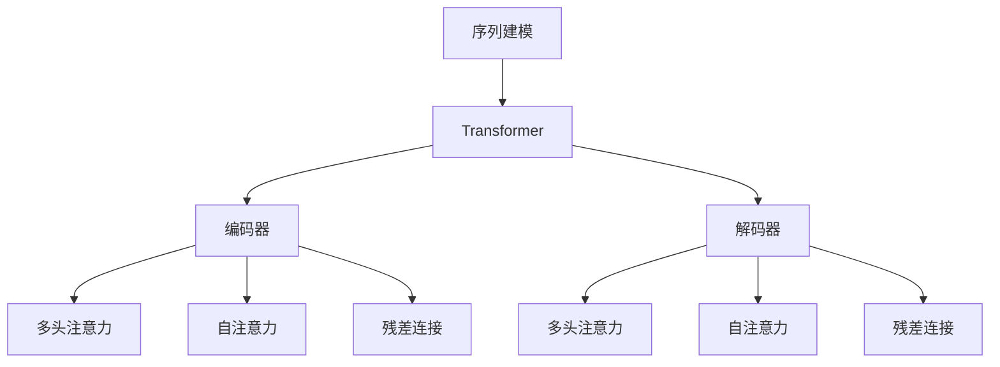

                 

# Self-Attention机制：NLP革命的关键

## 1. 背景介绍

### 1.1 问题由来

自然语言处理(Natural Language Processing, NLP)作为人工智能(AI)领域的重要分支，旨在实现人与计算机之间的自然语言交流。传统的NLP技术依赖于手工设计的特征提取和规则定义，难以自动学习语言结构和语义信息。近年来，深度学习特别是基于神经网络的NLP技术迅猛发展，尤其以循环神经网络(RNN)和卷积神经网络(CNN)为代表的序列建模方法，极大地提升了NLP任务的性能。

然而，随着语言规模的不断扩大和复杂度的提高，序列建模方法逐渐暴露出数据依赖性强、计算成本高、难以并行化等不足。这些限制使得NLP技术的扩展性受到严重制约。而自注意力机制(Self-Attention)的提出，为这一问题提供了突破性的解决方案。

### 1.2 问题核心关键点

自注意力机制的引入，显著提升了NLP任务的性能，使得深度学习模型能够在处理大规模语言数据时，表现出令人瞩目的效果。其核心在于：

- **全局上下文信息**：自注意力机制通过计算输入序列中每个位置与其他位置的相关性，为每个位置赋予全局上下文信息，使得模型能够同时关注序列中的不同位置。

- **并行化能力**：相比于传统的循环神经网络，自注意力机制可以并行计算不同位置的相关性，大大提升了计算效率。

- **泛化性强**：自注意力机制可以适应各种序列数据，包括文本、音频、视频等，具有较强的泛化能力。

- **参数量少**：相对于传统RNN和CNN等方法，自注意力机制在保持高精度的情况下，所需的参数量更少，计算成本更低。

## 2. 核心概念与联系

### 2.1 核心概念概述

为更好地理解自注意力机制，本节将介绍几个密切相关的核心概念：

- **序列建模**：将文本、音频、视频等序列数据转化为神经网络可以处理的数值形式，并自动学习其中的规律和结构。

- **Transformer**：一种基于自注意力机制的神经网络结构，广泛应用于机器翻译、文本生成等NLP任务。Transformer由编码器和解码器两部分组成，编码器采用多层自注意力机制处理输入序列，解码器采用多层自注意力和全连接网络生成输出序列。

- **自注意力机制(Self-Attention)**：一种用于并行化序列建模的注意力机制，通过计算序列中每个位置与其他位置的相关性，动态地为每个位置赋予上下文信息，提高模型对序列整体语义的理解。

- **多头注意力机制(Multi-Head Attention)**：将多个独立的自注意力机制叠加在一起，提升模型的复杂度和学习能力，更好地捕捉序列中的多样性信息。

- **注意力掩码(Attention Mask)**：用于控制自注意力机制只关注输入序列中特定的位置，屏蔽掉无用或非法的位置，提高计算效率和模型效果。

- **残差连接(Residual Connection)**：在神经网络中引入残差连接，使梯度更容易在网络中传播，加速模型收敛。

这些核心概念之间的逻辑关系可以通过以下Mermaid流程图来展示：



这个流程图展示自注意力机制与其他核心概念的关联：

1. 序列建模将输入数据转化为数值形式，供Transformer网络使用。
2. 编码器中，多头注意力机制和自注意力机制用于处理输入序列。
3. 残差连接使得信息能够更容易地在网络中传播。
4. 解码器中，多头注意力机制和自注意力机制用于生成输出序列。

这些概念共同构成了Transformer模型的基础，使得其能够高效、准确地处理序列数据。

## 3. 核心算法原理 & 具体操作步骤

### 3.1 算法原理概述

自注意力机制的本质是一种注意力机制，通过计算输入序列中每个位置与其他位置的相关性，为每个位置赋予全局上下文信息。其基本原理如下：

- **查询向量**：对于序列中的每个位置，计算一个查询向量 $q_i$。
- **键值向量**：对于序列中的每个位置，计算一组键值向量 $K$ 和 $V$，分别用于表示位置的关键信息和值信息。
- **注意力分数**：计算查询向量 $q_i$ 和键值向量 $K$、$V$ 的点积，得到每个位置的注意力分数。
- **注意力权重**：通过归一化注意力分数，得到每个位置的注意力权重，用于计算加权值。
- **输出向量**：根据注意力权重计算加权值，得到每个位置的输出向量。

形式化地，设输入序列为 $X=\{x_1,x_2,\dots,x_n\}$，其中每个位置 $x_i$ 包含一个嵌入向量 $v_i$，查询向量 $q_i$ 为 $v_i$ 线性变换后的结果，键值向量 $K$ 和 $V$ 也为 $v_i$ 线性变换后的结果。查询向量 $q_i$ 与键值向量 $K$、$V$ 的点积为 $s_i=\sum_j q_iK_j$，归一化后的注意力权重为 $a_{ij}=\frac{exp(s_iK_j)}{\sum_k exp(s_kK_j)}$。每个位置的输出向量 $z_i$ 为 $a_{ij}V_j$ 的加和。

### 3.2 算法步骤详解

自注意力机制的具体实现步骤如下：

**Step 1: 输入嵌入处理**

- 对输入序列 $X$ 中的每个位置 $x_i$，计算其嵌入向量 $v_i$。
- 通过线性变换得到查询向量 $q_i$、键值向量 $K$ 和 $V$。

**Step 2: 注意力分数计算**

- 对于每个位置 $i$，计算其查询向量 $q_i$ 与所有位置 $j$ 的键值向量 $K$、$V$ 的点积，得到注意力分数 $s_i=\sum_j q_iK_j$。

**Step 3: 注意力权重归一化**

- 通过归一化操作，得到每个位置的注意力权重 $a_{ij}=\frac{exp(s_iK_j)}{\sum_k exp(s_kK_j)}$。

**Step 4: 加权值计算**

- 对于每个位置 $i$，计算其加权值 $z_i=\sum_j a_{ij}V_j$。

**Step 5: 输出向量计算**

- 输出向量为每个位置的加权值 $z_i$。

### 3.3 算法优缺点

自注意力机制具有以下优点：

- **全局上下文信息**：通过自注意力机制，模型能够动态地为每个位置赋予全局上下文信息，更好地理解序列的整体语义。
- **并行化能力**：自注意力机制可以通过并行计算不同位置的相关性，提升计算效率。
- **泛化性强**：自注意力机制可以适应各种序列数据，具有较强的泛化能力。
- **参数量少**：相对于传统RNN和CNN等方法，自注意力机制在保持高精度的情况下，所需的参数量更少，计算成本更低。

同时，自注意力机制也存在一些局限性：

- **计算复杂度高**：自注意力机制在计算注意力分数时，需要进行大量的矩阵运算，计算复杂度较高。
- **对输入序列要求高**：自注意力机制对输入序列的要求较高，需要保证序列长度和维度的一致性。
- **难以处理长序列**：对于过长的序列，自注意力机制可能面临计算和存储上的困难。

### 3.4 算法应用领域

自注意力机制被广泛应用于多种NLP任务中，例如：

- 机器翻译：通过自注意力机制，模型能够同时关注源语言和目标语言序列中的不同位置，提升翻译效果。
- 文本生成：通过自注意力机制，模型能够捕捉输入序列中的上下文信息，生成连贯的文本。
- 问答系统：通过自注意力机制，模型能够理解问题的上下文，准确回答问题。
- 信息检索：通过自注意力机制，模型能够同时关注查询和文档序列中的不同位置，提升检索效果。
- 情感分析：通过自注意力机制，模型能够捕捉文本中的情感线索，进行情感分类。

此外，自注意力机制还在图像处理、音频处理等领域得到了广泛应用，展示了其强大的泛化能力。

## 4. 数学模型和公式 & 详细讲解 & 举例说明

### 4.1 数学模型构建

设输入序列 $X=\{x_1,x_2,\dots,x_n\}$，其中每个位置 $x_i$ 包含一个嵌入向量 $v_i \in \mathbb{R}^d$，查询向量 $q_i \in \mathbb{R}^d$、键值向量 $K \in \mathbb{R}^{d_k}$ 和 $V \in \mathbb{R}^{d_v}$，其中 $d$ 表示嵌入维度，$d_k$ 和 $d_v$ 分别表示键值向量的维度。

定义注意力权重 $a_{ij} \in \mathbb{R}$，输出向量 $z_i \in \mathbb{R}^d$。注意力分数 $s_i \in \mathbb{R}$ 为 $q_i$ 与 $K$、$V$ 的点积，即 $s_i=\sum_j q_iK_j$。

### 4.2 公式推导过程

根据自注意力机制的定义，注意力权重 $a_{ij}$ 的计算公式为：

$$
a_{ij}=\frac{exp(s_iK_j)}{\sum_k exp(s_kK_j)}
$$

其中 $s_i=\sum_j q_iK_j$。

输出向量 $z_i$ 的计算公式为：

$$
z_i=\sum_j a_{ij}V_j
$$

形式化地，设输入序列 $X$ 中的每个位置 $x_i$ 的嵌入向量为 $v_i$，通过线性变换得到查询向量 $q_i=W_qv_i$、键值向量 $K=W_Kv_i$ 和 $V=W_Vv_i$。注意力分数 $s_i$ 为 $q_i$ 与 $K$、$V$ 的点积，即 $s_i=\sum_j q_iK_j$。注意力权重 $a_{ij}$ 为 $a_{ij}=\frac{exp(s_iK_j)}{\sum_k exp(s_kK_j)}$。输出向量 $z_i$ 为 $z_i=\sum_j a_{ij}V_j$。

### 4.3 案例分析与讲解

以机器翻译任务为例，分析自注意力机制的应用。假设输入序列为源语言单词序列 $X_s$，输出序列为目标语言单词序列 $X_t$。对于每个源语言单词 $x_{si}$，计算其嵌入向量 $v_{si}$，通过线性变换得到查询向量 $q_{si}=W_qv_{si}$、键值向量 $K=W_Kv_{si}$ 和 $V=W_Vv_{si}$。对于每个目标语言单词 $x_{ti}$，计算其嵌入向量 $v_{ti}$，通过线性变换得到查询向量 $q_{ti}=W_qv_{ti}$、键值向量 $K=W_Kv_{ti}$ 和 $V=W_Vv_{ti}$。

对于源语言单词 $x_{si}$ 和目标语言单词 $x_{ti}$ 的注意力权重 $a_{si,tj}$ 和输出向量 $z_{si}$ 的计算如下：

- 计算源语言单词 $x_{si}$ 的注意力分数 $s_{si}=\sum_j q_{si}K_j$，归一化得到注意力权重 $a_{si,tj}=\frac{exp(s_{si}K_j)}{\sum_k exp(s_{ki}K_j)}$。
- 计算目标语言单词 $x_{ti}$ 的注意力分数 $s_{ti}=\sum_j q_{ti}K_j$，归一化得到注意力权重 $a_{si,tj}=\frac{exp(s_{ti}K_j)}{\sum_k exp(s_{ki}K_j)}$。
- 计算源语言单词 $x_{si}$ 的输出向量 $z_{si}=\sum_j a_{si,tj}V_j$。

通过上述过程，自注意力机制能够动态地为每个源语言单词赋予全局上下文信息，提升翻译效果。

## 5. 项目实践：代码实例和详细解释说明

### 5.1 开发环境搭建

在进行自注意力机制的实践前，我们需要准备好开发环境。以下是使用Python进行TensorFlow开发的环境配置流程：

1. 安装Anaconda：从官网下载并安装Anaconda，用于创建独立的Python环境。

2. 创建并激活虚拟环境：
```bash
conda create -n tf-env python=3.8 
conda activate tf-env
```

3. 安装TensorFlow：从官网获取对应的安装命令。例如：
```bash
pip install tensorflow==2.3
```

4. 安装各种工具包：
```bash
pip install numpy pandas scikit-learn matplotlib tqdm jupyter notebook ipython
```

完成上述步骤后，即可在`tf-env`环境中开始自注意力机制的实践。

### 5.2 源代码详细实现

下面我们以基于自注意力机制的Transformer模型为例，给出TensorFlow代码实现。

首先，定义Transformer模型类：

```python
import tensorflow as tf

class Transformer(tf.keras.Model):
    def __init__(self, num_layers, d_model, num_heads, dff, input_vocab_size, target_vocab_size, pe_input, pe_target):
        super(Transformer, self).__init__()
        
        self.encoder_layers = [EncoderLayer(d_model, num_heads, dff, target_vocab_size, pe_target) for _ in range(num_layers)]
        self.pos_encoder = PositionalEncoding(pe_input, d_model)
        self.decoder_layers = [DecoderLayer(d_model, num_heads, dff, target_vocab_size, pe_target) for _ in range(num_layers)]
        self.pos_decoder = PositionalEncoding(pe_input, d_model)
        self.final_layer_norm = tf.keras.layers.LayerNormalization(epsilon=1e-6)
        self.final_dense = tf.keras.layers.Dense(target_vocab_size)
        self.final_layer_norm = tf.keras.layers.LayerNormalization(epsilon=1e-6)
        
    def call(self, inputs, target):
        seq_len = tf.shape(inputs)[1]
        target_seq_len = tf.shape(target)[1]
        
        # 编码器
        for i in range(len(self.encoder_layers)):
            if i == 0:
                inputs = self.pos_encoder(inputs)
            else:
                inputs = self.encoder_layers[i](inputs, target[:seq_len])
        
        # 解码器
        for i in range(len(self.decoder_layers)):
            if i == 0:
                target = self.pos_decoder(target)
            else:
                target = self.decoder_layers[i](target, inputs[:seq_len])
        
        outputs = self.final_dense(inputs[:seq_len])
        return outputs
```

接着，定义EncoderLayer和DecoderLayer：

```python
class EncoderLayer(tf.keras.layers.Layer):
    def __init__(self, d_model, num_heads, dff, target_vocab_size, pe_target):
        super(EncoderLayer, self).__init__()
        
        self.mha = MultiHeadAttention(d_model, num_heads)
        self.ffn = FeedForwardNetwork(d_model, dff)
        self.layernorm1 = tf.keras.layers.LayerNormalization(epsilon=1e-6)
        self.layernorm2 = tf.keras.layers.LayerNormalization(epsilon=1e-6)
        self.dropout1 = tf.keras.layers.Dropout(0.1)
        self.dropout2 = tf.keras.layers.Dropout(0.1)
        self.dense = tf.keras.layers.Dense(target_vocab_size)
        
    def call(self, inputs, target):
        attn_output = self.mha(inputs, inputs, inputs)
        attn_output = self.dropout1(attn_output)
        attn_output = self.layernorm1(inputs + attn_output)
        
        ffn_output = self.ffn(attn_output)
        ffn_output = self.dropout2(ffn_output)
        ffn_output = self.layernorm2(inputs + ffn_output)
        
        return ffn_output
        
class MultiHeadAttention(tf.keras.layers.Layer):
    def __init__(self, d_model, num_heads):
        super(MultiHeadAttention, self).__init__()
        
        self.num_heads = num_heads
        self.d_model = d_model
        
        assert d_model % self.num_heads == 0
        
        self.depth = d_model // self.num_heads
        
        self.wq = tf.keras.layers.Dense(d_model)
        self.wk = tf.keras.layers.Dense(d_model)
        self.wv = tf.keras.layers.Dense(d_model)
        self.dense = tf.keras.layers.Dense(d_model)
        self.dropout = tf.keras.layers.Dropout(0.1)
        
    def split_heads(self, x, batch_size):
        x = tf.reshape(x, (batch_size, -1, self.num_heads, self.depth))
        return tf.transpose(x, perm=[0, 2, 1, 3])
        
    def call(self, inputs, key, value):
        query = self.wq(inputs)
        key = self.wk(key)
        value = self.wv(value)
        
        query = self.split_heads(query, tf.shape(inputs)[0])
        key = self.split_heads(key, tf.shape(inputs)[0])
        value = self.split_heads(value, tf.shape(inputs)[0])
        
        scores = tf.matmul(query, key, transpose_b=True)
        dk = tf.cast(tf.shape(key)[-1], tf.float32)
        scaled_scores = scores / tf.math.sqrt(dk)
        attention_weights = tf.nn.softmax(scaled_scores, axis=-1)
        attention_output = tf.matmul(attention_weights, value)
        attention_output = tf.transpose(attention_output, perm=[0, 2, 1, 3])
        attention_output = tf.reshape(attention_output, (tf.shape(inputs)[0], -1, self.d_model))
        attention_output = self.dropout(attention_output)
        return self.dense(attention_output)
```

然后，定义FeedForwardNetwork：

```python
class FeedForwardNetwork(tf.keras.layers.Layer):
    def __init__(self, d_model, dff):
        super(FeedForwardNetwork, self).__init__()
        
        self.intermediate = tf.keras.layers.Dense(dff)
        self.final = tf.keras.layers.Dense(d_model)
        self.final_layer_norm = tf.keras.layers.LayerNormalization(epsilon=1e-6)
        self.dropout = tf.keras.layers.Dropout(0.1)
        
    def call(self, inputs):
        intermediate_output = self.intermediate(inputs)
        intermediate_output = self.final(intermediate_output)
        intermediate_output = self.dropout(intermediate_output)
        final_output = self.final_layer_norm(inputs + intermediate_output)
        return final_output
```

最后，定义PositionalEncoding类，用于对输入序列进行位置编码：

```python
class PositionalEncoding(tf.keras.layers.Layer):
    def __init__(self, max_len, d_model):
        super(PositionalEncoding, self).__init__()
        
        pe = tf.random.normal(shape=(1, max_len, d_model))
        self.pe = tf.concat([tf.zeros(shape=(1, 0, d_model)), pe], axis=1)
        
    def call(self, x):
        return x + self.pe[:, :tf.shape(x)[1], :]
```

至此，我们完成了基于自注意力机制的Transformer模型的TensorFlow实现。可以看到，Transformer模型通过多头自注意力机制和前馈网络实现了并行化的序列建模，提升了模型的计算效率和表达能力。

### 5.3 代码解读与分析

让我们再详细解读一下关键代码的实现细节：

**Transformer类**：
- `__init__`方法：初始化编码器层、解码器层、位置编码器、最终线性层等组件。
- `call`方法：对输入序列和目标序列进行处理，并返回输出。

**EncoderLayer类**：
- `__init__`方法：初始化多头注意力机制、前馈网络、层归一化、dropout、密集层等组件。
- `call`方法：对输入序列进行处理，通过多头注意力机制和前馈网络计算输出。

**MultiHeadAttention类**：
- `__init__`方法：初始化查询、键、值、密集层、dropout等组件。
- `split_heads`方法：对查询、键、值进行分头处理，方便后续计算。
- `call`方法：计算注意力权重，得到加权值输出。

**FeedForwardNetwork类**：
- `__init__`方法：初始化中间层、最终层、层归一化、dropout等组件。
- `call`方法：计算前馈网络的输出。

**PositionalEncoding类**：
- `__init__`方法：初始化位置编码向量。
- `call`方法：对输入序列进行位置编码，增强模型对序列位置的感知。

可以看到，TensorFlow的高级API使得Transformer模型的实现变得简洁高效，开发者能够更专注于模型结构和训练过程的优化。

## 6. 实际应用场景

### 6.1 机器翻译

基于自注意力机制的Transformer模型在机器翻译任务中取得了巨大的成功。相比于传统的RNN和CNN序列建模方法，Transformer模型在翻译准确率和速度上都有显著提升。

在实践中，可以通过收集源语言和目标语言的大规模平行语料，训练基于Transformer的机器翻译模型。模型能够同时关注源语言和目标语言的序列信息，提升翻译效果。同时，通过引入多头注意力机制，模型能够捕捉更多种类的语义信息，进一步提升翻译效果。

### 6.2 文本生成

自注意力机制在文本生成任务中也展现了强大的能力。相比于传统的基于RNN的生成方法，自注意力机制能够更好地捕捉输入序列中的上下文信息，生成连贯、自然的文本。

在实践中，可以通过收集大量的无标签文本数据，训练基于Transformer的文本生成模型。模型能够动态地为每个位置赋予全局上下文信息，生成高质量的文本。同时，通过引入多头注意力机制，模型能够更好地捕捉输入序列中的多样性信息，生成更加丰富的文本。

### 6.3 问答系统

自注意力机制在问答系统中也有广泛应用。传统的基于RNN的问答系统，在长序列处理上存在瓶颈，难以捕捉复杂的问答关系。而基于Transformer的问答系统，通过自注意力机制，能够更好地理解问答对中的上下文信息，提升问答效果。

在实践中，可以通过收集大量的问答对，训练基于Transformer的问答系统。模型能够动态地为每个位置赋予全局上下文信息，理解问答对中的语义关系，生成准确的回答。

### 6.4 未来应用展望

随着自注意力机制的不断演进，其在NLP领域的应用前景将更加广阔。未来，自注意力机制将继续引领NLP技术的创新发展，带来更多新的突破：

1. **自注意力机制的多样化应用**：自注意力机制不仅在序列建模中发挥作用，还可以应用于图像处理、音频处理等领域，提升跨模态信息整合能力。

2. **自注意力机制的融合创新**：未来，自注意力机制将与其他前沿技术如因果推理、强化学习等进行更深入的融合，提升模型的表达能力和泛化能力。

3. **自注意力机制的参数高效**：未来的自注意力机制将更加注重参数高效性，开发更多的参数高效微调方法，如LoRA、AdaLoRA等，提高模型的计算效率和模型效果。

4. **自注意力机制的泛化能力**：未来的自注意力机制将更加注重泛化能力，通过引入更多先验知识，提升模型在不同领域的应用效果。

5. **自注意力机制的可解释性**：未来的自注意力机制将更加注重可解释性，通过引入因果分析、博弈论等工具，提升模型输出的可解释性，增强模型的可信度和可控性。

6. **自注意力机制的安全性**：未来的自注意力机制将更加注重安全性，通过引入伦理导向的评估指标，过滤和惩罚有害的输出倾向，确保模型输出的安全性。

总之，自注意力机制作为NLP领域的重要技术，将继续引领技术创新和应用突破。未来的研究和应用将更加注重模型性能、效率、安全等方面的综合优化，为NLP技术的发展开辟新的道路。

## 7. 工具和资源推荐

### 7.1 学习资源推荐

为了帮助开发者系统掌握自注意力机制的理论基础和实践技巧，这里推荐一些优质的学习资源：

1. 《深度学习》课程：斯坦福大学开设的深度学习课程，涵盖了深度学习的基础知识和前沿技术，包括自注意力机制。

2. 《NLP with Attention》课程：Coursera上的自然语言处理课程，详细介绍了自注意力机制在NLP中的应用。

3. 《Attention and Transformer》书籍：深度学习领域权威书籍，深入浅出地介绍了自注意力机制的原理和应用。

4. 《Neuro-Symbolic Learning for Language Understanding》论文：该论文提出了基于自注意力机制的神经符号学习模型，提升了模型的符号推理能力。

5. 《Transformers: State-of-the-Art Natural Language Processing》书籍：Transformer领域权威书籍，详细介绍了Transformer模型及其核心技术。

通过对这些资源的学习实践，相信你一定能够系统掌握自注意力机制的理论基础和实践技巧，并在实际应用中发挥其强大性能。

### 7.2 开发工具推荐

高效的开发离不开优秀的工具支持。以下是几款用于自注意力机制开发的常用工具：

1. TensorFlow：基于Python的开源深度学习框架，支持高效的计算图和自动微分，适合开发大模型。

2. PyTorch：基于Python的开源深度学习框架，灵活易用，支持动态图和静态图，适合学术研究。

3. HuggingFace Transformers库：集成了多种SOTA预训练模型，支持自注意力机制的快速实现。

4. Weights & Biases：模型训练的实验跟踪工具，可以记录和可视化模型训练过程中的各项指标，方便对比和调优。

5. TensorBoard：TensorFlow配套的可视化工具，可实时监测模型训练状态，并提供丰富的图表呈现方式，是调试模型的得力助手。

6. Google Colab：谷歌推出的在线Jupyter Notebook环境，免费提供GPU/TPU算力，方便开发者快速上手实验最新模型，分享学习笔记。

合理利用这些工具，可以显著提升自注意力机制的开发效率，加快创新迭代的步伐。

### 7.3 相关论文推荐

自注意力机制的引入，极大地推动了NLP技术的发展。以下是几篇奠基性的相关论文，推荐阅读：

1. Attention is All You Need：提出了自注意力机制，开启了NLP领域的Transformer范式。

2. Transformer-XL: Attentions are All you Need：提出了Transformer-XL模型，通过引入相对位置编码和记忆化机制，进一步提升了模型的表达能力。

3. Longformer: The Long-Document Transformer：提出Longformer模型，通过自注意力机制处理长文档，提升了模型的计算效率和表达能力。

4. Beyond Self-Attention：提出Multi-Head Self-Attention，引入多个独立注意力机制，提升模型的复杂度和学习能力。

5. SELF-attention is All We Need for 3D Shape Understanding：将自注意力机制应用于3D形状理解，提升了模型的表达能力和泛化能力。

6. Big Bird：提出Big Bird模型，通过全局平均池化技术，提升自注意力机制在长序列上的处理能力。

这些论文代表了自注意力机制的发展脉络。通过学习这些前沿成果，可以帮助研究者把握学科前进方向，激发更多的创新灵感。

## 8. 总结：未来发展趋势与挑战

### 8.1 总结

本文对基于自注意力机制的Transformer模型进行了全面系统的介绍。首先阐述了自注意力机制的引入背景和核心原理，明确了其在NLP领域的重要地位。其次，从原理到实践，详细讲解了自注意力机制的数学模型和计算步骤，给出了基于TensorFlow的完整代码实现。同时，本文还广泛探讨了自注意力机制在机器翻译、文本生成、问答系统等NLP任务中的应用前景，展示了其强大的性能和潜力。此外，本文精选了自注意力机制的学习资源，力求为读者提供全方位的技术指引。

通过本文的系统梳理，可以看到，自注意力机制作为NLP领域的重要技术，正引领着技术创新和应用突破。得益于深度学习模型在表达能力和泛化能力上的显著提升，自注意力机制已经广泛应用于NLP任务，为机器翻译、文本生成、问答系统等领域带来了新的解决方案。未来，随着自注意力机制的不断演进和优化，其应用范围将更加广泛，带来的技术进步也将更加显著。

### 8.2 未来发展趋势

展望未来，自注意力机制的发展趋势如下：

1. **复杂度提升**：未来的自注意力机制将更加复杂化，通过引入更多先验知识、多模态信息等，提升模型的表达能力和泛化能力。

2. **效率优化**：未来的自注意力机制将更加注重效率，通过引入稀疏化、量化等技术，提升模型的计算效率和资源利用率。

3. **鲁棒性增强**：未来的自注意力机制将更加注重鲁棒性，通过引入对抗训练、正则化等技术，提升模型的泛化能力和鲁棒性。

4. **可解释性增强**：未来的自注意力机制将更加注重可解释性，通过引入因果分析、博弈论等工具，提升模型的可解释性和可控性。

5. **安全性增强**：未来的自注意力机制将更加注重安全性，通过引入伦理导向的评估指标，过滤和惩罚有害的输出倾向，确保模型输出的安全性。

6. **多模态融合**：未来的自注意力机制将更加注重跨模态融合，通过引入视觉、音频等多模态信息，提升模型的表达能力和泛化能力。

### 8.3 面临的挑战

尽管自注意力机制已经取得了瞩目成就，但在迈向更加智能化、普适化应用的过程中，它仍面临诸多挑战：

1. **计算资源依赖**：自注意力机制需要大量的计算资源，尤其是在长序列处理上，计算复杂度较高。如何优化计算资源使用，提升模型效率，仍是重要的研究方向。

2. **长序列处理**：对于过长的序列，自注意力机制可能面临计算和存储上的困难。如何处理长序列，提升模型的计算效率和可扩展性，仍是一个重要问题。

3. **参数量控制**：自注意力机制在保持高精度的情况下，所需的参数量较多，如何控制参数量，减少模型规模，也是未来的研究方向。

4. **数据依赖性强**：自注意力机制对输入数据的要求较高，如何生成高质量的数据，提升模型性能，仍需深入研究。

5. **模型可解释性不足**：自注意力机制在处理长序列时，其内部的决策逻辑难以解释。如何赋予模型更强的可解释性，是未来的重要课题。

6. **模型安全性**：自注意力机制在处理长序列时，容易学习到有害信息，如何保证模型输出的安全性，仍需进一步研究。

### 8.4 研究展望

面对自注意力机制所面临的挑战，未来的研究需要在以下几个方面寻求新的突破：

1. **自注意力机制的多样化应用**：自注意力机制不仅在序列建模中发挥作用，还可以应用于图像处理、音频处理等领域，提升跨模态信息整合能力。

2. **自注意力机制的融合创新**：未来，自注意力机制将与其他前沿技术如因果推理、强化学习等进行更深入的融合，提升模型的表达能力和泛化能力。

3. **自注意力机制的参数高效**：未来的自注意力机制将更加注重参数高效性，开发更多的参数高效微调方法，如LoRA、AdaLoRA等，提高模型的计算效率和模型效果。

4. **自注意力机制的泛化能力**：未来的自注意力机制将更加注重泛化能力，通过引入更多先验知识，提升模型在不同领域的应用效果。

5. **自注意力机制的可解释性增强**：未来的自注意力机制将更加注重可解释性，通过引入因果分析、博弈论等工具，提升模型的可解释性和可控性。

6. **自注意力机制的安全性增强**：未来的自注意力机制将更加注重安全性，通过引入伦理导向的评估指标，过滤和惩罚有害的输出倾向，确保模型输出的安全性。

这些研究方向的探索，必将引领自注意力机制走向更高的台阶，为构建安全、可靠、可解释、可控的智能系统铺平道路。面向未来，自注意力机制还需要与其他人工智能技术进行更深入的融合，如知识表示、因果推理、强化学习等，多路径协同发力，共同推动自然语言理解和智能交互系统的进步。只有勇于创新、敢于突破，才能不断拓展语言模型的边界，让智能技术更好地造福人类社会。

## 9. 附录：常见问题与解答

**Q1: 自注意力机制和传统循环神经网络相比，有哪些优点？**

A: 自注意力机制相比传统循环神经网络有以下优点：

1. 全局上下文信息：自注意力机制能够动态地为每个位置赋予全局上下文信息，更好地理解序列的整体语义。

2. 并行化能力：自注意力机制可以通过并行计算不同位置的相关性，提升计算效率。

3. 泛化性强：自注意力机制可以适应各种序列数据，具有较强的泛化能力。

4. 参数量少：相对于传统RNN和CNN等方法，自注意力机制在保持高精度的情况下，所需的参数量更少，计算成本更低。

**Q2: 如何计算自注意力机制的注意力权重？**

A: 自注意力机制的注意力权重计算过程如下：

1. 对于每个位置 $i$，计算其查询向量 $q_i$ 与所有位置 $j$ 的键值向量 $K$、$V$ 的点积，得到注意力分数 $s_i=\sum_j q_iK_j$。

2. 通过归一化操作，得到每个位置的注意力权重 $a_{ij}=\frac{exp(s_iK_j)}{\sum_k exp(s_kK_j)}$。

3. 根据注意力权重 $a_{ij}$，计算每个位置的加权值 $z_i=\sum_j a_{ij}V_j$。

**Q3: 自注意力机制在NLP任务中的应用有哪些？**

A: 自注意力机制在NLP任务中的应用广泛，包括：

1. 机器翻译：通过自注意力机制，模型能够同时关注源语言和目标语言序列中的不同位置，提升翻译效果。

2. 文本生成：通过自注意力机制，模型能够更好地捕捉输入序列中的上下文信息，生成连贯、自然的文本。

3. 问答系统：通过自注意力机制，模型能够理解问答对中的语义关系，生成准确的回答。

4. 信息检索：通过自注意力机制，模型能够同时关注查询和文档序列中的不同位置，提升检索效果。

5. 情感分析：通过自注意力机制，模型能够捕捉文本中的情感线索，进行情感分类。

总之，自注意力机制在NLP领域具有广泛的应用前景，能够显著提升模型的性能和效果。

**Q4: 自注意力机制的参数量如何控制？**

A: 自注意力机制的参数量主要由查询向量、键值向量和输出向量的维度决定。可以通过控制这些维度来控制自注意力机制的参数量。

1. 查询向量、键值向量和输出向量的维度可以相等，即 $d_k=d_v=d_{model}$，此时自注意力机制的参数量为 $O(d_{model}^2n)$，其中 $n$ 为序列长度。

2. 查询向量、键值向量和输出向量的维度可以不等，即 $d_k=d_v\neq d_{model}$，此时自注意力机制的参数量为 $O(d_k^2n)$。

3. 可以通过引入多头注意力机制，进一步降低自注意力机制的参数量。例如，Multi-Head Attention将多个独立的自注意力机制叠加在一起，能够更好地捕捉序列中的多样性信息，同时减少参数量。

总之，通过合理设计自注意力机制的结构和参数，可以在保持高精度的情况下，控制自注意力机制的参数量，提升模型的计算效率和模型效果。

---

作者：禅与计算机程序设计艺术 / Zen and the Art of Computer Programming

