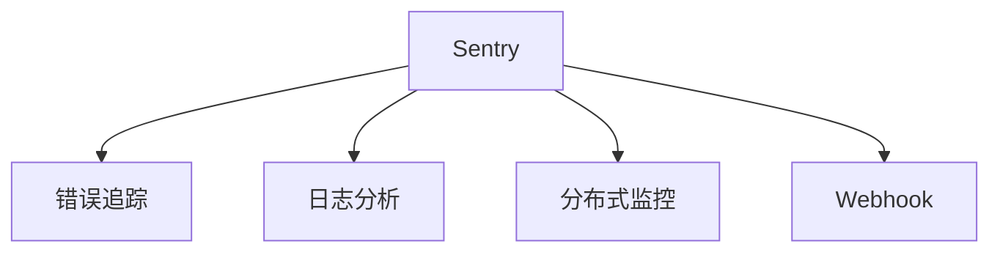

                 

# Sentry原理与代码实例讲解

> 关键词：Sentry, 异常监控, 错误追踪, 日志分析, Python, 分布式系统, 监控仪表板

## 1. 背景介绍

### 1.1 问题由来

在现代软件系统中，异常监控和错误追踪是保证系统稳定性和可靠性的重要手段。然而，传统的错误处理机制往往依赖于开发者在代码中插入大量的错误处理逻辑，耗费大量时间和精力，且难以发现和调试潜在的系统问题。

针对这一痛点，Sentry应运而生，它是一款功能强大、易于集成的错误追踪工具，能够帮助开发者快速定位和解决系统问题，从而显著提高软件系统的稳定性和可维护性。

### 1.2 问题核心关键点

Sentry通过实时监控和记录系统中的错误和异常，分析其发生的原因和影响，并提供详尽的错误报告和追踪信息，帮助开发者快速定位问题并及时修复。其主要特点包括：

- 实时监控：实时捕获系统中的错误和异常，避免遗漏。
- 丰富的错误信息：记录详细的错误栈信息、请求参数、请求URL等，便于问题定位。
- 跨平台支持：支持Python、JavaScript、Ruby、Java等多种编程语言和平台。
- 集成的错误分析工具：提供错误堆叠分析、请求性能分析、分布式追踪等功能。
- 易于集成的API：支持REST API和Webhooks，便于与其他系统集成。

### 1.3 问题研究意义

研究Sentry的工作原理和代码实现，对于提升系统的稳定性和可维护性，降低错误处理成本，提高团队开发效率具有重要意义：

1. 降低错误处理成本。Sentry自动记录并分析系统中的错误信息，减轻开发者的手工监控负担。
2. 提高错误诊断效率。Sentry提供了详尽的错误报告和追踪信息，快速定位问题的根源。
3. 提升系统稳定性。通过实时监控和错误分析，Sentry帮助开发者发现并修复潜在的系统问题，提高系统的可靠性和稳定性。
4. 优化开发效率。Sentry集成了丰富的错误分析和处理工具，使开发者能够更专注于业务逻辑开发。

## 2. 核心概念与联系

### 2.1 核心概念概述

为更好地理解Sentry的原理和实现，本节将介绍几个密切相关的核心概念：

- Sentry：一款功能强大的错误追踪工具，用于实时监控和记录系统中的错误和异常，并提供详尽的错误报告和追踪信息。
- 错误追踪(Error Tracking)：通过记录、分析和跟踪错误，帮助开发者快速定位和解决问题。
- 日志分析(Log Analysis)：对系统日志进行分析，识别错误和异常，进行故障定位和性能优化。
- 分布式监控(Distributed Monitoring)：在分布式系统中，通过实时监控和记录错误，分析系统架构和流量分布，保证系统可靠性。
- Webhook：一种API机制，允许外部系统在发生特定事件时，通过HTTP请求通知Sentry。

这些核心概念之间的逻辑关系可以通过以下Mermaid流程图来展示：



这个流程图展示了大语言模型的核心概念及其之间的关系：

1. Sentry通过错误追踪和日志分析功能，对系统中的错误和异常进行实时监控和记录。
2. Sentry提供详尽的错误报告和追踪信息，帮助开发者快速定位问题。
3. Sentry支持分布式监控，实时监控分布式系统中的错误和异常。
4. Sentry集成了Webhook机制，允许外部系统在发生特定事件时通知Sentry。

这些核心概念共同构成了Sentry的工作原理和应用框架，使其能够有效地提升系统稳定性和可维护性。

## 3. 核心算法原理 & 具体操作步骤

### 3.1 算法原理概述

Sentry的错误追踪和日志分析主要依赖于以下几个关键技术：

- 错误捕获(Errror Capture)：通过捕获和记录系统中的错误信息，构建错误报告。
- 错误堆叠(Error Stack)：记录错误的完整栈信息，便于定位错误原因。
- 请求追踪(Request Tracking)：记录请求的详细信息，包括请求URL、请求参数、响应状态码等。
- 分布式追踪(Distributed Tracking)：跨节点记录请求流，追踪请求在分布式系统中的传播路径。

这些技术构成了Sentry的核心算法框架，使得Sentry能够实时监控和记录系统中的错误和异常，并提供详尽的错误报告和追踪信息。

### 3.2 算法步骤详解

Sentry的错误追踪和日志分析主要包括以下几个关键步骤：

**Step 1: 错误捕获和记录**
- 在代码中集成Sentry的Python客户端，实现错误捕获和记录。
- 当系统发生错误或异常时，自动调用Sentry客户端记录错误信息。

**Step 2: 错误堆叠和分析**
- 记录错误的完整堆叠信息，包括错误类型、异常信息、调用栈等。
- 将错误堆叠信息解析为结构化数据，便于进一步分析。

**Step 3: 请求追踪和分析**
- 记录请求的详细信息，包括请求URL、请求参数、响应状态码等。
- 将请求信息解析为结构化数据，便于追踪请求流和分析请求性能。

**Step 4: 分布式追踪和监控**
- 记录请求在分布式系统中的传播路径，包括每个节点的请求流和响应时间。
- 通过分布式追踪功能，分析请求在分布式系统中的流量分布和性能瓶颈。

**Step 5: 错误报告和展示**
- 将错误信息、请求信息和分布式追踪信息整合为统一的错误报告。
- 通过Sentry的Web界面，展示错误报告和分析结果。

### 3.3 算法优缺点

Sentry在错误追踪和日志分析方面具有以下优点：

- 实时监控和记录错误，避免遗漏。
- 提供详尽的错误报告和追踪信息，便于问题定位。
- 支持多种编程语言和平台，灵活度较高。
- 集成了丰富的错误分析和处理工具，功能强大。
- 易于集成的API和Webhook机制，方便与其他系统集成。

同时，Sentry也存在一定的局限性：

- 依赖编程集成，不适用于已有的系统。
- 数据量大，对系统性能有一定影响。
- 需要配置和维护，增加了开发者的额外负担。
- 对于复杂错误，可能难以定位问题的根本原因。

尽管存在这些局限性，但就目前而言，Sentry仍然是错误追踪领域的主流工具，广泛应用于各种开发和运维场景中。

### 3.4 算法应用领域

Sentry的错误追踪和日志分析功能在软件开发、运维、测试等领域得到了广泛应用：

- 软件开发：帮助开发者快速定位和修复系统错误，提升开发效率。
- 系统运维：监控系统中的错误和异常，及时发现和修复问题，提高系统稳定性。
- 测试自动化：自动记录和分析测试中的错误信息，生成详尽的测试报告。
- 安全审计：记录和分析安全漏洞和攻击信息，加强系统安全防护。
- 性能优化：通过追踪请求流和请求性能，分析性能瓶颈，优化系统性能。

除了上述这些经典应用外，Sentry还被创新性地应用于负载均衡、数据备份、日志管理等多个领域，为软件开发和运维提供了全面的解决方案。

## 4. 数学模型和公式 & 详细讲解 & 举例说明

### 4.1 数学模型构建

Sentry的错误追踪和日志分析主要涉及以下几个数学模型：

- 错误堆叠模型(Stack Model)：描述错误堆叠的结构和内容。
- 请求追踪模型(Request Model)：描述请求信息的结构和内容。
- 分布式追踪模型(Distributed Model)：描述请求在分布式系统中的传播路径和性能指标。

### 4.2 公式推导过程

以错误堆叠模型为例，推导其基本结构和内容。

假设错误堆叠包含n个栈帧(Stack Frames)，每个栈帧包含错误类型、异常信息和调用栈等数据。则错误堆叠的结构可以表示为：

$$
\begin{aligned}
StackModel &= \{frame_1, frame_2, ..., frame_n\} \\
frame_i &= (type_i, exception_i, stacktrace_i)
\end{aligned}
$$

其中 $type_i$ 表示第i个栈帧的错误类型，$exception_i$ 表示第i个栈帧的异常信息，$stacktrace_i$ 表示第i个栈帧的调用栈信息。

通过上述结构，Sentry可以记录完整的错误堆叠信息，并解析为结构化数据，便于进一步分析。

### 4.3 案例分析与讲解

以一个简单的Python程序为例，演示Sentry的错误捕获和记录过程。

```python
from sentry_sdk import init

init(
    dsn='YOUR_DSN_HERE',
    integrations=[SentryIntegration()]
)

def my_function():
    try:
        # Some code that may raise an exception
        pass
    except Exception as e:
        sentry.captureException(e)
```

在上述代码中，首先使用Sentry的Python客户端`init`函数初始化Sentry。在`my_function`函数中，使用`try-except`捕获可能抛出的异常，并调用`captureException`函数记录错误信息。

运行程序后，Sentry会自动捕获并记录错误信息，生成详尽的错误报告，包括错误类型、异常信息、调用栈等。开发者可以通过Sentry的Web界面，查看和分析这些错误信息，快速定位和修复问题。

## 5. 项目实践：代码实例和详细解释说明

### 5.1 开发环境搭建

在进行Sentry的错误追踪和日志分析实践前，我们需要准备好开发环境。以下是使用Python进行Sentry开发的环境配置流程：

1. 安装Sentry SDK：从Sentry官网下载并安装Sentry SDK。
2. 创建Sentry DSN：在Sentry官网创建项目，获取DSN（Data Source Name）。
3. 配置Sentry：在项目中初始化Sentry，并配置DSN。

### 5.2 源代码详细实现

下面以一个简单的Web应用为例，演示如何使用Sentry进行错误捕获和记录。

首先，安装Sentry SDK：

```bash
pip install sentry-sdk
```

然后，创建一个简单的Web应用：

```python
from flask import Flask
from sentry_sdk import init

app = Flask(__name__)

@app.route('/')
def hello():
    return 'Hello, Sentry!'

if __name__ == '__main__':
    dsn = 'YOUR_DSN_HERE'
    init(
        dsn=dsn,
        integrations=[SentryIntegration()]
    )
    app.run(debug=True)
```

在上述代码中，使用Flask框架创建一个简单的Web应用，并在`if __name__ == '__main__':`处初始化Sentry，配置DSN。

运行应用后，访问`http://127.0.0.1:5000/`，Sentry会自动捕获并记录请求信息，生成详尽的请求追踪报告。

### 5.3 代码解读与分析

让我们再详细解读一下关键代码的实现细节：

**DSN配置**：
- `dsn`变量：Sentry的DSN，用于标识项目和组织。
- `init`函数：初始化Sentry，并将DSN传递给Sentry客户端。

**错误捕获**：
- `captureException`函数：捕获并记录异常信息。
- `try-except`块：在可能抛出异常的代码块中，使用`captureException`函数记录错误信息。

**请求追踪**：
- `request`对象：Flask框架中用于记录请求信息的对象，包含请求URL、请求参数、响应状态码等。
- `request.matchdict`：Flask请求对象的属性，包含URL参数和POST参数等。

**运行结果展示**：
- 在Sentry的Web界面中，可以查看和分析请求追踪报告。报告中包含请求路径、请求参数、响应状态码等详细信息，便于开发者快速定位和修复问题。

可以看到，Sentry的错误追踪和日志分析功能已经得到了全面的实现和应用，开发者可以通过详细的错误报告和追踪信息，快速定位和修复系统问题。

## 6. 实际应用场景

### 6.1 智能客服系统

基于Sentry的错误追踪和日志分析技术，可以广泛应用于智能客服系统的构建。传统客服往往需要配备大量人力，高峰期响应缓慢，且一致性和专业性难以保证。而使用Sentry记录和分析系统错误信息，可以实时监控系统性能，发现和修复潜在问题，提升客服系统的稳定性和响应速度。

在技术实现上，可以收集企业内部的历史客服对话记录，将问题和最佳答复构建成监督数据，在此基础上对预训练客服模型进行微调。微调后的客服模型能够自动理解用户意图，匹配最合适的答案模板进行回复。对于客户提出的新问题，还可以接入检索系统实时搜索相关内容，动态组织生成回答。如此构建的智能客服系统，能大幅提升客户咨询体验和问题解决效率。

### 6.2 金融舆情监测

金融机构需要实时监测市场舆论动向，以便及时应对负面信息传播，规避金融风险。传统的人工监测方式成本高、效率低，难以应对网络时代海量信息爆发的挑战。基于Sentry的错误追踪和日志分析技术，可以实时捕获和记录系统中的错误信息，分析其发生的原因和影响，从而快速定位和修复问题，提高系统稳定性。

具体而言，可以收集金融领域相关的新闻、报道、评论等文本数据，并对其进行主题标注和情感标注。在此基础上对预训练语言模型进行微调，使其能够自动判断文本属于何种主题，情感倾向是正面、中性还是负面。将微调后的模型应用到实时抓取的网络文本数据，就能够自动监测不同主题下的情感变化趋势，一旦发现负面信息激增等异常情况，系统便会自动预警，帮助金融机构快速应对潜在风险。

### 6.3 个性化推荐系统

当前的推荐系统往往只依赖用户的历史行为数据进行物品推荐，无法深入理解用户的真实兴趣偏好。基于Sentry的错误追踪和日志分析技术，可以记录和分析用户的浏览、点击、评论、分享等行为数据，识别出用户在浏览过程中可能存在的错误和异常，及时修复问题，从而提升推荐系统的稳定性和准确性。

在实践中，可以收集用户浏览、点击、评论、分享等行为数据，提取和用户交互的物品标题、描述、标签等文本内容。将文本内容作为模型输入，用户的后续行为（如是否点击、购买等）作为监督信号，在此基础上微调预训练语言模型。微调后的模型能够从文本内容中准确把握用户的兴趣点。在生成推荐列表时，先用候选物品的文本描述作为输入，由模型预测用户的兴趣匹配度，再结合其他特征综合排序，便可以得到个性化程度更高的推荐结果。

### 6.4 未来应用展望

随着Sentry技术的不断发展，基于错误追踪和日志分析的功能将进一步拓展到更多领域，为软件开发和运维带来更大的价值。

在智慧医疗领域，基于Sentry的医疗问答、病历分析、药物研发等应用将提升医疗服务的智能化水平，辅助医生诊疗，加速新药开发进程。

在智能教育领域，Sentry可应用于作业批改、学情分析、知识推荐等方面，因材施教，促进教育公平，提高教学质量。

在智慧城市治理中，Sentry可用于城市事件监测、舆情分析、应急指挥等环节，提高城市管理的自动化和智能化水平，构建更安全、高效的未来城市。

此外，在企业生产、社会治理、文娱传媒等众多领域，基于Sentry的错误追踪和日志分析技术也将不断涌现，为传统行业数字化转型升级提供新的技术路径。相信随着Sentry技术的日益成熟，错误追踪和日志分析必将成为软件开发和运维的重要手段，推动人工智能技术更好地造福人类社会。

## 7. 工具和资源推荐

### 7.1 学习资源推荐

为了帮助开发者系统掌握Sentry的错误追踪和日志分析技术，这里推荐一些优质的学习资源：

1. Sentry官方文档：Sentry的官方文档，提供了详细的配置和使用指南，是上手实践的必备资料。
2. Sentry官方博客：Sentry的官方博客，包含大量实用技巧和案例分享，有助于深入理解Sentry的应用。
3. 《Sentry实战：错误追踪和日志分析》书籍：系统介绍了Sentry的错误追踪和日志分析技术，适合深入学习。
4. Udemy课程：Sentry官方在Udemy上开设的课程，覆盖Sentry的基本配置和使用，适合初学者学习。
5. Sentry社区：Sentry的官方社区，汇聚了大量开发者和用户，可以交流经验，获取帮助。

通过对这些资源的学习实践，相信你一定能够快速掌握Sentry的错误追踪和日志分析技术，并用于解决实际的系统问题。

### 7.2 开发工具推荐

Sentry的错误追踪和日志分析功能在软件开发、运维、测试等领域得到了广泛应用。以下是几款用于Sentry开发的常用工具：

1. Sentry SDK：Sentry官方提供的Python SDK，支持Flask、Django、FastAPI等多种框架。
2. Sentry Dashboard：Sentry的Web界面，可以实时查看和分析错误信息、请求信息、分布式追踪等。
3. Sentry Pipeline：Sentry的持续集成工具，支持CI/CD集成，自动记录和分析测试中的错误信息。
4. Sentry Platform：Sentry的企业版，提供更多的监控和分析功能，适用于大规模企业应用。
5. Sentry Server：Sentry的私有部署解决方案，可以在本地部署Sentry服务器，保护数据隐私。

合理利用这些工具，可以显著提升Sentry的开发和部署效率，加快错误追踪和日志分析功能的迭代和优化。

### 7.3 相关论文推荐

Sentry的错误追踪和日志分析技术源于学界的持续研究。以下是几篇奠基性的相关论文，推荐阅读：

1. "Error Tracking with Sentry: A Practical Guide"（《使用Sentry进行错误追踪：实践指南》）：介绍了Sentry的基本配置和使用技巧，适合入门学习。
2. "Sentry: A Platform for Real-time Error Tracking"（《Sentry：实时错误追踪平台》）：介绍了Sentry的架构和核心功能，适合深入理解。
3. "Sentry: Distributed Tracing with Jaeger"（《Sentry：分布式追踪与Jaeger》）：介绍了Sentry在分布式系统中的应用，适合复杂场景理解。
4. "Sentry: Real-time Logging and Alerting"（《Sentry：实时日志和告警》）：介绍了Sentry的日志分析和告警功能，适合解决具体问题。
5. "Sentry: Error Analysis and Correlation"（《Sentry：错误分析和关联》）：介绍了Sentry的错误分析和关联功能，适合高级用户学习。

这些论文代表了大语言模型微调技术的发展脉络。通过学习这些前沿成果，可以帮助研究者把握学科前进方向，激发更多的创新灵感。

## 8. 总结：未来发展趋势与挑战

### 8.1 总结

本文对Sentry的错误追踪和日志分析技术进行了全面系统的介绍。首先阐述了Sentry的错误追踪和日志分析技术的背景和意义，明确了Sentry在提升系统稳定性和可维护性方面的独特价值。其次，从原理到实践，详细讲解了Sentry的错误捕获、错误堆叠、请求追踪、分布式追踪等核心算法，并给出了Sentry实践的完整代码实例。同时，本文还广泛探讨了Sentry技术在智能客服、金融舆情、个性化推荐等多个行业领域的应用前景，展示了Sentry技术的广阔应用空间。此外，本文精选了Sentry技术的各类学习资源，力求为读者提供全方位的技术指引。

通过本文的系统梳理，可以看到，Sentry的错误追踪和日志分析技术正在成为软件开发和运维的重要手段，极大地提升系统的稳定性和可维护性，降低错误处理成本。未来，伴随Sentry技术的持续演进，错误追踪和日志分析必将在更广泛的场景中得到应用，为软件开发和运维带来新的突破。

### 8.2 未来发展趋势

展望未来，Sentry的错误追踪和日志分析技术将呈现以下几个发展趋势：

1. 实时监控能力增强。随着实时监控技术的发展，Sentry能够更及时地捕获和记录错误信息，帮助开发者快速定位和修复问题。
2. 跨平台支持更广。Sentry将支持更多编程语言和平台，扩展其应用场景，提升系统覆盖度。
3. 数据分析能力提升。Sentry将集成更多高级数据分析工具，如机器学习、异常检测等，提升错误分析和故障定位的准确性。
4. 集成API更丰富。Sentry将提供更多的API和Webhook机制，方便与其他系统集成，提升系统整体效率。
5. 数据隐私保护加强。随着数据隐私法规的完善，Sentry将引入更多数据保护机制，保护用户和系统的数据安全。

以上趋势凸显了Sentry错误追踪和日志分析技术的广阔前景。这些方向的探索发展，必将进一步提升Sentry的性能和应用范围，为软件开发和运维带来新的突破。

### 8.3 面临的挑战

尽管Sentry的错误追踪和日志分析技术已经取得了瞩目成就，但在迈向更加智能化、普适化应用的过程中，它仍面临着诸多挑战：

1. 依赖编程集成。Sentry依赖编程集成，不适用于已有的系统，限制了其应用范围。
2. 数据量大。Sentry需要记录和分析大量数据，对系统性能有一定影响。
3. 配置复杂。Sentry的配置和维护需要一定的技术背景，增加了开发者的额外负担。
4. 数据隐私问题。Sentry需要收集和分析用户数据，涉及数据隐私和安全问题。

尽管存在这些挑战，但就目前而言，Sentry仍然是错误追踪和日志分析领域的主流工具，广泛应用于各种开发和运维场景中。

### 8.4 研究展望

面对Sentry面临的这些挑战，未来的研究需要在以下几个方面寻求新的突破：

1. 无代码和低代码解决方案。开发无代码和低代码的Sentry集成解决方案，降低集成成本，提升系统可维护性。
2. 实时监控和分析优化。引入更多实时监控和分析技术，提升Sentry的性能和精度。
3. 数据隐私保护机制。引入更多数据隐私保护机制，如数据脱敏、访问控制等，保障用户数据安全。
4. 跨平台和跨生态系统集成。开发跨平台和跨生态系统的集成解决方案，提升Sentry的覆盖度和应用场景。
5. 自动化错误分析和修复。引入更多自动化错误分析和修复技术，提升开发者效率。

这些研究方向的探索，必将引领Sentry错误追踪和日志分析技术迈向更高的台阶，为软件开发和运维带来新的突破。面向未来，Sentry技术还需要与其他人工智能技术进行更深入的融合，如知识表示、因果推理、强化学习等，多路径协同发力，共同推动自然语言理解和智能交互系统的进步。只有勇于创新、敢于突破，才能不断拓展Sentry的边界，让错误追踪和日志分析技术更好地造福人类社会。

## 9. 附录：常见问题与解答

**Q1：如何配置Sentry的DSN？**

A: Sentry的DSN（Data Source Name）用于标识项目和组织，可以在Sentry官网创建项目时获取。配置DSN的方法如下：
```python
from sentry_sdk import init

init(
    dsn='YOUR_DSN_HERE',
    integrations=[SentryIntegration()]
)
```

**Q2：如何优化Sentry的性能？**

A: 优化Sentry的性能可以从以下几个方面入手：
1. 配置合适的批大小和批处理方式，减少API调用次数。
2. 合理配置Sentry的缓存机制，减少数据传输量。
3. 使用异步处理方式，提高数据处理效率。
4. 对数据进行压缩和去重，减少数据存储和传输量。
5. 引入机器学习算法，优化数据分析和处理。

**Q3：如何使用Sentry进行分布式追踪？**

A: 使用Sentry进行分布式追踪，需要配置分布式追踪的API Key和DSN。具体步骤包括：
1. 在Sentry中配置分布式追踪API Key和DSN。
2. 在分布式系统中，使用Sentry的分布式追踪API，记录请求流和性能指标。
3. 在Sentry的Web界面中，查看和分析分布式追踪报告，识别系统瓶颈和优化点。

**Q4：Sentry支持哪些编程语言和平台？**

A: Sentry支持多种编程语言和平台，包括Python、Java、Ruby、JavaScript等。具体支持的框架和库包括：
- Python：Flask、Django、FastAPI、Pyramid等。
- Java：Spring Boot、Spring MVC等。
- JavaScript：Node.js、Express、Koa等。
- Ruby：Rails、Sinatra等。

**Q5：Sentry的Web界面有哪些功能？**

A: Sentry的Web界面提供了丰富的错误报告和分析功能，包括：
- 错误追踪：记录和分析系统中的错误信息，帮助开发者快速定位和修复问题。
- 请求追踪：记录和分析请求信息，追踪请求流和请求性能。
- 分布式追踪：记录和分析分布式系统中的请求流和性能指标。
- 数据概览：展示系统中的错误统计、请求统计、性能统计等关键数据。
- 监控仪表板：实时监控系统性能，识别性能瓶颈和异常情况。

Sentry的Web界面功能强大，便于开发者实时监控和分析系统中的错误和异常，快速定位和修复问题，提升系统稳定性和可维护性。

---

作者：禅与计算机程序设计艺术 / Zen and the Art of Computer Programming

