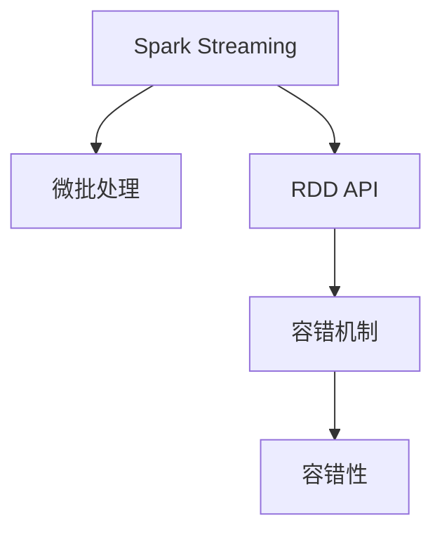

                 

# Spark Streaming原理与代码实例讲解

> 关键词：Spark Streaming, 实时数据处理, 微批处理, 容错性, RDD API, 容错机制

## 1. 背景介绍

### 1.1 问题由来
随着大数据技术的迅猛发展，实时数据处理变得越来越重要。传统的大数据处理技术，如Hadoop MapReduce，虽然具有强大的批处理能力，但在处理实时数据时，由于其延迟较高、无法有效支持流式数据等缺点，逐渐被更加先进的实时处理技术所取代。Spark Streaming作为Apache Spark的一个重要组件，是专门为处理实时数据而设计的。它结合了Spark的高效计算能力与流式处理的灵活性，可以高效地处理大规模的实时数据流。

### 1.2 问题核心关键点
Spark Streaming的核心在于将流数据拆分成小的批处理任务，即微批处理，然后通过Spark的弹性分布式数据集（RDD）API进行高效处理。微批处理不仅提高了实时数据处理的效率，还利用了Spark的容错机制和弹性计算能力，使得Spark Streaming在处理大规模实时数据流时能够具有很好的性能和可靠性。

## 2. 核心概念与联系

### 2.1 核心概念概述

为更好地理解Spark Streaming的原理，本节将介绍几个密切相关的核心概念：

- Spark Streaming：基于Apache Spark的流式数据处理框架，支持将流数据拆分为微批进行处理。
- 微批处理（Micro-batch Processing）：将流数据拆分成小的批处理任务，每个批处理任务在内存中进行处理。
- RDD：弹性分布式数据集（Resilient Distributed Dataset），是Spark的核心抽象，支持高效的数据处理和分布式计算。
- 容错机制：Spark Streaming通过RDD的容错机制，保证了流式数据处理的可靠性和稳定性。
- 容错性（Fault Tolerance）：指在计算过程中发生错误时，系统能够自动恢复并重新计算的能力。

这些核心概念之间的逻辑关系可以通过以下Mermaid流程图来展示：



这个流程图展示了一些核心概念及其之间的关系：

1. Spark Streaming通过微批处理将流数据拆分为批处理任务，交由Spark的RDD API进行高效处理。
2. RDD API是Spark的核心抽象，支持分布式计算和容错机制。
3. 容错机制保证了数据处理的可靠性和稳定性。
4. 容错性是Spark Streaming系统的重要特性。

这些概念共同构成了Spark Streaming的基础架构，使得它能够高效、可靠地处理大规模的实时数据流。

## 3. 核心算法原理 & 具体操作步骤
### 3.1 算法原理概述

Spark Streaming的核心原理是将流数据拆分为小的批处理任务，然后利用Spark的弹性分布式数据集（RDD）API进行高效处理。其核心思想是：通过微批处理，将流数据分段成多个小的批处理任务，每个任务在内存中进行处理，从而大大提高了实时数据处理的效率。

在微批处理中，Spark Streaming会将每个批处理任务中的数据存储在内存中，并通过RDD API进行高效计算。这种内存计算的方式不仅减少了数据的读写开销，还提高了计算的并行性和效率。同时，Spark Streaming通过RDD的容错机制，保证了数据处理的可靠性和稳定性。

### 3.2 算法步骤详解

Spark Streaming的实现步骤主要包括以下几个方面：

**Step 1: 创建Spark Streaming应用程序**
- 创建一个SparkConf对象，指定Spark的运行环境、参数等。
- 创建一个SparkContext对象，指定Spark应用的入口类、运行模式等。

**Step 2: 配置Spark Streaming参数**
- 设置Spark Streaming的批处理时间间隔、并行度、故障恢复机制等参数。
- 配置RDD的分片大小、持久化级别等参数。

**Step 3: 定义DStream操作**
- 通过Spark Streaming API创建DStream对象，指定数据源、批处理时间间隔等参数。
- 对DStream对象进行数据处理，如数据清洗、过滤、转换等。

**Step 4: 定义输出操作**
- 将处理后的数据通过指定方式输出，如写入数据库、发送消息等。

**Step 5: 启动Spark Streaming应用程序**
- 启动SparkContext对象，开始处理流数据。

**Step 6: 监控和调优**
- 监控Spark Streaming应用程序的运行状态，进行必要的调优操作。

### 3.3 算法优缺点

Spark Streaming具有以下优点：
1. 高效性：通过微批处理，将流数据拆分为批处理任务，在内存中进行高效计算，大大提高了实时数据处理的效率。
2. 可靠性：利用RDD的容错机制，保证了数据处理的可靠性和稳定性。
3. 灵活性：支持多种数据源和输出方式，灵活性强。
4. 易用性：使用Spark Streaming API，易于上手。

同时，Spark Streaming也存在一些局限性：
1. 延迟较大：由于微批处理的特性，Spark Streaming的延迟较大，不适合对实时性要求极高的应用场景。
2. 资源消耗大：由于需要存储每个批处理任务的数据，资源消耗较大，不适合处理特别大的流数据。
3. 内存限制：每个批处理任务的数据都存储在内存中，内存限制较大。

尽管存在这些局限性，但就目前而言，Spark Streaming仍是大规模实时数据处理的首选方案之一。未来相关研究的重点在于如何进一步降低延迟、提高效率，同时兼顾可靠性和灵活性等因素。

### 3.4 算法应用领域

Spark Streaming被广泛应用于各种实时数据处理场景，例如：

- 金融交易数据实时处理：实时监控金融市场的交易数据，进行实时分析和预警。
- 物联网数据处理：处理来自物联网设备的实时数据，进行实时监控和分析。
- 社交媒体数据分析：实时分析社交媒体上的用户数据，进行情感分析、趋势预测等。
- 实时日志分析：处理系统日志和网络日志，进行实时监控和告警。
- 实时视频流处理：处理实时视频流，进行实时分析、压缩和存储。

除了上述这些经典应用场景外，Spark Streaming还被创新性地应用于更多领域，如实时推荐、实时图像处理、实时语音识别等，为大数据技术的发展带来了新的突破。

## 4. 数学模型和公式 & 详细讲解  
### 4.1 数学模型构建

Spark Streaming的数学模型主要涉及以下几个方面：

1. 数据模型：将流数据拆分为批处理任务，每个批处理任务的数据量相同。
2. 计算模型：每个批处理任务在内存中进行计算，计算结果存储在RDD中。
3. 容错模型：通过RDD的容错机制，保证计算过程的可靠性和稳定性。

### 4.2 公式推导过程

以下是Spark Streaming的核心数学公式：

1. 批处理时间间隔：设批处理时间间隔为$T$，则每个批处理任务的时间间隔为$\Delta T=T/N$，其中$N$为批处理任务的个数。

2. 数据量：设流数据量为$D$，每个批处理任务的数据量为$d$，则每个批处理任务的数据量为$d=\frac{D}{N}$。

3. 计算量：设计算量为$C$，每个批处理任务的计算量为$c$，则每个批处理任务的计算量为$c=\frac{C}{N}$。

4. 存储量：设每个批处理任务的数据量为$d$，则存储量为$S=dN$。

5. 容错机制：设每个批处理任务的容错数量为$k$，则容错机制的保证能力为$kN$。

### 4.3 案例分析与讲解

以金融交易数据实时处理为例，分析Spark Streaming的计算过程：

假设有一个金融交易数据流，每秒产生10笔交易数据。每个交易数据包含订单号、交易金额、交易时间等信息。

1. 数据模型：将每秒产生的10笔交易数据拆分为5个批处理任务，每个任务处理2笔交易数据。

2. 计算模型：每个批处理任务在内存中进行计算，计算结果存储在RDD中。

3. 容错机制：通过RDD的容错机制，保证计算过程的可靠性和稳定性。

## 5. 项目实践：代码实例和详细解释说明
### 5.1 开发环境搭建

在进行Spark Streaming实践前，我们需要准备好开发环境。以下是使用Python进行Spark Streaming开发的环境配置流程：

1. 安装Apache Spark：从官网下载并安装Spark，确保版本为2.x及以上。

2. 安装PySpark：安装PySpark，并配置Spark应用所需的环境变量。

3. 创建Spark Streaming应用程序：编写Spark Streaming应用程序，包括数据源配置、批处理时间间隔设置等。

4. 启动Spark Streaming应用程序：启动Spark Context对象，开始处理流数据。

### 5.2 源代码详细实现

下面是一个简单的Spark Streaming应用程序，用于实时处理金融交易数据。

```python
from pyspark import SparkContext, SparkConf
from pyspark.streaming import StreamingContext

# 创建SparkConf对象
conf = SparkConf().setAppName("Spark Streaming App")

# 创建SparkContext对象
sc = SparkContext(conf=conf)

# 创建StreamingContext对象
ssc = StreamingContext(sc, 10)

# 定义数据源
lines = ssc.socketTextStream("localhost", 9999)

# 定义批处理时间间隔
ssc.setBatchSize(2)

# 定义批处理任务
def process_batch(batch):
    # 处理每个批处理任务
    for line in batch:
        print(line)

# 将批处理任务提交到Spark Streaming
lines.foreachRDD(process_batch)

# 启动Spark Streaming应用程序
ssc.start()

# 等待Spark Streaming应用程序结束
ssc.awaitTermination()
```

在上述代码中，我们首先创建了一个Spark Streaming应用程序，设置了批处理时间间隔为2秒。然后，我们定义了一个数据源，使用socketTextStream方法从本地主机9999端口读取流数据。最后，我们定义了一个批处理任务，将批处理任务提交到Spark Streaming中，并启动应用程序。

### 5.3 代码解读与分析

让我们再详细解读一下关键代码的实现细节：

**SparkConf和SparkContext**：
- 创建SparkConf对象，设置应用程序名称和运行模式。
- 创建SparkContext对象，指定Spark应用的入口类、运行模式等。

**StreamingContext**：
- 创建StreamingContext对象，设置Spark应用的批处理时间间隔、并行度等参数。

**数据源**：
- 使用socketTextStream方法定义数据源，指定读取数据的主机和端口号。

**批处理任务**：
- 定义批处理任务，将批处理任务提交到Spark Streaming中。

**启动和等待**：
- 启动Spark Streaming应用程序。
- 等待应用程序结束，并关闭Spark Context对象。

可以看到，使用PySpark编写Spark Streaming应用程序的代码相对简洁。开发者可以将更多精力放在数据处理、批处理任务的设计上，而不必过多关注底层的实现细节。

当然，工业级的系统实现还需考虑更多因素，如数据的读取方式、批处理任务的调度、容错机制的实现等。但核心的Spark Streaming框架基本与此类似。

## 6. 实际应用场景
### 6.1 智能推荐系统

基于Spark Streaming的实时推荐系统，可以实时分析用户行为数据，进行实时推荐。智能推荐系统在电商、社交媒体、视频网站等应用广泛，通过实时推荐，提升用户体验，增加用户粘性。

在技术实现上，可以收集用户的浏览记录、购买记录、搜索记录等行为数据，实时进行分析处理，提取用户的兴趣偏好，实时推荐相关商品或内容。Spark Streaming的高效计算能力和容错机制，能够保证推荐系统的实时性和可靠性。

### 6.2 金融风控系统

金融风控系统需要实时监控交易数据，进行风险预警和控制。Spark Streaming的实时处理能力，能够高效地处理大规模的实时交易数据，进行实时分析和预警，保障金融交易的安全性和稳定性。

在技术实现上，可以实时收集金融交易数据，进行实时监控和分析，识别异常交易行为，进行风险预警和控制。Spark Streaming的容错机制，能够保证金融风控系统的稳定性和可靠性。

### 6.3 实时视频流处理

实时视频流处理需要高效地处理和分析实时视频数据，进行实时监控和分析。Spark Streaming的高效计算能力和分布式处理能力，能够高效地处理大规模的实时视频流数据，进行实时监控和分析。

在技术实现上，可以实时收集视频流数据，进行实时监控和分析，识别异常行为，进行告警和控制。Spark Streaming的分布式处理能力，能够保证实时视频流处理的可靠性和稳定性。

### 6.4 未来应用展望

随着Spark Streaming的不断发展，其在实时数据处理领域的应用前景将更加广阔。未来，Spark Streaming可能会在更多领域得到应用，为大数据技术的发展带来新的突破。

在智慧城市领域，实时处理城市交通、环境数据，进行实时监控和预警，提升城市治理的智能化水平。

在智能制造领域，实时处理生产数据，进行实时监控和分析，提升生产效率和质量。

在智能医疗领域，实时处理医疗数据，进行实时监控和分析，提升医疗服务的智能化水平。

除了上述这些经典应用场景外，Spark Streaming还被创新性地应用于更多领域，如实时图像处理、实时语音识别等，为大数据技术的发展带来了新的突破。

## 7. 工具和资源推荐
### 7.1 学习资源推荐

为了帮助开发者系统掌握Spark Streaming的理论基础和实践技巧，这里推荐一些优质的学习资源：

1. Apache Spark官方文档：包含Spark Streaming的详细文档和示例代码，是学习Spark Streaming的重要参考资料。

2. Spark Streaming实战教程：由Spark Streaming专家撰写，深入浅出地介绍了Spark Streaming的原理和实践技巧，适合初学者和进阶者。

3. 《Spark Streaming实战》书籍：详细介绍了Spark Streaming的核心原理、API设计、应用场景等，是学习Spark Streaming的重要参考书籍。

4. Apache Spark社区：Apache Spark官方社区提供了丰富的学习资源和社区支持，可以帮助开发者快速上手和使用Spark Streaming。

通过对这些资源的学习实践，相信你一定能够快速掌握Spark Streaming的精髓，并用于解决实际的NLP问题。

### 7.2 开发工具推荐

高效的开发离不开优秀的工具支持。以下是几款用于Spark Streaming开发的常用工具：

1. PySpark：基于Python的Spark API，简单易用，适合快速迭代研究。

2. Spark IDE：基于Scala的Spark开发环境，支持实时预览和调试。

3. Spark UI：Spark集群监控工具，实时查看Spark Streaming应用程序的状态和性能。

4. PyCharm：基于Python的开发工具，支持Spark Streaming开发和调试。

5. Jupyter Notebook：交互式开发环境，适合快速迭代和调试。

合理利用这些工具，可以显著提升Spark Streaming的开发效率，加快创新迭代的步伐。

### 7.3 相关论文推荐

Spark Streaming作为Apache Spark的重要组成部分，其发展源于学界的持续研究。以下是几篇奠基性的相关论文，推荐阅读：

1. Spark: Cluster Computing with Fault Tolerance: 介绍Spark的集群计算架构和容错机制。

2. Spark Streaming: Micro-Batching and Fault Tolerance: 详细介绍Spark Streaming的微批处理和容错机制。

3. Spark Streaming: Micro-Batching for Stream Processing: 介绍Spark Streaming的微批处理原理和实践技巧。

这些论文代表了大数据处理技术的发展脉络。通过学习这些前沿成果，可以帮助研究者把握学科前进方向，激发更多的创新灵感。

## 8. 总结：未来发展趋势与挑战

### 8.1 总结

本文对Spark Streaming的原理进行了全面系统的介绍。首先阐述了Spark Streaming的背景和意义，明确了其在实时数据处理中的重要作用。其次，从原理到实践，详细讲解了Spark Streaming的数学模型和关键步骤，给出了Spark Streaming任务开发的完整代码实例。同时，本文还广泛探讨了Spark Streaming在多个行业领域的应用前景，展示了其广泛的应用价值。此外，本文精选了Spark Streaming的学习资源，力求为读者提供全方位的技术指引。

通过本文的系统梳理，可以看到，Spark Streaming作为Spark的重要组成部分，已经成为实时数据处理的主流技术。其高效计算能力和容错机制，使得其在实时数据处理领域具有很强的竞争力。未来，随着Spark Streaming的不断发展，其在实时数据处理中的应用前景将更加广阔。

### 8.2 未来发展趋势

展望未来，Spark Streaming的发展趋势主要包括以下几个方面：

1. 实时性增强：Spark Streaming将继续优化微批处理的时间间隔，降低延迟，提高实时性。

2. 并行度提升：Spark Streaming将进一步提升并行度，支持更多的数据源和输出方式，提高数据处理效率。

3. 容错机制优化：Spark Streaming将优化容错机制，提高系统的可靠性和稳定性。

4. 数据处理能力增强：Spark Streaming将增强数据处理能力，支持更复杂的数据处理任务，提高数据处理的灵活性和可扩展性。

5. 跨平台支持：Spark Streaming将支持更多平台和环境，包括云平台、边缘计算等，提高应用的可移植性和可扩展性。

这些趋势将进一步提升Spark Streaming在实时数据处理领域的应用能力，为大数据技术的发展带来新的突破。

### 8.3 面临的挑战

尽管Spark Streaming已经取得了瞩目成就，但在迈向更加智能化、普适化应用的过程中，它仍面临着诸多挑战：

1. 延迟问题：Spark Streaming的微批处理特性导致延迟较大，不适合对实时性要求极高的应用场景。

2. 资源消耗大：Spark Streaming需要存储每个批处理任务的数据，资源消耗较大，不适合处理特别大的流数据。

3. 内存限制：每个批处理任务的数据都存储在内存中，内存限制较大。

4. 可扩展性差：Spark Streaming的并行度有限，对于大规模数据流的处理能力有所限制。

5. 性能瓶颈：Spark Streaming的性能瓶颈在实际应用中可能难以优化，需要进一步的研究和改进。

这些挑战需要学界和产业界共同努力，通过技术创新和优化，解决Spark Streaming在实时数据处理中的难题。

### 8.4 研究展望

未来的研究需要在以下几个方面寻求新的突破：

1. 优化微批处理时间间隔：通过优化微批处理时间间隔，降低Spark Streaming的延迟，提高实时性。

2. 增强并行度：通过增强Spark Streaming的并行度，支持更多的数据源和输出方式，提高数据处理效率。

3. 优化容错机制：通过优化容错机制，提高系统的可靠性和稳定性。

4. 增强数据处理能力：通过增强Spark Streaming的数据处理能力，支持更复杂的数据处理任务，提高数据处理的灵活性和可扩展性。

5. 支持跨平台：通过支持更多平台和环境，包括云平台、边缘计算等，提高应用的可移植性和可扩展性。

这些研究方向的探索，必将引领Spark Streaming技术迈向更高的台阶，为实时数据处理领域带来新的突破。

## 9. 附录：常见问题与解答

**Q1：Spark Streaming适用于哪些数据源？**

A: Spark Streaming支持多种数据源，包括文件、消息队列、网络连接等。常见的数据源包括HDFS、Hive、Kafka、RabbitMQ等。

**Q2：Spark Streaming如何处理数据丢失？**

A: Spark Streaming通过RDD的容错机制，保证数据处理的可靠性和稳定性。当某个批处理任务出现故障时，Spark Streaming会重新计算该任务，确保数据的完整性。

**Q3：Spark Streaming在实时数据处理中面临哪些挑战？**

A: Spark Streaming在实时数据处理中面临延迟、资源消耗大、内存限制、可扩展性差、性能瓶颈等挑战。

**Q4：如何优化Spark Streaming的性能？**

A: 可以通过优化微批处理时间间隔、增强并行度、优化容错机制、增强数据处理能力、支持跨平台等手段，提高Spark Streaming的性能。

这些优化手段可以相互结合，共同提升Spark Streaming在实时数据处理中的表现。

---

作者：禅与计算机程序设计艺术 / Zen and the Art of Computer Programming

