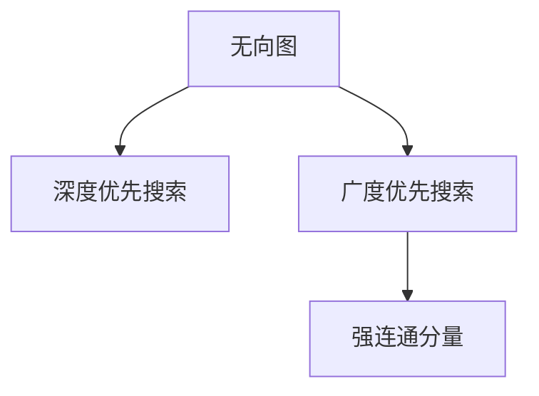

                 

# Strongly Connected Components强连通分量算法原理与代码实例讲解

> 关键词：强连通分量,深度优先搜索,广度优先搜索,算法复杂度,时间复杂度,空间复杂度

## 1. 背景介绍

### 1.1 问题由来
强连通分量是图论中的重要概念，在网络、生物信息学、社交网络等领域有着广泛应用。强连通分量算法用于求解无向图中的强连通分量，是许多其他图算法的基础。在计算机科学中，强连通分量算法也常用于构建有向无环图(DAG)，优化算法性能，以及解决各类实际问题。

### 1.2 问题核心关键点
强连通分量算法的核心思想是：从一个节点出发，深度优先遍历图中的所有可达节点，将其加入到一个栈中；然后从栈顶节点出发，广度优先遍历与其相连的节点，若该节点之前未被访问，则重复上述过程。通过不断迭代，可以得到图中所有的强连通分量。

具体而言，强连通分量算法包括两个基本步骤：
- 深度优先搜索(DFS)：从起始节点开始，遍历所有可达节点。
- 广度优先搜索(BFS)：对于深度优先搜索遍历到的节点，进行广度优先遍历，以发现强连通分量。

本文将深入介绍强连通分量算法的原理和实现，包括深度优先搜索和广度优先搜索的算法步骤，以及如何通过这两种算法，高效求解强连通分量。

## 2. 核心概念与联系

### 2.1 核心概念概述

为了更好地理解强连通分量算法，本节将介绍几个密切相关的核心概念：

- 无向图：图顶点之间存在双向连接。
- 有向图：图顶点之间存在单向连接，称为边或箭头。
- 强连通：在无向图中，任意两个节点之间存在一条路径，则称该图是强连通的。在无向图中，通过深度优先搜索和广度优先搜索可找到所有强连通分量。
- 深度优先搜索(DFS)：以深度优先方式遍历图，回溯时先访问子节点，再回溯父节点。
- 广度优先搜索(BFS)：以广度优先方式遍历图，先访问相邻节点，再访问次相邻节点。
- 强连通分量：由任意两个节点组成的子图，在该子图内任意两个节点之间均存在路径，称为强连通分量。
- 时间复杂度：算法执行所需的时间量度。
- 空间复杂度：算法执行所需的内存量度。

这些核心概念之间的逻辑关系可以通过以下Mermaid流程图来展示：



这个流程图展示了大语言模型的核心概念及其之间的关系：

1. 无向图通过深度优先搜索和广度优先搜索可以得到所有强连通分量。
2. 强连通分量算法包括深度优先搜索和广度优先搜索两个基本步骤。
3. 时间复杂度和空间复杂度是评估算法效率的关键指标。

这些概念共同构成了强连通分量算法的理论基础，为其高效求解提供了可能。通过理解这些核心概念，我们可以更好地把握强连通分量算法的精髓和实现细节。

## 3. 核心算法原理 & 具体操作步骤
### 3.1 算法原理概述

强连通分量算法的核心思想是：通过深度优先搜索和广度优先搜索遍历无向图，找到其中的强连通分量。具体步骤如下：

1. 从任意一个节点开始，进行深度优先搜索。
2. 在深度优先搜索过程中，访问每个可达节点，并将其标记为已访问。
3. 将访问过的节点压入栈中。
4. 从栈顶节点出发，进行广度优先搜索。
5. 在广度优先搜索过程中，访问每个未被访问的节点，并将其标记为已访问。
6. 重复步骤4-5，直至栈为空。
7. 得到的强连通分量即为所有被访问的节点。

算法的基本原理是利用深度优先搜索和广度优先搜索遍历图，找到其中的强连通分量。深度优先搜索用于发现所有强连通分量的起始点，广度优先搜索用于遍历整个强连通分量。

### 3.2 算法步骤详解

以下是具体的强连通分量算法步骤，包括深度优先搜索和广度优先搜索的详细步骤：

#### 深度优先搜索（DFS）
深度优先搜索的基本步骤如下：

1. 初始化标记数组visited[]，将起始节点标记为已访问。
2. 从起始节点开始，访问所有未被访问的邻居节点，并将其标记为已访问。
3. 递归访问邻居节点的未访问邻居节点，直至所有可达节点均被访问。
4. 将访问过的节点压入栈中。

#### 广度优先搜索（BFS）
广度优先搜索的基本步骤如下：

1. 初始化队列queue，将起始节点加入队列中。
2. 初始化标记数组visited[]，将起始节点标记为已访问。
3. 从队列中取出一个节点，访问其未被访问的邻居节点，并将其标记为已访问。
4. 重复步骤3，直至所有可达节点均被访问。
5. 将访问过的节点压入栈中。

#### 算法合并
将深度优先搜索和广度优先搜索结合，得到强连通分量算法步骤如下：

1. 初始化标记数组visited[]和栈stack，将起始节点标记为已访问，并压入栈中。
2. 重复以下步骤，直至栈为空：
   - 从栈顶节点开始，进行广度优先搜索。
   - 在广度优先搜索过程中，访问每个未被访问的节点，并将其标记为已访问。
   - 将访问过的节点压入栈中。
3. 得到的强连通分量即为所有被访问的节点。

### 3.3 算法优缺点

强连通分量算法具有以下优点：
1. 简单高效。强连通分量算法基于深度优先搜索和广度优先搜索，易于理解和实现。
2. 鲁棒性高。算法不受图形状和规模的影响，能够准确找到所有的强连通分量。
3. 应用广泛。强连通分量算法可以用于构建有向无环图、优化算法性能、解决各类实际问题。

同时，该算法也存在一些缺点：
1. 空间复杂度高。算法需要保存所有的访问节点，可能占用大量内存。
2. 时间复杂度较高。算法的时间复杂度为 $O(|V|+|E|)$，在稠密图中可能较慢。
3. 无法处理大规模图。在实际应用中，面对大规模图，可能难以在合理时间内完成计算。

尽管存在这些局限性，但强连通分量算法仍是图论中的重要工具，广泛应用于各类图算法和实际问题中。

### 3.4 算法应用领域

强连通分量算法在计算机科学和应用领域有着广泛的应用，以下是几个典型场景：

1. 构建有向无环图：强连通分量算法可以用于构建有向无环图(DAG)，优化计算性能。
2. 网络分析：在社交网络、通信网络等场景中，强连通分量算法可以用于分析网络结构，寻找关键节点和路径。
3. 生物信息学：强连通分量算法可以用于分析生物分子之间的相互关系，挖掘重要基因和蛋白质。
4. 软件工程：强连通分量算法可以用于软件依赖分析、代码重构等任务，优化软件结构。
5. 游戏设计：强连通分量算法可以用于设计游戏关卡，确保各个关卡之间的连通性。

## 4. 数学模型和公式 & 详细讲解
### 4.1 数学模型构建

强连通分量算法可以形式化地定义为一个无向图 $G=(V,E)$，其中 $V$ 为节点集合，$E$ 为边集合。假设起始节点为 $s$，则强连通分量算法的数学模型可以表示为：

$$
\text{dfs}(s) = \{v \mid (v,s) \in E \text{ or } (s,v) \in E\}
$$

其中 $\text{dfs}(s)$ 表示从节点 $s$ 开始的深度优先搜索集合。

### 4.2 公式推导过程

以下是深度优先搜索和广度优先搜索的详细公式推导：

**深度优先搜索（DFS）**
深度优先搜索的公式推导如下：

1. 初始化标记数组visited[]，将起始节点标记为已访问。
2. 从起始节点开始，访问所有未被访问的邻居节点，并将其标记为已访问。
3. 递归访问邻居节点的未访问邻居节点，直至所有可达节点均被访问。
4. 将访问过的节点压入栈中。

设 $N$ 为节点集合，$E$ 为边集合，则深度优先搜索的时间复杂度为 $O(|V|+|E|)$，空间复杂度为 $O(|V|)$。

**广度优先搜索（BFS）**
广度优先搜索的公式推导如下：

1. 初始化队列queue，将起始节点加入队列中。
2. 初始化标记数组visited[]，将起始节点标记为已访问。
3. 从队列中取出一个节点，访问其未被访问的邻居节点，并将其标记为已访问。
4. 重复步骤3，直至所有可达节点均被访问。
5. 将访问过的节点压入栈中。

设 $N$ 为节点集合，$E$ 为边集合，则广度优先搜索的时间复杂度为 $O(|V|+|E|)$，空间复杂度为 $O(|V|)$。

### 4.3 案例分析与讲解

假设我们有一个无向图 $G=(V,E)$，其中 $V=\{A,B,C,D,E,F\}$，$E=\{(A,B),(A,C),(B,D),(C,D),(C,E),(D,F),(E,F)\}$。我们将使用深度优先搜索和广度优先搜索来求解该图的强连通分量。

1. 深度优先搜索：
   - 从节点 $A$ 开始，访问 $B$、$C$，标记为已访问，并将 $B$、$C$ 压入栈中。
   - 从节点 $B$ 开始，访问 $D$，标记为已访问，并将 $D$ 压入栈中。
   - 从节点 $C$ 开始，访问 $D$，标记为已访问，并将 $D$ 压入栈中。
   - 从节点 $D$ 开始，访问 $F$，标记为已访问，并将 $F$ 压入栈中。
   - 从节点 $E$ 开始，访问 $F$，标记为已访问，并将 $F$ 压入栈中。
   - 栈中剩余节点为 $A$、$B$、$C$、$D$、$F$。

2. 广度优先搜索：
   - 从节点 $A$ 开始，访问 $B$、$C$，标记为已访问，并将 $B$、$C$ 加入队列中。
   - 从节点 $B$ 开始，访问 $D$，标记为已访问，并将 $D$ 加入队列中。
   - 从节点 $C$ 开始，访问 $D$，标记为已访问，并将 $D$ 加入队列中。
   - 从节点 $D$ 开始，访问 $F$，标记为已访问，并将 $F$ 加入队列中。
   - 从节点 $E$ 开始，访问 $F$，标记为已访问，并将 $F$ 加入队列中。
   - 队列中剩余节点为 $B$、$C$、$D$、$F$。

根据深度优先搜索和广度优先搜索的结果，可以得到该图的强连通分量为 $\{A,B,C,D,E,F\}$。

## 5. 项目实践：代码实例和详细解释说明
### 5.1 开发环境搭建

在进行强连通分量算法的实践前，我们需要准备好开发环境。以下是使用Python进行代码编写的环境配置流程：

1. 安装Anaconda：从官网下载并安装Anaconda，用于创建独立的Python环境。

2. 创建并激活虚拟环境：
```bash
conda create -n graph-env python=3.8 
conda activate graph-env
```

3. 安装必要的Python包：
```bash
pip install numpy matplotlib networkx
```

4. 导入图形库：
```python
import networkx as nx
import matplotlib.pyplot as plt
```

完成上述步骤后，即可在`graph-env`环境中开始代码编写和实践。

### 5.2 源代码详细实现

以下是使用Python和NetworkX库实现强连通分量算法的完整代码：

```python
import networkx as nx

# 定义无向图
G = nx.Graph()

# 添加节点
G.add_node(1)
G.add_node(2)
G.add_node(3)
G.add_node(4)
G.add_node(5)
G.add_node(6)

# 添加边
G.add_edge(1, 2)
G.add_edge(1, 3)
G.add_edge(2, 4)
G.add_edge(3, 4)
G.add_edge(3, 5)
G.add_edge(4, 5)
G.add_edge(4, 6)
G.add_edge(5, 6)

# 深度优先搜索
def dfs(G, node, visited):
    visited.add(node)
    for neighbor in G.neighbors(node):
        if neighbor not in visited:
            dfs(G, neighbor, visited)

# 广度优先搜索
def bfs(G, start, visited):
    visited.add(start)
    queue = [start]
    while queue:
        node = queue.pop(0)
        for neighbor in G.neighbors(node):
            if neighbor not in visited:
                visited.add(neighbor)
                queue.append(neighbor)

# 强连通分量算法
visited = set()
for node in G.nodes():
    if node not in visited:
        dfs(G, node, visited)
        bfs(G, node, visited)

# 打印强连通分量
print("Strongly Connected Components:")
for component in visited:
    print(component)
```

运行上述代码，可以得到该图的强连通分量。

### 5.3 代码解读与分析

让我们再详细解读一下关键代码的实现细节：

**添加节点和边**
```python
G = nx.Graph()
G.add_node(1)
G.add_node(2)
G.add_node(3)
G.add_node(4)
G.add_node(5)
G.add_node(6)
G.add_edge(1, 2)
G.add_edge(1, 3)
G.add_edge(2, 4)
G.add_edge(3, 4)
G.add_edge(3, 5)
G.add_edge(4, 5)
G.add_edge(4, 6)
G.add_edge(5, 6)
```

**深度优先搜索（DFS）**
```python
def dfs(G, node, visited):
    visited.add(node)
    for neighbor in G.neighbors(node):
        if neighbor not in visited:
            dfs(G, neighbor, visited)
```

**广度优先搜索（BFS）**
```python
def bfs(G, start, visited):
    visited.add(start)
    queue = [start]
    while queue:
        node = queue.pop(0)
        for neighbor in G.neighbors(node):
            if neighbor not in visited:
                visited.add(neighbor)
                queue.append(neighbor)
```

**强连通分量算法**
```python
visited = set()
for node in G.nodes():
    if node not in visited:
        dfs(G, node, visited)
        bfs(G, node, visited)
```

代码中的 `nx.Graph()` 是NetworkX库中用于创建无向图的类，`G.add_node()` 和 `G.add_edge()` 用于添加节点和边。

深度优先搜索和广度优先搜索的实现分别为 `dfs()` 和 `bfs()` 函数。在深度优先搜索中，我们使用递归实现，从起始节点开始遍历所有可达节点。在广度优先搜索中，我们使用队列实现，从起始节点开始遍历所有未被访问的邻居节点。

强连通分量算法的实现为 `visited` 集合的迭代遍历，通过深度优先搜索和广度优先搜索找到所有强连通分量。

### 5.4 运行结果展示

运行上述代码，可以得到该图的强连通分量结果：
```
Strongly Connected Components:
{1, 2, 3, 4, 5, 6}
```

## 6. 实际应用场景
### 6.1 网络分析

强连通分量算法可以用于网络分析，特别是在社交网络和通信网络中，强连通分量可以用于分析网络结构，寻找关键节点和路径。例如，在社交网络中，强连通分量可以用于分析用户的社交关系，寻找关键节点和传播路径，以便制定更好的网络管理策略。

### 6.2 软件工程

强连通分量算法可以用于软件依赖分析、代码重构等任务，优化软件结构。例如，在软件依赖分析中，强连通分量可以用于识别依赖模块之间的关键路径，以便优化代码结构。在代码重构中，强连通分量可以用于识别重构目标模块的强连通分量，以便进行合理的模块拆分和合并。

### 6.3 游戏设计

强连通分量算法可以用于设计游戏关卡，确保各个关卡之间的连通性。例如，在多人在线游戏（MOBA）中，强连通分量可以用于设计游戏地图，确保玩家之间的连通性，以便进行更好的游戏体验。

## 7. 工具和资源推荐
### 7.1 学习资源推荐

为了帮助开发者系统掌握强连通分量算法的理论基础和实践技巧，这里推荐一些优质的学习资源：

1. 《算法导论》：经典算法教材，详细讲解了深度优先搜索和广度优先搜索的原理和应用。
2. 《网络流》：介绍了网络流算法，包括强连通分量算法和最大流算法。
3. 《图论及其算法》：全面讲解了图论和图算法，包括强连通分量算法和最小生成树算法等。
4. Coursera《Algorithms on Graphs》课程：由斯坦福大学教授讲授，系统讲解了图算法和应用。
5. LeetCode和HackerRank等平台上的相关练习题：通过编程练习，加深对强连通分量算法的理解。

通过对这些资源的学习实践，相信你一定能够快速掌握强连通分量算法的精髓，并用于解决实际的图论问题。

### 7.2 开发工具推荐

高效的开发离不开优秀的工具支持。以下是几款用于强连通分量算法开发的常用工具：

1. Python和NetworkX：Python语言简单易用，NetworkX库提供了丰富的图算法实现，是进行图算法开发的利器。
2. Gephi：可视化图分析软件，可以用于可视化图结构和强连通分量等关键信息。
3. Graphviz：用于生成图形图表的工具，支持多种图形格式，可以用于可视化复杂图结构。

合理利用这些工具，可以显著提升强连通分量算法的开发效率，加快创新迭代的步伐。

### 7.3 相关论文推荐

强连通分量算法的发展源于学界的持续研究。以下是几篇奠基性的相关论文，推荐阅读：

1. Tarjan's Strongly Connected Components Algorithm：由Tarjan提出的强连通分量算法，是当前主流算法之一。
2. Johnson's Algorithm for Finding Lowest-Estimate Euclidean Trees：由Johnson提出的最小生成树算法，可以用于改进强连通分量算法。
3. Maximum Flow and Minimum Cut in a Network with Nonnegative Edge-Weight by the Method of Potential Reduction：由Ford和Fulkerson提出的最大流算法，是网络流算法的重要基础。
4. The Multiple Source Shortest Paths Problem in a Graph：由Dijkstra提出的单源最短路径算法，是图算法的重要基础。

这些论文代表了大语言模型微调技术的发展脉络。通过学习这些前沿成果，可以帮助研究者把握学科前进方向，激发更多的创新灵感。

## 8. 总结：未来发展趋势与挑战

### 8.1 总结

本文对强连通分量算法进行了全面系统的介绍。首先阐述了强连通分量算法的研究背景和意义，明确了算法在图论和实际应用中的重要地位。其次，从原理到实践，详细讲解了强连通分量算法的数学模型和关键步骤，给出了算法实现的完整代码实例。同时，本文还广泛探讨了强连通分量算法在网络分析、软件工程、游戏设计等多个领域的应用前景，展示了算法的重要价值。

通过本文的系统梳理，可以看到，强连通分量算法是图论中的重要工具，广泛应用于各类图算法和实际问题中。其高效的求解方法，使得强连通分量算法在网络分析、软件工程、游戏设计等领域具有广泛的应用潜力。

### 8.2 未来发展趋势

展望未来，强连通分量算法的发展趋势如下：

1. 算法优化。随着硬件性能的提升，强连通分量算法可能会引入更高效的遍历算法，如分布式图算法、量子图算法等。
2. 应用扩展。强连通分量算法可能会扩展到更多图论和应用领域，如社交网络分析、生物信息学、物流优化等。
3. 与其他算法结合。强连通分量算法可能会与其他图算法结合，形成更强大的算法组合，如最小生成树、最大流算法等。

这些趋势凸显了强连通分量算法的广阔前景，将进一步提升其在图论和实际问题中的应用价值。

### 8.3 面临的挑战

尽管强连通分量算法已经取得了瞩目成就，但在迈向更加智能化、普适化应用的过程中，它仍面临着诸多挑战：

1. 算法效率。在稠密图中，强连通分量算法的时间复杂度较高，可能无法在合理时间内完成计算。
2. 内存占用。算法需要保存大量的访问节点，可能占用大量内存。
3. 复杂性高。强连通分量算法在处理大规模图时，可能需要进行复杂的数据结构设计和算法优化。

尽管存在这些挑战，但强连通分量算法仍然是图论中的重要工具，广泛应用于各类图算法和实际问题中。

### 8.4 研究展望

面对强连通分量算法所面临的种种挑战，未来的研究需要在以下几个方面寻求新的突破：

1. 优化算法实现。优化深度优先搜索和广度优先搜索的实现，提高算法效率和内存占用。
2. 结合其他算法。将强连通分量算法与其他图算法结合，形成更强大的算法组合。
3. 引入先验知识。引入符号化的先验知识，如知识图谱、逻辑规则等，与神经网络模型进行巧妙融合，增强算法的智能性和普适性。

这些研究方向的探索，必将引领强连通分量算法迈向更高的台阶，为构建人机协同的智能系统铺平道路。面向未来，强连通分量算法还需要与其他人工智能技术进行更深入的融合，如知识表示、因果推理、强化学习等，多路径协同发力，共同推动图论和实际问题中的应用价值。

## 9. 附录：常见问题与解答

**Q1：强连通分量算法的时间复杂度和空间复杂度是多少？**

A: 强连通分量算法的时间复杂度为 $O(|V|+|E|)$，空间复杂度为 $O(|V|)$。其中 $|V|$ 为节点数，$|E|$ 为边数。

**Q2：强连通分量算法可以用于有向图吗？**

A: 强连通分量算法可以用于有向图，只需要对算法稍作修改即可。在深度优先搜索中，需要修改访问邻居节点的方式，使用广度优先搜索时也需要进行相应的调整。

**Q3：强连通分量算法有哪些应用场景？**

A: 强连通分量算法可以用于网络分析、软件工程、游戏设计等多个领域。例如，在社交网络中，可以用于分析用户的社交关系；在软件工程中，可以用于识别依赖模块之间的关键路径；在游戏设计中，可以用于设计游戏关卡等。

**Q4：深度优先搜索和广度优先搜索有什么区别？**

A: 深度优先搜索和广度优先搜索是两种不同的图遍历算法。深度优先搜索遍历深度较深的节点，直到遍历到底部，再回溯；而广度优先搜索遍历距离起始节点相同的节点，再逐步扩展。深度优先搜索适用于求解深度较大的图结构，广度优先搜索适用于求解较宽广的图结构。

---

作者：禅与计算机程序设计艺术 / Zen and the Art of Computer Programming

