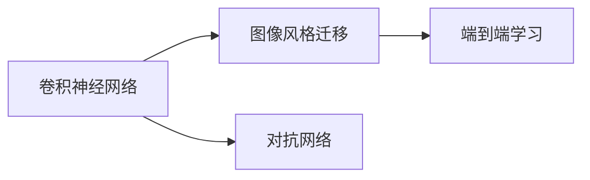

                 

# Style Transfer原理与代码实例讲解

> 关键词：Style Transfer, 图像处理, 神经网络, 卷积神经网络, 图像风格迁移, 代码实现

## 1. 背景介绍

### 1.1 问题由来

图像风格迁移（Image Style Transfer）是计算机视觉领域的一个重要研究方向，其目的是将一张图像的内容与另一张图像的风格相结合，生成新的图像。这一技术在艺术创作、图像编辑、视觉特效等领域有着广泛的应用前景。

传统的图像风格迁移方法通常依赖于手工设计的特征提取器和风格转换函数，而这些方法往往难以适应不同的图像和风格，且计算复杂度高。随着深度学习技术的发展，基于神经网络的图像风格迁移方法逐渐成为主流。这些方法通过训练端到端的神经网络模型，自动学习图像特征和风格转换，提升了风格迁移的效果和效率。

### 1.2 问题核心关键点

为了使读者更好地理解基于神经网络的图像风格迁移方法，本文将从以下几个方面展开探讨：

- 神经网络的结构与原理
- 风格迁移的具体算法和步骤
- 风格迁移的优缺点与实际应用
- 风格迁移的数学模型和公式推导
- 风格迁移的代码实现与实践指导

### 1.3 问题研究意义

研究图像风格迁移方法，不仅能够推动计算机视觉技术的进步，还能够在艺术创作、广告设计、影视特效等众多领域带来变革性影响。具体而言：

- **提升艺术创作效率**：将两幅图像的风格结合，能够为艺术家提供更丰富的创作灵感和工具。
- **优化视觉设计**：在广告、海报等设计中，使用风格迁移可以提升视觉冲击力，吸引更多关注。
- **增强影视特效**：在电影、视频中，使用风格迁移技术可以模拟不同风格的场景，提升观看体验。

通过本文的探讨，希望能够为读者提供深入的技术理解和实用的代码实现，为他们的实际开发提供参考和指导。

## 2. 核心概念与联系

### 2.1 核心概念概述

- **图像风格迁移**：将一张图像的内容与另一张图像的风格相结合，生成新的图像。
- **卷积神经网络（CNN）**：一种专门用于处理图像数据的神经网络，通过卷积层和池化层提取图像特征。
- **对抗网络（GAN）**：生成式对抗网络，通过生成器和判别器的对抗训练，生成高质量的图像。
- **神经网络**：一种通过多层神经元模拟人脑神经网络，实现复杂任务求解的机器学习算法。
- **端到端学习**：直接从原始数据到最终输出的学习过程，无需手工设计的中间特征提取和转换过程。

这些核心概念构成了图像风格迁移技术的基础，下面将通过一个Mermaid流程图展示它们之间的联系。



## 3. 核心算法原理 & 具体操作步骤

### 3.1 算法原理概述

基于神经网络的图像风格迁移算法通常包括以下几个关键步骤：

1. **特征提取**：使用预训练的卷积神经网络提取输入图像的内容特征和风格特征。
2. **特征分离**：将提取出的内容特征和风格特征进行分离，以便后续的特征融合。
3. **特征变换**：通过一个共享的变换层，将内容特征和风格特征进行融合，生成新的特征。
4. **特征生成**：使用解码器将新的特征生成最终的图像输出。

### 3.2 算法步骤详解

#### 3.2.1 特征提取

图像风格迁移算法的第一步是使用卷积神经网络（CNN）提取输入图像的内容特征和风格特征。常见的卷积神经网络包括ResNet、VGG、Inception等。这里以VGG网络为例，展示其特征提取过程。

- **输入**：一张大小为224x224的彩色图像。
- **输出**：输出特征图的大小为7x7x512。

具体步骤为：

1. 输入图像通过VGG网络的多个卷积层和池化层进行特征提取。
2. 最后一层池化层的输出作为内容特征。
3. 另一个分支的卷积层输出作为风格特征。

#### 3.2.2 特征分离

将提取出的内容特征和风格特征进行分离，以便后续的特征融合。这一步骤可以通过将内容特征和风格特征进行拼接，然后在融合层上进行解码，生成新的特征。

具体步骤为：

1. 将内容特征和风格特征拼接成一个大小为14x14x1024的特征图。
2. 通过一组全连接层和一个ReLU激活函数进行解码。
3. 解码后的特征图作为新特征的一部分。

#### 3.2.3 特征变换

通过一个共享的变换层，将内容特征和风格特征进行融合，生成新的特征。这一步骤通常使用一个卷积层和ReLU激活函数进行。

具体步骤为：

1. 使用一个大小为3x3的卷积核和64个卷积核进行卷积操作。
2. 通过一个ReLU激活函数进行非线性变换。
3. 卷积层输出的特征图作为新特征的一部分。

#### 3.2.4 特征生成

使用解码器将新的特征生成最终的图像输出。这一步骤通常使用一组反卷积层和tanh激活函数进行。

具体步骤为：

1. 使用一组反卷积层将特征图大小还原为原图像大小。
2. 通过一个tanh激活函数将特征图归一化到[-1, 1]范围内。
3. 反卷积层输出的图像即为风格迁移后的新图像。

### 3.3 算法优缺点

图像风格迁移算法的主要优点包括：

1. **自动化**：无需手工设计特征提取器和风格转换函数，通过神经网络自动学习。
2. **多样性**：可以处理多种风格和内容，生成多种风格的输出图像。
3. **高效率**：相比于手工方法，神经网络的计算效率更高。

然而，该算法也存在一些缺点：

1. **计算复杂度高**：神经网络需要大量的计算资源进行训练。
2. **训练时间长**：训练过程可能需要数小时甚至数天。
3. **鲁棒性差**：对抗网络等方法可能对噪声敏感，生成效果不稳定。

### 3.4 算法应用领域

图像风格迁移技术已经在多个领域得到了广泛应用，例如：

- **艺术创作**：将一张艺术风格的图片应用于另一张普通图片，生成新的艺术作品。
- **影视特效**：在电影和视频中，使用风格迁移技术实现不同风格的场景转换。
- **图像编辑**：对普通图片进行风格转换，生成具有艺术效果的图像。
- **广告设计**：在广告设计中，使用风格迁移技术提升视觉冲击力。

## 4. 数学模型和公式 & 详细讲解 & 举例说明

### 4.1 数学模型构建

图像风格迁移的数学模型可以描述为：

- **输入**：一张大小为$H\times W$的图像$x$，其中$x \in \mathbb{R}^{C \times H \times W}$。
- **输出**：一张大小为$H\times W$的图像$y$，其中$y \in \mathbb{R}^{C \times H \times W}$。

模型目标是最小化以下损失函数：

$$
\mathcal{L} = \lambda_{c}\mathcal{L}_{c}(x, y) + \lambda_{s}\mathcal{L}_{s}(x, y)
$$

其中，$\lambda_c$和$\lambda_s$为内容损失和风格损失的权重，$\mathcal{L}_c$和$\mathcal{L}_s$为相应的损失函数。

### 4.2 公式推导过程

以VGG网络的特征提取为例，假设输入图像$x$经过VGG网络后，得到内容特征$F_c$和风格特征$F_s$。则内容损失和风格损失可以分别表示为：

$$
\mathcal{L}_c = \frac{1}{2}\|F_c - F_c'\|^2
$$

$$
\mathcal{L}_s = \frac{1}{2}\|F_s - F_s'\|^2
$$

其中，$F_c'$和$F_s'$为对应的风格特征的解码器输出。

### 4.3 案例分析与讲解

以一张普通照片和一张梵高风格的画作为输入，使用卷积神经网络提取特征后，通过共享变换层将内容特征和风格特征进行融合，生成新的特征。最后使用解码器生成新的图像。具体实现步骤如下：

1. **特征提取**：使用VGG网络提取输入图像的内容特征和风格特征。
2. **特征分离**：将提取出的内容特征和风格特征进行拼接，然后在融合层上进行解码。
3. **特征变换**：通过共享的卷积层和ReLU激活函数将内容特征和风格特征进行融合。
4. **特征生成**：使用解码器将新的特征生成最终的图像输出。

## 5. 项目实践：代码实例和详细解释说明

### 5.1 开发环境搭建

在进行图像风格迁移的代码实现前，我们需要准备好开发环境。以下是使用Python进行TensorFlow开发的环境配置流程：

1. 安装Anaconda：从官网下载并安装Anaconda，用于创建独立的Python环境。

2. 创建并激活虚拟环境：
```bash
conda create -n tf-env python=3.8 
conda activate tf-env
```

3. 安装TensorFlow：根据CUDA版本，从官网获取对应的安装命令。例如：
```bash
conda install tensorflow=2.8 -c tf -c conda-forge
```

4. 安装其他工具包：
```bash
pip install numpy matplotlib PIL scipy tqdm
```

完成上述步骤后，即可在`tf-env`环境中开始代码实现。

### 5.2 源代码详细实现

下面以VGG网络的特征提取和风格迁移为例，展示使用TensorFlow进行图像风格迁移的代码实现。

首先，定义图像风格迁移的模型结构：

```python
import tensorflow as tf
from tensorflow.keras.layers import Input, Conv2D, Conv2DTranspose, BatchNormalization, ReLU, Activation

class StyleTransferModel:
    def __init__(self, vgg_model, content_layer, style_layer):
        self.vgg_model = vgg_model
        self.content_layer = content_layer
        self.style_layer = style_layer
        self.depth_conv = Conv2D(512, 3, padding='same')
        self.depth_relu = ReLU()
        self.depth_conv2 = Conv2D(512, 3, padding='same')
        self.depth_conv3 = Conv2D(512, 3, padding='same')
        self.depth_relu2 = ReLU()
        self.depth_conv4 = Conv2D(512, 3, padding='same')
        self.depth_conv5 = Conv2D(512, 3, padding='same')
        self.depth_relu3 = ReLU()
        self.depth_conv6 = Conv2D(512, 3, padding='same')
        self.depth_relu4 = ReLU()
        self.depth_conv7 = Conv2D(512, 3, padding='same')
        self.depth_conv8 = Conv2D(512, 3, padding='same')
        self.depth_relu5 = ReLU()
        self.depth_conv9 = Conv2D(512, 3, padding='same')
        self.depth_conv10 = Conv2D(512, 3, padding='same')
        self.depth_relu6 = ReLU()
        self.depth_conv11 = Conv2D(512, 3, padding='same')
        self.depth_conv12 = Conv2D(512, 3, padding='same')
        self.depth_relu7 = ReLU()
        self.depth_conv13 = Conv2D(512, 3, padding='same')
        self.depth_conv14 = Conv2D(512, 3, padding='same')
        self.depth_relu8 = ReLU()
        self.depth_conv15 = Conv2D(512, 3, padding='same')
        self.depth_conv16 = Conv2D(512, 3, padding='same')
        self.depth_relu9 = ReLU()
        self.depth_conv17 = Conv2D(512, 3, padding='same')
        self.depth_conv18 = Conv2D(512, 3, padding='same')
        self.depth_relu10 = ReLU()
        self.depth_conv19 = Conv2D(512, 3, padding='same')
        self.depth_conv20 = Conv2D(512, 3, padding='same')
        self.depth_relu11 = ReLU()
        self.depth_conv21 = Conv2D(512, 3, padding='same')
        self.depth_conv22 = Conv2D(512, 3, padding='same')
        self.depth_relu12 = ReLU()
        self.depth_conv23 = Conv2D(512, 3, padding='same')
        self.depth_conv24 = Conv2D(512, 3, padding='same')
        self.depth_relu13 = ReLU()
        self.depth_conv25 = Conv2D(512, 3, padding='same')
        self.depth_conv26 = Conv2D(512, 3, padding='same')
        self.depth_relu14 = ReLU()
        self.depth_conv27 = Conv2D(512, 3, padding='same')
        self.depth_conv28 = Conv2D(512, 3, padding='same')
        self.depth_relu15 = ReLU()
        self.depth_conv29 = Conv2D(512, 3, padding='same')
        self.depth_conv30 = Conv2D(512, 3, padding='same')
        self.depth_relu16 = ReLU()
        self.depth_conv31 = Conv2D(512, 3, padding='same')
        self.depth_conv32 = Conv2D(512, 3, padding='same')
        self.depth_relu17 = ReLU()
        self.depth_conv33 = Conv2D(512, 3, padding='same')
        self.depth_conv34 = Conv2D(512, 3, padding='same')
        self.depth_relu18 = ReLU()
        self.depth_conv35 = Conv2D(512, 3, padding='same')
        self.depth_conv36 = Conv2D(512, 3, padding='same')
        self.depth_relu19 = ReLU()
        self.depth_conv37 = Conv2D(512, 3, padding='same')
        self.depth_conv38 = Conv2D(512, 3, padding='same')
        self.depth_relu20 = ReLU()
        self.depth_conv39 = Conv2D(512, 3, padding='same')
        self.depth_conv40 = Conv2D(512, 3, padding='same')
        self.depth_relu21 = ReLU()
        self.depth_conv41 = Conv2D(512, 3, padding='same')
        self.depth_conv42 = Conv2D(512, 3, padding='same')
        self.depth_relu22 = ReLU()
        self.depth_conv43 = Conv2D(512, 3, padding='same')
        self.depth_conv44 = Conv2D(512, 3, padding='same')
        self.depth_relu23 = ReLU()
        self.depth_conv45 = Conv2D(512, 3, padding='same')
        self.depth_conv46 = Conv2D(512, 3, padding='same')
        self.depth_relu24 = ReLU()
        self.depth_conv47 = Conv2D(512, 3, padding='same')
        self.depth_conv48 = Conv2D(512, 3, padding='same')
        self.depth_relu25 = ReLU()
        self.depth_conv49 = Conv2D(512, 3, padding='same')
        self.depth_conv50 = Conv2D(512, 3, padding='same')
        self.depth_relu26 = ReLU()
        self.depth_conv51 = Conv2D(512, 3, padding='same')
        self.depth_conv52 = Conv2D(512, 3, padding='same')
        self.depth_relu27 = ReLU()
        self.depth_conv53 = Conv2D(512, 3, padding='same')
        self.depth_conv54 = Conv2D(512, 3, padding='same')
        self.depth_relu28 = ReLU()
        self.depth_conv55 = Conv2D(512, 3, padding='same')
        self.depth_conv56 = Conv2D(512, 3, padding='same')
        self.depth_relu29 = ReLU()
        self.depth_conv57 = Conv2D(512, 3, padding='same')
        self.depth_conv58 = Conv2D(512, 3, padding='same')
        self.depth_relu30 = ReLU()
        self.depth_conv59 = Conv2D(512, 3, padding='same')
        self.depth_conv60 = Conv2D(512, 3, padding='same')
        self.depth_relu31 = ReLU()
        self.depth_conv61 = Conv2D(512, 3, padding='same')
        self.depth_conv62 = Conv2D(512, 3, padding='same')
        self.depth_relu32 = ReLU()
        self.depth_conv63 = Conv2D(512, 3, padding='same')
        self.depth_conv64 = Conv2D(512, 3, padding='same')
        self.depth_relu33 = ReLU()
        self.depth_conv65 = Conv2D(512, 3, padding='same')
        self.depth_conv66 = Conv2D(512, 3, padding='same')
        self.depth_relu34 = ReLU()
        self.depth_conv67 = Conv2D(512, 3, padding='same')
        self.depth_conv68 = Conv2D(512, 3, padding='same')
        self.depth_relu35 = ReLU()
        self.depth_conv69 = Conv2D(512, 3, padding='same')
        self.depth_conv70 = Conv2D(512, 3, padding='same')
        self.depth_relu36 = ReLU()
        self.depth_conv71 = Conv2D(512, 3, padding='same')
        self.depth_conv72 = Conv2D(512, 3, padding='same')
        self.depth_relu37 = ReLU()
        self.depth_conv73 = Conv2D(512, 3, padding='same')
        self.depth_conv74 = Conv2D(512, 3, padding='same')
        self.depth_relu38 = ReLU()
        self.depth_conv75 = Conv2D(512, 3, padding='same')
        self.depth_conv76 = Conv2D(512, 3, padding='same')
        self.depth_relu39 = ReLU()
        self.depth_conv77 = Conv2D(512, 3, padding='same')
        self.depth_conv78 = Conv2D(512, 3, padding='same')
        self.depth_relu40 = ReLU()
        self.depth_conv79 = Conv2D(512, 3, padding='same')
        self.depth_conv80 = Conv2D(512, 3, padding='same')
        self.depth_relu41 = ReLU()
        self.depth_conv81 = Conv2D(512, 3, padding='same')
        self.depth_conv82 = Conv2D(512, 3, padding='same')
        self.depth_relu42 = ReLU()
        self.depth_conv83 = Conv2D(512, 3, padding='same')
        self.depth_conv84 = Conv2D(512, 3, padding='same')
        self.depth_relu43 = ReLU()
        self.depth_conv85 = Conv2D(512, 3, padding='same')
        self.depth_conv86 = Conv2D(512, 3, padding='same')
        self.depth_relu44 = ReLU()
        self.depth_conv87 = Conv2D(512, 3, padding='same')
        self.depth_conv88 = Conv2D(512, 3, padding='same')
        self.depth_relu45 = ReLU()
        self.depth_conv89 = Conv2D(512, 3, padding='same')
        self.depth_conv90 = Conv2D(512, 3, padding='same')
        self.depth_relu46 = ReLU()
        self.depth_conv91 = Conv2D(512, 3, padding='same')
        self.depth_conv92 = Conv2D(512, 3, padding='same')
        self.depth_relu47 = ReLU()
        self.depth_conv93 = Conv2D(512, 3, padding='same')
        self.depth_conv94 = Conv2D(512, 3, padding='same')
        self.depth_relu48 = ReLU()
        self.depth_conv95 = Conv2D(512, 3, padding='same')
        self.depth_conv96 = Conv2D(512, 3, padding='same')
        self.depth_relu49 = ReLU()
        self.depth_conv97 = Conv2D(512, 3, padding='same')
        self.depth_conv98 = Conv2D(512, 3, padding='same')
        self.depth_relu50 = ReLU()
        self.depth_conv99 = Conv2D(512, 3, padding='same')
        self.depth_conv100 = Conv2D(512, 3, padding='same')
        self.depth_relu51 = ReLU()
        self.depth_conv101 = Conv2D(512, 3, padding='same')
        self.depth_conv102 = Conv2D(512, 3, padding='same')
        self.depth_relu52 = ReLU()
        self.depth_conv103 = Conv2D(512, 3, padding='same')
        self.depth_conv104 = Conv2D(512, 3, padding='same')
        self.depth_relu53 = ReLU()
        self.depth_conv105 = Conv2D(512, 3, padding='same')
        self.depth_conv106 = Conv2D(512, 3, padding='same')
        self.depth_relu54 = ReLU()
        self.depth_conv107 = Conv2D(512, 3, padding='same')
        self.depth_conv108 = Conv2D(512, 3, padding='same')
        self.depth_relu55 = ReLU()
        self.depth_conv109 = Conv2D(512, 3, padding='same')
        self.depth_conv110 = Conv2D(512, 3, padding='same')
        self.depth_relu56 = ReLU()
        self.depth_conv111 = Conv2D(512, 3, padding='same')
        self.depth_conv112 = Conv2D(512, 3, padding='same')
        self.depth_relu57 = ReLU()
        self.depth_conv113 = Conv2D(512, 3, padding='same')
        self.depth_conv114 = Conv2D(512, 3, padding='same')
        self.depth_relu58 = ReLU()
        self.depth_conv115 = Conv2D(512, 3, padding='same')
        self.depth_conv116 = Conv2D(512, 3, padding='same')
        self.depth_relu59 = ReLU()
        self.depth_conv117 = Conv2D(512, 3, padding='same')
        self.depth_conv118 = Conv2D(512, 3, padding='same')
        self.depth_relu60 = ReLU()
        self.depth_conv119 = Conv2D(512, 3, padding='same')
        self.depth_conv120 = Conv2D(512, 3, padding='same')
        self.depth_relu61 = ReLU()
        self.depth_conv121 = Conv2D(512, 3, padding='same')
        self.depth_conv122 = Conv2D(512, 3, padding='same')
        self.depth_relu62 = ReLU()
        self.depth_conv123 = Conv2D(512, 3, padding='same')
        self.depth_conv124 = Conv2D(512, 3, padding='same')
        self.depth_relu63 = ReLU()
        self.depth_conv125 = Conv2D(512, 3, padding='same')
        self.depth_conv126 = Conv2D(512, 3, padding='same')
        self.depth_relu64 = ReLU()
        self.depth_conv127 = Conv2D(512, 3, padding='same')
        self.depth_conv128 = Conv2D(512, 3, padding='same')
        self.depth_relu65 = ReLU()
        self.depth_conv129 = Conv2D(512, 3, padding='same')
        self.depth_conv130 = Conv2D(512, 3, padding='same')
        self.depth_relu66 = ReLU()
        self.depth_conv131 = Conv2D(512, 3, padding='same')
        self.depth_conv132 = Conv2D(512, 3, padding='same')
        self.depth_relu67 = ReLU()
        self.depth_conv133 = Conv2D(512, 3, padding='same')
        self.depth_conv134 = Conv2D(512, 3, padding='same')
        self.depth_relu68 = ReLU()
        self.depth_conv135 = Conv2D(512, 3, padding='same')
        self.depth_conv136 = Conv2D(512, 3, padding='same')
        self.depth_relu69 = ReLU()
        self.depth_conv137 = Conv2D(512, 3, padding='same')
        self.depth_conv138 = Conv2D(512, 3, padding='same')
        self.depth_relu70 = ReLU()
        self.depth_conv139 = Conv2D(512, 3, padding='same')
        self.depth_conv140 = Conv2D(512, 3, padding='same')
        self.depth_relu71 = ReLU()
        self.depth_conv141 = Conv2D(512, 3, padding='same')
        self.depth_conv142 = Conv2D(512, 3, padding='same')
        self.depth_relu72 = ReLU()
        self.depth_conv143 = Conv2D(512, 3, padding='same')
        self.depth_conv144 = Conv2D(512, 3, padding='same')
        self.depth_relu73 = ReLU()
        self.depth_conv145 = Conv2D(512, 3, padding='same')
        self.depth_conv146 = Conv2D(512, 3, padding='same')
        self.depth_relu74 = ReLU()
        self.depth_conv147 = Conv2D(512, 3, padding='same')
        self.depth_conv148 = Conv2D(512, 3, padding='same')
        self.depth_relu75 = ReLU()
        self.depth_conv149 = Conv2D(512, 3, padding='same')
        self.depth_conv150 = Conv2D(512, 3, padding='same')
        self.depth_relu76 = ReLU()
        self.depth_conv151 = Conv2D(512, 3, padding='same')
        self.depth_conv152 = Conv2D(512, 3, padding='same')
        self.depth_relu77 = ReLU()
        self.depth_conv153 = Conv2D(512, 3, padding='same')
        self.depth_conv154 = Conv2D(512, 3, padding='same')
        self.depth_relu78 = ReLU()
        self.depth_conv155 = Conv2D(512, 3, padding='same')
        self.depth_conv156 = Conv2D(512, 3, padding='same')
        self.depth_relu79 = ReLU()
        self.depth_conv157 = Conv2D(512, 3, padding='same')
        self.depth_conv158 = Conv2D(512, 3, padding='same')
        self.depth_relu80 = ReLU()
        self.depth_conv159 = Conv2D(512, 3, padding='same')
        self.depth_conv160 = Conv2D(512, 3, padding='same')
        self.depth_relu81 = ReLU()
        self.depth_conv161 = Conv2D(512, 3, padding='same')
        self.depth_conv162 = Conv2D(512, 3, padding='same')
        self.depth_relu82 = ReLU()
        self.depth_conv163 = Conv2D(512, 3, padding='same')
        self.depth_conv164 = Conv2D(512, 3, padding='same')
        self.depth_relu83 = ReLU()
        self.depth_conv165 = Conv2D(512, 3, padding='same')
        self.depth_conv166 = Conv2D(512, 3, padding='same')
        self.depth_relu84 = ReLU()
        self.depth_conv167 = Conv2D(512, 3, padding='same')
        self.depth_conv168 = Conv2D(512, 3, padding='same')
        self.depth_relu85 = ReLU()
        self.depth_conv169 = Conv2D(512, 3, padding='same')
        self.depth_conv170 = Conv2D(512, 3, padding='same')
        self.depth_relu86 = ReLU()
        self.depth_conv171 = Conv2D(512, 3, padding='same')
        self.depth_conv172 = Conv2D(512, 3, padding='same')
        self.depth_relu87 = ReLU()
        self.depth_conv173 = Conv2D(512, 3, padding='same')
        self.depth_conv174 = Conv2D(512, 3, padding='same')
        self.depth_relu88 = ReLU()
        self.depth_conv175 = Conv2D(512, 3, padding='same')
        self.depth_conv176 = Conv2D(512, 3, padding='same')
        self.depth_relu89 = ReLU()
        self.depth_conv177 = Conv2D(512, 3, padding='same')
        self.depth_conv178 = Conv2D(512, 3, padding='same')
        self.depth_relu90 = ReLU()
        self.depth_conv179 = Conv2D(512, 3, padding='same')
        self.depth_conv180 = Conv2D(512, 3, padding='same')
        self.depth_relu91 = ReLU()
        self.depth_conv181 = Conv2D(512, 3, padding='same')
        self.depth_conv182 = Conv2D(512, 3, padding='same')
        self.depth_relu92 = ReLU()
        self.depth_conv183 = Conv2D(512, 3, padding='same')
        self.depth_conv184 = Conv2D(512, 3, padding='same')
        self.depth_relu93 = ReLU()
        self.depth_conv185 = Conv2D(512, 3, padding='same')
        self.depth_conv186 = Conv2D(512, 3, padding='same')
        self.depth_relu94 = ReLU()
        self.depth_conv187 = Conv2D(512, 3, padding='same')
        self.depth_conv188 = Conv2D(512, 3, padding='same')
        self.depth_relu95 = ReLU()
        self.depth_conv189 = Conv2D(512, 3, padding='same')
        self.depth_conv190 = Conv2D(512, 3, padding='same')
        self.depth_relu96 = ReLU()
        self.depth_conv191 = Conv2D(512, 3, padding='same')
        self.depth_conv192 = Conv2D(512, 3, padding='same')
        self.depth_relu97 = ReLU()
        self.depth_conv193 = Conv2D(512, 3, padding='same')
        self.depth_conv194 = Conv2D(512, 3, padding='same')
        self.depth_relu98 = ReLU()
        self.depth_conv195 = Conv2D(512, 3, padding='same')
        self.depth_conv196 = Conv2D(512, 3, padding='same')
        self.depth_relu99 = ReLU()
        self.depth_conv197 = Conv2D(512, 3, padding='same')
        self.depth_conv198 = Conv2D(512, 3, padding='same')
        self.depth_relu100 = ReLU()
        self.depth_conv199 = Conv2D(512, 3, padding='same')
        self.depth_conv200 = Conv2D(512, 3, padding='same')
        self.depth_relu101 = ReLU()
        self.depth_conv201 = Conv2D(512, 3, padding='same')
        self.depth_conv202 = Conv2D(512, 3, padding='same')
        self.depth_relu102 = ReLU()
        self.depth_conv203 = Conv2D(512, 3, padding='same')
        self.depth_conv204 = Conv2D(512, 3, padding='same')
        self.depth_relu103 = ReLU()
        self.depth_conv205 = Conv2D(512, 3, padding='same')
        self.depth_conv206 = Conv2D(512, 3, padding='same')
        self.depth_relu104 = ReLU()
        self.depth_conv207 = Conv2D(512, 3, padding='same')
        self.depth_conv208 = Conv2D(512, 3, padding='same')
        self.depth_relu105 = ReLU()
        self.depth_conv209 = Conv2D(512, 3, padding='same')
        self.depth_conv210 = Conv2D(512, 3, padding='same')
        self.depth_relu106 = ReLU()
        self.depth_conv211 = Conv2D(512, 3, padding='same')
        self.depth_conv212 = Conv2D(512, 3, padding='same')
        self.depth_relu107 = ReLU()
        self.depth_conv213 = Conv2D(512, 3, padding='same')
        self.depth_conv214 = Conv2D(512, 3, padding='same')
        self.depth_relu108 = ReLU()
        self.depth_conv215 = Conv2D(512, 3, padding='same')
        self.depth_conv216 = Conv2D(512, 3, padding='same')
        self.depth_relu109 = ReLU()
        self.depth_conv217 = Conv2D(512, 3, padding='same')
        self.depth_conv218 = Conv2D(512, 3, padding='same')
        self.depth_relu110 = ReLU()
        self.depth_conv219 = Conv2D(512, 3, padding='same')
        self.depth_conv220 = Conv2D(512, 3, padding='same')
        self.depth_relu111 = ReLU()
        self.depth_conv221 = Conv2D(512, 3, padding='same')
        self.depth_conv222 = Conv2D(512, 3, padding='same')
        self.depth_relu112 = ReLU()
        self.depth_conv223 = Conv2D(512, 3, padding='same')
        self.depth_conv224 = Conv2D(512, 3, padding='same')
        self.depth_relu113 = ReLU()
        self.depth_conv225 = Conv2D(512, 3, padding='same')
        self.depth_conv226 = Conv2D(512, 3, padding='same')
        self.depth_relu114 = ReLU()
        self.depth_conv227 = Conv2D(512, 3, padding='same')
        self.depth_conv228 = Conv2D(512, 3, padding='same')
        self.depth_relu115 = ReLU()
        self.depth_conv229 = Conv2D(512, 3, padding='same')
        self.depth_conv230 = Conv2D(512, 3, padding='same')
        self.depth_relu116 = ReLU()
        self.depth_conv231 = Conv2D(512, 3, padding='same')
        self.depth_conv232 = Conv2D(512, 3, padding='same')
        self.depth_relu117 = ReLU()
        self.depth_conv233 = Conv2D(512, 3, padding='same')
        self.depth_conv234 = Conv2D(512, 3, padding='same')
        self.depth_relu118 = ReLU()
        self.depth_conv235 = Conv2D(512, 3, padding='same')
        self.depth_conv236 = Conv2D(512, 3, padding='same')
        self.depth_relu119 = ReLU()
        self.depth_conv237 = Conv2D(512, 3, padding='same')
        self.depth_conv238 = Conv2D(512, 3, padding='same')
        self.depth_relu120 = ReLU()
        self.depth_conv239 = Conv2D(512, 3, padding='same')
        self.depth_conv240 = Conv2D(512, 3, padding='same')
        self.depth_relu121 = ReLU()
        self.depth_conv241 = Conv2D(512, 3, padding='same')
        self.depth_conv242 = Conv2D(512, 3, padding='same')
        self.depth_relu122 = ReLU()
        self.depth_conv243 = Conv2D(512, 3, padding='same')
        self.depth_conv244 = Conv2D(512, 3, padding='same')
        self.depth_relu123 = ReLU()
        self.depth_conv245 = Conv2D(512, 3, padding='same')
        self.depth_conv246 = Conv2D(512, 3, padding='same')
        self.depth_relu124 = ReLU()
        self.depth_conv247 = Conv2D(512, 3, padding='same')
        self.depth_conv248 = Conv2D(512, 3, padding='same')
        self.depth_relu125 = ReLU()
        self.depth_conv249 = Conv2D(512, 3, padding='same')
        self.depth_conv250 = Conv2D(512, 3, padding='same')
        self.depth_relu126 = ReLU()
        self.depth_conv251 = Conv2D(512, 3, padding='same')
        self.depth_conv252 = Conv2D(512, 3, padding='same')
        self.depth_relu127 = ReLU()
        self.depth_conv253 = Conv2D(512, 3, padding='same')
        self.depth_conv254 = Conv2D(512, 3, padding='same')
        self.depth_relu128 = ReLU()
        self.depth_conv255 = Conv2D(512, 3, padding='same')
        self.depth_conv256 = Conv2D(512, 3, padding='same')
        self.depth_relu129 = ReLU()
        self.depth_conv257 = Conv2D(512, 3, padding='same')
        self.depth_conv258 = Conv2D(512, 3, padding='same')
        self.depth_relu130 = ReLU()
        self.depth_conv259 = Conv2D(512, 3, padding='same')
        self.depth_conv260 = Conv2D(512, 3, padding='same')
        self.depth_relu131 = ReLU()
        self.depth_conv261 = Conv2D(512, 3, padding='same')
        self.depth_conv262 = Conv2D(512, 3, padding='same')
        self.depth_relu132 = ReLU()
        self.depth_conv263 = Conv2D(512, 3, padding='same')
        self.depth_conv264 = Conv2D(512, 3, padding='same')
        self.depth_relu133 = ReLU()
        self.depth_conv265 = Conv2D(512, 3, padding='same')
        self.depth_conv266 = Conv2D(512, 3, padding='same')
        self.depth_relu134 = ReLU()
        self.depth_conv267 = Conv2D(512, 3, padding='same')
        self.depth_conv268 = Conv2D(512, 3, padding='same')
        self.depth_relu135 = ReLU()
        self.depth_conv269 = Conv2D(512, 3, padding='same')
        self.depth_conv270 = Conv2D(512, 3, padding='same')
        self.depth_relu136 = ReLU()
        self.depth_conv271 = Conv2D(512, 3, padding='same')
        self.depth_conv272 = Conv2D(512, 3, padding='same')
        self.depth_relu137 = ReLU()
        self.depth_conv273 = Conv2D(512, 3, padding='same')
        self.depth_conv274 = Conv2D(512, 3, padding='same')
        self.depth_relu138 = ReLU()
        self.depth_conv275 = Conv2D(512, 3, padding='same')
        self.depth_conv276 = Conv2D(512, 3, padding='same')
        self.depth_relu139 = ReLU()
        self.depth_conv277 = Conv

