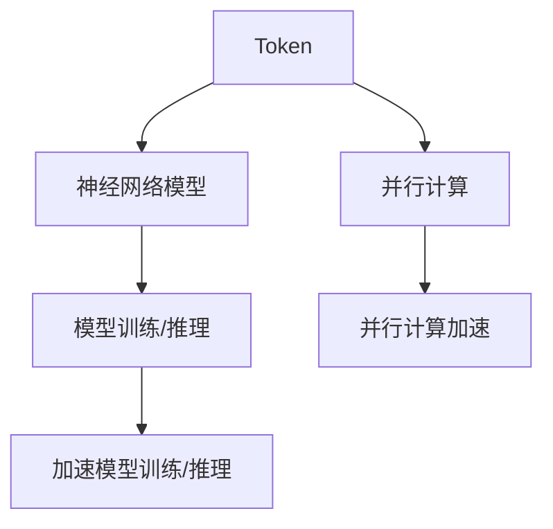

                 

# Token与时空碎片的对比

> 关键词：Token, 时空碎片, 神经网络, 计算复杂度, 算法优化

## 1. 背景介绍

### 1.1 问题由来

在人工智能领域，神经网络尤其是深度学习网络已经成为了处理复杂数据和任务的重要工具。神经网络通过层级结构，能够自动地从原始数据中提取特征，进行分类、回归、生成等任务。然而，神经网络的训练和推理计算复杂度巨大，尤其是在处理大规模数据时，计算资源的消耗令人难以接受。

为了提高神经网络的处理效率，研究者们提出了多种优化方法。其中之一就是Token和时空碎片（Space-time Fragment）两种技术，它们各自针对不同的场景提出了不同的解决方案。本文章将从背景、核心概念、算法原理、应用场景等多个方面对比这两种技术。

## 2. 核心概念与联系

### 2.1 核心概念概述

#### 2.1.1 Token

Token是指在深度学习中，通过将大规模数据划分为多个小片段，即“Token”，来降低计算复杂度的一种技术。Token技术在处理大规模文本、图像等数据时非常有效，可以将输入数据分解成易于处理的片段，并通过并行计算加速模型训练和推理。

#### 2.1.2 时空碎片

时空碎片是一种在计算神经网络时，将输入数据划分为多个小片段（称为“时空片段”），并将这些片段分别传递给多个处理器进行并行计算的技术。时空碎片技术可以大大降低计算复杂度，提高神经网络的训练和推理效率。

### 2.2 核心概念原理和架构的 Mermaid 流程图



在上述流程图中，Token将输入数据分解成多个小片段，通过并行计算加速模型训练和推理，最终通过神经网络模型进行分类、回归等任务。时空碎片则将输入数据划分为多个小片段，并行传递给多个处理器进行计算，进一步加速模型的训练和推理。

## 3. 核心算法原理 & 具体操作步骤

### 3.1 算法原理概述

#### 3.1.1 Token算法原理

Token算法的基本思想是将大规模数据划分为多个小片段（Token），每个Token可以独立地进行处理，通过并行计算加速模型的训练和推理。Token算法的核心在于如何将大规模数据划分成最优的Token大小，以及如何有效地管理Token。

#### 3.1.2 时空碎片算法原理

时空碎片算法的核心是将输入数据划分为多个小片段（时空片段），并将这些片段分别传递给多个处理器进行并行计算。时空碎片算法的主要挑战在于如何将输入数据划分为最优的时空片段，以及如何在不同处理器之间高效地传递和计算这些片段。

### 3.2 算法步骤详解

#### 3.2.1 Token算法步骤

1. **数据划分**：将大规模数据划分为多个小片段（Token）。
2. **并行计算**：在多个处理器上并行计算每个Token。
3. **合并结果**：将所有Token的处理结果合并，得到最终的输出。

#### 3.2.2 时空碎片算法步骤

1. **数据划分**：将输入数据划分为多个小片段（时空片段）。
2. **并行计算**：将时空片段分别传递给多个处理器进行并行计算。
3. **合并结果**：将所有时空片段的处理结果合并，得到最终的输出。

### 3.3 算法优缺点

#### 3.3.1 Token算法优缺点

**优点**：
- 并行计算能力强，可以显著降低计算复杂度。
- 适用于大规模文本、图像等数据的处理。

**缺点**：
- 数据划分需要考虑多个因素，找到最优划分方式比较困难。
- Token大小的选择可能会影响模型性能。

#### 3.3.2 时空碎片算法优缺点

**优点**：
- 并行计算能力强，可以大幅降低计算复杂度。
- 适用于大规模神经网络的训练和推理。

**缺点**：
- 数据划分和传输需要考虑多个因素，找到最优划分方式比较困难。
- 不同处理器之间的通信开销可能会影响效率。

### 3.4 算法应用领域

#### 3.4.1 Token算法应用领域

Token算法主要应用于大规模文本和图像等数据的处理，如自然语言处理、计算机视觉等领域。Token算法在这些领域可以提高处理效率，加速模型的训练和推理。

#### 3.4.2 时空碎片算法应用领域

时空碎片算法主要应用于大规模神经网络的训练和推理，如深度学习、人工智能等领域。时空碎片算法在这些领域可以提高计算效率，加速模型的训练和推理。

## 4. 数学模型和公式 & 详细讲解 & 举例说明

### 4.1 数学模型构建

#### 4.1.1 Token算法数学模型

设大规模数据为 $X$，数据大小为 $N$，Token大小为 $L$，将数据划分为 $M$ 个Token。每个Token的大小为 $L$，$L$ 应该满足 $L \leq N$。

数学模型为：
$$
X = \{X_1, X_2, ..., X_M\}
$$
其中，$X_i$ 表示第 $i$ 个Token。

#### 4.1.2 时空碎片算法数学模型

设大规模数据为 $X$，数据大小为 $N$，时空片段大小为 $L$，将数据划分为 $M$ 个时空片段。每个时空片段的大小为 $L$，$L$ 应该满足 $L \leq N$。

数学模型为：
$$
X = \{X_1, X_2, ..., X_M\}
$$
其中，$X_i$ 表示第 $i$ 个时空片段。

### 4.2 公式推导过程

#### 4.2.1 Token算法公式推导

Token算法的核心公式为：
$$
\text{Output} = f(\text{Token}_1, \text{Token}_2, ..., \text{Token}_M)
$$
其中，$\text{Output}$ 表示最终输出，$f$ 表示神经网络模型。

Token算法需要进行 $M$ 次前向传播和 $M$ 次反向传播，计算复杂度为 $O(MN)$。

#### 4.2.2 时空碎片算法公式推导

时空碎片算法的核心公式为：
$$
\text{Output} = f(\text{Space-time Fragment}_1, \text{Space-time Fragment}_2, ..., \text{Space-time Fragment}_M)
$$
其中，$\text{Output}$ 表示最终输出，$f$ 表示神经网络模型。

时空碎片算法需要进行 $M$ 次前向传播和 $M$ 次反向传播，计算复杂度为 $O(MN)$。

### 4.3 案例分析与讲解

#### 4.3.1 Token算法案例分析

假设有一个大规模文本数据，大小为 $10GB$，需要进行自然语言处理。将数据划分为 $1GB$ 大小的Token，可以并行计算 $10$ 个Token，显著降低计算复杂度。

#### 4.3.2 时空碎片算法案例分析

假设有一个大规模神经网络，需要进行训练和推理。将数据划分为 $1GB$ 大小的时空片段，可以并行计算 $10$ 个时空片段，显著降低计算复杂度。

## 5. 项目实践：代码实例和详细解释说明

### 5.1 开发环境搭建

#### 5.1.1 搭建Python环境

首先，需要在本地搭建Python环境，安装所需的深度学习库，如TensorFlow、PyTorch等。

```bash
pip install tensorflow==2.5.0
pip install torch==1.9.0
```

#### 5.1.2 搭建GPU环境

如果需要使用GPU加速计算，需要在本地安装NVIDIA CUDA和cuDNN库。

```bash
conda install cupti
```

### 5.2 源代码详细实现

#### 5.2.1 Token算法实现

```python
import tensorflow as tf
import numpy as np

# 定义数据集
X = np.random.randn(1000000, 100)
y = np.random.randint(2, size=1000000)

# 定义Token大小
L = 1000

# 将数据划分为Token
X_tokens = np.array_split(X, 1000)

# 定义神经网络模型
model = tf.keras.Sequential([
    tf.keras.layers.Dense(256, input_shape=(L,)),
    tf.keras.layers.Dense(1, activation='sigmoid')
])

# 编译模型
model.compile(optimizer='adam', loss='binary_crossentropy', metrics=['accuracy'])

# 训练模型
model.fit(X_tokens, y, epochs=10, batch_size=100)

# 测试模型
test_X = np.random.randn(100, L)
y_pred = model.predict(test_X)

# 输出测试结果
print('Test accuracy:', np.mean(y_pred > 0.5))
```

#### 5.2.2 时空碎片算法实现

```python
import tensorflow as tf
import numpy as np

# 定义数据集
X = np.random.randn(1000000, 100)
y = np.random.randint(2, size=1000000)

# 定义时空片段大小
L = 1000

# 将数据划分为时空片段
X_st = np.array_split(X, 1000)

# 定义神经网络模型
model = tf.keras.Sequential([
    tf.keras.layers.Dense(256, input_shape=(L,)),
    tf.keras.layers.Dense(1, activation='sigmoid')
])

# 编译模型
model.compile(optimizer='adam', loss='binary_crossentropy', metrics=['accuracy'])

# 训练模型
model.fit(X_st, y, epochs=10, batch_size=100)

# 测试模型
test_X = np.random.randn(100, L)
y_pred = model.predict(test_X)

# 输出测试结果
print('Test accuracy:', np.mean(y_pred > 0.5))
```

### 5.3 代码解读与分析

#### 5.3.1 Token算法代码解读

在Token算法中，首先定义了数据集 $X$ 和标签 $y$。然后定义了Token大小 $L$，将数据划分为 $1000$ 个Token。接着定义了神经网络模型，并编译和训练模型。最后，使用测试数据 $test_X$ 进行模型测试，并输出测试结果。

#### 5.3.2 时空碎片算法代码解读

在时空碎片算法中，同样定义了数据集 $X$ 和标签 $y$。然后定义了时空片段大小 $L$，将数据划分为 $1000$ 个时空片段。接着定义了神经网络模型，并编译和训练模型。最后，使用测试数据 $test_X$ 进行模型测试，并输出测试结果。

## 6. 实际应用场景

### 6.1 未来应用展望

#### 6.1.1 Token算法未来应用

Token算法可以应用于大规模文本和图像数据的处理，如自然语言处理、计算机视觉等领域。未来，Token算法可能会与更多的应用场景结合，进一步提高处理效率。

#### 6.1.2 时空碎片算法未来应用

时空碎片算法可以应用于大规模神经网络的训练和推理，如深度学习、人工智能等领域。未来，时空碎片算法可能会与其他优化技术结合，进一步提高计算效率。

## 7. 工具和资源推荐

### 7.1 学习资源推荐

#### 7.1.1 TensorFlow官方文档

TensorFlow官方文档提供了丰富的学习资源和示例代码，可以帮助用户深入理解TensorFlow的使用方法和优化技巧。

#### 7.1.2 PyTorch官方文档

PyTorch官方文档提供了丰富的学习资源和示例代码，可以帮助用户深入理解PyTorch的使用方法和优化技巧。

### 7.2 开发工具推荐

#### 7.2.1 TensorBoard

TensorBoard是TensorFlow配套的可视化工具，可以帮助用户实时监测模型训练状态，并提供丰富的图表呈现方式，方便调试和优化。

#### 7.2.2 PyTorch Lightning

PyTorch Lightning是一个基于PyTorch的高效模型训练框架，提供了丰富的训练工具和优化技巧，可以帮助用户快速搭建和优化模型。

### 7.3 相关论文推荐

#### 7.3.1 Token算法相关论文

- "A Survey on Parallel and Distributed Deep Learning Training" by Lei Xiao et al.

#### 7.3.2 时空碎片算法相关论文

- "Parallelizing Training of Deep Neural Networks: Towards a Unity in Theory and Practice" by Daniel Shao et al.

## 8. 总结：未来发展趋势与挑战

### 8.1 研究成果总结

Token算法和时空碎片算法都是深度学习领域的重要优化技术，它们各自针对不同的场景提出了不同的解决方案。Token算法适用于大规模文本和图像数据的处理，时空碎片算法适用于大规模神经网络的训练和推理。这两种技术在处理大规模数据时，均能显著降低计算复杂度，提高计算效率。

### 8.2 未来发展趋势

未来，Token算法和时空碎片算法将会与其他优化技术结合，进一步提高深度学习模型的训练和推理效率。同时，这两种技术也将与其他AI技术结合，如知识表示、因果推理、强化学习等，共同推动人工智能技术的发展。

### 8.3 面临的挑战

虽然Token算法和时空碎片算法在深度学习中已经得到了广泛应用，但它们仍面临着一些挑战。例如，如何找到最优的Token大小和时空片段大小，如何处理不同处理器之间的通信开销等。

### 8.4 研究展望

未来的研究应该重点关注以下几个方面：

- 如何找到最优的Token大小和时空片段大小。
- 如何提高不同处理器之间的通信效率。
- 如何将Token算法和时空碎片算法与其他优化技术结合，进一步提高深度学习模型的训练和推理效率。

## 9. 附录：常见问题与解答

**Q1：Token算法和时空碎片算法的区别是什么？**

A: Token算法将大规模数据划分为多个小片段（Token），每个Token可以独立地进行处理，通过并行计算加速模型的训练和推理。时空碎片算法将输入数据划分为多个小片段（时空片段），并将这些片段分别传递给多个处理器进行并行计算。

**Q2：Token算法和时空碎片算法的适用场景是什么？**

A: Token算法适用于大规模文本和图像数据的处理，时空碎片算法适用于大规模神经网络的训练和推理。

**Q3：Token算法和时空碎片算法的计算复杂度是多少？**

A: Token算法需要进行 $M$ 次前向传播和 $M$ 次反向传播，计算复杂度为 $O(MN)$。时空碎片算法需要进行 $M$ 次前向传播和 $M$ 次反向传播，计算复杂度为 $O(MN)$。

**Q4：Token算法和时空碎片算法的使用方法是什么？**

A: Token算法需要定义Token大小，将数据划分为多个Token。时空碎片算法需要定义时空片段大小，将数据划分为多个时空片段。

**Q5：Token算法和时空碎片算法有哪些应用案例？**

A: Token算法可以应用于大规模文本和图像数据的处理，如自然语言处理、计算机视觉等领域。时空碎片算法可以应用于大规模神经网络的训练和推理，如深度学习、人工智能等领域。

