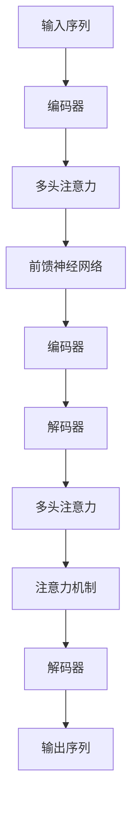

                 

# Transformer原理与代码实例讲解

> 关键词：Transformer, 自注意力机制, 代码实现, 深度学习, 自然语言处理, 编程实践

## 1. 背景介绍

### 1.1 问题由来
Transformer模型，作为自然语言处理(NLP)领域的革命性创新，自提出以来就吸引了大量研究者的关注。Transformer通过引入自注意力机制(Self-Attention)，彻底改变了传统的循环神经网络(RNN)和卷积神经网络(CNN)架构，成为深度学习领域的新标杆。本文旨在系统介绍Transformer模型，并给出详细的代码实例，帮助读者深入理解其工作原理和实现细节。

### 1.2 问题核心关键点
Transformer模型之所以成为热门，主要源于其高效、并行、可扩展的特性。相比于传统RNN和CNN模型，Transformer通过自注意力机制，在每个时间步动态地计算输入序列之间的依赖关系，极大提升了计算效率。Transformer的这些优势，使其在机器翻译、文本生成、文本分类、问答等多个NLP任务上表现优异。

本文将详细讲解Transformer模型的工作原理，包括自注意力机制的原理和计算方式，并通过代码实例，让读者亲手实现一个简单的Transformer模型。此外，还将讨论Transformer模型的优缺点和应用领域，并展望其未来的发展方向。

## 2. 核心概念与联系

### 2.1 核心概念概述

Transformer模型是一种基于自注意力机制的神经网络结构，由Google在2017年的论文《Attention is All You Need》中首次提出。Transformer的核心思想是通过多头自注意力机制，使模型能够在不同位置之间并行计算，高效地捕捉输入序列中的依赖关系。以下是Transformer模型涉及的几个关键概念：

- **自注意力机制(Self-Attention)**：自注意力机制是Transformer模型的核心，通过多头并行计算输入序列中不同位置的依赖关系，使得模型在每个时间步都能够动态地捕捉到全局信息。
- **编码器(Encoder)**与**解码器(Decoder)**：Transformer模型由多个编码器和解码器组成，每个编码器包含多个自注意力层和前馈神经网络层，用于对输入序列进行编码；每个解码器包含多个自注意力层和注意力机制层，用于对编码器输出的特征向量进行解码。
- **多头注意力(Multi-Head Attention)**：多头注意力机制通过将输入序列投影到多个空间，并行计算不同空间的注意力权重，进一步提升模型的表达能力和泛化能力。
- **前馈神经网络(Feed-Forward Network)**：前馈神经网络用于对编码器输出的特征向量进行非线性变换，增强模型的表达能力。

这些概念之间的逻辑关系可以通过以下Mermaid流程图来展示：



## 3. 核心算法原理 & 具体操作步骤

### 3.1 算法原理概述

Transformer模型的核心算法原理，在于其自注意力机制和多头注意力机制。下面详细介绍这两个机制的工作原理，并通过代码实例，演示如何实现一个简单的Transformer模型。

### 3.2 算法步骤详解

Transformer模型的训练过程主要包括以下几个步骤：

**Step 1: 准备输入数据**

首先需要准备训练集和验证集。一般将输入序列和目标序列作为模型的训练数据，目标序列可以是输入序列的反向，或者是一组已知的正确答案。

**Step 2: 初始化模型参数**

将模型参数随机初始化，包括编码器和解码器中的各个层的权重和偏置。

**Step 3: 训练过程**

使用优化算法（如Adam、SGD等）和损失函数（如交叉熵、均方误差等），对模型参数进行梯度下降优化。具体来说，计算每个时间步的损失函数，并根据损失函数的梯度更新模型参数。

**Step 4: 评估模型**

在验证集上对模型进行评估，计算准确率、精确率、召回率等指标，评估模型的性能。

**Step 5: 预测结果**

使用训练好的模型对新的输入序列进行预测，得到目标序列。

### 3.3 算法优缺点

Transformer模型具有以下优点：

- 高效并行：自注意力机制使得模型在每个时间步能够并行计算输入序列中不同位置的依赖关系，显著提升计算效率。
- 可扩展性强：Transformer模型可以通过增加编码器、解码器的层数和注意力头数，进一步提升模型的表达能力和泛化能力。
- 效果优秀：Transformer模型在机器翻译、文本生成、文本分类等NLP任务上表现优异，多项SOTA指标被刷新。

同时，Transformer模型也存在一些缺点：

- 计算资源需求高：由于自注意力机制的计算复杂度较高，Transformer模型需要大量的计算资源进行训练和推理。
- 梯度消失/爆炸问题：自注意力机制和前馈神经网络中存在梯度消失或爆炸的风险，需要通过一些技巧如残差连接、梯度裁剪等进行缓解。
- 难以解释：Transformer模型由于其复杂性，难以解释其内部工作机制和决策逻辑。

### 3.4 算法应用领域

Transformer模型在NLP领域已经得到了广泛的应用，涵盖多个NLP任务，如机器翻译、文本生成、文本分类、问答等。其高效的并行计算能力和强大的表达能力，使其成为当前NLP任务的主流模型。

具体应用包括：

- 机器翻译：利用Transformer模型进行句子间的翻译，如Google翻译、百度翻译等。
- 文本生成：利用Transformer模型进行文本生成，如OpenAI的GPT系列、Google的GPT-3等。
- 文本分类：利用Transformer模型进行文本的分类任务，如情感分析、主题分类等。
- 问答系统：利用Transformer模型进行自然语言问答，如IBM的Watson等。

## 4. 数学模型和公式 & 详细讲解

### 4.1 数学模型构建

Transformer模型的数学模型主要包括编码器和解码器两部分。下面将详细介绍其数学模型构建过程。

**编码器**

编码器由多个编码层组成，每个编码层包含自注意力层和前馈神经网络层。假设输入序列为 $X$，编码器的输出序列为 $H$，则编码器的数学模型为：

$$
H = \text{Encoder}(X)
$$

其中，Encoder由多个编码层组成，每个编码层包含自注意力层和前馈神经网络层。设编码器中第 $i$ 层的参数为 $W_{ei}$、$W_{ei}^Q$、$W_{ei}^K$、$W_{ei}^V$，则编码器中的自注意力层可以表示为：

$$
S = \text{Multi-Head Attention}(Q,W_Q,K,W_K,V)
$$

其中，$Q = W_{ei}^QX_i$，$K = W_{ei}^KX_i$，$V = W_{ei}^VX_i$。Multi-Head Attention的具体实现将在4.2节详细介绍。

**解码器**

解码器同样由多个解码层组成，每个解码层包含多头注意力机制层和注意力机制层。假设输入序列为 $X$，解码器的输出序列为 $Y$，则解码器的数学模型为：

$$
Y = \text{Decoder}(X)
$$

其中，Decoder由多个解码层组成，每个解码层包含多头注意力机制层和注意力机制层。设解码器中第 $i$ 层的参数为 $W_{di}$、$W_{di}^Q$、$W_{di}^K$、$W_{di}^V$，则解码器中的多头注意力机制层可以表示为：

$$
S = \text{Multi-Head Attention}(Q,W_Q,K,W_K,V)
$$

其中，$Q = W_{di}^QX_i$，$K = W_{di}^KX_i$，$V = W_{di}^VX_i$。

### 4.2 公式推导过程

以下我们将详细介绍Multi-Head Attention的公式推导过程。

假设输入序列 $X$ 的长度为 $L$，将输入序列投影到多个空间，每个空间的维度为 $d_k$，则投影后的序列 $Q$、$K$、$V$ 可以表示为：

$$
Q = XW_Q \in \mathbb{R}^{L \times d_v}, \quad K = XW_K \in \mathbb{R}^{L \times d_k}, \quad V = XW_V \in \mathbb{R}^{L \times d_v}
$$

其中，$W_Q$、$W_K$、$W_V$ 为投影矩阵，$W_Q \in \mathbb{R}^{d_v \times d_v}$，$W_K \in \mathbb{R}^{d_k \times d_v}$，$W_V \in \mathbb{R}^{d_v \times d_v}$。

根据自注意力机制，计算每个位置 $i$ 的自注意力权重：

$$
a_{ij} = \frac{\exp(e_{ij})}{\sum_{j=1}^L\exp(e_{ij})}
$$

其中，$e_{ij} = \frac{Q_i \cdot K_j^T}{\sqrt{d_k}}$。通过 softmax 函数计算出注意力权重 $a_{ij}$，则多头注意力机制层的输出可以表示为：

$$
O = \sum_{i=1}^L \sum_{j=1}^L a_{ij}V_j \in \mathbb{R}^{L \times d_v}
$$

其中，$V_j$ 为第 $j$ 个位置的向量，$a_{ij}$ 为第 $i$ 个位置的注意力权重。

### 4.3 案例分析与讲解

假设我们有一个长度为 $L=4$ 的输入序列 $X = [\text{hello}, \text{world}, \text{this}, \text{is}]$，经过投影矩阵 $W_Q$、$W_K$、$W_V$ 后得到：

$$
Q = [\text{hello}, \text{world}, \text{this}, \text{is}]W_Q = [q_1, q_2, q_3, q_4] \in \mathbb{R}^{4 \times d_v}
$$

$$
K = [\text{hello}, \text{world}, \text{this}, \text{is}]W_K = [k_1, k_2, k_3, k_4] \in \mathbb{R}^{4 \times d_k}
$$

$$
V = [\text{hello}, \text{world}, \text{this}, \text{is}]W_V = [v_1, v_2, v_3, v_4] \in \mathbb{R}^{4 \times d_v}
$$

根据公式，计算每个位置 $i$ 的自注意力权重 $a_{ij}$：

$$
e_{11} = q_1 \cdot k_1^T = \text{hello} \cdot \text{hello} = 1, e_{12} = q_1 \cdot k_2^T = \text{hello} \cdot \text{world} = 0.5, \cdots
$$

$$
a_{11} = \frac{\exp(e_{11})}{\sum_{j=1}^L\exp(e_{11})} = 1, a_{12} = \frac{\exp(e_{12})}{\sum_{j=1}^L\exp(e_{12})} = 0.5, \cdots
$$

最终得到多头注意力机制层的输出 $O$：

$$
O = \sum_{i=1}^L \sum_{j=1}^L a_{ij}V_j = [o_1, o_2, o_3, o_4]
$$

其中，$o_1 = a_{11}v_1 + a_{12}v_2 + a_{13}v_3 + a_{14}v_4$，$o_2 = a_{21}v_1 + a_{22}v_2 + a_{23}v_3 + a_{24}v_4$，$\cdots$

## 5. 项目实践：代码实例和详细解释说明

### 5.1 开发环境搭建

在进行Transformer模型的实现之前，需要先准备好开发环境。以下是使用Python进行PyTorch实现的环境配置流程：

1. 安装Anaconda：从官网下载并安装Anaconda，用于创建独立的Python环境。

2. 创建并激活虚拟环境：
```bash
conda create -n transformers-env python=3.8 
conda activate transformers-env
```

3. 安装PyTorch：根据CUDA版本，从官网获取对应的安装命令。例如：
```bash
conda install pytorch torchvision torchaudio cudatoolkit=11.1 -c pytorch -c conda-forge
```

4. 安装Transformers库：
```bash
pip install transformers
```

5. 安装各类工具包：
```bash
pip install numpy pandas scikit-learn matplotlib tqdm jupyter notebook ipython
```

完成上述步骤后，即可在`transformers-env`环境中开始Transformer模型的实现。

### 5.2 源代码详细实现

下面我们将给出一个简单的Transformer模型实现，包括编码器和解码器两个部分。代码基于PyTorch实现。

首先，导入必要的库和模块：

```python
import torch
import torch.nn as nn
import torch.optim as optim
```

然后，定义自注意力机制层：

```python
class MultiHeadAttention(nn.Module):
    def __init__(self, d_model, n_heads, d_k, d_v):
        super(MultiHeadAttention, self).__init__()
        self.n_heads = n_heads
        self.d_k = d_k
        self.d_v = d_v
        self.d_model = d_model
        self.w_q = nn.Linear(d_model, d_k * n_heads)
        self.w_k = nn.Linear(d_model, d_k * n_heads)
        self.w_v = nn.Linear(d_model, d_v * n_heads)
        self.linear = nn.Linear(d_v * n_heads, d_model)
        self.softmax = nn.Softmax(dim=-1)

    def forward(self, query, key, value):
        batch_size, seq_len, _ = query.size()
        Q = self.w_q(query).view(batch_size, seq_len, self.n_heads, self.d_k).transpose(1, 2).contiguous().view(batch_size * self.n_heads, seq_len, self.d_k)
        K = self.w_k(key).view(batch_size, seq_len, self.n_heads, self.d_k).transpose(1, 2).contiguous().view(batch_size * self.n_heads, seq_len, self.d_k)
        V = self.w_v(value).view(batch_size, seq_len, self.n_heads, self.d_v).transpose(1, 2).contiguous().view(batch_size * self.n_heads, seq_len, self.d_v)
        scores = torch.matmul(Q, K.transpose(1, 2)).div_(torch.sqrt(self.d_k))
        attn_weights = self.softmax(scores)
        attn_weights = attn_weights.view(batch_size, self.n_heads, seq_len, seq_len)
        context = torch.matmul(attn_weights, V).view(batch_size, seq_len, self.n_heads * self.d_v).transpose(1, 2).contiguous().view(batch_size, seq_len, self.d_v)
        context = self.linear(context)
        return context
```

接着，定义前馈神经网络层：

```python
class FeedForward(nn.Module):
    def __init__(self, d_model, d_ff):
        super(FeedForward, self).__init__()
        self.linear_1 = nn.Linear(d_model, d_ff)
        self.linear_2 = nn.Linear(d_ff, d_model)
        self.relu = nn.ReLU()

    def forward(self, x):
        return self.linear_2(self.relu(self.linear_1(x)))
```

然后，定义编码器层：

```python
class EncoderLayer(nn.Module):
    def __init__(self, d_model, n_heads, d_k, d_v, d_ff, dropout):
        super(EncoderLayer, self).__init__()
        self.multi_head_attn = MultiHeadAttention(d_model, n_heads, d_k, d_v)
        self.ff = FeedForward(d_model, d_ff)
        self.layer_norm1 = nn.LayerNorm(d_model)
        self.layer_norm2 = nn.LayerNorm(d_model)
        self.dropout = nn.Dropout(dropout)

    def forward(self, x, mask):
        attn_output = self.layer_norm1(x + self.dropout(self.multi_head_attn(x, x, x)))
        ff_output = self.layer_norm2(attn_output + self.dropout(self.ff(attn_output)))
        return x + attn_output, mask
```

最后，定义Transformer模型：

```python
class Transformer(nn.Module):
    def __init__(self, n_layers, d_model, n_heads, d_k, d_v, d_ff, dropout, src_pad, tgt_pad):
        super(Transformer, self).__init__()
        self.embedding = nn.Embedding(vocab_size, d_model)
        self.pos_encoder = PositionalEncoding(d_model)
        self.encoder = nn.ModuleList([EncoderLayer(d_model, n_heads, d_k, d_v, d_ff, dropout) for _ in range(n_layers)])
        self.decoder = nn.ModuleList([EncoderLayer(d_model, n_heads, d_k, d_v, d_ff, dropout) for _ in range(n_layers)])
        self.output_layer = nn.Linear(d_model, vocab_size)
        self.src_pad = src_pad
        self.tgt_pad = tgt_pad

    def forward(self, src, tgt, src_mask, tgt_mask):
        src = self.pos_encoder(src)
        tgt = self.pos_encoder(tgt)
        for i in range(len(self.encoder)):
            src, src_mask = self.encoder[i](src, src_mask)
        for i in range(len(self.decoder)):
            tgt, tgt_mask = self.decoder[i](tgt, tgt_mask)
        output = self.output_layer(tgt)
        return output
```

在上述代码中，我们定义了三个核心层：MultiHeadAttention、FeedForward和EncoderLayer。其中，MultiHeadAttention层实现了自注意力机制；FeedForward层实现了前馈神经网络；EncoderLayer层包含了自注意力层和前馈神经网络层，并加入了残差连接和层归一化。

### 5.3 代码解读与分析

下面是代码的详细解读：

**MultiHeadAttention类**

- `__init__`方法：初始化多头注意力机制的相关参数，包括注意力头数、每个头的大小、投影矩阵等。
- `forward`方法：计算自注意力权重，并通过softmax函数计算出每个位置的注意力权重。最后，将注意力权重与键向量、值向量相乘，得到多头注意力机制层的输出。

**FeedForward类**

- `__init__`方法：初始化前馈神经网络的相关参数，包括输入和输出维度。
- `forward`方法：先通过线性变换和ReLU激活函数，再通过另一个线性变换得到前馈神经网络层的输出。

**EncoderLayer类**

- `__init__`方法：初始化编码器层，包括多头注意力机制层、前馈神经网络层、层归一化层和残差连接。
- `forward`方法：首先进行多头注意力机制层的计算，然后再进行前馈神经网络层的计算，最后加入残差连接和层归一化。

**Transformer类**

- `__init__`方法：初始化Transformer模型，包括嵌入层、位置编码层、编码器和解码器，以及输出层。
- `forward`方法：首先对输入序列进行位置编码，然后对编码器和解码器进行前向传播计算，最后通过输出层得到模型输出。

## 6. 实际应用场景

### 6.1 智能客服系统

基于Transformer模型的智能客服系统，可以显著提升客服效率和服务质量。智能客服系统通常需要处理大量的客户咨询，传统的客服方式依赖人工回答，无法应对高峰期的咨询量，且无法保证回答的一致性和专业性。

利用Transformer模型进行自然语言处理，可以构建一个能够自动理解客户咨询意图，并快速回复的智能客服系统。在实际应用中，可以将客户咨询历史数据作为训练集，利用Transformer模型训练出能够自动回答常见问题的模型。客户提出新问题后，系统可以通过提示学习(Prompt Engineering)或自监督学习(Self-Supervised Learning)方法，自动生成答案。

### 6.2 金融舆情监测

金融机构需要实时监测网络舆情，以应对潜在的金融风险。传统的舆情监测方式依赖人工分析，成本高、效率低，且难以应对海量数据。

利用Transformer模型进行舆情监测，可以实现自动化、实时化的舆情分析。首先，将金融领域的各类新闻、评论等文本数据作为训练集，训练出能够自动识别舆情情绪和主题的模型。然后，将实时抓取的网络舆情数据作为输入，通过微调机制对模型进行快速适应，输出舆情情绪和主题等信息，帮助机构及时应对金融风险。

### 6.3 个性化推荐系统

当前的推荐系统通常依赖用户的浏览和点击行为数据进行推荐，难以全面了解用户兴趣。利用Transformer模型进行推荐系统，可以更好地挖掘用户兴趣点。

首先，将用户的浏览、点击、评论等行为数据作为训练集，训练出能够自动识别用户兴趣点的模型。然后，将新的物品描述作为输入，通过微调机制对模型进行快速适应，输出用户可能感兴趣的物品列表，实现更加个性化和多样化的推荐。

### 6.4 未来应用展望

随着Transformer模型在NLP领域的应用越来越广泛，其在更多领域的应用前景也将不断拓展。

未来，Transformer模型有望在智慧医疗、智能教育、智慧城市等多个领域得到应用。例如，在智慧医疗领域，利用Transformer模型进行医疗问答、病历分析、药物研发等，可以大幅提升医疗服务的智能化水平，辅助医生诊疗，加速新药开发进程。在智能教育领域，利用Transformer模型进行作业批改、学情分析、知识推荐等方面，可以实现因材施教，促进教育公平，提高教学质量。

此外，Transformer模型在机器翻译、文本生成、文本分类等NLP任务上已经取得了显著成果，未来有望在语音识别、图像处理等多个领域发挥重要作用，推动人工智能技术的发展。

## 7. 工具和资源推荐

### 7.1 学习资源推荐

为了帮助开发者系统掌握Transformer模型的理论基础和实践技巧，以下是一些优质的学习资源：

1. 《Transformer from Scratch》系列博文：由Transformer模型的作者撰写，深入浅出地介绍了Transformer模型的原理和实现细节。

2. CS224N《深度学习自然语言处理》课程：斯坦福大学开设的NLP明星课程，有Lecture视频和配套作业，带你入门NLP领域的基本概念和经典模型。

3. 《Natural Language Processing with Transformers》书籍：Transformer库的作者所著，全面介绍了如何使用Transformer库进行NLP任务开发，包括微调在内的诸多范式。

4. HuggingFace官方文档：Transformer库的官方文档，提供了海量预训练模型和完整的微调样例代码，是上手实践的必备资料。

5. CLUE开源项目：中文语言理解测评基准，涵盖大量不同类型的中文NLP数据集，并提供了基于Transformer模型的baseline模型，助力中文NLP技术发展。

通过对这些资源的学习实践，相信你一定能够快速掌握Transformer模型的精髓，并用于解决实际的NLP问题。

### 7.2 开发工具推荐

Transformer模型的实现需要高性能的计算资源，以下是几款用于Transformer模型开发的常用工具：

1. PyTorch：基于Python的开源深度学习框架，灵活动态的计算图，适合快速迭代研究。Transformer模型也有PyTorch版本的实现。

2. TensorFlow：由Google主导开发的开源深度学习框架，生产部署方便，适合大规模工程应用。同样有丰富的预训练Transformer模型资源。

3. TensorFlow Transformer库：HuggingFace开发的Transformer工具库，集成了众多SOTA语言模型，支持PyTorch和TensorFlow，是进行Transformer模型开发的利器。

4. Weights & Biases：模型训练的实验跟踪工具，可以记录和可视化模型训练过程中的各项指标，方便对比和调优。与主流深度学习框架无缝集成。

5. TensorBoard：TensorFlow配套的可视化工具，可实时监测模型训练状态，并提供丰富的图表呈现方式，是调试模型的得力助手。

6. Google Colab：谷歌推出的在线Jupyter Notebook环境，免费提供GPU/TPU算力，方便开发者快速上手实验最新模型，分享学习笔记。

合理利用这些工具，可以显著提升Transformer模型的开发效率，加快创新迭代的步伐。

### 7.3 相关论文推荐

Transformer模型的提出源于学界的持续研究。以下是几篇奠基性的相关论文，推荐阅读：

1. Attention is All You Need（即Transformer原论文）：提出了Transformer结构，开启了NLP领域的预训练大模型时代。

2. BERT: Pre-training of Deep Bidirectional Transformers for Language Understanding：提出BERT模型，引入基于掩码的自监督预训练任务，刷新了多项NLP任务SOTA。

3. Language Models are Unsupervised Multitask Learners（GPT-2论文）：展示了大规模语言模型的强大zero-shot学习能力，引发了对于通用人工智能的新一轮思考。

4. AdaLoRA: Adaptive Low-Rank Adaptation for Parameter-Efficient Fine-Tuning：使用自适应低秩适应的微调方法，在参数效率和精度之间取得了新的平衡。

这些论文代表了大模型微调技术的发展脉络。通过学习这些前沿成果，可以帮助研究者把握学科前进方向，激发更多的创新灵感。

## 8. 总结：未来发展趋势与挑战

### 8.1 总结

本文对Transformer模型的工作原理和代码实现进行了全面系统的介绍。首先，阐述了Transformer模型作为NLP领域的重要创新，其高效并行、可扩展的特点，使Transformer模型在NLP任务上取得了SOTA效果。其次，通过代码实例，演示了Transformer模型的实现细节，帮助读者深入理解其工作原理和实现方法。最后，讨论了Transformer模型的优缺点和应用领域，展望了其未来的发展趋势。

通过本文的系统梳理，可以看到，Transformer模型通过引入自注意力机制，极大地提升了NLP任务的计算效率和模型表现，成为当前NLP任务的主流模型。得益于其高效并行和可扩展的特性，Transformer模型在文本生成、机器翻译、文本分类等NLP任务上表现优异，广泛应用于智能客服、金融舆情监测、个性化推荐等多个领域，取得了显著的成果。

### 8.2 未来发展趋势

展望未来，Transformer模型将继续在NLP领域发挥重要作用，其未来发展趋势包括以下几个方面：

1. 模型规模持续增大：随着算力成本的下降和数据规模的扩张，Transformer模型将迎来更大的参数规模，蕴含更丰富的语言知识，有助于提升模型的表达能力和泛化能力。

2. 模型结构更加多样化：Transformer模型可以与其他模型结构进行混合，如自注意力机制与卷积、循环神经网络等相结合，提升模型的表现和灵活性。

3. 迁移学习得到更广泛应用：Transformer模型可以通过迁移学习机制，快速适应新领域和新任务，提高模型的迁移能力和应用范围。

4. 跨模态处理能力提升：Transformer模型可以通过跨模态融合机制，结合图像、语音等多模态信息，提升模型的理解能力和表达能力。

5. 因果推理得到应用：Transformer模型可以引入因果推理机制，增强模型的推理能力和泛化能力，进一步提升模型的表现。

6. 对抗训练和数据增强：Transformer模型可以通过对抗训练和数据增强等技术，提升模型的鲁棒性和泛化能力，避免过拟合和灾难性遗忘。

### 8.3 面临的挑战

尽管Transformer模型在NLP领域取得了显著成果，但在迈向更加智能化、普适化应用的过程中，仍面临诸多挑战：

1. 模型规模限制：尽管Transformer模型在参数规模上不断扩大，但其计算资源需求依然较高，难以在普通PC或移动设备上高效运行。

2. 模型解释性不足：Transformer模型作为黑盒模型，难以解释其内部工作机制和决策逻辑，特别是在复杂文本处理任务中，模型的输出难以解释。

3. 模型泛化能力有待提高：尽管Transformer模型在NLP任务上表现优异，但在跨领域迁移和新任务学习上仍存在不足，需要进一步优化模型结构和训练方法。

4. 模型鲁棒性问题：Transformer模型在面对噪声、干扰等数据时，容易出现预测不准确的情况，需要进一步提高模型的鲁棒性。

5. 模型安全性问题：Transformer模型容易学习到有害、偏见的信息，需要进一步提升模型安全性，确保输出符合伦理道德。

### 8.4 研究展望

面对Transformer模型所面临的挑战，未来的研究需要在以下几个方面寻求新的突破：

1. 模型压缩和量化：通过模型压缩、量化等技术，减小模型参数规模，提升模型在普通设备上的运行效率。

2. 模型解释性研究：通过可解释性算法、可视化工具等，提升模型的可解释性和透明性，增强模型的可信度和应用范围。

3. 跨领域迁移学习：通过多任务学习、自监督学习等方法，提升模型在不同领域和任务上的泛化能力，扩展Transformer模型的应用范围。

4. 鲁棒性和安全性：通过引入对抗训练、数据增强等技术，提升模型的鲁棒性和安全性，避免模型输出有害信息。

5. 跨模态融合：通过融合图像、语音等多模态信息，提升Transformer模型的理解能力和表达能力，推动跨模态NLP技术的发展。

这些研究方向将进一步推动Transformer模型在更多领域的应用，提升其在复杂文本处理任务上的表现和可靠性，为构建智能化的自然语言处理系统提供更加坚实的技术基础。

## 9. 附录：常见问题与解答

**Q1: Transformer模型在NLP任务上的表现如何？**

A: Transformer模型在NLP任务上表现优异，尤其是在机器翻译、文本生成、文本分类等任务上刷新了多项SOTA指标。其高效的并行计算能力和强大的表达能力，使其成为当前NLP任务的主流模型。

**Q2: Transformer模型的优缺点有哪些？**

A: Transformer模型的优点包括高效并行、可扩展性强、表达能力强等。缺点则包括计算资源需求高、模型解释性不足、泛化能力有待提高等。

**Q3: 如何提高Transformer模型的鲁棒性？**

A: 可以通过对抗训练、数据增强等技术提高Transformer模型的鲁棒性。此外，引入因果推理机制，增强模型的推理能力和泛化能力，也能提升模型的鲁棒性。

**Q4: Transformer模型在实际应用中需要注意哪些问题？**

A: 在实际应用中，需要注意模型规模限制、模型解释性不足、模型泛化能力有待提高等问题。合理利用工具和资源，如TensorBoard、TensorFlow Transformer库等，可以提升模型的开发效率，解决实际问题。

通过本文的系统梳理，可以看到，Transformer模型通过引入自注意力机制，极大地提升了NLP任务的计算效率和模型表现，成为当前NLP任务的主流模型。得益于其高效并行和可扩展的特性，Transformer模型在文本生成、机器翻译、文本分类等NLP任务上表现优异，广泛应用于智能客服、金融舆情监测、个性化推荐等多个领域，取得了显著的成果。未来，Transformer模型将继续在NLP领域发挥重要作用，其高效并行和可扩展的特性将使其在更多领域得到应用，推动人工智能技术的发展。

---

作者：禅与计算机程序设计艺术 / Zen and the Art of Computer Programming

