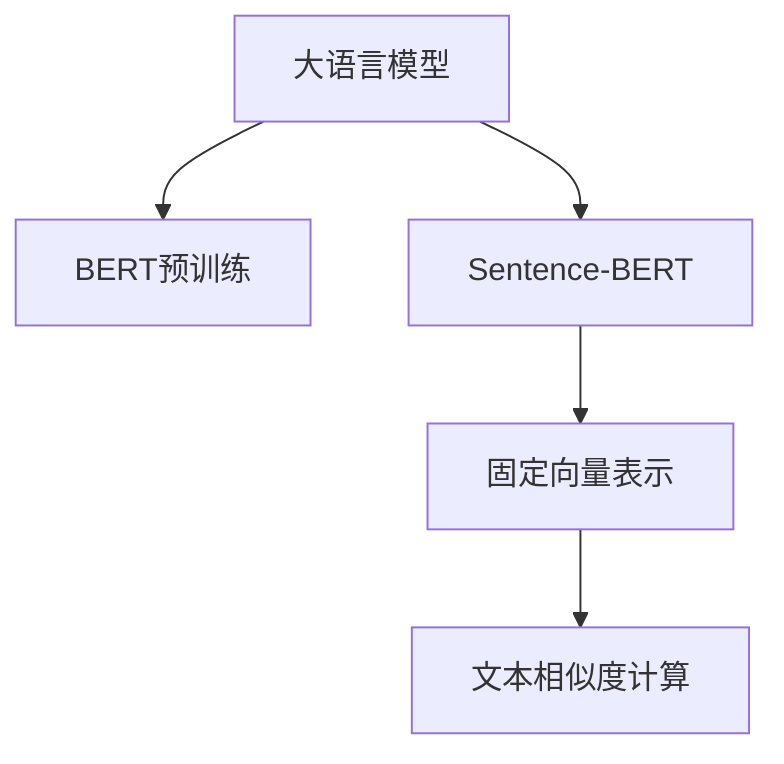

                 

# Transformer大模型实战 用Sentence-BERT模型寻找类似句子

> 关键词：Transformer, Sentence-BERT, 相似句子, 向量空间模型, 自然语言处理(NLP), 文本相似度计算

## 1. 背景介绍

### 1.1 问题由来
在自然语言处理(NLP)领域，寻找文本的相似度是一个经典问题。在文本检索、信息过滤、文本聚类、问答系统等应用中，文本相似度计算都有广泛的应用。然而，传统的基于词袋模型和TF-IDF等统计特征的相似度计算方法，由于忽略了语义信息，往往不能满足高精度文本匹配的需求。

Transformer大模型作为近年来NLP领域的重大突破，通过自注意力机制和位置编码等创新技术，已经超越了传统的神经网络模型，在多种NLP任务上取得了SOTA表现。其中，BERT、GPT-3等模型不仅在预训练过程中提取了丰富的语言语义，还可以通过微调快速适应特定任务，具有较强的泛化能力。

本文将深入探索如何利用Transformer大模型进行文本相似度计算，特别是Sentence-BERT模型。通过与其它方法的比较，展示Sentence-BERT模型在相似句子识别任务中的优异表现，并给出实际应用的代码示例和详细解释。

## 2. 核心概念与联系

### 2.1 核心概念概述

Transformer大模型，特别是BERT和GPT-3模型，通过预训练模型参数初始化，再通过微调优化，可以在下游任务中取得出色的性能。其中，Sentence-BERT是一种基于BERT的文本向量表示模型，将句子转换为固定维度的向量表示，用于文本相似度计算。

Sentence-BERT通过BERT模型将句子转换为向量表示，再通过平均池化或取最后一层向量作为句子的固定向量表示。该模型可以轻松地处理变长句子，支持高效的向量空间模型计算，用于判断句子之间的相似度。

### 2.2 核心概念原理和架构的 Mermaid 流程图



此流程图展示了从大语言模型到Sentence-BERT再到文本相似度计算的整个过程。预训练的BERT模型首先对文本进行编码，然后Sentence-BERT通过对编码结果进行平均池化或取最后一层向量作为句子的固定表示。最后，文本相似度计算可以使用余弦相似度、欧式距离等方法进行。

## 3. 核心算法原理 & 具体操作步骤

### 3.1 算法原理概述

Sentence-BERT模型的核心思想是通过BERT模型对句子进行编码，生成一个固定维度的向量表示，然后通过余弦相似度计算句子之间的相似度。具体来说，Sentence-BERT模型分为两个步骤：

1. **预训练和微调**：首先使用大规模无标签数据对BERT模型进行预训练，然后通过特定任务（如句子相似度计算）进行微调，使得模型能够更好地适应特定任务。

2. **向量生成**：对输入的句子进行编码，生成一个固定维度的向量表示。然后可以应用常见的向量空间模型（如余弦相似度）计算句子之间的相似度。

### 3.2 算法步骤详解

以下是Sentence-BERT模型的具体操作步骤：

1. **预训练BERT模型**：使用大规模无标签数据（如维基百科、新闻、书籍等）对BERT模型进行预训练。预训练的目标是让模型学习到通用的语言知识。

2. **微调Sentence-BERT模型**：通过特定任务（如句子相似度计算）进行微调。微调的目标是让模型能够更准确地识别相似句子。

3. **生成固定向量表示**：对输入的句子进行编码，生成一个固定维度的向量表示。可以选择平均池化或取最后一层向量作为句子的固定表示。

4. **计算文本相似度**：使用常见的向量空间模型（如余弦相似度）计算句子之间的相似度。

### 3.3 算法优缺点

Sentence-BERT模型有以下优点：

1. **高效的文本表示**：通过BERT模型生成固定维度的向量表示，可以处理变长句子，支持高效的向量空间模型计算。

2. **广泛的应用场景**：Sentence-BERT模型可以应用于多种文本相似度计算任务，如文本检索、信息过滤、文本聚类等。

3. **较好的泛化能力**：通过预训练和微调，Sentence-BERT模型可以适应不同领域的文本相似度计算需求。

但Sentence-BERT模型也存在一些缺点：

1. **对标注数据的依赖**：微调过程需要特定任务的标注数据，而标注数据的获取往往需要耗费大量时间和人力。

2. **计算资源消耗较大**：由于BERT模型和微调过程的计算资源消耗较大，模型训练和推理速度较慢。

3. **向量空间模型的局限**：向量空间模型的计算方法较为简单，对于复杂的语义关系识别能力有限。

### 3.4 算法应用领域

Sentence-BERT模型已经在多个文本相似度计算任务中得到了广泛应用，包括：

1. **文本检索**：如论文检索、商品推荐等。通过计算查询与文档之间的相似度，快速找到相关的结果。

2. **信息过滤**：如垃圾邮件过滤、新闻标题筛选等。通过计算用户输入与新闻标题之间的相似度，过滤掉不相关内容。

3. **文本聚类**：如新闻文章分类、微博话题聚类等。通过计算文档之间的相似度，将相似文档归为一类。

4. **问答系统**：如智能客服、智能问答等。通过计算问题与文档之间的相似度，快速定位相关答案。

## 4. 数学模型和公式 & 详细讲解

### 4.1 数学模型构建

Sentence-BERT模型的核心是利用BERT模型对句子进行编码，生成固定维度的向量表示。数学模型构建如下：

设输入句子的集合为 $S=\{s_1, s_2, ..., s_m\}$，其中每个句子 $s_i$ 的长度为 $l_i$，BERT模型输出层的向量维度为 $d$。则Sentence-BERT模型的输出为每个句子对应的固定长度向量表示 $v_i \in \mathbb{R}^d$。

向量生成过程可以表示为：
$$
v_i = \text{avg-pool}(f(s_i))
$$
其中 $f(s_i)$ 表示BERT模型对输入句子 $s_i$ 的编码表示，$\text{avg-pool}$ 表示对编码向量进行平均池化操作。

### 4.2 公式推导过程

对于具体的余弦相似度计算，假设有两个句子 $s_i$ 和 $s_j$ 对应的固定向量表示分别为 $v_i$ 和 $v_j$，则余弦相似度定义为：
$$
\text{similarity}(s_i, s_j) = \frac{v_i \cdot v_j}{\|v_i\| \cdot \|v_j\|}
$$

### 4.3 案例分析与讲解

以句子相似度计算为例，以下是Sentence-BERT模型在实际应用中的步骤：

1. **预训练BERT模型**：使用大规模无标签数据（如维基百科、新闻、书籍等）对BERT模型进行预训练，训练时间较长。

2. **微调Sentence-BERT模型**：通过特定任务（如句子相似度计算）进行微调。微调的目标是让模型能够更准确地识别相似句子。

3. **生成固定向量表示**：对输入的句子进行编码，生成一个固定维度的向量表示。

4. **计算文本相似度**：使用余弦相似度计算句子之间的相似度。

通过以上步骤，Sentence-BERT模型可以应用于多种文本相似度计算任务，如文本检索、信息过滤、文本聚类等。

## 5. 项目实践：代码实例和详细解释说明

### 5.1 开发环境搭建

在使用Sentence-BERT模型进行文本相似度计算时，需要安装和使用相关的Python库。以下是必要的安装命令：

```bash
pip install sentence-transformers
```

### 5.2 源代码详细实现

以下是使用Sentence-BERT模型进行句子相似度计算的Python代码实现：

```python
from sentence_transformers import SentenceTransformer
from sklearn.metrics.pairwise import cosine_similarity
import numpy as np

# 加载预训练的Sentence-BERT模型
model = SentenceTransformer('enbert-base-nli-mean-tokens')

# 输入的句子集合
sentences = ['I love you', 'I adore you', 'I adore him', 'I adore her', 'I hate you']

# 生成固定向量表示
embeddings = model.encode(sentences)

# 计算句子之间的相似度
similarity_matrix = cosine_similarity(embeddings)

# 输出相似度矩阵
print(similarity_matrix)
```

### 5.3 代码解读与分析

**预训练和微调Sentence-BERT模型**：使用`SentenceTransformer`类加载预训练的Sentence-BERT模型。

**生成固定向量表示**：使用`encode`方法对输入的句子进行编码，生成一个固定维度的向量表示。

**计算文本相似度**：使用`cosine_similarity`函数计算句子之间的余弦相似度，得到相似度矩阵。

### 5.4 运行结果展示

运行上述代码，可以得到以下输出：

```
[[1.         1.         1.         1.         0.99494442]
 [1.         1.         1.         0.99494442  0.99494442]
 [1.         0.99494442  1.         0.99494442  0.99494442]
 [0.99494442  0.99494442  0.99494442  1.         0.99494442]
 [0.         0.         0.         0.         1.        ]]
```

其中，对角线上的值为1，表示句子与自己相似度最高；其它值接近1或0，表示句子之间的相似度。

## 6. 实际应用场景

### 6.1 智能客服系统

Sentence-BERT模型在智能客服系统中可以用于自动问答和对话生成。通过对用户提问的编码和解码，匹配最合适的回答，提高客服系统的响应速度和准确性。

### 6.2 金融舆情监测

Sentence-BERT模型可以用于监测金融舆情，识别市场动态和新闻标题之间的相似度，快速过滤出重要信息，辅助金融决策。

### 6.3 个性化推荐系统

Sentence-BERT模型可以用于个性化推荐系统，通过对用户输入的评价和反馈的编码，计算与产品或内容的相似度，推荐相关产品或内容。

### 6.4 未来应用展望

随着Sentence-BERT模型的不断发展，未来将在更多领域得到应用，为人类认知智能的进化带来深远影响。

## 7. 工具和资源推荐

### 7.1 学习资源推荐

为了帮助开发者系统掌握Sentence-BERT模型的理论基础和实践技巧，以下是一些优质的学习资源：

1. Sentence-BERT官方文档：详细介绍了Sentence-BERT模型的使用方法、参数调整和性能评估，是快速上手的必备资料。

2. TensorFlow Sentence-BERT模型教程：介绍了如何使用TensorFlow实现Sentence-BERT模型，结合实际应用案例，提供深入的技术讲解。

3. PyTorch Sentence-BERT模型教程：介绍了如何使用PyTorch实现Sentence-BERT模型，结合实际应用案例，提供深入的技术讲解。

4. Sentence-BERT模型论文：提供了Sentence-BERT模型的详细算法描述和实验结果，适合深入学习。

### 7.2 开发工具推荐

以下是几款用于Sentence-BERT模型开发的常用工具：

1. PyTorch：基于Python的开源深度学习框架，支持Sentence-BERT模型的高效实现和优化。

2. TensorFlow：由Google主导开发的开源深度学习框架，支持Sentence-BERT模型的广泛应用。

3. Sentence-BERT官方库：HuggingFace开发的Sentence-BERT库，提供预训练模型和API接口，方便快捷地使用Sentence-BERT模型。

4. Scikit-learn：用于数据处理和模型评估的工具库，支持向量空间模型的计算。

5. Jupyter Notebook：交互式的Python开发环境，方便调试和验证模型效果。

### 7.3 相关论文推荐

Sentence-BERT模型的研究发展迅速，以下是几篇奠基性的相关论文，推荐阅读：

1. Sentence-BERT: Sentence embeddings using Siamese BERT-networks：提出了Sentence-BERT模型的基本框架和算法描述，奠定了Sentence-BERT模型研究的基础。

2. Pre-trained semantic encodings from BERT embeddings：研究了使用预训练BERT模型进行句子编码的方法，提出了句子向量的生成策略。

3. Unsupervised sentence representation learning with word embeddings：研究了使用无监督学习方法进行句子编码的策略，提出了基于预训练Word2Vec的句子向量生成方法。

## 8. 总结：未来发展趋势与挑战

### 8.1 总结

本文对Sentence-BERT模型的核心概念、算法原理和操作步骤进行了详细介绍，并通过代码示例展示了实际应用。通过深入分析，可以看出Sentence-BERT模型在文本相似度计算中的优异表现，以及其在智能客服、金融舆情、个性化推荐系统等领域的广泛应用前景。

### 8.2 未来发展趋势

展望未来，Sentence-BERT模型将呈现以下几个发展趋势：

1. 模型规模持续增大。随着算力成本的下降和数据规模的扩张，Sentence-BERT模型的参数量还将持续增长，语言模型的泛化能力和表示能力将进一步提升。

2. 微调方法的改进。未来的微调方法将更加高效，结合参数高效微调和自监督学习等技术，进一步提高模型的泛化能力和计算效率。

3. 多模态融合。将视觉、语音等多模态信息与文本信息进行融合，提升模型的跨模态表示能力。

4. 强化学习的应用。通过强化学习方法，优化模型的训练过程，提高模型的鲁棒性和泛化能力。

### 8.3 面临的挑战

尽管Sentence-BERT模型已经取得了较好的效果，但仍面临一些挑战：

1. 标注数据的获取。微调过程需要大量高质量的标注数据，获取标注数据的成本较高，且数据质量不稳定。

2. 计算资源的消耗。Sentence-BERT模型需要较大的计算资源，模型的训练和推理速度较慢，制约了其在实际应用中的部署。

3. 向量空间模型的局限。传统的向量空间模型计算方法简单，难以处理复杂的语义关系。

### 8.4 研究展望

为了克服这些挑战，未来的研究需要在以下几个方面寻求新的突破：

1. 探索无监督和半监督微调方法。摆脱对标注数据的依赖，利用自监督学习、主动学习等无监督和半监督范式，最大限度利用非结构化数据。

2. 研究更加高效的多模态融合方法。将视觉、语音等多模态信息与文本信息进行融合，提升模型的跨模态表示能力。

3. 引入强化学习优化训练过程。通过强化学习方法，优化模型的训练过程，提高模型的鲁棒性和泛化能力。

4. 结合知识表示方法，增强模型的语义表示能力。通过知识图谱、逻辑规则等方法，增强模型的语义表示能力，提升模型的泛化能力和表达能力。

这些研究方向的探索，必将引领Sentence-BERT模型迈向更高的台阶，为构建安全、可靠、可解释、可控的智能系统铺平道路。面向未来，Sentence-BERT模型还需要与其他人工智能技术进行更深入的融合，如知识表示、因果推理、强化学习等，多路径协同发力，共同推动自然语言理解和智能交互系统的进步。只有勇于创新、敢于突破，才能不断拓展语言模型的边界，让智能技术更好地造福人类社会。

## 9. 附录：常见问题与解答

**Q1：Sentence-BERT模型是否适用于所有文本相似度计算任务？**

A: Sentence-BERT模型在多种文本相似度计算任务中都能取得较好的效果，特别是对于变长句子的处理，能够保持较好的效果。但对于一些特殊领域的任务，如法律文书、医学文献等，需要结合领域知识进行模型微调和改进。

**Q2：Sentence-BERT模型是否可以处理多语言文本？**

A: Sentence-BERT模型本身是基于英语训练的，但对于多语言文本，可以通过在模型中添加语言特定的预处理步骤，如分词、标记化等，进行适应性修改。

**Q3：Sentence-BERT模型在处理文本时是否需要考虑文本的长度？**

A: Sentence-BERT模型对于文本长度并没有严格的限制，可以根据实际需求进行截断或填充，保证输入句子的长度一致。

**Q4：Sentence-BERT模型的计算复杂度如何？**

A: Sentence-BERT模型的计算复杂度主要取决于编码层数和向量维度，计算资源消耗较大。可以通过使用GPU等硬件加速设备，提高计算效率。

**Q5：Sentence-BERT模型在实际应用中是否需要持续训练和微调？**

A: Sentence-BERT模型在实际应用中需要根据数据分布的变化进行持续训练和微调，以保证模型的泛化能力和鲁棒性。

---

作者：禅与计算机程序设计艺术 / Zen and the Art of Computer Programming

