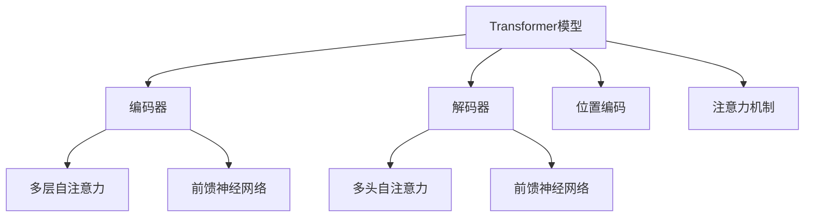

                 

# Transformer大模型实战 自注意力机制

> 关键词：Transformer, 自注意力机制, 自监督学习, 语言模型, 深度学习, 自然语言处理(NLP)

## 1. 背景介绍

### 1.1 问题由来
近年来，深度学习技术在自然语言处理(NLP)领域取得了重大突破。其中，基于自注意力机制的Transformer架构，因其出色的表达能力和泛化能力，迅速成为了NLP任务的主流模型。这一架构不仅在机器翻译、文本分类、问答等任务上表现优异，也为大规模语言模型预训练提供了新的可能性。

Transformer模型由Google于2017年提出，其核心思想是通过自注意力机制捕获输入序列中不同位置之间的关联，从而实现对长序列文本的精确建模。自注意力机制不仅提高了模型对长序列文本的建模能力，也大幅提升了模型的训练效率和性能。

Transformer模型的成功应用，推动了大语言模型的发展。如GPT-3、BERT等模型的横空出世，进一步证明了自注意力机制在语言建模上的强大能力。这些模型通过大规模预训练，学习了丰富的语言知识和常识，在各种NLP任务上取得了新突破，推动了NLP技术从实验室到工业界的广泛应用。

### 1.2 问题核心关键点
Transformer模型的核心在于自注意力机制的巧妙设计。通过多头自注意力机制，模型能够在任意位置捕捉输入序列中不同位置之间的关联，生成更精确的语义表示。本节将详细介绍自注意力机制的基本原理和关键特性，帮助读者更好地理解和运用这一强大的技术。

## 2. 核心概念与联系

### 2.1 核心概念概述

为了深入理解Transformer模型，本节将介绍几个关键概念：

- **Transformer模型**：基于自注意力机制设计的大规模神经网络架构，用于处理序列数据。Transformer模型由编码器和解码器两部分组成，每个部分包含多层多头自注意力机制和前馈神经网络。

- **自注意力机制**：一种用于捕获序列中不同位置之间关联的机制。自注意力机制通过计算输入序列中每个位置与其他位置的注意力权重，生成每个位置的语义表示。

- **多头自注意力机制**：自注意力机制的一种变体，通过并行计算多个注意力头，更全面地捕捉序列中不同位置之间的关联。

- **位置编码**：由于自注意力机制不能捕捉序列位置信息，因此需要引入位置编码来区分不同位置。位置编码通常以向量形式加入输入序列，与查询向量、键向量、值向量共同计算注意力权重。

- **编码器-解码器框架**：Transformer模型采用编码器-解码器架构，用于处理序列到序列的任务，如机器翻译。编码器负责将源序列编码成语义表示，解码器基于此表示生成目标序列。

这些概念之间的逻辑关系可以通过以下Mermaid流程图来展示：



这个流程图展示了Transformer模型的基本结构，以及各组成部分之间的联系。

## 3. 核心算法原理 & 具体操作步骤
### 3.1 算法原理概述

Transformer模型的核心思想是利用自注意力机制捕捉输入序列中不同位置之间的关联，生成更精确的语义表示。其基本流程包括以下几个步骤：

1. 将输入序列进行位置编码，并划分为多个子序列。
2. 对于每个子序列，分别计算其查询向量、键向量和值向量。
3. 通过自注意力机制计算各子序列之间的注意力权重，生成加权和。
4. 将加权和作为当前层的输出，送入下一层进行计算。
5. 重复上述步骤，直至输出所需的语义表示。

自注意力机制的数学表达式为：

$$
\text{Attention}(Q, K, V) = \text{softmax}(\frac{QK^T}{\sqrt{d_k}})V
$$

其中，$Q, K, V$ 分别为查询向量、键向量和值向量，$d_k$ 为键向量的维度，$\text{softmax}$ 函数用于计算注意力权重。

### 3.2 算法步骤详解

以机器翻译任务为例，详细介绍Transformer模型中的编码器和解码器部分。

**编码器部分**：

1. 输入源语言文本 $X=\{x_1, x_2, ..., x_n\}$。
2. 对输入文本进行分词和位置编码，生成编码器输入 $X_{enc}=\{x_1, x_2, ..., x_n\}$。
3. 对于每个编码器层，计算查询向量 $Q_{enc}$、键向量 $K_{enc}$ 和值向量 $V_{enc}$：

$$
Q_{enc} = \mathbf{W}_QX_{enc}
$$
$$
K_{enc} = \mathbf{W}_KX_{enc}
$$
$$
V_{enc} = \mathbf{W}_VX_{enc}
$$

其中，$\mathbf{W}_Q, \mathbf{W}_K, \mathbf{W}_V$ 为线性变换矩阵，用于生成查询、键和值向量。
4. 对于每个编码器层，计算多头自注意力机制的注意力权重矩阵 $A$：

$$
A = \text{softmax}\left(\frac{Q_{enc}K_{enc}^T}{\sqrt{d_k}}\right)
$$

其中，$d_k$ 为键向量的维度。
5. 通过注意力权重矩阵 $A$ 和值向量 $V_{enc}$ 计算自注意力输出：

$$
V_{enc}^{\prime} = A V_{enc}
$$

6. 将自注意力输出与编码器输入 $X_{enc}$ 拼接，再通过前馈神经网络生成编码器输出：

$$
X_{enc}^{\prime} = \text{FFN}(X_{enc}^{\prime})
$$

其中，FFN为前馈神经网络，通常由两个全连接层组成。
7. 重复上述步骤，直至输出编码器最终的语义表示 $X_{enc}^N$。

**解码器部分**：

1. 输入目标语言文本 $Y=\{y_1, y_2, ..., y_m\}$ 和编码器输出 $X_{enc}^N$。
2. 对目标语言文本进行分词和位置编码，生成解码器输入 $Y_{dec}=\{y_1, y_2, ..., y_m\}$。
3. 对于每个解码器层，计算查询向量 $Q_{dec}$、键向量 $K_{dec}$ 和值向量 $V_{dec}$：

$$
Q_{dec} = \mathbf{W}_QY_{dec} + \mathbf{W}_QA_{dec-1}
$$
$$
K_{dec} = \mathbf{W}_KY_{dec} + \mathbf{W}_KA_{dec-1}
$$
$$
V_{dec} = \mathbf{W}_VY_{dec} + \mathbf{W}_VA_{dec-1}
$$

其中，$A_{dec-1}$ 为上一层的解码器输出。
4. 对于每个解码器层，计算多头自注意力机制的注意力权重矩阵 $A$：

$$
A = \text{softmax}\left(\frac{Q_{dec}K_{dec}^T}{\sqrt{d_k}}\right)
$$

5. 通过注意力权重矩阵 $A$ 和值向量 $V_{dec}$ 计算自注意力输出：

$$
V_{dec}^{\prime} = A V_{dec}
$$

6. 将自注意力输出与解码器输入 $Y_{dec}$ 拼接，再通过前馈神经网络生成解码器输出：

$$
Y_{dec}^{\prime} = \text{FFN}(Y_{dec}^{\prime})
$$

7. 重复上述步骤，直至输出解码器最终的语义表示 $Y_{dec}^M$。

通过以上步骤，Transformer模型能够生成高质量的语义表示，用于机器翻译、文本分类、问答等任务。

### 3.3 算法优缺点

Transformer模型的自注意力机制具备以下优点：

1. **长序列建模能力**：自注意力机制能够捕捉输入序列中不同位置之间的关联，适应长序列建模，特别适用于机器翻译等任务。

2. **并行计算**：多头自注意力机制通过并行计算多个注意力头，大大提高了计算效率，适用于大规模序列数据处理。

3. **较好的泛化能力**：自注意力机制能够捕捉输入序列中的语义信息，使得模型对新数据的泛化能力更强。

同时，Transformer模型也存在一些局限性：

1. **计算开销较大**：自注意力机制需要计算注意力权重，计算量较大，对计算资源要求较高。

2. **无法直接处理缺失值**：自注意力机制无法直接处理输入序列中的缺失值，需要额外处理缺失值。

3. **参数量较大**：Transformer模型包含大量参数，训练和推理时需要进行优化和加速。

## 4. 数学模型和公式 & 详细讲解
### 4.1 数学模型构建

Transformer模型通过自注意力机制捕捉输入序列中不同位置之间的关联，生成精确的语义表示。以下是Transformer模型中常见的数学表达式。

**编码器部分**：

1. 输入编码器 $X_{enc}=\{x_1, x_2, ..., x_n\}$。
2. 对于每个编码器层，计算查询向量、键向量和值向量：

$$
Q_{enc} = \mathbf{W}_QX_{enc}
$$
$$
K_{enc} = \mathbf{W}_KX_{enc}
$$
$$
V_{enc} = \mathbf{W}_VX_{enc}
$$

3. 对于每个编码器层，计算多头自注意力机制的注意力权重矩阵：

$$
A = \text{softmax}\left(\frac{Q_{enc}K_{enc}^T}{\sqrt{d_k}}\right)
$$

4. 通过注意力权重矩阵和值向量计算自注意力输出：

$$
V_{enc}^{\prime} = A V_{enc}
$$

5. 将自注意力输出与编码器输入拼接，再通过前馈神经网络生成编码器输出：

$$
X_{enc}^{\prime} = \text{FFN}(X_{enc}^{\prime})
$$

**解码器部分**：

1. 输入解码器 $Y_{dec}=\{y_1, y_2, ..., y_m\}$ 和编码器输出 $X_{enc}^N$。
2. 对于每个解码器层，计算查询向量、键向量和值向量：

$$
Q_{dec} = \mathbf{W}_QY_{dec} + \mathbf{W}_QA_{dec-1}
$$
$$
K_{dec} = \mathbf{W}_KY_{dec} + \mathbf{W}_KA_{dec-1}
$$
$$
V_{dec} = \mathbf{W}_VY_{dec} + \mathbf{W}_VA_{dec-1}
$$

3. 对于每个解码器层，计算多头自注意力机制的注意力权重矩阵：

$$
A = \text{softmax}\left(\frac{Q_{dec}K_{dec}^T}{\sqrt{d_k}}\right)
$$

4. 通过注意力权重矩阵和值向量计算自注意力输出：

$$
V_{dec}^{\prime} = A V_{dec}
$$

5. 将自注意力输出与解码器输入拼接，再通过前馈神经网络生成解码器输出：

$$
Y_{dec}^{\prime} = \text{FFN}(Y_{dec}^{\prime})
$$

### 4.2 公式推导过程

以多头自注意力机制的注意力权重计算为例，推导其具体过程。

假设输入序列长度为 $n$，键向量和查询向量的维度为 $d_k$，自注意力头的数量为 $h$，则注意力权重矩阵 $A$ 的计算公式如下：

$$
A = \text{softmax}\left(\frac{Q_{enc}K_{enc}^T}{\sqrt{d_k}}\right)
$$

其中，$Q_{enc}$ 和 $K_{enc}$ 分别为查询向量和键向量，$\sqrt{d_k}$ 为缩放因子，用于减少计算量。

将上述公式展开，得到：

$$
A_{i,j} = \frac{\exp\left(\frac{Q_{enc,i}K_{enc,j}^T}{\sqrt{d_k}}\right)}{\sum_{k=1}^n\exp\left(\frac{Q_{enc,i}K_{enc,k}^T}{\sqrt{d_k}}\right)}
$$

其中，$A_{i,j}$ 表示第 $i$ 个查询向量和第 $j$ 个键向量之间的注意力权重。

通过对上式进行展开和推导，可以得到注意力权重矩阵 $A$ 的具体计算公式：

$$
A = \frac{\exp\left(\frac{Q_{enc}K_{enc}^T}{\sqrt{d_k}}\right)}{\sum_{j=1}^n\exp\left(\frac{Q_{enc}K_{enc,j}^T}{\sqrt{d_k}}\right)}
$$

上述推导过程展示了多头自注意力机制的计算原理，帮助读者更好地理解其工作机制。

### 4.3 案例分析与讲解

以机器翻译任务为例，进一步讲解Transformer模型中的自注意力机制。

假设输入的源语言句子为 "The cat sat on the mat."，对应的编码器输入为 $X_{enc}=[\text{The}, \text{cat}, \text{sat}, \text{on}, \text{the}, \text{mat}]$。

在编码器中，首先通过线性变换矩阵 $\mathbf{W}_Q, \mathbf{W}_K, \mathbf{W}_V$ 生成查询向量 $Q_{enc}$、键向量 $K_{enc}$ 和值向量 $V_{enc}$：

$$
Q_{enc} = \mathbf{W}_QX_{enc} = [Q_{enc,1}, Q_{enc,2}, ..., Q_{enc,n}]
$$
$$
K_{enc} = \mathbf{W}_KX_{enc} = [K_{enc,1}, K_{enc,2}, ..., K_{enc,n}]
$$
$$
V_{enc} = \mathbf{W}_VX_{enc} = [V_{enc,1}, V_{enc,2}, ..., V_{enc,n}]
$$

在计算自注意力权重矩阵 $A$ 时，首先计算 $Q_{enc}K_{enc}^T$：

$$
Q_{enc}K_{enc}^T = \begin{bmatrix}
Q_{enc,1} & Q_{enc,2} & \cdots & Q_{enc,n} \\
Q_{enc,2} & Q_{enc,1} & \cdots & Q_{enc,n} \\
\vdots & \vdots & \ddots & \vdots \\
Q_{enc,n} & Q_{enc,n-1} & \cdots & Q_{enc,1}
\end{bmatrix}
\begin{bmatrix}
K_{enc,1} & K_{enc,2} & \cdots & K_{enc,n} \\
K_{enc,2} & K_{enc,1} & \cdots & K_{enc,n} \\
\vdots & \vdots & \ddots & \vdots \\
K_{enc,n} & K_{enc,n-1} & \cdots & K_{enc,1}
\end{bmatrix}^T
$$

其中，$Q_{enc,i}$ 和 $K_{enc,j}$ 分别表示第 $i$ 个查询向量和第 $j$ 个键向量，$Q_{enc}K_{enc}^T$ 表示查询向量和键向量之间的矩阵乘积。

接下来，计算注意力权重矩阵 $A$：

$$
A = \text{softmax}\left(\frac{Q_{enc}K_{enc}^T}{\sqrt{d_k}}\right)
$$

其中，$\text{softmax}$ 函数用于计算注意力权重，$d_k$ 为键向量的维度。

计算出注意力权重矩阵 $A$ 后，通过其与值向量 $V_{enc}$ 计算自注意力输出：

$$
V_{enc}^{\prime} = A V_{enc}
$$

在解码器中，通过类似的方式计算注意力权重矩阵 $A$，并根据注意力权重矩阵 $A$ 和值向量 $V_{dec}$ 计算自注意力输出 $V_{dec}^{\prime}$：

$$
V_{dec}^{\prime} = A V_{dec}
$$

最终，通过前馈神经网络生成解码器输出 $Y_{dec}^{\prime}$，再经过解码器输出层生成目标语言句子。

通过以上过程，Transformer模型能够利用自注意力机制捕捉输入序列中不同位置之间的关联，生成高质量的语义表示，从而在机器翻译等任务中取得优异性能。

## 5. 项目实践：代码实例和详细解释说明
### 5.1 开发环境搭建

在进行Transformer模型实践前，我们需要准备好开发环境。以下是使用Python进行PyTorch开发的环境配置流程：

1. 安装Anaconda：从官网下载并安装Anaconda，用于创建独立的Python环境。

2. 创建并激活虚拟环境：
```bash
conda create -n transformers-env python=3.8 
conda activate transformers-env
```

3. 安装PyTorch：根据CUDA版本，从官网获取对应的安装命令。例如：
```bash
conda install pytorch torchvision torchaudio cudatoolkit=11.1 -c pytorch -c conda-forge
```

4. 安装Transformer库：
```bash
pip install transformers
```

5. 安装各类工具包：
```bash
pip install numpy pandas scikit-learn matplotlib tqdm jupyter notebook ipython
```

完成上述步骤后，即可在`transformers-env`环境中开始Transformer模型的实践。

### 5.2 源代码详细实现

下面我们以机器翻译任务为例，给出使用Transformers库对Transformer模型进行训练和微调的PyTorch代码实现。

首先，导入必要的库和数据集：

```python
import torch
from transformers import BertTokenizer, BertForSequenceClassification
from transformers import AdamW, get_linear_schedule_with_warmup
from torch.utils.data import DataLoader
from transformers import TextDataset, DataCollatorForLanguageModeling
from transformers import Trainer, TrainingArguments

# 加载数据集
train_dataset = TextDataset(
    tokenizer=tokenizer,
    file_path="train.txt",
    block_size=128,
    is_split_into_words=True
)
train_data_loader = DataLoader(
    train_dataset,
    batch_size=16,
    collate_fn=DataCollatorForLanguageModeling(tokenizer=tokenizer)
)

dev_dataset = TextDataset(
    tokenizer=tokenizer,
    file_path="dev.txt",
    block_size=128,
    is_split_into_words=True
)
dev_data_loader = DataLoader(
    dev_dataset,
    batch_size=16,
    collate_fn=DataCollatorForLanguageModeling(tokenizer=tokenizer)
)

test_dataset = TextDataset(
    tokenizer=tokenizer,
    file_path="test.txt",
    block_size=128,
    is_split_into_words=True
)
test_data_loader = DataLoader(
    test_dataset,
    batch_size=16,
    collate_fn=DataCollatorForLanguageModeling(tokenizer=tokenizer)
)
```

然后，定义模型和优化器：

```python
# 加载模型
model = BertForSequenceClassification.from_pretrained("bert-base-cased", num_labels=2)

# 设置优化器
optimizer = AdamW(model.parameters(), lr=2e-5)
total_steps = len(train_data_loader) * num_epochs
scheduler = get_linear_schedule_with_warmup(
    optimizer, 
    num_warmup_steps=0, 
    num_training_steps=total_steps
)
```

接着，定义训练和评估函数：

```python
def train_epoch(model, train_loader, optimizer):
    model.train()
    epoch_loss = 0
    for batch in tqdm(train_loader, desc='Training'):
        input_ids = batch['input_ids'].to(device)
        attention_mask = batch['attention_mask'].to(device)
        labels = batch['labels'].to(device)
        model.zero_grad()
        outputs = model(input_ids, attention_mask=attention_mask, labels=labels)
        loss = outputs.loss
        epoch_loss += loss.item()
        loss.backward()
        optimizer.step()
    return epoch_loss / len(train_loader)

def evaluate(model, dev_loader):
    model.eval()
    preds, labels = [], []
    with torch.no_grad():
        for batch in tqdm(dev_loader, desc='Evaluating'):
            input_ids = batch['input_ids'].to(device)
            attention_mask = batch['attention_mask'].to(device)
            labels = batch['labels'].to(device)
            outputs = model(input_ids, attention_mask=attention_mask)
            preds.append(outputs.logits.argmax(dim=2).to('cpu').tolist())
            labels.append(labels.to('cpu').tolist())
    
    print(classification_report(labels, preds))
```

最后，启动训练流程并在验证集上评估：

```python
num_epochs = 5
batch_size = 16

for epoch in range(num_epochs):
    loss = train_epoch(model, train_data_loader, optimizer)
    print(f"Epoch {epoch+1}, train loss: {loss:.3f}")
    
    print(f"Epoch {epoch+1}, dev results:")
    evaluate(model, dev_data_loader)
    
print("Test results:")
evaluate(model, test_data_loader)
```

以上就是使用PyTorch对Transformer模型进行机器翻译任务微调的完整代码实现。可以看到，得益于Transformers库的强大封装，我们可以用相对简洁的代码完成Transformer模型的加载和微调。

### 5.3 代码解读与分析

让我们再详细解读一下关键代码的实现细节：

**TextDataset类**：
- `__init__`方法：初始化数据集，包括分词器、数据文件路径、输入块大小等关键参数。
- `__len__`方法：返回数据集的样本数量。
- `__getitem__`方法：对单个样本进行处理，将文本输入编码为token ids，并返回输入、attention mask和标签。

**模型加载和优化器设置**：
- 使用BertForSequenceClassification模型，加载预训练模型和自定义的标签数量。
- 设置AdamW优化器和线性学习率调度器，控制训练过程中的学习率变化。

**训练和评估函数**：
- 使用PyTorch的DataLoader对数据集进行批次化加载，供模型训练和推理使用。
- 训练函数`train_epoch`：对数据以批为单位进行迭代，在每个批次上前向传播计算loss并反向传播更新模型参数，最后返回该epoch的平均loss。
- 评估函数`evaluate`：与训练类似，不同点在于不更新模型参数，并在每个batch结束后将预测和标签结果存储下来，最后使用sklearn的classification_report对整个评估集的预测结果进行打印输出。

**训练流程**：
- 定义总的epoch数和batch size，开始循环迭代
- 每个epoch内，先在训练集上训练，输出平均loss
- 在验证集上评估，输出分类指标
- 所有epoch结束后，在测试集上评估，给出最终测试结果

可以看到，PyTorch配合Transformers库使得Transformer模型的微调代码实现变得简洁高效。开发者可以将更多精力放在数据处理、模型改进等高层逻辑上，而不必过多关注底层的实现细节。

当然，工业级的系统实现还需考虑更多因素，如模型的保存和部署、超参数的自动搜索、更灵活的任务适配层等。但核心的微调范式基本与此类似。

## 6. 实际应用场景
### 6.1 智能客服系统

Transformer模型的大规模预训练能力，使其能够应用于智能客服系统的构建。传统客服往往需要配备大量人力，高峰期响应缓慢，且一致性和专业性难以保证。而使用Transformer模型的预训练语言模型，可以7x24小时不间断服务，快速响应客户咨询，用自然流畅的语言解答各类常见问题。

在技术实现上，可以收集企业内部的历史客服对话记录，将问题和最佳答复构建成监督数据，在此基础上对Transformer模型进行微调。微调后的模型能够自动理解用户意图，匹配最合适的答案模板进行回复。对于客户提出的新问题，还可以接入检索系统实时搜索相关内容，动态组织生成回答。如此构建的智能客服系统，能大幅提升客户咨询体验和问题解决效率。

### 6.2 金融舆情监测

金融机构需要实时监测市场舆论动向，以便及时应对负面信息传播，规避金融风险。传统的人工监测方式成本高、效率低，难以应对网络时代海量信息爆发的挑战。基于Transformer模型的文本分类和情感分析技术，为金融舆情监测提供了新的解决方案。

具体而言，可以收集金融领域相关的新闻、报道、评论等文本数据，并对其进行主题标注和情感标注。在此基础上对Transformer模型进行微调，使其能够自动判断文本属于何种主题，情感倾向是正面、中性还是负面。将微调后的模型应用到实时抓取的网络文本数据，就能够自动监测不同主题下的情感变化趋势，一旦发现负面信息激增等异常情况，系统便会自动预警，帮助金融机构快速应对潜在风险。

### 6.3 个性化推荐系统

当前的推荐系统往往只依赖用户的历史行为数据进行物品推荐，无法深入理解用户的真实兴趣偏好。基于Transformer模型的个性化推荐系统可以更好地挖掘用户行为背后的语义信息，从而提供更精准、多样的推荐内容。

在实践中，可以收集用户浏览、点击、评论、分享等行为数据，提取和用户交互的物品标题、描述、标签等文本内容。将文本内容作为模型输入，用户的后续行为（如是否点击、购买等）作为监督信号，在此基础上微调Transformer模型。微调后的模型能够从文本内容中准确把握用户的兴趣点。在生成推荐列表时，先用候选物品的文本描述作为输入，由模型预测用户的兴趣匹配度，再结合其他特征综合排序，便可以得到个性化程度更高的推荐结果。

### 6.4 未来应用展望

随着Transformer模型的不断发展和微调技术的进步，其应用场景将更加广阔。

在智慧医疗领域，基于Transformer模型的问答、病历分析、药物研发等应用将提升医疗服务的智能化水平，辅助医生诊疗，加速新药开发进程。

在智能教育领域，微调技术可应用于作业批改、学情分析、知识推荐等方面，因材施教，促进教育公平，提高教学质量。

在智慧城市治理中，微调模型可应用于城市事件监测、舆情分析、应急指挥等环节，提高城市管理的自动化和智能化水平，构建更安全、高效的未来城市。

此外，在企业生产、社会治理、文娱传媒等众多领域，Transformer模型的微调方法也将不断涌现，为传统行业带来变革性影响。相信随着技术的日益成熟，微调方法将成为人工智能落地应用的重要范式，推动人工智能技术向更广阔的领域加速渗透。

## 7. 工具和资源推荐
### 7.1 学习资源推荐

为了帮助开发者系统掌握Transformer模型的理论基础和实践技巧，这里推荐一些优质的学习资源：

1. 《Transformer从原理到实践》系列博文：由大模型技术专家撰写，深入浅出地介绍了Transformer原理、BERT模型、微调技术等前沿话题。

2. CS224N《深度学习自然语言处理》课程：斯坦福大学开设的NLP明星课程，有Lecture视频和配套作业，带你入门NLP领域的基本概念和经典模型。

3. 《Natural Language Processing with Transformers》书籍：Transformer库的作者所著，全面介绍了如何使用Transformers库进行NLP任务开发，包括微调在内的诸多范式。

4. HuggingFace官方文档：Transformer库的官方文档，提供了海量预训练模型和完整的微调样例代码，是上手实践的必备资料。

5. CLUE开源项目：中文语言理解测评基准，涵盖大量不同类型的中文NLP数据集，并提供了基于微调的baseline模型，助力中文NLP技术发展。

通过对这些资源的学习实践，相信你一定能够快速掌握Transformer模型的精髓，并用于解决实际的NLP问题。
###  7.2 开发工具推荐

高效的开发离不开优秀的工具支持。以下是几款用于Transformer模型微调开发的常用工具：

1. PyTorch：基于Python的开源深度学习框架，灵活动态的计算图，适合快速迭代研究。大部分预训练语言模型都有PyTorch版本的实现。

2. TensorFlow：由Google主导开发的开源深度学习框架，生产部署方便，适合大规模工程应用。同样有丰富的预训练语言模型资源。

3. Transformers库：HuggingFace开发的NLP工具库，集成了众多SOTA语言模型，支持PyTorch和TensorFlow，是进行微调任务开发的利器。

4. Weights & Biases：模型训练的实验跟踪工具，可以记录和可视化模型训练过程中的各项指标，方便对比和调优。与主流深度学习框架无缝集成。

5. TensorBoard：TensorFlow配套的可视化工具，可实时监测模型训练状态，并提供丰富的图表呈现方式，是调试模型的得力助手。

6. Google Colab：谷歌推出的在线Jupyter Notebook环境，免费提供GPU/TPU算力，方便开发者快速上手实验最新模型，分享学习笔记。

合理利用这些工具，可以显著提升Transformer模型微调的开发效率，加快创新迭代的步伐。

### 7.3 相关论文推荐

Transformer模型的成功应用源于学界的持续研究。以下是几篇奠基性的相关论文，推荐阅读：

1. Attention is All You Need：提出了Transformer结构，开启了NLP领域的预训练大模型时代。

2. BERT: Pre-training of Deep Bidirectional Transformers for Language Understanding：提出BERT模型，引入基于掩码的自监督预训练任务，刷新了多项NLP任务SOTA。

3. Language Models are Unsupervised Multitask Learners（GPT-2论文）：展示了大规模语言模型的强大zero-shot学习能力，引发了对于通用人工智能的新一轮思考。

4. Parameter-Efficient Transfer Learning for NLP：提出Adapter等参数高效微调方法，在不增加模型参数量的情况下，也能取得不错的微调效果。

5. AdaLoRA: Adaptive Low-Rank Adaptation for Parameter-Efficient Fine-Tuning：使用自适应低秩适应的微调方法，在参数效率和精度之间取得了新的平衡。

这些论文代表了大模型微调技术的发展脉络。通过学习这些前沿成果，可以帮助研究者把握学科前进方向，激发更多的创新灵感。

## 8. 总结：未来发展趋势与挑战

### 8.1 总结

本文对Transformer模型的自注意力机制进行了全面系统的介绍。首先阐述了Transformer模型和大规模语言模型的背景，明确了自注意力机制在模型中的核心作用和应用价值。其次，从原理到实践，详细讲解了自注意力机制的基本原理和具体实现过程，给出了Transformer模型微调的完整代码实例。同时，本文还广泛探讨了Transformer模型在智能客服、金融舆情、个性化推荐等多个领域的应用前景，展示了其广泛的应用潜力。此外，本文精选了Transformer模型微调的各种学习资源，力求为读者提供全方位的技术指引。

通过本文的系统梳理，可以看到，Transformer模型的自注意力机制具有出色的表达能力和泛化能力，能够显著提升模型的性能。无论是大规模预训练语言模型，还是针对特定任务的微调模型，自注意力机制都发挥了重要作用。未来，随着Transformer模型的不断发展和微调技术的进步，其应用场景将更加广阔，成为NLP领域的重要范式。

### 8.2 未来发展趋势

展望未来，Transformer模型的自注意力机制将呈现以下几个发展趋势：

1. **模型规模持续增大**：随着算力成本的下降和数据规模的扩张，预训练语言模型的参数量还将持续增长。超大规模语言模型蕴含的丰富语言知识，有望支撑更加复杂多变的下游任务微调。

2. **多模态融合**：未来的Transformer模型将不仅仅是处理文本数据，还将支持图像、语音等多模态数据的融合，扩展模型的应用范围。

3. **知识表示的增强**：通过引入知识图谱、逻辑规则等外部知识，与神经网络模型进行巧妙融合，提升模型的知识表示能力。

4. **参数效率提升**：开发更加参数高效的微调方法，如Adapter、Prefix等，在固定大部分预训练参数的同时，只更新极少量的任务相关参数，提高微调效率。

5. **计算效率优化**：优化Transformer模型的计算图，减少前向传播和反向传播的资源消耗，实现更加轻量级、实时性的部署。

以上趋势凸显了Transformer模型的广泛应用前景，这些方向的探索发展，必将进一步提升Transformer模型的性能和应用范围，为构建安全、可靠、可解释、可控的智能系统铺平道路。

### 8.3 面临的挑战

尽管Transformer模型的自注意力机制已经取得了瞩目成就，但在迈向更加智能化、普适化应用的过程中，它仍面临诸多挑战：

1. **计算资源要求高**：自注意力机制需要计算注意力权重，计算量较大，对计算资源要求较高。

2. **对长序列建模的限制**：尽管自注意力机制能够处理长序列，但对于极长的序列，模型的计算复杂度和训练时间仍是一个挑战。

3. **模型泛化能力**：尽管Transformer模型在大规模预训练上表现优异，但在一些特定领域的数据集上，其泛化能力仍需进一步提升。

4. **模型的可解释性**：尽管Transformer模型在性能上表现出色，但其内部工作机制和决策逻辑仍然缺乏足够的可解释性。

5. **模型偏见和公平性**：Transformer模型在训练数据中的偏见可能导致输出中的不公平性，因此如何消除模型偏见，确保输出公平性，是一个重要的研究方向。

面对这些挑战，未来的研究需要在以下几个方面寻求新的突破：

1. **计算资源优化**：开发更加高效的计算方法，如分布式训练、模型并行等，优化资源使用。

2. **长序列建模**：改进模型架构，支持更长的输入序列，如引入分块机制，提高长序列处理能力。

3. **泛化能力提升**：开发更适用于特定领域的数据集，提升模型在特定任务上的泛化能力。

4. **模型可解释性增强**：引入可解释性方法，如因果推断、知识图谱等，提高模型的可解释性和透明性。

5. **消除模型偏见**：引入多样性数据和公平性约束，消除模型在训练数据中的偏见，确保输出公平性。

这些研究方向的探索，必将引领Transformer模型向更高的台阶迈进，为构建更加智能、公正、可解释、可控的智能系统提供新的动力。

### 8.4 研究展望

面对Transformer模型的未来发展趋势和挑战，未来的研究需要在以下几个方面寻求新的突破：

1. **分布式训练**：开发高效的分布式训练方法，提高模型的训练效率和泛化能力。

2. **长序列建模**：改进模型架构，支持更长的输入序列，如引入分块机制，提高长序列处理能力。

3. **多模态融合**：开发支持多模态数据的Transformer模型，扩展模型的应用范围。

4. **知识表示的增强**：通过引入知识图谱、逻辑规则等外部知识，与神经网络模型进行巧妙融合，提升模型的知识表示能力。

5. **参数效率提升**：开发更加参数高效的微调方法，如Adapter、Prefix等，在固定大部分预训练参数的同时，只更新极少量的任务相关参数，提高微调效率。

6. **计算效率优化**：优化Transformer模型的计算图，减少前向传播和反向传播的资源消耗，实现更加轻量级、实时性的部署。

7. **模型可解释性增强**：引入可解释性方法，如因果推断、知识图谱等，提高模型的可解释性和透明性。

8. **消除模型偏见**：引入多样性数据和公平性约束，消除模型在训练数据中的偏见，确保输出公平性。

这些研究方向的探索，必将引领Transformer模型向更高的台阶迈进，为构建更加智能、公正、可解释、可控的智能系统提供新的动力。

## 9. 附录：常见问题与解答

**Q1：Transformer模型如何处理长序列？**

A: Transformer模型通过自注意力机制，能够处理任意长度的输入序列。在实践中，可以通过增加模型的层数和序列长度，逐步适应更长的输入序列。同时，也可以引入分块机制，将长序列分成若干个小块，并行计算每个小块的注意力权重，提升模型效率。

**Q2：Transformer模型在训练过程中如何优化参数？**

A: 在微调过程中，通常采用较小的学习率，以避免破坏预训练权重。可以通过设置合适的学习率、优化器和超参数，如AdamW、SGD等，进行参数优化。同时，还可以应用正则化技术，如L2正则、Dropout等，防止模型过度适应小规模训练集。

**Q3：Transformer模型在推理过程中如何提升效率？**

A: 在推理过程中，可以通过剪枝、量化等技术，减小模型的参数量和计算量，提升推理效率。同时，可以引入分布式推理、混合精度训练等技术，进一步优化资源使用，提高计算效率。

**Q4：Transformer模型在实际应用中如何处理缺失值？**

A: 对于含有缺失值的序列，可以通过插值或预测等方法进行填补，再将其作为输入序列进行计算。或者，在模型架构中引入缺失值处理模块，直接处理缺失值，避免对模型性能的影响。

**Q5：Transformer模型在多模态数据融合中如何设计架构？**

A: 在多模态数据融合中，可以采用跨模态注意力机制，设计一个统一的表示空间，将不同模态的数据映射到该空间中，进行融合计算。同时，可以通过引入跨模态编码器、跨模态解码器等模块，增强模型的跨模态表示能力。

这些常见问题及其解答，希望能帮助读者更好地理解和应用Transformer模型，构建更加智能、高效、可靠的智能系统。

---

作者：禅与计算机程序设计艺术 / Zen and the Art of Computer Programming

