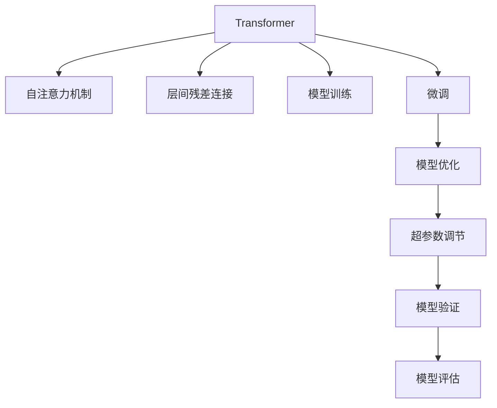

                 

# Transformer大模型实战 训练ALBERT 模型

> 关键词：Transformer, ALBERT, 模型训练, 自然语言处理(NLP), 预训练语言模型, 自注意力机制

## 1. 背景介绍

### 1.1 问题由来

近年来，深度学习技术在自然语言处理(NLP)领域取得了显著的进展，Transformer模型因其自注意力机制在语言理解与生成方面的出色表现，成为了当前大模型的主流架构。针对大规模语言模型的训练与微调，学术界与工业界提出了许多高效的策略和工具。其中，ALBERT模型作为Transformer架构的一种改进，通过优化模型结构和训练方式，有效提升了模型性能与计算效率。

本博客将详细介绍基于Transformer架构的ALBERT模型的训练与优化策略，并通过代码实例，带读者实践从模型搭建到训练及微调的完整流程。旨在让读者对Transformer模型及ALBERT模型有深入理解，并掌握大模型训练的实用技巧。

### 1.2 问题核心关键点

- **Transformer架构**：由自注意力机制组成，可以并行计算，且具备较强的泛化能力。
- **ALBERT模型**：一种参数更小、速度更快且效果优异的Transformer变体，适用于多种下游NLP任务。
- **模型训练**：通过指定超参数、优化器与损失函数，对模型进行训练，以提升其性能。
- **微调**：在大规模预训练的基础上，针对特定任务进行微调，以提升模型在该任务上的表现。
- **代码实践**：通过具体代码实例，演示ALBERT模型的训练与微调流程，包括数据预处理、模型构建、训练与评估等步骤。

## 2. 核心概念与联系

### 2.1 核心概念概述

为帮助读者更好地理解Transformer大模型的训练与优化，首先需要了解相关的核心概念。

- **Transformer模型**：基于自注意力机制的神经网络模型，适用于序列到序列(S2S)任务，如翻译、文本生成等。
- **自注意力机制**：在序列中，通过计算不同位置之间信息的交互，增强模型对序列的整体理解能力。
- **ALBERT模型**：一种改进后的Transformer模型，通过层间残差连接与结构优化，大幅减少了参数量，同时保持了模型的性能。
- **模型训练**：通过反向传播算法，更新模型参数，使其能够更加准确地进行预测。
- **微调**：在预训练模型基础上，针对特定任务进行微调，提升模型在该任务上的表现。
- **超参数**：需要手动设置的模型参数，如学习率、批大小等，对模型训练效果有重要影响。
- **优化器**：如AdamW等，用于更新模型参数，以最小化损失函数。

这些概念之间存在紧密的联系，共同构成了大模型训练与优化的基础。

### 2.2 核心概念原理和架构的 Mermaid 流程图



以上流程图展示了Transformer模型及其相关概念之间的联系与转化过程。

## 3. 核心算法原理 & 具体操作步骤

### 3.1 算法原理概述

ALBERT模型基于Transformer架构，通过减少参数量、提升计算效率，并保持性能，适用于大规模语言处理任务。ALBERT模型包括三个主要组件：自注意力机制、残差连接和层间连接。其训练过程涉及选择合适的超参数、优化器与损失函数，并通过反向传播算法更新模型参数。

### 3.2 算法步骤详解

ALBERT模型的训练流程包括以下关键步骤：

1. **数据准备**：收集并预处理训练数据，分为训练集、验证集和测试集。
2. **模型构建**：使用Hugging Face库搭建ALBERT模型，指定模型结构与超参数。
3. **模型训练**：选择适当的优化器与损失函数，通过反向传播算法更新模型参数。
4. **模型验证与微调**：在验证集上评估模型性能，根据性能调整超参数，并针对特定任务进行微调。

### 3.3 算法优缺点

ALBERT模型的优点包括：

- **参数少**：相较于标准Transformer模型，ALBERT减少了大量参数，降低了计算资源消耗。
- **速度快**：由于参数量减少，ALBERT训练与推理速度更快，适用于对实时性要求高的场景。
- **效果好**：在多任务性能上优于标准Transformer，适用于多种NLP任务。

其缺点包括：

- **模型复杂度**：尽管参数量少，但由于采用了层间残差连接，模型结构相对复杂。
- **超参数调参难度高**：需要手动调整超参数，对调参技巧要求较高。
- **微调难度**：需要考虑特定任务与预训练模型的适配，可能存在微调效果不佳的问题。

### 3.4 算法应用领域

ALBERT模型在多个NLP任务上取得了优异的表现，适用于：

- 文本分类：如情感分析、主题分类等。
- 命名实体识别：识别文本中的特定实体，如人名、地名、组织名等。
- 语言建模：预测下一个词的概率，应用于文本生成任务。
- 机器翻译：将源语言文本翻译成目标语言。
- 问答系统：对自然语言问题给出答案。

## 4. 数学模型和公式 & 详细讲解 & 举例说明

### 4.1 数学模型构建

ALBERT模型基于Transformer架构，其自注意力机制可以表示为：

$$
\text{Attention}(Q, K, V) = \text{Softmax}(QK^\top)/\sqrt{d_k} \times V
$$

其中，$Q$、$K$、$V$分别为查询、键和值矩阵，$d_k$为嵌入维度。

### 4.2 公式推导过程

ALBERT模型的训练目标是最小化预测输出与真实标签之间的差异，即：

$$
\mathcal{L}(\theta) = -\frac{1}{N}\sum_{i=1}^N \ell(y_i, \hat{y}_i)
$$

其中，$\theta$为模型参数，$y_i$为真实标签，$\hat{y}_i$为模型预测输出，$\ell$为损失函数。

### 4.3 案例分析与讲解

以文本分类任务为例，假设模型输出为二分类结果，可以使用交叉熵损失函数：

$$
\ell(y_i, \hat{y}_i) = -y_i\log(\hat{y}_i) - (1-y_i)\log(1-\hat{y}_i)
$$

将交叉熵损失应用于ALBERT模型的训练过程，通过反向传播算法更新模型参数，最小化损失函数。

## 5. 项目实践：代码实例和详细解释说明

### 5.1 开发环境搭建

1. **安装环境**：
   - 安装Anaconda，创建一个新的Python虚拟环境。
   - 安装TensorFlow和transformers库，使用命令：
     ```
     pip install tensorflow transformers
     ```
   - 安装GPU驱动和CUDA库，确保TensorFlow能够使用GPU加速。

2. **准备数据**：
   - 准备训练集、验证集和测试集，使用常见的数据集，如IMDB电影评论数据集。
   - 使用Hugging Face的BertTokenizer对文本进行分词。

### 5.2 源代码详细实现

以下代码展示了使用ALBERT模型进行文本分类的过程：

```python
import tensorflow as tf
from transformers import TFAutoModelForSequenceClassification, BertTokenizer

# 加载预训练的ALBERT模型
model = TFAutoModelForSequenceClassification.from_pretrained('albert_base_v2')

# 加载分词器
tokenizer = BertTokenizer.from_pretrained('bert-base-uncased')

# 定义超参数
learning_rate = 1e-5
batch_size = 16
num_epochs = 5

# 数据预处理
def preprocess(text):
    return tokenizer.encode_plus(text, truncation=True, max_length=256, padding='max_length', return_tensors='tf')

# 加载数据集
train_dataset = tf.data.Dataset.from_generator(lambda: list(train_texts), output_signature=preprocess(train_labels))
val_dataset = tf.data.Dataset.from_generator(lambda: list(val_texts), output_signature=preprocess(val_labels))
test_dataset = tf.data.Dataset.from_generator(lambda: list(test_texts), output_signature=preprocess(test_labels))

# 模型训练
optimizer = tf.keras.optimizers.Adam(learning_rate=learning_rate)
model.compile(optimizer=optimizer, loss=tf.keras.losses.SparseCategoricalCrossentropy(from_logits=True), metrics=['accuracy'])

# 训练模型
history = model.fit(train_dataset.shuffle(10000).batch(batch_size), epochs=num_epochs, validation_data=val_dataset.batch(batch_size), verbose=2)
```

### 5.3 代码解读与分析

在上述代码中，我们首先加载了预训练的ALBERT模型和分词器。然后定义了超参数，包括学习率、批大小和训练轮数。

数据预处理函数`preprocess`将文本转换为模型所需的输入格式，包括分词、截断和填充等。

我们使用TensorFlow的`tf.data.Dataset`函数将数据集转换为TensorFlow可处理的格式，并进行批次处理。

最后，通过调用模型的`fit`函数，在训练集上进行模型训练，并在验证集上评估模型性能。

### 5.4 运行结果展示

训练过程中，可以使用TensorBoard可视化训练进度和模型性能，如损失函数和准确率的变化。训练完成后，可以在测试集上评估模型性能，输出预测结果和精度指标。

## 6. 实际应用场景

### 6.4 未来应用展望

ALBERT模型在NLP领域具有广泛的应用前景，未来将在更多实际场景中发挥重要作用。

- **智能客服**：构建基于ALBERT的智能客服系统，提升客户满意度。
- **金融风控**：使用ALBERT模型进行金融舆情分析，防范金融风险。
- **医疗诊断**：通过ALBERT模型对医学文本进行分析，辅助医生诊断。
- **教育推荐**：使用ALBERT模型进行个性化教育推荐，提高教学效果。
- **自然语言生成**：利用ALBERT模型进行文本生成、摘要、翻译等任务。

## 7. 工具和资源推荐

### 7.1 学习资源推荐

- **Transformers文档**：官方文档，提供了详细的模型介绍和代码实现。
- **Natural Language Processing with Transformers**：介绍Transformer模型的经典书籍。
- **Hugging Face Transformers教程**：从基础到高级的教程，涵盖模型的搭建与优化。

### 7.2 开发工具推荐

- **TensorFlow**：强大的深度学习框架，支持GPU加速。
- **Hugging Face Transformers**：提供预训练模型和代码实现。
- **TensorBoard**：用于可视化训练进度和模型性能。

### 7.3 相关论文推荐

- **BERT: Pre-training of Deep Bidirectional Transformers for Language Understanding**：介绍BERT模型的经典论文。
- **ALBERT: A Lite BERT for Self-supervised Learning of Language Representations**：介绍ALBERT模型的经典论文。
- **Sentence-BERT: Sentence Embeddings Using Siamese BERT-Networks**：介绍Sentence-BERT模型的论文。

## 8. 总结：未来发展趋势与挑战

### 8.1 研究成果总结

ALBERT模型在NLP领域取得了显著进展，广泛应用于多种任务。其优点在于参数少、速度快且效果好，但调参难度高，微调复杂。未来研究将进一步优化模型结构，提升模型性能，并探索新的训练策略。

### 8.2 未来发展趋势

- **模型参数优化**：探索更多优化模型结构的方法，减少模型参数，提升计算效率。
- **训练策略改进**：引入更多先进的训练策略，如迁移学习、多任务学习等，提升模型泛化能力。
- **模型应用扩展**：将ALBERT模型应用于更多实际场景，如医疗、金融、教育等。
- **跨模态融合**：探索视觉、语音等多模态信息的融合，增强模型的跨领域能力。

### 8.3 面临的挑战

- **计算资源限制**：大规模模型的训练和推理需要大量的计算资源。
- **模型复杂度**：层间残差连接的引入增加了模型复杂度，可能导致训练困难。
- **调参难度**：需要手动调整超参数，调参难度大。
- **微调效果**：特定任务与预训练模型的适配问题，可能导致微调效果不佳。

### 8.4 研究展望

未来研究需要：

- **优化模型结构**：探索更多优化模型结构的方法，减少模型参数，提升计算效率。
- **改进训练策略**：引入更多先进的训练策略，如迁移学习、多任务学习等，提升模型泛化能力。
- **跨模态融合**：探索视觉、语音等多模态信息的融合，增强模型的跨领域能力。

## 9. 附录：常见问题与解答

### Q1: 如何选择合适的预训练模型？

**A**：根据任务需求选择合适的预训练模型，如文本分类、命名实体识别等任务，可以使用BERT或ALBERT等预训练模型。

### Q2: 如何进行超参数调参？

**A**：超参数调参是一个复杂的过程，可以采用网格搜索、随机搜索、贝叶斯优化等方法进行调参。

### Q3: 如何提高模型泛化能力？

**A**：可以使用多任务学习、迁移学习等方法，提升模型在不同任务上的泛化能力。

### Q4: 如何优化模型训练过程？

**A**：可以通过模型裁剪、量化加速、分布式训练等方法优化模型训练过程。

### Q5: 如何评估模型性能？

**A**：可以使用准确率、F1-score等指标评估模型性能，并结合AUC、ROC曲线等方法进行可视化。

---

作者：禅与计算机程序设计艺术 / Zen and the Art of Computer Programming

