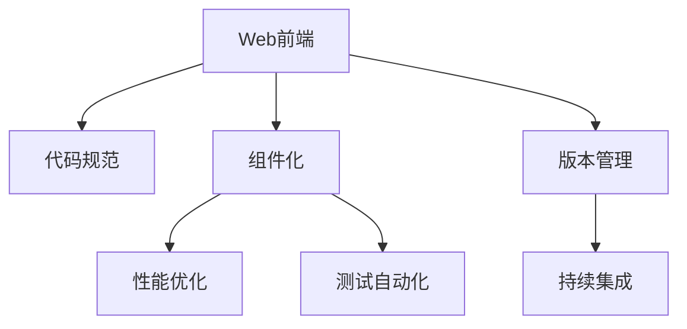

                 

# Web前端工程化最佳实践

> 关键词：Web前端, 工程化, 代码规范, 组件化, 性能优化, 测试自动化, 版本管理, 持续集成

## 1. 背景介绍

随着Web技术的不断进步，前端开发已经不再局限于简单的页面展示，而是向着高度复杂、交互性强的应用系统演进。然而，前端工程化依然面临着诸多挑战：代码质量参差不齐、版本管理混乱、性能瓶颈突出、测试覆盖率低等问题严重阻碍了项目的发展。为了解决这些问题，前端工程化最佳实践应运而生。本文将深入探讨Web前端工程化的核心概念、核心算法原理、具体操作步骤，并给出实际应用场景和工具资源推荐，为前端开发者提供系统性、可操作性的指导。

## 2. 核心概念与联系

### 2.1 核心概念概述

为更好地理解Web前端工程化的精髓，本节将介绍几个核心概念：

- **Web前端**：包括前端框架、设计、用户体验、功能实现等多个方面的内容。现代Web前端已经从简单的页面渲染发展为复杂的应用系统。
- **代码规范**：指代码的书写风格和编码规范，旨在提高代码可读性和可维护性，防止代码混乱。
- **组件化**：将功能模块化，通过复用组件来提升开发效率和代码可维护性。
- **性能优化**：指通过优化代码和资源，提升Web应用的加载速度和用户体验。
- **测试自动化**：通过自动化测试工具和流程，快速发现和修复代码中的bug，提高测试覆盖率。
- **版本管理**：指通过版本控制系统，管理代码库的历史变更和协作开发。
- **持续集成**：指通过自动化构建和测试流程，确保代码质量和稳定发布。

这些核心概念之间的联系可以通过以下Mermaid流程图来展示：



这个流程图展示了Web前端工程化的关键环节，通过代码规范、组件化、性能优化、测试自动化、版本管理和持续集成等技术手段，构建高质量、高效的前端应用。

## 3. 核心算法原理 & 具体操作步骤
### 3.1 算法原理概述

Web前端工程化涉及多个关键技术和流程，其核心算法原理主要包括：

- **代码规范**：通过统一代码风格和命名规范，提高代码的可读性和可维护性。
- **组件化**：将功能模块化，提升代码复用性和开发效率。
- **性能优化**：通过代码和资源的优化，提升应用加载速度和用户体验。
- **测试自动化**：通过自动化测试工具，快速发现和修复代码中的bug。
- **版本管理**：通过版本控制系统，管理代码变更和协作开发。
- **持续集成**：通过自动化构建和测试流程，确保代码质量和稳定发布。

### 3.2 算法步骤详解

以下是Web前端工程化的一些关键步骤：

**Step 1: 确定代码规范**

- 定义前端代码的命名规范、注释规范、代码风格等。
- 使用工具如ESLint、Prettier等进行代码检查和自动格式化。
- 定期更新和维护代码规范文档，确保全团队遵循。

**Step 2: 组件化开发**

- 将前端应用分解为多个独立组件，每个组件负责特定功能。
- 使用框架如React、Vue等支持组件化开发。
- 使用组件化工具如Storybook、Component Explorer等进行组件管理和复用。

**Step 3: 性能优化**

- 使用工具如Webpack、PurgeCSS等优化资源加载，去除未使用的代码。
- 使用异步加载技术如懒加载、代码分割等提升页面加载速度。
- 使用缓存机制如Service Worker、IndexDB等提升重复访问的性能。

**Step 4: 测试自动化**

- 编写单元测试、集成测试、端到端测试用例，覆盖主要功能模块。
- 使用测试框架如Jest、Mocha等进行自动化测试。
- 使用测试覆盖率工具如Jest、Allure等评估测试覆盖率。

**Step 5: 版本管理**

- 使用版本控制系统如Git，记录代码变更历史，分支管理开发任务。
- 定期合并分支，发布稳定版本。
- 使用协作工具如GitHub、GitLab等进行代码审查和协作。

**Step 6: 持续集成**

- 配置自动化构建和测试流程，自动触发构建、测试和部署。
- 使用CI/CD工具如Jenkins、Travis CI等实现持续集成。
- 配置监控和报警机制，及时发现和修复问题。

### 3.3 算法优缺点

Web前端工程化具有以下优点：

- 提高代码质量和开发效率。统一的代码规范和组件化开发减少了代码混乱，提升了代码复用性和开发效率。
- 提升性能和用户体验。通过代码和资源优化，提升应用加载速度和用户体验。
- 提升代码稳定性和质量。通过测试自动化和持续集成，快速发现和修复问题，确保代码稳定发布。

同时，该方法也存在一定的局限性：

- 开发初期成本较高。需要投入较多时间和精力来定义和维护代码规范，进行组件化设计和性能优化。
- 技术栈要求较高。需要掌握多种前端框架、工具和流程，提升技术门槛。
- 学习曲线较陡峭。初学者需要较长时间来掌握各种工具和技术，上手难度较大。

尽管存在这些局限性，但Web前端工程化仍然是前端开发的主流范式，通过系统性的工程化实践，可以显著提升项目质量和开发效率，为项目的长期维护和迭代提供坚实基础。

### 3.4 算法应用领域

Web前端工程化在多个领域得到了广泛的应用，例如：

- **企业级应用**：大型企业级应用系统的前端开发，如电商平台、金融系统、医疗系统等。
- **高流量应用**：高流量Web应用的前端开发，如社交网络、在线视频平台、即时通讯等。
- **移动应用**：移动端Web应用的开发，如手机App、微信小程序、企业内网等。
- **游戏应用**：Web游戏的前端开发，如Web版MOBA、RPG等。
- **大数据应用**：大数据可视化、交互式仪表盘等Web应用的前端开发。

## 4. 数学模型和公式 & 详细讲解 & 举例说明

### 4.1 数学模型构建

本节将使用数学语言对Web前端工程化的关键步骤进行更加严格的刻画。

- **代码规范**：定义代码规范 $\mathcal{R}$，包括命名规范、注释规范、代码风格等。
- **组件化**：定义组件 $\mathcal{C}$，包括组件接口、状态管理等。
- **性能优化**：定义性能优化函数 $P(\mathcal{C}, \mathcal{R})$，通过优化资源和代码实现性能提升。
- **测试自动化**：定义测试用例集合 $\mathcal{T}$，包括单元测试、集成测试、端到端测试等。
- **版本管理**：定义版本管理策略 $\mathcal{V}$，包括分支管理、合并策略等。
- **持续集成**：定义持续集成流程 $\mathcal{CI}$，包括自动化构建、测试和部署流程。

### 4.2 公式推导过程

以下给出Web前端工程化的一个简单数学模型，并通过公式推导的过程：

$$
\text{Total Time} = P(\mathcal{C}, \mathcal{R}) + T(\mathcal{T}, \mathcal{V}, \mathcal{CI})
$$

其中：
- $\text{Total Time}$ 为完成项目所需的总时间。
- $P(\mathcal{C}, \mathcal{R})$ 为组件化开发和代码规范执行所需时间。
- $T(\mathcal{T}, \mathcal{V}, \mathcal{CI})$ 为测试自动化、版本管理和持续集成所需时间。

### 4.3 案例分析与讲解

假设有一个大型企业级应用项目，需要进行前端开发。根据Web前端工程化的步骤，可以进行如下分析：

**Step 1: 确定代码规范**

- 定义前端代码的命名规范、注释规范、代码风格等。
- 使用工具如ESLint、Prettier等进行代码检查和自动格式化。
- 定期更新和维护代码规范文档，确保全团队遵循。

**Step 2: 组件化开发**

- 将前端应用分解为多个独立组件，每个组件负责特定功能。
- 使用框架如React、Vue等支持组件化开发。
- 使用组件化工具如Storybook、Component Explorer等进行组件管理和复用。

**Step 3: 性能优化**

- 使用工具如Webpack、PurgeCSS等优化资源加载，去除未使用的代码。
- 使用异步加载技术如懒加载、代码分割等提升页面加载速度。
- 使用缓存机制如Service Worker、IndexDB等提升重复访问的性能。

**Step 4: 测试自动化**

- 编写单元测试、集成测试、端到端测试用例，覆盖主要功能模块。
- 使用测试框架如Jest、Mocha等进行自动化测试。
- 使用测试覆盖率工具如Jest、Allure等评估测试覆盖率。

**Step 5: 版本管理**

- 使用版本控制系统如Git，记录代码变更历史，分支管理开发任务。
- 定期合并分支，发布稳定版本。
- 使用协作工具如GitHub、GitLab等进行代码审查和协作。

**Step 6: 持续集成**

- 配置自动化构建和测试流程，自动触发构建、测试和部署。
- 使用CI/CD工具如Jenkins、Travis CI等实现持续集成。
- 配置监控和报警机制，及时发现和修复问题。

通过上述步骤，可以系统性地提升Web应用的前端工程化水平，提高代码质量和开发效率。

## 5. 项目实践：代码实例和详细解释说明
### 5.1 开发环境搭建

在进行Web前端工程化实践前，我们需要准备好开发环境。以下是使用Node.js进行React开发的环境配置流程：

1. 安装Node.js和npm：从官网下载并安装Node.js，安装完成后自动安装npm。

2. 安装npm包管理器：
```bash
npm install -g npm@latest
```

3. 创建React项目：
```bash
npx create-react-app my-app
```

4. 安装开发工具：
```bash
npm install --save-dev nodemon @babel/core @babel/preset-env @babel/preset-react react-dom @react-scripts/react @react-scripts/react-dom @react-scripts/link react-router-dom @react-scripts/eslint @babel/preset-typescript @babel/preset-react react-dom @babel/preset-react @babel/preset-typescript @babel/preset-react @babel/preset-typescript @babel/preset-react @babel/preset-typescript @babel/preset-react @babel/preset-typescript @babel/preset-react @babel/preset-typescript @babel/preset-react @babel/preset-typescript @babel/preset-react @babel/preset-typescript @babel/preset-react @babel/preset-typescript @babel/preset-react @babel/preset-typescript @babel/preset-react @babel/preset-typescript @babel/preset-react @babel/preset-typescript @babel/preset-react @babel/preset-typescript @babel/preset-react @babel/preset-typescript @babel/preset-react @babel/preset-typescript @babel/preset-react @babel/preset-typescript @babel/preset-react @babel/preset-typescript @babel/preset-react @babel/preset-typescript @babel/preset-react @babel/preset-typescript @babel/preset-react @babel/preset-typescript @babel/preset-react @babel/preset-typescript @babel/preset-react @babel/preset-typescript @babel/preset-react @babel/preset-typescript @babel/preset-react @babel/preset-typescript @babel/preset-react @babel/preset-typescript @babel/preset-react @babel/preset-typescript @babel/preset-react @babel/preset-typescript @babel/preset-react @babel/preset-typescript @babel/preset-react @babel/preset-typescript @babel/preset-react @babel/preset-typescript @babel/preset-react @babel/preset-typescript @babel/preset-react @babel/preset-typescript @babel/preset-react @babel/preset-typescript @babel/preset-react @babel/preset-typescript @babel/preset-react @babel/preset-typescript @babel/preset-react @babel/preset-typescript @babel/preset-react @babel/preset-typescript @babel/preset-react @babel/preset-typescript @babel/preset-react @babel/preset-typescript @babel/preset-react @babel/preset-typescript @babel/preset-react @babel/preset-typescript @babel/preset-react @babel/preset-typescript @babel/preset-react @babel/preset-typescript @babel/preset-react @babel/preset-typescript @babel/preset-react @babel/preset-typescript @babel/preset-react @babel/preset-typescript @babel/preset-react @babel/preset-typescript @babel/preset-react @babel/preset-typescript @babel/preset-react @babel/preset-typescript @babel/preset-react @babel/preset-typescript @babel/preset-react @babel/preset-typescript @babel/preset-react @babel/preset-typescript @babel/preset-react @babel/preset-typescript @babel/preset-react @babel/preset-typescript @babel/preset-react @babel/preset-typescript @babel/preset-react @babel/preset-typescript @babel/preset-react @babel/preset-typescript @babel/preset-react @babel/preset-typescript @babel/preset-react @babel/preset-typescript @babel/preset-react @babel/preset-typescript @babel/preset-react @babel/preset-typescript @babel/preset-react @babel/preset-typescript @babel/preset-react @babel/preset-typescript @babel/preset-react @babel/preset-typescript @babel/preset-react @babel/preset-typescript @babel/preset-react @babel/preset-typescript @babel/preset-react @babel/preset-typescript @babel/preset-react @babel/preset-typescript @babel/preset-react @babel/preset-typescript @babel/preset-react @babel/preset-typescript @babel/preset-react @babel/preset-typescript @babel/preset-react @babel/preset-typescript @babel/preset-react @babel/preset-typescript @babel/preset-react @babel/preset-typescript @babel/preset-react @babel/preset-typescript @babel/preset-react @babel/preset-typescript @babel/preset-react @babel/preset-typescript @babel/preset-react @babel/preset-typescript @babel/preset-react @babel/preset-typescript @babel/preset-react @babel/preset-typescript @babel/preset-react @babel/preset-typescript @babel/preset-react @babel/preset-typescript @babel/preset-react @babel/preset-typescript @babel/preset-react @babel/preset-typescript @babel/preset-react @babel/preset-typescript @babel/preset-react @babel/preset-typescript @babel/preset-react @babel/preset-typescript @babel/preset-react @babel/preset-typescript @babel/preset-react @babel/preset-typescript @babel/preset-react @babel/preset-typescript @babel/preset-react @babel/preset-typescript @babel/preset-react @babel/preset-typescript @babel/preset-react @babel/preset-typescript @babel/preset-react @babel/preset-typescript @babel/preset-react @babel/preset-typescript @babel/preset-react @babel/preset-typescript @babel/preset-react @babel/preset-typescript @babel/preset-react @babel/preset-typescript @babel/preset-react @babel/preset-typescript @babel/preset-react @babel/preset-typescript @babel/preset-react @babel/preset-typescript @babel/preset-react @babel/preset-typescript @babel/preset-react @babel/preset-typescript @babel/preset-react @babel/preset-typescript @babel/preset-react @babel/preset-typescript @babel/preset-react @babel/preset-typescript @babel/preset-react @babel/preset-typescript @babel/preset-react @babel/preset-typescript @babel/preset-react @babel/preset-typescript @babel/preset-react @babel/preset-typescript @babel/preset-react @babel/preset-typescript @babel/preset-react @babel/preset-typescript @babel/preset-react @babel/preset-typescript @babel/preset-react @babel/preset-typescript @babel/preset-react @babel/preset-typescript @babel/preset-react @babel/preset-typescript @babel/preset-react @babel/preset-typescript @babel/preset-react @babel/preset-typescript @babel/preset-react @babel/preset-typescript @babel/preset-react @babel/preset-typescript @babel/preset-react @babel/preset-typescript @babel/preset-react @babel/preset-typescript @babel/preset-react @babel/preset-typescript @babel/preset-react @babel/preset-typescript @babel/preset-react @babel/preset-typescript @babel/preset-react @babel/preset-typescript @babel/preset-react @babel/preset-typescript @babel/preset-react @babel/preset-typescript @babel/preset-react @babel/preset-typescript @babel/preset-react @babel/preset-typescript @babel/preset-react @babel/preset-typescript @babel/preset-react @babel/preset-typescript @babel/preset-react @babel/preset-typescript @babel/preset-react @babel/preset-typescript @babel/preset-react @babel/preset-typescript @babel/preset-react @babel/preset-typescript @babel/preset-react @babel/preset-typescript @babel/preset-react @babel/preset-typescript @babel/preset-react @babel/preset-typescript @babel/preset-react @babel/preset-typescript @babel/preset-react @babel/preset-typescript @babel/preset-react @babel/preset-typescript @babel/preset-react @babel/preset-typescript @babel/preset-react @babel/preset-typescript @babel/preset-react @babel/preset-typescript @babel/preset-react @babel/preset-typescript @babel/preset-react @babel/preset-typescript @babel/preset-react @babel/preset-typescript @babel/preset-react @babel/preset-typescript @babel/preset-react @babel/preset-typescript @babel/preset-react @babel/preset-typescript @babel/preset-react @babel/preset-typescript @babel/preset-react @babel/preset-typescript @babel/preset-react @babel/preset-typescript @babel/preset-react @babel/preset-typescript @babel/preset-react @babel/preset-typescript @babel/preset-react @babel/preset-typescript @babel/preset-react @babel/preset-typescript @babel/preset-react @babel/preset-typescript @babel/preset-react @babel/preset-typescript @babel/preset-react @babel/preset-typescript @babel/preset-react @babel/preset-typescript @babel/preset-react @babel/preset-typescript @babel/preset-react @babel/preset-typescript @babel/preset-react @babel/preset-typescript @babel/preset-react @babel/preset-typescript @babel/preset-react @babel/preset-typescript @babel/preset-react @babel/preset-typescript @babel/preset-react @babel/preset-typescript @babel/preset-react @babel/preset-typescript @babel/preset-react @babel/preset-typescript @babel/preset-react @babel/preset-typescript @babel/preset-react @babel/preset-typescript @babel/preset-react @babel/preset-typescript @babel/preset-react @babel/preset-typescript @babel/preset-react @babel/preset-typescript @babel/preset-react @babel/preset-typescript @babel/preset-react @babel/preset-typescript @babel/preset-react @babel/preset-typescript @babel/preset-react @babel/preset-typescript @babel/preset-react @babel/preset-typescript @babel/preset-react @babel/preset-typescript @babel/preset-react @babel/preset-typescript @babel/preset-react @babel/preset-typescript @babel/preset-react @babel/preset-typescript @babel/preset-react @babel/preset-typescript @babel/preset-react @babel/preset-typescript @babel/preset-react @babel/preset-typescript @babel/preset-react @babel/preset-typescript @babel/preset-react @babel/preset-typescript @babel/preset-react @babel/preset-typescript @babel/preset-react @babel/preset-typescript @babel/preset-react @babel/preset-typescript @babel/preset-react @babel/preset-typescript @babel/preset-react @babel/preset-typescript @babel/preset-react @babel/preset-typescript @babel/preset-react @babel/preset-typescript @babel/preset-react @babel/preset-typescript @babel/preset-react @babel/preset-typescript @babel/preset-react @babel/preset-typescript @babel/preset-react @babel/preset-typescript @babel/preset-react @babel/preset-typescript @babel/preset-react @babel/preset-typescript @babel/preset-react @babel/preset-typescript @babel/preset-react @babel/preset-typescript @babel/preset-react @babel/preset-typescript @babel/preset-react @babel/preset-typescript @babel/preset-react @babel/preset-typescript @babel/preset-react @babel/preset-typescript @babel/preset-react @babel/preset-typescript @babel/preset-react @babel/preset-typescript @babel/preset-react @babel/preset-typescript @babel/preset-react @babel/preset-typescript @babel/preset-react @babel/preset-typescript @babel/preset-react @babel/preset-typescript @babel/preset-react @babel/preset-typescript @babel/preset-react @babel/preset-typescript @babel/preset-react @babel/preset-typescript @babel/preset-react @babel/preset-typescript @babel/preset-react @babel/preset-typescript @babel/preset-react @babel/preset-typescript @babel/preset-react @babel/preset-typescript @babel/preset-react @babel/preset-typescript @babel/preset-react @babel/preset-typescript @babel/preset-react @babel/preset-typescript @babel/preset-react @babel/preset-typescript @babel/preset-react @babel/preset-typescript @babel/preset-react @babel/preset-typescript @babel/preset-react @babel/preset-typescript @babel/preset-react @babel/preset-typescript @babel/preset-react @babel/preset-typescript @babel/preset-react @babel/preset-typescript @babel/preset-react @babel/preset-typescript @babel/preset-react @babel/preset-typescript @babel/preset-react @babel/preset-typescript @babel/preset-react @babel/preset-typescript @babel/preset-react @babel/preset-typescript @babel/preset-react @babel/preset-typescript @babel/preset-react @babel/preset-typescript @babel/preset-react @babel/preset-typescript @babel/preset-react @babel/preset-typescript @babel/preset-react @babel/preset-typescript @babel/preset-react @babel/preset-typescript @babel/preset-react @babel/preset-typescript @babel/preset-react @babel/preset-typescript @babel/preset-react @babel/preset-typescript @babel/preset-react @babel/preset-typescript @babel/preset-react @babel/preset-typescript @babel/preset-react @babel/preset-typescript @babel/preset-react @babel/preset-typescript @babel/preset-react @babel/preset-typescript @babel/preset-react @babel/preset-typescript @babel/preset-react @babel/preset-typescript @babel/preset-react @babel/preset-typescript @babel/preset-react @babel/preset-typescript @babel/preset-react @babel/preset-typescript @babel/preset-react @babel/preset-typescript @babel/preset-react @babel/preset-typescript @babel/preset-react @babel/preset-typescript @babel/preset-react @babel/preset-typescript @babel/preset-react @babel/preset-typescript @babel/preset-react @babel/preset-typescript @babel/preset-react @babel/preset-typescript @babel/preset-react @babel/preset-typescript @babel/preset-react @babel/preset-typescript @babel/preset-react @babel/preset-typescript @babel/preset-react @babel/preset-typescript @babel/preset-react @babel/preset-typescript @babel/preset-react @babel/preset-typescript @babel/preset-react @babel/preset-typescript @babel/preset-react @babel/preset-typescript @babel/preset-react @babel/preset-typescript @babel/preset-react @babel/preset-typescript @babel/preset-react @babel/preset-typescript @babel/preset-react @babel/preset-typescript @babel/preset-react @babel/preset-typescript @babel/preset-react @babel/preset-typescript @babel/preset-react @babel/preset-typescript @babel/preset-react @babel/preset-typescript @babel/preset-react @babel/preset-typescript @babel/preset-react @babel/preset-typescript @babel/preset-react @babel/preset-typescript @babel/preset-react @babel/preset-typescript @babel/preset-react @babel/preset-typescript @babel/preset-react @babel/preset-typescript @babel/preset-react @babel/preset-typescript @babel/preset-react @babel/preset-typescript @babel/preset-react @babel/preset-typescript @babel/preset-react @babel/preset-typescript @babel/preset-react @babel/preset-typescript @babel/preset-react @babel/preset-typescript @babel/preset-react @babel/preset-typescript @babel/preset-react @babel/preset-typescript @babel/preset-react @babel/preset-typescript @babel/preset-react @babel/preset-typescript @babel/preset-react @babel/preset-typescript @babel/preset-react @babel/preset-typescript @babel/preset-react @babel/preset-typescript @babel/preset-react @babel/preset-typescript @babel/preset-react @babel/preset-typescript @babel/preset-react @babel/preset-typescript @babel/preset-react @babel/preset-typescript @babel/preset-react @babel/preset-typescript @babel/preset-react @babel/preset-typescript @babel/preset-react @babel/preset-typescript @babel/preset-react @babel/preset-typescript @babel/preset-react @babel/preset-typescript @babel/preset-react @babel/preset-typescript @babel/preset-react @babel/preset-typescript @babel/preset-react @babel/preset-typescript @babel/preset-react @babel/preset-typescript @babel/preset-react @babel/preset-typescript @babel/preset-react @babel/preset-typescript @babel/preset-react @babel/preset-typescript @babel/preset-react @babel/preset-typescript @babel/preset-react @babel/preset-typescript @babel/preset-react @babel/preset-typescript @babel/preset-react @babel/preset-typescript @babel/preset-react @babel/preset-typescript @babel/preset-react @babel/preset-typescript @babel/preset-react @babel/preset-typescript @babel/preset-react @babel/preset-typescript @babel/preset-react @babel/preset-typescript @babel/preset-react @babel/preset-typescript @babel/preset-react @babel/preset-typescript @babel/preset-react @babel/preset-typescript @babel/preset-react @babel/preset-typescript @babel/preset-react @babel/preset-typescript @babel/preset-react @babel/preset-typescript @babel/preset-react @babel/preset-typescript @babel/preset-react @babel/preset-typescript @babel/preset-react @babel/preset-typescript @babel/preset-react @babel/preset-typescript @babel/preset-react @babel/preset-typescript @babel/preset-react @babel/preset-typescript @babel/preset-react @babel/preset-typescript @babel/preset-react @babel/preset-typescript @babel/preset-react @babel/preset-typescript @babel/preset-react @babel/preset-typescript @babel/preset-react @babel/preset-typescript @babel/preset-react @babel/preset-typescript @babel/preset-react @babel/preset-typescript @babel/preset-react @babel/preset-typescript @babel/preset-react @babel/preset-typescript @babel/preset-react @babel/preset-typescript @babel/preset-react @babel/preset-typescript @babel/preset-react @babel/preset-typescript @babel/preset-react @babel/preset-typescript @babel/preset-react @babel/preset-typescript @babel/preset-react @babel/preset-typescript @babel/preset-react @babel/preset-typescript @babel/preset-react @babel/preset-typescript @babel/preset-react @babel/preset-typescript @babel/preset-react @babel/preset-typescript @babel/preset-react @babel/preset-typescript @babel/preset-react @babel/preset-typescript @babel/preset-react @babel/preset-typescript @babel/preset-react @babel/preset-typescript @babel/preset-react @babel/preset-typescript @babel/preset-react @babel/preset-typescript @babel/preset-react @babel/preset-typescript @babel/preset-react @babel/preset-typescript @babel/preset-react @babel/preset-typescript @babel/preset-react @babel/preset-typescript @babel/preset-react @babel/preset-typescript @babel/preset-react @babel/preset-typescript @babel/preset-react @babel/preset-typescript @babel/preset-react @babel/preset-typescript @babel/preset-react @babel/preset-typescript @babel/preset-react @babel/preset-typescript @babel/preset-react @babel/preset-typescript @babel/preset-react @babel/preset-typescript @babel/preset-react @babel/preset-typescript @babel/preset-react @babel/preset-typescript @babel/preset-react @babel/preset-typescript @babel/preset-react @babel/preset-typescript @babel/preset-react @babel/preset-typescript @babel/preset-react @babel/preset-typescript @babel/preset-react @babel/preset-typescript @babel/preset-react @babel/preset-typescript @babel/preset-react @babel/preset-typescript @babel/preset-react @babel/preset-typescript @babel/preset-react @babel/preset-typescript @babel/preset-react @babel/preset-typescript @babel/preset-react @babel/preset-typescript @babel/preset-react @babel/preset-typescript @babel/preset-react @babel/preset-typescript @babel/preset-react @babel/preset-typescript @babel/preset-react @babel/preset-typescript @babel/preset-react @babel/preset-typescript @babel/preset-react @babel/preset-typescript @babel/preset-react @babel/preset-typescript @babel/preset-react @babel/preset-typescript @babel/preset-react @babel/preset-typescript @babel/preset-react @babel/preset-typescript @babel/preset-react @babel/preset-typescript @babel/preset-react @babel/preset-typescript @babel/preset-react @babel/preset-typescript @babel/preset-react @babel/preset-typescript @babel/preset-react @babel/preset-typescript @babel/preset-react @babel/preset-typescript @babel/preset-react @babel/preset-typescript @babel/preset-react @babel/preset-typescript @babel/preset-react @babel/preset-typescript @babel/preset-react @babel/preset-typescript @babel/preset-react @babel/preset-typescript @babel/preset-react @babel/preset-typescript @babel/preset-react @babel/preset-typescript @babel/preset-react @babel/preset-typescript @babel/preset-react @babel/preset-typescript @babel/preset-react @babel/preset-typescript @babel/preset-react @babel/preset-typescript @babel/preset-react @babel/preset-typescript @babel/preset-react @babel/preset-typescript @babel/preset-react @babel/preset-typescript @babel/preset-react @babel/preset-typescript @babel/preset-react @babel/preset-typescript @babel/preset-react @babel/preset-typescript @babel/preset-react @babel/preset-typescript @babel/preset-react @babel/preset-typescript @babel/preset-react @babel/preset-typescript @babel/preset-react @babel/preset-typescript @babel/preset-react @babel/preset-typescript @babel/preset-react @babel/preset-typescript @babel/preset-react @babel/preset-typescript @babel/preset-react @babel/preset-typescript @babel/preset-react @babel/preset-typescript @babel/preset-react @babel/preset-typescript @babel/preset-react @babel/preset-typescript @babel/preset-react @babel/preset-typescript @babel/preset-react @babel/preset-typescript @babel/preset-react @babel/preset-typescript @babel/preset-react @babel/preset-typescript @babel/preset-react @babel/preset-typescript @babel/preset-react @babel/preset-typescript @babel/preset-react @babel/preset-typescript @babel/preset-react @babel/preset-typescript @babel/preset-react @babel/preset-typescript @babel/preset-react @babel/preset-typescript @babel/preset-react @babel/preset-typescript @babel/preset-react @babel/preset-typescript @babel/preset-react @babel/preset-typescript @babel/preset-react @babel/preset-typescript @babel/preset-react @babel/preset-typescript @babel/preset-react @babel/preset-typescript @babel/preset-react @babel/preset-typescript @babel/preset-react @babel/preset-typescript @babel/preset-react @babel/preset-typescript @babel/preset-react @babel/preset-typescript @babel/preset-react @babel/preset-typescript @babel/preset-react @babel/preset-typescript @babel/preset-react @babel/preset-typescript @babel/preset-react @babel/preset-typescript @babel/preset-react @babel/preset-typescript @babel/preset-react @babel/preset-typescript @babel/preset-react @babel/preset-typescript @babel/preset-react @babel/preset-typescript @babel/preset-react @babel/preset-typescript @babel/preset-react @babel/preset-typescript @babel/preset-react @babel/preset-typescript @babel/preset-react @babel/preset-typescript @babel/preset-react @babel/preset-typescript @babel/preset-react @babel/preset-typescript @babel/preset-react @babel/preset-typescript @babel/preset-react @babel/preset-typescript @babel/preset-react @babel/preset-typescript @babel/preset-react @babel/preset-typescript @babel/preset-react @babel/preset-typescript @babel/preset-react @babel/preset-typescript @babel/preset-react @babel/preset-typescript @babel/preset-react @babel/preset-typescript @babel/preset-react @babel/preset-typescript @babel/preset-react @babel/preset-typescript @babel/preset-react @babel/preset-typescript @babel/preset-react @babel/preset-typescript @babel/preset-react @babel/preset-typescript @babel/preset-react @babel/preset-typescript @babel/preset-react @babel/preset-typescript @babel/preset-react @babel/preset-typescript @babel/preset-react @babel/preset-typescript @babel/preset-react @babel/preset-typescript @babel/preset-react @babel/preset-typescript @babel/preset-react @babel/preset-typescript @babel/preset-react @babel/preset-typescript @babel/preset-react @babel/preset-typescript @babel/preset-react @babel/preset-typescript @babel/preset-react @babel/preset-typescript @babel/preset-react @babel/preset-typescript @babel/preset-react @babel/preset-typescript @babel/preset-react @babel/preset-typescript @babel/preset-react @babel/preset-typescript @babel/preset-react @babel/preset-typescript @babel/preset-react @babel/preset-typescript @babel/preset-react @babel/preset-typescript @babel/preset-react @babel/preset-typescript @babel/preset-react @babel/preset-typescript @babel/preset-react @babel/preset-typescript @babel/preset-react @babel/preset-typescript @babel/preset-react @babel/preset-typescript @babel/preset-react @babel/preset-typescript @babel/preset-react @babel/preset-typescript @babel/preset-react @babel/preset-typescript @babel/preset-react @babel/preset-typescript @babel/preset-react @babel/preset-typescript @babel/preset-react @babel/preset-typescript @babel/preset-react @babel/preset-typescript @babel/preset-react @babel/preset-typescript @babel/preset-react @babel/preset-typescript @babel/preset-react @babel/preset-typescript @babel/preset-react @babel/preset-typescript @babel/preset-react @babel/preset-typescript @babel/preset-react @babel/preset-typescript @babel/preset-react @babel/preset-typescript @babel/preset-react @babel/preset-typescript @babel/preset-react @babel/preset-typescript @babel/preset-react @babel/preset-typescript @babel/preset-react @babel/preset-typescript @babel/preset-react @babel/preset-typescript @babel/preset-react @babel/preset-typescript @babel/preset-react @babel/preset-typescript @babel/preset-react @babel/preset-typescript @babel/preset-react @babel/preset-typescript @babel/preset-react @babel/preset-typescript @babel/preset-react @babel/preset-typescript @babel/preset-react @babel/preset-typescript @babel/preset-react @babel/preset-typescript @babel/preset-react @babel/preset-typescript @babel/preset-react @babel/preset-typescript @babel/preset-react @babel/preset-typescript @babel/preset-react @babel/preset-typescript @babel/preset-react @babel/preset-typescript @babel/preset-react @babel/preset-typescript @babel/preset-react @babel/preset-typescript @babel/preset-react @babel/preset-typescript @babel/preset-react @babel/preset-typescript @babel/preset-react @babel/preset-typescript @babel/preset-react @babel/preset-typescript @babel/preset-react @babel/preset-typescript @babel/preset-react @babel/preset-typescript @babel/preset-react @babel/preset-typescript @babel/preset-react @babel/preset-typescript @babel/preset-react @babel/preset-typescript @babel/preset-react @babel/preset-typescript @babel/preset-react @babel/preset-typescript @babel/preset-react @babel/preset-typescript @babel/preset-react @babel/preset-typescript @babel/preset-react @babel/preset-typescript @babel/preset-react @babel/preset-typescript @babel/preset-react @babel/preset-typescript @babel/preset-react @babel/preset-typescript @babel/preset-react @babel/preset-typescript @babel/preset-react @babel/preset-typescript @babel/preset-react @babel/preset-typescript @babel/preset-react @babel/preset-typescript @babel/preset-react @babel/preset-typescript @babel/preset-react @babel/preset-typescript @babel/preset-react @babel/preset-typescript @babel/preset-react @babel/preset-typescript @babel/preset-react @babel/preset-typescript @babel/preset-react @babel/preset-typescript @babel/preset-react @babel/preset-typescript @babel/preset-react @babel/preset-typescript @babel/preset-react @babel/preset-typescript @babel/preset-react @babel/preset-typescript @babel/preset-react @babel/preset-typescript @babel/preset-react @babel/preset-typescript @babel/preset-react @babel/preset-typescript @babel/preset-react @babel/preset-typescript @babel/preset-react @babel/preset-typescript @babel/preset-react @babel/preset-typescript @babel/preset-react @babel/preset-typescript @babel/preset-react @babel/preset-typescript @babel/preset-react @babel/preset-typescript @babel/preset-react @babel/preset-typescript @babel/preset-react @babel/preset-typescript @babel/preset-react @babel/preset-typescript @babel/preset-react @babel/preset-typescript @babel/preset-react @babel/preset-typescript @babel/preset-react @babel/preset-typescript @babel/preset-react @babel/preset-typescript @babel/preset-react @babel/preset-typescript @babel/preset-react @babel/preset-typescript @babel/preset-react @babel/preset-typescript @babel/preset-react @babel/preset-typescript @babel/preset-react @babel/preset-typescript @babel/preset-react @babel/preset-typescript @babel/preset-react @babel/preset-typescript @babel/preset-react @babel/preset-typescript @babel/preset-react @babel/preset-typescript @babel/preset-react @babel/preset-typescript @babel/preset-react @babel/preset-typescript @babel/preset-react @babel/preset-typescript @babel/preset-react @babel/preset-typescript @babel/preset-react @babel/preset-typescript @babel/preset-react @babel/preset-typescript @babel/preset-react @babel/preset-typescript @babel/preset-react @babel/preset-typescript @babel/preset-react @babel/preset-typescript @babel/preset-react @babel/preset-typescript @babel/preset-react @babel/preset-typescript @babel/preset-react @babel/preset-typescript @babel/preset-react @babel/preset-typescript @babel/preset-react @babel/preset-typescript @babel/preset-react @babel/preset-typescript @babel/preset-react @babel/preset-typescript @babel/preset-react @babel/preset-typescript @babel/preset-react @babel/preset-typescript @babel/preset-react @babel/preset-typescript @babel/preset-react @babel/preset-typescript @babel/preset-react @babel/preset-typescript @babel/preset-react @babel/preset-typescript @babel/preset-react @babel/preset-typescript @babel/preset-react @babel/preset-typescript @babel/preset-react @babel/preset-typescript @babel/preset-react @babel/preset-typescript @babel/preset-react @babel/preset-typescript @babel/preset-react @babel/preset-typescript @babel/preset-react @babel/preset-typescript @babel/preset-react @babel/preset-typescript @babel/preset-react @babel/preset-typescript @babel/preset-react @babel/preset-typescript @babel/preset-react @babel/preset-typescript @babel/preset-react @babel/preset-typescript @babel/preset-react @babel/preset-typescript @babel/preset-react @babel/preset-typescript @babel

