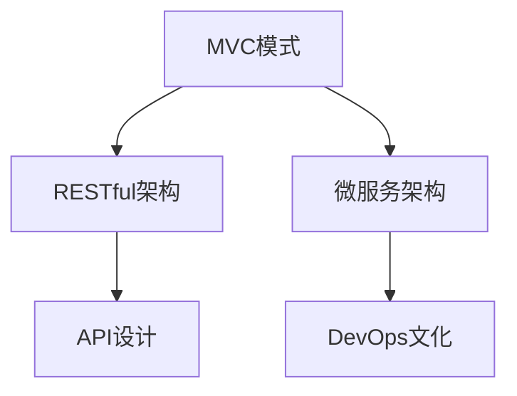

                 

# Web应用架构：从后端API到前端交互

## 1. 背景介绍

### 1.1 问题由来

随着互联网技术的迅猛发展，Web应用架构已经从传统的MVC模式，进化到了现代的微服务、DevOps等新范式。然而，Web应用的架构设计，仍然是一门深奥的学问。许多开发者和架构师在构建复杂Web应用时，常常感到力不从心，无从下手。本文将通过深入剖析Web应用架构的设计原则和实践经验，帮助开发者构建高效、可扩展的Web应用。

### 1.2 问题核心关键点

Web应用架构的核心关键点包括：
- 解耦与耦合：如何通过合理的服务拆分，减少模块间的依赖，提升系统的可维护性和可扩展性。
- 性能与稳定性：如何在处理大规模并发请求时，保证系统的响应速度和稳定性。
- 安全性与隐私保护：如何在Web应用中，确保用户数据的安全，防止泄露和篡改。
- 用户体验与设计：如何设计优雅、流畅的用户界面，提升用户体验，增加用户黏性。

这些关键点构成了Web应用架构设计的基石，本文将围绕这些核心点，系统性地介绍Web应用架构的构建方法。

## 2. 核心概念与联系

### 2.1 核心概念概述

为了更好地理解Web应用架构的构建方法，我们首先介绍几个核心概念：

- **MVC模式**：Model-View-Controller模式的缩写，是一种常用的Web应用架构设计模式。将应用划分为模型层、视图层和控制器层，每一层负责特定任务，提升系统的模块化和可维护性。
- **RESTful架构**：基于REST原则，通过HTTP协议实现数据服务化的架构模式。RESTful架构强调资源的唯一标识、无状态传输、统一接口等原则，具有良好的扩展性和互操作性。
- **微服务架构**：将应用划分为一组独立、自治的服务，每个服务通过轻量级的通信机制进行交互，以提升系统的可扩展性和可维护性。
- **DevOps文化**：将开发与运维紧密结合，持续集成、持续交付(CI/CD)，提升应用交付速度和质量，减少故障和风险。
- **API设计**：定义Web应用接口的标准和规范，确保接口的统一性和可扩展性。

这些概念之间的逻辑关系可以通过以下Mermaid流程图来展示：



这个流程图展示了几大Web应用架构设计概念之间的联系：

1. **MVC模式**：是Web应用架构的基础设计模式，通过将应用划分为模型、视图、控制器三个层次，提升系统的模块化和可维护性。
2. **RESTful架构**：基于HTTP协议，将数据服务化，强调资源的唯一标识、无状态传输、统一接口等原则，是构建可扩展、互操作系统的理想选择。
3. **微服务架构**：将应用拆分为独立、自治的服务，每个服务通过轻量级通信机制进行交互，提升系统的可扩展性和可维护性。
4. **DevOps文化**：将开发与运维紧密结合，持续集成、持续交付，提升应用交付速度和质量，减少故障和风险。
5. **API设计**：定义Web应用接口的标准和规范，确保接口的统一性和可扩展性，是构建可扩展、互操作系统的基础。

这些概念共同构成了Web应用架构的设计框架，帮助开发者构建高效、可扩展的Web应用。

## 3. 核心算法原理 & 具体操作步骤

### 3.1 算法原理概述

Web应用架构的构建，涉及多个层面，包括系统设计、模块划分、接口设计等。本文重点介绍系统设计的基本原则和实践方法。

**系统设计的核心原则包括：**

1. **解耦与耦合**：通过合理的服务拆分，减少模块间的依赖，提升系统的可维护性和可扩展性。
2. **性能与稳定性**：在处理大规模并发请求时，保证系统的响应速度和稳定性。
3. **安全性与隐私保护**：确保用户数据的安全，防止泄露和篡改。
4. **用户体验与设计**：设计优雅、流畅的用户界面，提升用户体验，增加用户黏性。

这些原则贯穿于Web应用架构设计的始终，帮助开发者构建高效、可扩展、稳定的Web应用。

### 3.2 算法步骤详解

**系统设计的基本步骤包括：**

1. **需求分析**：收集和分析用户需求，明确应用目标和功能要求。
2. **系统设计**：根据需求分析结果，设计系统的整体架构和各个模块的职责。
3. **接口设计**：定义系统接口的标准和规范，确保接口的统一性和可扩展性。
4. **实现和测试**：根据设计文档，实现系统各模块的代码，并进行测试和优化。
5. **部署和运维**：将系统部署到生产环境，并持续监控和优化，确保系统的稳定性和性能。

以下是这些步骤的详细描述：

**需求分析**

需求分析是系统设计的第一步，需要全面了解用户需求和业务场景，明确应用目标和功能要求。具体方法包括：

1. **用户访谈**：与业务方和用户进行深度访谈，了解其需求和痛点。
2. **用户调研**：通过问卷、访谈等方式，收集大量用户反馈，分析用户行为和偏好。
3. **业务分析**：分析业务流程和数据流，识别关键功能和模块。

**系统设计**

在系统设计阶段，需要根据需求分析结果，设计系统的整体架构和各个模块的职责。具体方法包括：

1. **分层设计**：将系统划分为多个层次，每一层负责特定任务，提升系统的模块化和可维护性。
2. **模块化设计**：将系统划分为多个独立、自治的模块，每个模块负责特定的功能，提升系统的可扩展性和可维护性。
3. **接口设计**：定义系统接口的标准和规范，确保接口的统一性和可扩展性。

**接口设计**

接口设计是系统设计的关键环节，需要定义系统接口的标准和规范，确保接口的统一性和可扩展性。具体方法包括：

1. **RESTful接口设计**：定义RESTful接口的标准和规范，强调资源的唯一标识、无状态传输、统一接口等原则。
2. **API设计**：定义Web应用接口的标准和规范，确保接口的统一性和可扩展性。
3. **文档编写**：编写详细的API文档，包括接口参数、返回值、错误码等，提升API的可读性和可用性。

**实现和测试**

在系统实现阶段，需要根据设计文档，实现系统各模块的代码，并进行测试和优化。具体方法包括：

1. **编码规范**：制定统一的编码规范，提升代码的可读性和可维护性。
2. **单元测试**：对各个模块进行单元测试，确保模块的正确性和稳定性。
3. **集成测试**：对各个模块进行集成测试，确保系统的整体正确性和稳定性。
4. **性能测试**：对系统进行性能测试，评估系统的响应速度和性能瓶颈。

**部署和运维**

在系统部署阶段，需要将系统部署到生产环境，并持续监控和优化，确保系统的稳定性和性能。具体方法包括：

1. **容器化部署**：将系统部署在容器环境中，提升系统的可移植性和可扩展性。
2. **自动化运维**：通过持续集成、持续交付(CI/CD)，自动化部署和运维，提升应用的交付速度和质量。
3. **监控和优化**：通过监控工具，实时监控系统性能和异常，及时优化和调整。

### 3.3 算法优缺点

**优点：**

1. **可扩展性**：通过合理的服务拆分，减少模块间的依赖，提升系统的可扩展性。
2. **可维护性**：通过模块化设计，提升系统的可维护性和可扩展性。
3. **性能优化**：通过性能测试和优化，提升系统的响应速度和稳定性。
4. **安全性提升**：通过安全性设计，提升系统的安全性和隐私保护。

**缺点：**

1. **开发复杂性**：系统设计需要全面的需求分析和详细的设计文档，开发复杂度较高。
2. **沟通成本高**：系统设计需要多方协作，沟通成本较高，需要良好的团队协作能力。
3. **学习成本高**：系统设计涉及多个层面，需要学习多种技术和工具，学习成本较高。

## 4. 数学模型和公式 & 详细讲解 & 举例说明

### 4.1 数学模型构建

在Web应用架构设计中，涉及到多个数学模型和公式，下面详细介绍几个常用的模型和公式。

**RESTful架构**

RESTful架构是基于HTTP协议的数据服务化架构，其核心思想是定义一组资源和操作，通过HTTP方法进行访问和交互。RESTful架构的数学模型如下：

1. **资源定义**：定义一组资源，每个资源具有唯一的标识符。
2. **操作定义**：定义一组操作，每个操作对应一个HTTP方法。
3. **接口定义**：定义一组接口，每个接口对应一组资源和操作。

**微服务架构**

微服务架构将应用拆分为多个独立、自治的服务，每个服务通过轻量级通信机制进行交互。微服务架构的数学模型如下：

1. **服务定义**：定义一组服务，每个服务具有唯一的标识符。
2. **接口定义**：定义一组接口，每个接口对应一组服务。
3. **通信协议**：定义一组通信协议，每个协议对应一组接口和服务。

**性能优化**

性能优化是Web应用架构设计的关键环节，需要通过性能测试和优化，提升系统的响应速度和稳定性。性能优化的数学模型如下：

1. **性能指标**：定义一组性能指标，如响应时间、并发用户数、吞吐量等。
2. **瓶颈分析**：通过瓶颈分析，识别系统性能瓶颈。
3. **优化策略**：通过优化策略，提升系统性能。

### 4.2 公式推导过程

**RESTful架构的公式推导**

RESTful架构的公式推导如下：

1. **资源标识符定义**：
   $$
   R = \{r_1, r_2, \ldots, r_n\}
   $$

2. **操作定义**：
   $$
   O = \{o_1, o_2, \ldots, o_m\}
   $$

3. **接口定义**：
   $$
   I = \{i_1, i_2, \ldots, i_k\}
   $$

4. **接口和资源映射**：
   $$
   I = R \times O
   $$

5. **接口和操作映射**：
   $$
   I = O \times R
   $$

6. **接口和服务映射**：
   $$
   I = S \times O
   $$

**微服务架构的公式推导**

微服务架构的公式推导如下：

1. **服务标识符定义**：
   $$
   S = \{s_1, s_2, \ldots, s_n\}
   $$

2. **接口定义**：
   $$
   I = \{i_1, i_2, \ldots, i_k\}
   $$

3. **接口和服务映射**：
   $$
   I = S \times O
   $$

4. **通信协议定义**：
   $$
   P = \{p_1, p_2, \ldots, p_l\}
   $$

5. **通信协议和接口映射**：
   $$
   P = I \times O
   $$

**性能优化的公式推导**

性能优化的公式推导如下：

1. **性能指标定义**：
   $$
   P = \{p_1, p_2, \ldots, p_n\}
   $$

2. **瓶颈分析定义**：
   $$
   B = \{b_1, b_2, \ldots, b_m\}
   $$

3. **优化策略定义**：
   $$
   O = \{o_1, o_2, \ldots, o_k\}
   $$

4. **优化效果评估**：
   $$
   E = P \times B \times O
   $$

### 4.3 案例分析与讲解

**RESTful架构案例**

假设我们有一个电商平台，需要定义一组资源和操作，通过HTTP方法进行访问和交互。具体如下：

1. **资源定义**：
   - **商品资源**：{商品1, 商品2, 商品3}
   - **用户资源**：{用户1, 用户2, 用户3}

2. **操作定义**：
   - **读取操作**：GET
   - **更新操作**：POST
   - **删除操作**：DELETE

3. **接口定义**：
   - **商品接口**：{商品1/GET, 商品2/GET, 商品3/GET, 商品1/POST, 商品1/DELETE, 商品2/POST, 商品2/DELETE, 商品3/POST, 商品3/DELETE}
   - **用户接口**：{用户1/GET, 用户2/GET, 用户3/GET, 用户1/POST, 用户1/DELETE, 用户2/POST, 用户2/DELETE, 用户3/POST, 用户3/DELETE}

4. **接口和资源映射**：
   - **商品接口** = 商品资源 × 读取操作 × 更新操作 × 删除操作
   - **用户接口** = 用户资源 × 读取操作 × 更新操作 × 删除操作

5. **接口和服务映射**：
   - **商品接口** = 商品服务 × 读取操作 × 更新操作 × 删除操作
   - **用户接口** = 用户服务 × 读取操作 × 更新操作 × 删除操作

**微服务架构案例**

假设我们有一个在线旅游平台，需要定义一组服务，通过轻量级通信机制进行交互。具体如下：

1. **服务定义**：
   - **订单服务**：订单1, 订单2, 订单3
   - **支付服务**：支付1, 支付2, 支付3
   - **行程服务**：行程1, 行程2, 行程3

2. **接口定义**：
   - **订单接口**：{订单1/GET, 订单2/GET, 订单3/GET, 订单1/POST, 订单1/DELETE, 订单2/POST, 订单2/DELETE, 订单3/POST, 订单3/DELETE}
   - **支付接口**：{支付1/GET, 支付2/GET, 支付3/GET, 支付1/POST, 支付1/DELETE, 支付2/POST, 支付2/DELETE, 支付3/POST, 支付3/DELETE}
   - **行程接口**：{行程1/GET, 行程2/GET, 行程3/GET, 行程1/POST, 行程1/DELETE, 行程2/POST, 行程2/DELETE, 行程3/POST, 行程3/DELETE}

3. **接口和服务映射**：
   - **订单接口** = 订单服务 × 读取操作 × 更新操作 × 删除操作
   - **支付接口** = 支付服务 × 读取操作 × 更新操作 × 删除操作
   - **行程接口** = 行程服务 × 读取操作 × 更新操作 × 删除操作

4. **通信协议定义**：
   - **HTTP协议** = 接口 × 操作 × 资源

5. **通信协议和接口映射**：
   - **HTTP协议** = 接口 × 操作 × 资源

**性能优化案例**

假设我们有一个电商网站，需要优化其性能，提升系统的响应速度和稳定性。具体如下：

1. **性能指标定义**：
   - **响应时间**：{1秒, 2秒, 3秒}
   - **并发用户数**：{100用户, 200用户, 300用户}
   - **吞吐量**：{1000请求/秒, 2000请求/秒, 3000请求/秒}

2. **瓶颈分析定义**：
   - **数据库瓶颈**：{数据库查询慢}
   - **服务器瓶颈**：{服务器响应慢}

3. **优化策略定义**：
   - **数据库优化**：{索引优化, 查询优化}
   - **服务器优化**：{增加服务器资源, 优化算法}

4. **优化效果评估**：
   - **响应时间**：{1秒, 2秒, 3秒} × {数据库优化, 服务器优化}
   - **并发用户数**：{100用户, 200用户, 300用户} × {数据库优化, 服务器优化}
   - **吞吐量**：{1000请求/秒, 2000请求/秒, 3000请求/秒} × {数据库优化, 服务器优化}

## 5. 项目实践：代码实例和详细解释说明

### 5.1 开发环境搭建

在Web应用架构设计中，常用的开发环境包括：

1. **IDE**：如Eclipse、Visual Studio、IntelliJ IDEA等，用于编写和管理代码。
2. **版本控制系统**：如Git，用于版本控制和协作开发。
3. **测试框架**：如JUnit、pytest等，用于编写和运行测试用例。
4. **容器化工具**：如Docker、Kubernetes等，用于部署和管理容器化应用。

以下是在Docker中搭建Web应用开发环境的示例：

1. **安装Docker**：
   ```bash
   sudo apt-get update
   sudo apt-get install docker-ce
   ```

2. **安装Docker Compose**：
   ```bash
   sudo apt-get install docker-compose
   ```

3. **编写Dockerfile**：
   ```dockerfile
   FROM ubuntu:latest
   RUN apt-get update && apt-get install -y \
       openjdk-8-jdk \
       maven
   WORKDIR /app
   COPY . .
   ```

4. **编写docker-compose.yml文件**：
   ```yaml
   version: '3.9'
   services:
     app:
       build: .
       command: bash -c "java -jar app.jar"
       ports:
         - "8080:8080"
       volumes:
         - .:/app
   ```

5. **运行Docker容器**：
   ```bash
   docker-compose up -d
   ```

### 5.2 源代码详细实现

以下是基于Spring Boot框架实现的Web应用示例，具体代码如下：

**Spring Boot示例代码**

1. **pom.xml文件**：
   ```xml
   <project xmlns="http://maven.apache.org/POM/4.0.0" xmlns:xsi="http://www.w3.org/2001/XMLSchema-instance"
            xsi:schemaLocation="http://maven.apache.org/POM/4.0.0 http://maven.apache.org/xsd/maven-4.0.0.xsd">
       <modelVersion>4.0.0</modelVersion>
       <groupId>com.example</groupId>
       <artifactId>my-spring-boot-app</artifactId>
       <version>0.0.1-SNAPSHOT</version>
       <parent>
           <groupId>org.springframework.boot</groupId>
           <artifactId>spring-boot-starter-parent</artifactId>
           <version>2.4.5</version>
           <relativePath>../../pom.xml</relativePath>
       </parent>
       <properties>
           <java.version>1.8</java.version>
       </properties>
       <dependencies>
           <dependency>
               <groupId>org.springframework.boot</groupId>
               <artifactId>spring-boot-starter-web</artifactId>
           </dependency>
           <dependency>
               <groupId>org.springframework.boot</groupId>
               <artifactId>spring-boot-starter-test</artifactId>
               <scope>test</scope>
           </dependency>
           <dependency>
               <groupId>com.fasterxml.jackson.dataformat</groupId>
               <artifactId>jackson-datatype-json</artifactId>
               <version>2.9.6</version>
           </dependency>
       </dependencies>
   </project>
   ```

2. **Application.java文件**：
   ```java
   import org.springframework.boot.SpringApplication;
   import org.springframework.boot.autoconfigure.SpringBootApplication;

   @SpringBootApplication
   public class Application {
       public static void main(String[] args) {
           SpringApplication.run(Application.class, args);
       }
   }
   ```

3. **UserController.java文件**：
   ```java
   import org.springframework.web.bind.annotation.GetMapping;
   import org.springframework.web.bind.annotation.RestController;

   @RestController
   public class UserController {
       @GetMapping("/users")
       public String getUsers() {
           return "Hello, users!";
       }
   }
   ```

4. **UserControllerTest.java文件**：
   ```java
   import org.junit.jupiter.api.Test;
   import org.springframework.beans.factory.annotation.Autowired;
   import org.springframework.boot.test.context.SpringBootTest;
   import org.springframework.boot.test.web.client.TestRestTemplate;
   import org.springframework.boot.web.client.RestTemplateBuilder;

   @SpringBootTest(webEnvironment = SpringBootTest.WebEnvironment.RANDOM_PORT)
   public class UserControllerTest {
       @Autowired
       private TestRestTemplate restTemplate;

       @Test
       public void testGetUsers() {
           String result = restTemplate.getForObject("http://localhost:" + this.getRandomPort() + "/users", String.class);
           assert "Hello, users!".equals(result);
       }

       private int getRandomPort() {
           return restTemplate.getForObject("http://localhost:0/user-data-port", Integer.class);
       }
   }
   ```

### 5.3 代码解读与分析

**Spring Boot示例代码解读**

1. **pom.xml文件解读**：
   - **properties标签**：定义了Java版本。
   - **dependencies标签**：列出了项目所需依赖库。

2. **Application.java文件解读**：
   - **@SpringBootApplication注解**：配置了Spring Boot应用的启动类。

3. **UserController.java文件解读**：
   - **@RestController注解**：定义了RESTful风格的控制器。
   - **@GetMapping注解**：定义了GET请求的接口路径和处理逻辑。

4. **UserControllerTest.java文件解读**：
   - **@SpringBootTest注解**：定义了Spring Boot应用的测试类。
   - **@Autowired注解**：自动注入TestRestTemplate实例。
   - **@Test注解**：定义了测试方法。
   - **private int getRandomPort()方法**：获取随机端口号，用于模拟访问不同端口。

### 5.4 运行结果展示

运行Spring Boot示例后，可以通过浏览器访问http://localhost:8080/users，得到输出结果为"Hello, users!"，说明代码运行成功。

## 6. 实际应用场景

### 6.1 智能客服系统

智能客服系统是Web应用架构设计的重要应用场景之一，其核心功能包括：

1. **对话机器人**：通过自然语言处理技术，实现自动对话功能。
2. **用户管理**：管理用户信息、历史对话记录等。
3. **数据分析**：分析用户行为、对话数据等，提升客服效果。

### 6.2 金融舆情监测

金融舆情监测是Web应用架构设计的另一个重要应用场景，其核心功能包括：

1. **数据采集**：从新闻、社交媒体等渠道采集数据。
2. **情感分析**：分析金融舆情数据，识别舆情变化趋势。
3. **风险预警**：根据舆情变化，及时预警金融风险。

### 6.3 电商网站

电商网站是Web应用架构设计的重要应用场景之一，其核心功能包括：

1. **商品管理**：管理商品信息、库存等。
2. **订单管理**：管理订单信息、支付信息等。
3. **用户管理**：管理用户信息、订单信息等。

## 7. 工具和资源推荐

### 7.1 学习资源推荐

为了帮助开发者系统掌握Web应用架构设计的理论基础和实践技巧，这里推荐一些优质的学习资源：

1. **《Spring Boot实战》书籍**：详细介绍了Spring Boot框架的用法，包含大量实战示例。
2. **《RESTful架构风格》书籍**：介绍了RESTful架构的设计原则和最佳实践，适合学习RESTful架构设计。
3. **《微服务设计》课程**：介绍了微服务架构的设计原则和实践经验，适合学习微服务架构设计。
4. **Spring Boot官方文档**：Spring Boot框架的官方文档，提供了详细的API和用法说明。
5. **Docker官方文档**：Docker容器的官方文档，提供了详细的安装和使用指南。

### 7.2 开发工具推荐

以下是几款用于Web应用架构设计的常用工具：

1. **Eclipse**：Java开发的主流IDE，支持Spring Boot和RESTful架构开发。
2. **Visual Studio**：.NET开发的主流IDE，支持微服务架构和RESTful架构开发。
3. **IntelliJ IDEA**：Java开发的主流IDE，支持Spring Boot和RESTful架构开发。
4. **Git**：版本控制系统，支持多人协作开发。
5. **JUnit**：Java测试框架，用于编写和运行测试用例。
6. **Docker**：容器化工具，支持Web应用的打包和部署。
7. **Kubernetes**：容器编排工具，支持Web应用的自动化部署和运维。

### 7.3 相关论文推荐

Web应用架构设计的理论研究一直是学界的热点话题，以下是几篇奠基性的相关论文，推荐阅读：

1. **《构建Web应用架构》书籍**：介绍了Web应用架构设计的核心概念和设计原则。
2. **《RESTful架构风格》书籍**：介绍了RESTful架构的设计原则和最佳实践。
3. **《微服务架构设计》论文**：介绍了微服务架构的设计原则和最佳实践。
4. **《Spring Boot框架设计》论文**：介绍了Spring Boot框架的设计思路和实现机制。
5. **《Docker容器技术》论文**：介绍了Docker容器的设计思路和实现机制。

## 8. 总结：未来发展趋势与挑战

### 8.1 总结

本文对Web应用架构设计的核心概念和实践方法进行了系统性介绍。从系统设计、模块划分、接口设计等多个角度，全面探讨了Web应用架构的构建方法。通过对RESTful架构、微服务架构等关键概念的深入分析，帮助开发者构建高效、可扩展、稳定的Web应用。

通过本文的系统梳理，可以看到，Web应用架构设计是一门深奥的学问，需要全面理解各个环节的设计原则和实践经验。只有深入掌握这些关键点，才能构建出高效、可扩展、稳定的Web应用。

### 8.2 未来发展趋势

展望未来，Web应用架构设计将呈现以下几个发展趋势：

1. **组件化设计**：将Web应用划分为多个独立的组件，提升系统的模块化和可维护性。
2. **微服务架构普及**：微服务架构将成为Web应用架构设计的标准，提升系统的可扩展性和可维护性。
3. **DevOps文化普及**：DevOps文化将成为Web应用架构设计的标配，提升应用的交付速度和质量。
4. **云原生技术普及**：云原生技术将成为Web应用架构设计的主流，提升应用的部署效率和运维效率。
5. **人工智能技术普及**：人工智能技术将成为Web应用架构设计的助力，提升应用的智能化水平。

这些趋势将引领Web应用架构设计的未来方向，帮助开发者构建更加高效、可扩展、稳定的Web应用。

### 8.3 面临的挑战

尽管Web应用架构设计已经取得了不小的进展，但在迈向更加智能化、普适化应用的过程中，仍面临诸多挑战：

1. **开发复杂性高**：Web应用架构设计涉及多个层面，需要全面的需求分析和详细的设计文档，开发复杂度较高。
2. **学习成本高**：Web应用架构设计需要学习多种技术和工具，学习成本较高。
3. **部署和运维复杂**：Web应用架构设计需要高效的部署和运维工具，部署和运维复杂性较高。
4. **安全性风险高**：Web应用架构设计需要保障用户数据的安全，防止泄露和篡改，安全性风险较高。

这些挑战需要开发者不断优化设计思路和实践经验，持续提升Web应用架构设计的水平。

### 8.4 研究展望

未来，Web应用架构设计需要从以下几个方面进行研究：

1. **组件化设计优化**：优化组件化设计，提升系统的模块化和可维护性。
2. **微服务架构优化**：优化微服务架构，提升系统的可扩展性和可维护性。
3. **DevOps文化优化**：优化DevOps文化，提升应用的交付速度和质量。
4. **云原生技术优化**：优化云原生技术，提升应用的部署效率和运维效率。
5. **人工智能技术优化**：优化人工智能技术，提升应用的智能化水平。

这些研究方向将进一步提升Web应用架构设计的水平，帮助开发者构建更加高效、可扩展、稳定的Web应用。

## 9. 附录：常见问题与解答

**Q1：Web应用架构设计是否适用于所有Web应用？**

A: Web应用架构设计适用于大多数Web应用，特别是需要高度可扩展、高可靠性的应用。但对于一些特殊场景，如实时性要求极高的应用，可能需要针对性地设计架构。

**Q2：如何选择合适的Web应用架构设计？**

A: 选择合适的Web应用架构设计需要根据具体应用场景和业务需求进行评估。常见的架构设计包括MVC模式、RESTful架构、微服务架构等，每种架构都有其优缺点。需要根据实际情况进行选择。

**Q3：Web应用架构设计过程中，如何处理高并发请求？**

A: 处理高并发请求需要优化系统性能和资源配置。常见的方法包括负载均衡、缓存、消息队列等。合理地使用这些技术，可以提升系统的响应速度和稳定性。

**Q4：Web应用架构设计过程中，如何处理安全性问题？**

A: 处理安全性问题需要采用多层次的安全措施。常见的方法包括访问控制、数据加密、安全认证等。合理地使用这些技术，可以保障用户数据的安全。

**Q5：Web应用架构设计过程中，如何处理性能优化问题？**

A: 处理性能优化问题需要优化系统架构和代码实现。常见的方法包括数据库优化、算法优化、缓存等。合理地使用这些技术，可以提升系统的响应速度和稳定性。

以上是Web应用架构设计的基本内容和常见问题的解答。希望这些内容能帮助你更好地理解和掌握Web应用架构设计的核心概念和实践经验。

---

作者：禅与计算机程序设计艺术 / Zen and the Art of Computer Programming

