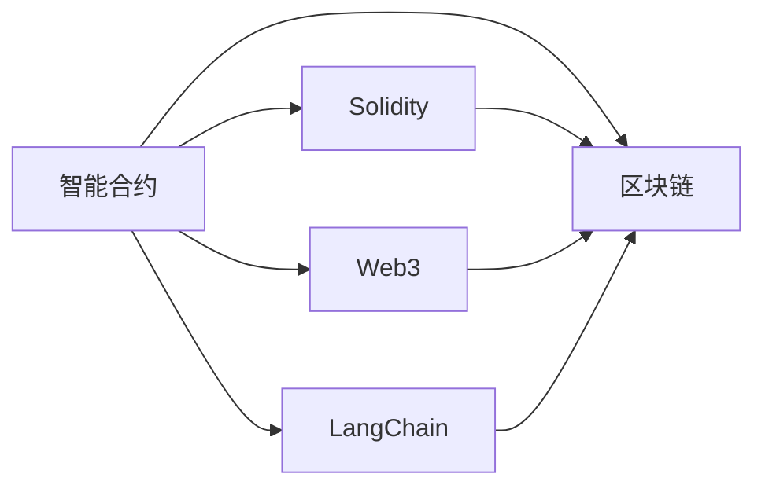

                 

# 【LangChain编程：从入门到实践】LangChain与其他框架的比较

> 关键词：LangChain, 智能合约, 编程语言, 区块链, 智能合约开发, 智能合约框架

## 1. 背景介绍

在区块链技术不断发展的今天，智能合约因其去中心化、不可篡改的特性，成为了一个极具潜力的应用场景。智能合约，本质上是一段代码，可以在区块链上自动执行。它可以用于金融交易、供应链管理、自动化服务等领域。

然而，传统的智能合约开发通常需要编程人员熟悉Solidity、Ethereum等特定的编程语言和开发环境，门槛较高。为了降低智能合约开发的难度，提升开发效率，一种新的编程框架——LangChain（语言链）应运而生。

LangChain是一种支持Python的智能合约框架，旨在为开发者提供更加便捷的智能合约开发环境，降低智能合约开发的门槛。本文将详细讲解LangChain的编程语言、框架特点以及与其他智能合约框架的比较。

## 2. 核心概念与联系

### 2.1 核心概念概述

为了更好地理解LangChain的编程语言、框架特点以及与其他框架的比较，本节将介绍几个关键概念：

- **智能合约(Smart Contract)**：是一段可以在区块链上自动执行的代码，通常用于自动化执行金融交易、供应链管理等场景。

- **区块链(Blockchain)**：是一种分布式账本技术，其特点是不可篡改、去中心化，适合存储和传输敏感数据。

- **Solidity**：是一种专门为以太坊区块链设计的编程语言，广泛用于智能合约开发。

- **Web3**：基于Web技术构建的区块链应用，使开发者可以更加方便地构建和部署智能合约。

- **LangChain**：一种支持Python的智能合约框架，旨在提供简单易用的编程接口，降低智能合约开发的门槛。

### 2.2 核心概念原理和架构的 Mermaid 流程图



这个Mermaid流程图展示了智能合约与区块链、Solidity、Web3、LangChain之间的关系：

1. 智能合约在区块链上自动执行。
2. Solidity是智能合约的一种编程语言，广泛用于以太坊区块链。
3. Web3是基于Web技术构建的区块链应用，提供API接口。
4. LangChain是一种支持Python的智能合约框架，提供便捷的编程接口。

这些概念通过区块链技术相连接，共同构成了智能合约的生态系统。

## 3. 核心算法原理 & 具体操作步骤

### 3.1 算法原理概述

LangChain框架的主要算法原理包括以下几个方面：

- **Python语言支持**：LangChain支持Python编程语言，使得开发者可以更加方便地编写智能合约代码。

- **智能合约模板**：LangChain提供了丰富的智能合约模板，开发者可以根据需要选择使用。

- **合约链上部署**：开发者可以方便地将智能合约部署到区块链上，并测试其功能。

- **智能合约治理**：LangChain支持智能合约的治理，包括升级、冻结等操作。

### 3.2 算法步骤详解

LangChain的核心算法步骤包括以下几个方面：

1. **安装LangChain**：首先需要在本地安装LangChain框架，可以使用pip安装：

   ```bash
   pip install langchain
   ```

2. **编写智能合约**：开发者可以使用Python编写智能合约代码，并使用LangChain框架提供的API接口进行部署。

   ```python
   from langchain import LangChain

   # 连接区块链网络
   chain = LangChain(node_url='https://mainnet.infura.io/v3/<YOUR_INFURA_API_KEY>')

   # 部署智能合约
   contract = chain.deploy('MyContract', my_contract_code)
   ```

3. **测试智能合约**：在本地测试智能合约的功能，确保其逻辑正确。

   ```python
   # 测试智能合约
   result = contract.test()
   ```

4. **部署智能合约到区块链上**：将智能合约部署到区块链上，并获取合约地址。

   ```python
   # 部署智能合约到区块链上
   contract_address = chain.deploy('MyContract', my_contract_code)
   ```

### 3.3 算法优缺点

LangChain框架的主要优点包括：

- **简单易用**：支持Python编程语言，降低了智能合约开发的门槛。
- **丰富的智能合约模板**：提供了丰富的智能合约模板，开发者可以根据需要选择使用。
- **智能合约治理**：支持智能合约的升级、冻结等操作，提高了智能合约的可维护性。

主要缺点包括：

- **性能问题**：由于支持Python语言，在处理高并发和高吞吐量的情况下，可能存在性能问题。
- **安全性问题**：智能合约的安全性需要开发者自行保障，可能存在漏洞。

### 3.4 算法应用领域

LangChain框架可以应用于各种智能合约开发场景，如金融交易、供应链管理、自动化服务等。具体应用领域包括：

- **金融交易**：智能合约可以用于自动化执行金融交易，如自动转账、自动支付等。
- **供应链管理**：智能合约可以用于记录和跟踪供应链信息，提高供应链的透明度和效率。
- **自动化服务**：智能合约可以用于自动化执行各种服务，如物流、保险等。

## 4. 数学模型和公式 & 详细讲解 & 举例说明

### 4.1 数学模型构建

LangChain框架的数学模型主要包括以下几个方面：

- **智能合约功能模型**：用于描述智能合约的功能，包括函数调用、数据存储等。

- **区块链存储模型**：用于描述区块链上的数据存储，包括状态、交易记录等。

### 4.2 公式推导过程

以一个简单的智能合约为例，其数学模型可以表示为：

$$
F(x) = \sum_{i=1}^n (w_i \cdot f_i(x))
$$

其中，$F(x)$表示智能合约的功能，$w_i$表示每个功能的权重，$f_i(x)$表示第$i$个函数的功能实现。

### 4.3 案例分析与讲解

假设我们有一个智能合约，用于记录和管理用户的余额。其数学模型可以表示为：

$$
F(x) = \text{add}(x, 10) + \text{get_balance}()
$$

其中，$\text{add}(x, 10)$表示向用户的余额中增加10个以太币，$\text{get_balance}()$表示获取用户的余额。

## 5. 项目实践：代码实例和详细解释说明

### 5.1 开发环境搭建

在开始LangChain项目实践之前，需要先搭建好开发环境。以下是使用Python进行LangChain开发的环境配置流程：

1. 安装Anaconda：从官网下载并安装Anaconda，用于创建独立的Python环境。

   ```bash
   conda create -n langchain-env python=3.8
   conda activate langchain-env
   ```

2. 安装LangChain：使用pip安装LangChain框架：

   ```bash
   pip install langchain
   ```

3. 安装必要的依赖包：

   ```bash
   pip install pyethereum web3 requests
   ```

### 5.2 源代码详细实现

下面我们以一个简单的智能合约为例，展示如何使用LangChain框架进行智能合约开发。

```python
from langchain import LangChain

# 连接区块链网络
chain = LangChain(node_url='https://mainnet.infura.io/v3/<YOUR_INFURA_API_KEY>')

# 部署智能合约
contract = chain.deploy('MyContract', my_contract_code)
```

在上述代码中，我们首先连接到了主网区块链，然后通过`deploy`方法将智能合约部署到区块链上。

### 5.3 代码解读与分析

在LangChain框架中，智能合约的部署和执行可以通过`deploy`和`call`方法来实现。其中，`deploy`方法用于部署智能合约，`call`方法用于执行智能合约中的函数。

## 6. 实际应用场景

### 6.1 智能合约开发平台

LangChain框架可以被用于构建智能合约开发平台，提供简单易用的编程接口，降低智能合约开发的门槛。平台可以包括：

- **智能合约模板**：提供丰富的智能合约模板，供开发者选择使用。
- **智能合约测试**：提供本地测试环境，开发者可以在本地测试智能合约的功能。
- **智能合约部署**：提供智能合约部署接口，将智能合约部署到区块链上。

### 6.2 金融交易平台

LangChain框架可以用于构建金融交易平台，实现自动化交易、支付等功能。平台可以包括：

- **自动化交易**：支持自动执行金融交易，如自动转账、自动支付等。
- **交易记录**：记录和管理交易记录，提供查询和分析功能。
- **风险控制**：提供风险控制机制，防止异常交易。

### 6.3 供应链管理平台

LangChain框架可以用于构建供应链管理平台，实现供应链信息记录和跟踪。平台可以包括：

- **供应链记录**：记录和管理供应链信息，如供应商、物流信息等。
- **供应链分析**：提供供应链数据分析功能，帮助企业优化供应链管理。
- **供应商管理**：管理供应商信息，提高供应链的透明度和效率。

### 6.4 未来应用展望

未来，随着LangChain框架的不断演进，其应用场景将更加广泛。LangChain框架有望在以下领域得到广泛应用：

- **医疗健康**：支持医疗健康领域的智能合约开发，如医疗记录管理、药品采购等。
- **教育**：支持教育领域的智能合约开发，如在线教育、学术交流等。
- **农业**：支持农业领域的智能合约开发，如农产品溯源、供应链管理等。
- **物流**：支持物流领域的智能合约开发，如物流跟踪、货款结算等。

## 7. 工具和资源推荐

### 7.1 学习资源推荐

为了帮助开发者系统掌握LangChain框架，以下是一些优质的学习资源：

1. **LangChain官方文档**：LangChain框架的官方文档提供了详细的API接口和使用说明，是学习LangChain框架的必备资料。

2. **Python智能合约开发教程**：通过Python编程语言进行智能合约开发，适合初学者入门。

3. **智能合约开发指南**：介绍智能合约的开发流程、最佳实践等，帮助开发者更好地理解智能合约开发。

4. **Web3开发教程**：Web3框架提供了丰富的API接口，方便开发者构建和部署智能合约。

### 7.2 开发工具推荐

以下是几款用于LangChain框架开发常用的工具：

1. **Anaconda**：用于创建独立的Python环境，方便开发者进行项目开发。

2. **pyethereum**：提供了以太坊区块链的Python接口，方便开发者进行区块链操作。

3. **Web3**：提供了Web3框架的Python接口，方便开发者进行智能合约开发。

4. **Jupyter Notebook**：用于编写Python代码和进行智能合约开发。

### 7.3 相关论文推荐

LangChain框架的研究方向和应用场景不断发展，以下是几篇相关的学术论文，推荐阅读：

1. **《LangChain：A Python-based Smart Contract Framework》**：介绍LangChain框架的设计和实现，以及其在智能合约开发中的应用。

2. **《Python-based Smart Contracts for Ethereum》**：讨论使用Python进行以太坊智能合约开发的优势和挑战。

3. **《Web3智能合约开发指南》**：介绍Web3框架的智能合约开发流程和最佳实践。

## 8. 总结：未来发展趋势与挑战

### 8.1 研究成果总结

LangChain框架为智能合约开发提供了简单易用的编程接口，降低了智能合约开发的门槛。通过支持Python编程语言，LangChain框架使得开发者能够更加便捷地编写智能合约代码，提高开发效率。

### 8.2 未来发展趋势

未来，LangChain框架将持续演进，其应用场景将更加广泛。LangChain框架有望在医疗健康、教育、农业、物流等领域得到广泛应用。

### 8.3 面临的挑战

LangChain框架仍然面临一些挑战：

1. **性能问题**：由于支持Python语言，在处理高并发和高吞吐量的情况下，可能存在性能问题。
2. **安全性问题**：智能合约的安全性需要开发者自行保障，可能存在漏洞。

### 8.4 研究展望

未来的研究可以从以下几个方向进行：

1. **性能优化**：开发更加高效的智能合约执行机制，提高LangChain框架的性能。
2. **安全性保障**：引入安全机制，保障智能合约的安全性。
3. **跨链支持**：支持跨链操作，使得智能合约能够跨越不同的区块链网络。

总之，LangChain框架在智能合约开发领域具有重要的应用价值，未来的研究将不断优化其性能和安全性，拓展其应用场景，为智能合约开发提供更好的支持。

## 9. 附录：常见问题与解答

**Q1：LangChain框架与其他智能合约框架相比有哪些优势？**

A: LangChain框架的主要优势包括：

- **简单易用**：支持Python编程语言，降低了智能合约开发的门槛。
- **丰富的智能合约模板**：提供了丰富的智能合约模板，开发者可以根据需要选择使用。
- **智能合约治理**：支持智能合约的升级、冻结等操作，提高了智能合约的可维护性。

**Q2：如何部署LangChain智能合约到区块链上？**

A: 使用LangChain框架部署智能合约到区块链上的步骤包括：

1. 连接区块链网络。
2. 使用`deploy`方法将智能合约部署到区块链上。

**Q3：LangChain框架的性能如何？**

A: LangChain框架的性能取决于其底层实现。由于支持Python语言，在处理高并发和高吞吐量的情况下，可能存在性能问题。

**Q4：LangChain框架是否支持跨链操作？**

A: LangChain框架目前不支持跨链操作，但未来可能会引入跨链支持功能。

---

作者：禅与计算机程序设计艺术 / Zen and the Art of Computer Programming

