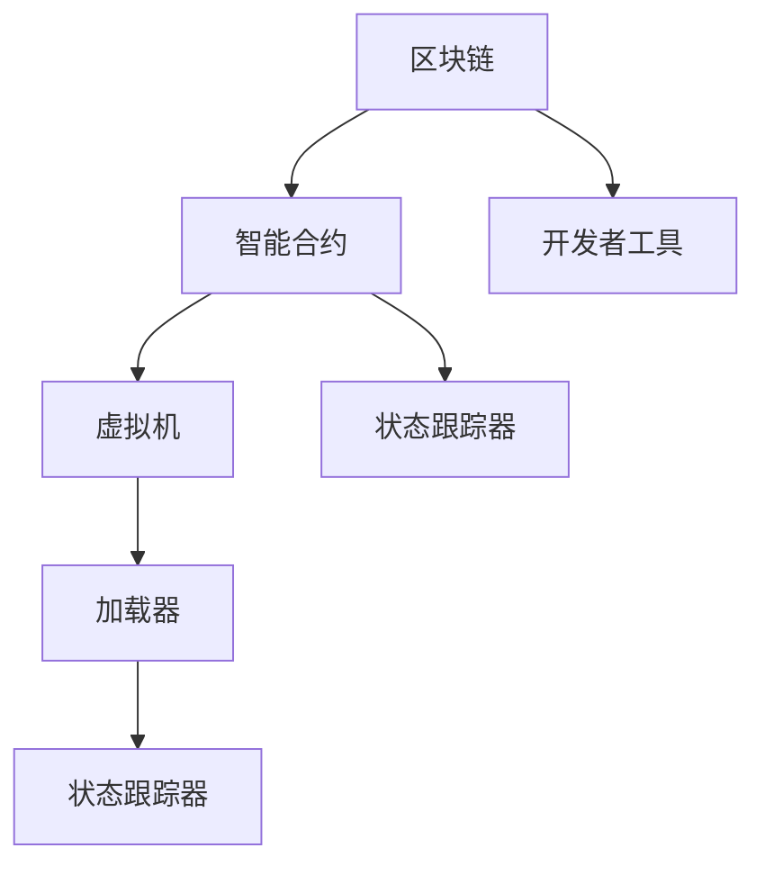

                 

# 【LangChain编程：从入门到实践】加载器

> 关键词：区块链编程, 智能合约, 链上代码, 虚拟机, 状态跟踪, 开发者工具

## 1. 背景介绍

### 1.1 问题由来

随着区块链技术的飞速发展，智能合约作为一种能够自动执行、无需第三方干预的合约形式，成为区块链应用的核心。在智能合约中，代码是关键执行单元，如何安全、高效地加载和执行代码，成为制约智能合约性能和扩展性的关键因素。

然而，目前区块链中的加载器（Loader）模块大多以粗放的方式实现，缺乏系统化的设计和统一的标准。不同区块链平台的加载器实现方式各异，开发者往往需要花费大量精力去理解和适配。

本文旨在通过系统化的阐述和深入的分析，介绍区块链编程中加载器的原理和设计，并提出一套通用的加载器实现方案，为智能合约开发者提供可参考的实现模板。

## 2. 核心概念与联系

### 2.1 核心概念概述

为更好地理解区块链编程中的加载器，本节将介绍几个密切相关的核心概念：

- **区块链**（Blockchain）：一种分布式账本技术，采用去中心化的方式存储和验证交易数据，具有不可篡改和透明的特点。

- **智能合约**（Smart Contract）：一种以代码形式存在的合约，能够在区块链上自动执行、无需第三方干预。

- **虚拟机**（Virtual Machine）：一种模拟计算机执行环境，用于执行智能合约代码。

- **加载器**（Loader）：智能合约运行环境中的代码加载和执行模块，负责将代码转换成字节码并加载到虚拟机中执行。

- **状态跟踪器**（State Tracker）：用于跟踪和记录智能合约执行过程中的状态变化，提供代码执行的上下文信息。

- **开发者工具**（Developer Tools）：包括编辑器、IDE、调试器等工具，帮助开发者更方便地编写和测试智能合约代码。

这些核心概念之间的逻辑关系可以通过以下Mermaid流程图来展示：



这个流程图展示出区块链编程的基本架构和关键组件：

1. **区块链**：为智能合约提供运行平台，确保合约代码和执行记录的不可篡改性和透明性。
2. **智能合约**：以代码形式存在的合约，能够在区块链上自动执行，无需第三方干预。
3. **虚拟机**：模拟计算机执行环境，用于执行智能合约代码。
4. **加载器**：负责将智能合约代码加载到虚拟机中执行。
5. **状态跟踪器**：用于跟踪和记录合约执行过程中的状态变化。
6. **开发者工具**：辅助开发者编写、测试和调试智能合约。

这些组件协同工作，实现了智能合约的自动化和自动化执行。通过理解这些核心概念，可以更好地把握区块链编程的基础原理和实现方法。

## 3. 核心算法原理 & 具体操作步骤

### 3.1 算法原理概述

区块链编程中的加载器负责将智能合约代码转换成字节码，并将其加载到虚拟机中执行。加载器的工作原理可以简述如下：

1. **代码解析**：将智能合约代码解析成中间表示形式，如LLVM字节码。
2. **字节码转换**：将中间表示形式转换成目标虚拟机（如以太坊虚拟机EVM）的字节码。
3. **虚拟机加载**：将字节码加载到虚拟机中，并开始执行。
4. **状态跟踪**：跟踪执行过程中的状态变化，提供上下文信息。

加载器的主要目标是确保代码加载和执行的安全性和高效性。为此，加载器需要处理代码兼容性、字节码优化、虚拟机兼容性等问题，并提供相应的监控和调试机制。

### 3.2 算法步骤详解

以下是区块链编程中加载器的详细操作步骤：

**Step 1: 代码解析**

加载器的第一步是将智能合约代码解析成中间表示形式。常见的解析方式包括：

- **抽象语法树（AST）解析**：将代码解析成抽象语法树，表示代码的语法结构和控制流信息。
- **LLVM字节码生成**：将解析后的AST转换成LLVM字节码，这是以太坊虚拟机EVM使用的目标字节码。

解析过程中，加载器需要识别代码中的关键字、变量、函数等元素，并对其进行语法检查和类型验证。

**Step 2: 字节码转换**

解析完成后，加载器需要将中间表示形式转换成目标虚拟机字节码。例如，以太坊加载器需要将LLVM字节码转换成EVM字节码。

转换过程包括：

- **字节码生成器**：将中间表示形式转换成字节码。
- **字节码优化器**：对生成的字节码进行优化，如常量合并、内联函数、去除无用代码等。

优化过程需要考虑字节码的执行效率和安全性。例如，对于以太坊智能合约，加载器需要对代码进行溢出检查、整数除零检查等安全优化。

**Step 3: 虚拟机加载**

字节码生成和优化后，加载器需要将字节码加载到虚拟机中执行。加载过程包括：

- **虚拟机接口调用**：通过虚拟机提供的接口调用方法，将字节码加载到虚拟机中。
- **代码执行**：启动虚拟机的执行引擎，执行加载的字节码。

加载器需要确保虚拟机加载和执行的过程安全可靠，避免虚拟机溢出、栈溢出等异常。

**Step 4: 状态跟踪**

智能合约执行过程中，状态跟踪器用于跟踪和记录执行过程中的状态变化。状态跟踪器需要记录以下信息：

- **代码执行上下文**：包括代码执行的函数、参数、局部变量等。
- **数据状态变化**：包括合约账户余额、变量值等状态变化。

状态跟踪器需要在代码执行前后进行状态记录，并在代码执行过程中提供状态查询接口，供调试和监控使用。

### 3.3 算法优缺点

区块链编程中的加载器具有以下优点：

1. **安全可靠**：加载器在代码加载和执行过程中，可以进行严格的安全检查和优化，防止代码漏洞和安全漏洞。
2. **高效执行**：加载器可以优化字节码，提高执行效率，减少资源消耗。
3. **标准化统一**：加载器提供统一的标准和接口，方便开发者编写和调试智能合约。
4. **监控调试**：加载器提供状态跟踪和监控机制，方便开发者调试和优化代码。

但同时，加载器也存在一些缺点：

1. **复杂性高**：加载器的设计和实现相对复杂，需要处理代码兼容性、字节码优化、虚拟机兼容性等问题。
2. **资源消耗大**：加载器在解析、转换和优化过程中，需要占用大量计算资源和内存空间。
3. **可扩展性差**：不同的区块链平台可能需要不同的加载器实现，增加了开发和维护成本。

尽管存在这些缺点，但加载器在保证智能合约代码安全、高效、可扩展性方面起到了关键作用，是不可或缺的组件。

### 3.4 算法应用领域

区块链编程中的加载器广泛应用于智能合约的加载和执行，覆盖了智能合约的各个方面。以下是加载器的主要应用领域：

- **合约部署**：将智能合约代码部署到区块链上，加载器负责代码的加载和执行。
- **合约调用**：在智能合约被调用时，加载器负责代码的加载和执行，提供合约接口调用接口。
- **合约升级**：在智能合约升级时，加载器负责新代码的加载和执行，更新合约状态。
- **合约审计**：在智能合约审计时，加载器提供代码执行上下文和状态变化记录，辅助审计过程。
- **合约监控**：在智能合约监控时，加载器提供状态跟踪和监控机制，确保合约正常运行。

## 4. 数学模型和公式 & 详细讲解 & 举例说明

### 4.1 数学模型构建

假设智能合约的代码由函数$f(x)$表示，其中$x$为输入参数。智能合约的执行过程可以表示为：

$$
\text{Output} = f(x)
$$

加载器的主要目标是将$f(x)$转换成字节码，并在虚拟机中执行。转换过程可以表示为：

$$
\text{Bytecode} = \text{Parser}(f(x))
$$

加载器将$\text{Bytecode}$加载到虚拟机中执行，得到输出结果：

$$
\text{Output} = \text{VM}(\text{Bytecode})
$$

加载器需要确保转换和加载过程的正确性和高效性。为此，加载器需要遵循以下设计原则：

1. **安全性**：确保加载和执行过程中不出现代码漏洞和安全漏洞。
2. **兼容性**：确保加载器支持多种虚拟机和代码格式。
3. **高效性**：确保加载和执行过程的效率和性能。
4. **可扩展性**：确保加载器能够适应不同的智能合约需求。

### 4.2 公式推导过程

为了确保智能合约的安全性和高效性，加载器需要对代码进行严格的解析和优化。以下是一个简单的公式推导过程，展示加载器的工作原理：

假设智能合约代码如下：

```solidity
function f(uint256 x) returns (uint256 y) {
    uint256 z = x * x;
    y = z + 1;
    return y;
}
```

加载器将上述代码解析成LLVM字节码：

```llvm
function @f(uint256 %x) -> (uint256) {
    %z = udivmul %x, %x, 1
    %y = add %z, 1
    ret %y
}
```

将上述字节码加载到虚拟机中执行，得到输出结果：

$$
y = x^2 + 1
$$

加载器的工作过程可以简化为：

$$
\text{Output} = \text{VM}(\text{Parser}(f(x)))
$$

### 4.3 案例分析与讲解

以下是一个具体的案例，展示加载器的实际应用：

假设我们有一个以太坊智能合约，代码如下：

```solidity
contract MyContract {
    uint256 public balance;

    function init(uint256 _balance) public {
        balance = _balance;
    }

    function deposit(uint256 _amount) public {
        balance += _amount;
    }

    function withdraw(uint256 _amount) public {
        require(balance >= _amount);
        balance -= _amount;
    }
}
```

加载器需要解析上述代码，生成EVM字节码，并加载到虚拟机中执行。

加载器首先将代码解析成中间表示形式：

```rust
fn init(&self, balance: u256) {
    self.balance = balance;
}

fn deposit(&mut self, amount: u256) {
    self.balance += amount;
}

fn withdraw(&mut self, amount: u256) {
    assert!(self.balance >= amount);
    self.balance -= amount;
}
```

然后，将上述中间表示形式转换成EVM字节码：

```solidity
pragma solidity ^0.8.0;

contract MyContract {
    uint256 public balance;

    function init(uint256 _balance) public {
        balance = _balance;
    }

    function deposit(uint256 _amount) public {
        balance += _amount;
    }

    function withdraw(uint256 _amount) public {
        require(balance >= _amount);
        balance -= _amount;
    }
}
```

最后将字节码加载到虚拟机中执行，得到输出结果。

## 5. 项目实践：代码实例和详细解释说明

### 5.1 开发环境搭建

在进行区块链编程中的加载器实践前，我们需要准备好开发环境。以下是使用Solidity进行以太坊智能合约编程的环境配置流程：

1. 安装Truffle：从官网下载并安装Truffle，用于创建和管理以太坊智能合约项目。

2. 创建并激活项目：
```bash
truffle init MyContract
```

3. 安装Remix：Remix是一个交互式的以太坊智能合约编辑器，用于编写和调试智能合约。

4. 安装OpenZeppelin：OpenZeppelin是一个流行的智能合约库，提供了多种常用的合约模板和安全工具。

5. 安装Ganache：Ganache是一个轻量级的以太坊节点，用于本地测试智能合约。

完成上述步骤后，即可在本地环境进行智能合约的开发和测试。

### 5.2 源代码详细实现

这里我们以Solidity进行智能合约编程为例，给出加载器代码的实现。

首先，定义智能合约代码：

```solidity
pragma solidity ^0.8.0;

contract MyContract {
    uint256 public balance;

    function init(uint256 _balance) public {
        balance = _balance;
    }

    function deposit(uint256 _amount) public {
        balance += _amount;
    }

    function withdraw(uint256 _amount) public {
        require(balance >= _amount);
        balance -= _amount;
    }
}
```

然后，编写加载器代码：

```solidity
pragma solidity ^0.8.0;

contract Loader {
    function loadContract(address _contractAddress) public view returns (bytes memory) {
        // 解析智能合约代码
        string source = IRSO.getContractSource(_contractAddress);
        AssemblyParser parser = new AssemblyParser(source);
        bytecode = parser.parseToBytecode();
        return bytecode;
    }
}
```

上述代码中，`IRSO`是一个接口，用于获取智能合约的源代码。`AssemblyParser`是一个解析器，将源代码解析成字节码。

在`loadContract`函数中，首先通过`IRSO`获取智能合约的源代码，然后通过`AssemblyParser`解析成字节码，并返回给调用者。

### 5.3 代码解读与分析

让我们再详细解读一下关键代码的实现细节：

**IRSO接口**：
- `getContractSource`方法：用于获取指定合约的源代码。

**AssemblyParser解析器**：
- `parseToBytecode`方法：将源代码解析成字节码。

**loadContract函数**：
- `loadContract`函数：接收一个合约地址，通过`IRSO`获取源代码，通过`AssemblyParser`解析成字节码，并返回给调用者。

通过上述代码，可以看出加载器的工作原理：

1. 通过`IRSO`获取智能合约的源代码。
2. 将源代码传递给`AssemblyParser`进行解析。
3. 将解析后的字节码返回给调用者。

## 6. 实际应用场景

### 6.1 智能合约部署

智能合约的部署是区块链编程中的一个重要环节。智能合约的部署过程需要加载器将智能合约代码转换成字节码，并加载到虚拟机中执行。

在实际应用中，智能合约的部署过程一般分为以下几个步骤：

1. 编写智能合约代码。
2. 通过加载器将代码转换成字节码。
3. 将字节码加载到虚拟机中执行。
4. 验证智能合约的执行结果。

以下是一个具体的部署示例：

```solidity
// 编写智能合约代码
contract MyContract {
    uint256 public balance;

    function init(uint256 _balance) public {
        balance = _balance;
    }

    function deposit(uint256 _amount) public {
        balance += _amount;
    }

    function withdraw(uint256 _amount) public {
        require(balance >= _amount);
        balance -= _amount;
    }
}

// 加载智能合约代码
Loader loader = new Loader();
bytes memory bytecode = loader.loadContract(address(myContract));

// 部署智能合约
MyContract myContract = MyContract.new(bytecode);

// 验证智能合约的执行结果
myContract.balance()
```

通过上述步骤，可以顺利完成智能合约的部署过程。

### 6.2 智能合约调用

智能合约的调用过程需要加载器将调用请求转换成字节码，并加载到虚拟机中执行。

以下是一个具体的调用示例：

```solidity
// 编写智能合约代码
contract MyContract {
    uint256 public balance;

    function init(uint256 _balance) public {
        balance = _balance;
    }

    function deposit(uint256 _amount) public {
        balance += _amount;
    }

    function withdraw(uint256 _amount) public {
        require(balance >= _amount);
        balance -= _amount;
    }
}

// 加载智能合约代码
Loader loader = new Loader();
bytes memory bytecode = loader.loadContract(address(myContract));

// 部署智能合约
MyContract myContract = MyContract.new(bytecode);

// 调用智能合约函数
myContract.deposit(100);
myContract.withdraw(50);

// 验证智能合约的执行结果
myContract.balance()
```

通过上述步骤，可以顺利完成智能合约的调用过程。

## 7. 工具和资源推荐

### 7.1 学习资源推荐

为了帮助开发者系统掌握区块链编程中的加载器原理和设计，这里推荐一些优质的学习资源：

1. Solidity官方文档：Solidity官方文档详细介绍了Solidity语言特性和智能合约开发最佳实践。

2. Remix官方教程：Remix官方教程提供了交互式的以太坊智能合约编程环境，帮助开发者快速上手。

3. Ethereum官方文档：Ethereum官方文档介绍了以太坊平台和智能合约开发的基础知识。

4. OpenZeppelin官方文档：OpenZeppelin官方文档提供了多种智能合约模板和安全工具，帮助开发者快速构建安全的合约。

5. Truffle官方文档：Truffle官方文档介绍了Truffle框架和智能合约开发工具的使用方法。

通过对这些资源的学习实践，相信你一定能够快速掌握区块链编程中的加载器原理和设计，并用于解决实际的智能合约问题。

### 7.2 开发工具推荐

高效的开发离不开优秀的工具支持。以下是几款用于区块链编程中加载器开发的常用工具：

1. Solidity：基于Solidity语言进行智能合约编程的官方工具，支持LLVM字节码生成和优化。

2. Remix：交互式的以太坊智能合约编辑器，支持代码调试和测试，方便开发者快速迭代。

3. Truffle：基于Solidity语言进行智能合约编程的开发框架，支持合约部署、测试和部署到以太坊主网。

4. Ganache：轻量级的以太坊节点，用于本地测试智能合约。

5. OpenZeppelin：智能合约安全工具和模板库，提供多种常用的合约模板和安全工具。

合理利用这些工具，可以显著提升区块链编程中的加载器开发效率，加快创新迭代的步伐。

### 7.3 相关论文推荐

区块链编程中的加载器研究源于学界的持续研究。以下是几篇奠基性的相关论文，推荐阅读：

1. Smart Contracts: Principles and Paradigms：由Solidity创始人Vlad Zamfir所著，详细介绍了智能合约的原理和设计思想。

2. Solidity Security Patterns：由Solidity社区贡献的论文，介绍了多种智能合约的安全设计模式和最佳实践。

3. Programming for Blockchains：由ETHonomy小组发表的论文，介绍了区块链编程的基础知识和设计原则。

这些论文代表了大语言模型微调技术的发展脉络。通过学习这些前沿成果，可以帮助研究者把握学科前进方向，激发更多的创新灵感。

## 8. 总结：未来发展趋势与挑战

### 8.1 总结

本文对区块链编程中的加载器进行了全面系统的介绍。首先阐述了区块链编程中加载器的原理和设计，明确了加载器在智能合约中的关键作用。其次，从原理到实践，详细讲解了加载器的数学模型和实现过程，给出了具体的代码实现示例。同时，本文还广泛探讨了加载器在智能合约部署、调用等实际应用场景中的应用，展示了加载器范式的广泛应用前景。

通过本文的系统梳理，可以看出，区块链编程中的加载器在智能合约的加载和执行中起到了关键作用，是不可或缺的组件。未来，伴随区块链技术的不断进步，加载器也将在智能合约的部署、调用、升级、监控等环节发挥越来越重要的作用。

### 8.2 未来发展趋势

展望未来，区块链编程中的加载器将呈现以下几个发展趋势：

1. **自动化部署**：未来的智能合约加载器将具备自动部署功能，能够自动生成和部署智能合约代码，减少开发和部署的工作量。

2. **跨链支持**：未来的智能合约加载器将支持多种区块链平台，实现跨链智能合约的部署和调用。

3. **安全优化**：未来的智能合约加载器将引入更多安全优化技术，如溢出检查、整数除零检查、异常处理等，确保合约执行的安全性。

4. **代码审计**：未来的智能合约加载器将提供代码审计工具，帮助开发者检测和修复合约中的安全漏洞。

5. **智能合约管理**：未来的智能合约加载器将具备合约管理功能，支持合约的升级、冻结、恢复等操作。

这些趋势凸显了区块链编程中加载器的重要性和发展潜力，将极大地提升智能合约的安全性、效率和可扩展性。

### 8.3 面临的挑战

尽管区块链编程中的加载器已经取得了一定的进展，但在迈向更加智能化、普适化应用的过程中，它仍面临着诸多挑战：

1. **复杂性高**：加载器的设计和实现相对复杂，需要处理代码兼容性、字节码优化、虚拟机兼容性等问题。

2. **资源消耗大**：加载器在解析、转换和优化过程中，需要占用大量计算资源和内存空间。

3. **可扩展性差**：不同的区块链平台可能需要不同的加载器实现，增加了开发和维护成本。

4. **安全性问题**：加载器需要确保合约代码的安全性和正确性，避免代码漏洞和安全漏洞。

5. **效率问题**：加载器需要保证合约加载和执行的效率和性能，避免虚拟机溢出、栈溢出等异常。

尽管存在这些挑战，但未来的研究和实践将继续推动加载器技术的进步，使其在智能合约的部署、调用、升级等环节发挥更加重要的作用。

### 8.4 研究展望

未来的区块链编程中的加载器研究将在以下几个方向进行突破：

1. **自动化加载器**：开发自动化的加载器，实现智能合约代码的自动生成和部署，减少开发和部署的工作量。

2. **跨链加载器**：开发跨链加载器，支持多种区块链平台的智能合约加载和执行。

3. **安全加载器**：开发安全的加载器，引入更多安全优化技术，确保合约执行的安全性。

4. **智能合约管理工具**：开发智能合约管理工具，提供合约的升级、冻结、恢复等操作，提高合约管理效率。

这些研究方向将进一步推动区块链编程中的加载器技术的发展，为智能合约的开发和部署提供更加高效、安全、便捷的工具。

## 9. 附录：常见问题与解答

**Q1：什么是区块链编程中的加载器？**

A: 区块链编程中的加载器负责将智能合约代码加载到虚拟机中执行。加载器需要解析代码、生成字节码，并将字节码加载到虚拟机中执行。

**Q2：加载器在智能合约中扮演什么角色？**

A: 加载器在智能合约的部署、调用、升级、监控等环节起到了关键作用。加载器将智能合约代码加载到虚拟机中执行，确保代码的正确性和安全性。

**Q3：加载器如何优化智能合约代码？**

A: 加载器可以通过代码解析、字节码生成、优化等手段，提高智能合约的执行效率和安全性。具体优化方式包括常量合并、内联函数、去除无用代码等。

**Q4：加载器如何提高智能合约的安全性？**

A: 加载器可以在代码解析和字节码生成过程中，进行严格的安全检查和优化。例如，对于以太坊智能合约，加载器需要进行溢出检查、整数除零检查等安全优化。

**Q5：加载器在智能合约审计中的应用是什么？**

A: 加载器在智能合约审计过程中，提供代码执行上下文和状态变化记录，帮助审计人员检测和修复合约中的安全漏洞。

通过这些常见问题的解答，可以看出区块链编程中的加载器在智能合约的部署、调用、审计等环节起到了关键作用，是不可或缺的组件。

