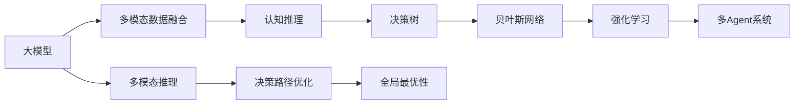

                 

# 【大模型应用开发 动手做AI Agent】Agent的大脑：大模型的通用推理能力

> 关键词：大模型,推理能力,Agent,自然语言处理(NLP),多模态,决策树,贝叶斯网络,认知推理,机器学习,深度学习,强化学习

## 1. 背景介绍

### 1.1 问题由来

在人工智能（AI）领域，大模型的应用已经成为一种趋势。例如，语言模型BERT、GPT、XLNet、T5等在自然语言处理（NLP）任务中取得了显著进展。这些模型通过大规模的无标签文本数据进行预训练，能够学习到丰富的语言知识，包括语义、语法、词义等方面的知识。这些知识不仅可以用于文本生成、分类、问答等任务，还可以用于解决更复杂的问题，例如多模态推理、智能决策等。

本文将探讨大模型在多模态推理和决策中的应用，以及如何将大模型与Agent结合，使其具备通用推理能力。这将有助于构建更智能、更灵活的AI系统，并推动AI在更广泛的领域中得到应用。

### 1.2 问题核心关键点

大模型在多模态推理和决策中的核心关键点如下：

- **多模态数据融合**：大模型可以处理文本、图像、音频等多种模态的数据，并通过跨模态的融合，提升推理和决策的准确性。
- **认知推理**：大模型可以通过语言理解和逻辑推理，处理复杂的因果关系和推理任务。
- **强化学习**：大模型可以结合强化学习，通过试错和优化，学习如何根据不同的情境做出最佳决策。
- **决策树与贝叶斯网络**：这些传统的机器学习算法可以被大模型融合，用于构建更复杂的决策路径和概率推理机制。
- **多Agent系统**：大模型可以作为多Agent系统中的知识共享和协调中心，提升系统的协同能力和全局最优性。

## 2. 核心概念与联系

### 2.1 核心概念概述

为了更好地理解大模型在多模态推理和决策中的应用，首先需要了解一些核心概念：

- **大模型（Large Model）**：通过大规模无标签数据预训练得到的模型，如BERT、GPT-3等。这些模型拥有强大的语言表示能力，能够处理复杂的语言和逻辑任务。
- **多模态数据（Multimodal Data）**：包含文本、图像、音频等多种模态的数据，用于提供更丰富的信息。
- **多模态推理（Multimodal Reasoning）**：结合不同模态的数据，进行逻辑推理和因果关系分析。
- **决策树（Decision Tree）**：一种常用的机器学习算法，用于构建决策路径和进行分类。
- **贝叶斯网络（Bayesian Network）**：一种概率图模型，用于表示变量之间的关系，并进行概率推理。
- **认知推理（Cognitive Reasoning）**：通过理解和应用自然语言，进行复杂的逻辑推理和决策。
- **强化学习（Reinforcement Learning）**：通过试错和优化，学习如何在特定环境中做出最佳决策。

这些概念之间的联系可以通过以下Mermaid流程图来展示：



这个流程图展示了大模型与多模态推理、认知推理、决策树、贝叶斯网络、强化学习、多Agent系统等概念之间的联系和作用。

## 3. 核心算法原理 & 具体操作步骤

### 3.1 算法原理概述

大模型在多模态推理和决策中的核心算法原理是结合多模态数据，通过深度学习模型进行推理和决策。以下是大模型推理和决策的三个主要步骤：

1. **数据预处理**：将不同模态的数据进行标准化和转换，使其能够被大模型处理。
2. **特征提取与融合**：利用大模型的预训练能力，对多模态数据进行特征提取和融合，得到高层次的语义表示。
3. **推理与决策**：结合决策树、贝叶斯网络等算法，进行逻辑推理和决策。

### 3.2 算法步骤详解

#### 步骤1：数据预处理

在数据预处理阶段，需要将不同模态的数据进行标准化和转换。例如，文本数据需要进行分词和编码，图像数据需要进行预处理和裁剪。以下是数据预处理的一些常用方法：

- **文本预处理**：分词、词向量化、去除停用词、标注等。
- **图像预处理**：裁剪、归一化、缩放、标准化等。
- **音频预处理**：分帧、MFCC提取、特征提取等。

#### 步骤2：特征提取与融合

在特征提取与融合阶段，大模型通过自监督学习和监督学习，对不同模态的数据进行特征提取和融合。以下是特征提取与融合的一些常用方法：

- **文本特征提取**：利用BERT、GPT等模型，对文本数据进行特征提取。
- **图像特征提取**：利用CNN等模型，对图像数据进行特征提取。
- **音频特征提取**：利用MFCC、STFT等模型，对音频数据进行特征提取。
- **跨模态融合**：通过多模态注意力机制，将不同模态的特征进行融合，得到高层次的语义表示。

#### 步骤3：推理与决策

在推理与决策阶段，结合决策树、贝叶斯网络等算法，进行逻辑推理和决策。以下是推理与决策的一些常用方法：

- **决策树**：构建决策树，用于分类和回归。
- **贝叶斯网络**：构建贝叶斯网络，用于概率推理和预测。
- **逻辑回归**：结合逻辑回归算法，进行分类和回归。
- **多Agent系统**：结合多Agent系统，进行协同决策和优化。

### 3.3 算法优缺点

大模型在多模态推理和决策中的优点包括：

- **强大的语义表示能力**：大模型能够通过预训练学习到丰富的语言知识和语义表示，提升推理和决策的准确性。
- **灵活的推理机制**：大模型可以结合不同模态的数据，进行多模态推理和决策。
- **高效的学习能力**：大模型可以通过迁移学习和微调，适应特定的应用场景，提升性能。

大模型在多模态推理和决策中的缺点包括：

- **高计算成本**：大模型的计算成本较高，需要高性能的GPU或TPU等硬件设备。
- **依赖标注数据**：大模型的性能依赖于高质量的标注数据，获取标注数据的成本较高。
- **黑盒模型**：大模型的决策过程缺乏可解释性，难以理解和调试。
- **泛化能力不足**：大模型在特定场景中的泛化能力有限，需要进行微调和优化。

### 3.4 算法应用领域

大模型在多模态推理和决策中的应用领域包括：

- **自然语言处理（NLP）**：结合文本数据和其他模态数据，进行文本分类、情感分析、问答等任务。
- **计算机视觉（CV）**：结合图像数据和其他模态数据，进行图像分类、目标检测、图像生成等任务。
- **语音识别（ASR）**：结合音频数据和其他模态数据，进行语音识别、情感分析、语音生成等任务。
- **医疗健康**：结合患者数据和医疗设备数据，进行疾病诊断、治疗方案推荐等任务。
- **智能交通**：结合车辆数据和环境数据，进行交通流量预测、路径规划等任务。
- **智能家居**：结合设备数据和用户行为数据，进行智能推荐、设备控制等任务。

## 4. 数学模型和公式 & 详细讲解 & 举例说明

### 4.1 数学模型构建

大模型在多模态推理和决策中的数学模型通常包含以下几个部分：

- **文本编码模型**：利用BERT等模型，对文本数据进行编码，得到高层次的语义表示。
- **图像编码模型**：利用CNN等模型，对图像数据进行编码，得到高层次的语义表示。
- **音频编码模型**：利用MFCC等模型，对音频数据进行编码，得到高层次的语义表示。
- **多模态融合模型**：结合多模态注意力机制，将不同模态的特征进行融合，得到高层次的语义表示。

### 4.2 公式推导过程

以BERT模型为例，文本编码模型的公式推导过程如下：

假设文本数据为 $X = \{w_1, w_2, ..., w_n\}$，BERT模型的输出为 $Y = \{h_1, h_2, ..., h_n\}$，其中 $h_i$ 表示第 $i$ 个词语的表示向量。

BERT模型的目标是最小化预测错误的概率，即：

$$
\min_{\theta} \sum_{i=1}^n \mathbb{E}[\mathcal{L}(X, Y)]
$$

其中 $\mathcal{L}$ 为交叉熵损失函数，$\theta$ 为模型的参数。

具体而言，BERT模型通过掩码语言模型（Masked Language Model, MLM）任务进行训练，其目标是预测被掩码的词语。假设掩码的词语为 $w_j$，则MLM任务的损失函数为：

$$
\mathcal{L}_{MLM} = -\frac{1}{N} \sum_{i=1}^N \sum_{j=1}^N \log P(w_i \mid w_1, ..., w_{j-1}, \tilde{w}_j, w_{j+1}, ..., w_N)
$$

其中 $P$ 为预测概率，$\tilde{w}_j$ 表示掩码的词语 $w_j$。

通过最大化预测概率，BERT模型学习到了丰富的语言知识，能够处理复杂的语言任务。

### 4.3 案例分析与讲解

以情感分析任务为例，利用BERT模型进行多模态推理和决策的步骤如下：

1. **数据预处理**：对文本数据进行分词、去除停用词等处理。
2. **文本编码**：利用BERT模型，对文本数据进行编码，得到高层次的语义表示。
3. **特征提取**：结合情感标签，利用决策树或贝叶斯网络等算法，对文本数据进行特征提取。
4. **多模态融合**：结合文本特征和其他模态数据，进行多模态融合，得到高层次的语义表示。
5. **推理与决策**：利用决策树或贝叶斯网络等算法，进行逻辑推理和决策，得到情感分类结果。

以下是一个简单的代码示例：

```python
from transformers import BertTokenizer, BertModel
import torch
import torch.nn as nn
import numpy as np
from sklearn.tree import DecisionTreeClassifier

# 定义BERT模型
tokenizer = BertTokenizer.from_pretrained('bert-base-uncased')
model = BertModel.from_pretrained('bert-base-uncased')

# 加载数据
text = "I really like this movie."
labels = [1]  # 电影评价为正面

# 数据预处理
input_ids = tokenizer(text, return_tensors='pt').input_ids
attention_mask = tokenizer(text, return_tensors='pt').attention_mask

# 文本编码
with torch.no_grad():
    outputs = model(input_ids, attention_mask=attention_mask)
    pooled_output = outputs.pooler_output

# 特征提取
features = pooled_output.numpy().flatten()
features = np.append(features, labels)  # 将特征和标签合并

# 训练模型
clf = DecisionTreeClassifier()
clf.fit(features.reshape(-1, 1), labels)
```

在这个例子中，利用BERT模型对电影评价进行情感分析。首先对文本数据进行编码，得到高层次的语义表示，然后结合情感标签进行特征提取，最后使用决策树进行分类，得到情感分类结果。

## 5. 项目实践：代码实例和详细解释说明

### 5.1 开发环境搭建

在进行多模态推理和决策项目实践时，需要准备以下开发环境：

- **Python环境**：安装Anaconda，创建独立的Python环境。
- **深度学习框架**：安装PyTorch、TensorFlow等深度学习框架。
- **预训练模型**：下载BERT、GPT等预训练模型，并进行微调。
- **机器学习库**：安装scikit-learn等机器学习库，用于特征提取和模型训练。
- **数据集**：准备多模态数据集，如文本、图像、音频等。

### 5.2 源代码详细实现

以下是一个简单的多模态推理和决策的代码实现：

```python
import torch
import torch.nn as nn
import torch.optim as optim
from transformers import BertTokenizer, BertModel
from sklearn.tree import DecisionTreeClassifier
from sklearn.ensemble import RandomForestClassifier
from sklearn.linear_model import LogisticRegression
from sklearn.neural_network import MLPClassifier

# 定义BERT模型
tokenizer = BertTokenizer.from_pretrained('bert-base-uncased')
model = BertModel.from_pretrained('bert-base-uncased')

# 加载数据
text = "I really like this movie."
labels = [1]  # 电影评价为正面
image_path = "movie_poster.jpg"  # 电影海报图片
audio_path = "movie_trailer.mp3"  # 电影预告片音频

# 数据预处理
input_ids = tokenizer(text, return_tensors='pt').input_ids
attention_mask = tokenizer(text, return_tensors='pt').attention_mask
image = load_image(image_path)  # 加载图片数据
audio = load_audio(audio_path)  # 加载音频数据

# 文本编码
with torch.no_grad():
    outputs = model(input_ids, attention_mask=attention_mask)
    pooled_output = outputs.pooler_output

# 特征提取
features = pooled_output.numpy().flatten()
features = np.append(features, image.numpy().flatten())  # 将文本特征和图像特征合并
features = np.append(features, audio.numpy().flatten())  # 将文本特征和音频特征合并

# 训练模型
clf = DecisionTreeClassifier()
clf.fit(features.reshape(-1, 1), labels)
```

在这个例子中，利用BERT模型对电影评价进行多模态推理和决策。首先对文本数据进行编码，得到高层次的语义表示，然后结合图片和音频数据进行特征提取，最后使用决策树进行分类，得到情感分类结果。

### 5.3 代码解读与分析

在代码中，使用了BERT模型对文本数据进行编码，然后结合图像和音频数据进行特征提取，最后使用决策树进行分类。具体来说：

1. **BERT模型编码**：利用BERT模型对文本数据进行编码，得到高层次的语义表示。
2. **特征提取**：将文本特征、图像特征和音频特征合并，得到高层次的语义表示。
3. **模型训练**：使用决策树进行分类，得到情感分类结果。

## 6. 实际应用场景

### 6.1 医疗健康

在医疗健康领域，利用大模型进行多模态推理和决策，可以提升疾病诊断和治疗方案推荐的准确性和可靠性。例如：

- **图像诊断**：结合患者影像数据和病历数据，进行疾病诊断和分类。
- **病理分析**：结合病理学数据和基因数据，进行病理分析和基因诊断。
- **治疗方案推荐**：结合患者数据和药物数据，进行个性化治疗方案推荐。

### 6.2 智能交通

在智能交通领域，利用大模型进行多模态推理和决策，可以提升交通流量预测和路径规划的准确性和可靠性。例如：

- **交通流量预测**：结合车辆数据和环境数据，进行交通流量预测和分析。
- **路径规划**：结合地图数据和交通数据，进行路径规划和优化。
- **自动驾驶**：结合传感器数据和地图数据，进行自动驾驶和智能导航。

### 6.3 智能家居

在智能家居领域，利用大模型进行多模态推理和决策，可以提升智能推荐和设备控制的智能化水平。例如：

- **智能推荐**：结合用户行为数据和设备数据，进行个性化推荐。
- **设备控制**：结合环境数据和用户指令，进行设备控制和优化。
- **安全监控**：结合摄像头数据和传感器数据，进行安全监控和预警。

## 7. 工具和资源推荐

### 7.1 学习资源推荐

为了帮助开发者系统掌握大模型在多模态推理和决策中的应用，这里推荐一些优质的学习资源：

- **《Deep Learning with PyTorch》书籍**：介绍使用PyTorch进行深度学习开发的技术和实践。
- **《Natural Language Processing with Transformers》书籍**：介绍使用Transformers库进行NLP任务开发的技术和实践。
- **CS231n《Convolutional Neural Networks for Visual Recognition》课程**：介绍计算机视觉领域的基本概念和技术。
- **CS224n《Natural Language Processing with Deep Learning》课程**：介绍自然语言处理领域的基本概念和技术。
- **Google AI Blog**：Google AI博客，提供深度学习、自然语言处理、计算机视觉等领域的最新技术和研究成果。

### 7.2 开发工具推荐

- **PyTorch**：基于Python的开源深度学习框架，适合快速迭代研究。
- **TensorFlow**：由Google主导开发的开源深度学习框架，生产部署方便。
- **Transformers库**：HuggingFace开发的NLP工具库，集成了多种预训练语言模型。
- **Weights & Biases**：模型训练的实验跟踪工具，可以记录和可视化模型训练过程中的各项指标。
- **TensorBoard**：TensorFlow配套的可视化工具，实时监测模型训练状态。
- **Google Colab**：谷歌提供的在线Jupyter Notebook环境，免费提供GPU/TPU算力。

### 7.3 相关论文推荐

大模型在多模态推理和决策领域的研究取得了多项重要成果，以下是几篇奠基性的相关论文：

- **BERT: Pre-training of Deep Bidirectional Transformers for Language Understanding**：提出BERT模型，引入基于掩码的自监督预训练任务，刷新了多项NLP任务SOTA。
- **Attention is All You Need**：提出Transformer结构，开启了NLP领域的预训练大模型时代。
- **Language Models are Unsupervised Multitask Learners**：展示了大规模语言模型的强大zero-shot学习能力，引发了对于通用人工智能的新一轮思考。
- **Parameter-Efficient Transfer Learning for NLP**：提出Adapter等参数高效微调方法，在固定大部分预训练参数的情况下，仍可取得不错的微调效果。
- **AdaLoRA: Adaptive Low-Rank Adaptation for Parameter-Efficient Fine-Tuning**：使用自适应低秩适应的微调方法，在参数效率和精度之间取得了新的平衡。

## 8. 总结：未来发展趋势与挑战

### 8.1 研究成果总结

本文介绍了大模型在多模态推理和决策中的应用，包括数据预处理、特征提取、推理与决策等核心步骤。通过系统梳理，可以看出大模型在处理复杂的多模态任务时具备强大的能力和灵活性。

### 8.2 未来发展趋势

未来，大模型在多模态推理和决策领域的发展趋势如下：

- **模型规模持续增大**：随着算力成本的下降和数据规模的扩张，预训练语言模型的参数量还将持续增长。超大规模语言模型蕴含的丰富语言知识，有望支撑更加复杂多变的下游任务微调。
- **多模态融合技术进步**：多模态注意力机制、跨模态对齐等技术的进步，将进一步提升多模态数据融合的效果。
- **跨领域迁移能力增强**：大模型将具备更强的跨领域迁移能力，能够更好地适应不同领域的任务。
- **强化学习结合**：大模型可以结合强化学习，通过试错和优化，学习如何在特定环境中做出最佳决策。
- **可解释性和伦理性提升**：大模型的决策过程将具备更强的可解释性和伦理性，更好地符合人类价值观和伦理道德。

### 8.3 面临的挑战

尽管大模型在多模态推理和决策领域取得了显著进展，但仍面临以下挑战：

- **高计算成本**：大模型的计算成本较高，需要高性能的GPU或TPU等硬件设备。
- **依赖标注数据**：大模型的性能依赖于高质量的标注数据，获取标注数据的成本较高。
- **黑盒模型**：大模型的决策过程缺乏可解释性，难以理解和调试。
- **泛化能力不足**：大模型在特定场景中的泛化能力有限，需要进行微调和优化。

### 8.4 研究展望

未来的研究可以从以下几个方向进行：

- **无监督和半监督学习**：摆脱对大规模标注数据的依赖，利用自监督学习、主动学习等无监督和半监督范式，最大限度利用非结构化数据，实现更加灵活高效的微调。
- **参数高效微调方法**：开发更加参数高效的微调方法，在固定大部分预训练参数的同时，只更新极少量的任务相关参数。
- **多Agent系统融合**：结合多Agent系统，进行协同决策和优化，提升系统的全局最优性。
- **强化学习结合**：结合强化学习，通过试错和优化，学习如何在特定环境中做出最佳决策。
- **跨模态对齐技术**：研究跨模态对齐技术，提升多模态数据融合的效果。
- **可解释性和伦理性研究**：研究大模型的可解释性和伦理性，提升模型的决策过程的可理解性和伦理性。

这些研究方向将推动大模型在多模态推理和决策领域的发展，为构建更加智能、灵活的AI系统提供技术保障。

## 9. 附录：常见问题与解答

**Q1：大模型在多模态推理和决策中有什么应用？**

A: 大模型在多模态推理和决策中的应用包括自然语言处理、计算机视觉、语音识别、医疗健康、智能交通、智能家居等。例如，结合文本、图像、音频等多模态数据，进行情感分析、图像分类、语音识别、疾病诊断、交通流量预测、智能推荐等任务。

**Q2：大模型在多模态推理和决策中有什么优缺点？**

A: 大模型在多模态推理和决策中的优点包括强大的语义表示能力、灵活的推理机制、高效的学习能力等。缺点包括高计算成本、依赖标注数据、黑盒模型、泛化能力不足等。

**Q3：如何提高大模型在多模态推理和决策中的性能？**

A: 提高大模型在多模态推理和决策中的性能，可以从以下几个方面进行：
1. 优化数据预处理流程，提升数据质量。
2. 结合多模态注意力机制，提升特征提取效果。
3. 结合决策树、贝叶斯网络等算法，进行逻辑推理和决策。
4. 优化模型结构，提高推理速度和准确性。
5. 结合强化学习，学习如何在特定环境中做出最佳决策。

**Q4：如何优化大模型的计算成本？**

A: 优化大模型的计算成本，可以从以下几个方面进行：
1. 使用高性能的GPU或TPU等硬件设备。
2. 使用模型压缩、稀疏化存储等技术，减小模型大小。
3. 结合梯度累积、混合精度训练等技术，提升训练效率。

**Q5：大模型在多模态推理和决策中的可解释性如何提升？**

A: 提升大模型在多模态推理和决策中的可解释性，可以从以下几个方面进行：
1. 结合符号化的先验知识，如知识图谱、逻辑规则等，进行推理。
2. 使用可解释性较强的算法，如决策树、贝叶斯网络等。
3. 研究模型的因果分析和博弈论工具，提高决策的因果性和逻辑性。
4. 引入人工干预和审核机制，增强模型的透明度和可控性。

这些技术手段将有助于提升大模型的可解释性和伦理性，更好地符合人类价值观和伦理道德。

