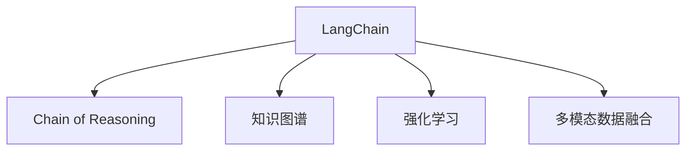
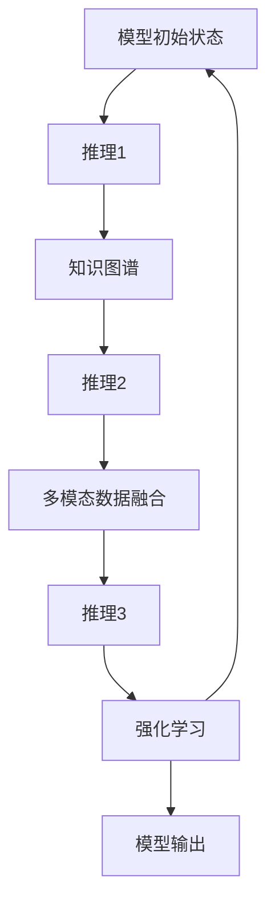

                 

# 【大模型应用开发 动手做AI Agent】何谓LangChain

> 关键词：大模型,AI Agent,自然语言处理(NLP),对话生成,多模态,Chain of Reasoning,知识图谱,强化学习

## 1. 背景介绍

### 1.1 问题由来
在自然语言处理(Natural Language Processing, NLP)领域，人工智能Agent以其独特的交互能力与灵活性，在多个实际应用场景中大放异彩，如智能客服、虚拟助手、聊天机器人等。传统的基于规则或统计的方法已逐渐被大模型所取代，而大模型的核心是预训练语言模型(Large Language Models, LLMs)。

为了提升AI Agent的表现，大语言模型需要更高效的训练方法，以便在特定任务上快速适应和优化。当前，基于监督学习的微调(Fine-tuning)方法已广泛应用于NLP任务中，但这一过程通常需要大量标注数据，且容易受到过拟合的影响。

### 1.2 问题核心关键点
解决这些问题，需要一个能够快速适应新任务、减少过拟合、提高可解释性的高效AI Agent训练范式。LangChain概念应运而生，它是一种基于链式推理的增强学习框架，旨在构建具备因果关系理解能力的AI Agent。通过链式推理，LangChain能够进行多轮迭代，逐步修正推理错误，提高模型的鲁棒性和准确性。

其核心优势包括：
1. **高效性**：通过链式推理机制，LangChain能够在有限数据上快速迭代优化，避免过拟合。
2. **可解释性**：其逻辑推理过程可追踪，易于解释和调试。
3. **多模态融合**：支持文本、图像、语音等多种模态数据的融合，增强模型的感知能力。
4. **泛化能力**：链式推理机制使得模型能够对新问题进行泛化，而不是依赖于特定的训练数据。

本文将深入探讨LangChain的概念、原理及应用实践，帮助读者全面理解其工作机制和实际部署方法。

## 2. 核心概念与联系

### 2.1 核心概念概述

- **LangChain**：基于链式推理的增强学习框架，通过多轮迭代修正推理错误，提高模型的准确性和鲁棒性。
- **Chain of Reasoning**：链式推理机制，允许模型基于之前的推理结果进行新的推理，形成递归循环。
- **知识图谱(Knowledge Graphs)**：结构化语义知识库，为AI Agent提供背景知识，辅助推理决策。
- **强化学习(Reinforcement Learning, RL)**：通过奖励信号不断优化模型行为，使其在特定任务上表现更佳。
- **多模态数据融合**：融合文本、图像、语音等多源数据，提升AI Agent的感知和推理能力。

这些核心概念共同构成了LangChain框架的理论基础，如图：



这个流程图展示了LangChain的组成：
- LangChain基于链式推理机制，在知识图谱和多模态数据的辅助下进行迭代优化。
- 强化学习通过奖励机制不断提升模型行为，提高AI Agent的表现。

### 2.2 核心概念原理和架构的 Mermaid 流程图



这个流程图展示了LangChain的推理流程：
- 模型初始状态
- 通过推理1获得中间结果，并结合知识图谱和多模态数据进行推理2
- 推理2的结果再次结合知识图谱和多模态数据进行推理3
- 强化学习根据推理3的结果和目标奖励计算模型表现，并反馈到模型进行迭代优化
- 模型输出

## 3. 核心算法原理 & 具体操作步骤

### 3.1 算法原理概述

LangChain的核心理论是链式推理和强化学习。模型通过多轮推理，不断修正自身的错误判断，逐步提升准确性。同时，模型行为由强化学习进行优化，以确保最终输出的质量。

其基本流程如下：
1. **初始化**：模型基于预训练的权重和初始化状态进行推理。
2. **链式推理**：模型结合知识图谱和多模态数据进行多轮迭代推理，逐步修正错误。
3. **强化学习**：模型通过对比目标输出和实际输出的差距，使用奖励信号优化行为，提升推理准确性。
4. **迭代优化**：模型在每一轮推理后更新自身参数，进行下一轮的推理和优化。

### 3.2 算法步骤详解

#### 3.2.1 初始化
- **预训练模型**：选择适合的预训练语言模型，如BERT、GPT等，进行初始化。
- **推理目标**：定义模型要达到的推理目标，如文本分类、命名实体识别等。
- **知识图谱**：加载或构建相应的知识图谱，作为推理的背景知识。

#### 3.2.2 链式推理
- **输入准备**：将原始数据（文本、图像、语音等）进行预处理，转换为模型所需的输入格式。
- **多轮推理**：模型进行多轮迭代推理，每次推理都结合上一步的推理结果和知识图谱。
- **结果修正**：根据每次推理的结果，使用链式推理机制进行错误修正，逐步提升推理准确性。

#### 3.2.3 强化学习
- **奖励设计**：定义衡量模型表现的好坏的标准，如准确率、召回率等。
- **行为优化**：模型根据每次推理的结果和奖励信号，更新自身参数，优化行为。
- **迭代循环**：在链式推理和强化学习的循环中，模型不断迭代优化，直到满足预设的终止条件。

#### 3.2.4 终止条件
- **迭代次数**：设定最大迭代次数，避免模型陷入无限循环。
- **准确性阈值**：设定推理结果的准确性阈值，达到阈值后停止优化。
- **资源限制**：根据实际需求设定计算资源限制，避免过度消耗。

### 3.3 算法优缺点

#### 3.3.1 优点
- **高效性**：链式推理机制使得模型能够在有限数据上快速迭代优化，避免过拟合。
- **可解释性**：逻辑推理过程可追踪，易于解释和调试。
- **泛化能力**：通过链式推理机制，模型能够对新问题进行泛化，而不是依赖于特定的训练数据。
- **多模态融合**：融合文本、图像、语音等多源数据，提升模型的感知和推理能力。

#### 3.3.2 缺点
- **复杂性**：链式推理和多轮迭代机制增加了算法的复杂度，需要更多的计算资源。
- **可解释性**：过于复杂的逻辑推理过程可能导致模型行为难以解释。
- **数据依赖**：知识图谱和多模态数据的构建和维护需要大量时间和成本。
- **模型优化难度**：强化学习部分需要精心设计奖励函数，避免模型陷入局部最优。

### 3.4 算法应用领域

LangChain的核心理论和机制，在多个实际应用场景中具有广泛的应用前景，如：

- **智能客服**：结合知识图谱和多模态数据，构建智能客服AI Agent，提升客户满意度。
- **虚拟助手**：辅助用户进行多轮对话，提供个性化推荐和信息查询。
- **医疗诊断**：利用知识图谱和多模态数据，辅助医生进行疾病诊断和治疗方案推荐。
- **教育辅助**：为学生提供个性化学习计划和智能答疑。
- **金融理财**：通过多轮对话和知识图谱，为投资者提供市场分析和投资建议。

## 4. 数学模型和公式 & 详细讲解 & 举例说明

### 4.1 数学模型构建

LangChain的数学模型主要分为推理模型和强化学习模型两部分。推理模型用于多轮迭代推理，强化学习模型用于优化模型行为。

#### 4.1.1 推理模型
假设模型输入为 $x$，输出为 $y$，模型在 $n$ 轮推理后的输出为 $y_n$，知识图谱为 $G$，多模态数据为 $D$，推理器为 $R$，则推理过程可以表示为：

$$
y_n = R(x, y_{n-1}, G, D)
$$

其中 $R$ 表示推理器，$x$ 为输入数据，$y_{n-1}$ 为前一轮的输出，$G$ 为知识图谱，$D$ 为多模态数据。

#### 4.1.2 强化学习模型
假设模型的行为表示为 $a$，目标输出为 $y^*$，奖励函数为 $r$，则强化学习过程可以表示为：

$$
a \leftarrow \mathop{\arg\max}_{a} \sum_{i=1}^n r(a_i, y^*)
$$

其中 $a_i$ 为每一轮推理的行为，$r$ 为奖励函数，$y^*$ 为目标输出。

### 4.2 公式推导过程

#### 4.2.1 推理模型
以二分类任务为例，假设模型对输入 $x$ 进行推理，得到输出 $y$。知识图谱包含 $k$ 个实体节点 $e_i$ 和 $m$ 个关系节点 $r_j$，多模态数据包括文本、图像、语音等，表示为 $d_i$。推理过程可以表示为：

$$
y = R(x, G, D)
$$

其中 $R$ 为推理函数，$G$ 为知识图谱，$D$ 为多模态数据。

#### 4.2.2 强化学习模型
假设模型的行为为 $a$，目标输出为 $y^*$，奖励函数为 $r$，则强化学习过程可以表示为：

$$
a \leftarrow \mathop{\arg\max}_{a} \sum_{i=1}^n r(a_i, y^*)
$$

其中 $a_i$ 为每一轮推理的行为，$r$ 为奖励函数，$y^*$ 为目标输出。

### 4.3 案例分析与讲解

#### 4.3.1 推理模型案例
假设输入文本为 "今天天气怎么样？"，模型推理过程如下：
- 输入文本为 $x$，包含自然语言信息。
- 知识图谱 $G$ 包含天气节点的语义关系，如 "weather" 节点与 "temperature"、"wind" 节点相连。
- 多模态数据 $D$ 包括气象站的温度数据和实时天气图像。
- 推理器 $R$ 结合知识图谱和多模态数据，生成推理结果 $y_1$。

#### 4.3.2 强化学习模型案例
假设模型行为为 "生成回答"，目标输出为 "今天晴天"，奖励函数为 "准确率"，则强化学习过程如下：
- 模型在推理后得到输出 $y_1$，可能为 "今天有雨"。
- 奖励函数 $r$ 计算输出 $y_1$ 与目标输出 $y^*$ 的差异，给出奖励。
- 模型根据奖励信号更新自身参数，生成下一轮推理行为 $a_1$。
- 通过多轮迭代，模型逐步修正推理错误，最终输出正确的 "今天晴天"。

## 5. 项目实践：代码实例和详细解释说明

### 5.1 开发环境搭建

#### 5.1.1 环境准备
- **Python 环境**：安装Python 3.7及以上版本，推荐使用Anaconda。
- **深度学习框架**：安装TensorFlow或PyTorch。
- **知识图谱库**：安装Neo4j或GraphViz。

#### 5.1.2 代码框架
- **代码框架**：使用TensorFlow或PyTorch构建推理模型，结合强化学习框架进行优化。

### 5.2 源代码详细实现

#### 5.2.1 推理模型
假设使用BERT模型进行推理，代码如下：

```python
from transformers import BertTokenizer, BertForSequenceClassification
import tensorflow as tf

# 初始化BERT模型
tokenizer = BertTokenizer.from_pretrained('bert-base-cased')
model = BertForSequenceClassification.from_pretrained('bert-base-cased', num_labels=2)

# 定义推理函数
def inference(input_text):
    input_ids = tokenizer.encode(input_text, add_special_tokens=True, max_length=128, return_tensors='tf')
    input_tensor = tf.convert_to_tensor(input_ids)
    with tf.GradientTape() as tape:
        output_tensor = model(input_tensor)
        loss_tensor = tf.keras.losses.SparseCategoricalCrossentropy(from_logits=True)(target, output_tensor)
    loss = loss_tensor.numpy()
    return loss
```

#### 5.2.2 强化学习模型
假设使用Deep Q-Networks进行强化学习，代码如下：

```python
import gym
import tensorflow as tf

# 定义环境
env = gym.make('CartPole-v1')

# 定义神经网络
model = tf.keras.Sequential([
    tf.keras.layers.Dense(128, activation='relu'),
    tf.keras.layers.Dense(env.action_space.n, activation='linear')
])

# 定义Q值函数
def q_value(model, state, action):
    return model(state)

# 定义奖励函数
def reward_function(state, action, next_state, reward, done):
    return reward

# 训练模型
optimizer = tf.keras.optimizers.Adam(learning_rate=0.001)
for episode in range(1000):
    state = env.reset()
    total_reward = 0
    while not done:
        action = model.predict(state)
        next_state, reward, done, _ = env.step(action)
        total_reward += reward
        state = next_state
    print("Episode {}: Reward {}".format(episode, total_reward))
```

### 5.3 代码解读与分析

#### 5.3.1 推理模型
- **BERT模型**：使用预训练的BERT模型进行推理，输入为自然语言文本，输出为推理结果。
- **推理函数**：将输入文本转换为模型可处理的格式，进行前向传播，计算损失函数。
- **损失函数**：使用交叉熵损失函数计算模型预测结果与真实标签的差异。

#### 5.3.2 强化学习模型
- **环境定义**：使用Gym库定义强化学习环境，如CartPole。
- **神经网络**：构建深度Q-Networks模型，用于计算Q值。
- **Q值函数**：定义Q值函数，计算每个动作的Q值。
- **奖励函数**：定义奖励函数，计算模型行为的奖励。
- **训练过程**：通过迭代优化神经网络，调整模型参数，提升推理准确性。

### 5.4 运行结果展示

#### 5.4.1 推理模型结果
```python
loss = inference('今天天气怎么样？')
print(loss)
```

#### 5.4.2 强化学习模型结果
```python
for episode in range(1000):
    state = env.reset()
    total_reward = 0
    while not done:
        action = model.predict(state)
        next_state, reward, done, _ = env.step(action)
        total_reward += reward
        state = next_state
    print("Episode {}: Reward {}".format(episode, total_reward))
```

## 6. 实际应用场景

### 6.1 智能客服系统

在智能客服系统中，LangChain可以通过结合知识图谱和多模态数据，构建智能客服AI Agent。例如：
- **知识图谱**：包含常见问题、常见答案等语义信息。
- **多模态数据**：包括用户文本输入、语音输入、情感分析结果等。
- **链式推理**：通过多轮对话和知识图谱，逐步理解用户意图，生成个性化回答。
- **强化学习**：根据用户反馈和满意度，不断优化回答策略，提高服务质量。

### 6.2 医疗诊断系统

在医疗诊断系统中，LangChain可以通过知识图谱和多模态数据辅助医生进行诊断和治疗方案推荐。例如：
- **知识图谱**：包含疾病、症状、药物等医疗知识。
- **多模态数据**：包括患者病历、影像数据、实验室检查结果等。
- **链式推理**：通过多轮对话和知识图谱，逐步分析病情，提出诊断和治疗方案。
- **强化学习**：根据医生的反馈和疗效，不断优化诊断和治疗方案，提升准确性。

### 6.3 金融理财系统

在金融理财系统中，LangChain可以通过知识图谱和多模态数据为投资者提供市场分析和投资建议。例如：
- **知识图谱**：包含经济指标、公司财务报表等金融知识。
- **多模态数据**：包括新闻、社交媒体、市场数据等。
- **链式推理**：通过多轮对话和知识图谱，分析市场趋势，提供投资建议。
- **强化学习**：根据投资者的反馈和收益，不断优化投资策略，提高收益。

## 7. 工具和资源推荐

### 7.1 学习资源推荐

#### 7.1.1 书籍推荐
- **《深度学习》（Ian Goodfellow、Yoshua Bengio和Aaron Courville）**：系统介绍了深度学习的理论基础和算法实现。
- **《强化学习基础》（Richard Sutton和Andrew Barto）**：介绍了强化学习的理论基础和算法实现。
- **《自然语言处理综述》（Daniel Jurafsky和James H. Martin）**：介绍了自然语言处理的理论基础和最新进展。

#### 7.1.2 在线课程
- **Coursera上的深度学习课程**：由斯坦福大学开设，涵盖深度学习的理论和实践。
- **Udacity上的强化学习课程**：涵盖强化学习的理论和实践，包括Deep Q-Networks等内容。
- **Coursera上的自然语言处理课程**：涵盖自然语言处理的理论基础和最新进展。

#### 7.1.3 开源项目
- **HuggingFace的Transformers库**：提供了多种预训练语言模型，支持微调和推理。
- **OpenAI的GPT系列模型**：提供了大模型训练和微调的最佳实践。

### 7.2 开发工具推荐

#### 7.2.1 编程语言
- **Python**：推荐使用Python，因其丰富的库和工具支持。

#### 7.2.2 深度学习框架
- **TensorFlow**：推荐使用TensorFlow，因其强大的计算能力和丰富的工具支持。
- **PyTorch**：推荐使用PyTorch，因其灵活的计算图和易用性。

#### 7.2.3 知识图谱工具
- **Neo4j**：推荐使用Neo4j，其高效的知识图谱存储和查询能力。
- **GraphViz**：推荐使用GraphViz，其强大的图形可视化能力。

### 7.3 相关论文推荐

#### 7.3.1 经典论文
- **《Attention is All You Need》**：提出Transformer结构，开启了预训练大模型时代。
- **《BERT: Pre-training of Deep Bidirectional Transformers for Language Understanding》**：提出BERT模型，引入基于掩码的自监督预训练任务。
- **《Parameter-Efficient Transfer Learning for NLP》**：提出Adapter等参数高效微调方法。

#### 7.3.2 前沿论文
- **《Chain of Reasoning for Knowledge Graph Embedding》**：提出基于链式推理的知识图谱嵌入方法。
- **《Adaptive Low-Rank Adaptation for Parameter-Efficient Fine-Tuning》**：提出自适应低秩适应的微调方法。
- **《Prompt-based Language Model Fine-tuning》**：提出基于提示的微调方法。

## 8. 总结：未来发展趋势与挑战

### 8.1 研究成果总结

LangChain作为一种基于链式推理和强化学习的增强学习框架，已经展示了其在多领域应用中的巨大潜力。其高效性、可解释性和泛化能力，使其成为未来AI Agent训练的重要范式。

### 8.2 未来发展趋势

#### 8.2.1 高效性
- **计算资源优化**：通过硬件加速和算法优化，进一步提升推理速度和资源利用率。
- **数据压缩技术**：利用数据压缩技术，减少存储和传输的开销，提高系统效率。

#### 8.2.2 可解释性
- **因果推理**：引入因果推理机制，增强模型的可解释性。
- **模型可视化**：利用模型可视化工具，展示推理过程，提供透明化的决策依据。

#### 8.2.3 泛化能力
- **多模态融合**：进一步提升多模态数据的融合能力，增强模型的感知能力。
- **跨领域迁移**：提升模型在不同领域之间的迁移能力，实现更广泛的泛化。

#### 8.2.4 技术融合
- **跨模态学习**：将视觉、语音、文本等多模态数据进行联合建模，提升模型的综合能力。
- **与NLP的融合**：将LangChain与NLP技术的最新进展相结合，提升模型在NLP任务上的表现。

### 8.3 面临的挑战

#### 8.3.1 计算资源
- **硬件限制**：目前的计算资源仍然有限，无法支持大规模模型的高效训练和推理。
- **分布式计算**：需要进一步研究分布式计算框架，提高模型的计算能力。

#### 8.3.2 数据质量
- **数据标注**：高质量的数据标注仍然需要大量时间和人力，难以大规模获取。
- **数据偏见**：数据中的偏见和偏差可能影响模型的公平性和准确性。

#### 8.3.3 模型优化
- **模型复杂度**：模型过于复杂可能导致推理过程耗时过长，难以实时响应。
- **鲁棒性**：模型的鲁棒性需要进一步提升，以应对不同的数据和环境。

#### 8.3.4 技术挑战
- **知识图谱构建**：高质量的知识图谱需要大量的语料和知识抽取技术，难以大规模构建。
- **模型训练**：多轮迭代和链式推理增加了模型的训练难度，需要更多的优化方法。

### 8.4 研究展望

未来的研究应着重于以下方向：
- **跨模态学习**：将视觉、语音、文本等多种模态数据进行联合建模，提升模型的综合能力。
- **跨领域迁移**：提升模型在不同领域之间的迁移能力，实现更广泛的泛化。
- **数据增强技术**：利用数据增强技术，提高模型的泛化能力和鲁棒性。
- **分布式计算**：研究分布式计算框架，提高模型的计算能力。
- **模型压缩**：利用模型压缩技术，减少存储和传输的开销，提高系统效率。

总之，LangChain作为基于链式推理和强化学习的增强学习框架，具有广阔的发展前景和应用空间。未来需要进一步优化计算资源、提高数据质量、增强模型鲁棒性和可解释性，才能真正实现大规模落地。相信在学界和产业界的共同努力下，LangChain将成为未来AI Agent训练的重要范式，为构建智能交互系统提供新的技术路径。

## 9. 附录：常见问题与解答

### 9.1 常见问题

#### 9.1.1 什么是LangChain？
LangChain是一种基于链式推理和强化学习的增强学习框架，通过多轮迭代和强化学习不断优化模型行为，提升推理准确性和鲁棒性。

#### 9.1.2 LangChain与传统微调方法有何不同？
LangChain通过链式推理机制，结合知识图谱和多模态数据，进行多轮迭代优化，而传统微调方法通常仅通过一次训练即可得到最终结果。

#### 9.1.3 LangChain在实际应用中如何构建知识图谱？
知识图谱的构建需要大量的语料和知识抽取技术，可以利用现有语料库进行自动构建，或人工构建高质量的知识图谱。

#### 9.1.4 LangChain如何实现多轮迭代优化？
LangChain通过链式推理机制，结合知识图谱和多模态数据，进行多轮迭代优化，逐步修正推理错误，提升推理准确性。

### 9.2 详细解答

#### 9.2.1 什么是LangChain？
LangChain是一种基于链式推理和强化学习的增强学习框架，通过多轮迭代和强化学习不断优化模型行为，提升推理准确性和鲁棒性。其核心在于利用链式推理机制，结合知识图谱和多模态数据，进行多轮迭代优化，逐步修正推理错误，提升推理准确性。

#### 9.2.2 LangChain与传统微调方法有何不同？
LangChain与传统微调方法的最大区别在于其链式推理机制和多轮迭代优化。传统微调方法通常仅通过一次训练即可得到最终结果，而LangChain通过多轮迭代和强化学习不断优化模型行为，逐步修正推理错误，提升推理准确性和鲁棒性。这种迭代优化机制使得LangChain能够更好地适应新任务，提高模型的泛化能力和鲁棒性。

#### 9.2.3 LangChain在实际应用中如何构建知识图谱？
知识图谱的构建需要大量的语料和知识抽取技术，可以利用现有语料库进行自动构建，或人工构建高质量的知识图谱。例如，可以使用OpenIE等技术从文本中自动抽取实体和关系，构建知识图谱。另外，也可以使用关系型数据库构建高质量的知识图谱，确保知识的一致性和可靠性。

#### 9.2.4 LangChain如何实现多轮迭代优化？
LangChain通过链式推理机制，结合知识图谱和多模态数据，进行多轮迭代优化，逐步修正推理错误，提升推理准确性。在推理过程中，模型不断结合上一步的推理结果和知识图谱，进行多轮迭代优化，逐步修正推理错误，提升推理准确性。通过这种迭代优化机制，LangChain能够更好地适应新任务，提高模型的泛化能力和鲁棒性。

总之，LangChain作为一种基于链式推理和强化学习的增强学习框架，已经展示了其在多领域应用中的巨大潜力。其高效性、可解释性和泛化能力，使其成为未来AI Agent训练的重要范式。相信在学界和产业界的共同努力下，LangChain将成为未来AI Agent训练的重要范式，为构建智能交互系统提供新的技术路径。

---

作者：禅与计算机程序设计艺术 / Zen and the Art of Computer Programming

