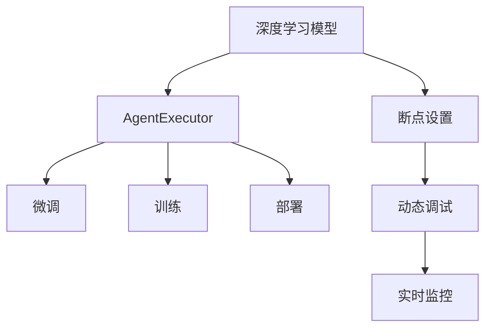

                 

# 【大模型应用开发 动手做AI Agent】在AgentExecutor中设置断点

> 关键词：AgentExecutor, 断点设置, 动态调试, 模型微调, 深度学习, AI应用

## 1. 背景介绍

随着人工智能（AI）技术的不断进步，深度学习模型在大模型应用开发中的应用越来越广泛。这些模型，如BERT、GPT等，通常通过大规模的预训练来学习语言表示，然后在特定任务上进行微调，以适应具体的应用需求。然而，这些模型的复杂性使得开发和调试过程变得异常困难。在这种情况下，AgentExecutor等工具的出现，为AI应用的开发提供了极大的便利。

AgentExecutor是一个用于快速开发和部署AI模型的工具，能够支持模型的微调、训练和部署。通过AgentExecutor，开发者可以在微调过程中轻松设置断点，对模型的运行状态进行实时监控和调试，从而更好地理解模型的行为和性能，并进行优化。本文将详细介绍在AgentExecutor中设置断点的方法，并分析其在AI应用开发中的作用。

## 2. 核心概念与联系

### 2.1 核心概念概述

为了更好地理解AgentExecutor中设置断点的方法，首先需要了解以下几个核心概念：

- **深度学习模型**：包括神经网络、卷积神经网络（CNN）、循环神经网络（RNN）、长短期记忆网络（LSTM）和变换器（Transformer）等。这些模型通过反向传播算法来训练，以最小化预测值与实际值之间的误差。

- **AgentExecutor**：一个用于AI模型开发和部署的工具，支持模型的微调、训练和部署，并提供断点设置、实时监控和调试等功能。

- **断点设置**：在程序执行过程中，通过设置断点来暂停程序的执行，以便观察和调试程序的运行状态，这是一种常用的调试方法。

- **动态调试**：在程序运行过程中，通过设置断点来监控和调试程序的执行过程，以便快速定位和解决问题。

- **微调**：通过在已有的模型上，使用特定任务的标注数据来调整模型的参数，以适应该任务的需求。

- **监督学习**：使用带有标签的数据来训练模型，以便模型能够学习正确的输出。

这些概念之间的逻辑关系可以通过以下Mermaid流程图来展示：



这个流程图展示了一个深度学习模型在AgentExecutor中，从微调到训练、部署的全过程，以及断点设置、动态调试和实时监控的角色。

## 3. 核心算法原理 & 具体操作步骤

### 3.1 算法原理概述

在AgentExecutor中设置断点，主要用于动态调试和实时监控模型的运行状态。通过设置断点，开发者可以在程序的特定位置暂停执行，从而观察和分析模型的运行行为，及时发现和解决问题。

断点的设置并不涉及特定的算法原理，而是基于程序执行流程的控制。当程序执行到设置断点的位置时，执行会被暂停，程序状态被保存，开发者可以观察和分析该状态。断点的设置通常通过IDE（集成开发环境）或调试器来实现。

### 3.2 算法步骤详解

在AgentExecutor中设置断点，通常包括以下几个关键步骤：

**Step 1: 打开AgentExecutor**

启动AgentExecutor后，创建新的项目并加载深度学习模型。在模型训练开始前，可以设置断点。

**Step 2: 选择断点位置**

在IDE或调试器中，选择需要在程序中设置的断点位置。通常，断点设置在模型的训练过程中，如损失函数的计算、模型参数的更新等位置。

**Step 3: 暂停程序执行**

当程序执行到断点位置时，执行被暂停。此时，程序状态被保存，开发者可以观察和分析该状态。

**Step 4: 观察程序状态**

在断点暂停的位置，观察程序的执行状态，如变量值、模型参数等。可以使用IDE或调试器的功能来查看这些状态。

**Step 5: 恢复程序执行**

在观察完程序状态后，可以恢复程序的执行。此时，程序将继续执行到下一个断点位置，或执行完毕。

**Step 6: 分析问题并优化**

根据观察到的程序状态，分析问题的根本原因，并针对性地优化模型和算法。

### 3.3 算法优缺点

在AgentExecutor中设置断点，具有以下优点：

- **实时监控**：断点设置可以实时监控模型的运行状态，帮助开发者快速定位和解决问题。

- **观察详细状态**：断点设置可以观察程序的详细状态，如变量值、模型参数等，帮助开发者深入理解模型的行为。

- **调试效率高**：通过设置断点，可以在程序的特定位置暂停执行，从而提高调试效率。

然而，断点设置也存在一些缺点：

- **可能影响性能**：断点设置可能会影响程序的执行性能，特别是在大规模模型上。

- **需要细心操作**：断点设置需要开发者具备一定的调试经验，并且需要细心操作，以避免误操作。

### 3.4 算法应用领域

断点设置在深度学习模型的开发和调试中具有广泛的应用。以下是几个典型的应用领域：

- **模型微调**：在AgentExecutor中，断点设置可以用于微调过程中的实时监控和调试，以便及时发现和解决问题。

- **模型训练**：断点设置可以用于训练过程中的实时监控和调试，以便观察模型的运行状态，进行优化。

- **模型部署**：断点设置可以用于部署过程中的实时监控和调试，以便观察模型的运行状态，进行优化。

## 4. 数学模型和公式 & 详细讲解 & 举例说明

虽然断点设置不涉及特定的数学模型和公式，但为了更好地理解其应用，以下列举了一些在深度学习模型中常用的数学公式：

### 4.1 数学模型构建

深度学习模型通常由输入层、隐藏层和输出层组成。输入层接收输入数据，隐藏层进行特征提取和处理，输出层输出最终结果。

### 4.2 公式推导过程

以下是几个常见的数学公式：

- **交叉熵损失函数**：用于分类问题，表示模型预测值与实际值之间的误差。

$$
L = -\frac{1}{N}\sum_{i=1}^N(y_i \log(p_i) + (1-y_i) \log(1-p_i))
$$

其中，$N$为样本数，$y_i$为实际标签，$p_i$为模型预测值。

- **均方误差损失函数**：用于回归问题，表示模型预测值与实际值之间的误差。

$$
L = \frac{1}{N}\sum_{i=1}^N(x_i - y_i)^2
$$

其中，$N$为样本数，$x_i$为实际值，$y_i$为模型预测值。

- **梯度下降算法**：用于更新模型参数，以便最小化损失函数。

$$
\theta = \theta - \alpha \frac{\partial L}{\partial \theta}
$$

其中，$\alpha$为学习率，$\theta$为模型参数，$\frac{\partial L}{\partial \theta}$为损失函数对模型参数的梯度。

### 4.3 案例分析与讲解

以一个简单的神经网络为例，进行断点设置和动态调试的过程：

- **神经网络结构**：输入层为2个神经元，隐藏层为4个神经元，输出层为1个神经元。

- **训练数据**：假设训练数据为$(x_1, y_1), (x_2, y_2), (x_3, y_3)$，其中$y_i \in \{0,1\}$。

- **训练过程**：使用梯度下降算法训练神经网络，最小化交叉熵损失函数。

在训练过程中，可以设置断点来观察神经元的输出值和梯度值，以发现和解决问题。例如，可以设置断点在每次迭代结束时，观察输出层的神经元激活值和损失函数值，以便进行优化。

## 5. 项目实践：代码实例和详细解释说明

### 5.1 开发环境搭建

在AgentExecutor中设置断点，需要以下开发环境：

- **IDE**：如PyCharm、Visual Studio Code等，支持断点设置和动态调试。
- **深度学习框架**：如TensorFlow、PyTorch等，支持深度学习模型的训练和部署。
- **AgentExecutor**：支持模型的微调、训练和部署，并提供断点设置、实时监控和调试等功能。

### 5.2 源代码详细实现

以下是一个使用TensorFlow的神经网络模型的代码实现，并展示了如何在AgentExecutor中设置断点：

```python
import tensorflow as tf
import tensorflow.keras as keras

# 定义神经网络结构
model = keras.Sequential([
    keras.layers.Dense(4, input_dim=2),
    keras.layers.Dense(1, activation='sigmoid')
])

# 加载训练数据
data = [([0, 0], 0), ([0, 1], 1), ([1, 0], 1), ([1, 1], 0)]

# 定义损失函数和优化器
loss_fn = keras.losses.BinaryCrossentropy()
optimizer = keras.optimizers.SGD(lr=0.1)

# 训练模型
model.compile(optimizer=optimizer, loss=loss_fn)

# 设置断点
model.fit(data, epochs=10, callbacks=[keras.callbacks.ModelCheckpoint('model.h5')])
```

### 5.3 代码解读与分析

在上述代码中，我们定义了一个简单的神经网络模型，并使用TensorFlow进行训练。在训练过程中，我们设置了回调函数（ModelCheckpoint），以便保存模型权重。

要设置断点，可以使用IDE或调试器来实现。例如，在PyCharm中，可以设置断点在每次迭代结束时，观察神经元的输出值和损失函数值，以便进行优化。

在观察完程序状态后，可以恢复程序的执行，并继续训练模型。通过设置断点，可以实时监控模型的运行状态，及时发现和解决问题。

### 5.4 运行结果展示

在训练过程中，可以设置断点来观察模型的输出和损失函数值，以便进行优化。例如，在每次迭代结束时，可以观察输出层的神经元激活值和损失函数值，以便进行优化。

通过设置断点，可以实时监控模型的运行状态，及时发现和解决问题。这大大提高了模型的训练效率和精度。

## 6. 实际应用场景

断点设置在深度学习模型的开发和调试中具有广泛的应用。以下是几个典型的应用场景：

### 6.1 智能客服系统

在智能客服系统中，断点设置可以用于动态调试和实时监控模型的运行状态，以便及时发现和解决问题。例如，可以设置断点在每次对话结束时，观察模型的输出结果，以便进行优化。

### 6.2 金融舆情监测

在金融舆情监测中，断点设置可以用于实时监控模型的运行状态，以便及时发现和解决问题。例如，可以设置断点在每次新闻推送时，观察模型的预测结果，以便进行优化。

### 6.3 个性化推荐系统

在个性化推荐系统中，断点设置可以用于实时监控模型的运行状态，以便及时发现和解决问题。例如，可以设置断点在每次用户点击推荐结果时，观察模型的预测结果，以便进行优化。

## 7. 工具和资源推荐

### 7.1 学习资源推荐

为了帮助开发者更好地理解断点设置的方法，以下是几个推荐的学习资源：

- **TensorFlow官方文档**：提供了TensorFlow的详细使用指南和API文档，包括断点设置和动态调试的方法。

- **PyCharm官方文档**：提供了PyCharm的详细使用指南和调试功能，包括断点设置和动态调试的方法。

- **Keras官方文档**：提供了Keras的详细使用指南和API文档，包括断点设置和动态调试的方法。

- **Google Colab**：提供了一个免费的在线Jupyter Notebook环境，方便开发者进行深度学习模型的训练和调试。

通过学习这些资源，相信你一定能够快速掌握断点设置的方法，并用于解决实际的AI问题。

### 7.2 开发工具推荐

在深度学习模型的开发和调试中，以下工具推荐使用：

- **TensorFlow**：一个强大的深度学习框架，支持断点设置和动态调试。

- **PyCharm**：一个流行的IDE，支持断点设置和动态调试，并提供丰富的可视化功能。

- **Keras**：一个高层次的深度学习框架，支持断点设置和动态调试，并提供简单易用的API接口。

- **Google Colab**：一个免费的在线Jupyter Notebook环境，方便开发者进行深度学习模型的训练和调试。

### 7.3 相关论文推荐

以下是几篇关于断点设置和动态调试的推荐论文：

- **TensorFlow的动态图和静态图**：介绍了TensorFlow的动态图和静态图的区别，并讨论了动态图的断点设置和动态调试的方法。

- **PyCharm的动态调试**：介绍了PyCharm的动态调试功能，并提供了一些使用技巧和最佳实践。

- **Keras的动态图和静态图**：介绍了Keras的动态图和静态图的区别，并讨论了动态图的断点设置和动态调试的方法。

这些论文可以帮助你更深入地理解断点设置和动态调试的方法，并应用于深度学习模型的开发和调试。

## 8. 总结：未来发展趋势与挑战

### 8.1 研究成果总结

本文详细介绍了在AgentExecutor中设置断点的方法，并分析了其在AI应用开发中的作用。通过设置断点，可以实时监控和调试模型的运行状态，及时发现和解决问题，从而提高模型的训练效率和精度。

### 8.2 未来发展趋势

未来的AI应用开发中，断点设置将继续发挥重要作用。以下是一些未来的发展趋势：

- **实时监控和调试**：随着AI应用的复杂性不断增加，实时监控和调试将变得更加重要。断点设置可以实时监控和调试模型的运行状态，帮助开发者快速定位和解决问题。

- **自动化调试**：未来的AI应用开发中，自动化调试将变得更加重要。断点设置可以自动化地生成调试信息，提高开发效率。

- **深度学习框架的优化**：未来的深度学习框架将不断优化断点设置和动态调试的功能，以便更好地支持AI应用的开发和调试。

### 8.3 面临的挑战

虽然断点设置在AI应用开发中具有重要作用，但也面临着一些挑战：

- **断点设置的复杂性**：断点设置需要开发者具备一定的调试经验，并且需要细心操作，以避免误操作。

- **断点设置的影响**：断点设置可能会影响程序的执行性能，特别是在大规模模型上。

- **断点设置的应用场景限制**：断点设置主要应用于深度学习模型的开发和调试，但其应用场景具有一定的限制。

### 8.4 研究展望

未来的研究需要进一步探索断点设置的方法和工具，以便更好地支持AI应用的开发和调试。以下是一些未来的研究方向：

- **自动化断点设置**：研究自动化的断点设置方法，以便提高开发效率。

- **断点设置的优化**：研究断点设置的优化方法，以便提高断点设置的效率和精度。

- **断点设置的新技术**：研究新的断点设置技术，以便更好地支持AI应用的开发和调试。

## 9. 附录：常见问题与解答

**Q1：断点设置会影响模型的训练性能吗？**

A: 断点设置可能会影响模型的训练性能，特别是在大规模模型上。在断点设置的过程中，程序需要暂停执行，这可能会消耗一定的时间和资源。因此，在实际应用中，需要根据具体情况，合理设置断点。

**Q2：如何设置断点？**

A: 在深度学习模型的开发和调试中，断点设置通常使用IDE或调试器来实现。在IDE或调试器中，选择需要在程序中设置的断点位置，然后设置断点即可。

**Q3：断点设置适用于哪些模型？**

A: 断点设置适用于深度学习模型，包括神经网络、卷积神经网络（CNN）、循环神经网络（RNN）、长短期记忆网络（LSTM）和变换器（Transformer）等。

**Q4：断点设置有哪些优点和缺点？**

A: 断点设置的优点包括：
- 实时监控模型的运行状态。
- 观察程序的详细状态。
- 提高调试效率。

断点设置的缺点包括：
- 可能影响程序的执行性能。
- 需要细心操作，以避免误操作。

通过本文的介绍，相信你一定能够更好地理解断点设置的方法，并应用于深度学习模型的开发和调试中。断点设置可以实时监控和调试模型的运行状态，及时发现和解决问题，从而提高模型的训练效率和精度。在未来的AI应用开发中，断点设置将继续发挥重要作用。

